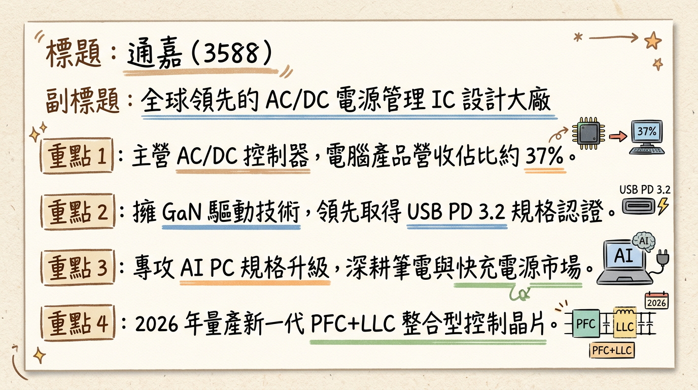
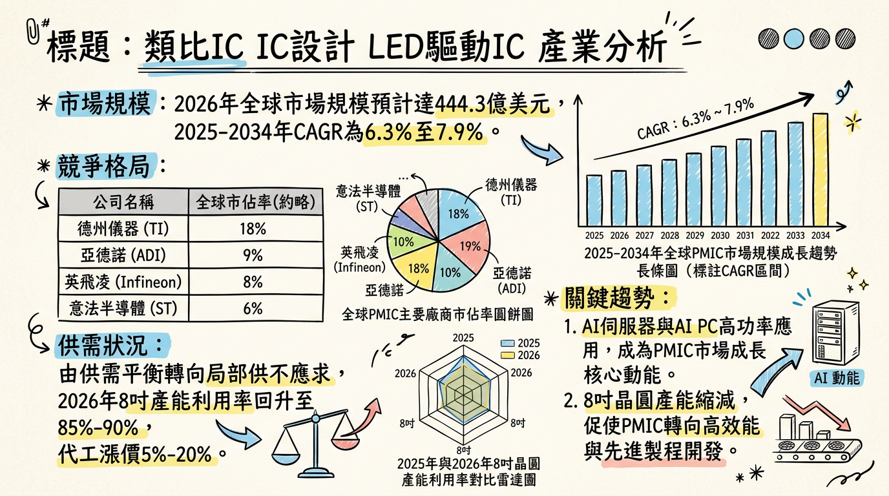
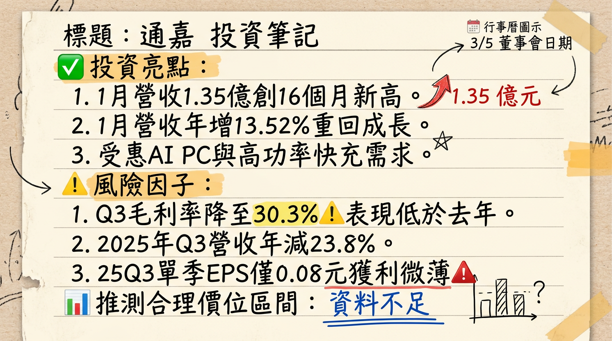

# 3588 通嘉 深度研究報告

## 一句話摘要
通嘉（3588）正處於由消費性電子轉型至 **AI PC 與高功率 PD 3.2** 的陣痛期，2025 年獲利受毛利重挫觸底，但 2026 年 1 月營收創 16 個月新高，營運出現谷底回升訊號。

---

## 公司概覽
通嘉（Leadtrend）為台灣 AC/DC 電源管理 IC 設計領先廠商，專注於電源轉換與控制解決方案，產品廣泛應用於筆電、手機快充及消費性電子。

### 業務與產品線結構
| 業務類別 | 營收佔比 (2025Q1) | 核心產品 / 應用 | 發展重點 |
| :--- | :--- | :--- | :--- |
| **電腦類 (Computer)** | **37%** | PWM IC、同步整流 IC、USB-PD | 受惠 AI PC 規格升級，佔比持續提升 |
| **消費性電子** | **35% - 36%** | 適配器、充電器控制 IC | 需求穩定，但受價格戰競爭壓力大 |
| **通訊類** | **25%** | 網通設備電源管理 | 受中國本土化政策影響，佔比略降 |
| **其他** | 2% - 3% | 工業、其他電源應用 | 布局中大功率市場 |

---

## 核心競爭優勢
1.  **領先的認證優勢：** 率先取得 **USB PD 3.2 認證**（型號 LD6615x2），在高階快充市場具備先行者地位。
2.  **整合技術能力：** 具備高壓 AC/DC 整合技術，並推出 **GaN（氮化鎵）驅動整合 IC**（如 AHB 控制器），能有效縮小電源適配器體積。
3.  **產品組合轉型：** 成功切入中大功率市場（PFC+LLC 整合控制器），並將重心從低毛利的消費性電子轉向高單價的 AI PC 供應鏈。

---

## 財務分析

### 近期月營收趨勢表
| 月份 | 營收 (億元) | 月增率 (MoM) | 年增率 (YoY) | 備註 |
| :--- | :--- | :--- | :--- | :--- |
| **2026/01** | **1.35** | **+12.52%** | **+13.52%** | **創 16 個月新高** |
| 2025/12 | 1.20 | -1.60% | +13.63% | 回溫趨勢確立 |
| 2025/11 | 1.22 | - | - | 表現持平 |
| 2025/10 | 1.15 | - | - | 庫存去化中 |
| 2025/09 | 1.08 | - | - | 營運低谷 |
| 2025/08 | 1.05 | - | - | 營運低谷 |

### 年度 EPS 與趨勢
*   **2024 全年（實際）：** 1.89 元
*   **2025 全年（預估）：** 0.45 - 0.50 元（受毛利下滑影響大幅衰退）
*   **2026 全年（預估）：** **1.35 元**（受惠 AI PC 換機潮與產品組合優化）

---

## 法說會重點（2025/12/11）
1.  **訂單能見度：** 客戶下單保守，目前以「短單與急單」為主，能見度有限。
2.  **新產品進度：** 2026 上半年將量產 LLC、HB Interleaved PFC 等中大功率新產品。
3.  **獲利挑戰：** 坦言新台幣升值對毛利造成巨大壓力，新台幣每升 1% 影響毛利率約 0.3%-1.1%。
4.  **產能狀況：** 產能利用率維持在 60-65% 低檔，無大規模擴產計畫，專注於研發支出。

---

## 券商觀點

| 券商名稱 | 報告日期 | 目標價 (TWD) | 評等 | 備註 |
| :--- | :--- | :--- | :--- | :--- |
| **國泰證券** | 2026/02/10 | **55.0** | 區間操作 | 看好 2026 營收重回成長 |
| **富邦證券** | 2025/12/12 | **52.0** | 維持中立 | 毛利下滑壓力仍存 |
| **中信投顧** | 2025/11/15 | **48.0** | ⚠️過時 / 持有 | 基於 2025Q3 財報不佳 |
| **CMoney** | 2025/08/17 | **86.0** | ⚠️顯著失效 | 當時對 AI 成長過度樂觀 |

---

## 財報深度分析

### 利潤率趨勢表格
| 期間 | 毛利率 (%) | 營業利益率 (%) | EPS (元) | 狀態說明 |
| :--- | :--- | :--- | :--- | :--- |
| **2025 Q3** | **30.3%** | -2.8% | 0.08 | 毛利重挫，本業轉虧 |
| 2025 Q2 | 38.0% | 5.9% | 0.03 | 維持高毛利但稅後低 |
| 2025 Q1 | 36.1% | 3.5% | 0.27 | 表現相對穩健 |
| 2024 Q3 | 38.1% | 11.1% | 0.76 | 近兩年獲利高峰 |

### 營運指標分析
*   **存貨分析：** 2025 Q3 存貨周轉天數為 **251.8 天**，雖較 2023 年（>500 天）大幅改善，但仍遠高於產業健康水位。
*   **資本支出：** 2025Q3 單季僅 885.7 萬元，主要用於研發設備。
*   **負債比率：** 財務結構尚稱穩健，但現金流受獲利衰退影響趨於嚴謹。

---

## 股權異動
*   **2025/11：** 經理人余淑薇（6張）、周烱峰（18張）申報轉讓，性質為「限制型股票信託」。
*   **2025/07：** 配發 1.198 元現金股利及 0.2 元股票股利，展現穩定配息意願。
*   **資本計畫：** 目前查無可轉債 (CB) 或現金增資計畫，資本結構穩定。

---

## 產業分析

### 全球 PMIC 市場與競爭格局
| 廠商 | 市佔率 | 優勢與定位 |
| :--- | :--- | :--- |
| **TI (德州儀器)** | ~20% | 12 吋廠產能優勢，價格戰主要發動者 |
| **MPS** | - | 高階工業與車用 PMIC 領導者 |
| **通嘉 (3588)** | **微小** | **高性價比、USB PD 3.2 先行者** |
| **茂達 (6138)** | - | AI PC 主要受惠者，營收規模較大 |

### 產業趨勢
*   **8 吋代工漲價：** 2026 年預計 8 吋晶圓利用率回升至 85%-90%，代工費可能調漲 5%-20%，對通嘉毛利形成考驗。
*   **AI PC 換機潮：** 帶動 PMIC 從 65W 向 100W-240W 升級，單機產值（Content Value）增加 30%-50%。

---

## 近期催化劑
*   **利多事件：**
    1.  2026/01 營收亮眼，顯示下游去庫存結束及 AI PC 需求顯現。
    2.  2026/03/05 董事會：關注 2025Q4 財報能否止損及 2026 股利政策。
    3.  歐盟全面落實 USB-C 標準，帶動 Type-C 快充換機潮。
*   **利空事件：**
    1.  TI 持續擴產導致中低階產品價格戰未歇。
    2.  毛利率 30.3% 為近期低點，回升速度若慢於預期將壓抑股價。

---

## ⭐ 成長動能時間軸
*   **2025 Q4 (已發生)：** 中大功率 LLC、HB PFC 新產品成功切入 AI 伺服器電源次側應用。
*   **2026 Q1 (正在進行)：** **1.35 億元營收月報公告**，確認營運重回年成長軌道。
*   **2026/03/05：** 董事會審核 2025 財報，將是 2026 營運轉折的重要風向球。
*   **2026 H1：** 推廣 **140W 及 240W PD 快充方案**，主攻電競筆電與戶外儲能市場。
*   **2026 全年：** AI PC 市場規模化出貨，帶動通嘉 Computer 產品線佔比挑戰 40% 以上。

---

## 2026 展望
*   **成長動能：** AI PC 換機潮對高單價 PMIC 需求帶動，以及中大功率新產品貢獻。
*   **風險：** 晶圓代工成本上漲、新台幣強勢、消費性電子需求復甦緩慢。

---

## 投資結論
1.  **獲利觸底回升：** 2025 年為獲利谷底（EPS ~0.5元），2026 年在 AI PC 帶動下，EPS 有望倍增至 1.35 元。
2.  **營收先行：** 1 月營收已展現強勁動能，若 Q1 毛利率能回升至 35% 以上，估值有上修空間。
3.  **評價中性偏多：** 目前股價位於 50-60 元波動，相較 2026 年 EPS 的本益比約 40-45 倍，處於 IC 設計族群正常區間。
4.  **建議區間：** **目標價建議 52 - 58 元**，適合在 45-48 元附近逢低布局，等待毛利率好轉訊號。

---
本報告由 AI 自動產生，資料來源為公開網路資訊，僅供參考，不構成投資建議。產生時間：2026-03-01 03:53

---

## 📊 資訊卡

