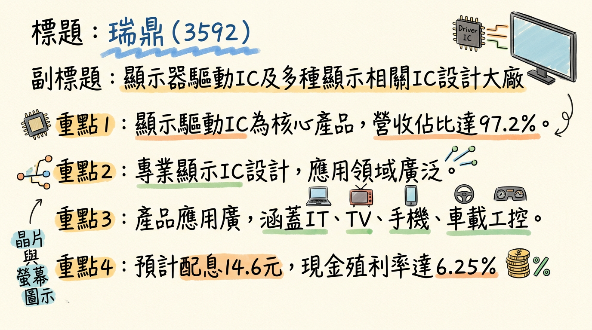
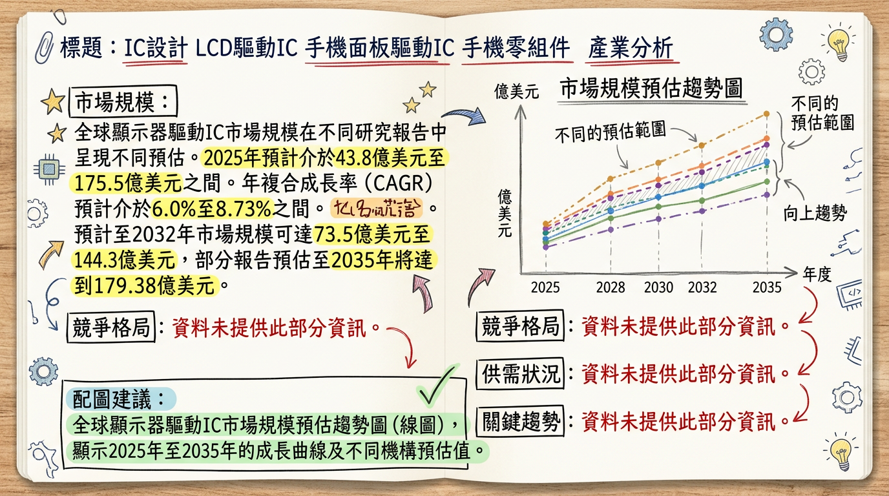
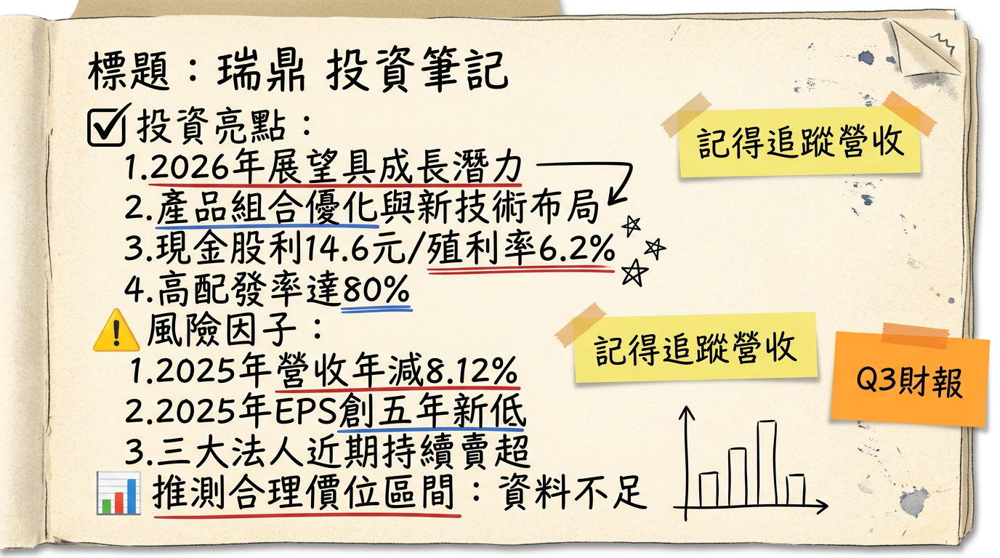

# 3592 瑞鼎 深度研究報告

## 一句話摘要

瑞鼎（3592）作為顯示器驅動IC設計大廠，2025年受整體產業淡季與ASP侵蝕影響，獲利承壓，但展望2026年，在折疊手機DDIC用量翻倍、IT OLED產品下半年放量及車載/工控新客戶與ISO 26262認證雙重驅動下，營運預期將重拾成長動能，產品組合優化有望帶動毛利率回升。

## 公司概覽

瑞鼎（3592）是一家IC設計公司，主要從事顯示器驅動IC、觸控IC、時序控制IC與電源管理IC的研究、開發、設計、生產、製造及銷售。其產品應用廣泛，涵蓋大尺寸顯示器（IT、TV）、中小尺寸AMOLED顯示器（智慧型手機、穿戴裝置）以及車載與工控應用。作為IC設計公司，瑞鼎不擁有自有晶圓廠，而是委託晶圓代工廠生產。

### 營收結構

| 業務類別         | 營收佔比 (%) |
| :--------------- | :----------- |
| 顯示器驅動IC     | 97.2         |
| 其他營運事業部   | 2.8          |

## 核心競爭優勢

1.  **多元產品線與應用領域深耕：** 瑞鼎涵蓋大、中小尺寸顯示驅動IC、觸控IC、時序控制IC與電源管理IC，產品廣泛應用於IT、TV、智慧型手機、穿戴裝置、車載及工控，有助於分散市場風險。
2.  **AMOLED與高階技術佈局：** 在中小尺寸AMOLED驅動IC市場擁有成熟技術，並積極拓展折疊手機、IT OLED等高單價、高技術門檻應用，搶佔市場先機。
3.  **車用市場認證與拓展：** 積極佈局車載與工控驅動IC市場，並已取得ISO 26262 ASIL-B Ready產品驗證，強化其在具高門檻、高毛利率車用市場的競爭力。
4.  **持續技術創新：** 自主研發的Micro LED穿戴式顯示驅動IC已導入品牌客戶並量產，顯示其在下一代顯示技術的投入與領先性。
5.  **高殖利率題材：** 2025年擬配發現金股利每股14.6元，以2026年2月24日收盤價計算，現金殖利率約6.25%，對長期投資者具吸引力。

## 財務分析

### 月營收趨勢

| 月份    | 金額 (億新台幣) | 月增率 (MoM) | 年增率 (YoY) |
| :------ | :-------------- | :----------- | :----------- |
| 2026年1月 | 17.68           | -0.58%       | -8.19%       |
| 2025年12月 | 17.78           | -1.42%       | -5.49%       |
| 2025年11月 | 18.04           | 5.38%        | -0.83%       |
| 2025年10月 | 17.12           | -3.99%       | -13.90%      |
| 2025年9月 | 17.83           | -1.03%       | -15.00%      |
| 2025年8月 | 18.02           | -2.23%       | -11.40%      |

### 季度與年度數據

*   **2025年第四季 (Q4)：**
    *   季營收：52.9396億元，季減2.45%，年減6.94%。
    *   毛利率：29.04%。
    *   營業利益率：5.17% (營業利益2.7億元)。
    *   每股純益 (EPS)：4.15元。
*   **2025年 (實際)：**
    *   全年合併營收：223.9717億元，年減8.12%。
    *   稅後淨利：13.8億元，年減34.1%，為近五年新低。
    *   每股純益 (EPS)：18.24元。
*   **2024年 (實際)：**
    *   全年合併營收：243.77億元。
    *   每股純益 (EPS)：27.67元。

## 法說會重點 (2026年2月24日/25日)

*   **整體產業展望：** 2026年第一季產業仍處於傳統淡季，DDI IC整體需求轉弱，傳統淡旺季的評估方式已不適用。
*   **中小尺寸驅動IC：** 需求依然疲弱，尚未見到明顯復甦訊號。智慧手機需求受記憶體價格上漲影響，客戶備貨態度保守，拉貨動能偏弱。
*   **大尺寸驅動IC：** 因客戶庫存調節告一段落及新產品推出，加上部分客戶提前備貨，需求動能較強。IT與電視應用較強勁，桌上型顯示器與筆記型電腦品牌廠要求供應鏈提前備貨。
*   **穿戴產品：** 在客戶滲透率持續提升與擴大應用場景帶動下，出貨動能可望延續。
*   **車載與工控驅動IC：** 需求預期維持穩健，因客戶前期備貨階段告一段落，需求表現大致持平。
*   **2026年第一季營運展望：** 整體營運表現預期較2025年第四季持平甚至呈現微幅成長。
*   **2026年全年展望：** 儘管短期能見度偏低，但公司總經理林文聰指出2026年全年展望正向，各產品線預期將有新的成長動能。

## 券商觀點

| 券商名稱           | 目標價 (新台幣) | 評等   | 報告日期/預估期間 | 2025年EPS預估 | 2026年EPS預估 (推算) |
| :----------------- | :-------------- | :----- | :---------------- | :------------ | :------------------- |
| 永豐金證券         | 283             | 看多   | 未明確標示        | 18.56         | N/A                  |
| Simply Wall St     | 292             | N/A    | 2026年1月13日     | N/A           | 約19.53 (年增7.1%)   |
| Fintel (預估股價)  | 297.33          | N/A    | 至2026年12月21日  | N/A           | N/A (2027年31.84元)  |

**備註：** Simply Wall St 於2026年1月13日將目標價下調8.9%，並於2025年8月11日下調共識EPS估計15%。

## 財報深度分析

### 利潤率趨勢

| 季度      | 毛利率 (%) | 營業利益率 (%) | 稅後淨利率 (%) |
| :-------- | :--------- | :------------- | :------------- |
| 2025年Q4  | 29.04      | 5.17           | 5.95           |
| 2025年Q3  | 28.60      | 6.45           | 6.77           |
| 2025年Q2  | 26.90      | 7.50           | N/A            |
| 2025年Q1  | N/A        | N/A            | N/A            |
| 2024年Q4  | 30.00      | 8.73           | 8.61           |
| 2024年Q3  | 28.95      | 7.51           | 7.86           |
| 2024年Q2  | 40.47      | 15.94          | 16.92          |
| 2024年Q1  | 42.81      | 20.61          | 17.28          |

**利潤率變化原因：**
瑞鼎的利潤率在2025年呈現明顯下滑趨勢，特別是與2024年同期的高峰相比。這主要受到以下因素影響：
1.  **淡季效應與終端需求趨緩：** 2025年下半年至2026年第一季為產業傳統淡季，終端市場需求動能疲弱，影響營收與利潤。
2.  **客戶庫存調整：** 中小尺寸AMOLED驅動IC的智慧型手機與穿戴應用受客戶年終庫存調整影響，拉貨動能轉弱。
3.  **產品組合變化與ASP壓力：** 雖然大尺寸產品需求恢復，但整體市場競爭激烈，特別是中國競爭對手價格攻勢，導致平均售價 (ASP) 受侵蝕。IC設計行業在2025年前三季度毛利率普遍受競爭加劇影響。
4.  **全年獲利創五年新低：** 2025年全年稅後淨利13.8億元，年減34.1%，印證了獲利能力面臨的挑戰。

### 存貨與營運分析

| 季度      | 存貨金額 (億新台幣) | 存貨週轉天數 (天) | 應收帳款收現天數 (天) |
| :-------- | :------------------ | :---------------- | :-------------------- |
| 2025年Q4  | N/A                 | 54.01             | 65.32                 |
| 2025年Q3  | N/A                 | 51.99             | 63.74                 |
| 2025年Q2  | 22.49 (季減11.9%)   | 50.54             | 58.06                 |
| 2025年Q1  | N/A                 | 53.40             | 57.09                 |
| 2024年Q4  | N/A                 | 52.93             | 58.35                 |
| 2024年Q3  | N/A                 | 46.19             | 56.92                 |
| 2024年Q2  | N/A                 | 37.95             | 52.48                 |
| 2024年Q1  | N/A                 | 39.92             | 47.57                 |

瑞鼎的存貨週轉天數在2025年整體呈現高於2024年的水準，從2024年第一季的39.92天上升至2025年第四季的54.01天，顯示終端需求放緩導致庫存去化速度趨緩。不過，2025年第二季法說會資料曾指出存貨天數（DOI）維持健康水準，雖然近期略有上升，但尚未有明確資料指出有異常堆積現象。應收帳款收現天數也從2024年第一季的47.57天逐漸增加至2025年第四季的65.32天，反映出市場買氣保守，客戶付款周期可能拉長，對公司營運資金週轉造成壓力。

### 資本支出

截至目前，未找到2025-2026年瑞鼎具體的資本支出金額與趨勢及未來產能擴增計畫。
*   **折舊攤銷：** 2025年第四季折舊為31,122仟元，攤銷為87,678仟元。

## 股權異動

*   **董監事/大股東申報轉讓：** 未找到2024年以後的董監事/大股東申報轉讓紀錄。截至2026年1月，董事長黃裕國持股339張，康利投資股份有限公司為主要大股東，持股11,454張，佔15.10%。
*   **庫藏股買回紀錄：** 2025年5月8日董事會曾決議買回庫藏股，但未提供具體買回張數、區間及目的的最新資訊。
*   **可轉換公司債(CB) / 增減資：** 未找到2024-2026年有發行可轉換公司債、現金增資或減資計畫的最新資料。
*   **股利政策：**
    *   **2025年 (發放年度2026年)：** 董事會決議擬配發現金股利每股14.6元，股票股利0元。配發率達80.0%。以2026年2月24日收盤價計算，現金殖利率約6.25%。
    *   **2024年 (發放年度2025年)：** 現金股利22.2元。
    *   **2023年 (發放年度2024年)：** 現金股利15.2元。

## 產業分析

### 市場規模與成長率

全球顯示器驅動IC (DDIC) 市場規模在各研究報告中預估值存在差異，但普遍預期未來數年將持續成長：

*   **360iResearch (2026年2月):** 2025年全球DDIC市場達43.8億美元，2026年增長至47億美元，預計2025-2032年CAGR為7.68%，至2032年達73.5億美元。
*   **Mordor Intelligence (2026年1月):** 2025年市場規模估計89.1億美元，2026年達96.9億美元，預計2026-2031年CAGR為8.73%，至2031年達147.2億美元。
*   **Market Research Future (2026年2月):** 2025年DDIC市場為130.6億美元，2026年為138.1億美元。

這些數據均顯示DDIC市場具有穩定的成長潛力。

### 供需狀況

*   **整體出貨量：** Omdia報告預計全球DDIC出貨量2025年同比下降2%，但2026年將溫和年同比增長2%。
*   **大尺寸DDIC：** 2025年出貨量預計小幅下降0.5%。LCD電視DDIC因DRD/TRD技術採用率提高，2025年需求預計下降6.6%，但2026年預計將增長6%。IT應用DDIC (筆電、桌機、平板) 2025年出貨量預計增長3%。
*   **中小尺寸DDIC：** 2025年出貨量預計下降5%。智慧型手機DDIC需求2025年同比下降1% (AMOLED增長4%被LCD下降7%抵消)。智慧手錶LCD DDIC需求2025年銳減28%。
*   **晶圓代工產能：** 成熟製程 (28nm/40nm) 晶圓代工產能面臨AI加速器等SoC競爭，可能導致DDIC供應緊張。
*   **垂直整合：** 面板製造商 (如三星顯示器、京東方) 垂直整合驅動IC設計，壓縮第三方DDIC供應商市場，對無晶圓廠廠商構成壓力。
*   **中國市場競爭：** 2025年中國面板廠產能過剩，導致DDIC業者陷入「量穩利弱」紅海競爭，ASP受侵蝕。

### 產業平均毛利率水準

顯示器驅動IC產業的平均毛利率水準受到多重因素影響。2025年，IC設計行業的毛利率因客戶導入、產品推廣成本高企以及競爭加劇等因素略有下降，聯詠等領先廠商也面臨ASP下滑侵蝕毛利的壓力。然而，汽車顯示驅動IC因嚴格的認證要求 (ISO 26262、AEC-Q100) 可支撐更高的ASP和毛利率。OLED驅動IC的單價通常也高於LCD驅動IC。

### 競爭格局

儘管有報告顯示德州儀器 (TI) 等廠商在廣泛的驅動IC市場佔據前列，但就顯示器驅動IC (DDIC) 而言，台灣廠商在全球市場扮演重要角色。聯詠 (Novatek) 被提及為「全球第二大驅動IC供應商」。瑞鼎的主要競爭對手包括台灣的聯詠 (3034)、奇景 (3222)、敦泰 (3545) 和天鈺 (4961)。

### 瑞鼎 (3592) vs 主要競爭對手比較

| 特性     | 瑞鼎 (3592)                                                                                                                  | 聯詠 (3034)                                                                                                                                                                                                                                                                                                                                                                                                                                                                                  | 敦泰 (3545)                                                                                                                                                                                                                                                                                                                                                                                                                           | 天鈺 (4961)                                                                                                                                                                    |
| :------- | :--------------------------------------------------------------------------------------------------------------------------- | :------------------------------------------------------------------------------------------------------------------------------------------------------------------------------------------------------------------------------------------------------------------------------------------------------------------------------------------------------------------------------------------------------------------------------------------------------------------------------------------- | :---------------------------------------------------------------------------------------------------------------------------------------------------------------------------------------------------------------------------------------------------------------------------------------------------------------------------------------------------------------------------------------------------------------------- | :----------------------------------------------------------------------------------------------------------------------------------------------------------------------- |
| **產品/技術** | 顯示器驅動IC (97.2%)、觸控IC、時序控制IC與電源管理IC。核心應用於大尺寸 (IT、TV)、中小尺寸AMOLED (智慧型手機、穿戴裝置) 及車載與工控。 | 面板驅動IC、SoC。近年切入手機In-Cell TDDI及OLED DDIC為主要動能。2025年Q3產品比重：中小尺寸驅動晶片41%、SoC 37%、大尺寸驅動晶片22%。                                                                                                                                                                                                                                                              | 主要應用於手機面板TDDI，積極切入柔性OLED與折疊手機市場，柔性TDDI技術是關鍵反彈動力。                                                                                                                                                                                                                                                                                                                                                         | DDIC、電源管理IC (PMIC)、電子紙及最新的邊緣AI處理器晶片。目標非DDI營收超過50%。                                                                                                 |
| **客戶** | 大尺寸LCD新產品獲客戶正面評價；中小尺寸AMOLED市場成長動能來自摺疊手機、平板與IT應用；車載工控積極開發新客戶。2026年預期有台灣與韓國新客戶開發成果顯現。 | 主要客戶包含友達、群創、京東方、華星光、三星、LG等。拓展非中系客戶OLED DDIC，預計2026年初陸續開始出貨。與Arm合作ASIC業務，為客戶提供彈性設計服務。                                                                                                                                                                                                                                           | 成功切入國際品牌（非中國系）供應鏈，降低地緣政治與價格戰風險。柔性TDDI技術使其在折疊機領域的市佔率預計在2026年有顯著突破。                                                                                                                                                                                                                                    | (未找到明確客戶列表，但應與聯詠、敦泰等台系廠商競爭全球面板廠客戶) |
| **價格** | 2025年平均售價 (ASP) 受中國競爭對手價格攻勢侵蝕。中小尺寸AMOLED驅動IC因年終庫存調整拉貨動能轉弱。                        | TDDI降價趨勢並未如預期般減緩，是大尺寸DDIC ASP有望提升，有能力將生產端成本增加轉嫁給客戶。                                                                                                                                                                                                                                                                                                   | TDDI晶片降價壓力仍大，因代工廠價格下滑，客戶也要求降價。OLED驅動IC的單價通常是LCD的2-3倍，有助於提升整體產業平均單價。                                                                                                                                                                                                                                          | (未找到明確價格趨勢，但IC設計產業普遍面臨價格競爭) |

### 台灣同業比較 (2025年與近期財務數據)

| 公司名稱 | 2025年營收 (億新台幣) | 2025年EPS (元) | 2025年Q3/Q4毛利率 | 2026年Q1營收展望 (億新台幣) |
| :------- | :-------------------- | :-------------- | :------------------ | :-------------------------- |
| 瑞鼎 (3592) | 223.97 (截至12月) | 18.24           | Q4: 29.04% / Q3: 28.6% | 持平至略微成長            |
| 聯詠 (3034) | 1,006.63              | 26.87           | Q3: 36.29%          | 222-232                     |
| 敦泰 (3545) | N/A                   | N/A             | N/A                 | N/A                         |
| 天鈺 (4961) | N/A                   | N/A             | N/A                 | N/A                         |

**備註：** 敦泰與天鈺的2025-2026年具體營收、毛利率、EPS數據未在公開資料中明確找到。

### 產業趨勢

1.  **OLED/AMOLED、Mini LED、Micro LED 技術演進：**
    *   **OLED/AMOLED：** 在智慧型手機、穿戴裝置、TV、筆電和車用顯示器滲透率持續提升。OLED DDIC單價通常是LCD的2-3倍，技術壁壘較高。預計2026年智慧型手機OLED滲透率將突破68%。
    *   **Mini LED：** 高端應用增長，提供高亮度、高對比等優勢。Mini LED背光需要更複雜的DDIC設計和更多通道數，提升單面板價值。全球Mini LED市場預計2025年9.48億美元成長至2030年44.14億美元 (CAGR 36.00%)。
    *   **Micro LED：** 被視為下一代顯示技術，具卓越亮度、壽命長等優勢，主要應用於AR/VR、穿戴裝置、汽車抬頭顯示器。Micro LED對DDIC設計要求更高，需要精確電流控制和更高通道密度。市場規模預計2025-2030年增加99.4億美元 (CAGR 52.5%)。

2.  **高解析度、高更新率與低功耗需求：** 終端裝置對8K、120Hz以上高解析度/更新率及更優異電源效率的需求，推動DDIC設計更精密，處理更多數據並降低能耗。

3.  **整合觸控與顯示驅動 (TDDI) 及軟性/可折疊顯示技術：** TDDI廣泛應用於智慧型手機、平板和車用顯示器。可折疊手機興起對柔性TDDI有特殊需求，通常需要兩顆DDIC驅動主副螢幕，帶來新的增長點和技術挑戰。

### 對瑞鼎而言的具體機會和威脅

**機會：**
*   **大尺寸DDIC與IT/TV應用成長：** 受惠客戶庫存調節告一段落及新產品推出，瑞鼎大尺寸驅動IC表現穩健。2026年大尺寸LCD新產品DDI與T-CON獲客戶正面評價，預計有新機種導入。
*   **AMOLED市場滲透率提升：** 摺疊手機、平板與IT應用是中小尺寸AMOLED主要成長動能。瑞鼎在穿戴產品客戶滲透率提升，出貨動能可望延續。
*   **車載與工控應用穩健成長：** 瑞鼎在車載工控驅動IC需求維持穩健，且積極開發新客戶，預期將有進展，具備ISO 26262 ASIL-B Ready認證提升競爭力。
*   **拓展新客戶：** 2026年預期台灣與韓國新客戶開發成果顯現，有助於營收貢獻。

**威脅：**
*   **中小尺寸DDIC需求疲弱：** 產業仍處於傳統淡季，中小尺寸DDIC需求弱，尚未見明顯復甦。
*   **智慧手機AMOLED DDIC拉貨動能偏弱：** 受記憶體價格上漲影響，客戶備貨保守，導致拉貨動能偏弱。
*   **產業淡旺季節奏被打亂：** DDIC整體需求不穩定，傳統淡旺季評估方式不再適用，增加營運不確定性。
*   **記憶體短缺影響終端需求及價格：** AI晶片對HBM等記憶體需求旺盛，導致DRAM和NAND供應緊張及價格上漲，可能抑制終端消費需求，間接影響DDIC需求。
*   **晶圓代工產能緊張：** 成熟製程晶圓代工產能可能被AI加速器等晶片排擠。

### 相關投資題材 (AI、HBM、電動車) 的具體連結

*   **AI (人工智慧)：**
    *   **AI PC與AI Phone換機潮：** 預計將帶動顯示器規格大幅攀升，對高階製程與新應用驅動IC需求增加。2025年全球AI PC滲透率將達16.8%，AI手機滲透率達25%，2026年持續增長。瑞鼎可受益於高階顯示需求。
    *   **AI功能整合至DDIC：** 驅動IC設計加速靠攏ASIC，驅動IC廠商需提升AI相關晶片研發能力，如聯詠在AI ASIC、天鈺在邊緣AI處理器晶片業務的發展。
    *   **對記憶體的間接影響：** AI對HBM的需求導致DRAM/NAND供應緊張和價格上漲，可能影響手機和PC出貨，間接影響DDIC需求。

*   **電動車：**
    *   **車用顯示器需求增長：** 電動車推動汽車多屏化、大屏化發展，對車用顯示器驅動IC需求大幅提升。車用晶片因高穩定性和可靠性要求，通常具備高毛利率和長產品生命週期，瑞鼎在車載工控領域的穩健成長將受益。

*   **HBM (高頻寬記憶體)：**
    *   **間接影響DDIC產業鏈：** HBM主要用於AI加速器，其強勁需求導致DRAM和NAND Flash供應吃緊和價格上漲。這將提高終端電子產品成本，可能抑制消費需求，進而影響DDIC的出貨量和平均售價。

## 近期催化劑

**利多事件清單：**
*   **2025年12月15日：** 瑞鼎自主研發的「穿戴式微發光二極體顯示驅動積體電路 (Wearable Micro LED Display Driver IC)」已成功導入品牌客戶並進入量產，榮獲「114年新竹科學園區優良廠商創新產品獎」。
*   **2026年2月25日：** 董事會決議擬配發現金股利每股14.6元，配發率達80%，以當時收盤價計算，現金殖利率約6.25%，顯示公司樂於回饋股東。
*   **2026年2月25日法說會：** 管理層指出2026年全年展望正向，各產品線預期將有新的成長動能。

**利空事件清單：**
*   **2026年1月營收公告：** 2026年1月合併營收為17.68億元，月減0.59%，年減8.2%，為近3個月以來新低，顯示營收動能趨緩。
*   **2025年全年財報公告 (2026年2月25日)：** 全年稅後淨利13.8億元，年減34.1%，創近五年新低，反映產業逆風對獲利的衝擊。
*   **2026年2月下旬至3月初：** 三大法人持續賣超瑞鼎股票，顯示市場對其短期營運保守。

## ⭐ 成長動能時間軸

*   **2025年12月：**
    *   **新市場/新產品：** Micro LED穿戴式顯示驅動IC成功導入品牌客戶並進入量產。
*   **2026年第一季：**
    *   **需求面：** 大尺寸驅動IC因客戶提前備貨，需求動能較強；穿戴式產品出貨動能可望延續；車載與工控領域需求維持穩健。
*   **2026年初：**
    *   **新客戶：** 預期台灣與韓國新客戶開發成果逐漸顯現。
*   **2026年下半年：**
    *   **新市場/新產品：** IT OLED DDIC與T-CON產品預估將逐步放量，受惠面板廠8.6代線產能陸續開出，將為平板、筆電與顯示器導入OLED面板提供驅動。
*   **2026年全年：**
    *   **新市場/需求面：** 隨著蘋果等品牌可能推出折疊新品，折疊手機的主、副螢幕都將各搭載一顆顯示驅動IC（DDIC），預期單機DDIC用量將翻倍成長，帶動相關出貨優於整體手機市場平均。
    *   **新客戶：** 台灣與韓國新客戶開發成果持續貢獻營收。
    *   **產能：** 瑞鼎作為IC設計公司，其產能主要依賴晶圓代工夥伴的成熟製程，目前未有具體擴廠或產能擴增計畫。
    *   **需求面 (具體終端應用)：** 摺疊手機、平板、筆記型電腦、顯示器、智慧手錶、健康監測與AR裝置、車載顯示、工控應用。

## 2026 展望

**成長動能：**
1.  **高階顯示器應用滲透率提升：** 折疊手機、IT OLED（平板、筆電、顯示器）將是2026年主要成長亮點。折疊機DDIC用量翻倍成長，IT OLED單價與技術門檻高，有望優化產品組合與毛利率。
2.  **車載與工控市場穩健增長：** 電動車帶動的多屏化、大屏化趨勢，加上瑞鼎已取得ISO 26262認證並積極開發新客戶，預期該領域貢獻將持續擴大。
3.  **Micro LED穿戴式產品量產：** 已於2025年底導入品牌客戶並量產，為未來Micro LED應用奠定基礎。
4.  **新客戶拓展成果：** 預期台灣與韓國新客戶的導入將在2026年逐漸顯現營收貢獻。
5.  **終端應用升級：** AI PC/AI Phone換機潮將帶動顯示器規格升級，對高階DDIC需求增加。

**風險：**
1.  **中小尺寸DDIC需求疲弱：** 智慧型手機與穿戴裝置市場需求短期內仍受庫存調整與總體經濟影響。
2.  **記憶體價格上漲壓力：** HBM需求排擠效應導致DRAM/NAND價格上漲，可能提高終端產品成本，抑制消費需求，間接影響DDIC出貨。
3.  **晶圓代工產能競爭：** 成熟製程產能可能被AI相關晶片排擠，導致供應緊張或成本上升。
4.  **中國市場競爭激烈：** 中國面板廠產能過剩可能導致DDIC價格競爭加劇，持續侵蝕ASP。
5.  **總體經濟不確定性：** 全球經濟景氣、通膨壓力、匯率波動等因素仍可能對終端消費電子市場和公司營運造成壓力。

## 投資結論

瑞鼎2025年營運面臨挑戰，獲利創近年新低，但我們認為其在2026年具備明確的復甦與成長潛力。核心投資邏輯如下：

1.  **高階顯示市場驅動成長：** 瑞鼎成功佈局的折疊手機DDIC、IT OLED以及Micro LED穿戴式應用，將受惠於下一代顯示技術的市場滲透率提升。尤其折疊手機的單機DDIC用量翻倍，以及IT OLED的高單價特性，有望顯著貢獻營收及優化毛利率，扭轉2025年的ASP壓力。
2.  **車載與工控應用提供穩健基石：** 瑞鼎在車用領域的持續投入與ISO 26262認證，使其能切入高門檻、高毛利的車載市場。隨著電動車多屏化趨勢，此業務將提供長期穩定的增長。
3.  **新客戶與產品組合優化效益：** 2026年預期台灣與韓國新客戶的導入，加上IT OLED等高階產品線逐步放量，有望改善公司整體產品組合，提升獲利能力。
4.  **短期逆風已逐步淡化：** 儘管2026年第一季仍受淡季影響，但管理層對全年展望持正向態度，並指出大尺寸DDIC因提前備貨需求較強，顯示最壞情況已逐漸過去。
5.  **高現金股利支撐股價：** 2025年配發14.6元現金股利，殖利率達6.25%，在營運轉型期為股東提供穩定的報酬，對長期投資人具有吸引力。

綜合券商目標價區間 (約新台幣283-297元) 與瑞鼎2026年預估EPS約19.5元，本益比約在14.5倍至15.2倍。考量其在下一代顯示技術的佈局及明確的成長動能，我們認為其合理本益比有望重回15-17倍區間。

**目標價區間建議：新台幣 290 - 320 元。**

---
本報告由 AI 自動產生，資料來源為公開網路資訊，僅供參考，不構成投資建議。產生時間：2026-03-06 13:03

---

## 📊 資訊卡

