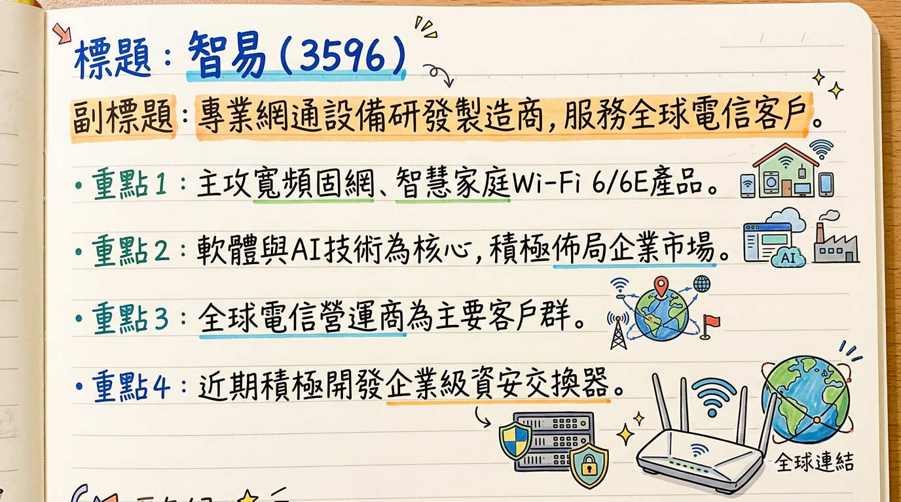
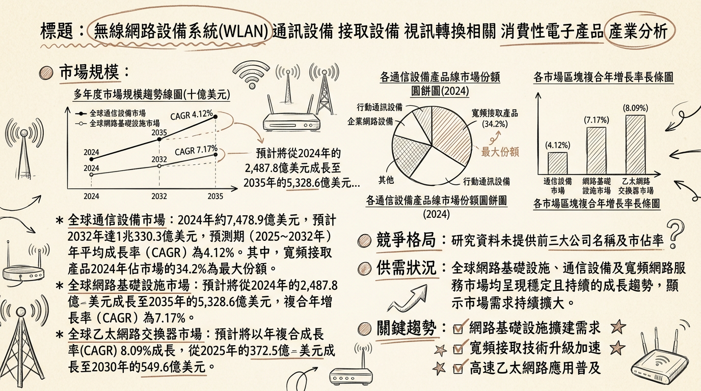
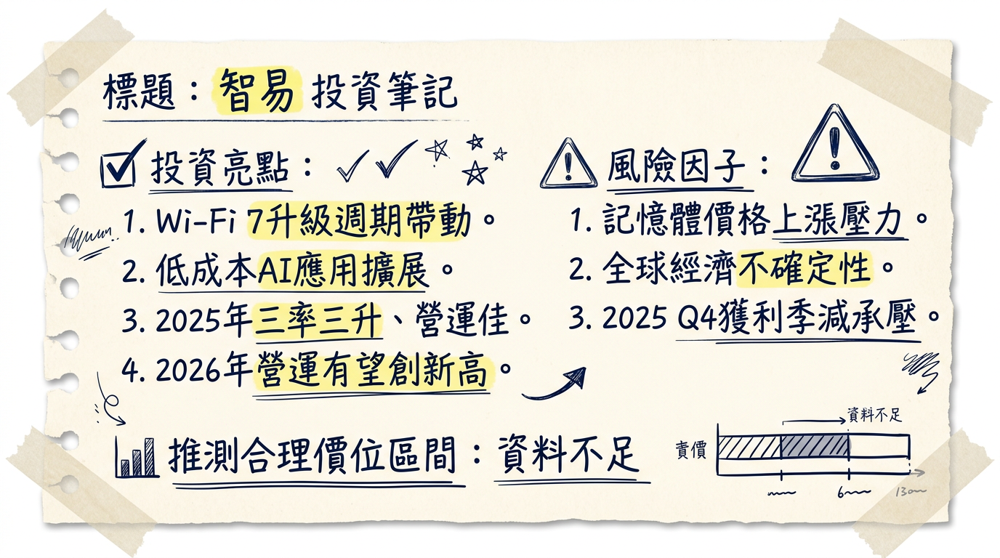

# 3596 智易 深度研究報告

**今日日期：2026年03月06日**

## 一句話摘要
智易（3596）憑藉在Wi-Fi 7、5G FWA及10G PON等高階網通設備的領先佈局，成功抵銷零組件成本壓力，2025年營收與EPS雙雙創歷史新高。展望2026年，在電信客戶強勁的升級需求及AI應用擴展帶動下，公司營運有望再攀高峰，並透過產能優化及新市場拓展，強化長期成長動能。

## 公司概覽
智易科技（3596）是一家專業的網通設備研發與製造商，主要客戶為全球電信營運商。

**核心產品與業務範圍：**
*   **寬頻固網產品：** xDSL、多功能整合接取裝置（IAD）、PON用戶端設備、Cable Modem、Wi-Fi路由器與Wi-Fi延伸器。主要應用於光纖到府（FTTH）與有線電視網路（Cable）架構。
*   **智慧家庭產品：** Wi-Fi 6/6E Gateway、Extender、Wi-Fi Module、Android STB/IP STB。提供家庭無線網路解決方案與物聯網裝置整合應用。
*   **行動通訊網路產品：** 5G NR終端網路接取設備（5G FWA）、相關天線模組、小型基地台（Small Cell）及智慧家庭物聯網應用。
*   **企業市場佈局：** 積極開發企業級資安交換器，期望從家用市場跨入高附加價值的企業市場。

**營收結構（依產品線，2025年）：**
| 產品線 | 2025年第三季營收佔比 | 2025/2026年趨勢 (法人預估) |
| :---------------- | :-------------------- | :------------------------------ |
| 智慧家庭產品 | 46%                   | 穩定成長                        |
| 行動通訊產品 | 36%                   | 穩定成長                        |
| 寬頻固網產品 | 18%                   | 成長最快，預計2025/2026年將超過25% |

**製造基地：**
主要生產基地為**越南**，並持續提升生產效率與智慧化程度。越南二期廠已完成大幅擴充，公司現階段以優化既有產能為主，未來計畫優先提升生產效率，包含產線AI智慧化與人員效率改善。公司會依客戶需求調整區域生產配置，並在評估其他地區的生產據點。

## 核心競爭優勢
1.  **領先的Wi-Fi 7技術佈局：** 2025年Wi-Fi 7出貨佔比已近3成，優於產業平均，且相關專案效益預計在2026年持續顯現，將顯著帶動產品ASP與毛利率提升（較Wi-Fi 6產品單價增加10-15%）。
2.  **5G FWA市場領導地位：** 作為北美龍頭電信商（如T-Mobile、Verizon）5G FWA CPE的重要供應商，並積極拓展至歐洲與亞洲市場，掌握快速成長的FWA商機。
3.  **高附加價值產品組合：** 積極佈局10G PON光纖網路升級、Edge AI及企業級交換器等高階產品，優化產品結構並提升獲利能力。
4.  **穩健的財務表現與成本轉嫁能力：** 2025年營收、獲利、EPS及股利連續多年創新高，且成功將記憶體漲價成本轉嫁客戶，展現強勁的營運韌性。
5.  **多元化客戶與市場策略：** 透過出貨歐洲與亞洲電信商，有效分散市場風險，並藉由越南廠區強化全球供應鏈彈性。

## 財務分析

### 月營收趨勢
| 月份 | 金額 (新台幣億元) | 月增率 (MoM) | 年增率 (YoY) |
| :------- | :-------------- | :------------- | :------------- |
| 22026年1月 | 42.33           | N/A            | 7.43%          |
| 22025年12月 | 42.08           | -2.96%         | 5.0%           |
| 22025年11月 | (未提供)        | N/A            | N/A            |
| 22025年10月 | (未提供)        | N/A            | N/A            |
| 22025年9月 | (未提供)        | N/A            | N/A            |
| 22025年8月 | (未提供)        | N/A            | N/A            |

**註：** 2025年第四季營收為新台幣130億元；2025年第三季營收為新台幣138.08億元。

### 最新季度與年度數據
*   **2025年第四季：**
    *   季營收：新台幣130億元
    *   毛利率：15.29%
    *   營業利益率：6.31%
    *   EPS：3.08元
*   **2025年全年（實際）：**
    *   營收：新台幣529.76億元，年增8.2%
    *   稅後淨利：27.77億元，年增11.7%
    *   EPS：12.6元，連續八年創歷史新高
*   **2024年全年（實際）：**
    *   營收：新台幣490.52億元 (依2025年營收年增8.2%推算)
    *   EPS：11.28元
*   **2026年預估EPS：**
    *   CMoney (2026年3月3日)：新台幣13.45～13.81元
    *   本土金控投顧 (2025年12月19日)：新台幣17.1元
    *   FactSet (2025年11月3日，中位數)：新台幣15.13元

## 法說會重點
**最近一次法說會：**
*   2026年3月2日：富邦證券舉辦之「智易2025 Q4線上法人說明會」
*   2026年3月4日：統一證券舉辦之「2026 Q1 春季投資論壇」

**管理層發言與 guidance：**
*   **2026年展望：** 公司對2026年展望保持正向，預期在Wi-Fi 7升級週期及低成本AI應用擴展帶動下，三大產品線（寬頻固網、無線網路、智慧家庭應用）將持續成長，法人看好智易2026年營收與獲利有機會續創新高。
*   **Wi-Fi 7專案：** 智易於2025年已與客戶共同開發多項Wi-Fi 7相關專案，預計效益將在2026年持續顯現。電信營運商客戶庫存水位健康，並積極推出Wi-Fi 7新規產品。
*   **產能與效率：** 智易以越南為主要生產基地，越南二期廠已完成擴充，公司將優先提升生產效率，包含產線AI智慧化與人員效率改善。
*   **成本轉嫁：** 面對記憶體價格上漲，公司將依慣例與客戶協商調價，同時透過規格優化與提前備料降低衝擊。多數客戶已接受調價，現有庫存足以支應至第一季底。

**資本支出與產能利用率：**
*   未提供2025-2026年具體的產能利用率和資本支出金額數據，但越南二期廠擴充與AI智慧化產線導入，顯示持續有資本投入。

## 券商觀點
### 目標價彙整
| 券商               | 目標價 (新台幣) | 評等 | 日期         |
| :----------------- | :-------------- | :--- | :----------- |
| FactSet (中位數)   | 240             | N/A  | 2026年3月4日 |
| 國泰               | 215             | 看多 | 2025年12月16日 |
| 本土金控投顧       | 291             | 買進 | 2025年12月19日 |

### 2025-2026年EPS預估
*   **2025年EPS預估：**
    *   FactSet (綜合7位分析師，2025年11月3日)：中位數12.63元
    *   國泰 (2025年12月16日)：約12.57元
    *   本土金控投顧 (2025年12月19日)：12.38元
    *   **實際EPS (2025年)：12.6元**
*   **2026年EPS預估：**
    *   本土金控投顧 (2025年12月19日)：17.1元
    *   CMoney (綜合2家券商，2026年3月3日)：13.45～13.81元
    *   FactSet (綜合7位分析師，2025年11月3日)：中位數15.13元 (最高值16.94元，最低值13.43元)

**近期評等調整：**
*   FactSet於2026年3月4日將目標價中位數由220元上修至240元，顯示分析師看法正向調整。

## 財報深度分析
### 利潤率趨勢
智易2025年實現「三率三升」（毛利率、營業利益率、稅後淨利率均提升）的良好態勢。

| 指標       | 2025年第四季 | 2025年全年 | 2025年全年 vs. 2024年變動 | 主要原因                        |
| :--------- | :----------- | :--------- | :-------------------------- | :------------------------------ |
| 毛利率     | 15.29%       | 15.3%      | 年增0.2個百分點             | 產品規格升級、規模經濟效益，抵銷記憶體漲價壓力 |
| 營業利益率 | 6.31%        | 6.6%       | 年增0.4個百分點             | 產品規格升級、規模經濟效益             |
| 稅後淨利率 | 5.23%        | 5.2%       | 年增0.1個百分點             | 產品規格升級、規模經濟效益             |

**利潤率變化分析：**
2025年整體利潤率提升主要受惠於Wi-Fi 7等高規格產品出貨比重提升，其單價較Wi-Fi 6產品增加10-15%，有助於優化產品組合和提升平均售價。儘管記憶體價格上漲構成壓力，公司成功透過產品組合優化和成本轉嫁策略維持並提升獲利能力。

### 存貨分析
*   **2025年第四季存貨淨額：** 145億元，較前一季小幅增加6億元。
*   **原因：** 主要為因應客戶對記憶體等零組件的提前備貨指示，以及為農曆春節期間順利出貨所做的準備。
*   **評估：** 公司認為存貨水準健康且可控。

### 資本支出與產能
*   **資本支出金額與趨勢：** 未找到2024-2026年具體的最新數據。
*   **未來資本支出計畫與預計新增產能：** 越南二期廠已完成擴充，公司未來將優先投入提升生產效率，包含產線AI智慧化與人員效率改善。其他地區的生產據點評估中。
*   **折舊攤銷趨勢：** 未找到2024-2026年具體數據。

### 其他財務重點
*   **現金部位：** 截至2025年第四季，現金及約當現金加上定存合計約136億元，公司維持強勁的淨現金部位。
*   **每股淨值：** 截至2025年12月31日，每股淨值為76.9元。
*   **負債比率與自由現金流量：** 未找到2024-2026年具體數據。

## 股權異動
*   **股利政策：** 董事會決議2025年度每股配發現金股利9元，配發率約71%。股利金額連續七年創歷史新高。以2026年3月2日收盤價195元計算，殖利率約4.6%。
*   **庫藏股買回紀錄：** 未找到2024-2026年最新資料。
*   **董監事/大股東申報轉讓紀錄：** 未找到2024-2026年最新資料。
*   **可轉換公司債 (CB) 發行紀錄：** 未找到2024-2026年最新資料。
*   **現金增資或減資計畫：** 未找到2024-2026年最新資料。

## 產業分析

### 市場規模和 CAGR 成長率
| 產業細分           | 參考市場規模與CAGR                                                                                                                                                                                                                                   |
| :----------------- | :--------------------------------------------------------------------------------------------------------------------------------------------------------------------------------------------------------------------------------------------------- |
| **網路基礎設施**   | 2024年2,487.8億美元 → 2025年2,666.1億美元 → 2026年2,857.3億美元。預計2035年達5,328.6億美元，CAGR 7.17%。                                                                                                                                           |
| **寬頻網路服務**   | 2024年4,024.8億美元 → 2025年4,184.3億美元 (CAGR 4.0%)。預計2029年達4,985.2億美元，CAGR 4.5%。                                                                                                                                                           |
| **全球通信設備**   | 2024年7,478.9億美元 → 2032年1兆330.3億美元 (2025-2032年CAGR 4.12%)。其中寬頻接取產品2024年佔34.2%。移動通信設備市場2025年約1兆2216億美元，預計2026-2031年CAGR約4%。                                                                                             |
| **乙太網路交換器** | 2025年372.5億美元 → 2030年549.6億美元 (CAGR 8.09%)。                                                                                                                                                                                              |
| **智慧家庭**       | 2025年1,475.2億美元 → 2026年1,801.2億美元。預計2026-2034年CAGR 21.40%。另有預測2026年達1,785億美元。Technavio預計2025-2030年成長980.161億美元，CAGR 20.6%。                                                                                                   |
| **5G FWA**         | 2025年576億美元 → 2035年1,661億美元 (2026-2035年CAGR 40%)。2026年預計規模806億美元。TrendForce預估2025年年增33%達720億美元。2024年CPE出貨量3,700萬台，年增23%。預計到2026年，FWA CPE總出貨量每年以25%增長。                                                      |

### 供需狀況
*   **總體網通設備：** 全球電信流量爆炸式增長，但ARPU持平，促使業者尋求AI成本控制。電信業者資本支出佔收入比例預計將從2024年的22.9%微幅回升。
*   **5G FWA：** 5G FWA為5G最成功的商業應用，部署成本低於光纖。全球5G FWA連接數將從2024年的1.6億戶成長至2030年的3.5億戶。
*   **寬頻固網：** 美國BEAD計畫訂單可能延遲至2027年，但私人資本（如AT&T）驅動的光纖建設依然強勁。
*   **家用Wi-Fi：** 家用路由器市場需求尚未完全復甦。Wi-Fi 7產品因價格較高且與前代產品差異不大，目前用戶仍以Wi-Fi 6/6E為主。預計2025年下半年平價機種上市後將帶動買氣。

### 產業的平均毛利率水準
網通設備產業平均毛利率數據較難取得。作為參考，網路設備大廠Arista Networks 2026全年毛利率指引維持在62%至64%。達發科技2025年第四季毛利率為53.6%。這些為個別公司數據，不代表產業平均。

### 競爭格局
| 項目               | 智易 (3596)                                        | 台灣主要競爭對手                                 | 全球主要廠商 (參考)                                 |
| :----------------- | :------------------------------------------------- | :----------------------------------------------- | :-------------------------------------------------- |
| **產品/市場**      | 寬頻固網、智慧家庭、行動通訊、企業級資安交換器 | 中磊 (5388, CPE北美市場)；啟碁 (6285, 直供美國); 智邦 (2345, 高速交換器); 達發科技 (6526, 晶片) | Huawei, Nokia, Samsung, ZTE, Ciena, Juniper (通訊設備)；Honeywell, ABB, Siemens, Alphabet (智慧家庭) |
| **FWA市場策略**    | 2022年起出貨歐洲與亞洲電信商，分散風險。           | 中磊 CPE主要出貨美國電信商。                     | ZTE (5G FWA & MBB全球市佔第一)。                    |
| **技術/產能/價格** | 越南為主要生產基地，導入AI智慧化產線。           | (缺乏詳細量化比較數據)                           | (缺乏詳細量化比較數據)                              |
| **2026年1月營收**  | 42.33億元 (YoY +7.43%)                             | 中磊：51.8億元 (YoY +32.9%)                      | (未提供直接比較)                                    |

### 產業趨勢
1.  **AI與網通設備深度融合 (AI-driven Networking)：**
    *   **影響：** AI革命帶動數據中心對800G/1.6T交換器等高速網路設備的強勁需求。網通產業成為支撐生成式AI的神經系統。智慧家庭產品也將深度嵌入AI，實現情境感知。
2.  **Wi-Fi 7 (802.11be) 普及：**
    *   **影響：** Wi-Fi 7將成為未來數年企業級市場網絡更新換代的驅動力。家用市場預計在2025年下半年平價機種上市後，帶動新一波換機潮。Wi-Fi 7支援MLO和320MHz頻寬，有助於XR、智慧家庭等應用。
3.  **5G 固定無線接入 (FWA) 的快速成長：**
    *   **影響：** 5G FWA已成為5G最成功的商業應用，為電信業者「利用餘裕頻寬進行變現」的極佳手段。部署成本遠低於光纖，成為寬頻普及核心動力。全球連接數預計從2024年的1.6億戶成長至2030年的3.5億戶。
4.  **光纖到戶 (FTTH) 的持續部署：**
    *   **影響：** 全球固定寬頻用戶中光纖接取比例已從2015年的34%提升至2024年的72%。美國私人資本驅動的光纖建設仍強勁，例如AT&T計劃到2030年將光纖覆蓋點擴展至6,000萬個。

### 對智易的具體機會和威脅
*   **機會：**
    *   **5G FWA市場成長：** 受惠於全球5G FWA連接數快速增長。
    *   **多元化市場策略：** 出貨歐洲與亞洲電信商，分散市場風險，拓展新增長點。
    *   **Wi-Fi 7升級潮：** 隨著平價機種普及，帶動家用與企業級Wi-Fi產品換機潮。
    *   **智慧家庭市場擴大：** AI嵌入式智慧功能與全屋互聯趨勢，符合智易產品發展方向。
    *   **AI驅動網路升級：** 間接受益於AI對高速網路基礎設施的強勁需求。
*   **威脅：**
    *   **美國BEAD計畫進度延後：** 實質訂單流入可能推遲到2027年。
    *   **家用路由器市場觀望：** Wi-Fi 7平價機種上市前的觀望期可能影響出貨量。
    *   **激烈市場競爭：** 網通設備市場競爭激烈，特別是來自中國品牌。
    *   **電信商資本支出轉向：** 資本支出重心轉向AI和數據中心基礎設施，可能影響傳統網通產品採購。
    *   **記憶體價格波動：** 記憶體價格高漲可能影響毛利率，但公司已成功轉嫁部分成本。

### 相關投資題材的具體連結
*   **AI (人工智慧)：** 網通設備是AI基礎設施的重要組成，AI革命拉動對高速網路設備需求。智易產品為AI數據傳輸提供底層網路支持，間接受益於AI基礎設施投資。其智慧家庭產品中AI功能日益普及，亦為新商機。
*   **HBM (高頻寬記憶體) 和 電動車：** 目前未發現智易與HBM或電動車產業有直接產品或業務連結，公司核心業務仍聚焦於網通設備。

## 近期催化劑

### 利多事件清單 (2025年12月 - 2026年3月)
*   **2026年3月3日：** 財訊快報報導，AI驅動Wi-Fi 7升級及應用擴大，智易2026年營運有望再創新高。公司「三率三升」主因產品規格升級與規模經濟，成功抵銷記憶體漲價壓力。
*   **2026年3月2日：** 舉行2025年第四季線上法人說明會，公告2025年全年營收達新台幣529.76億元（年增8%），EPS達12.6元（連八年創歷史新高）。董事會決議2025年度每股配發現金股利9元（配發率約71%），連七年創歷史新高。
*   **2026年2月26日：** 獲利創新高激勵，股價開高走高，創近4個月新高。
*   **2026年2月25日：** 董事會通過2025年財報，稅後純益27.77億元（年增11.7%）。將於MWC 2026展出Edge AI及企業級交換器等新產品，積極爭取新訂單。
*   **2026年2月9日：** 傳出成功將記憶體漲價成本轉嫁給客戶，緩解毛利率壓力。公司表示多數客戶已接受調價，且現有庫存可支應至第一季底。
*   **2026年2月6日：** 2026年1月營收達新台幣42.33億元，年增7.43%，顯示核心業務動能穩健。
*   **2026年1月8日：** 2025年12月營收新台幣42.08億元，累計全年營收新台幣529.76億元，年增8.2%。
*   **長期動能：** 法人看好智易訂單能見度直達2026上半年，受惠歐洲光纖復甦及升級需求，伴隨北美有線電視客戶新產品出貨，成為下半年及明年營運持續成長主要動能。
*   **榮譽獎項：** 2025年獲得「外資精選台灣100強」及「FinanceAsia ASIA'S BEST COMPANIES 2025 Best Mid Cap Company 銀牌」等ESG獎項。

### 利空事件清單 (2025年12月 - 2026年3月)
*   **2026年3月4日：** 2025年第四季財務報告與第三季相比，部分關鍵財務指標呈現季度性下滑，顯示獲利能力有所承壓。
*   **2026年3月2日：** 法說會內容指出，2026年第一季展望略低於預期，短期毛利率仍受記憶體漲價影響。
*   **2026年3月3日：** 近三個月（2025年12月至2026年3月3日）外資與投信呈現淨賣超，其中2026年3月3日外資賣超1,453張，投信買超15張，自營（自買）買超161張，總計三大法人賣超1,303張。

## ⭐ 成長動能時間軸
*   **擴廠計畫：**
    *   **越南二期廠 (已完成擴充)：** 公司現階段以優化既有產能為主，優先提升生產效率，包含產線AI智慧化與人員效率改善（**2026年**）。
    *   **未來五年成長空間 (2025年11月)：** 越南廠區提供了未來五年成長所需的彈性空間。
    *   **其他生產據點 (評估中)：** 會依客戶需求調整區域生產配置，並在評估其他地區的生產據點（**2026年**）。
*   **新客戶/新市場：**
    *   **持續掌握 (2026年)：** 持續掌握新客戶、新產品商機。
    *   **新企業/家用網通客戶 (2026年3月)：** 帶來長遠貢獻值得期待。
    *   **跨入企業市場 (2025年11月)：** 正悄然佈局，準備從家用市場跨入利潤更豐厚的企業市場心臟地帶，包括深化5G FWA應用及企業級資安交換器。
    *   **拓展歐洲與亞洲市場 (2025年7月)：** 積極拓展FWA領域。
*   **產能擴充：**
    *   **越南二期廠 (已完成)：** 完成擴充後，將優先提升生產效率並導入AI智慧化生產（**2025年11月**）。
*   **需求面：**
    *   **Wi-Fi 7 升級週期 (2026年持續顯現)：** 電信營運商客戶庫存水位健康，積極推出Wi-Fi 7新規產品。公司於**2025年**已與客戶共同開發多項Wi-Fi 7相關專案，預計效益在**2026年**持續顯現。低成本AI帶動邊緣運算傳輸需求，拓展Wi-Fi 7應用場景。
    *   **寬頻固網 (2025年起導入，2025/2026成長最快)：** 歐洲光纖寬頻升級（導入10G PON與Wi-Fi 7）與北美Cable產品線擴展（新產品開始放量出貨），預計在**2025年**與**2026年**將成為成長最快的產品線。
    *   **5G FWA (2025年7月起拓展)：** 作為北美龍頭電信商（如T-Mobile和Verizon）5G FWA CPE重要供應商，並逐步拓展至歐洲與亞洲市場。Verizon預期在**2025年底前**，FWA用戶將達到500萬戶；T-Mobile截至**2025年第二季底**，其「5G Home Internet」用戶已達640萬戶，年增140萬戶。
    *   **智慧家庭 (2026年增長動能重現)：** 隨著Wi-Fi 7滲透率逐漸提高，預計**2026年**增長動能可望重新出現（**2025年7月**）。

## 2026 展望
智易對2026年營運維持樂觀看法，預期營收與獲利有望再創新高。

### 成長動能
1.  **Wi-Fi 7升級週期驅動：** 公司在2025年Wi-Fi 7出貨佔比已達30%，相關專案效益將在2026年持續顯現，帶動產品ASP與毛利率提升（較Wi-Fi 6產品單價增加10-15%）。
2.  **低成本AI應用擴展：** 終端AI（On-device AI）運算擴大邊緣與終端傳輸需求，進而拓展Wi-Fi 7應用場景，為三大產品線帶來持續商機。
3.  **寬頻固網產品線強勁成長：** 受惠於歐洲10G PON光纖網路部署與北美Cable產品線新產品出貨放量，預計將成為2026年成長最快的產品線。
4.  **5G FWA市場持續擴張：** 作為主要供應商，將受惠於全球5G FWA連接數從2024年的1.6億戶大幅成長至2030年的3.5億戶。
5.  **高附加價值產品組合優化：** 積極佈局Edge AI及企業級交換器，提升整體獲利結構。

### 風險因子
1.  **記憶體價格波動：** 記憶體（DDR4）價格高漲可能對2026年毛利率構成壓力。儘管公司已成功轉嫁部分成本，但若漲幅超預期，仍可能影響獲利。
2.  **全球總體經濟不確定性：** 全球經濟與地緣政治風險，包括貿易關稅政策，可能影響電信商資本支出及消費性電子市場需求。不過，智易銷往美國的Wi-Fi 7路由器、PON光纖及GSW產品目前均列入關稅豁免清單，維持免關稅優勢。
3.  **消費性電子市場週期性波動：** 家用路由器市場需求尚未完全復甦，Wi-Fi 7平價機種上市前的觀望期可能影響短期出貨量。

**2026年量化展望：**
*   **營收預估：** FactSet分析師預估中位數為新台幣580.795億元 (最高值606.08億元，最低值566.49億元)。
*   **EPS預估：** FactSet分析師預估中位數為新台幣15.13元 (最高值16.94元，最低值13.43元)。

## 投資結論
綜合以上分析，智易（3596）在網通產業的數個關鍵趨勢中（Wi-Fi 7、5G FWA、AI應用、光纖升級）均佔據有利位置，且擁有穩健的財務體質和成本轉嫁能力。儘管記憶體成本和總經不確定性構成潛在風險，但其核心成長動能明確。

1.  **高階產品週期啟動，營收與獲利有望再創新高：** 智易在Wi-Fi 7與10G PON等高階產品線的領先佈局，將帶動產品組合優化、ASP提升及毛利率改善。法人預期2026年營收有望挑戰新台幣580億元以上，EPS有望達到新台幣15元以上。
2.  **多元化市場策略分散風險：** 智易透過拓展歐洲與亞洲電信客戶，降低對單一市場的依賴，尤其在5G FWA領域持續擴大市場份額。
3.  **財務體質強健，股利政策具吸引力：** 2025年EPS達12.6元，配發9元現金股利，配發率約71%，顯示公司經營穩健且願意回饋股東。充裕的現金部位也為未來發展提供彈性。
4.  **AI與企業市場拓展，增添長期成長動能：** 積極佈局Edge AI及企業級資安交換器，顯示公司正向高附加價值領域轉型，為長期成長奠定基礎。

**基於上述分析及券商預估，建議智易的目標價區間為新台幣240元至280元。** 此區間考量了市場對其2026年EPS增長潛力，並參考券商最新目標價中位數及較高估值，反映其在網通升級週期中的成長機會與產業領導地位。

---
本報告由 AI 自動產生，資料來源為公開網路資訊，僅供參考，不構成投資建議。產生時間：2026-03-06 13:04

---

## 📊 資訊卡

