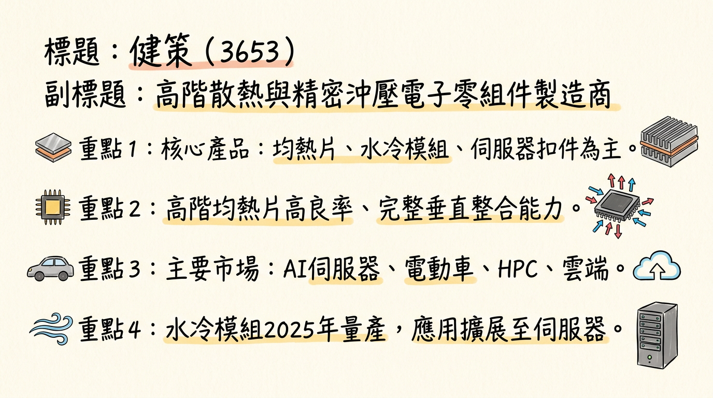
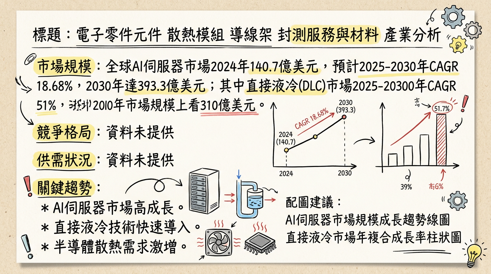
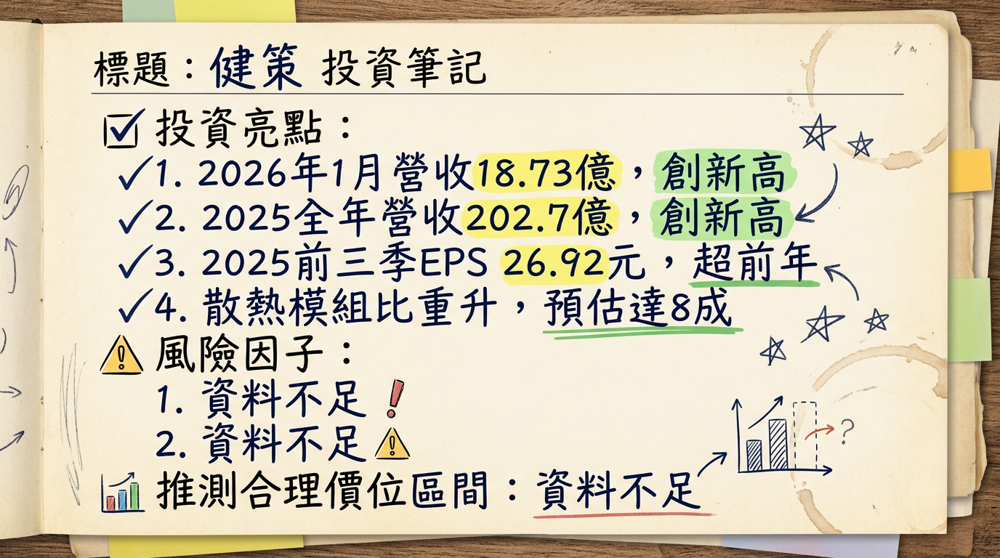

# 3653 健策 深度研究報告

**今天日期：2026年03月06日**

## 一句話摘要

健策（3653）憑藉其在高階散熱與精密沖壓領域的技術領先及垂直整合能力，在AI伺服器、HPC及電動車等高成長市場受惠顯著。公司在微通道蓋板（MCL）等次世代散熱技術具備優勢，配合積極的產能擴張計畫，營收與獲利屢創歷史新高。法人普遍看好其2026年及往後年度的強勁成長動能，目標價區間已上修至4,100元至5,000元。

## 公司概覽

健策（3653）主要從事電子零組件的製造，是散熱與精密沖壓領域的重要廠商。其核心產品與服務聚焦於高階散熱解決方案及精密機構件，主要應用於AI伺服器、雲端資料中心、高效能運算裝置及電動車等高門檻領域。公司具備垂直整合能力，提供從封裝級到系統級的完整散熱與結構件解決方案，以解決高熱量產生的散熱及結構應力問題，並縮短產品開發週期。

**核心產品包括：**
*   **均熱片（Vapor Chamber / Heat Spreader）**：散熱產品主力，廣泛應用於AI伺服器、PC、車用及遊戲機等，在高階市場具高良率優勢。
*   **水冷散熱模組**：未來關鍵成長動能，產品應用已從車用擴展至伺服器領域，預計2025年開始量產出貨。
*   **伺服器ILM（Independent Loading Mechanism）扣件**：提供AI主晶片及散熱器扣壓力量，確保晶片與連接器電性接觸良好。
*   **導線架**：主要應用於車用二極體與5G通訊元件。
*   **微流道蓋板（MCL）**：新世代封裝散熱結構，健策具備量產能力，被視為關鍵受惠者，預計2026年下半年導入應用。

**營收結構概覽：**

| 產品線分類     | 2024年Q1-Q3 營收佔比 | 2024年全年 營收佔比 | 2025年Q3 散熱模組佔比 (預估) | 2025年Q4 散熱模組佔比 (預估) | 2026年 散熱模組佔比 (預估) |
| :------------- | :------------------ | :---------------- | :-------------------- | :--------------------------- | :--------------------------- |
| 散熱產品 (均熱片、水冷等) | 63%                 | 66%               | -                     | -                            | -                            |
| 散熱模組       | -                   | -                 | ~70%                  | ~75%                         | 上看80%                      |
| 導線架         | ~15%                | -                 | -                     | -                            | -                            |
| 機構件 (ILM/扣件) | -                   | -                 | -                     | -                            | -                            |

**製造基地：**
健策的製造基地主要位於台灣。公司正積極展開擴產計畫以滿足客戶需求，主要集中在大園廠區。目前未找到各製造基地的具體營收貢獻比例資料。

## 核心競爭優勢

1.  **高階散熱技術領先與高良率優勢：** 健策在高階均熱片市場擁有高良率，並在微通道蓋板（MCL）等次世代封裝散熱結構扮演關鍵角色。MCL 技術因直接接觸晶片並涉及晶片封裝、電鍍技術，形成較高護城河，有望在2026年下半年導入應用，並於2027年成為主流。
2.  **垂直整合能力：** 提供從封裝級到系統級的完整散熱與結構件解決方案，縮短產品開發週期，有效滿足客戶一站式需求。
3.  **產品組合高階化：** 隨著AI伺服器、HPC及電動車對高功耗散熱需求的提升，公司產品組合持續向高毛利的高階熱擴散片、水冷散熱模組及MCL等發展，有效提升整體獲利能力。
4.  **切入關鍵供應鏈與客戶認證：** 健策為AMD、英特爾與輝達的均熱片供應商，水冷散熱模組也預計於2025年開始量產出貨。2025年首度獲選台積電優良供應商，彰顯其在先進封裝散熱能力的肯定。

## 財務分析

### 月營收趨勢

| 月份 (2025-2026) | 金額 (億元) | 月增率 MoM | 年增率 YoY |
| :--------------- | :---------- | :--------- | :--------- |
| 2026年01月       | 18.73       | 0.16%      | 29.43%     |
| 2025年12月       | 18.70       | 9.91%      | 13.27%     |
| 2025年11月       | 17.01       | 0.03%      | 16.66%     |
| 2025年10月       | 17.01       | 0.23%      | 29.82%     |
| 2025年09月       | 16.97       | 0.43%      | 40.90%     |
| 2025年08月       | 16.90       | 0.43%      | 40.48%     |

*   **營收亮點：** 健策2026年1月營收達18.73億元，創單月歷史新高，年增率達29.43%。2025年全年營收突破202.7億元，年增42%，亦創歷史新高，顯示AI散熱需求帶動的強勁成長。

### 季度與年度財務表現

| 期間             | 營收 (億元) | 年增率 (%) | 季增率 (%) | EPS (元) |
| :--------------- | :---------- | :--------- | :--------- | :------- |
| **2025年Q4 (預估)** | 52.72       | 19.29      | 4          | -        |
| **2025年Q3 (實際)** | 50.70       | 41.09      | -2.16      | 9.49     |
| **2025年Q1-Q3 (累計)** | -           | -          | -          | 26.92    |
| **2025年全年 (實際)** | 202.76      | 42         | -          | -        |
| **2024年全年 (實際)** | 142.78      | 18.37      | -          | 24.15    |

*   **EPS預估：**
    *   國內大型金控旗下投顧預估2025年EPS為59.02元 (年增59%) (2026年2月26日)。
    *   歐系券商預估2025年EPS為36.8元 (2025年12月5日，⚠️過時)。
*   **2025年前三季累計EPS 26.92元，已超越2024年全年EPS 24.15元。**

## 法說會重點 (最近一次：2025年11月28日)

*   **營運概況：** 2025年前三季營收年增52%，其中散熱產品佔比73%，年增77%，主要受惠於AI伺服器需求強勁。
*   **技術領先：** 健策是首家能同時提供散熱片、散熱模組及ILM／插槽三種關鍵元件的供應商。
*   **AI散熱需求：** AI GPU與ASIC的熱設計功耗 (TDP) 從700-1,000W躍升到2,700-3,100W，高階熱擴散片已成為AI伺服器與資料中心平台的標準配備。
*   **MCL技術進展：** 預期2026年下半年起，散熱元件將迎來向微通道蓋（MCL）的重大規格升級，並在2027年成為主流。此技術有望將散熱元件的價值提升9至10倍。健策被視為MCL技術的關鍵受惠者。
*   **散熱模組比重：** 散熱模組在2025年第三季營收占比約7成，預估第四季達75%，市場預估2026年上看8成。
*   **NVIDIA新平台：** 輝達(NVIDIA)預計在2026年進入GB300世代，下半年推出Rubin平台，Rubin Ultra GPU將採MCL設計，整合均熱片/蓋板（Lid）與水冷板，預期推升健策均熱片ASP逾3倍。
*   **產能與資本支出：**
    *   法人預期健策在2025年至2027年間，隨著大園廠擴建完成，總廠房面積將增加約30%，主要用於擴大高階熱擴散片與IGBT液冷散熱模組產能。
    *   2025年資本支出預計落在5億至7億元區間。
    *   2026年因應新廠房動工建設，資本支出將大幅提升至20億至30億元之間。
*   **管理層/法人Guidance：**
    *   法人預期健策2025年第四季營收可望季增雙位數，2026年第一季有機會維持相近水準，反映AI應用的拉貨力道。
    *   展望2026年，法人預期健策營收將逐季走升，並可留意MCL量產時程。

## 券商觀點

### 券商目標價與評等

| 券商名稱/機構           | 目標價 (元) | 評等   | 日期       | 備註                               |
| :---------------------- | :---------- | :----- | :--------- | :--------------------------------- |
| 瑞銀證券                | 5000        | 買進   | 2025年12月7日 | -                                  |
| 國內大型金控旗下投顧    | 4200        | 增持   | 2026年2月26日 | 首評                              |
| FactSet (綜合 6 位分析師) | 4100        | -      | 2026年1月25日 | 較先前 3955 元上修 3.67%           |
| 國泰大和 DW             | 4335        | 買進   | 2025年12月10日 | 首次評等                           |
| 摩根士丹利 (小摩)       | 3650        | 點讚   | 2025年9月30日 | 首次點讚 (歷史參考)                 |

### 2025-2026年EPS預估

| 券商名稱/機構         | 日期       | 2025年EPS (元) | 2026年EPS (元) |
| :-------------------- | :--------- | :------------- | :------------- |
| 國內大型金控旗下投顧  | 2026年2月26日 | 59.02          | 119.99         |
| 歐系券商 (⚠️過時) | 2025年12月5日 | 36.8           | 61.3           |

### 重大調升/調降評等

*   **FactSet (綜合 6 位分析師)：** 目標價調升至4100元，幅度約3.67% (2026年1月25日)。
*   **國內大型金控旗下投顧：** 首評健策，給予「增持」評級 (2026年2月26日)。
*   **國泰大和 DW：** 首次納入研究範圍，給予「買進」評等 (2025年12月10日)。
*   **歐系券商：** 首次覆蓋，給予正向評等 (2025年12月5日)。

## 財報深度分析

### 利潤率趨勢

| 季度     | 毛利率 (%) | 營業利益率 (%) | 稅後淨利率 (%) |
| :------- | :--------- | :------------- | :------------- |
| 2025年Q3 | 38.97      | 29.28          | 26.96          |
| 2025年Q2 | 41.48      | 32.80          | 21.82          |
| 2025年Q1 | 44.91      | 35.06          | 28.93          |
| 2024年Q4 | 37.73      | 27.58          | 24.86          |
| 2024年Q3 | 38.13      | 27.00          | 21.56          |
| 2024年Q2 | 38.84      | 27.98          | 25.08          |
| 2024年Q1 | 35.15      | 22.97          | 24.04          |

*   **利潤率變化的原因分析：**
    *   **2025年Q3利潤率下滑：** 2025年Q3毛利率(38.97%)低於市場預期及先前高檔約43%水準，可能係產品組合變化或新產能初期投入成本所致。
    *   **產品組合升級：** 健策營收高度集中於散熱產品，特別是高階熱擴散片和汽車熱管理零組件。隨著AI伺服器需求強勁，產品組合持續向高毛利產品集中（如高階熱擴散片、MCL、VCL），有助於挹注整體獲利。高階散熱產品的毛利率明顯高於LED導線架及其他電子零件。
    *   **AI伺服器需求：** AI GPU與客製化ASIC功耗大幅增加，使高階熱擴散片成為AI伺服器與資料中心平台的標準配備，帶動散熱材料需求擴張，提升獲利能力。
    *   **產能擴充效益：** 產能持續擴充，使公司實際出貨量與平均單價（ASP）均優於原先市場較保守的假設，對營收和獲利產生正面影響。法人預期，隨著散熱模組比重在2026年上看8成，毛利率可望來到40%水準。

### 資本支出與產能

*   **近期資本支出：**
    *   2025年資本支出預估維持在5億至7億元水準。
    *   2026年資本支出將大幅提升至20億至30億元之間，主要用於新廠房建設。
*   **未來產能規劃：**
    *   **大園一廠擴建：** 預計2026年第一季完工，新增廠房面積4,735坪，主要用於擴大高階熱擴散片與IGBT液冷散熱模組產能。
    *   **大園三廠（航空城新廠）：** 第一期廠房面積11,340坪，預計於2027年第一季完工，將專注於高階均熱片、車用水冷及伺服器扣件等產品。
    *   2026-2027年台灣廠房合計將新增16,075坪，相較現有台灣廠房面積成長超過114%。
*   **折舊攤銷趨勢：** 未找到2024-2026年折舊攤銷的最新資料。

### 存貨與營運

*   **存貨金額與週轉天數：** 未找到2025-2026年的最新資料。
*   **應收帳款週轉天數：** 未找到2025-2026年的最新資料。
*   **存貨是否有異常堆積或備料現象：** 未找到2025-2026年的最新資料。

### 其他財報重點

*   **負債比率：** 健策財務結構健康，在完成子公司合併與償還借款後，目前已接近無負債狀態。
*   **自由現金流量趨勢：** 未找到2024-2026年的最新資料。
*   **業外收支：** 2025年Q3稅後淨利季增20.8%，年增75.9%，主要受益於AI伺服器相關產品接單暢旺，以及ILM扣件產品展望正向，未見特殊業外收支項目。

## 股權異動

*   **董監事/大股東申報轉讓紀錄：** 未找到2024-2026年的最新資料。
*   **庫藏股買回紀錄：** 未找到2024-2026年的最新資料。
*   **可轉換公司債（CB）：** 健策董事會於2025年2月25日決議發行合計50億元無擔保轉換公司債，主要用途是興建大園三廠廠房及充實營運資金（⚠️此為歷史資料）。
*   **增資或減資計畫：** 未找到2024-2026年的最新資料。
*   **股利政策：** 健策於2025年7月17日發放現金股利14.5元。尚未公告2026年的股利政策。

## 產業分析

### 產業數據

1.  **全球市場規模與 CAGR 成長率**
    *   **AI 伺服器市場：**
        *   2024年全球市場規模估計為**140.7億美元**。
        *   預計2025年成長至**166億美元**。
        *   2025年至2030年間CAGR為**18.68%**，預計到2030年達**393.3億美元**。
    *   **半導體冷卻裝置市場：**
        *   預計從2025年的**8.4853億美元**，以**7.14%**的CAGR成長，到2032年達到**13.7087億美元**。
    *   **直接液冷 (DLC) 市場：**
        *   預估2025年至2030年間CAGR可達**51%**，市場規模上看**310億美元**。

2.  **供需狀況：供不應求**
    目前散熱產業在高階AI伺服器應用領域呈現**供不應求**的狀況。
    *   AI伺服器需求強勁，最新GPU功耗動輒700W以上，傳統氣冷技術難以應對。
    *   NVIDIA執行長黃仁勳表示，GB200 AI伺服器需求「瘋狂」，預期台灣數家散熱廠2025年液冷營收將年增一倍以上。
    *   2026年液冷將開始實際放量、貢獻營收。新一代平台功耗密度再上台階，使得散熱設計從「單顆晶片水冷」升級為「整櫃液冷」。
    *   高階銅箔基板（CCL）市場極度緊俏，反映高階電子材料供需緊張。

3.  **產業平均毛利率水準**
    高階散熱產品的毛利率預期將顯著提升：
    *   法人預期奇鋐、雙鴻、建準2025年毛利率將分別上揚至**25%、28%、29%**。
    *   奇鋐2026年上半年毛利率有望顯著跳升至**28%至29%**，主要歸功於高單價、高毛利的水冷伺服器產品比重提升。
    *   雙鴻2025年第三季毛利率衝上**29.77%**。
    *   健策法人點出，預期2025年第四季毛利率將較2025年第三季增加，且隨著散熱模組比重在2026年上看8成，毛利率可望來到**40%水準**。

### 競爭格局

1.  **AI伺服器散熱主要廠商**
    *註：目前未找到具體全球市佔率數據，以下為台灣在AI伺服器散熱領域具代表性的主要廠商。*

| 公司名稱 (股票代碼) | 主要產品/專注領域                                  |
| :-------------------- | :------------------------------------------------- |
| 奇鋐 (3017)           | 散熱模組、水冷板、風扇門、機殼、分歧管           |
| 雙鴻 (3324)           | 散熱模組、水冷板、分歧管、浸沒式液冷系統         |
| 健策 (3653)           | 均熱片、水冷散熱模組、伺服器 ILM 扣件、微通道蓋 (MCL) |
| 建準 (2421)           | 散熱風扇、散熱模組                                 |
| 高力 (8996)           | 熱交換器、板式熱交換器                             |
| 台達電 (2308)         | 電源、風扇、液冷 CDU、整櫃方案                   |

2.  **健策 vs 主要競爭對手的具體比較**

| 比較項目 | 健策 (3653)                                                                                                              | 奇鋐 (3017)                                                                                                  | 雙鴻 (3324)                                                                                                  |
| :------- | :----------------------------------------------------------------------------------------------------------------------- | :----------------------------------------------------------------------------------------------------------- | :----------------------------------------------------------------------------------------------------------- |
| **技術** | 高階均熱片高良率優勢，垂直整合能力。MCL技術護城河高，直接接觸晶片並涉及電鍍。水冷散熱模組2025年量產。                      | AI伺服器水冷散熱強勁，PC散熱模組龍頭。獲GB200水冷板模組、風扇門等訂單，2025年Q2後放量。投入MCCP研發。         | 提供直接式/浸沒式液冷整機系統。2025年Q2後出貨水冷板模組、分歧管。列間冷卻分配單元2026年量產。                   |
| **產能** | 2025-2027年大園廠擴建，總廠房面積增約30%，擴大高階熱擴散片與IGBT液冷散熱模組產能。                                     | VR200與Trainium3水冷產品2026年6月量產。2026年Q4銜接Google TPUv8水冷產品放量。                               | 預設2026年營收成長目標50%以上。預估2026年液冷產品營收比重超過55%。                                       |
| **客戶** | 均熱片供應AMD、英特爾、輝達。                                                                                              | 輝達水冷零組件主力供應商，橫跨GPU、ASIC AI。AWS T4伺服器水冷主要供應商之一。                                 | 受惠AI伺服器液冷，打入高階AI散熱。握美系雲端客戶AISC訂單。受益於GB300、VR系列及其他雲端/ASIC平台。          |
| **價格/毛利率** | 高階散熱產品毛利率明顯高於LED導線架。預期散熱模組比重達8成時，毛利率可望達40%水準。                                 | 2026年上半年毛利率有望跳升至28%至29%，歸功於高單價、高毛利水冷伺服器產品比重提升。                              | AI散熱市場高速擴張下，獲利規模仍顯著提升，但主要客戶在水冷板產品上的供應策略可能壓抑長期毛利率。              |

3.  **台灣同業比較 (財務數據)**

| 公司名稱 (股票代碼) | 預估 2025年 EPS (元) | 預估 2026年 EPS (元) | 預估 2025年 毛利率 (%) | 預估 2026年 毛利率 (%) | 營收成長動能 (2026)                                                                                             |
| :-------------------- | :-------------------- | :-------------------- | :---------------------- | :---------------------- | :---------------------------------------------------------------------------------------------------------------------- |
| 健策 (3653)           | 59.02 (投顧)          | 119.99 (投顧)         | (Q4預估40%)             | 40 (散熱模組比重達8成時) | 市場預期2025-2026年營收與獲利續創新高，受惠高階散熱產品、產品組合高階化、產能開出。                                   |
| 奇鋐 (3017)           | 31.61 (年增48%)       | -                     | 25                      | 28-29 (上半年)          | 2026年1月營收達170.03億元，年成長150.01%。預期2026年Q1、Q2營收季增5-10%。                                     |
| 雙鴻 (3324)           | 30.12 / 38.3 (年增74%) | 51.91 / 48            | 29.77 (Q3)              | -                       | 2026年營收成長目標50%以上。預計2026年Q1營收可望季持平，年增率仍有機會維持在50%以上。                               |
| 建準 (2421)           | 7.23 (年增24%)        | -                     | 29                      | -                       | -                                                                                                                       |

### 產業趨勢

1.  **2-3個關鍵技術趨勢和具體影響**
    *   **液冷散熱成為主流 (Liquid Cooling Dominance)**
        *   **趨勢:** AI模型規模擴張使伺服器功耗飆升，傳統氣冷散熱難以應對。液冷解熱能力約為氣冷3.5倍，預計2026年起液冷伺服器出貨占比將加速上升。
        *   **具體影響:** 液冷技術要求散熱廠商提供更全面的水冷解決方案（水冷板、分歧管、CDU等），同時帶來資料中心設計變革，包括風扇減少、空間釋放、算力密度提高及能耗下降。
    *   **微通道冷板/蓋 (MCCP/MCL) 技術興起**
        *   **趨勢:** 為縮短熱傳路徑，讓冷卻液更貼近裸晶，提升散熱效率，微通道冷板/蓋技術應運而生，最快2025年有望量產。輝達下世代GPU將持續提升算力，需要MCCP/MCL等新技術升級散熱能力。
        *   **具體影響:** 將液冷板與晶片上的均熱片整合，透過蝕刻微小通道讓冷卻液直接流過，大幅縮減冷卻液與晶片距離。這對散熱廠在晶片封裝、電鍍技術等方面提出更高要求，具備均熱片技術優勢的廠商將佔有先機。
    *   **浸沒式散熱 (Immersion Cooling) 的發展**
        *   **趨勢:** 將電子元件浸泡在不導電液體中，透過液體循環帶走熱量。
        *   **具體影響:** 雖解熱能力極高，但面臨建置成本高、需大幅調整機架架構、硬體相容性不足及冷卻液成本高等阻礙。短期內液冷仍被認為是最佳解決方案之一。

2.  **對 健策 而言的具體機會和威脅**
    *   **機會:**
        *   **高階散熱需求爆發：** AI伺服器、HPC及電動車高功耗應用對高階均熱片、水冷散熱模組、MCL等需求持續提升，健策明確受惠。
        *   **技術領先與垂直整合：** 高階均熱片的高良率優勢及MCL等關鍵技術護城河，使其在新一代散熱技術變革中佔據先機。
        *   **產能擴充以應對成長：** 大園廠擴建增加約30%廠房面積，擴大高階熱擴散片與IGBT液冷散熱模組產能，有助把握市場成長機會。
        *   **切入新興平台與應用：** 水冷散熱模組2025年量產出貨，MCL研發推進帶動新一波成長。新能源車液冷模組與IGBT基板提供中長期訂單能見度。
    *   **威脅:**
        *   **市場競爭加劇：** 散熱產業競爭激烈，存在價格競爭、客戶認證週期長等風險，同業奇鋐、雙鴻亦積極擴充液冷產能。
        *   **客戶集中度風險：** AI訂單不如預期或單一主要客戶採購策略調整，可能影響成長軌跡。
        *   **技術快速迭代與資本投入：** 散熱技術演進快速，需持續投入大量研發以維持競爭力。

3.  **相關投資題材的具體連結**
    *   **AI 伺服器與高效能運算 (HPC)：** 健策核心產品均熱片、水冷散熱模組和伺服器ILM扣件，主要應用於AI伺服器、雲端資料中心及HPC等高門檻領域。AI晶片功耗提升，高階熱擴散片成為標準配備，健策直接受惠NVIDIA GB300等新平台。
    *   **HBM (高頻寬記憶體)：** HBM高熱量對散熱要求更高，液冷散熱技術適合處理GPU、HBM等高度集中的熱源，健策提供的高階散熱解決方案有助確保HBM穩定運作。
    *   **電動車 (EV)：** 健策產品應用延伸至電動車領域，研發重心投入新能源車液冷模組與IGBT基板。電動車對高效能熱管理的需求是健策另一個重要成長動能。

## 近期催化劑 (2025年12月至2026年3月)

*   **營收表現強勁：** 2026年1月營收達18.73億元，年增29.4%，續創單月歷史新高。2025年全年營收202.7億元，年增42%，創歷史新高。
*   **高階產品出貨與組合優化：** 高階散熱產品需求強勁，產品組合向高毛利產品集中。散熱模組在2025年Q3營收占比約7成，預估Q4達75%，2026年上看8成。
*   **MCL技術領先與新產品導入：** 領先取得NVIDIA新世代Rubin系統微通道蓋板（MCL）技術合作認證，預計2026年下半年起正式導入應用，MCL產品每單位價格預期是現有均熱片3至4倍，將顯著提升營收獲利。
*   **擴大封裝與系統散熱整合：** 強化冷板、CPU端伺服器散熱產品線，擴大整合供應能力，預期相關布局將在2026年至2027年間導入挹注。
*   **法人持續看好：** 法人預期2026年營收逐季走升，調升獲利預估與目標價。瑞銀證券給予目標價5,000元。

## ⭐ 成長動能時間軸

*   **2025年：**
    *   **2025年Q4：** 大園一廠擴建預計量產，新增廠房面積3,200坪。散熱模組營收佔比預估達75%。
    *   **全年：** 營收突破202.7億元，年增42%，創歷史新高。前三季EPS 26.92元超越2024年全年。水冷散熱模組開始量產出貨。首度獲選台積電優良供應商 (11月28日)。
*   **2026年：**
    *   **2026年Q1：** 大園一廠擴建完工，新增廠房面積4,735坪，擴大高階熱擴散片與IGBT液冷散熱模組產能。
    *   **2026年下半年：** 領先取得NVIDIA Rubin系統的微通道蓋板（MCL）技術合作認證，預計正式導入應用並啟動量產布局。
    *   **全年：** 法人預期營收逐季走升，散熱模組營收占比上看8成。NVIDIA GB300系列AI伺服器出貨量上看6萬櫃，推升供應鏈需求。資本支出大幅提升至20億至30億元，用於新廠建設。
*   **2027年：**
    *   **2027年Q1：** 大園三廠航空城新廠（第一期）完工，新增廠房面積11,340坪，專注高階均熱片、車用水冷及伺服器扣件。
    *   **全年：** MCL技術有望成為AI伺服器主流散熱方案。

## 2026 展望

**成長動能：**
*   **AI伺服器與HPC需求爆發：** AI晶片功耗大幅提升，推動高階均熱片、液冷散熱模組、微通道蓋板（MCL）等需求強勁成長。
*   **MCL技術變革：** 健策在MCL技術上的領先地位，將使單顆處理器散熱內容量大幅放大，ASP提升3-4倍，成為營收及獲利躍升的關鍵。
*   **產能大幅擴充：** 大園廠區合計新增超過1.6萬坪廠房面積（相較現有翻倍），專為高階散熱產品設計，確保滿足未來強勁需求。
*   **產品組合優化：** 散熱模組營收比重預期在2026年上看8成，高毛利產品佔比提升將持續挹注獲利。
*   **電動車市場潛力：** 新能源車液冷模組與IGBT基板為健策提供長線穩定的成長動能。

**風險：**
*   **競爭加劇：** 散熱產業同業亦積極投入液冷方案，可能導致價格競爭，影響毛利率。
*   **AI投資節奏不確定性：** 終端企業資本支出輪動、雲端業者庫存調整及AI投資時程，可能影響訂單能見度與出貨節奏。
*   **新產能利用率：** 大幅擴廠後，產能利用率能否維持高檔將直接影響獲利。
*   **技術替代風險：** 散熱技術快速演進，若無法持續保持技術領先或及時導入新技術，可能面臨被替代風險。

## 投資結論

健策（3653）作為AI伺服器散熱領域的領航者，其投資價值在於：

1.  **AI散熱核心受惠者：** 在AI伺服器、HPC及電動車高功耗趨勢下，健策的高階均熱片、水冷散熱模組及MCL技術處於產業領先地位，直接受惠於次世代散熱規格升級。
2.  **MCL技術帶來高成長爆發點：** 領先取得NVIDIA新世代Rubin系統MCL技術認證，該技術預期將使單顆處理器散熱內容量與產品單價大幅提升，為2026年下半年及2027年帶來顯著的營收與獲利成長動能。
3.  **積極擴產確保未來成長：** 大園廠區的大幅擴建計畫，顯示公司對未來需求的高度信心，並能有效承接龐大訂單，預計2025年至2027年間產能將大幅提升。
4.  **財務表現強勁且產品組合優化：** 營收與獲利屢創歷史新高，散熱模組比重持續提升至高毛利區間（預期2026年毛利率上看40%），展現卓越的獲利能力。

綜合以上分析，考量健策在AI散熱領域的技術領先、產能擴張以及MCL帶來的潛在爆發性成長，我們建議投資人可將健策納入投資組合。基於多家券商的最新目標價區間，我們建議健策的**目標價區間介於 4,100元至 5,000元**。

---
本報告由 AI 自動產生，資料來源為公開網路資訊，僅供參考，不構成投資建議。產生時間：2026-03-06 13:00

---

## 📊 資訊卡

