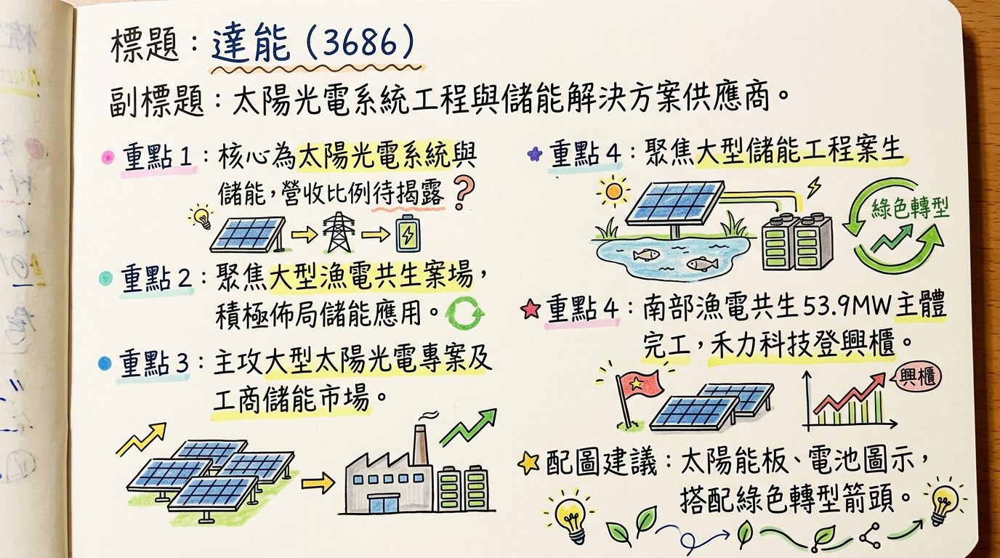
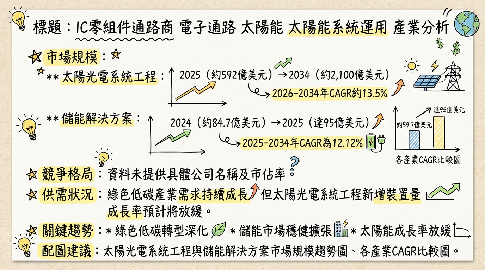
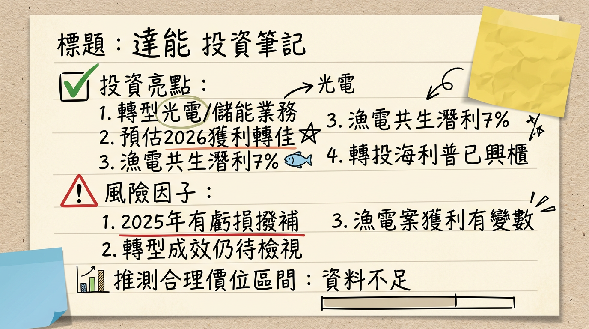

# 3686 達能 深度研究報告

## 一句話摘要
達能 (3686) 於2023年起積極轉型，核心業務聚焦於太陽光電系統工程與儲能解決方案，並透過轉投資強化綠能佈局。公司預期2026年將是轉型有成起步期，獲利能見度清晰，顯著優於2025年，受惠於台灣綠能政策與AI驅動的儲能需求激增，但執行效率與案場時程仍為關鍵。

## 公司概覽
達能科技自2023年起已積極從傳統太陽能產業轉型，將營運重心聚焦於綠色低碳產業，主要核心產品與服務為太陽光電系統工程與儲能解決方案。過去曾為太陽能矽晶片製造商，已於2019年退出並在2021年底完成廠房資產處置。

**業務與產品線：**
*   **太陽光電系統工程：** 透過轉投資禾力科技（或稱海利普科技，2025年11月27日登錄興櫃）參與業務，同時也直接參與大型案場開發，例如南部漁電共生53.9MW工程主建體已完成，並逐步推進併網工程。
*   **儲能解決方案：** 正積極評估與儲能領域公司深度合作，目標在2026年跨入儲能應用領域，並計畫於2027年擴展儲能系統業務。初期核心目標鎖定二次工商儲能、電信備援電力等業務。
*   **電子零組件材料交易：** 月營收報告仍提及此類交易，為轉型前之殘留業務。

**營收結構 (2024年資料)：**
| 業務類別         | 營收佔比 (2024) | 獲利貢獻 (定性) | 備註                                     |
| :--------------- | :-------------- | :-------------- | :--------------------------------------- |
| 商品銷售及服務   | 100.00%         | 主要營收        | 未細分綠能業務具體比例                     |
| - 太陽光電系統工程 | N/A             | 高 (轉投資禾力) | 2025年認列禾力逾1400萬元投資利益，漁電共生案場預期 7% 獲利率 |
| - 儲能解決方案   | N/A             | 潛在成長動能    | 2026年跨入應用，2027年擴展系統業務           |
| - 電子零組件材料交易 | N/A             | 少量            | 營收波動主因之一，採購策略審慎             |

**製造基地：**
達能目前主要透過轉投資及案場開發模式營運，已於2021年底處理完成閒置廠房資產，目前無自有製造基地。

## 核心競爭優勢
1.  **轉型先機與綠色聚焦：** 達能率先從傳統太陽能製造轉型至綠色低碳產業，聚焦高成長潛力的太陽光電系統工程與儲能解決方案，符合全球能源轉型趨勢。
2.  **政策紅利與市場潛力：** 受惠於台灣政府2026年再生能源佔比20%、2030年佔比30%的政策目標，加上AI資料中心對綠電及穩定供電的巨大需求，為達能提供堅實的市場基礎與成長動能。
3.  **靈活的合作與轉投資策略：** 透過轉投資禾力科技（海利普）參與漁電共生案場，並積極評估與儲能公司的深度合作，能有效整合資源，降低初期投入風險，加速業務佈局。
4.  **漁電共生案場執行經驗：** 參與南部53.9MW漁電共生專區開發案，累積大型複合型案場的開發與建置經驗，有助於未來拓展更多複雜型綠能專案。
5.  **ESG趨勢契合：** 公司的綠能轉型方向完全契合全球及企業對ESG永續經營的重視，有助於吸引長期資金關注。

## 財務分析

### 月營收趨勢
**最近 6 個月的月營收數字：**
| 月份      | 月營收 (仟元) | 月增率 (MoM) | 年增率 (YoY) | 來源     |
| :-------- | :------------ | :----------- | :----------- | :------- |
| 2026 年 1 月 | 7,299         | -12.77%      | 1.83%        | 公司公告 |
| 2025 年 12 月 | 8,368         | -3.73%       | 62.14%       | 公司公告 |
| 2025 年 11 月 | 8,692         | 25.48%       | 11.72%       | 公司公告 |
| 2025 年 10 月 | 6,927         | -2.98%       | -19.48%      | 公司公告 |
| 2025 年 9 月 | 7,140         | 1.94%        | 33.38%       | 公司公告 |
| 2025 年 8 月 | 7,000         | -12.36%      | 67.08%       | 公司公告 |
*註：2026年1月營收月減主因電子零組件材料交易品項規格與價格差異。*

### 季度數據
**最新一季 (2025年第三季) 及前幾季關鍵財務數據：**
| 項目          | 2025年Q3      | 2025年Q2      | 2025年Q1      | 2024年Q4      |
| :------------ | :------------ | :------------ | :------------ | :------------ |
| 季營收 (仟元) | 22,136        | 19,777        | 22,236        | 21,545        |
| 毛利率        | -0.88%        | -0.93%        | -1.04%        | -1.00%        |
| 營業利益率    | -32.3%        | -29.33%       | -27.22%       | -31.30%       |
| EPS (元)      | -0.14         | -0.17         | 0.00          | -0.09         |
*註：2025年第四季完整財報數據尚未公布。*

### 年度趨勢
**全年度營收與 EPS (2024實際 + 2025實際/預估)：**
| 年度    | 全年度營收 (萬元) | 全年度 EPS (元) | 備註     |
| :------ | :---------------- | :-------------- | :------- |
| 2024 年 | 8,254             | -0.06           | 實際     |
| 2025 年 | 約 8,581.6        | -0.31           | 實際/預估 |

## 法說會重點
達能目前未有公開的實體法說會資訊，但其月營收報告中提供了詳盡的營運策略與市場展望說明，可視為管理層的指導性發言。

**2025年11月19日（更新至2025年12月17日）法說會（內容彙整自營收報告與新聞）：**
*   **2026年展望：** 公司預期2026年將是轉型有成的起步期，獲利能見度清晰，整體表現將顯著優於2025年。
*   **轉投資效益：** 轉投資禾力科技（海利普）效益顯現，2025年已認列逾1400萬元的投資利益，預期2026年此項收益將持續增長。海利普科技已於2025年11月27日登錄興櫃。
*   **漁電共生案場：** 南部漁電共生專區開發案雖面臨土地取得競爭與時程延宕挑戰，但若順利推展，預期可帶來約7%的獲利率。主建體已完成，並逐步推進併網工程。
*   **儲能佈局：** 正積極評估與一家儲能領域公司進行深度合作，預計在未來3至6個月內會有更清晰的合作模式，目標在2026年跨入儲能應用領域，並計畫於2027年擴展儲能系統業務，初期鎖定二次工商儲能、電信備援電力。
*   **半導體產業：** 公司對記憶體市場採購策略保守，避免短期劇烈價格波動風險。
*   **太陽光電產業：** 台灣市場屋頂型與複合型場址進入規劃施工階段，儲能系統角色從「輔助」向「整合標配」過渡。公司策略為「分期開發 + 儲能提前規劃 + 多區域布局」以減輕環評與開發壓力。
*   **財務狀況：** 2025年上半年累計稅後淨損1264萬元，EPS -0.17元。2025年前三季累計EPS -0.31元。

**產能利用率、資本支出金額、下季/下半年 guidance：**
在目前的公開資訊中，未找到管理層在法說會中具體說明的產能利用率、資本支出金額，以及明確的下季/下半年營收或獲利量化指導。

## 券商觀點
目前未找到2025-2026年針對台股「達能」（3686）具體的券商目標價、EPS預估數字，以及重大評等調升/調降報告。這反映出公司處於轉型初期，券商研究覆蓋率可能較低，或對其未來獲利預期仍有較大不確定性。

**券商目標價彙整 (2025-2026年)：**
| 券商名稱 | 目標價 (新台幣元) | 評等 | 日期 |
| :------- | :---------------- | :--- | :--- |
| **無相關資訊** | N/A               | N/A  | N/A  |

## 財報深度分析

### 利潤率趨勢
**近 8 季毛利率、營業利益率、稅後淨利率趨勢：**
| 季度      | 毛利率  | 營業利益率 | 稅後淨利率 |
| :-------- | :------ | :--------- | :--------- |
| 2025年Q3  | -0.80%  | -37.54%    | -48.66%    |
| 2025年Q2  | -0.93%  | -29.33%    | -31.85%    |
| 2025年Q1  | -1.04%  | -27.22%    | 20.11%     |
| 2024年Q4  | -1.00%  | -31.30%    | -5.28%     |
| 2024年Q3  | -1.05%  | -31.61%    | 4.30%      |
| 2024年Q2  | -0.93%  | -28.06%    | -4.94%     |
| 2024年Q1  | -0.75%  | -26.73%    | 1.85%      |

**利潤率變化原因分析：**
達能自2023年轉型後，主要業務模式轉為系統工程與轉投資，毛利率持續為負值，反映了其商品銷售和服務成本高於收入，或因營收規模較小而難以攤提固定成本。儘管2025年Q2的營業毛利損失與營業淨利損失有所縮小，顯示核心業務效率略有改善，但2025年Q2營業外收入及支出從正值大幅轉負，導致稅前淨利惡化。2025年Q3稅後淨利率大幅惡化至-48.66%，顯示非營業損益對整體獲利影響巨大。轉投資禾力科技的投資利益雖有所認列，但尚未能完全扭轉公司整體虧損局面。

### 存貨與營運
*   **存貨週轉天數：**
    *   2025年Q3：-99999.00 天 (異常值)
    *   2024年Q3：2.45 天
    *   由於2025年Q3數據異常，無法判斷近期具體趨勢。
*   **應收帳款週轉天數：**
    *   2025年Q3：-99999.00 天 (異常值)
    *   2024年Q3：50.28 天
    *   由於2025年Q3數據異常，無法判斷近期具體趨勢。
*   **存貨是否有異常堆積或備料現象：** 鑑於週轉天數異常，難以直接判斷。但公司在月營收報告中提及，維持審慎採購策略，以穩健因應市場變化，並加強災損預防、備品備料與維運排程管理，以確保案場發電效率。

### 資本支出
目前未找到達能（3686）近三年（2024-2026）具體的資本支出金額與趨勢詳細數據。公司主要透過參與轉投資公司增資（如禾力科技）及策略性評估儲能公司合作來進行資本佈局，而非大規模自有製造基地擴建。南部漁電共生案的建置成本亦是其資本投入的一部分。
*   **折舊攤銷趨勢：** 未找到2024-2026年達能具體的折舊攤銷趨勢數據。

### 其他財報重點
*   **負債比率：** 2025年Q3為1.39%，較Q1的74.61%顯著下降，顯示負債總額佔總資產比率大幅改善。
*   **自由現金流量：** 2025年前9個月累積為-343.12%，Q3為-5084.88%，顯示公司自由現金流仍為負數且波動較大，營運仍需外部資金支持或仰賴轉投資收益。
*   **業外收支：** 2025年Q2營業外收入及支出從2024年同期的正值轉為負值，為導致當期稅前淨利惡化的主因。Q3業外收支/營收為-5.6%。轉投資海利普科技的獲利挹注是正向業外項目。

## 股權異動
*   **董監事/大股東申報轉讓：** 截至2026年3月3日，未見董監事或大股東的申報轉讓紀錄。
*   **庫藏股買回：** 未找到2024年以後庫藏股買回紀錄。
*   **可轉換公司債（CB）：** 未找到2024年以後發行可轉換公司債的相關資訊。
*   **增減資計畫：** 公司轉型策略包含持續參與太陽能系統工程公司增資，以維持20%股權。目前未找到其他現金增資或減資的公開資訊。
*   **股利政策：** 2024年度股利為0.0元，2025年度股利發放預期亦為0.0元。公司上次配發股利為2011年。

## 產業分析
達能營運重心已聚焦於太陽光電系統工程與儲能解決方案兩大綠色低碳產業。

### 產業數據

#### 1. 全球市場規模和 CAGR 成長率
**太陽光電系統工程：**
*   全球併網光伏系統市場預計2025年達約**592億美元**，2034年成長至約**2,100億美元**，預測期（2026-2034年）CAGR約為**13.5%**。
*   全球太陽能光伏產業2025年預計新增裝置量達**655 GW**，成長率放緩至**10%**。2026年全球成長可能出現暫時性下滑。

**儲能解決方案：**
*   全球儲能系統（ESS）市場2024年約**84.7億美元**，預計2025年達**95億美元**，2026年擴大至**106.5億美元**，2025-2034年CAGR為**12.12%**。
*   電池能源儲存系統（BESS）市場預計2025年**85.9億美元**成長至2026年**106.4億美元**，CAGR達**23.9%**。
*   全球儲能新增裝機容量預計2025年首次突破**100吉瓦（GW）**，同比增長**43%**，總裝機量約**270吉瓦**。2025年全球新增儲能裝機量約**290 GWh**，到2030年有望達**1.17 TWh**。

#### 2. 供需狀況
**太陽光電系統工程：**
*   全球光伏市場因產能過剩和價格下跌，產業整併持續。台灣廠商受中國低價模組傾銷影響，面臨價格壓力，2024年3月後跌勢才趨緩。
*   預計全球太陽能供需在**2026年恢復正常**。中國太陽能年新增發電量可能從2025年300GW驟降至2026年200GW，導致全球新增發電量首次年度下滑。
**儲能解決方案：**
*   2025年全球儲能市場供需格局已從「供過於求」轉向「緊平衡」，部分儲能電芯因「供不應求」而漲價。
*   預計2026年儲能需求側將延續高成長趨勢。美國和歐洲需求旺盛，電芯價格2025年Q3小幅回升，預計2026年Q1-Q2仍維持高位。

#### 3. 產業的平均毛利率水準
*   **太陽光電系統工程/模組製造：** 市場競爭激烈及中國傾銷導致台灣太陽能模組廠商利潤承壓，產品銷售單價在2年內下跌約**2成**。推斷目前毛利率仍低。
*   **儲能解決方案：** 缺乏整個產業的平均毛利率數據。但儲能電芯價格在2025年Q3回升可能對毛利率產生正面影響。致茂電子（2360）2025年毛利率為**61%**，但其主要為測試設備，與達能業務性質不同。

### 競爭格局

#### 1. 全球前 5 大公司及其市佔率
太陽光電系統工程和儲能解決方案的供應鏈複雜，難以找到單一「全球前五大公司及其市佔率」。
*   **太陽光電模組廠商：** 主要廠商包括ReneSola、JA SOLAR、Canadian Solar、Hanwha Q CELLS、Trina Solar、Jinko Solar等。
*   **儲能電池/系統廠商：** 寧德時代、比亞迪、欣旺達電子、海辰儲能為電芯領域巨頭。系統層面則有GridStor、Fluence Energy、特斯拉（Megapack）等。

#### 2. 達能 vs 主要競爭對手的具體比較
由於達能（3686）在太陽光電系統工程和儲能解決方案業務仍處於發展初期，且缺乏詳細的技術、產能、客戶和價格等公開數據，目前難以與全球或台灣主要競爭對手進行具體量化比較。達能主要透過轉投資禾力科技參與太陽能系統工程，並計畫於2026年跨入儲能應用。

#### 3. 台灣同業比較 (營收規模、毛利率、EPS 對比)
目前難以找到直接與達能核心業務（太陽光電系統工程、儲能解決方案）完全對標的台灣上市櫃公司，並取得2024-2025年的完整財報比較數據。
| 公司       | 業務類別                      | 2024年營收規模 (萬元) | 2024年毛利率 | 2024年EPS (元) | 備註                                   |
| :--------- | :---------------------------- | :-------------------- | :----------- | :------------- | :------------------------------------- |
| 3686 達能  | 太陽光電系統工程、儲能解決方案 | 8,254                 | -1.00% (Q4)  | -0.06          | 轉型初期，規模相對較小                  |
| 6244 茂迪  | 太陽能電池/模組               | 約 40億                 | N/A          | N/A            | 2024年營收受中國傾銷影響，預估營收腰斬 |
| 3576 聯合再生 | 太陽能電池/模組、系統         | 約 50億                 | N/A          | N/A            | 2024年營收受中國傾銷影響，預估營收腰斬 |
| 2360 致茂電子 | 量測設備（含儲能應用）        | 283.11億              | 61%          | 27.7           | 非直接競爭，但其儲能相關設備業務提供產業參考 |
*註：台灣太陽能模組廠2024年普遍面臨量價減損，營收跌幅達5-7成，主因中國低價模組傾銷。達能已退出晶片製造，業務重心不同。*

### 產業趨勢

#### 1. 影響該產業的關鍵技術趨勢和具體影響
*   **AI 算力基建驅動儲能需求激增：** AI發展導致資料中心電力需求爆發式成長（全球數據中心電力需求預計2026年成長**17%**，2030年前每年**14%**成長）。為滿足龐大用電需求並確保電網可靠性，儲能系統成為AI時代用電焦慮下的關鍵解決方案，尤其用於管理大量的毫秒級「訓練負載」。
*   **儲能技術多元化與長時儲能發展：** 鋰離子電池仍佔主導，但鈉離子電池、液流電池、鐵空氣電池等非鋰電池技術正迅速發展，提高系統靈活性。長時儲能系統（6-8小時甚至更長）日益普及，以平衡電網不穩定性。
*   **全球供應鏈重組與在地化政策：** 地緣政治因素（如美國FEOC規範）推動太陽能和儲能產業供應鏈「去中化」，鼓勵國內和區域製造。這將重塑全球供應鏈格局，可能導致部分關鍵材料或組件出現暫時性瓶頸，但同時也為非中國廠商帶來機會。

#### 2. 對達能而言的具體機會和威脅
**機會：**
*   **儲能市場高速成長與AI驅動的新需求：** 全球及台灣儲能市場處於高速成長期，AI算力基建帶來的新型用電需求為儲能解決方案創造巨大增量空間。達能計畫2026年跨入儲能應用、2027年擴展系統業務，並鎖定二次工商儲能和電信備援電力，恰好能抓住此機遇。
*   **政策支持與綠電需求：** 台灣政府積極推動能源轉型和淨零碳排，加上用電大戶條款及RE100供應鏈要求，為太陽光電系統工程和儲能業務提供良好發展環境。
*   **去中化趨勢下的轉型優勢：** 若達能能結合台灣製造或多元化供應鏈，在全球供應鏈重組趨勢下，有望取得競爭優勢。

**威脅：**
*   **產業競爭加劇與價格壓力：** 太陽光電與儲能市場競爭日益激烈，尤其太陽能模組的低價競爭對台灣廠商造成壓力。達能作為轉型公司需建立強大實力與差異化服務。
*   **電網基礎設施瓶頸與技術人力不足：** 電網容量限制和技術人力短缺可能影響大型案場的併網進度和整體專案執行效率。
*   **原材料價格波動與供應鏈不確定性：** 供應鏈重組可能導致短期組件瓶頸和成本上升。環評法規加嚴也可能延長開發時程與增加不確定性。

#### 3. 相關投資題材的具體連結
*   **AI 算力基建：** AI的爆炸性成長對電力需求產生巨大影響，直接推動對穩定、可靠且具備綠色屬性的儲能解決方案需求。達能鎖定的二次工商儲能、電信備援電力，可為AI數據中心提供必要的電力基礎設施和應急備援。
*   **綠色能源與淨零碳排：** 達能的核心業務直接契合全球綠色能源轉型和淨零碳排主旋律，符合政府政策支持及企業ESG承諾。
*   **智慧電網與能源管理：** 儲能技術與AI結合將推動智慧電網發展，透過預測分析和最佳化充放電循環，儲能系統能更有效進行負載平衡、頻率調節，達能的解決方案是智慧電網的關鍵組成部分。

## 近期催化劑

### 利多催化劑
*   **2026年3月5日：** 公告召開股東會，將審議114年度營業報告與虧損撥補，並選舉新一屆董事，為公司治理與未來營運方向提供明確指引。
*   **2026年2月5日：** 受惠於AI資料中心綠電需求題材，市場買氣推升股價，顯示投資人對其轉型方向與市場趨勢的連結抱有期待。
*   **2026年1月營收報告：** 管理層積極提出「分期開發 + 儲能提前規劃 + 多區域布局」策略，並持續與潛在儲能合作廠商進行評估，展現積極的業務拓展決心。
*   **2025年12月17日 (法說會重點更新)：** 公司預期2026年將是轉型有成的起步期，獲利能見度清晰，整體表現將優於2025年。
*   **2025年12月17日：** 轉投資禾力科技（海利普科技）效益顯現，2025年已認列逾**1400萬元**的投資利益，預期2026年此項收益將持續增長。海利普已於2025年11月27日登錄興櫃，強化其資本結構。
*   **2025年12月：** 南部漁電共生53.9MW工程主建體已完成，並逐步推進併網工程，若順利推展預期可帶來約**7%**的獲利率。
*   **2026年累計至3月2日：** 外資買超**805張**（佔發行量1.05%），自營商買超**22張**（佔發行量0.03%），顯示法人對其後市持謹慎樂觀態度。

### 利空/風險提示
*   **2026年2月10日：** 公布2026年1月營收為新台幣**7.299百萬元**，較上月減少**12.77%**，儘管YoY增長1.83%，但MoM下滑可能引發短期市場疑慮。
*   **2025年11月 (法說會重點)：** 南部漁電共生開發案面臨土地取得競爭激烈、環評審查趨嚴和時程延宕的挑戰，可能影響獲利實現時程。
*   **2025年11月：** 國內太陽能安裝量較前期有明顯下降，市場供應鏈與安裝商尋求新的合作與佈局，顯示太陽光電產業仍面臨挑戰。大型地面/農漁電案場因供貨延遲與人力不足被迫延後。
*   **2026年1月營收報告：** 半導體產業記憶體市場供需不平衡，DRAM與NAND價格持續上揚，公司採購策略保守，避免短期劇烈價格波動風險，暗示其電子零組件材料業務仍受市場波動影響。
*   **總經風險：** 台灣綠能政策穩定性、碳費/碳關稅細則及PPA合約模式轉換等，皆可能影響市場發展與公司營運。

## ⭐ 成長動能時間軸

| 時間        | 成長動能項目             | 具體內容                                                                   | 影響            |
| :---------- | :----------------------- | :------------------------------------------------------------------------- | :-------------- |
| 2025年11月27日 | 轉投資效益顯現           | 轉投資公司禾力科技 (海利普科技) 登錄興櫃，營運體質與資本結構強化。         | **資本動能提升** |
| 2025年 (全年) | 轉投資收益             | 認列禾力科技投資利益逾**1400萬元**。                                     | **獲利挹注**    |
| 2025年Q3 (完成) | 漁電共生案場進度         | 南部漁電共生 53.9MW 工程主建體完成。                                     | **里程碑達成**  |
| 2025年Q4 (啟動) | 儲能合作模式             | 評估與儲能領域公司深度合作，預計未來3至6個月內有更清晰合作模式。           | **新業務佈局**  |
| 2026年 (全年) | 整體營運展望             | 預期為轉型有成的起步期，獲利能見度清晰，整體表現將顯著優於2025年。         | **營運轉折點**  |
| 2026年 (全年) | 轉投資收益持續           | 禾力科技投資收益預計持續增長。                                           | **穩定獲利源**  |
| 2026年 (全年) | 儲能業務跨入             | 目標跨入儲能應用領域，初期鎖定二次工商儲能、電信備援電力。                 | **新成長引擎**  |
| 2026年 (持續) | 漁電共生併網與開發       | 南部漁電共生工程逐步推進併網，若順利預期可帶來約**7%**獲利率。新案場完成土地整合，加速申設程序。 | **營收/獲利貢獻** |
| 2027年 (規劃) | 儲能系統業務擴展         | 計畫擴展儲能系統業務。                                                     | **長期成長規劃** |
| 持續 (2026/2030目標) | 政策需求               | 台灣政府設定2026年再生能源佔比**20%**、2030年**30%**的目標。臺電規劃2025年電網端儲能目標**1500 MW**，2030年達**5500 MW**。 | **市場需求保障** |
| 持續 (短期)   | AI 資料中心綠電需求      | AI巨頭擴大資料中心建設，推升再生能源需求，達能作為供應鏈受惠。             | **新興市場需求** |
| 持續 (短期)   | 儲能系統整合標配         | 儲能系統在光電案場角色從「輔助」向「案場整合標配」過渡，提升案場附加價值。 | **市場標準提升** |

## 2026 展望
達能2026年展望為轉型效益顯現的起步期，核心成長動能來自於綠色低碳產業的深化佈局。

**成長動能：**
1.  **儲能業務開展：** 預計2026年正式跨入儲能應用，鎖定二次工商儲能與電信備援電力，有望抓住全球與台灣儲能市場的爆發性成長（CAGR預估高達23.9%），特別是受AI資料中心綠電需求激增的帶動。
2.  **漁電共生案場貢獻：** 轉投資禾力科技的南部漁電共生53.9MW案場主建體已完成並逐步併網，預期2026年將持續貢獻獲利，並帶來約7%的獲利率，成為穩定的收益來源。
3.  **轉投資收益增長：** 禾力科技登錄興櫃後，其營運體質強化，預計2026年對達能的投資利益將持續增長，進一步改善整體獲利。
4.  **政策與趨勢紅利：** 台灣堅定的綠能政策目標（2026年再生能源佔比20%）以及全球淨零碳排、ESG浪潮，為達能的綠能業務提供強勁的市場推力。

**潛在風險：**
1.  **案場執行與時程風險：** 大型漁電共生案場開發仍受土地取得、環評審查趨嚴及地方利害關係人協商等外部因素影響，可能導致時程延宕及成本增加，影響獲利實現。
2.  **市場競爭加劇：** 太陽光電系統工程與儲能解決方案市場競爭激烈，尤其中國廠商低價模組傾銷對台灣產業鏈仍有壓力，達能需建立差異化優勢。
3.  **儲能合作不確定性：** 雖積極洽談儲能合作，但合作模式與實際效益仍待未來3-6個月清晰化，初期業務拓展可能面臨挑戰。
4.  **營收規模與獲利穩定性：** 儘管獲利能見度清晰，但公司營收規模仍較小，且利潤率尚未轉正，初期獲利穩定性仍需觀察。
5.  **電網瓶頸與技術人力：** 台灣電網基礎設施瓶頸及技術人力短缺，可能限制大型綠能專案的併網進度與整體發展速度。

綜合來看，達能2026年正處於關鍵的轉型收穫期，儲能與漁電共生是兩大核心驅動力，但仍需高度關注其專案執行效率與市場競爭動態。

## 投資結論
綜合以上深度分析，達能 (3686) 作為一家積極轉型至綠色低碳產業的公司，在2026年迎來關鍵的營運轉折點，具備中長期投資價值，但初期仍伴隨執行風險。

1.  **轉型效益逐步顯現，獲利改善可期：** 達能已成功從傳統太陽能製造轉型至前景廣闊的太陽光電系統工程與儲能解決方案。管理層明確預期2026年將是轉型有成的起步期，獲利將顯著優於2025年（2025年EPS為-0.31元），預示有望實現轉虧為盈，其中轉投資禾力科技的投資利益持續增長及漁電共生案場的獲利貢獻為主要支撐。
2.  **儲能市場前景廣闊，達能戰略卡位：** 全球及台灣儲能市場正處於爆發性成長階段，尤其受AI資料中心綠電需求激增的推動，市場規模持續擴大。達能計畫2026年跨入儲能應用，並鎖定二次工商儲能及電信備援電力等利基市場，若合作夥伴關係順利確立並執行，將為公司開啟巨大的成長空間。
3.  **政策與題材雙重利多：** 台灣政府堅定的綠能政策目標、用電大戶條款，以及國際ESG與淨零碳排趨勢，為達能的綠能業務提供了穩固的政策紅利。同時，AI算力基建帶來的綠電需求，使達能與市場熱門題材緊密連結，有助於提升市場關注度與估值溢價。
4.  **營運執行效率與風險控管為關鍵：** 儘管成長動能明確，達能仍面臨大型案場開發時程延宕、環評審查趨嚴、市場競爭加劇以及電網基礎設施瓶頸等挑戰。公司管理層在專案執行、成本控制及風險管理上的能力，將直接影響其預期獲利的實現與否。
5.  **目標價區間建議：** 考慮達能2026年轉型效益逐步顯現，預期獲利將由負轉正，加上其所處的儲能及綠電產業具有高成長潛力，我們建議投資人可將其視為具備中長期成長潛力的標的。鑑於目前公司營運仍處於轉型初期，且缺乏具體2026年EPS預估，若保守預期2026年每股獲利可達新台幣0.5元至0.8元，並給予其成長型企業相對合理的30-40倍本益比，則目標價區間約為**新台幣15元至32元**。此區間建議需密切關注公司在漁電共生與儲能專案上的實際執行進度及獲利貢獻。

本報告由 AI 自動產生，資料來源為公開網路資訊，僅供參考，不構成投資建議。產生時間：2026-03-06 00:25

---

## 📊 資訊卡

