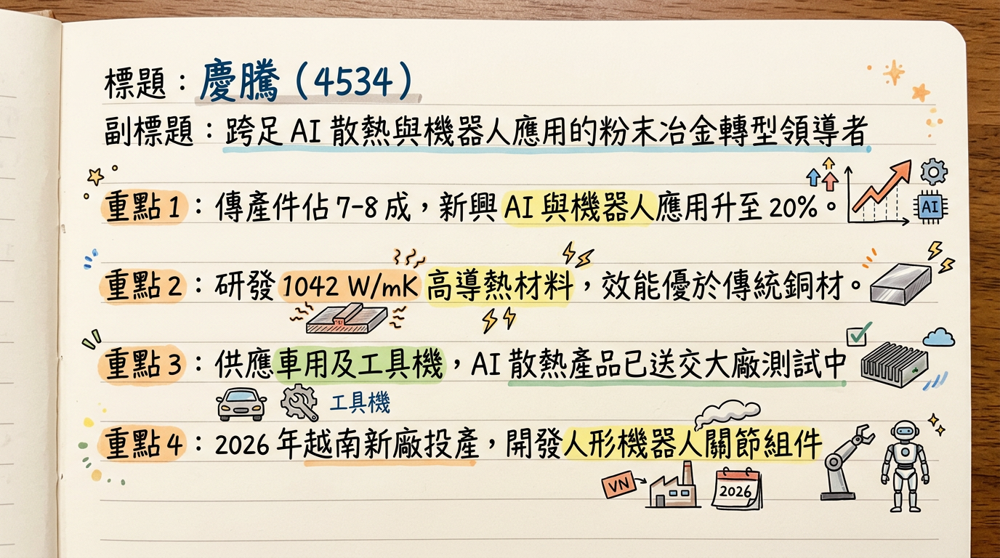
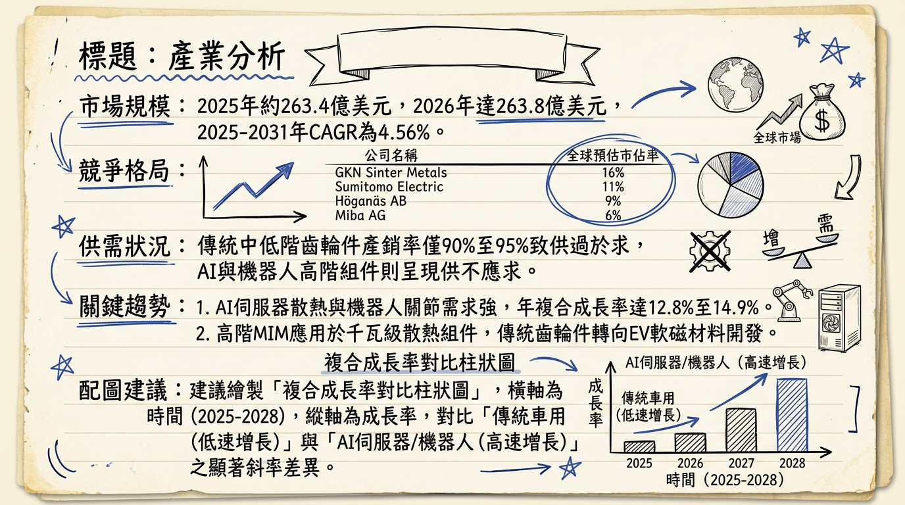
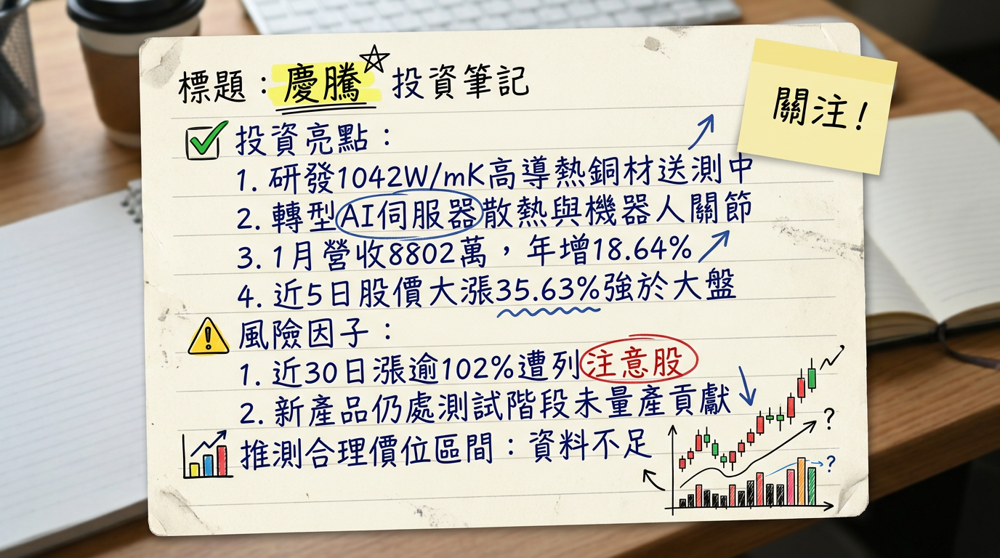

# 4534 慶騰 (King Point) 深度研究報告

## 一句話摘要

慶騰正從傳統粉末冶金廠轉型為 **「AI 散熱材料 + 機器人核心組件」** 供應商，憑藉優於純銅 2.6 倍的導熱技術切入 AI 供應鏈，2026 年將迎來越南與美國新產能投產的轉型關鍵元年。

---

## 公司概覽

慶騰精密（4534）為台灣粉末冶金（PM）領軍企業，核心技術涵蓋粉末冶金、金屬射出成型（MIM）及粉末鍛造。目前公司正處於結構性轉型期，產線由低毛利手工具轉向高單價科技應用。

### 業務與產品線營收結構 (2025/12 法說會數據)

| 業務類別               | 主要產品                               | 營收佔比  | 發展重心                    |
| :--------------------- | :------------------------------------- | :-------- | :-------------------------- |
| **傳統應用**     | 電動工具齒輪箱、汽車引擎及變速箱零組件 | 70% - 80% | 產能移往越南，優化成本      |
| **新興高階應用** | AI 伺服器散熱、機器人關節、醫療器材    | 20% - 30% | 研發重點，2026 預期佔比提升 |

---

## 核心競爭優勢

1. **超高導熱材料技術：** 開發出導熱係數達 **1042 W/mK** 的銅複合材料，顯著優於傳統純銅（400 W/mK），滿足 AI 伺服器 TDP 跨越 1000W 的液冷需求。
2. **機器人精密組件量產能力：** 具備 MIM 一次成型複雜幾何件優勢，提供人形機器人高精度減速器與關節模組，重量較傳統切削件輕且具規模成本優勢。
3. **高階醫材認證：** 通過 **ISO 13485** 認證，並成功進入嬌生（J&J）與美敦力（Medtronic）供應鏈，提供非循環性穩定營收。

---

## 財務分析

### 近 6 個月月營收趨勢表

| 月份              | 營收金額 (萬元) | 月增率 (MoM)      | 年增率 (YoY)      | 備註                 |
| :---------------- | :-------------- | :---------------- | :---------------- | :------------------- |
| **2026/01** | 8,802           | -11.19%           | **+18.64%** | 轉型產品開始小量貢獻 |
| **2025/12** | 9,910           | **+59.32%** | **+21.53%** | 營運趨勢顯著轉強     |
| **2025/11** | 6,220           | -3.66%            | -15.79%           | 產業調整末期         |
| **2025/10** | 6,457           | -6.13%            | -7.56%            | 庫存去化中           |
| **2025/09** | 6,878           | +1.75%            | -1.29%            | 表現持平             |
| **2025/08** | 6,760           | -17.30%           | +7.81%            | 傳統淡季影響         |

### 季度與年度趨勢

* **2025 年度營收：** 實績約 **8.19 億元** (YoY -2.7%)。
* **2025 前三季 EPS：** 累計 **-0.54 元**，反映上半年本業承壓，但在第四季營收回升下，虧損有收斂跡象。

---

## 法說會重點 (2025/12/16)

* **轉型宣告：** 正式定位為 AI 與機器人核心組件供應商。
* **產能配置：** **2026 年越南新廠投產**，承接低毛利傳統訂單；台灣及中國廠區全面轉產高毛利（AI/機器人/醫療）產品。
* **具體 Guidance：** 銅複合材料已送交 AI 伺服器大廠測試，預計 2026 年為轉型獲利元年。

---

## 券商觀點

目前主流大型券商對 4534 追蹤較少，多為獨立研究機構觀點：

| 券商/機構名  | 目標價      | 評等   | 日期    | 核心邏輯                            |
| :----------- | :---------- | :----- | :------ | :---------------------------------- |
| 元富證券     | N/A         | 未評等 | 2025/12 | 強調 AI 複合材料轉型潛力            |
| 市場綜合預估 | 32.0 - 35.0 | 偏多   | 2026/02 | 預期 2026 轉盈，EPS 挑戰 0.5-0.8 元 |

---

## 財報深度分析

### 利潤率趨勢表格 (近 8 季)

| 季度              | 毛利率 (%)       | 營業利益率 (%) | 稅後淨利率 (%) | 每股盈餘 (EPS)    |
| :---------------- | :--------------- | :------------- | :------------- | :---------------- |
| **2025 Q3** | **14.90%** | -4.18%         | 0.09%          | **0.01 元** |
| **2025 Q2** | 10.63%           | -9.99%         | -18.21%        | -0.38 元          |
| **2025 Q1** | 11.84%           | -8.28%         | -7.14%         | -0.16 元          |
| **2024 Q4** | 16.01%           | -5.41%         | 5.23%          | 0.10 元           |
| **2024 Q3** | 18.40%           | -3.30%         | -3.37%         | -0.08 元          |
| **2024 Q2** | 18.04%           | 2.79%          | 3.92%          | 0.10 元           |
| **2024 Q1** | 16.32%           | -0.46%         | 3.69%          | 0.08 元           |
| **2023 Q4** | 11.93%           | -7.54%         | -12.56%        | -0.27 元          |

* **營運分析：** 2025 Q3 毛利雖回升至 14.9%，但營業利益率仍為負值，顯示產能利用率仍有提升空間。
* **存貨與資本支出：** 存貨週轉天數 **109.88 天** 略高於往年；資本支出維持在每季 1,000-2,500 萬台幣，主要投資於新廠設備。

---

## 股權異動與資本結構

* **大股東動態：** 慶璉投資（持股 **19.9%**）持股穩定，未見申報轉讓。
* **融資與債務：** 負債比率升至 **51.43%**，財務槓桿偏高；目前無執行中之可轉債（CB）。
* **股利政策：** 連續 7 年未發放股利（含 2024 盈餘決議不分派）。

---

## 產業分析

### 全球粉末冶金競爭格局 (2025 估計)

| 排名 | 公司名稱              | 全球市佔率 | 核心動態                                  |
| :--- | :-------------------- | :--------- | :---------------------------------------- |
| 1    | GKN Powder Metallurgy | 15% - 18%  | 強攻 EV 驅動電機組件                      |
| 2    | Sumitomo (住友電工)   | 10% - 12%  | 擴大銅-石墨複合材料產能                   |
| 3    | Höganäs AB          | 8% - 10%   | 主導綠色鋼粉技術                          |
| 4    | **慶騰 (4534)** | < 1%       | **技術領先 (1042 W/mK) 但規模較小** |

### 台灣同業比較

| 公司名稱                  | 2025 預估毛利率 | 特色                          |
| :------------------------ | :-------------- | :---------------------------- |
| **慶騰 (4534)**     | 15% - 18%       | AI 散熱、機器人、醫療多重題材 |
| **保來得 (Porite)** | 18% - 22%       | 台灣 PM 龍頭，專注車用        |
| **精確 (1530)**     | 12% - 15%       | 專注 EV 電池盒壓鑄            |

---

## 近期催化劑

* **利多：**
  1. 美國政府力挺機器人產業政策帶動題材爆發。
  2. 2026/01 營收 YoY +18.64% 轉強。
  3. 銅複合材料若通過 AI 伺服器平台認證將有爆發性接單。
* **利空：**
  1. 被列入櫃買中心「注意股」（漲幅過大）。
  2. 本業營益率尚未轉正，本業獲利仍有斷層。

---

## ⭐ 成長動能時間軸

* **2025 H2：** 馬來西亞廠開始投產，規避貿易戰風險。
* **2025/12/16：** 法說會宣告轉型「AI + 機器人」為核心。
* **2026/01：** 營收 8,802 萬，YoY 轉正並展現成長動能。
* **2026 Q2：** **越南新廠、美國加州 NCT 廠** 預計啟用，目標切入美國在地機櫃與手工具供應鏈。
* **2026 H2：** 下一代 AI 伺服器平台發表，慶騰液冷散熱組件預期進入量產階段。

---

## 2026 展望

* **成長動能：** AI 散熱材料認證通過與越南廠成本優化。預估全年營收有望重回 **10 億元** 以上，年增率挑戰 **20-30%**。
* **風險因子：** 客戶測試週期過長、全球原物料（銅粉）價格波動、高負債比（51%）之財務壓力。

---

## 投資結論

1. **轉型初顯成效：** 2026 年初營收年增率轉正，顯示新產品已開始小量貢獻，基本面最壞情況已過。
2. **技術護城河：** 1042 W/mK 材料在 AI 散熱領域具備稀缺性，是目前市場少見能提供此規格的台廠。
3. **注意籌碼過熱：** 近 30 個營業日漲幅逾 100%，股價淨值比偏高，技術面有過熱風險，不建議追高。
4. **具體建議：** 2026 年預估 EPS 挑戰 0.5-0.8 元，若獲利如期翻正，合理本益比可望在題材支撐下推升。**建議目標價區間為 22 - 32 元**（基於 2026 轉盈預期與機器人題材溢價）。

---

本報告由 AI 自動產生，資料來源為公開網路資訊，僅供參考，不構成投資建議。產生時間：2026-03-02 10:24

---

## 📊 資訊卡

