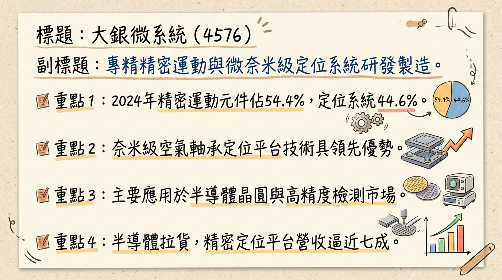
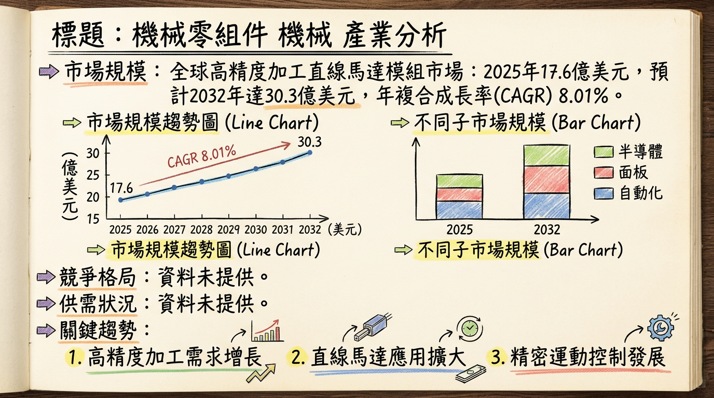
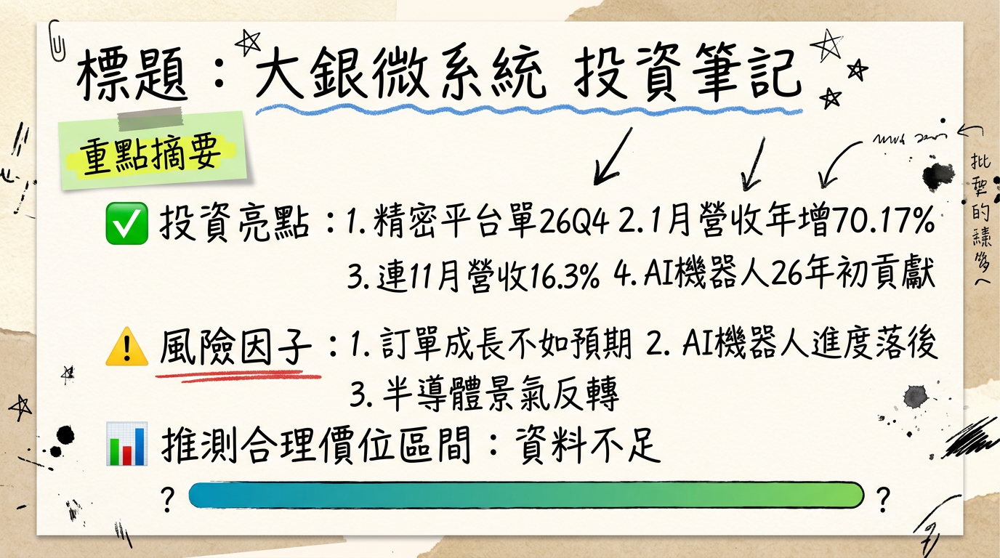

# 4576 大銀微系統 深度研究報告

## 一句話摘要
大銀微系統（4576）受惠於半導體先進製程與AI驅動的高階精密定位平台需求強勁，訂單能見度已拉長至2026年第四季，產品結構持續優化。2025年EPS達新台幣2.01元，年增47.06%。管理層預期2026年營收及獲利將維持雙位數成長，毛利率目標維持在35%以上，營運展望樂觀。

## 公司概覽
大銀微系統（4576）是一家專注於精密運動及控制元件、微米與奈米級定位系統的研發、製造與銷售公司。

**核心產品線：**
*   **精密定位平台：** 提供微米與奈米級的定位系統，其中空氣軸承定位平台能實現奈米等級的重複定位精度，廣泛應用於晶圓檢測與曝光設備等高精度場景。
*   **精密運動及控制元件：** 包含線性馬達、力矩馬達、伺服馬達、驅動器、編碼器、線性致動器及位置量測系統等。

**營收結構 (2024年)：**
| 產品線                  | 營收佔比 (2024年) |
| :---------------------- | :---------------- |
| 精密運動及控制元件      | 54.40%            |
| 微米與奈米級定位系統    | 44.59%            |
| 其他業務                | 1.01%             |

**營收結構變化趨勢：** 最新市場分析指出，受惠於半導體拉貨動能，2025年第四季精密定位平台類產品的營收佔比已逼近七成，預估2026年第一季仍可維持在六成以上，顯示營收結構正朝高毛利、高階精密定位平台調整。

**製造基地：**
公司生產佈局主要以**台中總廠**與**精科二廠**為主，並保有**雲科廠**及**新竹鳳山廠**，作為未來擴產與就近服務高科技客戶的資源。目前未明確指出各製造基地的具體營收貢獻比例。公司表示若接單持續擴大，雲科廠可提供更大的生產規模支援，且需約一季時間調整並提升產能以配合客戶需求。

## 核心競爭優勢
*   **技術領先的奈米級定位精度：** 具備空氣軸承定位平台等核心技術，能夠實現奈米等級的重複定位精度，滿足半導體晶圓檢測與曝光設備等最嚴苛的高精度應用。
*   **全面的精密運動控制解決方案：** 提供從線性馬達、力矩馬達、伺服馬達、驅動器到編碼器等多元且完整的精密運動與控制元件產品線。
*   **深耕高階半導體應用：** 產品成功切入國際晶圓代工及先進封裝客戶供應鏈（如CoWoS、CoPoS、FOPLP），受惠於2奈米製程與HBM4等先進技術對高精度的需求。
*   **前瞻性佈局新興產業：** 積極拓展AI物流機器人、人形機器人、智慧自動化及CPO矽光子等新興應用市場，為未來成長開拓新動能。
*   **國際級客戶基礎：** 主要客戶涵蓋豐田汽車、東京威力科創、美商應材、荷蘭ASML以及科磊等全球領導廠商，彰顯其產品品質與技術實力。

## 財務分析

### 月營收趨勢
| 月份      | 金額 (新台幣億元) | 月增率 MoM | 年增率 YoY |
| :-------- | :---------------- | :--------- | :--------- |
| 2026年01月 | 2.78              | -0.39%     | +70.17%    |
| 2025年12月 | 2.79              | +20.04%    | +18.37%    |
| 2025年11月 | 2.33              | -4.27%     | +16.30%    |
| 2025年10月 | 2.43              | -0.57%     | +32.99%    |
| 2025年09月 | 2.45              | +13.44%    | +12.74%    |
| 2025年08月 | 2.16              | -5.94%     | +4.05%     |

### 季度數據
**2025年第四季財務表現：**
*   季營收：新台幣 7.55 億元
*   毛利率：38.42%
*   營業利益率：13.23%
*   EPS：新台幣 0.75 元

### 全年度營收與 EPS
| 年度   | 營收 (新台幣億元) | EPS (新台幣元) |
| :----- | :---------------- | :------------- |
| 2024年 | 22.54             | 0.51           |
| 2025年 | 27.14             | 2.01           |
| 2026年 | 30.55 ~ 31.89     | 3.31 ~ 3.71    |

## 法說會重點
**最近一次法說會日期：** 2025年11月13日 (2025年第三季法人說明會)

**管理層對各產品線的具體出貨量/訂單能見度說明：**
*   **精密定位平台：** 接單能見度已拉長至4至6個月，部分專案甚至看到2026年第四季的訂單排程。多家國際半導體大廠的訂單能見度可見到2026年5至6月。
*   **元件類產品 (包含馬達與驅動器等關鍵零組件)：** 訂單能見度已由過去的1至2個月延長至接近3個月。
*   2025年下半年半導體應用訂單優於上半年，主要來自AI及半導體產業。
*   **AI物流機器人：** 與矽谷新創公司合作開發，預計2025年底前可望開始小量出貨。

**產能利用率、資本支出金額：**
*   **產能：** 公司生產布局以台中總廠與精科二廠為主，並保有雲科廠及新竹鳳山廠作為擴產與就近服務高科技客戶的資源。公司表示廠房空間充足，若接單持續擴大，雲科廠可提供更大生產規模支援，且需約一季時間調整並提升產能以配合客戶需求。
*   **資本支出金額：** 未找到2024年以後的最新具體資本支出金額資料。

**管理層給出的下季/下半年 guidance：**
*   2026年第一季營收預期可望維持接近2025年第二至第三季的表現，並維持雙位數年增。
*   2026年毛利率目標為維持在35%以上水準。
*   預期2026年營運看成長，營收將維持雙位數年增，毛利率亦可望較去年改善。

## 券商觀點
| 券商名稱      | 目標價 (新台幣元) | 評等       | 日期          |
| :------------ | :---------------- | :--------- | :------------ |
| 兩家券商 (匿名) | 152 ~ 166         | 看多       | 2026年03月03日 |
| B 投顧 (匿名) | 220               | 增加持股   | 2026年Q1      |
| C 證券 (匿名) | 195               | 中立       | 2026年Q1      |
| 兆豐證券      | 150               | 看多       | 2025年09月24日 |

**券商對 2025-2026 年 EPS 的預估數字：**
*   **2025年 EPS 預估：**
    *   兆豐證券 (2025年09月24日)：新台幣 2.06 元 (實際2025年EPS為2.01元)
*   **2026年 EPS 預估：**
    *   兩家券商 (匿名，2026年03月03日)：新台幣 3.31 元 至 3.71 元之間

**近期重大調升/調降評等：**
*   2026年03月03日，有兩家券商發布績效評等報告，皆評等為「看多」。
*   2025年12月08日，法人機構平均預估年度稅後純益預期可達2.45億元，較上月預估「調升」2.08%。

## 財報深度分析

### 利潤率趨勢
大銀微系統近期的利潤率呈現波動後逐步回升的趨勢，特別是2025年第四季毛利率與營業利益率表現亮眼。

| 季度       | 毛利率 (%) | 營業利益率 (%) | 稅後淨利率 (%) |
| :--------- | :--------- | :------------- | :------------- |
| 2025年第四季 | 38.42      | 13.23          | 12.61          |
| 2025年第三季 | 33.74      | 10.40          | 11.17          |
| 2025年第二季 | 37.78      | 15.46          | 3.46           |
| 2025年第一季 | 35.82      | 8.03           | 10.91          |
| 2024年第四季 | 33.08      | 7.51           | 6.22           |
| 2024年第三季 | 33.07      | 5.70           | 4.95           |
| 2024年第二季 | 31.58      | 4.03           | 6.48           |
| 2024年第一季 | 24.87      | -11.64         | -3.29          |

**利潤率變化原因分析：**
2024年第一季營運呈現虧損，毛利率及營業利益率處於低點。隨後營運逐步改善，2024年第四季營業利益率回升至7.51%，主要受惠於營收成長及營業費用下滑，使獲利體質有所改善。2024年下半年，半導體高精密定位平台的訂單能見度從3-6個月延長至3-8個月以上，元件類訂單能見度也從1.5個月增加到2個月，顯示市場需求回溫。展望2025年，微米及奈米級定位系統的營收成長性較佳，主要動能來自半導體設備以及AI、高速運算等終端應用需求推升。2025年第四季精密定位平台類營收占比逼近七成，預計2026年第一季仍可維持在六成以上。法人預期，隨著新台幣回貶及精密定位平台比重提升，2026年第一季毛利率將較2025年下半年回升，目標維持在35%以上水準。值得注意的是，2025年第二季因業外匯兌損失導致稅後淨利短暫下滑。

### 存貨分析
*   **存貨金額：**
    *   2025年第四季：約13.04億元
    *   2025年第三季：約13.08億元
    *   2025年第二季：約12.71億元
    *   2025年第一季：約12.58億元
    *   2024年第四季：約12.08億元
    *   2024年第三季：約11.96億元
    *   2024年第二季：約11.75億元
    *   2024年第一季：約11.83億元
*   **存貨週轉天數：**
    *   2025年第三季：173.82 天
    *   2025年第二季：188.29 天
    *   2025年第一季：212.89 天
    *   2024年第四季：194.05 天
    *   2024年第三季：204.92 天
    *   2024年第二季：215.29 天
    *   2024年第一季：270.22 天
    *   **分析：** 存貨金額自2024年第一季的低點後呈現緩慢增加趨勢，而存貨週轉天數則呈現下降趨勢，顯示存貨去化速度加快，營運效率提升。2024年第四季存貨未見異常拉抬，且來到2018年以來低點，存銷比持續下滑，被視為景氣早期復甦的跡象。
*   **應收帳款週轉天數：**
    *   2025年第三季：64.87 天
    *   2025年第二季：57.67 天
    *   2025年第一季：65.53 天
    *   2024年第四季：62.21 天
    *   2024年第三季：63.99 天
    *   2024年第二季：62.39 天
    *   2024年第一季：79.65 天
    *   **分析：** 應收帳款週轉天數在2024年第一季較高後，呈現波動下降趨勢，顯示公司收款效率有所改善。

### 資本支出與折舊攤銷
*   **折舊攤銷趨勢：**
    *   2025年第四季：折舊費用約4,616萬元，攤銷費用約142萬元。
    *   2025年累計前三季：折舊費用約1.18億元，攤銷費用約0.05億元。
    *   2024年全年：折舊費用約1.67億元，攤銷費用約0.083億元。
    *   **分析：** 折舊與攤銷費用呈現穩定趨勢。
*   **資本支出金額與趨勢 (取得不動產、廠房及設備)：**
    *   2025年第四季：約6,275萬元
    *   2025年第三季：約3,025萬元
    *   2025年第二季：約2,986萬元
    *   2025年第一季：約3,020萬元
    *   2024年第四季：約3,353萬元
    *   2024年第三季：約2,654萬元
    *   2024年第二季：約2,400萬元
    *   2024年第一季：約1,600萬元
    *   **分析：** 近八季的資本支出呈現逐季增加的趨勢，顯示公司可能正在擴大投資或進行設備更新，以支持營運發展和未來產能擴充。目前未找到明確的2025-2026年未來資本支出具體金額與預計新增產能計畫。

## 股權異動
*   **近期董監事/大股東申報轉讓紀錄：**
    *   2023年12月，法人董事代表人卓永財曾贈與443張股票予卓秀瑜，轉讓期間為2023年12月26日至12月28日。未找到2024-2026年其他董監事/大股東申報轉讓的最新資料。
*   **庫藏股買回紀錄：** 未找到2024-2026年的最新庫藏股買回紀錄。
*   **是否發行可轉換公司債（CB）及轉換價格：** 未找到2024-2026年發行可轉換公司債的最新資料。
*   **近期是否有現金增資或減資計畫：** 未找到2024-2026年現金增資或減資計畫的最新資料。
*   **股利政策：**
    *   **2026年 (發放2025年度盈餘)：** 董事會決議配發每股現金股利0.8元。
    *   **2025年 (發放2024年度盈餘)：** 配發每股現金股利0.2元，現金殖利率為0.18%。2024年每股稅後純益為0.51元，配發率約39.2%。
    *   **2024年 (發放2023年度盈餘)：** 配發每股現金股利0.1元。
    *   近五年平均現金股利為0.52元，平均現金殖利率為0.62%。

**其他財報重點：**
*   **負債比率：** 2025年第三季為36.12%，2025年底總負債約25.74億元，總資產約70.09億元，負債比率約36.72%。
*   **自由現金流量：** 2025年第四季自由現金流量約1.51億元。營業活動現金流呈現正向，投資活動現金流呈現負向（資金流出，多用於資本支出），顯示公司仍在進行投資以支持營運發展。
*   **業外收支佔營收比例：**
    *   2025年第四季：NA
    *   2025年第三季：2.96%
    *   2025年第二季：-11.75%
    *   2025年第一季：4.9%
    *   2024年第四季：0.44%
    *   2024年第三季：1.03%
    *   2024年第二季：3.61%
    *   2024年第一季：7.39%
    *   **分析：** 業外收支波動較大，2025年第二季出現較大的負值。從2025年累計前三季的業外損益組成來看，主要項目包括利息收入約0.19億元、其他收入約0.24億元、其他利益及損失約-0.66億元以及財務成本約0.089億元。

## 產業分析

### 產業數據
*   **精密運動解決方案市場 (Precision Motion Control Solutions)：** 2025年全球市場銷售額達到41.45億美元，預計2026年以後將持續成長。
*   **直線馬達市場 (Linear Motor Market)：** 2025年全球市場規模為19.8億美元，預計2026年將達到20.8億美元，並預計到2035年達到33.8億美元，2026年至2035年的年複合成長率約為5.5%。
*   **高精度加工直線馬達模組市場 (Precision Machining Linear Motor Module Market)：** 2025年市場規模為17.6億美元，預計2026年將成長至18.9億美元，並預計到2032年達到30.3億美元，年複合成長率 (CAGR) 為8.01%。
*   **奈米定位系統市場 (Nanopositioning Systems Market)：** 2025年全球市場規模為1.448億美元，預計到2026年將達到1.648億美元，預計到2027年將達到近1.875億美元，2025年至2035年的複合年增長率為13.8%。
*   **運動控制設備市場 (Motion Control Equipment Market)：** 2025年全球市場規模預計將達到267億美元，在2025年至2030年的預測期內，年均複合增長率預計維持在6.8%。

**供需狀況：**
與半導體、AI應用相關的精密運動控制、定位系統及零組件呈現**供不應求**的狀況。特別是先進製程產能持續擴張，帶動廠務工程、設備零組件、特化等相關供應鏈維持高訂單能見度及在手訂單水位，營運成長動能至2027年均維持樂觀。

**產業的平均毛利率水準：**
目前搜尋結果未直接提供「精密運動及控制元件」或「微米與奈米級定位系統」產業的平均毛利率水準。但從相關高階電子材料（如特用樹脂）產能預計在2026年將是2025年的3倍以上來看，此類高階材料毛利率較高，可推斷大銀在高階精密定位平台的毛利率亦有較高水準。

### 競爭格局
**全球主要精密運動解決方案廠商：**
| 領域               | 主要參與者                                 | 備註             |
| :----------------- | :----------------------------------------- | :--------------- |
| 精密運動解決方案 | Ametek, Altra, Newport Corporation, Moog, Physik Instrumente (PI) | 未提供具體市佔率 |
| 奈米定位系統     | SmarAct GmbH, Physik Instrumente (PI) GmbH, Aerotech, Cedrat Technologies, Mad City Labs | 未提供具體市佔率 |

**大銀微系統 vs 主要競爭對手的具體比較：**
目前搜尋結果未提供大銀微系統與其全球主要競爭對手在技術、產能、客戶、價格等方面的詳細比較數據。

**台灣同業比較：**
目前搜尋結果未提供大銀微系統與台灣同業在營收規模、毛利率、EPS等方面的詳細比較數據。然而，台灣精密機械產業在半導體大廠持續擴廠及先進製程布局下持續成長，已核准進駐科學園區的智慧機械廠商包括東京威力、新代科技、盟立、牧德、均豪、程泰、和大、安川、旭東、友嘉、帆宣、萬潤、東台、鏵友益、直得、美商慧盛、鈦昇、信紘、家碩、鴻華、佳能半導體設備及鴻海等廠商，其中部分可能與大銀微系統有業務重疊或為客戶/供應商關係。

### 產業趨勢
1.  **AI 和自動化驅動的高精度運動需求：** AI與IoT技術整合自動化系統、智慧工廠及無塵室製造設施的投資，正推動對高精度運動解決方案的採用。半導體產業中，AI熱潮推動晶圓廠擴建與先進製程/封裝設備需求，對極高精度的運動控制和定位系統需求顯著。
2.  **奈米級精度和穩定性要求提升：** 微加工、奈米光學和量子計算應用對精度的不斷提高，促使奈米定位系統市場快速發展。奈米定位系統實現亞奈米精度和穩定性，滿足超高分辨率成像與奈米級自動化需求。壓電致動器技術進步正增強奈米定位系統能力。
3.  **智慧製造與工業 4.0 的推進：** 全球製造業智慧化，台灣自動化市場因AI和半導體需求增溫而快速成長。智慧製造要求運動控制產品具備更高的整合度、更快的響應速度、更低的維護成本以及更簡化的整合方式。

**對大銀微系統而言的具體機會和威脅：**
*   **機會：**
    *   **半導體與AI帶來的強勁需求：** 大銀微系統的核心產品正是半導體先進製程、AI伺服器製造和高階檢測設備不可或缺的關鍵零組件，市場在2025-2026年持續強勁成長，帶來龐大訂單需求。
    *   **高階精密定位平台營收佔比提升：** 營收結構朝高階精密定位平台調整，顯示公司在高價值產品領域的競爭力與市場接受度不斷提高。
    *   **產業自動化升級趨勢：** 全球製造業對智慧製造和工業自動化的需求穩健上升，需要更高精度、更穩定、更耐用的傳動元件與運動控制系統。
*   **威脅：**
    *   **全球競爭加劇：** 運動控制設備市場呈現多元化競爭，國際領先企業在高端伺服系統、PLC集成運動控制解決方案方面仍佔據技術主導地位，競爭壓力依然存在。
    *   **高成本和技術門檻：** 精密電動線性致動器等高精度產品面臨高成本和技術障礙，如何在保持技術領先的同時有效控制成本是持續挑戰。
    *   **地緣政治與供應鏈風險：** 地緣政治導致的供應鏈重組、產業政策競逐及終端市場需求變化，可能對全球供需造成影響。

**相關投資題材的具體連結：**
*   **AI (人工智慧)：** AI是推動半導體供應鏈成長的主要動能，對高效能晶片、AI伺服器和資料中心的強勁需求，直接帶動了對先進製程設備和相關精密運動控制元件的需求。大銀微系統的精密定位平台在晶圓檢測與曝光設備等高精度半導體製造環節扮演關鍵角色，與AI題材有非常直接且強烈的連結。
*   **HBM (高頻寬記憶體)：** AI伺服器對HBM的需求極為旺盛，間接推動了半導體先進封裝與高階測試設備的市場成長。大銀微系統的精密運動及控制元件和定位系統可能應用於HBM製造過程中的精密加工、檢測與組裝，從而與HBM題材產生關聯。
*   **電動車 (EV)：** 電動車滲透率攀升將推動車用功率半導體需求，加速自動駕駛技術發展，需要大量半導體含量。精密機械業出口受惠於電動車產業快速擴張，推升相關機械設備需求。大銀微系統的精密運動控制技術可能應用於電動車相關零組件的生產設備、檢測設備或自動化組裝線上，但此連結相對不如半導體與AI直接。

## 近期催化劑
*   **2026年3月5日：** 受惠半導體先進製程及高階自動化需求，精密定位平台接單能見度拉長至4-6個月，部分專案甚至看到2026年第四季。元件類產品訂單能見度延長至接近3個月。
*   **2026年2月26日：** 董事會通過2025年合併財報，EPS 2.01元，並擬配發現金股利0.8元。
*   **2026年2月7日：** 公告2026年1月營收2.78億元，月減0.39%，年增70.17%。
*   **2026年1月14日：** AI物流機器人合作案進展受市場關注，法人看好2026年初有望貢獻營收。
*   **2026年1月9日：** 公告2025年12月營收2.79億元，月增20.04%，年增18.37%。
*   **2025年12月6日：** 公告2025年11月合併營收2.33億元，年增16.3%，已連續11個月年增長。累計前11月營收24.35億元，相較2024年全年增幅達20.6%。主要受益於AI和半導體產業應用訂單的穩定增溫。
*   **2025年11月13日：** 法說會預告2026年營運看成長，半導體大廠高精度平台訂單能見度看到2026年5、6月。
*   **2025年9月3日：** 與矽谷新創公司合作開發具視覺辨識能力的AI物流機器人，預計2025年底前可望開始小量出貨。超薄型大中空直驅馬達（DMT系列）已成功打入國際一線晶圓檢測設備供應鏈。方形晶圓移載機器人系統進入驗證階段。
*   **外資買賣超：** 2026年3月4日買超495張，3月3日買超304張，3月2日買超434張，顯示近期外資有持續買超跡象。

## ⭐ 成長動能時間軸
*   **持續成長動能**
    *   **半導體先進製程與高階封裝需求：** 受益於國際晶圓代工及先進封裝客戶（如CoWoS、CoPoS、FOPLP等）的強勁需求，特別是2奈米製程與HBM4規格推升晶圓檢測與曝光設備對精度的要求。
    *   **奈米級產品前景看好：** CPO矽光子技術具潛在市場機會，光纖對準與光梯度調整需高精度即時演算法與控制精度，對高精度定位平台產品需求顯著，每軸解析度與抖動要求不超過5奈米。奈米等級產品訂單能見度達3~8個月，微米等級產品訂單能見度亦可超過6個月。

*   **2025年下半年**
    *   **半導體應用訂單優於上半年：** 主要來自AI及半導體產業。
    *   **AI物流機器人：** 與矽谷新創公司合作開發，預計**2025年底前**可望開始小量出貨。
    *   **超薄型大中空直驅馬達 (DMT系列)：** 成功打入國際一線晶圓檢測設備供應鏈。

*   **2026年第一季**
    *   **精密定位平台營收佔比：** 預估仍可維持在六成以上。
    *   **毛利率：** 預期將較2025年下半年回升，目標維持在**35%以上**水準。
    *   **AI物流機器人：** 法人看好有望開始貢獻營收。
    *   **營收預期：** 可望維持接近2025年第二至第三季的表現，並維持雙位數年增。

*   **2026年 (全年)**
    *   **營收與獲利：** 法人預期營收將維持**雙位數年增**，毛利率亦可望較去年改善。
    *   **券商預估：** 2026年度營收約**30.55億～31.89億元**間、EPS落在**3.31～3.71元**間。
    *   **訂單能見度：** 精密定位平台接單能見度已拉長至4至6個月，部分專案甚至看到**2026年第四季**訂單排程。來自多家國際晶圓代工及先進封裝客戶的訂單能見度可見到**2026年5至6月**。
    *   **方形晶圓移載機器人系統：** 與上銀合作開發，已進入驗證階段，預期將導入智慧產線應用。
    *   **擴廠/產能：** 雲科廠可提供更大生產規模支援，公司需約一季時間調整並提升產能以配合客戶需求。

*   **2027年及以後**
    *   **半導體產業成長動能：** 在先進製程產能持續擴張帶動下，各研調機構預期半導體產業市場將延續強勁成長態勢，相關設備零組件供應鏈展望續看佳，成長動能至2027年均維持樂觀。

## 2026 展望
**主要成長動能：**
*   **半導體先進製程擴張：** AI需求強勁推動全球晶圓廠擴建與先進封裝（CoWoS、CoPoS、FOPLP）設備需求，大銀精密定位平台為核心零組件，訂單能見度已拉長至2026年第四季。
*   **產品結構優化提升獲利：** 高毛利的精密定位平台產品營收佔比提升至近七成，預期將帶動整體毛利率回升至35%以上。
*   **新興應用市場貢獻：** AI物流機器人預計2025年底小量出貨、2026年初貢獻營收；人形機器人及CPO矽光子等領域的佈局，為公司開啟新的成長曲線。
*   **全球智慧自動化趨勢：** 製造業升級對高精度、高效率自動化設備的需求持續增加，大銀的精密運動控制元件將受益。

**主要風險：**
*   **新產品驗證與穩定出貨挑戰：** AI物流機器人等新合作案能否順利將試樣驗證轉換為穩定出貨，將是外界評估後市營收的重要指標。
*   **歐美市場需求復甦不確定性：** 精密運動及控制元件在歐美市場的需求尚未出現全面回暖，可能限制該部分產品的出貨量和營收成長。
*   **全球競爭加劇與技術門檻：** 運動控制設備市場競爭激烈，高端伺服系統領域技術主導權仍在國際大廠手中，大銀需持續投入研發以維持競爭力。
*   **地緣政治與供應鏈風險：** 全球供應鏈重組、貿易政策變化及終端市場不確定性，可能對精密機械零組件的全球供需造成影響。
*   **匯率波動風險：** 新台幣匯率快速升值或波動，可能對公司獲利帶來潛在衝擊。

## 投資結論
綜合以上分析，大銀微系統在2026年呈現明確的成長趨勢，具備多重投資亮點：

1.  **高成長性與明確的獲利提升路徑：** 受惠於半導體先進製程（2奈米、HBM4）及AI應用帶動的精密定位平台強勁需求，2025年EPS達新台幣2.01元，年增47.06%。券商預估2026年營收將達新台幣30.55億～31.89億元，EPS落在新台幣3.31～3.71元之間，預期將維持雙位數高速成長。
2.  **訂單能見度高且產品結構優化：** 精密定位平台接單能見度已達4-6個月，部分專案甚至看到2026年第四季，顯示需求穩健。高毛利精密定位平台營收佔比已逼近七成，有助於公司毛利率回升至35%以上水準，優化獲利結構。
3.  **積極佈局新興市場開拓長期動能：** 公司成功切入AI物流機器人與矽谷新創合作，並積極布局人形機器人、CPO矽光子等高潛力領域，為未來營收與獲利增添新動能。超薄型直驅馬達打入國際晶圓檢測設備供應鏈，凸顯其技術實力與市場拓展能力。
4.  **營運效率與財務體質改善：** 存貨週轉天數持續下降，應收帳款週轉天數改善，顯示公司營運效率提升。資本支出逐季增加，預示公司對未來成長抱持信心並積極擴充產能。

考量其在半導體高精度設備領域的獨特競爭優勢、訂單能見度、以及AI與自動化產業的長期成長趨勢，儘管全球競爭與匯率波動仍是潛在風險，但其成長潛力仍值得期待。建議投資人可以關注其後續訂單交付進度與新產品營收貢獻。

**基於2026年預估EPS區間新台幣3.31元至3.71元，並參考券商的看多評等及近期目標價，建議目標價區間為：新台幣 190 元 至 220 元。**

---
本報告由 AI 自動產生，資料來源為公開網路資訊，僅供參考，不構成投資建議。產生時間：2026-03-06 14:00

---

## 📊 資訊卡

