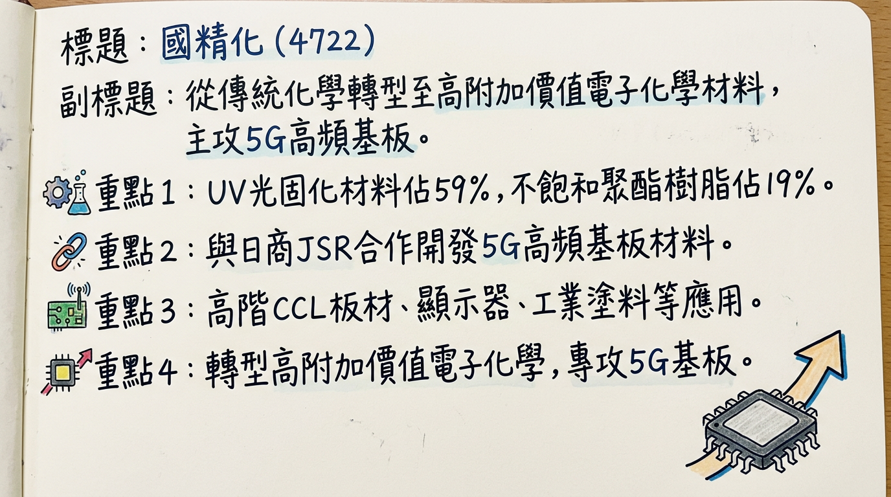
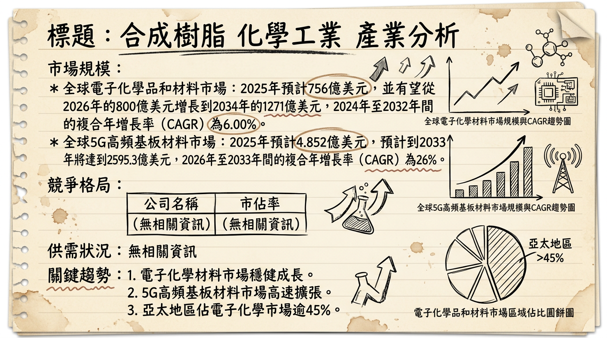
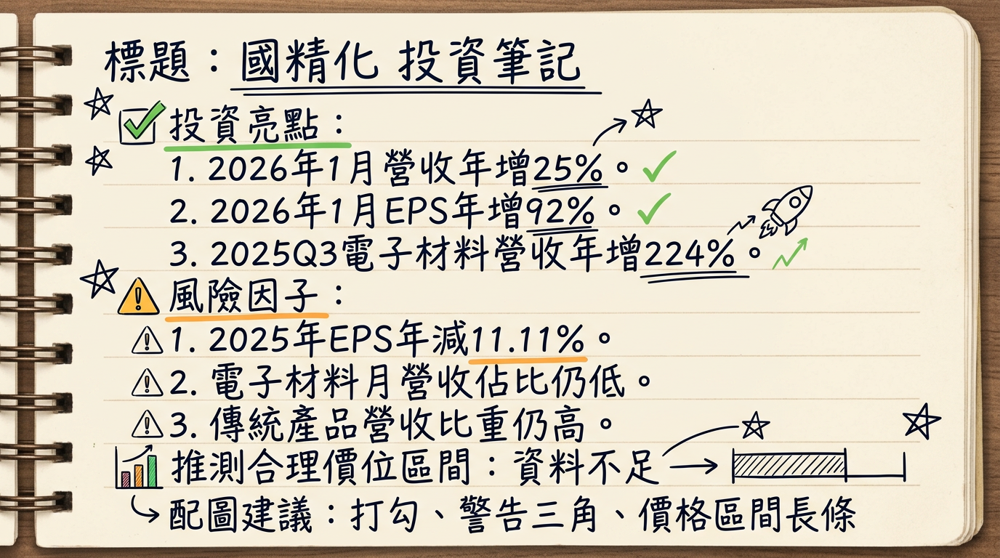

# 4722 國精化 深度研究報告

## 一句話摘要
國精化正積極從傳統化學材料轉型至高附加價值的5G高頻基板材料與AI伺服器特用樹脂，其大規模產能擴充計畫與策略性產品組合優化，預計將在2026年進入收穫期，成為未來五年主要獲利驅動力，儘管短期內傳統產品線調整與新廠折舊可能造成營運波動，但長期成長潛力顯著。

## 公司概覽
國精化（4722）主要從事合成樹脂及化學工業，近年來聚焦於高附加價值的電子化學材料領域，特別是5G高頻基板材料與特用樹脂。

**核心產品/服務：**

1.  **電子化學材料**：
    *   **5G高頻基板材料 (HC材)**：與日商JSR合作開發，應用於M7、M8及以上等級的高階CCL板材，已獲多家PCB客戶認證並實際出貨（如台光電、台燿、斗山、生益科技）。
    *   **PSMA特用樹脂**：自有產品，可作為PPO樹脂的替代方案，應用於M6以下等級的CCL板材，具高技術門檻，並具備拓展至分散助劑、水性塗料等市場潛力。
    *   **顯示器材料**：包含PS、PGI、OC。
    *   **PI背向膜材料**。
2.  **UV光固化材料**：
    *   具節能、高效、環保特性，應用於工業塗料、印刷油墨、木器塗料、電子材料（如乾膜光阻劑）。
3.  **功能性樹脂**：
    *   **不飽和聚酯樹脂**：應用於人造大理石、遊艇、漁船及玻璃纖維強化塑膠（FRP）。
    *   **塗料樹脂**：專注於車用高固低黏、耐燃耐污PDMS樹脂等利基型產品。

**營收結構（產品營收比）：**

| 產品線         | 2024年佔比（約） | 2025年12月單月營收（約） |
| :------------- | :--------------- | :----------------------- |
| UV光固化材料   | 59%              | 1.42億元                 |
| 不飽和聚酯樹脂 | 19%              | - (與塗料樹脂合計約1億元) |
| 塗料樹脂       | 12%              | - (與不飽和聚酯樹脂合計約1億元) |
| 電子化學材料   | 7%               | 3,568萬元                |
| 其他           | 3%               | -                        |

*註：2025年12月資料顯示電子化學材料雖已出貨，但單月佔比仍低，尚未進入明顯放量階段。*

**製造基地：**

*   **臺南安南新廠**：預計2026年第一季啟用，將成為未來主要的UV光固化材料及電子化學材料生產基地，光固化材料年產能將從現有2萬噸提升至5萬噸，PSMA特用樹脂擴充後年產能可望提升至3,000噸。
*   **高雄永安廠**：已規劃至2027年的產線建置，將作為5G材料初期的主要生產基地。
*   **臺灣廠區**：未來將專注於日本SMC/BMC及大洋洲船殼等高階不飽和聚酯樹脂應用。
*   **廣東江門廠**：一般性不飽和聚酯樹脂產品將轉移至此生產。
*   *目前未提供各製造基地的具體營收貢獻比例。*

## 核心競爭優勢

1.  **高附加價值產品轉型**：公司積極從傳統化學材料轉型至高毛利的電子化學材料，尤其專注於5G高頻基板材料（HC材）與PSMA特用樹脂，有效提升整體獲利結構。
2.  **關鍵技術與合作優勢**：與日商JSR合作開發5G高頻基板材料，並自主研發PSMA特用樹脂，這兩種高技術門檻材料在全球供應商中屈指可數，具備「進口替代」的競爭優勢。
3.  **客戶深度認證與黏著度**：其5G高頻基板材料已獲台光電、台燿、斗山、生益科技等主流CCL大廠認證並實際出貨，一旦產品打入客戶供應鏈，因配方穩定性要求高，客戶黏著度極佳。
4.  **前瞻性產能佈局**：高速運算5G材料（HC材）、PSMA特用樹脂及UV光固化材料的產能擴充計畫已大幅提前，顯示公司積極應對市場爆發性需求，確保未來市場份額。
5.  **環保節能趨勢受惠**：UV光固化材料具備高效、節能與環保特性，符合全球綠色化學品發展趨勢，提供穩健的基石業務。

## 財務分析

### 月營收趨勢

| 月份   | 金額 (億元) | 月增率 MoM | 年增率 YoY |
| :----- | :---------- | :--------- | :--------- |
| 2026年1月 | 3.43        | 20.77%     | 24.76%     |
| 2025年12月 | 2.84        | -2.97%     | -24.31%    |
| 2025年11月 | 2.92923     | 0.52%      | -0.58%     |
| 2025年10月 | 2.91396     | 0.36%      | -1.53%     |
| 2025年9月  | 2.90361     | -12.18%    | -8.73%     |
| 2025年8月  | 3.30643     | -4.99%     | -16.77%    |
| 2026年2月 | 尚未公布    | 尚未公布   | 尚未公布   |

### 季度數據

| 季度       | 季營收 (億元) | EPS (元) | 毛利率 | 營業利益率 |
| :--------- | :------------ | :------- | :----- | :--------- |
| 2025年第四季 | 8.68          | 0.67     | 未公布 | 未公布     |
| 2025年第三季 | 9.6923        | 0.81     | 18.72% | 8.92%      |

*註：2025年第三季在高毛利材料出貨帶動下，單季獲利顯著提升。*

### 年度趨勢

| 年度   | 全年度營收 (億元) | EPS (元) |
| :----- | :---------------- | :------- |
| 2024年 | 40.40             | 2.25     |
| 2025年 | 37.28             | 2.00     |

*註：2025年營收及EPS年減，主要係因公司在擴充5G高頻基板材料產能的過程中，主動調整資源配置，讓部分既有產線停產或降載，影響短期營收表現。*

## 法說會重點 (2025年11月7日)

*   **公司定位與成長驅力**：公司正處於由傳統化學材料轉型至高附加價值電子化學材料的關鍵成長期，電子化學材料被視為未來五年主要的獲利驅動力。
*   **5G高頻材料進展**：與日商JSR合作的5G高頻材料需求強勁，客戶端持續追加產能，擴產時程已大幅提前。應用於M7以上高階CCL的高速運算5G樹脂（HC材）已取得台光電、台燿、斗山、生益科技等主流CCL大廠認證並實際出貨。開發M7至M9板材的廠商，幾乎都已將國精化的5G材料納入供應鏈，僅Panasonic的相關產品仍在驗證階段。
*   **產能調整策略**：公司有意識地犧牲成熟產品（如UV光固化材料、不飽和聚酯樹脂、塗料樹脂）的稼動率，將人力、設備與產能空間騰出來給新一代電子化學材料使用，因此影響2025年前三季整體營收表現。
*   **PSMA特用樹脂擴產**：原PSMA年產能約300噸，擴充後年產能可望提升至3,000噸，新產線預計2026年第一季投產，將貢獻CCL及其他特用市場。
*   **新廠進度**：臺南安南新廠預計2026年第一季啟用，將主要生產UV光固化材料，並預留空間作為未來5G材料的第二生產基地。高雄永安廠則規劃至2027年的產線建置，將作為5G材料初期的主要生產基地。2024年11月4日曾公告斥資20億元擴建臺南廠區。
*   **策略投資**：轉投資美國新創公司Electro-inks (EI) 開發之particle-free導電銀漿已獲高通認證，應用於超音波指紋辨識系統，預計2026年下半年開始貢獻營收。
*   **未來展望**：公司對營運抱持樂觀態度，主要成長動能將來自AI伺服器帶動的5G高頻基板材料需求爆發。預期2025年是消費性市場的谷底，UV光固化材料市場將於2026年隨市場需求回溫而反彈。法人關注新產能啟動後的產能利用率與毛利率回升速度，預期將直接影響2026年營運表現。

## 券商觀點

| 券商名稱 | 目標價 (元) | 評等 | 日期         | 備註                                     |
| :------- | :---------- | :--- | :----------- | :--------------------------------------- |
| 兆豐證券 | 77          | 中立 | 2025/03/10   | 評等與目標價已過時 (>6個月)，僅供參考。 |
| 未具名券商 | 85          | -    | 2026/03/02報導 | 報導提及，但未明確指出券商及評等。         |

**2025-2026年 EPS 預估：**

*   **2025年實際EPS**：2.00元。
*   **券商預估**：
    *   兆豐證券於2025年3月10日預估2025年度EPS約2.73元。（此預估已過時，2025年實際EPS為2.00元）
    *   CMoney理財寶於2025年8月7日法人機構平均預估2025年度EPS介於2.4至3.2元之間。（此預估已過時，2025年實際EPS為2.00元）
    *   目前未找到2025-2026年最新的券商EPS預估數字。

## 財報深度分析

### 利潤率趨勢

國精化正處於從傳統化學材料轉型至高附加價值電子化學材料的關鍵成長期，其利潤率趨勢反映了這一過程中的結構變化。

| 季度       | 毛利率   | 營業利益率 | 稅後淨利率 |
| :--------- | :------- | :--------- | :--------- |
| 2025年第三季 | 18.72%   | 8.92%      | 8.41%      |
| 2025年第二季 | 15.83%   | 6.20%      | 0.17%      |
| 2025年第一季 | 14.90%   | 4.59%      | 5.54%      |
| 2024年第四季 | 15.85%   | 4.67%      | 4.41%      |
| 2024年第三季 | 17.27%   | 6.93%      | 5.21%      |
| 2024年第二季 | 17.51%   | 7.62%      | 6.15%      |
| 2024年第一季 | 16.25%   | 6.31%      | 6.47%      |

**利潤率變化的原因分析：**
2025年第三季毛利率與獲利能力顯著提升至18.72%，主要受惠於高毛利的5G材料出貨帶動產品組合優化。然而，因應擴產需求導致部分傳統產線停工或降載，影響了2025年前三季的整體營收表現，導致毛利率在2025年上半年一度較低。公司對2026年營運抱持樂觀態度，預期電子化學材料的強勁需求將成為未來五年主要獲利驅動力，並隨著新產能陸續開出，將有望進一步推升毛利率。

### 存貨分析
目前未找到2024-2026年關於存貨金額、存貨週轉天數、應收帳款週轉天數以及存貨是否有異常堆積或備料現象的最新資料。然而，報告中提及公司為擴充5G高頻基板材料產能，主動調整資源配置，讓部分既有產線停產或降載，這可能導致短期內成熟產品出貨放慢，進而影響存貨周轉效率。

### 資本支出
國精化積極進行大規模資本支出以支持其轉型策略：
*   **臺南安南新廠**：原追加預算為17.92億元，2025年9月15日董事會決議再追加至**20.7554億元**，主要因材料成本上揚。該廠第一期以UV光固化材料為主，預計2026年第一季啟用，並預留空間作為未來5G材料的第二生產基地。
*   **高雄永安擴廠**：資本支出預算為**10.2558億元**（2025年9月15日董事會決議），規劃至2027年的產線建置，將作為5G材料初期的主要生產基地。
*   **PSMA特用樹脂**：新產線預計2026年第一季投產。
*   *目前未找到近3年具體的資本支出金額歷史數據與折舊攤銷趨勢。公司正處於高度成長階段，不排除未來有籌資計畫以支持擴產需求。*

### 其他財報重點
*   **業外收支**：2025年第三季業外收支佔營收2.25%，2025年第二季為-5.57%，2025年第一季為2.61%，2024年第四季為0.81%。
*   **轉投資收益**：轉投資美國新創公司Electro-inks (EI) 的particle-free導電銀漿已獲高通認證，預計2026年下半年開始貢獻營收。

## 股權異動

*   **近期董監事/大股東申報轉讓紀錄**：未找到2024年以後的最新資料。
*   **庫藏股買回紀錄**：未找到2024年以後的最新資料。
*   **發行可轉換公司債（CB）**：未找到2024年以後的最新資料。
*   **近期增減資計畫**：國精化在2025年11月9日的法說會中提及，公司正處於高度成長階段，不排除未來有籌資計畫以支持擴產需求，但未明確指出是現金增資或減資。
*   **股利政策**：2025年預計於6月10日除權息，每股配發現金股利**1.396元**。現金殖利率以2025年5月12日收盤價計算為2.57%。現金股利發放日為2025年7月11日。

## 產業分析

### 市場規模與成長率

| 產業類別               | 2025年市場規模（預估） | 2026年市場規模（預估） | 複合年增長率 CAGR (區間) | 預估至                                  |
| :--------------------- | :--------------------- | :--------------------- | :----------------------- | :-------------------------------------- |
| 全球電子化學品和材料   | 756億美元 / 689億美元  | 800億美元              | 5.5% - 6.00% (2024-2035) | 2034年達1271億美元 / 2035年達1176.9億美元 |
| 全球5G基板材料         | 4.852億美元 / 156.1億美元 | 186億美元              | 19.1% - 26% (2023-2033)  | 2033年達2595.3億美元 / 2030年達371.3億美元 |
| 全球UV硬化樹脂         | 50.5億美元 / 64.8億美元 | -                      | 6.76% - 7.5% (2024-2029) | 2029年達70億美元 / 93.1億美元           |
| 全球高性能塑膠（功能性樹脂） | 349.3億美元            | -                      | 9.4% (2026-2034)         | 2034年達783.3億美元                     |
| 全球樹脂市場           | 6232.7億美元           | 6540.9億美元           | 5.0% (2026-2034)         | 2034年達9646.5億美元                    |
| 特用化學品市場         | 9104億美元             | -                      | 6.1% (2026-2035)         | 2035年達16459億美元                     |

*註：不同報告對市場規模預估存在差異，但整體趨勢均顯示穩健增長。*

**供需狀況：**
2025年化工行業面臨產品價格下行壓力，但高端新材料需求旺盛，整體供需趨於寬鬆。2026年預計化工行業將企穩復甦，增長動能更依賴高端化、綠色化轉型。電子化學品需求受半導體、IoT、自動駕駛等技術應用擴大推動。5G高頻基板材料方面，全球高階CCL市場極度緊俏，對關鍵化學配方「高階樹脂」需求殷切。

**產業平均毛利率水準：**
根據2025年第四季數據，台灣半導體產業毛利率為33.57%，電子零組件為20.06%。對於特用化學品產業，戰略採購和定價策略對維持高利潤率至關重要。國精化自身的高階電子材料業務毛利率已從15%提升至24%，顯示其產品組合優化的效益。

### 競爭格局

由於國精化業務涵蓋多個特用化學品領域，難以提供單一市場的全球前五大公司市佔率。以下為各主要領域的部分全球參與者：

| 產業領域           | 主要競爭對手                                               |
| :----------------- | :--------------------------------------------------------- |
| 電子化學品和材料   | 林德公司 (Linde Plc)、空氣化學產品公司 (Air Products)、巴斯夫 (BASF SE)、科思創 (Covestro AG)、杜邦 (DuPont)、液化空氣電子公司 (Air Liquide Electronics) |
| UV硬化樹脂         | 巴斯夫 (BASF SE)、科思創 (Covestro AG)、Arkema Group、DSM、Resonac Holdings Corporation |
| 樹脂市場           | 杜邦 (DuPont)、巴斯夫 (BASF)、Arkema、Ineos、東麗工業 (Toray Industries)、三井化學 (Mitsui Chemicals) |
| 聚酰亞胺樹脂       | DuPont、SABIC、Ube Industries、Kaneka Corporation、Taimide Technology (達邁科技) |

**國精化 vs. 主要競爭對手比較：**

| 特性     | 國精化 (4722)                                | 優勢/備註                                                                                                     |
| :------- | :------------------------------------------- | :------------------------------------------------------------------------------------------------------------ |
| **技術** | HC材 (與JSR合作)、PSMA特用樹脂               | 具備5G/AI高頻低損耗材料的關鍵技術，PSMA技術門檻高，全球少數供應商，具「進口替代」優勢。                     |
| **產能** | HC材: 2025年6月450噸->2026年Q3末1400噸以上 (3倍增)；PSMA: 300噸->2025年底3000噸 (10倍增)；UV: 2萬噸->2026年Q1 5萬噸 (150%增) | 大規模擴產以應對AI伺服器/5G材料爆發性需求，提前佈局確保市場供應。                                            |
| **客戶** | 台光電、台燿、斗山、生益科技等CCL大廠        | 高階CCL客戶認證壁壘高，一旦打入供應鏈，客戶黏著度高，不易被替換。                                          |
| **價格** | 高毛利產品組合優化，毛利率從15%提升至24%     | 專注高附加價值利基市場，避免低價競爭，提升整體獲利能力。                                                    |

**台灣同業比較：**
台灣特用化學品產業中，與國精化在電子化學材料或高階CCL材料供應鏈中具有相關性的同業包括新應材、台特化、長興等。國內法人機構普遍認為「先進製程」與「先進封裝」將驅動特用化學及材料供應鏈，這些公司均是市場焦點。由於國精化專注於上游樹脂材料，與其他直接生產最終CCL板材或晶圓化學品的公司略有不同，但其高階材料的重要性日益凸顯。

### 產業趨勢

1.  **5G/AI與高頻高速需求爆發**：
    *   **具體影響**：生成式AI及5G網絡的擴大部署，推升了對超低損耗多層基板的巨大需求。AI伺服器、HPC等應用對材料的介電性能、熱穩定性、低損耗特性提出更高要求，驅動高階PCB材料體系的持續優化。這直接利好國精化在高階5G/AI用樹脂（HC材）及PSMA特用樹脂的佈局。
2.  **電子產品小型化、輕量化與高性能化**：
    *   **具體影響**：消費性電子產品趨向薄型化、柔軟化、高集積化，對高功能薄膜和功能性樹脂需求增加，以支持元件可靠性及結構穩定性。5G基板材料尤其需要兼顧優異的介電性能、熱穩定性、可製造性和成本，這對國精化的材料研發能力提出挑戰也帶來機會。
3.  **綠色化、低碳化與永續發展**：
    *   **具體影響**：全球對環保友善工業塗料和包裝應用中UV硬化樹脂的需求增加。化工行業正從「市佔率優先」轉向「利潤優先」，並將更依賴於高端化、綠色化轉型。這促使公司開發低碳足跡生質化學材料，並利用UV光固化材料的環保特性，以應對歐盟CBAM與台灣碳費等碳定價機制。

**對國精化的具體機會和威脅：**

*   **機會**：
    *   **AI、5G材料領導地位**：受惠於AI伺服器和5G高頻基板材料的強勁需求，國精化HC材和PSMA樹脂的技術與產能佈局帶來巨大的成長空間。
    *   **產能倍數擴張**：HC材、PSMA樹脂等新產能的提前與倍數增長，能迅速搶佔市場份額，滿足產業迫切需求。
    *   **高附加價值轉型成功**：從傳統業務轉向高毛利的電子化學材料，有望持續優化產品組合，提升公司整體獲利能力。
*   **威脅**：
    *   **傳統產品線拖累**：在轉型過程中，傳統產品的稼動率被犧牲，可能短期內拖累整體營收增長。
    *   **新廠折舊壓力**：大規模資本支出將帶來折舊費用增加，影響短期獲利表現，尤其在產能利用率尚未完全拉升之際。
    *   **技術快速迭代與競爭**：電子產業技術發展迅速，需持續投入研發以維持競爭力，且全球特用化學品市場仍存在激烈競爭。

**相關投資題材的具體連結：**

*   **AI (人工智慧)**：國精化提供AI伺服器所需的高階PCB材料，特別是HC材和PSMA特用樹脂，這些是M7以上等級高階CCL板材的關鍵配方，直接受惠於AI基礎建設需求。
*   **5G/6G通訊**：國精化的5G高頻基板材料（HC材）是5G網絡建設不可或缺的一部分，將受惠於5G/6G基礎設施的部署及相關電子設備普及。
*   **先進封裝 (Advanced Packaging)**：AI算力需求大增帶動先進封裝市場增長，對特用化學材料需求同步升級，國精化的特用樹脂可能在其中扮演關鍵角色。
*   **電動車 (EV)**：功能性樹脂中的車用高固低黏、耐燃耐污PDMS樹脂等利基型產品，可能與電動車輕量化、電池相關材料或塗層應用產生間接關聯。

## 近期催化劑

### 利多事件

*   **2026年1月營收與獲利顯著成長**：自結營收3.43億元，年增25%；稅前淨利32百萬元，年增103%；歸屬母公司業主淨利24百萬元，年增94%；每股盈餘0.23元，年增92%。
*   **2025年第三季電子化學材料營收爆發**：電子化學材料營收達2.33億元，年增約224%；累計前三季營收達4.87億元，年增約145%，顯示轉型效益顯現。
*   **高毛利5G材料出貨帶動獲利提升**：2025年第三季在高毛利的5G材料出貨帶動下，單季毛利率18.72%與EPS 0.81元顯著提升。
*   **5G高頻基板材料（HC材）獲主流CCL大廠認證並實際出貨**：已取得台光電、台燿、斗山、生益科技等大廠認證，且持續追加產能。
*   **PSMA特用樹脂技術領先**：與日本四國化成及JSR合作，切入AI高階樹脂領域，為全球少數主要供應商之一。
*   **策略投資美國新創Electro-inks (EI)**：其開發的particle-free導電銀漿已獲高通認證，預計2026年下半年開始貢獻營收。
*   **外資法人持續買超**：2026年2月25日外資買超2,153張，2月26日三大法人合計買超512張，顯示法人對其未來展望持樂觀態度。

### 利空事件

*   **2025年全年營收與獲利年減**：2025年全年營收37.28億元（年減7.75%），EPS 2元（年減11.11%），主要因擴產導致部分既有產線停產或降載。
*   **傳統產品線仍佔營收大宗且面臨壓力**：截至2025年12月，光固化材料仍是最大宗營收來源（1.42億元），傳統產品營收壓力可能拖累總營收增長。
*   **新廠折舊壓力與資本支出增加**：2025年下半年受到安南新廠折舊認列影響，毛利率表現較疲弱。2025年9月15日董事會決議將台南安南新廠及高雄永安擴廠的資本支出提高至31億元（因材料成本上揚），可能增加未來財務負擔。
*   **近期股價達警示標準**：2026年3月2日因股價飆漲達公布注意交易資訊標準，提醒投資人留意風險。
*   **三大法人近期賣超**：2026年3月2日與3月5日三大法人合計分別賣超334張與341張，顯示短期內有獲利了結壓力。

## ⭐ 成長動能時間軸

| 時間點         | 成長動能項目        | 具體細節                                                     |
| :------------- | :------------------ | :----------------------------------------------------------- |
| **2025年6月**    | **高速運算5G材料 (HC材) 產能** | 第一套量產設備投產，年產能約450噸。                           |
| **2025年底**    | **PSMA特用樹脂產能** | 完成產能擴充，年產能從300噸提升至3,000噸 (10倍增長)。        |
| **2025年底**    | **高速運算5G材料 (HC材) 產能** | 第二、第三套設備完成建置，預計2026年投產。                 |
| **2026年第一季** | **PSMA特用樹脂產能** | 新產線試車投產，將顯著貢獻CCL及其他特用市場。                 |
| **2026年第一季** | **UV光固化材料產能** | 臺南安南新廠啟用，UV光固化材料年產能從2萬噸提升至5萬噸 (150%增幅)。 |
| **2026年**       | **高速運算5G材料 (HC材) 產能** | 第二、第三套設備投產，總年產能提升至1,350至1,400噸。        |
| **2026年上半年** | **整體擴產效益**    | 5G高頻基板材料與PSMA特用樹脂新產能陸續投產，顯著提升供應能力。 |
| **2026年下半年** | **新客戶/新市場**   | 轉投資美國新創Electro-inks (EI) 的particle-free導電銀漿開始貢獻營收，應用於超音波指紋辨識系統。 |
| **2026年第三季末** | **高速運算5G材料 (HC材) 產能** | 將完成原本預計2027年才到位的五條產線，總產能突破1,400噸 (是2025年的三倍以上)。 |
| **2026年**       | **需求面**          | AI伺服器與高速運算（HPC）對高頻低損耗CCL材料需求爆發，5G/6G通訊基礎建設持續推動。 |
| **2027年**       | **擴廠計畫**        | 高雄永安廠規劃至2027年的產線建置，將作為5G材料主要生產基地。 |

## 2026 展望

**主要成長動能：**

1.  **電子化學材料需求爆發**：AI伺服器與5G高頻基板材料的強勁需求將是國精化2026年最主要的獲利驅動力。公司在高階5G/AI用樹脂（HC材）和PSMA特用樹脂的擴產計畫將在2026年進入集中貢獻期。
2.  **新產能陸續到位與利用率提升**：PSMA特用樹脂新產線（年產能3,000噸）及UV光固化材料臺南安南新廠（年產能5萬噸）預計2026年第一季啟用並逐步拉升利用率。HC材擴產時程提前，預計2026年總產能將達1,350-1,400噸，可望大幅改善公司獲利結構。
3.  **產品組合優化與毛利率改善**：隨著高毛利的電子化學材料佔比提升，法人預期國精化2026年毛利率有望從2025年的約15%持續提升，進一步推升整體獲利。
4.  **消費性市場回溫**：公司預期2025年為消費性市場谷底，UV光固化材料市場將於2026年隨市場需求回溫而反彈，為公司帶來額外增長動能。
5.  **策略投資效益顯現**：轉投資Electro-inks (EI) 的particle-free導電銀漿預計2026年下半年開始貢獻營收，提供新的成長點。
6.  **法人預期**：在強勁成長動能驅動下，法人預期2026年EPS有望持續成長5% (此為較保守預估，若高階材料放量超預期，成長率有望更高)。

**風險因子：**

1.  **新廠折舊與產能利用率壓力**：臺南安南新廠及高雄永安擴廠的大規模資本支出將帶來新增折舊費用，若新產能初期利用率未能快速拉升，可能影響短期獲利。
2.  **傳統產品線拖累**：為配合高階材料擴產，傳統產品線的資源調整和停工降載，可能導致其營收仍面臨壓力，影響整體營收增長。
3.  **市場競爭與技術替代**：儘管高階CCL材料進入門檻高，但電子化學品市場競爭激烈，技術迭代速度快，公司需持續投入研發以維持領先。
4.  **全球經濟與消費市場不確定性**：全球經濟放緩、地緣政治緊張、原物料價格波動以及消費市場復甦不如預期，仍可能影響公司營運，尤其是UV光固化材料業務。
5.  **籌資風險**：公司處於高度成長階段，未來不排除有籌資計畫以支持擴產需求，可能對股本造成稀釋效應。

## 投資結論

國精化正處於戰略轉型的關鍵時刻，其在5G高頻基板材料和AI伺服器特用樹脂領域的佈局，使其成為高速成長市場中的關鍵供應商。儘管2025年因產能調整導致營收和獲利短期承壓，但2026年隨著大規模擴產效益的顯現，成長動能將極為強勁。

1.  **高附加價值轉型效益顯現**：公司成功轉型至毛利率更高的電子化學材料，特別是與日商JSR合作的HC材和具備「進口替代」優勢的PSMA特用樹脂，已獲得主流CCL大廠認證並放量出貨，產品組合優化將持續推升毛利率。
2.  **產能擴充實現跳躍式成長**：HC材、PSMA特用樹脂及UV光固化材料的產能將在2026年大幅提升，特別是HC材年產能將達三倍以上，PSMA年產能增長十倍，為滿足AI伺服器與5G高頻基板的爆發性需求奠定基礎。
3.  **搭上AI/HPC產業成長特快車**：國精化作為半導體上游特用化學材料供應商，直接受惠於AI伺服器、高效運算以及5G/6G通訊基礎設施所帶來的龐大市場機遇，未來成長能見度高。
4.  **短期壓力不改長期趨勢**：儘管2025年因轉型陣痛與新廠折舊壓力導致獲利略為下滑，但這是為未來高速成長所做的戰略性投資。隨著新產能利用率的逐步提升，這些短期因素將被長期成長動能所消化。
5.  **潛在投資報酬率高**：考慮到國精化在關鍵電子材料領域的技術領先地位、大規模產能擴張以及AI/HPC產業的長期趨勢，其2026年起的營運爆發力值得期待。

綜合公司基本面、產業趨勢及擴產進度，我們預期國精化在2026年將迎來爆發性成長。儘管券商目標價資訊較為稀缺且過時，但鑒於其核心產品在AI與5G領域的稀缺性與高成長性，市場應給予更高的估值。

**建議投資區間：88 - 105 元**
（此區間基於公司積極轉型高階材料、大幅擴充產能，預期2026年獲利將顯著提升的潛力，並考量市場對AI/5G相關概念股給予的較高估值，但亦包含新廠折舊與產能爬坡可能帶來的短期波動風險。）

本報告由 AI 自動產生，資料來源為公開網路資訊，僅供參考，不構成投資建議。產生時間：2026-03-06 13:03

---

## 📊 資訊卡

