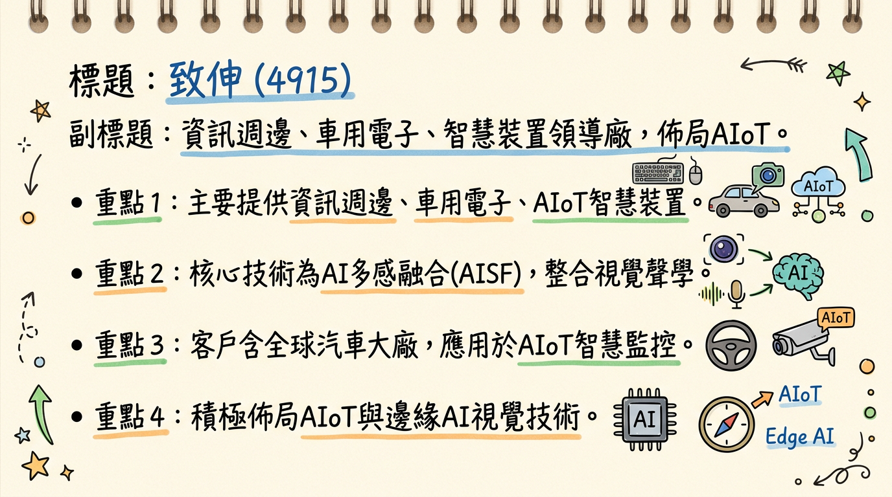
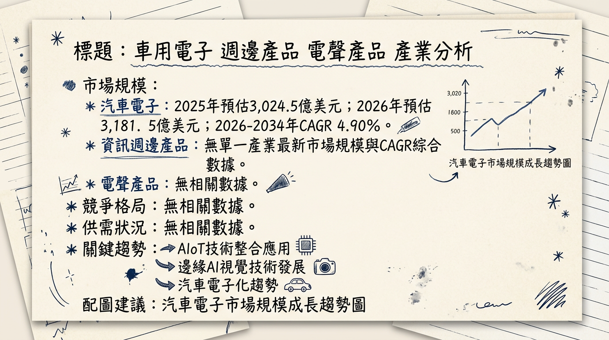
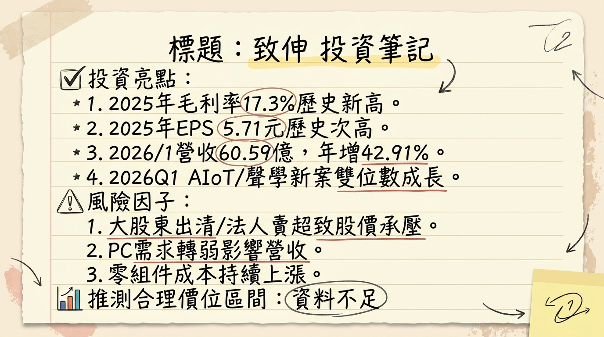

# 4915 致伸 深度研究報告

## 一句話摘要

致伸 (4915) 憑藉 AIoT、車用電子及機器人等高階產品線佈局，成功推升毛利率至歷史新高 17.6%，儘管資訊產品面臨逆風，公司仍透過泰國廠擴產及 AI 多感融合技術，積極轉型並迎接未來高成長動能，但短期需留意大股東申報轉讓帶來的籌碼壓力。

## 公司概覽

致伸科技 (4915) 主要從事資訊週邊產品、汽車電子和智慧裝置的設計、開發與製造，並積極布局人工智慧物聯網 (AIoT) 及邊緣AI視覺技術，以「AI多感融合 (AI Sensor Fusion, AISF)」技術為核心，整合視覺、聲學與介面等關鍵技術。

**核心產品與服務：**
*   **資訊週邊產品**：鍵盤、滑鼠、網路攝影機、電競產品、鍵盤模組、筆電相機模組、觸控模組及多功能事務機。
*   **汽車電子產品**：先進駕駛輔助系統（ADAS）相機、車用聲學元件及影像元件，採直接與全球汽車品牌大廠合作策略。
*   **智慧裝置**：物聯網 (IoT) 設備，特別是 AIoT 及 AI 智慧監控產品。
*   **新興布局**：機器人產業 (自主移動機器人 AMR 底座與智慧感知模組)。

**營收結構 (2025年第四季)：**

| 業務類別         | 2025Q4 營收比重 (%) | 2025Q3 營收比重 (%) |
| :--------------- | :------------------ | :------------------ |
| 資訊產品         | 49                  | 47                  |
| 智慧生活產品     | 19                  | 22                  |
| 車用/智慧物聯 (AIoT) | 31                  | 31                  |

**製造基地：**
*   **泰國廠區**：主要製造基地，預計 2026 年產能占比將提升至 35%，截至 2025 年底已近三成。
*   **台灣竹北創新育成中心**：預計 2025 年 9 月啟用，將作為 AI 及多感合一技術研發中心以及小量多樣化生產的重要基地。

## 核心競爭優勢

1.  **AI 多感融合 (AISF) 技術領先：** 以視覺、聲學與介面整合為核心，精準切入智慧監控、車用電子、會議系統、機器人及智慧辦公等邊緣 AI 應用，具備即時感知與判斷能力。
2.  **高附加價值產品組合優化：** 車用/智慧物聯 (AIoT) 業務比重逐年提升，帶動公司整體毛利率自 2019 年的 13.1% 穩步成長至 2025 年的 17.3%，2025Q4 更達 17.6%，顯示產品結構轉型成功。
3.  **車用市場策略性合作：** 採取直接與全球汽車品牌大廠合作模式，提供客製化車內聲學與影像元件，深入掌握高階車用市場商機。
4.  **全球化彈性製造佈局：** 泰國廠產能占比預計 2026 年提升至 35%，強化供應鏈韌性並配合客戶從中國遷廠需求，有效降低地緣政治風險。

## 財務分析

### 月營收趨勢

| 月份     | 金額 (億元) | 月增率 MoM (%) | 年增率 YoY (%) |
| :------- | :---------- | :------------- | :------------- |
| 2026年01月 | 60.6        | 24.4           | 42.9           |
| 2025年12月 | 48.7        | 7.3            | 21.8           |
| 2025年11月 | 45.3        | -18.0          | 0.9            |
| 2025年10月 | 55.3        | 1.8            | 19.2           |
| 2025年09月 | 54.3        | 6.7            | 1.2            |
| 2025年08月 | 50.9        | -5.0           | -9.5           |

**註：2026年02月月營收尚未公布。**

### 季度數據 (2025年第四季)

*   **季營收**：149.4 億元，年增 13%。
*   **毛利率**：17.6%，季增 0.6 個百分點，年增 0.2 個百分點，創單季歷史新高。
*   **營業利益率**：4.2%。
*   **EPS**：0.95 元。

### 年度趨勢

| 年度 | 合併營收 (億元) | 年增率 (%) | EPS (元) |
| :--- | :-------------- | :--------- | :------- |
| 2024 | 582.43          | -          | 5.61     |
| 2025 | 601.8           | 3.3        | 5.71     |
| 2026E | 632.88 - 633.41 | 5.2 - 5.3  | 6.63 - 6.87 |
**註：2026E 營收/EPS 為 FactSet 分析師預估中位數及元富證券預估。**

## 法說會重點 (2026年02月26日)

*   **2026年第一季展望：**
    *   **整體營收：** 預計小幅年增。
    *   **資訊產品：** 面臨較大逆風，預計年減高個位數，其中印表機及多功能事務機將年減雙位數。
    *   **智慧生活產品：** 相對樂觀，受惠於消費聲學新案貢獻，預計雙位數年增；派對音箱為新的成長動能，並拓展至亞洲 Soundbar 客戶。
    *   **車用/智慧物聯 (AIoT)：** 展現強勁成長力道，受惠於 AIoT 產品需求穩健及新專案貢獻，預期雙位數年增，且占比持續提升。
    *   **毛利率：** 面臨多重壓力，主要受到零組件成本上揚、人民幣升值以及智慧生活產品比重提升影響。
    *   **費用率：** 預計維持在 2025 年水準。
*   **2026年全年營運展望：**
    *   **成長引擎：** 管理層表示，成長性最高的仍是車用/智慧物聯，預期可維持高雙位數成長，為全年最主要成長引擎。
    *   **機器人布局：** 積極布局 AI 感測融合 (AISF) 技術，將機器人視為 AISF 技術的重要應用出海口，相關技術與應用已獲國際客戶認可，預估將於 2026年第四季至 2027年第四季間對營收產生實質貢獻。
    *   **「3+2 成長引擎」策略：** 在既有的 Vision (影像)、Audio (聲學)、Interface (介面) 三大有機業務上，強化技術與客戶組合，同時積極尋求 Robotics (機器人) 與策略性投資等非有機成長機會。
*   **資本支出：** 2026 年維持新台幣 15 億元，主要用於泰國廠區擴建與鋼構工程。
*   **產能配置：** 泰國廠產能占比預期將順利提升至 35%，以強化全球供應鏈韌性並配合客戶從中國遷廠需求。
*   **股利政策：** 董事會通過 2025 年度現金股利為每股 4.568 元，實際配發率達 80%。公司亦規劃 2026 年股利配發率有望拉高至八成。

## 券商觀點

### 目標價與評等

| 券商名稱/機構 | 目標價 (元) | 評等   | 日期       |
| :------------ | :---------- | :------- | :--------- |
| 元富證券投顧  | 100         | 看多     | 2026/03/03 |
| FactSet (綜合分析師中位數) | 88.9        | -        | 2025/10/28 (過時) |

### 2025-2026 年 EPS 預估

*   **元富證券投顧：** 預估 2026 年度 EPS 約 6.87 元。
*   **FactSet (綜合 7 位分析師)：**
    *   2025 年 EPS 預估中位數為 6.21 元 (最高估值 6.58 元，最低估值 5.77 元)。
    *   2026 年 EPS 預估中位數為 6.63 元 (最高估值 7.42 元，最低估值 6.28 元)。

### 重大評等調整與市場事件

*   **元富證券投顧** 於 2026 年 03 月 03 日發布評等為「看多」。
*   **大股東申報轉讓：** 致伸董事兼大股東綠地股份有限公司（由創辦人梁立省持有）於 2026 年 03 月 02 日宣布將全數出清手中持有的 544 張致伸股票。此舉引發市場高度關注，外資於當日大幅賣超逾 8,000 張，主力亦賣超 6,476 張，導致股價承壓。此為籌碼面重大變動，非券商評等調整。

## 財報深度分析

### 利潤率趨勢

| 季度     | 毛利率 (%) | 營業利益率 (%) | 稅後淨利率 (%) |
| :------- | :--------- | :------------- | :------------- |
| 2025Q4   | 17.61      | 4.16           | 2.96           |
| 2025Q3   | 17.0       | 4.9            | 4.48           |
| 2025Q2   | 17.5       | N/A            | 5.02           |
| 2024Q4   | 18.0       | 5.2            | 2.96           |
| **年度** |            |                |                |
| 2025全年 | 17.3       | 4.7            | 4.37           |
| 2024全年 | 17.0       | N/A            | N/A            |

**利潤率變化的原因分析：**
*   **產品組合優化：** 致伸近五年毛利率從 13.1% 穩步提升至 2025 年的 17.3%，顯示產品結構優化是長期趨勢性成果，尤其車用/智慧物聯 (AIoT) 等高毛利產品比重逐年提升。
*   **新專案貢獻：** 車用/智慧物聯業務受新專案及出貨推升，2025 年第三季年增率達 27.5%，成為推升獲利的重要動能。
*   **匯率影響：** 2025 年第二季，致伸入帳逾 2 億元匯兌收益，對獲利表現有助益。
*   **成本壓力：** 展望 2026 年首季，毛利率面臨多重壓力，包含 PC 需求趨弱、零組件成本上揚 (如記憶體、貴金屬) 及人民幣升值。
*   **業外一次性認列：** 2025 年第四季業外提列一次性設備減損及認列投資損失，導致稅後純益較去年同期減少 7.8%。

### 存貨與營運分析

*   **存貨週轉天數：** 2025Q4 上升至 75 天 (2025Q3 為 61.37 天，2024Q4 為 73.40 天)。
*   **應收帳款收現天數：** 2025Q4 約為 69.81 天 (2025Q3 為 65.42 天，2024Q4 為 81.04 天)。
*   **應付帳款週轉天數：** 2025Q4 延長至 103 天，顯示公司在供應鏈管理上持續優化付款條件。
*   **趨勢：** 2025 年第四季存貨週轉天數較前一季有所上升，應收帳款收現天數在過去一年內波動，但整體維持在相對健康水準。目前未顯示異常存貨堆積。

### 資本支出

*   **2025 年全年：** 資本支出為 23.30 億元。
*   **2026 年預計：** 維持新台幣 15 億元，主要用於泰國廠區擴建與鋼構工程。
*   **未來計畫：** 泰國廠產能占比預計 2025 年底近三成，2026 年提升至 35%。新竹廠區預定 2025 年 9 月啟用，專責生產符合美國 TAA 條款規範的產品，並作為 AI 及多感合一技術研發中心及小量多樣化生產基地。

### 其他財報重點

*   **負債比率：** 2025Q4 為 59.94%，較前一季下降。
*   **自由現金流量：** 2025Q4 大幅改善至 8.93 億元，優於 2025Q3 的 4.76 億元。
*   **業外收支：** 2025Q4 受一次性設備減損及投資損失影響。2025 年 Q1 及 Q2 業外收支佔稅前淨利比重曾高達 24.03% 及 21.77%，顯示業外項目對獲利有顯著影響。

## 股權異動

*   **董監事/大股東申報轉讓：**
    *   **2026年03月02日：** 董事兼大股東「綠地股份有限公司」(致伸創辦人梁立省持有) 申報轉讓手中致伸股票 544 張，將完全出清，為重大籌碼變動。
    *   **2025年12月23日、11月19日：** 經理人「周衍洲」分別申報一般交易轉讓 200 張及 250 張。
    *   **2025年10月15日：** 多位經理人及董事透過信託方式轉讓股票，轉讓張數從 20 張到 130 張不等。
*   **庫藏股買回紀錄：** 目前未找到 2024-2026 年庫藏股買回紀錄。
*   **可轉換公司債 (CB) / 增減資：** 目前未找到 2024-2026 年發行可轉換公司債、現金增資或減資計畫的資訊。
*   **股利政策：**
    *   **2025 年度：** 董事會通過配發現金股利每股 4.568 元，實際配發率達 80%。
    *   **2024 年度：** 配發現金股利 4.00 元，配發率 75%。
    *   致伸維持高股息政策，近六年現金股利從每股 2.40 元逐步提升，配發率也持續上升。

## 產業分析

### 市場規模與成長率

1.  **資訊週邊產品：**
    *   **市場規模與 CAGR：** 未找到 2025-2026 年作為單一產業的最新市場規模與 CAGR 數據。Gartner 預計 2026 年全球 IT 裝置總支出將達 8,360 億美元，年增 6.1%，但涵蓋範圍過廣。
    *   **供需狀況：** PC 需求趨弱對其造成短期壓力。

2.  **汽車電子產品：**
    *   **全球市場規模與 CAGR：**
        *   全球汽車電子市場：2025 年 3,024.5 億美元，預計 2026 年 3,181.5 億美元，2026-2034 年 CAGR 4.90% 至 4,678.8 億美元。
        *   全球 ADAS 市場：2025 年 448.2 億美元，2026 年 500.6 億美元，2026-2035 年 CAGR 11.7% 至 1,399.8 億美元。
        *   全球汽車攝影機市場：2025 年 108.1 億美元，預計 2035 年 315.3 億美元，2026-2035 年 CAGR 11.30%。
        *   全球車用光學鏡頭市場：2026 年 17.4 億美元，預計 2035 年 30 億美元，2026-2035 年 CAGR 6.3%。
        *   2024 年全球車載鏡頭需求量約 3.7 億顆，預計 2025 年增至 4.4 億顆，年增 17.6%。
    *   **供需狀況：** 汽車半導體市場中低階產品存在供過於求，但高階座艙和智慧駕駛 SoC 晶片需求旺盛。ADAS 功能在新車導入率不斷提高 (超過 70% 新車配備至少一項)。
    *   **產業平均毛利率：** 汽車零組件板塊 2024 年毛利率為 17.68%，2025 年第一季為 17.63%。

3.  **智慧裝置 (AIoT 及邊緣AI視覺技術)：**
    *   **全球市場規模與 CAGR：**
        *   全球 AIoT 市場：2025 年 624.9 億美元，預計 2026 年 827.4 億美元，2026-2034 年 CAGR 32.40% 至 7,813.2 億美元 (另有報告估計 2026 年 85.1 億美元，CAGR 6.4%)。
        *   全球 IoT 市場：2025 年 1.13 兆美元，預計 2026 年 1.3 兆美元，2026-2035 年 CAGR 超過 16.8% 至 5.34 兆美元以上。
        *   邊緣資料中心市場：預計從 2026 年的 190 億美元成長至 2033 年的 600 億美元，2026-2033 年 CAGR 17.5%。
    *   **供需狀況：** 受聯網設備快速成長、AI 演算法改進及智慧自動化需求驅動。工業自動化、智慧製造、5G 網路擴展是主要成長動力。
    *   **產業平均毛利率：** AIoT 晶片設計公司毛利率相對較高 (如瑞芯微 2025Q1 毛利率 40.95%)。

### 競爭格局

**台灣同業比較 (2025年數據)：**

| 公司代碼 | 公司名稱   | 2025 年營收 (億元) | 2025 年毛利率 (%) | 2025 年 EPS (元) | 備註                                   |
| :------- | :--------- | :----------------- | :---------------- | :--------------- | :------------------------------------- |
| 4915     | 致伸科技   | 601.8              | 17.3              | 5.71             | 資訊週邊、汽車電子、智慧裝置、AIoT     |
| 6263     | 普萊德科技 | 18.84              | 46.7              | 8.32             | 網通品牌，積極布局 AIoT、工業物聯網    |
| 3211     | 順達      | 132.18             | 20.14 (Q4)        | 9.05             | 電池模組廠，BBU (備援電池模組) 受惠 AI 伺服器需求 |

*   **分析：** 致伸營收規模遠大於普萊德與順達，顯示其在多角化業務上的廣泛布局。普萊德與順達在各自專業領域因產品組合與品牌定位，展現更高的毛利率或 EPS，特別是普萊德在網通 AIoT 領域的高毛利率。致伸的毛利率在傳統製造業中已屬穩健，且透過產品組合優化持續提升。

### 產業趨勢

1.  **AI 多感融合 (AISF) 與邊緣 AI (Edge AI) 技術深化應用：**
    *   **影響：** 邊緣運算需求強勁 (邊緣資料中心市場 2026-2033 年 CAGR 17.5%)。AISF 在智慧監控、車用、機器人等應用中提升感知與決策能力，推動 AIoT 市場高速成長 (CAGR 達 32.40%)。
2.  **電動車 (EV) 及先進駕駛輔助系統 (ADAS) 的普及與升級：**
    *   **影響：** ADAS 市場預計 2025 年達 448.2 億美元，CAGR 達 11.7%。新車中 ADAS 功能導入率不斷提高，Level 2+ 自動駕駛功能擴張，直接帶動車用鏡頭、感測器及相關電子控制單元需求。
3.  **5G 網路普及與物聯網生態系擴張：**
    *   **影響：** 5G 提供低延遲、高可靠性連接，加速 IoT 和 AIoT 發展。物聯網行為 (IoB) 市場預計 2026-2033 年 CAGR 高達 25%，促進更多智慧裝置互聯，刺激 AI 應用和邊緣運算需求。

## 近期催化劑

### 利多事件

*   **2026年02月26日 法說會財報亮眼：** 2025 年全年營收 601.8 億元 (年增 3.3%)，毛利率 17.3% (歷史新高)，EPS 5.71 元 (歷史次高)。2025Q4 毛利率達 17.6% 創單季新高。
*   **2026年02月26日 股利政策：** 董事會通過 2025 年度現金股利每股 4.568 元，配發率達 80%，殖利率約 5.75%，展現高股息政策。
*   **2026年02月05日 1月營收表現強勁：** 2026 年 1 月營收 60.6 億元，月增 24.4%、年增 42.9%，創歷史同期次高，主要受惠 AIoT 及消費聲學新案貢獻。
*   **2026年02月06日 策略投資 Soundskrit：** 斥資 650 萬美元深化 AI 多感融合 (AISF) 技術佈局，強化音訊感測能力，市場對 AI 邊緣運算題材反應正面。
*   **產品組合優化持續：** AIoT 及車用電子等高附加價值產品比重提升，推升整體毛利率。
*   **泰國廠區擴建：** 預計 2026 年產能占比提升至 35%，強化供應鏈韌性。

### 利空事件

*   **2026年03月02日 大股東出清持股：** 創辦人梁立省相關公司綠地申報轉讓 544 張致伸股票，引發市場對籌碼面信心疑慮，外資單日賣超逾 8,000 張，股價承壓。
*   **2026年Q1 資訊產品面臨逆風：** 預計資訊產品營收年減高個位數至雙位數，其中印表機及多功能事務機將年減雙位數。
*   **2026年Q1 毛利率承壓：** 受零組件成本上揚 (記憶體、貴金屬)、人民幣升值及智慧生活產品比重提升影響。
*   **2025年Q4 業外一次性減損：** 2025 年第四季稅後純益年減 7%，受業外設備減損及投資損失影響。
*   **總體經濟與匯率風險：** 全球關稅不確定性、總體環境逆風以及 2026 年第一季美金兌台幣、美金兌人民幣雙率承壓，可能影響營運。

## ⭐ 成長動能時間軸

| 時間點           | 成長動能                                                                                                                                                                             |
| :--------------- | :----------------------------------------------------------------------------------------------------------------------------------------------------------------------------------- |
| **2025年9月**    | **竹北台灣創新育成中心啟用：** 作為 AI 及多感合一技術研發中心及小量多樣化生產的重要基地，主要生產中、少量但多樣化產品，如先進電動車駕駛輔助系統之安全監控模組、智慧物聯網及其應用模組。 |
| **2025年底**     | **泰國廠產能占比：** 提升至近三成。                                                                                                                                                  |
| **2025年第四季** | **公共安全市場新客戶：** 已獲得 2-3 個新客戶，相關訂單將延續至 2026 年，推升高毛利產品成長。                                                                                       |
| **2025年起**     | **車用市場新客戶策略奏效：** 採取直接與全球汽車品牌大廠合作，而非僅透過傳統 Tier 1 供應商出貨，提供客製化車內聲學與影像元件，打造差異化座艙體驗。                                 |
| **2026年第一季** | **AIoT 及 AI 智慧監控專案：** 出貨動能增溫，預計雙位數年增，且佔比將呈季增及年增。                                                                                                |
| **2026年第一季** | **消費聲學新專案：** 受惠新案陸續挹注 (如派對音箱)，並持續拓展亞洲 Soundbar 客戶版圖，預計雙位數年增。                                                                            |
| **2026年第二季** | **機器人整機系統評估：** 評估是否正式跨足機器人整機系統設計，聚焦自主移動機器人 (AMR) 底座與智慧感知模組。                                                                         |
| **2026年全年**   | **泰國廠區擴建與產能提升：** 維持新台幣 15 億元資本支出，泰國廠產能占比預計提升至 35%，以因應客戶從中國遷廠需求。                                                                 |
| **2026年全年**   | **車用/智慧物聯業務：** 預期可維持高雙位數成長，為全年最主要成長引擎。                                                                                                              |
| **2026年第四季** | **AI 感測融合 (AISF) 技術實質貢獻：** 相關技術與實際應用已獲國際客戶認可，預估將開始對整體營收產生實質貢獻，並延續至 2027 年第四季。                                             |
| **未來 3-4 年**  | **CCM (相機鏡頭模組) 成長引擎：** 董事長潘永中表示 CCM 將是未來重要的成長引擎之一，聚焦公共安全、車用、機器人、會議等市場應用。                                                   |

## 2026 展望

### 成長動能

致伸 2026 年的成長動能主要來自以下幾個面向：
1.  **AIoT 與車用電子雙引擎：** AIoT 產品需求穩健且新專案持續貢獻，預計 2026 年首季營收雙位數年增。車用/智慧物聯業務為全年最主要成長引擎，預期維持高雙位數成長。這些高毛利業務比重提升將持續優化公司產品組合。
2.  **智慧生活新案挹注：** 消費聲學新專案 (如派對音箱) 及亞洲 Soundbar 客戶版圖擴展，預計 2026 年首季營收雙位數年增。
3.  **AI 感測融合 (AISF) 及機器人領域突破：** 公司將機器人視為 AISF 技術的重要應用出海口，與聯發科等晶片廠合作開發智慧感知模組，預計 2026 年第四季至 2027 年第四季將產生實質營收貢獻。
4.  **全球化產能擴充：** 泰國廠產能占比預計 2026 年提升至 35%，強化供應鏈韌性並配合客戶從中國遷廠需求，為未來訂單增長提供堅實基礎。

### 風險因子

1.  **PC 需求轉弱：** 資訊產品業務 (佔 2025Q4 營收 49%) 仍受 PC 市場影響，預計 2026 年首季 PC 需求趨弱，印表機等產品可能面臨雙位數衰退壓力。
2.  **零組件成本上揚：** 記憶體、金、銀、銅等貴金屬價格上漲，可能對 2026 年第一季的毛利率構成壓力。
3.  **大股東出清持股：** 創辦人相關公司綠地申報轉讓 544 張致伸股票，短期內可能對市場信心及股價造成籌碼面壓力。
4.  **總體經濟與匯率波動：** 全球關稅不確定性、總體環境逆風以及 2026 年第一季美金兌台幣、美金兌人民幣匯率波動，可能影響公司獲利能力。

## 投資結論

致伸科技憑藉其在 AIoT、車用電子及機器人等高成長領域的深厚佈局與技術優勢，展現出明確的轉型方向與長期成長潛力。儘管短期內面臨 PC 需求逆風和成本壓力，但公司透過產品組合優化和全球化產能配置，將有望維持穩健的營運表現。

基於以上分析，提出以下 3-5 點投資結論：

1.  **高成長新業務驅動長期價值：** 致伸核心業務已成功轉型至高毛利的 AIoT 及車用電子領域，預期 2026 年這些新動能將持續實現高雙位數成長，有效彌補傳統資訊產品線的壓力，推動營收結構質變。
2.  **毛利率持續優化與獲利韌性：** 產品組合優化使 2025 年毛利率達 17.3% 創歷史新高，儘管短期有成本壓力，但高附加價值產品比重提升的趨勢將有助於維持穩健的獲利能力。
3.  **明確的未來成長路徑：** 泰國廠區擴建 (2026 年產能占比達 35%)、竹北創新中心的啟用、對機器人領域的佈局，以及預計 2026 年底至 2027 年 AI 感測融合技術的實質貢獻，為公司提供了清晰且可預期的長期成長路徑。
4.  **高股利政策具吸引力：** 公司承諾維持高股利配發率 (2025 年目標 80%，現金股利 4.568 元)，提供股東穩定的現金回報，具備長期投資價值。
5.  **短期籌碼面壓力需密切關注：** 大股東申報轉讓事件可能在短期內對股價造成壓力，但若公司基本面能如預期強勁增長，市場對此籌碼面的疑慮有望逐步消化。

**綜合考量致伸 2026 年的成長動能、毛利率趨勢以及市場預期，並參考元富證券投顧最新目標價 100 元，以及 FactSet 分析師 2026 年 EPS 預估中位數 6.63 元，給予其 15 倍至 18 倍的合理本益比區間，建議致伸的目標價區間為：**

**新台幣 99 元 - 119 元**

**本報告由 AI 自動產生，資料來源為公開網路資訊，僅供參考，不構成投資建議。產生時間：2026-03-06 14:50**

---

## 📊 資訊卡

