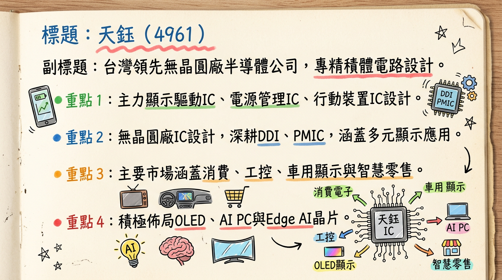
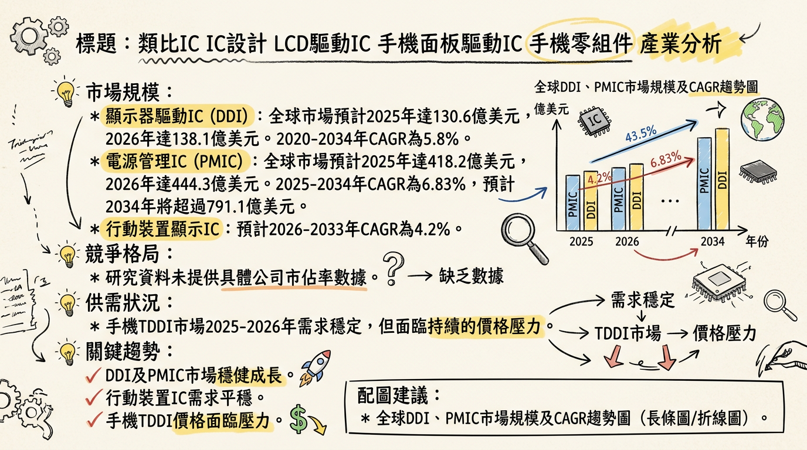
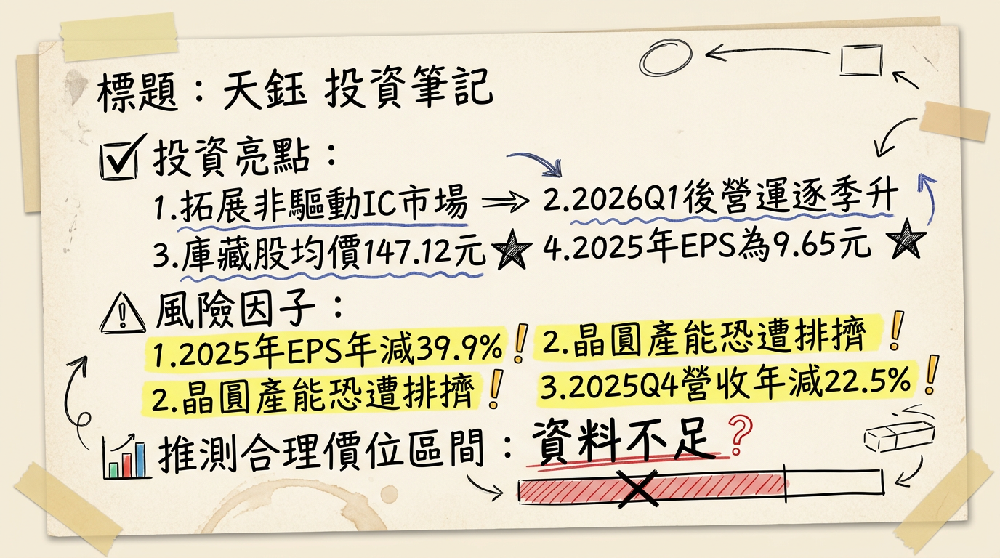

# 4961 天鈺 深度研究報告

## 一句話摘要
天鈺（4961）正處於轉型關鍵期，2025年獲利承壓，然積極布局非驅動IC產品線，特別是AIoT、ESL與高整合PMIC，預期在2026年帶動營運逐季回溫，挑戰非驅動IC營收佔比突破五成，儘管短期面臨8吋晶圓產能排擠與DDI市場競爭壓力，但長期成長動能明確。

## 公司概覽
天鈺科技（4961）是一家台灣領先的無晶圓廠（Fabless）半導體公司，主要從事積體電路設計業務。

**公司主要業務與核心產品/服務：**
*   **顯示器驅動IC (DDI)：** 應用於大尺寸（如TV、Notebook、Monitor）與中尺寸（如車載、工控）顯示器。提供TFT-LCD、AMOLED顯示驅動IC，並積極布局OLED DDI產品，涵蓋智慧手機、電視、筆電、平板、車用顯示等領域。
*   **電源管理IC (PMIC)：** 應用於快充、電子紙(EPD)、移動設備等領域。提供顯示面板電源管理、驅動電路控制，適用於AI PC、電競顯示器、VR裝置。
*   **Mobile IC (行動裝置IC)：** 包含TDDI（觸控與顯示驅動整合IC）、SDDI、TFT IoT與OLED產品，主要用於手機與平板。
*   **其他相關半導體：** 包含時序控制晶片(TCON)、電子紙驅動IC(EPD)、電子貨架標籤驅動IC(ESL)與Edge AI晶片，應用於電子紙與智慧零售。

**營收結構 (2025年Q2)**
| 產品線分類       | 營收佔比 |
| :--------------- | :------- |
| Mobile IC        | 34.87%   |
| 其他相關半導體   | 31.87%   |
| 顯示器驅動IC     | 21.67%   |
| 電源管理IC       | 11.57%   |
| **總計**         | **100%** |
*備註：截至2025年Q2，非驅動IC產品佔比已提升至43%，公司目標在2026年將非驅動IC相關營收比重提升突破五成。天鈺為無晶圓廠(Fabless)設計公司，無自有製造基地。*

## 核心競爭優勢
*   **多元產品組合與轉型能力：** 積極由傳統DDI業務轉向高成長的非驅動IC領域，涵蓋PMIC、ESL、AIoT晶片及車用DDI，降低單一產品線風險。
*   **OLED顯示技術領先佈局：** 持續投入AMOLED DDI與TDDI產品，受惠於OLED面板在手機、筆電及車用市場滲透率提升。
*   **邊緣AI晶片潛力：** AIoT與Edge AI晶片第一代已量產，次世代產品瞄準機器人、無人機等高階應用，具備長期成長潛力。
*   **高整合快充技術：** 預計推出支援PD3.2標準的高整合快充協議IC，有助於搶佔快速成長的快充市場。
*   **一線客戶認證與出貨：** 筆電eDP 1.5 T-Con、電競顯示器T-Con已打入一線品牌；eDP PMIC導入歐美新客戶；DDR5 PMIC導入DRAM品牌客戶。

## 財務分析

### 月營收趨勢
| 月份      | 金額 (新台幣億元) | 月增率 (MoM) | 年增率 (YoY) |
| :-------- | :---------------- | :----------- | :----------- |
| 2026年02月 | 13.23             | -1.77%       | -10.35%      |
| 2026年01月 | 13.47             | -3.04%       | -3.17%       |
| 2025年12月 | 13.89             | +4.29%       | -20.19%      |
| 2025年11月 | 13.32             | +7.12%       | -23.22%      |
| 2025年10月 | 12.44             | -10.27%      | -26.65%      |
| 2025年09月 | 13.86             | -1.37%       | -22.26%      |
*備註：2026年1月、2月營收受農曆年假影響，呈現雙衰退，為近4個月新低，但預期3月需求回溫。*

### 季度營收與獲利 (近四季)
| 項目               | 2024年Q4        | 2025年Q2        | 2025年Q3        | 2025年Q4        |
| :----------------- | :-------------- | :-------------- | :-------------- | :-------------- |
| 季營收 (新台幣億元) | 51.46           | 50.76           | 42.71           | 39.84           |
| 季增率 (QoQ)       | -               | +8.91%          | -15.86%         | -6.73%          |
| 年增率 (YoY)       | -               | -               | -               | -22.5%          |
| 毛利率             | 26.60%          | 28.63%          | 28.14%          | 27.76%          |
| 營業利益 (新台幣億元) | 4.90 (估算)     | 4.95            | 2.63            | 0.89            |
| 營業利益率         | 9.52%           | 9.75%           | 6.15%           | 2.23%           |
| EPS (新台幣元)     | 3.80            | 2.62            | 1.99 (估算)     | 1.57            |
*備註：2025年Q4營收季減與年減，營益率與淨利大幅衰退，反映市場逆風與轉型期挑戰。*

### 年度營收與 EPS
| 年度   | 項目           | 數字 (新台幣)             | 變動                      |
| :----- | :------------- | :------------------------ | :------------------------ |
| 2024年 | 全年營收       | 191.9974 億元             | -                         |
|        | 全年 EPS       | 16.08 元                  | -                         |
| 2025年 | 全年營收       | 179.93 億元               | 年減 6.28%                |
|        | 全年 EPS       | 9.65 元                   | 較2024年下滑              |
| 2026年 | 預估年度稅後純益 | 13.87 億元                | 預期較2025年成長          |
|        | 預估 EPS       | 11.33 ~ 11.59 元 (2026/03/03) | 預期較2025年成長          |

## 法說會重點 (2026年2月25日)
*   **2025年營運表現：** 全年EPS為9.65元，較2024年的16.08元明顯下滑。2025年Q4營收39.84億元，季減6.73%、年減22.5%；單季毛利率27.76%，淨利2.57億元，EPS 1.57元。全年合併營收179.93億元，年減6.28%；毛利率28.5%，營益率降至7.42%。
*   **短期營運展望 (2026年Q1)：** 1、2月受農曆年假影響表現相對低檔，預計3月需求將明顯回溫，後續可望呈現逐季走升態勢。
*   **2026年全年展望：** 預期整體營運將優於2025年，主要動能來自非驅動IC產品線的擴張與深化，其中Edge AI晶片營收貢獻將逐步成長，並將推出次世代產品。
*   **產品線具體規劃：**
    *   **顯示器驅動IC：** 持續提高大尺寸P2P介面市佔率，提供驅動IC、T-Con與面板PMIC整體解決方案。客戶需求轉向成本優化，部分品項有急單補庫存跡象。
    *   **電源管理IC (PMIC)：** 2026年Q1將推出支援Apple PD3.2標準高整合快充協議IC；eDP PMIC打入歐美新客戶並量產；DDR5 PMIC導入DRAM品牌客戶並放量；筆電LTPS面板PMIC Q1放量；Q2電視與顯示器產品將導入可免散熱設計PMIC。
    *   **行動裝置 (Mobile)：** AMOLED DDI出貨量持續放大，同步布局下一代產品；TDDI朝家電與數位顯示發展，已進入家電大廠驗證，Q2將推出多款含RAM的TDDI產品 (QHD、HD、Full HD)。
    *   **其他半導體 (AIoT, Edge AI)：** 鎖定2026年成長引擎為AI SoC與邊緣運算晶片。AIoT晶片聚焦智慧白電、生物辨識、AI玩具、AI數位裝置，延伸至機器人、無人機等邊緣運算應用。新一代IoT晶片將導入更先進製程。新一代ESL IC已放量，支援六色顯示。筆電eDP 1.5省記憶體T-Con打入一線品牌；電競顯示器T-Con切入QHD主流市場。
*   **產能利用率：** 董事長林永杰坦言，記憶體需求回升已排擠驅動IC在8吋晶圓產線產能，12吋產線亦密切觀察中，不排除未來類似排擠效應。
*   **資本支出金額：** 未提供2025-2026年具體資本支出金額。

## 券商觀點

### 券商目標價與評等
| 券商名稱 | 目標價 (新台幣) | 評等 | 日期              |
| :------- | :-------------- | :--- | :---------------- |
| 三家券商 | 150 ~ 166 元    | 中立 | 未明確標示發布日期 |
*備註：目前市場對天鈺評等多為「中立」，此目標價僅為市場討論，未揭露具體券商名稱與發布日期。法人機構平均預估2026年EPS為11.33~11.59元 (截至2026年3月3日)。*

## 財報深度分析

### 利潤率趨勢
| 項目                 | 2024年Q4 | 2025年Q1 | 2025年Q2 | 2025年Q3 | 2025年Q4 | 2025年全年 |
| :------------------- | :------- | :------- | :------- | :------- | :------- | :--------- |
| 毛利率               | 26.60%   | 29.31%   | 28.63%   | 28.14%   | 27.76%   | 28.50%     |
| 營業利益率           | 9.52%    | -        | 9.75%    | 6.15%    | 2.23%    | 7.42%      |
| 稅後淨利率 (估算)    | 8.94%    | -        | 9.54%    | 7.98%    | 6.45%    | 9.04%      |
| EPS (新台幣元)       | 3.80     | -        | 2.62     | -        | 1.57     | 9.65       |
*備註：2025年第四季毛利率季減0.38個百分點至27.76%，營業利益率大幅下滑至2.23%，顯示公司在營收下滑及產品組合轉換期間面臨較大的獲利壓力。產品組合轉型和匯率波動為主要影響因素。*

### 存貨分析
| 項目               | 2024年Q4 | 2025年Q1 | 2025年Q2 | 2025年Q3 | 2025年Q4 |
| :----------------- | :------- | :------- | :------- | :------- | :------- |
| 存貨金額 (新台幣億元) | -        | -        | 23.33    | -        | -        |
| 存貨週轉率 (次)    | 1.55     | 1.24     | 1.40     | 1.33     | -        |
| 存貨週轉天數 (天)  | 58.12    | 72.56    | 64.15    | 67.44    | 拉長     |
*備註：2025年Q2存貨金額季減17.6%至23.33億元，存貨週轉天數由72.56天降至64.15天，顯示存貨管理效率有所提升。然2025年Q4平均銷貨日數季增與年增，顯示存貨週轉天數再次拉長，可能暗示存貨有異常堆積現象。*

### 資本支出與折舊攤銷
*   **近3年資本支出金額與趨勢：** 未找到2024-2026年天鈺具體的資本支出金額與趨勢的詳細資料。
*   **未來資本支出計畫與預計新增產能：** 天鈺未明確公布擴廠或新增產能的量化目標，但強調持續投入高傳輸、高刷新率與節能設計產品，深化AI應用以提升產品競爭力。公司將專注於克服晶圓廠投片限制，並預期2026年營運優於2025年，由非驅動IC產品線帶動。
*   **折舊攤銷趨勢：** 根據2025年Q3合併現金流量表，近四季（2024Q4至2025Q3）折舊費用為4.47億元，攤銷費用為2.03億元。

### 應收帳款趨勢
| 項目                 | 2024年Q4 | 2025年Q1 | 2025年Q2 | 2025年Q3 | 2025年Q4 |
| :------------------- | :------- | :------- | :------- | :------- | :------- |
| 應收帳款週轉率 (次)  | 1.60     | 1.42     | 1.65     | 1.41     | -        |
| 應收帳款收現天數 (天) | 56.11    | 63.21    | 65.81    | 63.86    | 拉長     |
*備註：2025年Q2平均收現日數為65.81天，較Q1減少9.09天，顯示收款效率提升。然2025年Q4平均收現日數季增與年增，顯示應收帳款回收效率再次下降。*

## 股權異動

### 董監事/大股東申報轉讓
| 日期          | 身份   | 張數 | 方式 |
| :------------ | :----- | :--- | :--- |
| 2025年12月19日 | 經理人蔡坤憲 | 260  | 信託 |

### 庫藏股
| 宣布日期      | 執行期間          | 預計買回張數 | 實際買回張數 | 買回總金額 (新台幣) | 平均買回價 (新台幣) | 目的               | 佔已發行股數比率 |
| :------------ | :---------------- | :----------- | :----------- | :------------------ | :------------------ | :----------------- | :--------------- |
| 2026年01月05日 | 2026/01/06-03/05 | 1,500        | 1,500        | 220,678,034         | 147.12              | 轉讓股份予員工     | 1.24%            |
*備註：庫藏股已於2026年3月4日執行完畢，買回區間價格為94.50元至216.00元，顯示管理層對公司股價的信心。*

### 可轉債、增減資
*   **可轉債：** 未找到2024-2026年天鈺發行可轉換公司債的相關資料。
*   **增減資：** 未找到2024-2026年天鈺現金增資或減資計畫的相關資料。

### 股利政策
| 年度   | 現金股利 (新台幣元/股) | 股票股利 (新台幣元/股) | 除息日       | 現金發放日   | 盈餘配發率 (估計) | 現金殖利率 (估計) |
| :----- | :--------------------- | :--------------------- | :----------- | :----------- | :---------------- | :---------------- |
| 2024年 | 10.64                  | 0                      | 2024年06月27日 | 2024年07月26日 | -                 | -                 |
| 2025年 | 12.87                  | 0                      | 2025年07月01日 | 2025年07月25日 | 約八成            | 約6.1% (以2025/04/01收盤價210.5元計) |

## 產業分析

### 市場規模與 CAGR 成長率
| 產業細分               | 2024年市場規模   | 2025年市場規模   | 2026年市場規模   | 預估 CAGR (區間/年限) |
| :--------------------- | :--------------- | :--------------- | :--------------- | :-------------------- |
| 顯示器驅動IC (DDI)     | -                | 130.6億美元      | 138.1億美元      | 5.8% (2020-2034)      |
| 電源管理IC (PMIC)      | 408.6億美元      | 418.2億美元      | 444.3億美元      | 6.83% (2025-2034) 或 6.3% (2026-2034) |
| 行動裝置IC (Mobile DDI)| -                | -                | -                | 4.2% (2026-2033)      |

### 供需狀況
*   **顯示器驅動IC (DDI)：**
    *   Omdia預計2025年全球DDI出貨量年減1-2%，2026年溫和成長2%。
    *   大尺寸DDI 2025年需求平穩，供應充足，但終端需求不明朗，供應鏈備貨保守。
    *   LCD電視DDIC 2025年需求預計年減6.6%，受4K+高解析度面板出貨低於預期及DRD/TRD技術影響。
    *   IT應用DDI (NB、Monitor、Tablet) 2025年預計年增3%，受全球經濟不確定性影響。
    *   智慧手機DDI (中小尺寸) 2025年預計年減5%，長期穩定。
    *   手機TDDI 2025-2026年需求穩定但面臨價格壓力；AMOLED DDI需求隨滲透率提升而增長。
*   **電源管理IC (PMIC)：**
    *   AI伺服器電源管理需求迫切，2026年電源IC供應將全面吃緊，特別是高效能、高電流密度的產品。
    *   AI應用驅動PMIC需求激增，帶動8吋晶圓代工產能吃緊，華虹、中芯國際、世界先進等8吋廠產能利用率接近滿載 (超過95%)，預計2026年Q4仍維持高檔 (94-100%)，已醞釀零星漲價。
    *   PMIC市場2025年呈現緩步回溫的態勢。

### 產業的平均毛利率水準 (作為參考)
*   **DDI業者瑞鼎 (3592)：** 2025年全年毛利率28.5%。
*   **PMIC業者致新 (8081)：** 2024年Q2毛利率40%。
*   **晶圓代工世界先進 (5347)：** 預計2026年Q1毛利率有望提升至28-30%。
*   **台積電 (2330)：** 2025年Q4毛利率62.33%。

### 競爭格局

**台灣同業比較 (2025年)**
| 公司名稱 | 營收規模 (新台幣億元) | 毛利率   | EPS (新台幣元) | 產品主要類別           |
| :------- | :-------------------- | :------- | :------------- | :--------------------- |
| 天鈺 (4961) | 179.93 (2025全年)     | 28.50%   | 9.65           | DDI, PMIC, AIoT, ESL   |
| 瑞鼎 (3592) | 224.0 (2025全年)      | 28.50%   | 18.24          | OLED/LCD DDI           |
| 致新 (8081) | 55.50 (2024前8月)     | 40.00% (2024Q2) | 4.28 (2024Q2)  | PMIC, 放大器, 溫度感測 |
*備註：全球DDI/PMIC前5大公司市佔率及詳細技術、產能、客戶、價格等比較資訊未公開。中國大陸供應商在DDI市場的市佔率有望在2025年接近台灣。*

### 產業趨勢
1.  **AI應用普及與高效能需求：**
    *   **具體影響：** AI伺服器和AI PC的興起，對高效能、高電流密度的PMIC需求顯著增加，亦帶動散熱風扇馬達IC市場。
2.  **OLED顯示技術的快速發展：**
    *   **具體影響：** OLED面板在智慧手機、平板、筆記型電腦、電視以及車用顯示等領域的滲透率持續提升，推動AMOLED驅動IC的需求增長。低價版本的Ramless AMOLED驅動IC成為主流，同時隨著面板廠8.6代線產能陸續開出，平板、筆電與顯示器導入OLED面板的趨勢明確，帶動IT OLED DDI與T-COM產品逐步放量。
3.  **電動車及車用電子市場的成長：**
    *   **具體影響：** 電動車和混合動力車的快速普及，推動了對高電流、高效率電源管理IC（PMIC）的需求。汽車電子被認定為PMIC增長最快的細分領域。車用顯示器對DDI的需求也日益增加，且車用相關產品享有較長的產品週期，有助於廠商長期營運貢獻。

### 對天鈺而言的具體機會和威脅
*   **機會：**
    *   **OLED DDI市場擴張：** 積極佈局OLED DDI（手機、TV、NB、平板、車用），受惠於OLED滲透率提升。折疊手機DDIC用量翻倍。
    *   **AI相關PMIC需求：** PMIC佈局有機會切入AI PC、AI伺服器等高效能電源管理晶片市場。
    *   **車用電子領域發展：** 車用DDI與PMIC投入，受惠電動車及車用電子市場穩健成長。
    *   **ESL市場成長：** ESL IC已開始放量，支援六色顯示，智慧零售市場持續成長。
*   **威脅：**
    *   **DDI市場競爭加劇與價格壓力：** 2025年DDI出貨微降，手機TDDI面臨價格壓力，AMOLED DDI供應商增多導致價格下滑，毛利承壓。
    *   **傳統LCD應用需求趨緩：** LCD電視DDI需求下降，平板DDI疲軟，影響傳統DDI業績。
    *   **8吋/12吋晶圓產能排擠：** 記憶體需求回升已排擠DDI在8吋晶圓產能，未來可能延伸至12吋，影響出貨。
    *   **全球經濟不確定性：** 關稅政策與經濟環境不穩定，影響消費電子市場前景，進而影響整體IC需求。

### 相關投資題材的具體連結
*   **AI (人工智慧)：** 天鈺PMIC產品線可連結AI PC、AI伺服器對高效能電源管理晶片的需求。AIoT、Edge AI晶片更是直接受惠。
*   **電動車 (EV)：** 天鈺車載DDI與PMIC應用於車用顯示器及電子系統，與電動車產業快速發展相關。
*   **HBM (高頻寬記憶體)：** 雖不直接生產，但HBM市場熱絡可能排擠晶圓產能（DDI部分），對行動裝置IC業務可能產生間接影響。

## 近期催化劑 (2025年12月 - 2026年3月)

### 利多事件
*   **2026年3月4日：** 庫藏股執行完畢，實際買回1,500張，總金額2.21億元，平均每股147.12元，展現管理層對股價信心與激勵員工。
*   **2026年2月25日法說會：** 管理層預期2026年整體營運將優於2025年，營運動能可望逐季走升，且非驅動IC產品線（特別是Edge AI晶片）將成為主要成長引擎，朝非驅動IC營收佔比突破五成目標邁進。
*   **2026年Q1新產品陸續推出：** 支援Apple PD3.2高整合快充協議IC、eDP PMIC導入歐美新客戶量產、DDR5 PMIC導入DRAM品牌客戶並放量、筆電LTPS面板PMIC放量、家電/數位顯示TDDI進入家電大廠驗證。
*   **2025年4月1日：** 2024年獲利擬配發每股現金股利12.87元，以當時收盤價計算，現金殖利率約6.1%，顯示公司願意回饋股東。

### 利空事件
*   **2026年3月3日：** 公布2月營收13.23億元，月減1.77%、年減10.35%，為近4個月新低，顯示消費性電子淡季效應仍在。
*   **2026年2月25日法說會：** 坦言記憶體需求回升已排擠驅動IC在8吋晶圓產能，且不排除延伸至12吋，可能影響DDI出貨。2025年全年EPS 9.65元，較2024年16.08元大幅下滑，顯示獲利能力面臨挑戰。
*   **2026年1月至3月3日：** 外資累計賣超851張、投信累計賣超966張，顯示法人對公司短期表現持審慎態度。
*   **2025年第四季財報：** 季營收39.84億元季減6.7%、年減22.5%；營業利益僅0.89億元季減66.04%、年減82.07%；EPS 1.57元季減24.4%、年減58.7%，獲利能力大幅衰退。

## ⭐ 成長動能時間軸
| 時間         | 事件                                   | 成長動能                          | 備註                          |
| :----------- | :------------------------------------- | :-------------------------------- | :---------------------------- |
| **2025年Q2** | 第一代AIoT晶片進入規模量產             | Edge AI晶片市場                   | 智慧白電、生物辨識、AI玩具等應用 |
| **2025年Q2** | 非驅動IC營收佔比提升至43%              | 產品組合優化、非DDI成長           | 目標2026年突破五成            |
| **2025年Q3** | 新一代ESL IC開始放量                   | 電子貨架標籤 (ESL) 市場擴張       | 支援六色顯示技術                |
| **2026年Q1** | 推出支援Apple PD3.2高整合快充協議IC    | 快充市場、PMIC高整合趨勢          | 將多項外部元件整合至單一晶片    |
| **2026年Q1** | eDP PMIC導入歐美新客戶量產             | PMIC新客戶/市場擴展               | 筆電eDP應用                      |
| **2026年Q1** | DDR5 PMIC導入記憶體品牌客戶並放量出貨 | DDR5市場、PMIC應用                | 受惠DDR5升級潮                  |
| **2026年Q1** | 筆電LTPS面板用PMIC放量出貨             | LTPS面板應用、PMIC市場擴展        |                               |
| **2026年Q1** | 家電/數位顯示TDDI進入家電大廠驗證      | 家電TDDI新市場                    | 搶食白色家電市場                |
| **2026年Q1** | 筆電eDP 1.5省記憶體T-Con打入一線品牌   | T-Con市場、一線品牌客戶           | 筆電應用趨勢                    |
| **2026年Q1** | 電競顯示器T-Con切入QHD主流市場         | T-Con市場、電競應用               |                               |
| **2026年Q2** | 電視/顯示器產品導入可免散熱設計PMIC    | PMIC技術創新、成本優化            | 協助面板廠降低成本              |
| **2026年Q2** | 推出新一代AMOLED PMIC                  | AMOLED市場、PMIC技術升級          |                               |
| **2026年Q2** | 開發下一代IoT晶片 (導入更先進製程)     | AIoT、Edge AI晶片效能提升         | 瞄準機器人、無人機等邊緣運算    |
| **2026年**   | 整體營運預期優於2025年                 | 非驅動IC產品線持續擴展            | 營收獲利回升預期                |
| **2026年**   | 非驅動IC相關營收比重目標突破五成       | 產品組合轉型成功、多元成長        |                               |
| **2026年**   | Edge AI晶片營收貢獻逐步成長並推次世代  | Edge AI晶片市場                   | 邊緣運算應用深化                |
| **長期**     | OLED DDI佈局 (手機、TV、NB、平板、車用) | OLED滲透率提升                    |                               |

## 2026 展望
天鈺董事長林永杰預期2026年整體營運將優於2025年，並呈現逐季走升態勢。法人機構平均預估2026年稅後純益將達13.87億元，EPS介於11.33~11.59元，相較2025年9.65元的低點將有顯著回升。

### 成長動能
1.  **非驅動IC產品線持續擴展：** 公司目標在2026年將非驅動IC營收比重提升突破五成。Edge AI晶片、ESL、高效能PMIC (如PD3.2快充、DDR5 PMIC、eDP PMIC) 等產品將是主要成長引擎。
2.  **AIoT與Edge AI晶片放量：** 第一代AIoT晶片已進入規模量產，新一代IoT與AI SoC將導入更先進製程，瞄準機器人、無人機等高階邊緣運算應用，營收貢獻將逐步放大。
3.  **OLED DDI與TDDI佈局深化：** 受惠於AMOLED面板滲透率提升及折疊手機DDIC用量翻倍，OLED DDI出貨持續放大。TDDI產品積極切入家電與數位顯示應用，並推出多款含RAM的TDDI產品。
4.  **車用電子市場貢獻：** 車用DDI和PMIC隨著電動車與智慧座艙市場成長，提供穩健的長期營收動能。
5.  **T-Con產品線競爭力提升：** 筆電eDP 1.5省記憶體T-Con及電競顯示器QHD T-Con已打入一線品牌及主流市場，有望持續擴大市佔。

### 風險因子
1.  **晶圓產能排擠風險：** 記憶體需求回升已排擠8吋晶圓產能，且不排除延伸至12吋，可能影響DDI產品的供應與出貨。
2.  **DDI市場價格競爭激烈：** 消費性電子需求復甦緩慢，DDI尤其手機TDDI和AMOLED DDI市場競爭激烈，價格壓力持續，可能影響公司毛利率。
3.  **消費性電子需求復甦速度不如預期：** 儘管管理層預期3月需求回溫，但整體消費性電子終端市場需求是否能全面復甦，仍存在不確定性。
4.  **新產品開發與市場導入不確定性：** 雖然公司積極布局多條新產品線，但新產品的營收貢獻時程與市場接受度仍需觀察，若進度不如預期可能影響2026年成長目標。
5.  **總體經濟不確定性：** 全球經濟成長放緩、地緣政治風險及匯率波動等因素，仍可能對公司營運造成不利影響。

## 投資結論
綜合上述分析，天鈺（4961）正處於由傳統DDI廠向多元化IC設計公司轉型的關鍵階段。儘管2025年獲利面臨壓力，但公司積極拓展Edge AI、ESL、高效能PMIC等非驅動IC產品線，為2026年營運成長奠定基礎。

1.  **轉型效益將逐步顯現：** 非驅動IC營收佔比目標突破五成，Edge AI晶片、高整合快充PMIC、DDR5 PMIC、ESL等新產品線有望在2026年提供明確成長動能，支撐營收回升。
2.  **DDI市場挑戰與機遇並存：** 傳統DDI市場面臨產能排擠與價格競爭，但AMOLED DDI在OLED滲透率提升、車用DDI在電動車市場的佈局，將是DDI業務的長期成長支撐。
3.  **財務結構穩健，管理層具信心：** 儘管短期獲利下滑，但公司負債比率仍低。庫藏股的執行顯示管理層對公司價值的信心，有助於提振市場情緒。
4.  **關注毛利率與產能狀況：** 隨著新產品組合變化，需密切關注公司毛利率能否有效改善。同時，記憶體需求對8吋/12吋晶圓產能的排擠效應，是未來營運潛在風險。
5.  **目標價區間建議：** 考量公司2026年EPS預估區間為11.33~11.59元，並參考市場對其轉型前景的審慎樂觀態度，給予合理本益比區間約13-15倍。因此，建議天鈺的**目標價區間為新台幣 147.3 ~ 173.85 元**。投資人應關注公司新產品出貨動能、毛利率改善情況以及晶圓產能供應的變化。

本報告由 AI 自動產生，資料來源為公開網路資訊，僅供參考，不構成投資建議。產生時間：2026-03-06 14:35

---

## 📊 資訊卡

