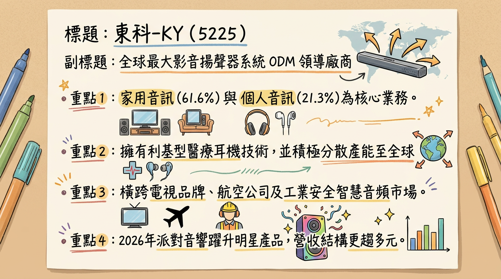
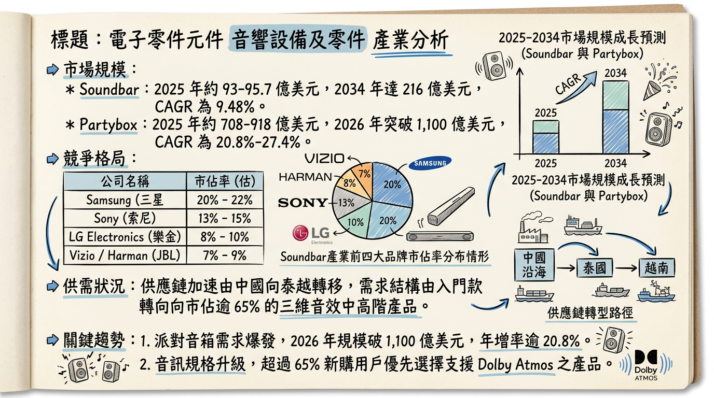
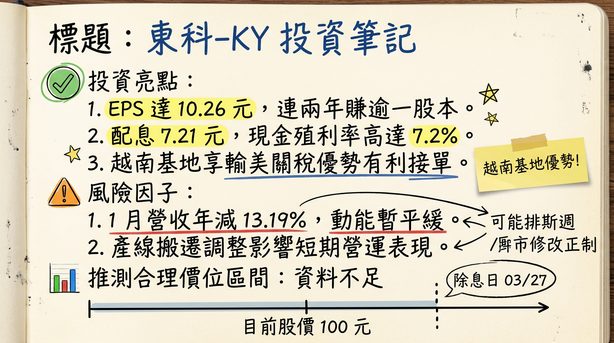

# 5225 東科-KY 深度研究報告

## 一句話摘要
**全球影音揚聲器 ODM 龍頭，憑藉越南產能優勢與高毛利 Partybox 新動能，2026 年獲利重回成長軌道，伴隨 7% 高殖利率提供強勁下檔支撐。**

---

## 公司概覽
東科-KY 為全球最大的影音揚聲器系統代工大廠，擁有從揚聲器單體到整機組裝的垂直整合能力，長期深耕韓系、日系及美系一線品牌客戶。

### 業務產品線與營收結構（2025 H1）
| 產品線 | 營收佔比 | 核心內容 | 2026 展望 |
| :--- | :--- | :--- | :--- |
| **家用音訊系統** | 61.6% | Soundbar（聲霸）、家庭劇院 | 穩健成長，導入 AI 聲學技術 |
| **個人音訊系統** | 21.3% | 電競耳機、專業耳機、醫療耳機 | 受惠新創與醫療品牌訂單，比重預計提升 |
| **穿戴式音訊** | 8.0% | 智慧穿戴裝置音響 | 整合生醫應用 |
| **其他** | 9.1% | 喇叭單體、Partybox、利基型產品 | **2026 爆發點**，Partybox 貢獻將顯著增加 |

---

## 核心競爭優勢
1.  **產能高度分散與避險能力**：越南產能營收佔比已突破 60%，有效規避地緣政治及關稅風險；中國產能降至 35% 並已完成自動化新廠遷移。
2.  **頂級客戶黏著度**：為 Samsung（全球市佔第一）、LG、Sony 等龍頭廠的核心代工夥伴，技術規格領先同業（如 Dolby Atmos 整合能力）。
3.  **綜效整合力**：2025 年佳世達（2352）入股 35%，強化醫療聲學與高階影音供應鏈之垂直整合。
4.  **研發與邊緣 AI 應用**：成功將邊緣 AI 演算法導入音訊處理，實現空間自動校準（Room Calibration）。

---

## 財務分析

### 近 6 個月營收趨勢表
| 月份 | 營收（億元） | 月增率 (MoM) | 年增率 (YoY) | 備註 |
| :--- | :--- | :--- | :--- | :--- |
| **2026/01** | 7.38 | +3.91% | -13.20% | 淡季回溫，受產線搬遷基期影響 |
| **2025/12** | 7.10 | +2.99% | -22.10% | 2025 年底淡季，客戶庫存調整 |
| **2025/11** | 6.89 | -12.4% | -10.60% | |
| **2025/10** | 7.87 | -39.9% | -27.50% | 搬遷廠區造成短期干擾 |
| **2025/09** | 13.09 | +0.7% | -1.40% | 出貨旺季高點 |
| **2025/08** | 13.00 | +28.8% | -3.34% | |

### 年度關鍵財務指標
*   **2025 實際值**：營收 110.39 億元，EPS 10.26 元，毛利率 16.4%（歷史次高）。
*   **2026 法人預估值**：營收挑戰雙位數成長，EPS 預估落於 12.0~13.94 元。

---

## 法說會重點（2026/02/23）
1.  **營運展望**：2026 第一季為全年低點，隨後逐季走升。預計 2026 全年營收挑戰雙位數增長，獲利體質因廠區遷移完成、租金下降而優於 2025。
2.  **產品趨勢**：**Partybox (派對音響)** 為 2026 年明星產品，ASP 高且利潤佳，已獲多家知名品牌訂單。
3.  **新市場切入**：正洽談高檔航空公司耳機代工，預計 2026 下半年放量。
4.  **成本控制**：中國與丹麥廠搬遷完成，2026 起租金與營運成本將顯著下降。

---

## 券商觀點（目標價表格）
| 券商名稱 | 評等 | 目標價 | 預估 2026 EPS | 日期 |
| :--- | :--- | :--- | :--- | :--- |
| 法人圈綜合預估 | 正向/買進 | 145 ~ 159 元 | 13.20 元 (中位) | 2026/02/05 |
| CMoney 團隊 | 持有/高股息 | N/A | 13.20 元 | 2026/02/23 |
| 康和證券 | 買進 | 145 元 | 11.93 元 (2025) | 2025/08/19 |

---

## 財報深度分析

### 利潤率趨勢表格
| 年度/季度 | 毛利率 (%) | 營業利益率 (%) | 稅後淨利率 (%) | 狀態說明 |
| :--- | :---: | :---: | :---: | :--- |
| **2025 Q3** | 18.89% | 9.27% | 8.93% | 高毛利產品比重上升 |
| **2025 Q4 (E)** | 14.50% | 5.20% | 4.80% | 搬遷費用一次性影響 |
| **2025 全年** | **16.40%** | **6.70%** | **6.00%** | 獲利韌性極強 |

*   **存貨分析**：2025 Q3 存貨週轉天數為 **31.42 天**，優於 2024 年同期的 39.49 天，存貨管理極其效率。
*   **資本支出**：2026 年預計維持高檔（約 4-5 億元），主要投入越南二廠擴建與馬來西亞新廠量產，以應對美系客戶分散風險需求。

---

## 股權異動與結構
*   **大股東結構**：**佳世達（2352）持股約 35%**，為核心法人股東。
*   **CB 可轉債**：東科一KY（52251）已於 2025/11/28 到期終止，目前無掛牌 CB，財務槓桿轉向穩健。
*   **配息政策**：2025 年盈餘預計配發 **7.21 元** 現金股利，配發率 70.2%，殖利率約 **7.2%**（以股價 100 元計算）。

---

## 產業分析（市場規模與競爭格局）

### 全球 Soundbar 市佔率（2025）
| 品牌商 | 市佔率 | 東科-KY 關係 |
| :--- | :--- | :--- |
| **Samsung** | 23.09% | 核心 ODM 合作夥伴 |
| **VIZIO** | 16.26% | 主要供應商 |
| **Sony** | 約 7.00% | 重點代工客戶 |

### 競爭對手比較表（2025 數據）
| 公司名稱 | 營收規模 (億) | 毛利率 (%) | EPS (元) | 核心優勢 |
| :--- | :---: | :---: | :---: | :--- |
| **東科-KY** | 110.39 | 16.4% | 10.26 | **Soundbar 全球龍頭、越南產能 > 60%** |
| **美律** | ~ 450.00 | 13-14% | 6.5-7.0 (E) | 主攻手機/電競耳機、助聽器 |
| **國光電器 (陸)** | N/A | 約 11-13% | N/A | 規模大但受地緣政治關稅壓力大 |

---

## 近期催化劑
*   **利多事件**：
    1.  2026/03/27 除息（7.21 元），高殖利率具填息吸引力。
    2.  越南輸美稅率傳出由 20% 降至 15%，提升毛利空間。
    3.  美系兩大零售巨頭 Soundbar/Partybox 訂單於 2026 Q1 開始放量。
*   **利空事件**：
    1.  美金匯率劇烈震盪可能產生匯兌損益。
    2.  2025 Q4 搬遷費用導致基期數據較弱。

---

## ⭐ 成長動能時間軸
*   **2025/Q4**：完成中國/丹麥廠搬遷，開始實施自動化生產。
*   **2026/Q1**：美系零售巨頭新訂單正式上架；開始應用 Qwen2.5 輕量版 AI 音箱模組。
*   **2026/Q2**：**越南二廠全面投產**，產能預計提升 15-20%。
*   **2026/H2**：**Partybox 明星產品進入出貨高峰**；航空耳機代工若成功則開始放量。
*   **2026 全年**：馬來西亞新廠進入試產與量產，滿足歐洲精品客戶需求。

---

## 2026 展望
*   **成長動能**：
    *   **產品升級**：中高階具備 Dolby Atmos 的 Soundbar 滲透率持續提升。
    *   **客戶分散**：降低對單一韓系客戶依賴，新增美系與中系（北美熱銷品牌）新單。
    *   **效率提升**：搬遷後的自動化與租金節省效益於 2026 全面顯現。
*   **風險**：
    *   美國對等關稅政策（Reciprocal Trade）的不確定性。
    *   消費性電子終端需求若回溫速度不如預期。

---

## 投資結論
1.  **高股息防禦性**：7.2% 的高殖利率在市場波動中具備高度防禦價值，且連續兩年 EPS 賺逾一個股本。
2.  **營運拐點已現**：2025 年為遷廠與結構調整年，2026 年隨 Partybox 與新客戶訂單挹注，獲利有望挑戰歷史新高。
3.  **評價面優勢**：目前本益比約為 8-9 倍，低於過去 5 年平均的 11-12 倍，估值具備修復空間。
4.  **建議目標價區間**：
    *   **保守目標**：120 元（給予 9x PE）
    *   **積極目標**：**150 元**（給予 11x PE，基於 2026 EPS 13.5 元預估）

---
本報告由 AI 自動產生，資料來源為公開網路資訊，僅供參考，不構成投資建議。產生時間：2026-03-02 19:25

---

## 📊 資訊卡

