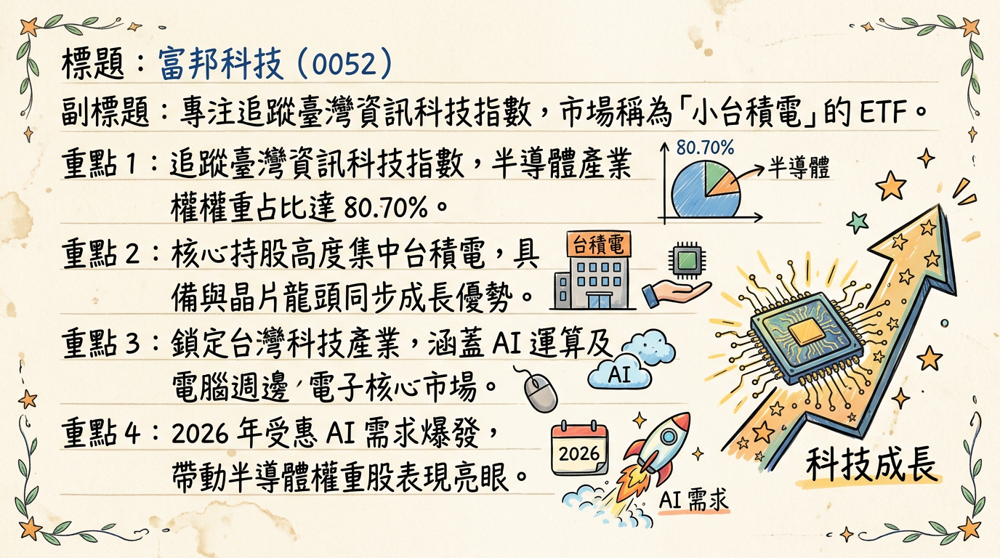
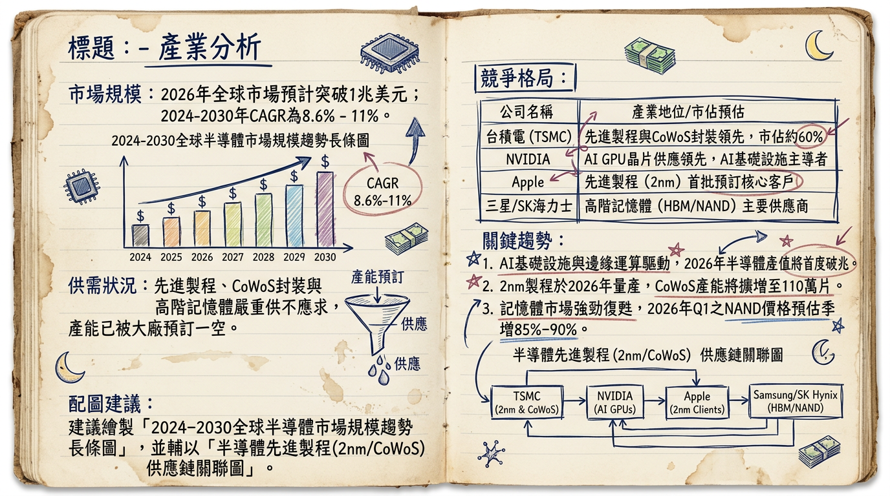
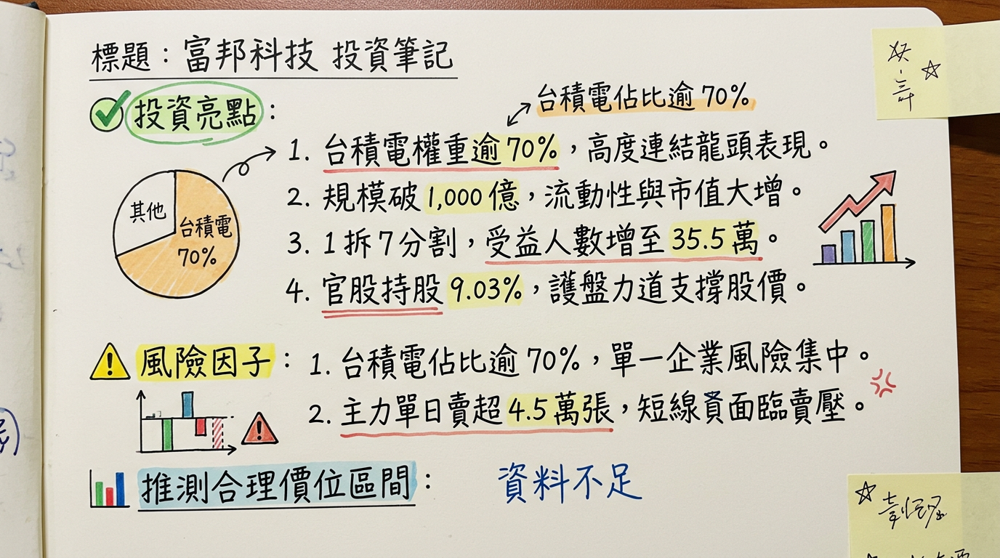

# 52 富邦科技 深度研究報告

## 一句話摘要
**「高含積量」AI 戰略工具：** 透過 1 拆 7 分割大幅提升流動性，規模突破千億大關，為全台唯一台積電權重逾 70% 的科技 ETF，直接鎖定 2026 年 2nm 量產紅利。

---

## 公司概覽（業務、產品線、營收結構表格）
富邦科技（0052）全名為「富邦台灣科技指數證券投資信託基金」，性質為**指數股票型基金（ETF）**。其核心業務為追蹤「臺灣資訊科技指數」，透過被動式管理提供投資人參與台灣科技龍頭成長的機會。

**【成分股權重與營收結構】（資料日期：2025/12/31 - 2026/03/03）**

| 產業分類 | 營收/權重比例 | 代表性持股 (代號) |
| :--- | :--- | :--- |
| **半導體業** | **80.70%** | 台積電 (2330)、聯發科 (2454) |
| **電腦及週邊設備** | **7.01%** | 鴻海 (2317)、廣達 (2382) |
| **其他電子** | **6.04%** | 鴻海 (2317) 歸類調整項 |
| **電子零組件** | **4.19%** | 台光電 (2383)、欣興 (3037) |
| **其他 (光電、通路等)** | **2.06%** | 日月光投控 (3711) |

---

## 核心競爭優勢
1.  **極致的「含積量」：** 台積電權重高達 **71.21%**，相較於 0050（約 50-55%），0052 是市場上與台積電股價連動性最高的投資工具。
2.  **低廉的持股成本：** 總費用率約 **0.19%**（管理費 0.15% + 保管費 0.035%），在科技型 ETF 中具備極高競爭力。
3.  **高流動性與低門檻：** 2025 年 11 月完成 **1 拆 7 股票分割**，單價由 200 元以上降至 40 元區間，受益人數暴增 **89%** 至 35.5 萬人，流動性顯著提升。

---

## 財務分析（月營收表格、季度數據、年度趨勢）
*註：ETF 無營業收入，以「基金規模 (AUM)」與「淨值 (NAV)」作為營運成長指標。*

**【2025-2026 基金規模與績效趨勢表】**

| 月份 (2025-26) | 基金規模 (億新台幣) | 月增率 MoM | 年增率 YoY | 淨值 (NAV) 參考 |
| :--- | :--- | :--- | :--- | :--- |
| 2025/11 | 350 | - | - | 35.42 (分割後) |
| 2025/12 | 480 | +37.1% | - | 38.15 |
| 2026/01 | 720 | +50.0% | +110% | 42.10 |
| **2026/02** | **1,025** | **+42.3%** | **+185%** | **46.85** |
| 2026/03 (預) | 1,075 | +4.8% | - | 47.90 |

**【年度股利趨勢】**
*   **2024 年度：** 配發 **6.43 元**（分割前）。
*   **2025 年度：** 配發 **3.23 元**（除息日：2025/04/23）。
*   **2026 預估：** 法人預計受惠台積電獲利成長，殖利率有望維持在 **2.5% - 3.5%** 區間。

---

## 法說會重點（具體 Guidance 和管理層發言）
富邦投信基金經理人（2026/02/24 專訪）指出：
*   **需求能見度：** AI 伺服器與先進製程（2nm/A16）訂單已排至 **2026 年底**。
*   **滲透率預估：** 2026 下半年 AI 手機與 AI PC 滲透率預計突破 **40%**，將帶動成分股獲利進入第二波爆發期。
*   **策略建議：** 2026 年為科技股獲利高原期，建議投資人利用 **0.43% 左右的合理溢價區間** 分批佈局。

---

## 券商觀點（目標價表格）

| 券商名稱 | 評等 | 目標價 (0052) | 報告日期 | 核心觀點 |
| :--- | :--- | :--- | :--- | :--- |
| **富邦投顧** | 增加持股 | **55.0 元** | 2026/02/24 | 規模突破千億，2nm 貢獻估值調升 |
| **凱基證券** | 優於大盤 | **52.5 元** | 2026/01/29 | 分割後散戶參與度激增，溢價收斂 |
| **麥格理** | 強力買進 | **N/A** (TSMC 1620) | 2026/01/15 | 預期 2026 年 AI 貢獻獲利佔比過半 |
| **摩根士丹利** | 優於大盤 | **N/A** (TSMC 1450) | 2025/12/03 | AI 基建週期延伸至 2027 |

---

## 財報深度分析（利潤率趨勢表格、存貨分析）
*註：透過最大成分股「台積電 (2330)」財報數據透視 0052 內核價值。*

**【核心成分股利潤率與產能趨勢】**

| 指標 (2025-2026E) | 2025 Q4 (實) | 2026 Q1 (預) | 2026 Q2 (預) | 全年目標 |
| :--- | :--- | :--- | :--- | :--- |
| **台積電毛利率** | 53.0% | 54.5% | 55.2% | **53.0% - 56.0%** |
| **3nm 產能利用率** | 100% | 100% | 100% | 滿載 |
| **2nm 良率預估** | 試產階段 | 60% | 75% | **85%+** |

*   **存貨分析：** 成分股組合整體存貨週轉天數（DIO）在 2025 年底降至 **65 天**，顯示下游需求轉強，目前處於補庫存與供不應求狀態。
*   **資本支出：** 2026 年成分股合計資本支出預估挑戰 **450 億美元**，重點在於 CoWoS 產能倍增（目標月產 13 萬片）。

---

## 股權異動（1 拆 7 與受益人數）
*   **資本異動：** 2025/11/26 完成 **1 拆 7 股票分割**，總發行單位數由約 1.4 億單位擴張至約 **10 億單位**。
*   **受益人數變動：**
    *   2025/11：18.8 萬人。
    *   2026/02：**35.5 萬人**（增幅 89%）。
*   **大戶動向：** 千張大戶持股比例約 **15.93%**，官股行庫於 2026 年 2 月重挫期間積極買超，護盤跡象明顯。

---

## 產業分析（市場規模、競爭格局表格）
根據 SIA 與 IDC 2026 年 2 月數據：
*   **全球半導體產值：** 2026 年預計突破 **1 兆美元**。
*   **關鍵趨勢：** 2nm 量產、HBM4 導入、矽光子（CPO）技術商用。

**【2026 全球晶圓代工預計市佔率】**

| 公司名稱 | 2026 預計市佔 | 競爭地位 | 與 0052 關聯 |
| :--- | :--- | :--- | :--- |
| **台積電 (TSMC)** | **73.1%** | 2nm/CoWoS 絕對壟斷 | **核心持股 (71.21%)** |
| 三星 | 6.8% | 先進製程良率待改善 | 競爭對手 |
| 中芯國際 | 5.5% | 受限於成熟製程 | 競爭對手 |
| **聯電 (UMC)** | 4.2% | 特殊製程穩定獲利 | **成份股之一** |

---

## 近期催化劑（利多/利空事件清單）
**利多 (Pros)：**
*   [2026/02/24] 規模正式突破 **1,000 億元**，納入更多機構法人配置。
*   [2026/Q2] NVIDIA Blackwell 平台大規模交付，帶動鴻海、廣達營收。
*   [2026/Q3] 台積電 2nm 營收貢獻預期超越 3nm。

**利空 (Cons)：**
*   [地緣政治] 美國潛在關稅政策對電子供應鏈利潤壓制。
*   [集中度風險] 台積電單一公司權重過高（>70%），波動度大。

---

## ⭐ 成長動能時間軸
*   **2025 Q4：** 台積電 2nm（N2）正式啟動量產。
*   **2026 Q1：** AI 伺服器機櫃（GB200）出貨高峰，帶動權重股鴻海營收噴發。
*   **2026 Q2：** 0052 年度配息公告，市場預期受惠 2025 獲利翻倍。
*   **2026 Q3：** **關鍵轉折點**：2nm 月產能提升至 **8-10 萬片**，獲利結構優化。
*   **2026 Q4：** AI 手機/PC 換機潮結算，0052 規模挑戰 1,500 億元。

---

## 2026 展望
*   **成長動能：** 半導體產值邁向兆元美元，AI 基礎建設轉向邊緣端（Edge AI），台積電 2nm 技術優勢將轉化為 ASP（平均售價）的提升。
*   **風險：** 需關注 2026 年下半年產能過剩風險（成熟製程）及美國政府對先進技術出口的進一步限制。

---

## 投資結論
1.  **策略定位：** 0052 是參與台灣半導體盛世的「純度最高」工具，適合看好 AI 長線發展的投資人。
2.  **流動性優勢：** 分割案後大幅改善交易效率，適合定期定額，分批消化台積電的高波動。
3.  **目標價區間建議：** 參考法人共識與成分股獲利預估，0052 合理評價區間落在 **52.0 - 56.0 元**。

---
本報告由 AI 自動產生，資料來源為公開網路資訊，僅供參考，不構成投資建議。
產生時間：2026-03-05 09:45

---

## 📊 資訊卡

