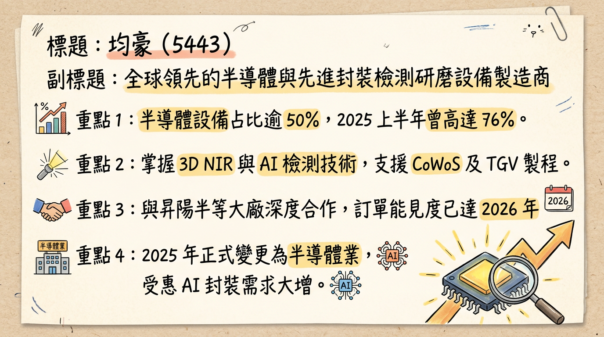
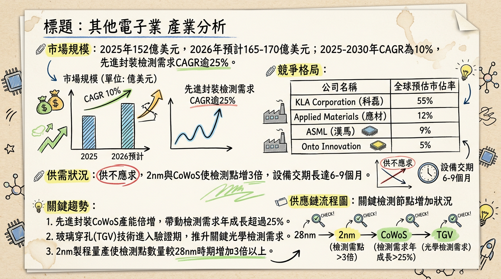
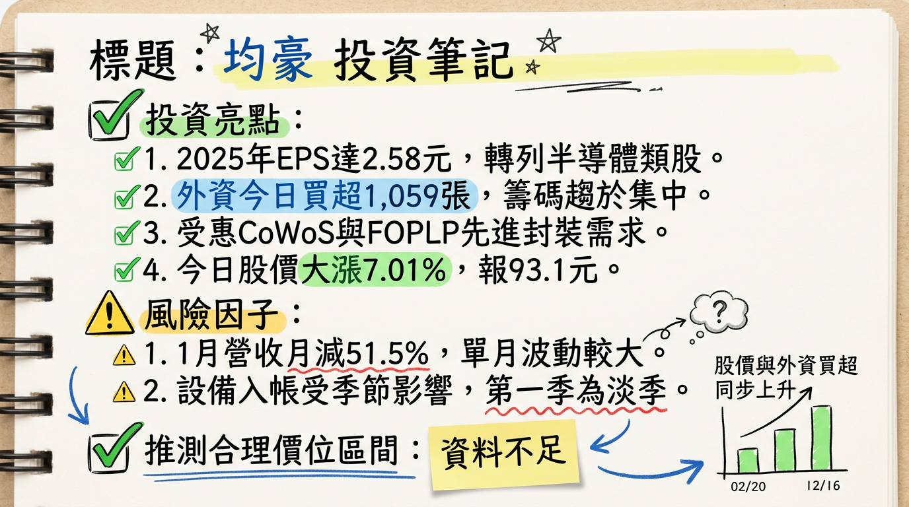

# 5443 均豪 深度研究報告：半導體轉型收割期，2nm 與先進封裝推升成長新高度

**日期：2026 年 03 月 05 日**

---

## ## 一句話摘要
均豪（5443）成功由面板設備轉型為半導體「檢、量、磨、拋」設備大廠，受惠 2 奈米製程及先進封裝（CoWoS/FOPLP）需求爆發，2026 年獲利有望續創歷史新高。

---

## ## 公司概覽
均豪精密工業（GPM）過去以面板設備為主，自 2025 年 6 月正式變更業態為「半導體類股」。公司目前專注於先進封裝檢測、再生晶圓研磨（CMP）及 AI 自動光學檢測。

**【2025 年營收結構表格】**
| 業務類別 | 營收佔比 | 核心產品 |
| :--- | :--- | :--- |
| **半導體設備** | **50% - 60%** | 研磨設備 (Strip Grinder)、CMP 設備、3D NIR 檢測、Carrier Inspection |
| **面板/顯示器設備** | **30% - 40%** | Micro LED 設備、新一代 LTPS 面板設備 |
| **其他（智動化系統等）** | **5% - 10%** | 智能倉儲、自動化搬運系統 |

*註：2025 年上半年受惠 AI 需求，個體半導體佔比一度達 76%。*

---

## ## 核心競爭優勢
1.  **「檢、量、磨、拋」一體化技術：** 具備研磨減薄與高精度光學檢測雙重技術，為台廠少數能提供 CMP 研磨至 3D 檢測一站式方案的廠商。
2.  **G2C+ 策略聯盟：** 與志聖 (2467)、均華 (6640) 組成聯盟，共享研發與製造資源，具備強大的「整線輸出」能力。
3.  **2 奈米先行者：** 與再生晶圓龍頭（如昇陽半）深度綁定，CMP 設備已打入 2 奈米供應鏈，訂單能見度直達 2026 年底。
4.  **在地化全球服務：** 隨台積電佈局，於熊本、德勒斯登、亞利桑那設有服務據點，強化與大客戶的黏著度。

---

## ## 財務分析

**【月營收趨勢表格（最近 6 個月）】**
| 月份 | 營收（百萬元） | 月增率 MoM | 年增率 YoY | 狀態備註 |
| :--- | :--- | :--- | :--- | :--- |
| **2026/01** | **269.44** | **-51.47%** | **-5.41%** | 傳統淡季與 12 月高基期影響 |
| **2025/12** | **555.16** | +50.14% | +1.30% | 創 24 個月新高 |
| **2025/11** | **369.75** | +16.69% | -23.66% | 入帳週期波動 |
| **2025/10** | **316.87** | -25.78% | -33.06% | |
| **2025/09** | **426.94** | -21.24% | +69.13% | |
| **2025/08** | **542.05** | +71.99% | +30.44% | 2025 年營收次高 |

**【年度 EPS 趨勢】**
*   **2024 (實際)：** 1.61 元
*   **2025 (實際)：** **2.58 元** (創 19 年新高，淨利 4.15 億元)
*   **2026 (法人預估)：** **3.2 - 3.8 元**

---

## ## 法說會重點（2026/03/03 最新內容）
1.  **營收 guidance：** 半導體營收佔比目標在 2026 年底穩定達到 60% 以上。
2.  **CMP 設備：** 訂單能見度極佳，受惠於 2 奈米製程及再生晶圓需求，產線維持高效率自動化組裝。
3.  **先進封裝 (CoWoS/FOPLP)：** 配合子公司均華出貨 OSAT 大廠，檢測設備隨客戶擴產持續追加訂單。
4.  **管理層發言：** 董事長陳政興強調「未來十年是設備業黃金十年」，2026 年將是 FOPLP（面板級封裝）接手產能缺口的關鍵年。

---

## ## 券商觀點

**【券商目標價表格】**
| 券商名稱 | 評等 | 目標價 | 2026 EPS 預估 | 報告日期 |
| :--- | :--- | :--- | :--- | :--- |
| **統一證券** | 買進 (Buy) | **120 元** | 3.15 元 | 2026/01/06 |
| **元大證券** | 看多 (Positive) | **115 元** | 3.42 元 | 2026/03/03 |
| **CMoney研究員** | 強力買進 (Strong Buy) | **N/A** | **3.30 元** | 2026/01/05 |

---

## ## 財報深度分析

**【2025 年度利潤率趨勢表格】**
| 項目 | 2025 Q1 | 2025 Q2 | 2025 Q3 | 2025 Q4 |
| :--- | :--- | :--- | :--- | :--- |
| **毛利率** | 37.81% | 36.31% | 34.11% | **32.99%** |
| **營業利益率** | 11.64% | 10.54% | 7.54% | **11.97%** |
| **稅後淨利率** | 10.66% | 15.44% | 7.41% | **11.19%** |

*   **存貨分析：** 2025 Q4 存貨週轉天數約 **94.12 天**，較年初 169 天大幅改善，顯示銷貨速度加快。
*   **資本支出：** 2025 全年投入約 **1.5 - 2 億元** 於 2 奈米檢測技術與 AI 數位雙生研發。

---

## ## 股權異動與資本結構
1.  **信託申報：** 2026/01/14 董事長陳政興（115 張）及執行長梁又文（135 張）申報信託，主要用於員工權利新股管理。
2.  **庫藏股轉讓：** 2026/02/26 董事會決議轉讓 113 年買回之庫藏股予員工，強化人才留用。
3.  **股利政策：** 2025 年度擬配發 **2.2 元現金股利**，為近年高點。

---

## ## 產業分析

**【全球半導體檢測設備競爭格局】**
| 排名 | 公司名稱 | 核心領域 | 市佔/地位 |
| :--- | :--- | :--- | :--- |
| 1 | **KLA (美)** | 前段瑕疵檢測、量測 | 55% (全球領導者) |
| 2 | **AMAT (美)** | 電子束檢測、CMP | 12% |
| **-** | **均豪 (5443)** | **CMP、3D NIR、AOI** | **國產化領先者，價格具 20-30% 優勢** |

*   **市場規模：** 預計 2026 年全球量測檢測市場達 **165-170 億美元**，先進封裝需求成長率 >25%。

---

## ## 近期催化劑
*   **利多：**
    1.  法說會後法人大舉買超（2026/03/05 外資買超 1,059 張）。
    2.  切入 SpaceX 供應鏈，提供 700mm FOPLP 製程設備。
    3.  3D NIR 檢測設備完成 2 奈米製程驗證。
*   **利空：**
    1.  1 月營收月減幅劇烈（-51.5%），短線影響投資情緒。
    2.  對單一晶圓大廠資本支出依賴度高。

---

## ## ⭐ 成長動能時間軸
*   **2025 Q4：** 完成中科廠產能升級，應對 CMP 訂單增量。
*   **2026 Q1：** 2025 全年獲利結算（EPS 2.58），股價進入獲利校準期。
*   **2026 Q2：** **高階 3D NIR 檢測設備** 正式量產，切入 TGV（玻璃穿孔）技術市場。
*   **2026 Q3：** 2 奈米製程再生晶圓 CMP 設備進入交貨高峰。
*   **2026 Q4：** 海外據點（德、美、日）服務營收佔比預計翻倍成長。

---

## ## 2026 展望：成長動能 vs 風險
*   **成長動能：** 半導體純度大幅提升，2 奈米設備將帶動毛利率重回 35% 以上。FOPLP 玻璃基板技術商業化將是下半年的主要看點。
*   **風險：** 全球半導體擴產若因地緣政治延後，或玻璃基板技術普及速度不如預期，將影響成長斜率。

---

## ## 投資結論
1.  **獲利上修：** 均豪已展現強大轉型獲利能力，2025 EPS 2.58 元創高，2026 年有望挑戰 **3.5 元**。
2.  **評價調升：** 市場已將其評價模型由「面板設備（10-12x P/E）」轉為「半導體設備（25-30x P/E）」。
3.  **目標價區間建議：** 參考法人觀點，建議區間 **90 - 120 元**。目前（03/05）股價 93.1 元仍處於合理偏低區間。
4.  **操作建議：** 趁 1-2 月營收淡季波動分批佈局，迎接 Q2 後 2 奈米與先進封裝設備的入帳高峰。

---
本報告由 AI 自動產生，資料來源為公開網路資訊，僅供參考，不構成投資建議。
產生時間：2026-03-05 12:05

---

## 📊 資訊卡

