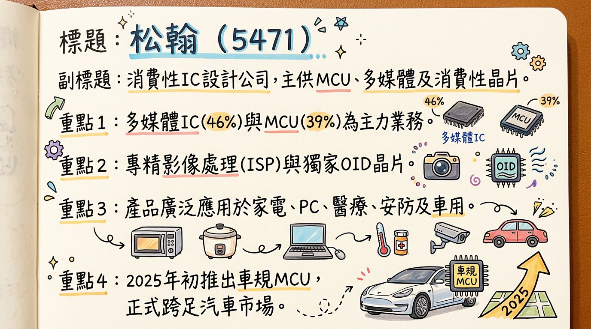
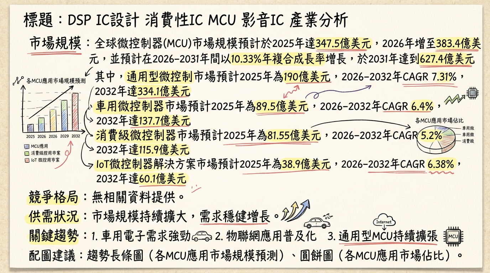
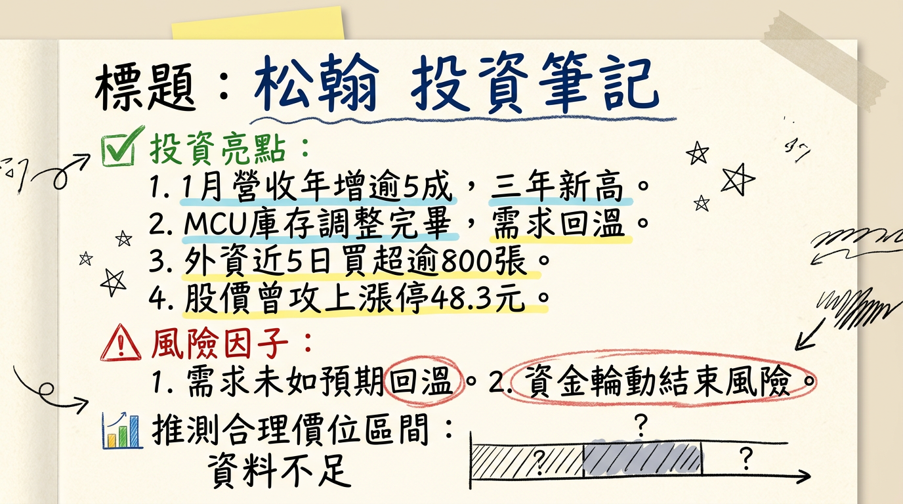

# 5471 松翰 深度研究報告

## 一句話摘要
松翰 (5471) 受惠於微控制器 (MCU) 產業庫存去化告一段落、中國廠商率先漲價的趨勢，以及積極佈局車用、個人醫療保健、電競與 AIoT 等利基型市場，2026 年 1 月營收創三年新高，營運已現谷底翻揚訊號；公司持續優化產品組合，有助於推升長期毛利率及獲利能力，評價可望獲得修復。

## 公司概覽
松翰科技 (5471) 是一家消費性 IC 設計公司，主要提供微控制器 (MCU)、多媒體 IC 及消費性 IC 等產品。

*   **微控制器 (MCU)**：應用於通用型產品（如小家電、遙控器、行動電源）、個人醫療保健產品（如血壓計、血糖機、額溫槍、血氧機的 SOC MCU），以及電腦周邊產品（如滑鼠、鍵盤、電競配件和 USB Type-C 充電器 IC）。值得注意的是，松翰於 2025 年初推出符合車規的 8 位元 MCU—SNA8F5762JG 系列，正式跨足汽車應用市場。
*   **多媒體 IC**：核心技術為影像處理 (ISP)，主要應用於筆記型電腦攝影機 (NB Camera)、外掛式網路攝影機 (Webcam)、門禁安防攝影機、高拍儀（文件掃描攝影機）及金融支付設備等。
*   **消費性 IC**：包含電子玩具與教育產品（如互動式電子玩具、STEM 教育產品），以及獨家專利產品 OID 晶片組（應用於兒童光學點讀筆）。

松翰採無廠 (Fabless) 模式運營，專注於晶片設計、研發與銷售，無自有製造基地。

**營收結構 (2025 年上半年)**

| 產品線       | 營收比重 (%) |
| :----------- | :----------- |
| 多媒體 IC    | 46           |
| 微控制器 (MCU) | 39           |
| 消費性 IC    | 14           |

## 核心競爭優勢
1.  **多元化產品組合與利基市場深耕**：產品涵蓋 MCU、多媒體 IC 及消費性 IC，應用廣泛，尤其在個人醫療保健 MCU (如 SOC MCU) 和 OID 晶片組 (光學點讀筆) 等特定利基市場具有穩固地位及獨家專利。
2.  **積極佈局高成長潛力市場**：2025 年初推出車規級 8 位元 MCU，成功切入車用電子市場；同時，在電競、USB Type-C PD 充電、AIoT 等高成長應用領域持續推出新產品並鎖定品牌客戶，以維持產品毛利與競爭力。
3.  **技術研發與 AI 整合潛力**：在影像產品方面，積極投入人體存在偵測 (HPD) 及 AI 相關技術，配合邊緣 AI 趨勢，有望提升其在智慧影像處理市場的競爭力。
4.  **優良的庫存管理能力**：2025 年上半年存貨週轉天數從去年同期的 188 天降至 164 天，顯示公司在供應鏈調整期能有效去化庫存，降低營運風險。

## 財務分析

### 月營收趨勢
**近 6 個月月營收表現 (單位：億元新台幣)**

| 月份    | 金額   | 月增率 MoM (%) | 年增率 YoY (%) |
| :------ | :----- | :------------- | :------------- |
| 2026/01 | 2.69   | 9.62           | 56.50          |
| 2025/12 | 2.45   | 9.69           | -5.49          |
| 2025/11 | 2.23   | 1.71           | -6.87          |
| 2025/10 | 2.20   | 7.48           | 1.06           |
| 2025/09 | 2.04   | -9.56          | -7.69          |
| 2025/08 | 2.26   | -1.43          | -4.06          |

*2026 年 1 月營收達新台幣 2.69 億元，年增率高達 56.5%，創三年來新高，反映公司營運觸底反彈的強勁訊號。*

### 季度數據
**2025 年度重要季度數據 (單位：億元新台幣，EPS：元)**

| 季度     | 季營收 | 季增率 QoQ (%) | 年增率 YoY (%) | 毛利率 (%) | 營業利益率 (%) | EPS    |
| :------- | :----- | :------------- | :------------- | :--------- | :------------- | :----- |
| 2025 Q3  | 6.5959 | -7.36          | -4.60          | 39.65      | 1.81           | 0.24   |
| 2025 Q2  | 7.12   | 16.00          | -2.00          | 43.00      | 9.02           | 0.03   |
| 2025 Q1  | 6.14   | -              | -              | 41.50      | 3.02           | 0.23   |
*備註：2025 Q1 營收數據為根據 H1 營收與 Q2 營收推算約值。*

*2025 年 Q3 儘管季營收略減，但毛利率維持在近 40%，且單季 EPS 達 0.24 元，較 Q2 的 0.03 元大幅反彈，顯示獲利能力顯著改善。*

### 年度趨勢
**年度營收與 EPS (單位：億元新台幣，EPS：元)**

| 年度   | 全年營收 | EPS  |
| :----- | :------- | :--- |
| 2024   | 27.44    | 1.07 |
| 2025   | 26.76    | 0.72 |

*2025 年全年營收較 2024 年略減 2.48%，EPS 也因匯損等因素下滑，但近期月營收數據已顯示營運轉折點。*

## 法說會重點
松翰科技於 2025 年 11 月 24 日參加元大證券線上法人說明會，並於 2025 年 8 月 21 日參加國泰證券法人座談會，重點歸納如下：

*   **產品應用多元化與高潛力市場佈局**：公司產品涵蓋醫療量測、電競、USB Type C PD 充電、無人機、AIOT 等具成長潛力的市場。
*   **產品組合優化**：SOC MCU (醫療量測應用) 和 USB MCU 在 MCU 產品組合中的比重上升 (2025 年 1-9 月 USB MCU 佔 31%，SOC MCU 佔 30%)，顯示公司產品在高價值或特定市場領域的競爭力提升，並持續在電競周邊及個人醫療保健等利基型 MCU 市場推出新產品，專注於品牌客戶以維持毛利。通用型 (GP MCU) 比重則持續下降 (2025 年 1-9 月降至 39%)。
*   **多媒體 IC 轉型**：多媒體 IC 作為公司最大產品類別，比重在 2025 年 1-9 月回升至 46%。非筆電影像視訊晶片比重從 2023 年的 21% 大幅增長至 2025 年 1-9 月的 39%，顯示公司在影像視訊晶片領域成功轉型並多元化發展，轉向 AIOT、安防、無人機等新興市場，並積極投入 HPD 與 AI 相關技術。
*   **庫存管理有成**：2025 年上半年存貨金額從 7.22 億元降至 6.71 億元，存貨週轉天數從去年同期的 188 天降至 164 天，顯示庫存去化成果顯著。
*   **2025 年 Q3 獲利強勁反彈**：第三季稅前淨利和本期淨利較去年同期大幅增長 77%，每股盈餘從 0.14 元上升至 0.24 元，顯示獲利能力顯著改善。然 2025 年上半年因第二季嚴重匯兌損失，稅後淨利大幅下滑至 4,368 萬元，年減 64%，EPS 為 0.26 元。
*   **未來展望 (管理層 guidance)**：儘管核心業務的營業收入和毛利率仍面臨壓力，但產品結構的優化有望逐步緩解。公司將持續依賴在高價值、高成長潛力應用領域的技術創新與市場拓展，以實現長期樂觀展望。
*   **產能利用率與資本支出**：法說會未明確揭露 2025-2026 年具體產能利用率或資本支出金額。

## 券商觀點
目前僅找到一份相對較舊的券商報告，2025-2026 年的最新券商目標價及 EPS 預估尚未更新。

**券商目標價**

| 券商名稱 | 目標價 (元) | 評等   | 日期         | 備註                                       |
| :------- | :---------- | :----- | :----------- | :----------------------------------------- |
| 宏遠證券 | 60          | (未給定) | 2024年5月17日 | 報告發布已逾一年，且預估 2024 年 EPS (2.25 元) 與實際 (1.07 元) 差異大，參考性較低。 |

*未發現 2025-2026 年松翰的重大評等調升或調降資訊。*

## 財報深度分析

### 利潤率趨勢
**近 8 季毛利率、營業利益率、稅後淨利率趨勢 (%)**

| 季度     | 毛利率 (%) | 營業利益率 (%) | 稅後淨利率 (%) |
| :------- | :----------: | :------------: | :----------: |
| 2025 Q3  | 39.65        | 1.81           | 6.18         |
| 2025 Q2  | 43.08        | 9.02           | 0.79         |
| 2025 Q1  | 41.50        | 3.02           | 6.18         |
| 2024 Q4  | 41.18        | 1.37           | 4.87         |
| 2024 Q3  | 40.62        | 2.18           | 3.34         |
| 2024 Q2  | 42.21        | 4.94           | 10.17        |
| 2024 Q1  | 42.50        | 4.05           | 7.76         |

*2024 年全年利潤率：毛利率 41.61%，營業利益率 3.11%，稅後淨利率 6.53%。*

**利潤率變化原因分析：**
*   **毛利率**：近八季毛利率大致維持在 39%~43% 之間，顯示公司在產品定價和成本控制方面具有一定的穩定性。2025 年 Q2 的 43.08% 為近期高點，Q3 略降至 39.65%。
*   **營業利益率**：2024 年營業利益較 2023 年下滑 46%，主要受到新產品開發與市場拓展的研發費用支出增加影響。2025 年 Q2 營業利益率回升至 9.02%，但在 Q3 再次回落至 1.81%，顯示其核心營運效率仍有波動。
*   **稅後淨利率**：2025 年 Q2 稅後淨利率顯著下降至 0.79%，主要受到業外匯兌損失的嚴重衝擊。然而，Q3 稅後淨利率強勁反彈至 6.18%，顯示業外因素影響減輕，公司獲利能力改善。
*   **產業循環**：MCU 產業庫存調整告一段落，需求回溫，以及公司積極將產品導入車用電子等高成長市場，都有助於提升長期利潤率結構。

### 存貨分析
松翰在 2025 年上半年展現出色的庫存管理能力，存貨金額從 7.22 億元降至 6.71 億元，存貨週轉天數也從去年同期的 188 天顯著下降至 164 天。這顯示公司有效去化了過剩庫存，為未來的訂單回補和營收增長奠定了良好基礎。目前 MCU 產業整體庫存水位偏低，預計需求將在 2025 年 Q2 開始回溫。

### 資本支出
目前搜尋結果未明確提供松翰近 3 年的具體資本支出金額與趨勢。然而，2024 年營業利益下滑的部分原因為公司投入新產品開發與市場拓展，導致研發費用支出較多，這可以視為對未來成長的策略性投資。

### 業外收支重大項目
2025 年 Q2 的稅後淨利銳減至 0.03 元，主要受到高達 -12% 的業外損失影響。然而，Q3 業外收支已回歸正向 (佔營收 5.86%)，顯示匯兌損失等業外因素已趨緩。

## 股權異動

*   **董監事/大股東申報轉讓**：未找到 2024-2026 年的最新資料。
*   **庫藏股買回紀錄**：未找到 2024-2026 年的庫藏股買回紀錄。
*   **可轉換公司債 (CB)**：未找到 2024-2026 年的最新資料。
*   **增減資計畫**：未找到 2024-2026 年的最新資料。
*   **股利政策**：
    *   2025 年 (114 年度) 股東常會預計於 2025 年 6 月 19 日召開。
    *   2025 年除息：每股配發現金股利新台幣 **1.0 元**。除息交易日為 7 月 16 日，股利發放日為 8 月 8 日。
    *   2024 年：現金股利 **2.4 元**。

## 產業分析

### 市場規模與成長率
**微控制器 (MCU) 市場 (單位：億美元，CAGR：年複合成長率)**

| 細分市場      | 2025 年市場規模 | 2026 年市場規模 | 2026-2031/32 年 CAGR (%) | 2031/32 年市場規模 |
| :------------ | :-------------- | :-------------- | :----------------------- | :----------------- |
| 全球 MCU      | 347.5           | 383.4           | 10.33                    | 627.4              |
| 通用型 MCU    | 190             | -               | 7.31                     | 334.1              |
| 消費級 MCU    | 81.55           | -               | 5.2                      | 115.9              |
| 車用 MCU      | 89.5            | 94.98           | 6.4                      | 137.7              |
| IoT MCU 解決方案 | 38.9            | 40.7            | 6.38                     | 60.1               |

**影像處理晶片 (ISP) 市場 (單位：億美元，CAGR：年複合成長率)**

| 細分市場     | 2024 年市場規模 | 2025 年市場規模 | 2025-2031 年 CAGR (%) | 2031 年市場規模 |
| :----------- | :-------------- | :-------------- | :-------------------- | :-------------- |
| 獨立型 ISP   | 6.89            | -               | 5.8                   | 10.22           |
| 全球 ISP     | -               | 86              | -                     | -               |

**消費性 IC (電子玩具) 市場 (單位：億美元，CAGR：年複合成長率)**

| 細分市場 | 2025 年市場估值 | 2026-2034 年 CAGR (%) | 2034 年市場規模 |
| :------- | :-------------- | :-------------------- | :-------------- |
| 全球玩具 | 1210            | 5.98                  | 2075            |

### 供需狀況與產業毛利率
*   **MCU**：過去兩年因中國廠商低價競爭陷入低潮，庫存壓力沉重。然而，2026 年初市場出現轉機，中國業者已率先宣布漲價 15% 至 50%，顯示價格戰難以維繼。隨著電動車、物聯網 (IoT) 與邊緣 AI 需求的成長，MCU 市場有望回溫。整體 MCU 產業庫存水位偏低，市場需求預計在 2025 年第二季開始回溫。
*   **半導體產業整體**：成熟製程產能利用率預計在 2026 年將穩定維持在 80% 以上，中國晶圓廠受惠於國產替代政策與訂單回流，產能利用率預期將保持在 90% 以上。
*   **ISP 晶片**：2025 年第二季度晶圓廠產能利用率回落至 82%，部分代工廠將 ISP 晶片報價上調 10% 至 15%，顯示供應鏈存在一定波動及成本壓力。
*   **產業平均毛利率**：2024 年消費級 MCU 平均單價約 0.72 美元，毛利率約 32%。台灣 MCU 概念股中，盛群毛利率約 38.7% (2025 Q2)，松翰毛利率約 40%。

### 競爭格局

**全球前 5 大 MCU 供應商及其市佔率**
全球 MCU 市場高度集中，意法半導體 (STMicroelectronics)、微芯科技 (Microchip)、恩智浦 (NXP)、瑞薩電子 (Renesas)、英飛凌 (Infineon) 及德州儀器 (TI) 等前六大供應商，共佔據全球超過 80% 的市場份額。這些巨頭主要專注於汽車、工業與醫療等高階、高利潤的應用領域。

**全球前 5 大 ISP 晶片供應商市佔率**
2025 年全球前五大供應商的市佔率合計達到 71%。

**松翰 (5471) vs 主要競爭對手的具體比較**

| 比較項目     | 松翰 (5471)                                  | 國際大廠 (NXP, Renesas 等)                 | 台灣同業 (新唐、盛群)                   | 中國廠商                                   |
| :----------- | :------------------------------------------- | :----------------------------------------- | :-------------------------------------- | :----------------------------------------- |
| **產品定位** | 多元化，利基型 MCU (醫療、電競)、PC 周邊、多媒體 ISP (NB、安防)、消費性 IC (玩具、OID) | 高階 MCU (車用、工控、醫療)、廣泛類比半導體 | 車用、工控為主，部分通用型 MCU          | 中低階通用型 MCU 為主                      |
| **技術方向** | 8 位元車規 MCU、AIoT 整合、HPD 與 AI 影像技術 | 先進製程、多核心、功能安全、高運算力       | 32 位元 MCU、車規驗證、智慧座艙方案     | 成本效益、快速上市                         |
| **競爭策略** | 差異化競爭、鎖定品牌客戶、深耕特定應用、跨足車用利基市場 | 技術領導、生態系建立、標準制定           | 聚焦高價值車用/工控、技術升級           | 低價競爭、快速複製、搶佔市場份額           |
| **優勢**     | OID 獨家專利、醫療 MCU 穩定、新切入車用市場 | 技術壁壘高、客戶基礎穩固、完整解決方案   | 產品線廣泛、部分車用/工控客戶基礎       | 價格競爭力、本土供應鏈優勢                 |
| **挑戰**     | 8 位元車規 MCU 競爭、32 位元 MCU 布局、國際大廠與中國廠商雙重競爭 | 研發投入高、市場競爭激烈                   | 市場規模與技術深度較國際大廠仍有差距    | 產品同質化、毛利率壓力                     |

**台灣同業比較 (2024 年全年與 2025 年部分季度)**

| 公司／代號   | 主要業務                                   | 2024年全年營收 (億元新台幣) | 2024年EPS (元新台幣) | 2025年Q3營收 (億元新台幣) | 2025年Q3年增率 (%) | 最新毛利率 (%)    |
| :----------- | :----------------------------------------- | :-------------------------- | :------------------- | :------------------------ | :----------------- | :---------------- |
| **松翰 (5471)** | 半導體IC/MCU設計與封裝                     | 27.44                       | 1.07                 | 6.5959                    | -4.60              | 39.65 (2025 Q3)   |
| 盛群 (6202)  | MCU為主，打入Hyundai車用供應鏈             | 30.08                       | 1.40                 | 7.39                      | -2.25              | 38.7 (2025 Q2)    |
| 新唐 (4919)  | 車用與工控為主，電腦應用、通訊與消費性應用 | 425.21                      | 1.13                 | 104.97                    | -11.97             | 38.9 (2025 Q3)    |
| 義隆 (2458)  | 嵌入式MCU/動態控制IC、AI應用等             | 126.96                      | 9.16                 | 31.95                     | 2.37               | 44.9 (2025 Q3)    |
| 凌陽 (2401)  | MCU/AI智慧語音晶片                         | 64.34                       | 0.44                 | 17.55                     | -2.33              | 39.8 (2025 Q3)    |
| 偉詮電 (2436) | MCU周邊、伺服器與遊戲機用IC設計            | 30.95                       | 1.57                 | 8.97                      | 8.48               | 36.3 (2025 Q3)    |

*註：部分公司 2025 年 Q3 營收為簡化資料，可能與實際公告有小幅誤差，請以公司正式財報為準。盛群 2025 年 Q2 合併營收為 8.6 億元，季增 13%；上半年累計 16.2 億元，年增 43.9%。新唐 2025 年受車用需求復甦緩慢、日本子公司產能利用率偏低及匯率影響，營運承壓。*

### 產業趨勢
1.  **物聯網 (IoT) 普及與低功耗需求**：
    *   **趨勢**：2030 年連接的 IoT 終端預計將超過 200 億個，推動 MCU 需具備多協議無線、高效處理器、低功耗、高連接性及安全性。
    *   **影響**：促使 MCU 供應商開發更低功耗、高整合度且具備硬體安全功能的產品，滿足智慧家庭、穿戴裝置、工業自動化等 IoT 應用。
2.  **汽車電子化與先進駕駛輔助系統 (ADAS)**：
    *   **趨勢**：電動車半導體含量大幅增加，單輛車可搭載多達 3000 個半導體元件，MCU 佔比相較燃油車高四倍。ADAS 發展推動車用 ISP 晶片需求，軟體定義汽車 (SDV) 促使車輛架構集中化。
    *   **影響**：對車規級 MCU 需求持續成長，特別在功能安全、高運算能力和即時處理方面。ISP 晶片在 ADAS 和 DMS 中的重要性日益提升，要求更高性能和可靠性。
3.  **邊緣 AI (Edge AI) 崛起**：
    *   **趨勢**：邊緣 AI 晶片市場成長顯著，預計 2026 年規模將達到 44.4 億美元，年複合成長率高達 21%。AI-ISP 融合架構成為主流，提升動態範圍和低光照處理能力。
    *   **影響**：推動 MCU 和 ISP 晶片整合 AI 加速功能，實現裝置端的即時分析和決策，應用於智慧醫療、智慧影像監控、智慧家電等，提升產品智能化水準。

### 對 松翰 而言的具體機會和威脅
*   **機會**：
    *   **車用 MCU 市場擴張**：2025 年初推出車規級 8 位元 MCU，精準切入電動車對車內空調、車窗等基礎控制功能 MCU 需求增長的趨勢，開闢新成長空間。
    *   **個人醫療保健與 IoT 應用深化**：深耕個人醫療保健 MCU 領域，隨著 IoT 技術與健康意識提升，SOC MCU 產品線有望持續受惠。
    *   **多媒體 IC 的 AI 整合**：松翰的 ISP 晶片若能有效整合邊緣 AI 功能 (如 HPD)，將提升其在智慧影像處理市場的競爭力，抓住邊緣 AI 晶片市場 21% 的年複合成長率。
*   **威脅**：
    *   **競爭加劇與價格壓力**：中低階 MCU 市場仍面臨中國廠商的激烈競爭，儘管近期有漲價跡象，但市場壓力猶存。
    *   **技術升級的挑戰**：32 位元 MCU 逐漸成為高階應用主流，SoC 晶片整合 ISP 功能，可能對松翰以 8 位元 MCU 和獨立 ISP 晶片為主的產品線構成技術升級壓力。
    *   **供應鏈不確定性**：全球半導體供應鏈波動、晶圓廠產能利用率及報價調整，可能影響成本和出貨穩定性。

### 相關投資題材的具體連結
*   **電動車 (EV)**：2025 年初推出車規級 8 位元 MCU，與電動車電子化趨勢直接連結，受惠於每輛車半導體含量增加。
*   **AI (人工智慧)**：
    *   **邊緣 AI**：MCU 和多媒體 IC 具整合邊緣 AI 應用的潛力，應用於智慧醫療、智慧監控、智慧家電等，抓住邊緣 AI 晶片市場的快速成長。
    *   **AI 智慧眼鏡**：間接受益於 AI 智慧眼鏡對低功耗運算晶片和感測器/鏡頭模組的需求。
*   **物聯網 (IoT)**：松翰通用型 MCU 和個人醫療保健 MCU 的核心應用，受益於 IoT 設備普及對高連接性、低功耗 MCU 的持續需求。

## 近期催化劑

### 利多事件
*   **2026/03/02**：盤中股價攻上漲停 48.3 元，市場預期 MCU 庫存調整告一段落，需求回溫。
*   **2026/02/08**：公告 2026 年 1 月營收為新台幣 2.69 億元，月增 9.62%，年增 56.5%，創近 43 個月以來新高，強化市場對營運反轉與評價修復的預期。
*   **2026/01/28**：被市場視為額溫槍/醫療級 MCU 指標大廠，獲利基礎紮實。
*   **22025/11/24**：法說會強調產品應用多元化與高潛力市場佈局，且 2025 年 Q3 獲利能力強勁反彈，稅前淨利與本期淨利同比大幅增長 77%，EPS 從 0.14 元上升至 0.24 元。
*   **2025 年初**：推出首款符合車規的 8 位元 MCU—SNA8F5762JG 系列，正式跨足汽車應用市場。
*   **庫存去化有成**：2025 年上半年存貨週轉天數從 188 天降至 164 天，存貨金額從 7.22 億元降至 6.71 億元。

### 利空事件/風險
*   **2025 年 Q2 嚴重匯兌損失**：上半年稅後淨利大幅下滑至 4,368 萬元，年減 64%，EPS 為 0.26 元。
*   **核心業務成長動能仍需觀察**：2025 年 Q3 營業收入和營業淨利環比下滑，顯示核心業務成長動能仍面臨壓力。
*   **中國大陸房市低迷影響**：通用型 MCU 業務受中國大陸房市影響小家電需求而略有下滑。
*   **股價急漲後的評價風險**：短期股價漲幅較大，追價風險需留意。

## ⭐ 成長動能時間軸

| 時間           | 成長動能                                     | 具體內容                                                                                                                                                                                                                                                            |
| :------------- | :------------------------------------------- | :------------------------------------------------------------------------------------------------------------------------------------------------------------------------------------------------------------------------------------------------------------------ |
| **2025 年初**  | **新市場拓展：車用 MCU**                     | 松翰推出首款符合車規的 8 位元 MCU—SNA8F5762JG 系列，通過 AEC-Q100 Grade 1 認證，可應用於電動座椅、車燈、雨刷控制等車載場景，正式跨足汽車應用市場。                                                                                                                    |
| **2025 年 H1** | **庫存去化與營運效率改善**                   | 存貨週轉天數從去年同期的 188 天降至 164 天；存貨金額從 7.22 億元降至 6.71 億元。                                                                                                                                                                                   |
| **2025 年 1-9 月** | **產品組合優化與高價值市場聚焦**             | SOC MCU (醫療量測應用) 比重穩定增長至 30%；USB MCU (電腦周邊、電競、USB Type C PD) 比重增長至 31%；非筆電影像視訊晶片比重從 2023 年的 21% 大幅增長至 39%，顯示轉型至 AIOT、安防、無人機等新興市場成功。消費性 IC 比重從 2023 年 12% 上升至 15%。 |
| **2025 年 Q3** | **獲利能力強勁反彈**                         | 稅前淨利與本期淨利同比大幅增長 77%；EPS 從 Q2 的 0.03 元回升至 0.24 元。                                                                                                                                                                                            |
| **2026 年初**  | **MCU 產業回溫與價格機制改善**               | MCU 庫存調整告一段落，市場預期需求回溫。中國 MCU 廠商率先宣布漲價 15% 至 50%，緩解過去低價競爭對台廠傷害。                                                                                                                                                                  |
| **2026 年 1 月** | **營收表現強勁，營運拐點確立**               | 月營收達新台幣 2.69 億元，月增 9.62%，年增 56.5%，創三年來新高。                                                                                                                                                                                                    |
| **持續進行中 / 未來** | **新客戶/新市場拓展與技術升級**              | 持續在電競周邊及個人醫療保健等利基型 MCU 市場推出新產品，專注品牌客戶。多媒體影像晶片積極投入 HPD 與 AI 相關技術，拓展安防、門禁等新應用。AIoT、無人機等具成長潛力市場的應用深化。USB Type-C 充電器 IC 鎖定品牌客戶。                                          |
| **長期潛力**   | **AI 發展帶動 MCU 需求與產品線深化**         | 隨著 AI 從雲端發展到地端，具備邊緣運算能力的 MCU 需求將增加。OID 晶片組在兒童光學點讀筆市場有穩固客戶基礎，持續貢獻穩定營收。                                                                                                                                                           |
| **未明確資訊** | **擴廠計畫、資本支出增加、新產能上線時程**   | 目前未有明確的 2026 年擴廠計畫、新廠地點、投資金額、預計完工/量產時間、資本支出增加的具體原因及預計帶來的產能增幅。                                                                                                                                                            |

## 2026 展望

### 成長動能
1.  **MCU 產業復甦與庫存回補**：2026 年 1 月營收年增逾五成，創三年新高，加上中國 MCU 廠商漲價，顯示產業谷底已過，庫存調整結束，需求將持續回溫。
2.  **利基型市場拓展成果顯現**：車用 8 位元 MCU 的推出，搭配在個人醫療保健、電競周邊及 USB Type-C PD 充電等高價值利基市場的新產品開發與品牌客戶策略，有望提升產品平均售價與毛利率。
3.  **多媒體 IC 轉型與 AI 整合**：在鞏固 NB Camera 市場領導地位的同時，積極投入 HPD 與 AI 相關技術，拓展安防、門禁及 AIoT 等非筆電應用，將受益於邊緣 AI 的快速發展。
4.  **產品組合優化持續**：透過減少對通用型 MCU 的依賴，並持續提升 SOC MCU、USB MCU 及非筆電多媒體應用的比重，有助於優化營收結構，提升整體獲利能力。

### 風險
1.  **全球經濟與匯率波動**：全球經濟放緩或地緣政治不確定性可能影響終端需求；匯率波動，尤其是美元走勢，可能再度造成匯兌損失，影響獲利。
2.  **市場競爭加劇**：儘管 MCU 價格戰趨緩，但 IC 設計產業競爭激烈，新技術的快速演進和競爭對手的動態仍可能對市場份額和利潤空間造成壓力。
3.  **車用市場滲透速度**：車用電子市場驗證週期長且供應鏈封閉，松翰 8 位元車規 MCU 的實際出貨量和客戶認可速度，將影響其在該領域的成長貢獻。
4.  **評價修正風險**：近期股價因營收利多而急漲，若未來營收或獲利成長不如預期，可能面臨股價回檔壓力。

## 投資結論
松翰 (5471) 經歷產業逆風與庫存調整後，其營運已於 2026 年初展現明確的轉機訊號。我們認為松翰具有以下投資價值：

1.  **營運拐點確立，基本面逐步改善**：2026 年 1 月營收年增 56.5% 創三年新高，是強烈的正向訊號。MCU 產業庫存回補與中國廠商漲價，有利於緩解價格壓力，為公司營運復甦奠定基礎。
2.  **產品組合優化，鎖定高成長利基市場**：公司積極將產品重心轉向車用 MCU、個人醫療保健、電競及 AIoT 等高成長、高毛利的利基市場，並專注品牌客戶，將有助於提升長期毛利率與獲利穩定性。
3.  **技術投資與 AI 應用潛力**：在多媒體 IC 領域投入 HPD 與 AI 技術，符合邊緣 AI 趨勢，未來有望在智慧影像處理市場取得先機。
4.  **財務體質趨穩，庫存去化成效顯著**：2025 年 Q3 獲利強勁反彈，且庫存週轉天數大幅改善，顯示公司在逆境中仍能有效管理成本與存貨，為未來的成長做好準備。

綜合考量松翰的營運轉折、產品結構優化及在多個高成長市場的佈局，儘管 2026 年具體 EPS 預估尚未明朗，但假設其營運復甦態勢持續，2026 年 EPS 有望超越 2025 年的 0.72 元，並逐步回到 2.0-2.5 元的水平。給予其恢復期較高的本益比區間，建議投資人可關注松翰在 **50 元至 65 元** 區間的投資機會。

---
本報告由 AI 自動產生，資料來源為公開網路資訊，僅供參考，不構成投資建議。產生時間：2026-03-06 12:59

---

## 📊 資訊卡

