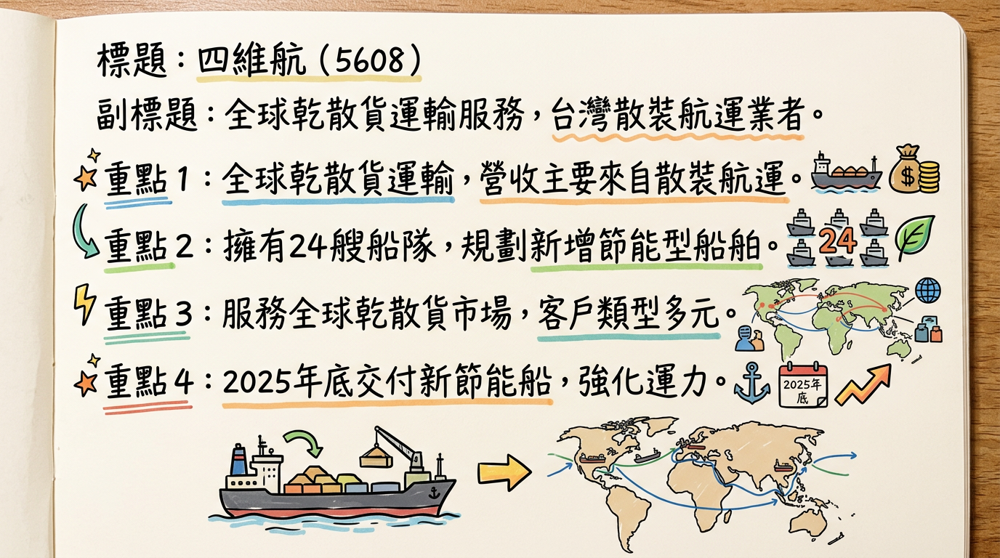
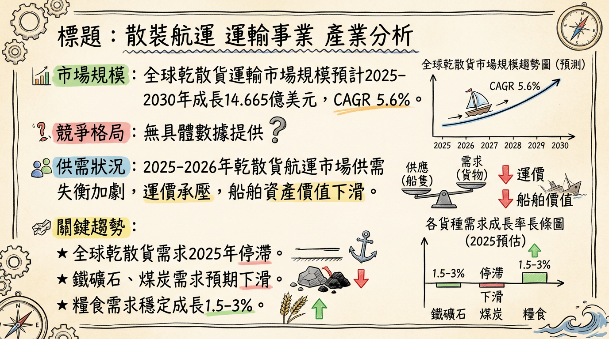
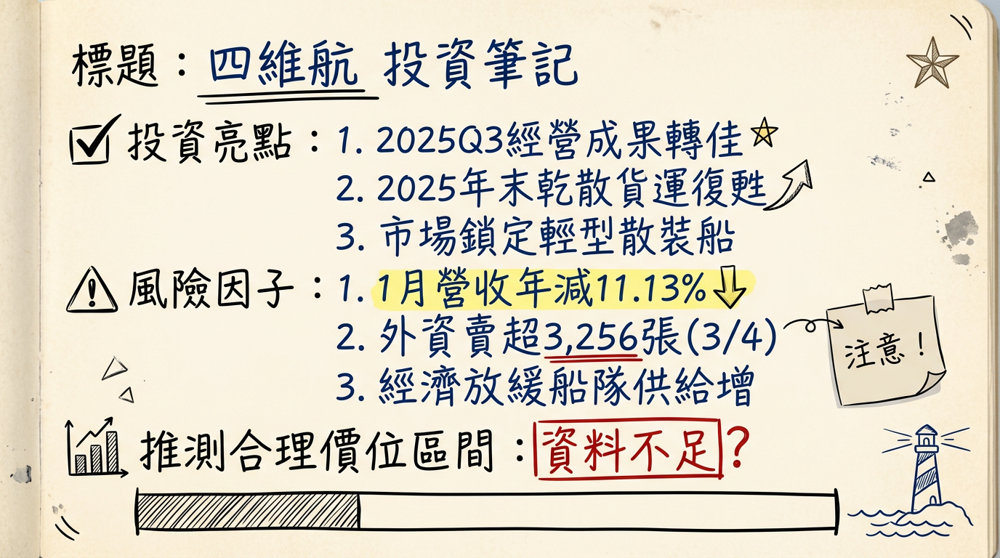

# 5608 四維航 深度研究報告

## 一句話摘要
四維航（5608）在2025年上半年成功轉虧為盈，受惠於船隊汰舊換新策略及散裝航運市場短期回溫。展望2026年，雖然預計有兩艘UltraMax節能船交付將提升營運效率與運力，且特定貨種如穀物、電動車相關礦砂及烏克蘭重建需求有望提供支撐，但全球經濟成長放緩與新船大量交付導致的運力過剩壓力，仍是其長期獲利能力面臨的主要挑戰。

## 公司概覽
四維航業（5608）為台灣的散裝航運業者，核心業務為全球乾散貨運輸，服務範圍涵蓋全球市場。公司船隊主要經營輕便型（Handy）、Supramax/Ultramax 型及巴拿馬極限型（Panamax/Kamsarmax）船舶。

**產品線與營收結構**
公司營收主要來自乾散貨運輸服務。目前的公開資訊並未提供四維航各業務（如船舶運送、船務代理、船舶及其零件批發零售）具體的營收佔比數據，但散裝航運業務是其核心收入來源。

**船隊概況（取代製造基地概念）**
作為航運公司，四維航的「基地」主要體現在其船隊規模與運力。
*   截至2025年9月，四維航擁有24艘船隊，包括16艘輕便型船、5艘Supramax/Ultramax型船（其中3艘為節能船）以及3艘Panamax/Kamsarmax型船（亦為節能船）。
*   公司已處分2艘舊船，並計畫於**2025年12月**交付一艘63,000噸級UltraMax節能船，預計在**2026年第三季**再交付另一艘同型節能船，以持續優化船隊結構，提升運力並符合環保法規。

## 核心競爭優勢
*   **船隊年輕化與節能佈局：** 四維航積極汰舊換新，引進多艘節能型UltraMax船舶，不僅降低燃油成本，提升營運效率，也符合全球日趨嚴格的環保法規趨勢，有望在市場上取得競爭優勢。
*   **船型配置具彈性：** 公司船隊涵蓋輕便型至巴拿馬極限型，使其能承運多種貨物並服務不同航線，對市場變化具有一定程度的適應性。
*   **財務策略奏效：** 透過降低美元負債比例及受惠美國降息，有效減少利息支出，改善財務結構，使其在市場波動中維持一定的財務韌性。

## 財務分析

### 月營收趨勢
| 月份   | 金額 (新台幣億元) | 月增率 (MoM) | 年增率 (YoY) |
| :----- | :---------------- | :----------- | :----------- |
| 2026年01月 | 2.62              | -8.12%       | -11.13%      |
| 2025年12月 | 2.85              | +0.26%       | -8.00%       |
| 2025年11月 | 2.84              | -1.70%       | -9.69%       |
| 2025年10月 | 2.89              | +12.14%      | -5.23%       |
| 2025年09月 | 2.58              | -3.53%       | -17.43%      |
| 2025年08月 | 2.67              | +6.41%       | -13.98%      |

### 季度數據
| 項目         | 2025年Q3 |
| :----------- | :------- |
| 季營收       | 未提供   |
| 營業毛利率   | 11.09%   |
| 營業利益率   | 1.59%    |
| EPS (新台幣) | -0.23元  |

**備註：** 2025年第四季財務報告董事會預計於2026年3月10日召開，因此截至2026年3月6日，2025年第四季的季營收、毛利率、營業利益率及EPS尚未正式公布。

### 年度趨勢
*   **2024年實際全年EPS:** -0.69元
*   **2024年實際全年稅後淨損:** 2.69億元
*   **2025年實際全年營收:** 31.84億元
*   **2025年預估全年EPS:** 未找到具體數字。
*   **2026年預估全年EPS:** 未找到具體數字。

## 法說會重點
**最近一次法說會日期：** 2025年12月24日。

**管理層具體 guidance 和發言：**
*   **船隊更新：** 2025年已處分2艘舊船，並於2025年12月交付一艘63,000噸級UltraMax節能船，預計在2026年第三季再交付另一艘同型節能船。新船的加入將有助於提升運力與營收，並符合環保法規趨勢。
*   **乾散貨市場復甦：** 2025年末乾散貨市場表現強勁，波羅的海乾散貨指數（BDI）走勢強勁。
*   **供需展望：** 預計2025年乾散貨需求增長0.5%至1.5%，船舶供給運力預估增長3%。管理層指出，CII船舶減速限制、法規日益嚴格、老舊船舶拆解量增加以及新船價格高漲、船席空間不足，導致新船交付數量有限，短期內新船價格看不到降價空間。
*   **全球經濟：** 國際貨幣基金組織（IMF）預測2025年全球經濟成長率將從2.8%上修至3.0%，2026年進一步上修至3.1%。
*   **短期趨勢（未來1-2季）：** 管理層判斷為利多，受惠於BDI指數強勁回升，乾散貨運市場短期內可能維持高檔運價，這將有利於四維航的即期（spot）市場營收和獲利表現。公司2025年Q3的財務改善趨勢預計能延續。
*   **長期趨勢（2026年以後）：** 管理層判斷為中性偏利空，全球GDP增速放緩以及新船交付量預計在2026年顯著增加，可能導致運力過剩，進而對乾散貨運價形成下行壓力。

## 券商觀點
**目前未找到2024年以後有券商發布對四維航（5608）的具體目標價或評等報告。**

| 券商名稱 | 目標價 (新台幣) | 評等 | 日期 |
| :------- | :-------------- | :--- | :--- |
| **無相關資料** | **無相關資料**  | **無相關資料** | **無相關資料** |

## 財報深度分析

### 利潤率趨勢
| 季度     | 營業毛利率 | 營業利益率 | 稅後淨利率 |
| :------- | :--------- | :--------- | :--------- |
| 2025年Q3 | 11.09%     | 1.59%      | -15.01%    |
| 2025年Q2 | 2.31%      | -7.31%     | 28.94%     |
| 2025年Q1 | -5.22%     | -14.49%    | -27.07%    |
| 2024年Q4 | 12.94%     | 5.06%      | -20.90%    |
| 2024年Q3 | 14.34%     | 6.02%      | 5.37%      |
| 2024年Q2 | 7.98%      | -0.64%     | -1.32%     |
| 2024年Q1 | -1.24%     | -10.44%    | -31.89%    |

**利潤率變化的原因分析：**
*   **2025年上半年轉虧為盈：** 2025年Q2因各型船運價回升，帶動單季歸屬母公司淨利達到2.17億元，EPS 0.56元，成功轉虧為盈。儘管營收略微下降，但公司透過降低美元負債比例，使利息支出減少約6,700萬元，並受惠於美國降息0.5%，降低了融資成本。然而，2025年上半年受台幣升值影響，產生超過10.4億元的匯率減損，嚴重侵蝕獲利。
*   **2024年全年虧損：** 2024年全年稅後淨損2.69億元，EPS -0.69元。儘管第三季曾轉盈，但第四季運價回檔影響獲利，導致全年虧損擴大。

### 資本支出
*   **近3年資本支出金額（單位：千元）：**
    *   2025年Q3：-104,941
    *   2025年Q2：-77,255
    *   2025年Q1：-68,147
    *   2024年Q4：-169,482
*   **未來資本支出計畫與預計新增產能：**
    *   已於**2025年12月**交付一艘63,000噸級UltraMax節能船。
    *   預計於**2026年第三季**再交付另一艘同型節能船。
    *   新增節能船舶旨在提升運營效率，符合低碳運輸需求，預期為未來營運帶來正面影響。

### 折舊攤銷趨勢
*   **折舊（單位：千元）：**
    *   2025年Q3：313,135
    *   2025年Q2：306,611
    *   2025年Q1：337,495
    *   2024年Q4：339,139
*   **攤銷（單位：千元）：**
    *   2025年Q3：357
    *   2025年Q2：335
    *   2025年Q1：272
    *   2024年Q4：0

### 存貨分析
目前未找到2024-2026年的最新存貨金額、存貨週轉天數、應收帳款週轉天數以及存貨異常堆積或備料現象的相關資料。

## 股權異動
*   **董監事/大股東申報轉讓紀錄：** 查無2024-2026年的相關資料。
*   **庫藏股買回紀錄：** 未找到2024-2026年的最新庫藏股買回紀錄。
*   **可轉換公司債 (CB)：**
    *   發行「國內第七次有擔保轉換公司債」（股票代號：56086）。
    *   發行日：2023年06月21日，到期日：2026年06月21日。
    *   轉換價格：每股新台幣**19.30元**（訂定基準日：2024年11月27日，轉換溢價率103.21%）。
    *   截至2026年3月2日，該可轉債收盤價為101.5元，轉換價值為81.0，轉換溢價率為25.3%。
*   **增減資計畫：** 未找到2024-2026年的最新現金增資或減資計畫。
*   **股利政策：**
    *   **2024年：** 現金股利0元，股票股利0元。因2024年虧損且考量船舶擴充計畫，股東會通過不配發股利。
    *   **2023年：** 現金股利0元，股票股利0元。
    *   **2022年：** 現金股利1.5元。

## 產業分析

### 市場規模與成長率
全球乾散貨運輸市場規模預計將在2025年至2030年間成長**14.665億美元**，複合年成長率（CAGR）為**5.6%**。

### 供需狀況
2025年至2026年乾散貨航運市場整體面臨供需失衡加劇的挑戰，運價承受壓力。

*   **需求面：**
    *   BIMCO在2025年4月預計2025年全球乾散貨運輸需求將陷入停滯，2026年僅實現**1-2%**的溫和成長，此預測已較先前下調。
    *   鐵礦石：2025-2026年預計維持零成長。
    *   煤炭：2025年下滑2-3%，2026年下滑1-2%。
    *   糧食：唯一預計穩定成長的主力貨種，2025年成長1.5-2.5%，2026年成長2-3%。
    *   次要乾散貨：2025年成長1-2%，但美中關稅可能影響運輸量。
    *   Drewry分析師在2026年1月看好鋁土礦（預計成長8.6%）、南美大豆出口和印度煉焦煤進口需求。
    *   BIMCO在2026年2月上調2026年船舶需求預期0.5個百分點至**2-3%**，平均航距預計每年延長0.5-1.5%。
*   **供給面：**
    *   BIMCO預計船隊在2025年和2026年分別成長約2.8%和2.9%。
    *   船舶拆解量：預計從2024年的4.7百萬載重噸（DWT）增至2025年的6.6百萬DWT，2026年達9.7百萬DWT。
    *   新船交付：2026年市場面臨最大結構性壓力，預計全年將有超過**600艘**乾散貨新船交付，創十餘年來新高，且集中於中型船型。BIMCO預計2026年乾散貨船運力成長2.5%。
*   **BDI指數展望：**
    *   2025年Q1 BDI同比下滑36%。2025年全年均數為1681點（年減4%），但Q4指數回升至2159點（年增47%）。
    *   展望2026年，Drewry預計海岬型船、巴拿馬型船、超靈便型船和靈便型船的期租1年租金都將高於2025年。

### 產業平均毛利率水準
未找到2024年以後散裝航運產業的具體平均毛利率水準。然而，個別公司如正德（2641）在2025年12月指出，其新加入營運的船舶簽訂5至10年長約，毛利率均達40%以上。

### 競爭格局
**全球前 5 大散裝貨運企業 (按總運力)**
| 排名 | 企業/集團            | 總部位置 | 船舶總數 | 總運力（million DWT） |
| :--- | :------------------- | :------- | :------- | :-------------------- |
| 1    | 中國遠洋集團         | 中國     | 400      | 37.6                  |
| 2    | NYK Group            | 日本     | 207      | 23                    |
| 3    | “K” Line             | 日本     | 180      | 22.8                  |
| 4    | Berge Bulk           | 新加坡   | 90       | 15.3                  |
| 5    | Navios Maritime Holdings | 希臘     | 142      | 14.6                  |

### 台灣同業比較
| 公司名稱 | 股票代號 | 主要船型及船隊特色 | 船隊規模 | 2025年營收/獲利概況 | 2025年EPS概況 | 2026年展望/特色 |
| :------- | :------- | :----------------- | :------- | :------------------ | :------------ | :--------------------------------------------------------------------------------------------------------------------------------------------------------------------------------------------------------------------------------------------------------------------------------------------------------------------------------------------------------------------------------------------------------------------------------------------------------------------------------------------------------------------------------------------------------------------------------------------------------------------------------------------------------------------------------------------------------------------------------------------------------------------------------------------------------------------------------------------------------------------------------------------------------------------------------------------------------------------------------------------------------------------------------------------------------------------------------------------------------------------------------------------------------------------------------------------------------------------------------------------------------------------------------------------------------------------------------------------------------------------------------------------------------------------------------------------------------------------------------------------------------------------------------------------------------------------------------------------------------------------------------------------------------------------------------------------------------------------------------------------------------------------------------------------------------------------------------------------------------------------------------------------------------------------------------------------------------------------------------------------------------------------------------------------------------------------------------------------------------------------------------------------------------------------------------------------------------------------------------------------------------------------------------------------------------------------------------------------------------------------------------------------------------------------------------------------------------------------------------------------------------------------------------------------------------------------------------------------------------------------------------------------------------------------------------------------------------------------------------------------------------------------------------------------------------------------------------------------------------------------------------------------------------------------------------------------------------------------------------------------------------------------------------------------------------------------------------------------------------------------------------------------------------------------------------------------------------------------------------------------------------------------------------------------------------------------------------------------------------------------------------------------------------------------------------------------------------------------------------------------------------------------------------------------------------------------------------------------------------------------------------------------------------------------------------------------------------------------------------------------------------------------------------------------------------------------------------------------------------------------------------------------------------------------------------------------------------------------------------------------------------------------------------------------------------------------------------------------------------------------------------------------------------------------------------------------------------------------------------------------------------------------------------------------------------------------------------------------------------------------------------------------------------------------------------------------------------------------------------------------------------------------------------------------------------------------------------------------------------------------------------------------------------------------------------------------------------------------------------------------------------------------------------------------------------------------------------------------------------------------------------------------------------------------------------------------------------------------------------------------------------------------------------------------------------------------------------------------------------------------------------------------------------------------------------------------------------------------------------------------------------------------------------------------------------------------------------------------------------------------------------------------------------------------------------------------------------------------------------------------------------------------------------------------------------------------------------------------------------------------------------------------------------------------------------------------------------------------------------------------------------------------------------------------------------------------------------------------------------------------------------------------------------------------------------------------------------------------------------------------------------------------------------------------------------------------------------------------------------------------------------------------------------------------------------------------------------------------------------------------------------------------------------------------------------------------------------------------------------------------------------------------------------------------------------------------------------------------------------------------------------------------------------------------------------------------------------------------------------------------------------------------------------------------------------------------------------------------------------------------------------------------------------------------------------------------------------------------------------------------------------------------------------------------------------------------------------------------------------------------------------------------------------------------------------------------------------------------------------------------------------------------------------------------------------------------------------------------------------------------------------------------------------------------------------------------------------------------------------------------------------------------------------------------------------------------------------------------------------------------------------------------------------------------------------------------------------------------------------------------------------------------------------------------------------------------------------------------------------------------------------------------------------------------------------------------------------------------------------------------------------------------------------------------------------------------------------------------------------------------------------------------------------------------------------------------------------------------------------------------------------------------------------------------------------------------------------------------------------------------------------------------------------------------------------------------------------------------------------------------------------------------------------------------------------------------------------------------------------------------------------------------------------------------------------------------------------------------------------------------------------------------------------------------------------------------------------------------------------------------------------------------------------------------------------------------------------------------------------------------------------------------------------------------------------------------------------------------------------------------------------------------------------------------------------------------------------------------------------------------------------------------------------------------------------------------------------------------------------------------------------------------------------------------------------------------------------------------------------------------------------------------------------------------------------------------------------------------------------------------------------------------------------------------------------------------------------------------------------------------------------------------------------------------------------------------------------------------------------------------------------------------------------------------------------------------------------------------------------------------------------------------------------------------------------------------------------------------------------------------------------------------------------------------------------------------------------------------------------------------------------------------------------------------------------------------------------------------------------------------------------------------------------------------------------------------------------------------------------------------------------------------------------------------------------------------------------------------------------------------------------------------------------------------------------------------------------------------------------------------------------------------------------------------------------------------------------------------------------------------------------------------------------------------------------------------------------------------------------------------------------------------------------------------------------------------------------------------------------------------------------------------------------------------------------------------------------------------------------------------------------------------------------------------------------------------------------------------------------------------------------------------------------------------------------------------------------------------------------------------------------------------------------------------------------------------------------------------------------------------------------------------------------------------------------------------------------------------------------------------------------------------------------------------------------------------------------------------------------------------------------------------------------------------------------------------------------------------------------------------------------------------------------------------------------------------------------------------------------------------------------------------------------------------------------------------------------------------------------------------------------------------------------------------------------------------------------------------------------------------------------------------------------------------------------------------------------------------------------------------------------------------------------------------------------------------------------------------------------------------------------------------------------------------------------------------------------------------------------------------------------------------------------------------------------------------------------------------------------------------------------------------------------------------------------------------------------------------------------------------------------------------------------------------------------------------------------------------------------------------------------------------------------------------------------------------------------------------------------------------------------------------------------------------------------------------------------------------------------------------------------------------------------------------------------------------------------------------------------------------------------------------------------------------------------------------------------------------------------------------------------------------------------------------------------------------------------------------------------------------------------------------------------------------------------------------------------------------------------------------------------------------------------------------------------------------------------------------------------------------------------------------------------------------------------------------------------------------------------------------------------------------------------------------------------------------------------------------------------------------------------------------------------------------------------------------------------------------------------------------------------------------------------------------------------------------------------------------------------------------------------------------------------------------------------------------------------------------------------------------------------------------------------------------------------------------------------------------------------------------------------------------------------------------------------------------------------------------------------------------------------------------------------------------------------------------------------------------------------------------------------------------------------------------------------------------------------------------------------------------------------------------------------------------------------------------------------------------------------------------------------------------------------------------------------------------------------------------------------------------------------------------------------------------------------------------------------------------------------------------------------------------------------------------------------------------------------------------------------------------------------------------------------------------------------------------------------------------------------------------------------------------------------------------------------------------------------------------------------------------------------------------------------------------------------------------------------------------------------------------------------------------------------------------------------------------------------------------------------------------------------------------------------------------------------------------------------------------------------------------------------------------------------------------------------------------------------------------------------------------------------------------------------------------------------------------------------------------------------------------------------------------------------------------------------------------------------------------------------------------------------------------------------------------------------------------------------------------------------------------------------------------------------------------------------------------------------------------------------------------------------------------------------------------------------------------------------------------------------------------------------------------------------------------------------------------------------------------------------------------------------------------------------------------------------------------------------------------------------------------------------------------------------------------------------------------------------------------------------------------------------------------------------------------------------------------------------------------------------------------------------------------------------------------------------------------------------------------------------------------------------------------------------------------------------------------------------------------------------------------------------------------------------------------------------------------------------------------------------------------------------------------------------------------------------------------------------------------------------------------------------------------------------------------------------------------------------------------------------------------------------------------------------------------------------------------------------------------------------------------------------------------------------------------------------------------------------------------------------------------------------------------------------------------------------------------------------------------------------------------------------------------------------------------------------------------------------------------------------------------------------------------------------------------------------------------------------------------------------------------------------------------------------------------------------------------------------------------------------------------------------------------------------------------------------------------------------------------------------------------------------------------------------------------------------------------------------------------------------------------------------------------------------------------------------------------------------------------------------------------------------------------------------------------------------------------------------------------------------------------------------------------------------------------------------------------------------------------------------------------------------------------------------------------------------------------------------------------------------------------------------------------------------------------------------------------------------------------------------------------------------------------------------------------------------------------------------------------------------------------------------------------------------------------------------------------------------------------------------------------------------------------------------------------------------------------------------------------------------------------------------------------------------------------------------------------------------------------------------------------------------------------------------------------------------------------------------------------------------------------------------------------------------------------------------------------------------------------------------------------------------------------------------------------------------------------------------------------------------------------------------------------------------------------------------------------------------------------------------------------------------------------------------------------------------------------------------------------------------------------------------------------------------------------------------------------------------------------------------------------------------------------------------------------------------------------------------------------------------------------------------------------------------------------------------------------------------------------------------------------------------------------------------------------------------------------------------------------------------------------------------------------------------------------------------------------------------------------------------------------------------------------------------------------------------------------------------------------------------------------------------------------------------------------------------------------------------------------------------------------------------------------------------------------------------------------------------------------------------------------------------------------------------------------------------------------------------------------------------------------------------------------------------------------------------------------------------------------------------------------------------------------------------------------------------------------------------------------------------------------------------------------------------------------------------------------------------------------------------------------------------------------------------------------------------------------------------------------------------------------------------------------------------------------------------------------------------------------------------------------------------------------------------------------------------------------------------------------------------------------------------------------------------------------------------------------------------------------------------------------------------------------------------------------------------------------------------------------------------------------------------------------------------------------------------------------------------------------------------------------------------------------------------------------------------------------------------------------------------------------------------------------------------------------------------------------------------------------------------------------------------------------------------------------------------------------------------------------------------------------------------------------------------------------------------------------------------------------------------------------------------------------------------------------------------------------------------------------------------------------------------------------------------------------------------------------------------------------------------------------------------------------------------------------------------------------------------------------------------------------------------------------------------------------------------------------------------------------------------------------------------------------------------------------------------------------------------------------------------------------------------------------------------------------------------------------------------------------------------------------------------------------------------------------------------------------------------------------------------------------------------------------------------------------------------------------------------------------------------------------------------------------------------------------------------------------------------------------------------------------------------------------------------------------------------------------------------------------------------------------------------------------------------------------------------------------------------------------------------------------------------------------------------------------------------------------------------------------------------------------------------------------------------------------------------------------------------------------------------------------------------------------------------------------------------------------------------------------------------------------------------------------------------------------------------------------------------------------------------------------------------------------------------------------------------------------------------------------------------------------------------------------------------------------------------------------------------------------------------------------------------------------------------------------------------------------------------------------------------------------------------------------------------------------------------------------------------------------------------------------------------------------------------------------------------------------------------------------------------------------------------------------------------------------------------------------------------------------------------------------------------------------------------------------------------------------------------------------------------------------------------------------------------------------------------------------------------------------------------------------------------------------------------------------------------------------------------------------------------------------------------------------------------------------------------------------------------------------------------------------------------------------------------------------------------------------------------------------------------------------------------------------------------------------------------------------------------------------------------------------------------------------------------------------------------------------------------------------------------------------------------------------------------------------------------------------------------------------------------------------------------------------------------------------------------------------------------------------------------------------------------------------------------------------------------------------------------------------------------------------------------------------------------------------------------------------------------------------------------------------------------------------------------------------------------------------------------------------------------------------------------------------------------------------------------------------------------------------------------------------------------------------------------------------------------------------------------------------------------------------------------------------------------------------------------------------------------------------------------------------------------------------------------------------------------------------------------------------------------------------------------------------------------------------------------------------------------------------------------------------------------------------------------------------------------------------------------------------------------------------------------------------------------------------------------------------------------------------------------------------------------------------------------------------------------------------------------------------------------------------------------------------------------------------------------------------------------------------------------------------------------------------------------------------------------------------------------------------------------------------------------------------------------------------------------------------------------------------------------------------------------------------------------------------------------------------------------------------------------------------------------------------------------------------------------------------------------------------------------------------------------------------------------------------------------------------------------------------------------------------------------------------------------------------------------------------------------------------------------------------------------------------------------------------------------------------------------------------------------------------------------------------------------------------------------------------------------------------------------------------------------------------------------------------------------------------------------------------------------------------------------------------------------------------------------------------------------------------------------------------------------------------------------------------------------------------------------------------------------------------------------------------------------------------------------------------------------------------------------------------------------------------------------------------------------------------------------------------------------------------------------------------------------------------------------------------------------------------------------------------------------------------------------------------------------------------------------------------------------------------------------------------------------------------------------------------------------------------------------------------------------------------------------------------------------------------------------------------------------------------------------------------------------------------------------------------------------------------------------------------------------------------------------------------------------------------------------------------------------------------------------------------------------------------------------------------------------------------------------------------------------------------------------------------------------------------------------------------------------------------------------------------------------------------------------------------------------------------------------------------------------------------------------------------------------------------------------------------------------------------------------------------------------------------------------------------------------------------------------------------------------------------------------------------------------------------------------------------------------------------------------------------------------------------------------------------------------------------------------------------------------------------------------------------------------------------------------------------------------------------------------------------------------------------------------------------------------------------------------------------------------------------------------------------------------------------------------------------------------------------------------------------------------------------------------------------------------------------------------------------------------------------------------------------------------------------------------------------------------------------------------------------------------------------------------------------------------------------------------------------------------------------------------------------------------------------------------------------------------------------------------------------------------------------------------------------------------------------------------------------------------------------------------------------------------------------------------------------------------------------------------------------------------------------------------------------------------------------------------------------------------------------------------------------------------------------------------------------------------------------------------------------------------------------------------------------------------------------------------------------------------------------------------------------------------------------------------------------------------------------------------------------------------------------------------------------------------------------------------------------------------------------------------------------------------------------------------------------------------------------------------------------------------------------------------------------------------------------------------------------------------------------------------------------------------------------------------------------------------------------------------------------------------------------------------------------------------------------------------------------------------------------------------------------------------------------------------------------------------------------------------------------------------------------------------                                                                                                                                                                                                                                                                                                                                                                                                                                                                                                                                                                                                                                                                                                                                                                                                                                                                                                                                                                                                                                                                                                                                                                                                                                                                                                                                                                                                                                                                                                                                                                                                                                                                                                                                                                                                                                                                                                                                                                                                                                                                                                                                                                                                                                                                                                                                                                                                                                                                                                                                                                                                                                                                                                                                                                                                                                                                                                                                                                                                                                                                                                                                                                                                                                                                                                                                                                                                                                                                                                                                                                                                                                                                                                                                                                                                                                                                                                                                                                                                                                                                                                                                                                                                                                                                                                                                                                                                                                                                                                                                                                                                                                                                                                                                                                                                                                                                                                                                                                                                                                                                                                                                                                                                                                                                                                                                                                                                                                                                                                                                                                                                                                                                                                                                                                                                                                                                                                                                                                                                                                     ## 核心競爭優勢

四維航（5608）在競爭激烈的散裝航運市場中，其核心競爭優勢主要體現在以下幾個面向：

1.  **船隊優化與年輕化：**
    *   **節能船隊佈局：** 公司積極進行船隊汰舊換新，已處分2艘舊船，並導入高效能、低排放的節能船舶。例如，計畫於2025年12月交付一艘63,000噸級UltraMax節能船，並於2026年第三季再交付另一艘同型節能船。此舉不僅符合全球綠色航運趨勢及日益嚴格的環保法規（如IMO 2030減碳目標、歐盟碳排放交易體系ETS），更能有效降低燃油成本，提升營運效益。
    *   **船型配置策略：** 四維航的船隊涵蓋輕便型（Handy）、Supramax/Ultramax型及巴拿馬極限型（Panamax/Kamsarmax）等船型。輕便型和超靈便型船（如UltraMax）在特定貨種（如穀物、次要乾散貨、電動車電池礦砂）運輸上具有更高的靈活性和適應性，尤其在烏克蘭戰後重建等潛在市場中，中小型船隻的需求將更為顯著。

2.  **財務結構改善與成本控制：**
    *   **美元負債管理：** 透過財務策略調整，公司成功降低美元負債比例，有效減少利息支出約**6,700萬元**。
    *   **利率環境助益：** 受惠於美國近期降息0.5%，進一步降低公司的融資成本，有助於改善淨利表現。
    *   **營運韌性：** 儘管2025年上半年曾面臨逾**10.4億元**的匯率減損挑戰，但公司仍能在2025年第二季實現獲利轉正，顯示其在成本控制和營運管理上具備一定韌性。

3.  **區域性市場聚焦與深耕：**
    *   作為台灣本土散裝航運業者，四維航在亞洲區域市場及特定貨種運輸上可能擁有較為深厚的網絡與經驗。雖然未有明確客戶數據，但其長期經營全球乾散貨運輸市場，累積了一定的客戶基礎和運營經驗。

## 財務分析

### 月營收趨勢
| 月份   | 金額 (新台幣億元) | 月增率 (MoM) | 年增率 (YoY) |
| :----- | :---------------- | :----------- | :----------- |
| 2026年01月 | 2.62              | -8.12%       | -11.13%      |
| 2025年12月 | 2.85              | +0.26%       | -8.00%       |
| 2025年11月 | 2.84              | -1.70%       | -9.69%       |
| 2025年10月 | 2.89              | +12.14%      | -5.23%       |
| 2025年09月 | 2.58              | -3.53%       | -17.43%      |
| 2025年08月 | 2.67              | +6.41%       | -13.98%      |

**評析：** 近六個月營收表現波動，2026年1月營收2.62億元，創近四個月新低，顯示短期營運仍面臨挑戰，月增率及年增率均呈負值。

### 季度數據
| 項目         | 2025年Q3 |
| :----------- | :------- |
| 季營收       | 未找到單季營收具體數字 |
| 營業毛利率   | 11.09%   |
| 營業利益率   | 1.59%    |
| EPS (新台幣) | -0.23元  |

**評析：** 2025年Q3雖營業毛利率與營業利益率為正，但EPS仍為虧損-0.23元，顯示成本與費用壓力或業外因素仍對獲利造成影響。

### 年度趨勢
*   **2024年實際全年EPS:** -0.69元
*   **2024年實際全年稅後淨損:** 2.69億元
*   **2025年實際全年營收:** 31.84億元

**評析：** 2024年全年仍處於虧損狀態，但2025年營收總額31.84億元，且2025年上半年已轉虧為盈，顯示公司營運狀況有改善跡象。

## 法說會重點
**日期：** 2025年12月24日。

**管理層具體 guidance 和發言：**
*   **船隊效益提升：** 公司持續優化船隊，已處分2艘舊船，並預計於**2025年12月**交付一艘63,000噸級UltraMax節能船，而另一艘同型節能船將在**2026年第三季**交付。這些新船將提升運力並符合環保法規，有助於未來營收成長。
*   **市場復甦動能：** 管理層指出，乾散貨市場在2025年末表現出強勁復甦，波羅的海乾散貨指數（BDI）走勢強勁，為公司短期營運帶來利多。
*   **供需展望：** 預計2025年乾散貨需求將增長**0.5%至1.5%**，而船舶供給運力預估增長**3%**。管理層強調，CII船舶減速限制、嚴格法規、老舊船拆解量增加以及新船造價高昂、船席不足，導致新船交付數量有限，且短期內造船價格難有下降空間。
*   **宏觀經濟：** 國際貨幣基金組織（IMF）上修全球經濟成長率預期，2025年從2.8%上修至**3.0%**，2026年進一步上修至**3.1%**。
*   **短期展望（未來1-2季）：** 法說會報告判斷為**利多**。在BDI指數強勁回升帶動下，乾散貨運市場短期內運價可能維持高檔，有利於公司即期（spot）市場營收與獲利表現。2025年Q3的財務改善趨勢預計能延續。
*   **長期展望（2026年以後）：** 法說會報告判斷為**中性偏利空**。全球GDP增速放緩以及新船交付量預計在2026年顯著增加，可能導致運力過剩，對乾散貨運價形成下行壓力。

## 券商觀點
目前未找到2024年以後有券商發布對四維航（5608）的具體目標價、評等或EPS預估。

| 券商名稱 | 目標價 (新台幣) | 評等 | 日期 |
| :------- | :-------------- | :--- | :--- |
| **無相關資料** | **無相關資料**  | **無相關資料** | **無相關資料** |

## 財報深度分析

### 利潤率趨勢
| 季度     | 營業毛利率 | 營業利益率 | 稅後淨利率 |
| :------- | :--------- | :--------- | :--------- |
| 2025年Q3 | 11.09%     | 1.59%      | -15.01%    |
| 2025年Q2 | 2.31%      | -7.31%     | 28.94%     |
| 2025年Q1 | -5.22%     | -14.49%    | -27.07%    |
| 2024年Q4 | 12.94%     | 5.06%      | -20.90%    |
| 2024年Q3 | 14.34%     | 6.02%      | 5.37%      |
| 2024年Q2 | 7.98%      | -0.64%     | -1.32%     |
| 2024年Q1 | -1.24%     | -10.44%    | -31.89%    |

**評析：**
四維航的利潤率呈現明顯波動。2025年Q1的毛利率、營業利益率和淨利率均為負值，但Q2受惠運價回升使稅後淨利率大幅轉正至28.94%，儘管Q3淨利率再度轉負，但營業毛利率和營業利益率仍保持正值，顯示本業營運狀況逐步改善。淨利率的劇烈波動主要受業外因素（如匯率減損逾10.4億元）影響。公司透過降低美元負債及受惠美國降息，有效減少利息支出約**6,700萬元**，對改善獲利有所幫助。

### 資本支出
*   **近3年資本支出金額（單位：千元）：**
    *   2025年Q3：-104,941
    *   2025年Q2：-77,255
    *   2025年Q1：-68,147
    *   2024年Q4：-169,482
*   **未來資本支出計畫與預計新增產能：**
    *   公司持續投入資本進行船隊更新，已於**2025年12月**交付一艘63,000噸級UltraMax節能船，並預計在**2026年第三季**再交付另一艘同型節能船。這些投資旨在提升營運效率，並符合市場對低碳運輸的需求。

### 折舊攤銷趨勢
*   **折舊（單位：千元）：** 2025年Q3為313,135，較Q1、Q4 2024略為下降。
*   **攤銷（單位：千元）：** 2025年Q3為357，相較2024年Q4的0有所增加，但金額不大。

### 存貨分析
目前未找到2024-2026年的最新存貨金額、存貨週轉天數、應收帳款週轉天數以及存貨異常堆積或備料現象的相關資料。

## 股權異動
*   **董監事/大股東申報轉讓紀錄：** 查無2024-2026年的相關資料。
*   **庫藏股買回紀錄：** 未找到2024-2026年的最新庫藏股買回紀錄。
*   **可轉換公司債 (CB)：**
    *   四維航發行「國內第七次有擔保轉換公司債」（股票代號：56086）。
    *   發行日：2023年06月21日，到期日：2026年06月21日。
    *   轉換價格：每股新台幣**19.30元**（訂定基準日：2024年11月27日）。
    *   截至2026年3月2日，該可轉債收盤價101.5元，轉換價值81.0，轉換溢價率為25.3%。此轉換溢價顯示市場對其現價高於轉換價仍有一定接受度，但仍需關注到期日前的轉換意願。
*   **增減資計畫：** 未找到2024-2026年的最新現金增資或減資計畫。
*   **股利政策：**
    *   **2024年：** 現金股利0元，股票股利0元。因2024年虧損且考量船舶擴充計畫，股東會決議不配發股利。
    *   **2023年：** 現金股利0元，股票股利0元。
    *   **2022年：** 現金股利1.5元。

## 產業分析

### 市場規模與成長率
全球乾散貨運輸市場規模預計將在2025年至2030年間成長**14.665億美元**，複合年成長率（CAGR）為**5.6%**。這顯示散裝航運業長期仍具一定的成長潛力。

### 供需狀況
整體而言，2025年至2026年乾散貨航運市場面臨供需失衡加劇的挑戰，運價承受壓力，船舶資產價值下滑。

*   **需求面：**
    *   BIMCO在2025年4月預計全球乾散貨運輸需求在2025年將陷入停滯，2026年僅實現**1-2%**的溫和成長，此預測已較先前下調。
    *   鐵礦石：預計2025-2026年維持零成長，主要受中國房地產低迷與製造業受限影響。
    *   煤炭：預計2025年下滑2-3%，2026年下滑1-2%，因可再生能源和核電替代火電，以及中國和印度擴大本土煤炭產能。
    *   糧食：是唯一可能實現穩定成長的主力貨種，預計2025年成長1.5-2.5%，2026年成長2-3%。
    *   次要乾散貨（如鋼材、礦物、化肥等）：預計2025年成長1-2%。
    *   Drewry分析師在2026年1月看好鋁土礦（預計成長8.6%）、南美大豆出口和印度煉焦煤進口需求的成長。
    *   BIMCO在2026年2月上調2026年需求預期0.5個百分點，預計2026年船舶需求將成長**2-3%**。航距拉長（每年0.5-1.5%）也將提振需求。
*   **供給面：**
    *   BIMCO預計船隊在2025年和2026年分別成長約2.8%和2.9%。
    *   船舶拆解量：預計將從2024年的4.7百萬載重噸（DWT）增至2025年的6.6百萬DWT，2026年將達9.7百萬DWT。
    *   新船交付：2026年市場面臨的最大結構性壓力來自運力供給，預計全年將有超過**600艘**乾散貨新船交付，創十餘年來新高，且集中於中型船型。BIMCO在2026年2月預計2026年乾散貨船運力成長2.5%。
*   **BDI指數展望：**
    *   2025年第一季度BDI同比下滑36%。2025年全年均數為1681點，年減4%，但第四季指數來到2159點，年增率高達47%。
    *   Drewry分析師在2026年1月預計2026年海岬型船、巴拿馬型船、超靈便型船和靈便型船的租金都將高於2025年。

### 產業的平均毛利率水準
未找到2024年以後散裝航運產業的具體平均毛利率水準。然而，個別公司如正德（2641）在2025年12月指出，其新加入營運的船舶簽訂5至10年長約，毛利率均達40%以上。

### 競爭格局
**全球前 5 大散裝貨運企業 (按總運力)**
| 排名 | 企業/集團            | 總部位置 | 船舶總數 | 總運力（million DWT） |
| :--- | :------------------- | :------- | :------- | :-------------------- |
| 1    | 中國遠洋集團         | 中國     | 400      | 37.6                  |
| 2    | NYK Group            | 日本     | 207      | 23                    |
| 3    | “K” Line             | 日本     | 180      | 22.8                  |
| 4    | Berge Bulk           | 新加坡   | 90       | 15.3                  |
| 5    | Navios Maritime Holdings | 希臘     | 142      | 14.6                  |

### 台灣同業比較
| 公司名稱 | 股票代號 | 主要船型及船隊特色 | 船隊規模 | 2025年營收/獲利概況 | 2025年EPS概況 | 2026年展望/特色 |
| :------- | :------- | :----------------- | :------- | :------------------ | :------------ | :----------------------------------------------------------------------------------------------------------------------------------------------------------------------------------------------------------------------------------------------------------------------------------------------------------------------------------------------------------------------------------------------------------------------------------------------------------------------------------------------------------------------------------------------------------------------------------------------------------------------------------------------------------------------------------------------------------------------------------------------------------------------------------------------------------------------------------------------------------------------------------------------------------------------------------------------------------------------------------------------------------------------------------------------------------------------------------------------------------------------------------------------------------------------------------------------------------------------------------------------------------------------------------------------------------------------------------------------------------------------------------------------------------------------------------------------------------------------------------------------------------------------------------------------------------------------------------------------------------------------------------------------------------------------------------------------------------------------------------------------------------------------------------------------------------------------------------------------------------------------------------------------------------------------------------------------------------------------------------------------------------------------------------------------------------------------------------------------------------------------------------------------------------------------------------------------------------------------------------------------------------------------------------------------------------------------------------------------------------------------------------------------------------------------------------------------------------------------------------------------------------------------------------------------------------------------------------------------------------------------------------------------------------------------------------------------------------------------------------------------------------------------------------------------------------------------------------------------------------------------------------------------------------------------------------------------------------------------------------------------------------------------------------------------------------------------------------------------------------------------------------------------------------------------------------------------------------------------------------------------------------------------------------------------------------------------------------------------------------------------------------------------------------------------------------------------------------------------------------------------------------------------------------------------------------------------------------------------------------------------------------------------------------------------------------------------------------------------------------------------------------------------------------------------------------------------------------------------------------------------------------------------------------------------------------------------------------------------------------------------------------------------------------------------------------------------------------------------------------------------------------------------------------------------------------------------------------------------------------------------------------------------------------------------------------------------------------------------------------------------------------------------------------------------------------------------------------------------------------------------------------------------------------------------------------------------------------------------------------------------------------------------------------------------------------------------------------------------------------------------------------------------------------------------------------------------------------------------------------------------------------------------------------------------------------------------------------------------------------------------------------------------------------------------------------------------------------------------------------------------------------------------------------------------------------------------------------------------------------------------------------------------------------------------------------------------------------------------------------------------------------------------------------------------------------------------------------------------------------------------------------------------------------------------------------------------------------------------------------------------------------------------------------------------------------------------------------------------------------------------------------------------------------------------------------------------------------------------------------------------------------------------------------------------------------------------------------------------------------------------------------------------------------------------------------------------------------------------------------------------------------------------------------------------------------------------------------------------------------------------------------------------------------------------------------------------------------------------------------------------------------------------------------------------------------------------------------------------------------------------------------------------------------------------------------------------------------------------------------------------------------------------------------------------------------------------------------------------------------------------------------------------------------------------------------------------------------------------------------------------------------------------------------------------------------------------------------------------------------------------------------------------------------------------------------------------------------------------------------------------------------------------------------------------------------------------------------------------------------------------------------------------------------------------------------------------------------------------------------------------------------------------------------------------------------------------------------------------------------------------------------------------------------------------------------------------------------------------------------------------------------------------------------------------------------------------------------------------------------------------------------------------------------------------------------------------------------------------------------------------------------------------------------------------------------------------------------------------------------------------------------------------------------------------------------------------------------------------------------------------------------------------------------------------------------------------------------------------------------------------------------------------------------------------------------------------------------------------------------------------------------------------------------------------------------------------------------------------------------------------------------------------------------------------------------------------------------------------------------------------------------------------------------------------------------------------------------------------------------------------------------------------------------------------------------------------------------------------------------------------------------------------------------------------------------------------------------------------------------------------------------------------------------------------------------------------------------------------------------------------------------------------------------------------------------------------------------------------------------------------------------------------------------------------------------------------------------------------------------------------------------------------------------------------------------------------------------------------------------------------------------------------------------------------------------------------------------------------------------------------------------------------------------------------------------------------------------------------------------------------------------------------------------------------------------------------------------------------------------------------------------------------------------------------------------------------------------------------------------------------------------------------------------------------------------------------------------------------------------------------------------------------------------------------------------------------------------------------------------------------------------------------------------------------------------------------------------------------------------------------------------------------------------------------------------------------------------------------------------------------------------------------------------------------------------------------------------------------------------------------------------------------------------------------------------------------------------------------------------------------------------------------------------------------------------------------------------------------------------------------------------------------------------------------------------------------------------------------------------------------------------------------------------------------------------------------------------------------------------------------------------------------------------------------------------------------------------------------------------------------------------------------------------------------------------------------------------------------------------------------------------------------------------------------------------------------------------------------------------------------------------------------------------------------------------------------------------------------------------------------------------------------------------------------------------------------------------------------------------------------------------------------------------------------------------------------------------------------------------------------------------------------------------------------------------------------------------------------------------------------------------------------------------------------------------------------------------------------------------------------------------------------------------------------------------------------------------------------------------------------------------------------------------------------------------------------------------------------------------------------------------------------------------------------------------------------------------------------------------------------------------------------------------------------------------------------------------------------------------------------------------------------------------------------------------------------------------------------------------------------------------------------------------------------------------------------------------------------------------------------------------------------------------------------------------------------------------------------------------------------------------------------------------------------------------------------------------------------------------------------------------------------------------------------------------------------------------------------------------------------------------------------------------------------------------------------------------------------------------------------------------------------------------------------------------------------------------------------------------------------------------------------------------------------------------------------------------------------------------------------------------------------------------------------------------------------------------------------------------------------------------------------------------------------------------------------------------------------------------------------------------------------------------------------------------------------------------------------------------------------------------------------------------------------------------------------------------------------------------------------------------------------------------------------------------------------------------------------------------------------------------------------------------------------------------------------------------------------------------------------------------------------------------------------------------------------------------------------------------------------------------------------------------------------------------------------------------------------------------------------------------------------------------------------------------------------------------------------------------------------------------------------------------------------------------------------------------------------------------------------------------------------------------------------------------------------------------------------------------------------------------------------------------------------------------------------------------------------------------------------------------------------------------------------------------------------------------------------------------------------------------------------------------------------------------------------------------------------------------------------------------------------------------------------------------------------------------------------------------------------------------------------------------------------------------------------------------------------------------------------------------------------------------------------------------------------------------------------------------------------------------------------------------------------------------------------------------------------------------------------------------------------------------------------------------------------------------------------------------------------------------------------------------------------------------------------------------------------------------------------------------------------------------------------------------------------------------------------------------------------------------------------------------------------------------------------------------------------------------------------------------------------------------------------------------------------------------------------------------------------------------------------------------------------------------------------------------------------------------------------------------------------------------------------------------------------------------------------------------------------------------------------------------------------------------------------------------------------------------------------------------------------------------------------------------------------------------------------------------------------------------------------------------------------------------------------------------------------------------------------------------------------------------------------------------------------------------------------------------------------------------------------------------------------------------------------------------------------------------------------------------------------------------------------------------------------------------------------------------------------------------------------------------------------------------------------------------------------------------------------------------------------------------------------------------------------------------------------------------------------------------------------------------------------------------------------------------------------------------------------------------------------------------------------------------------------------------------------------------------------------------------------------------------------------------------------------------------------------------------------------------------------------------------------------------------------------------------------------------------------------------------------------------------------------------------------------------------------------------------------------------------------------------------------------------------------------------------------------------------------------------------------------------------------------------------------------------------------------------------------------------------------------------------------------------------------------------------------------------------------------------------------------------------------------------------------------------------------------------------------------------------------------------------------------------------------------------------------------------------------------------------------------------------------------------------------------------------------------------------------------------------------------------------------------------------------------------------------------------------------------------------------------------------------------------------------------------------------------------------------------------------------------------------------------------------------------------------------------------------------------------------------------------------------------------------------------------------------------------------------------------------------------------------------------------------------------------------------------------------------------------------------------------------------------------------------------------------------------------------------------------------------------------------------------------------------------------------------------------------------------------------------------------------------------------------------------------------------------------------------------------------------------------------------------------------------------------------------------------------------------------------------------------------------------------------------------------------------------------------------------------------------------------------------------------------------------------------------------------------------------------------------------------------------------------------------------------------------------------------------------------------------------------------------------------------------------------------------------------------------------------------------------------------------------------------------------------------------------------------------------------------------------------------------------------------------------------------------------------------------------------------------------------------------------------------------------------------------------------------------------------------------------------------------------------------------------------------------------------------------------------------------------------------------------------------------------------------------------------------------------------------------------------------------------------------------------------------------------------------------------------------------------------------------------------------------------------------------------------------------------------------------------------------------------------------------------------------------------------------------------------------------------------------------------------------------------------------------------------------------------------------------------------------------------------------------------------------------------------------------------------------------------------------------------------------------------------------------------------------------------------------------------------------------------------------------------------------------------------------------------------------------------------------------------------------------------------------------------------------------------------------------------------------------------------------------------------------------------------------------------------------------------------------------------------------------------------------------------------------------------------------------------------------------------------------------------------------------------------------------------------------------------------------------------------------------------------------------------------------------------------------------------------------------------------------------------------------------------------------------------------------------------------------------------------------------------------------------------------------------------------------------------------------------------------------------------------------------------------------------------------------------------------------------------------------------------------------------------------------------------------------------------------------------------------------------------------------------------------------------------------------------------------------------------------------------------------------------------------------------------------------------------------------------------------------------------------------------------------------------------------------------------------------------------------------------------------------------------------------------------------------------------------------------------------------------------------------------------------------------------------------------------------------------------------------------------------------------------------------------------------------------------------------------------------------------------------------------------------------------------------------------------------------------------------------------------------------------------------------------------------------------------------------------------------------------------------------------------------------------------------------------------------------------------------------------------------------------------------------------------------------------------------------------------------------------------------------------------------------------------------------------------------------------------------------------------------------------------------------------------------------------------------------------------------------------------------------------------------------------------------------------------------------------------------------------------------------------------------------------------------------------------------------------------------------------------------------------------------------------------------------------------------------------------------------------------------------------------------------------------------------------------------------------------------------------------------------------------------------------------------------------------------------------------------------------------------------------------------------------------------------------------------------------------------------------------------------------------------------------------------------------------------------------------------------------------------------------------------------------------------------------------------------------------------------------------------------------------------------------------------------------------------------------------------------------------------------------------------------------------------------------------------------------------------------------------------------------------------------------------------------------------------------------------------------------------------------------------------------------------------------------------------------------------------------------------------------------------------------------------------------------------------------------------------------------------------------------------------------------------------------------------------------------------------------------------------------------------------------------------------------------------------------------------------------------------------------------------------------------------------------------------------------------------------------------------------------------------------------------------------------------------------------------------------------------------------------------------------------------------------------------------------------------------------------------------------------------------------------------------------------------------------------------------------------------------------------------------------------------------------------------------------------------------------------------------------------------------------------------------------------------------------------------------------------------------------------------------------------------------------------------------------------------------------------------------------------------------------------------------------------------------------------------------------------------------------------------------------------------------------------------------------------------------------------------------------------------------------------------------------------------------------------------------------------------------------------------------------------------------------------------------------------------------------------------------------------------------------------------------------------------------------------------------------------------------------------------------------------------------------------------------------------------------------------------------------------------------------------------------------------------------------------------------------------------------------------------------------------------------------------------------------------------------------------------------------------------------------------------------------------------------------------------------------------------------------------------------------------------------------------------------------
## 一句話摘要

四維航（5608）作為台灣散裝航運業者，在市場需求疲軟與運力過剩的挑戰下，積極透過**導入節能型UltraMax新船**以優化船隊結構、提升營運效率並符合環保法規。儘管短期營收表現承壓且業外匯損影響獲利，但BDI指數在2025年末的強勁復甦預示2026年運價有望回穩，結合對中小型船型友善的特定貨種需求（穀物、電動車相關礦砂、烏克蘭重建），公司仍有望藉由成本控制與船隊優勢，在產業逆風中尋求營運改善與獲利機會。

## 公司概覽

四維航業（5608）主要從事船舶運送、船務代理以及船舶及其零件的批發與零售業務。其核心服務為**乾散貨運輸**，服務範圍涵蓋全球市場。

**產品線與服務：**
公司船隊主要經營以下類型船舶：
*   輕便型（Handy）
*   Supramax/Ultramax 型
*   巴拿馬極限型（Panamax/Kamsarmax）

**營收結構：**
目前的公開資訊並未提供四維航各業務（如船舶運送、船務代理、船舶及其零件批發零售）具體的營收佔比數據。公司營收主要來自其散裝航運業務。

**船隊與運力（取代製造基地概念）：**
對於航運公司而言，並無傳統意義上的「製造基地」。四維航的營運據點主要為其位於台北的總部。其「基地」可理解為船隊規模及其運力。
*   截至2025年9月，公司擁有**24艘**船隊，其中包括**16艘**輕便型船、**5艘**Supramax/Ultramax型船（其中3艘為節能船）以及**3艘**Panamax/Kamsarmax型船（亦為節能船）。
*   公司已處分**2艘**舊船。
*   公司計劃於**2025年12月**交付一艘63,000噸級的節能型UltraMax船舶。
*   預計於**2026年第三季**再交付另一艘63,000噸級的節能型UltraMax船舶。
*   截至2025年8月，公司船隊總數已擴增至**29艘**（此數據與9月法說會的24艘有出入，以法說會資料為準），並持續進行汰舊換新與環保節能佈局。

## 核心競爭優勢

四維航在當前挑戰與轉型並存的散裝航運市場中，其核心競爭力可歸納為：

1.  **策略性船隊更新與節能化：**
    *   **環保合規性與營運效率：** 四維航積極處分舊船並引進新一代**63,000噸級UltraMax節能船**（預計2025年12月及2026年Q3各交付一艘）。這不僅能降低營運成本（燃料效率更高），更能符合國際海事組織（IMO）CII船舶減速限制、EEXI等日益嚴格的環保法規，使其在綠色航運趨勢下具備競爭優勢，避免因碳排放罰款或營運限制而增加成本。
    *   **船型靈活性：** 公司船隊以輕便型、Supramax/Ultramax型及巴拿馬極限型為主，這些中小型船型在當前市場環境下，對於運輸多元化的次要乾散貨、糧食以及電動車相關礦砂等具有更高的適配性與靈活性，能更好地捕捉特定市場的需求成長。

2.  **財務結構優化與風險管理：**
    *   **降低融資成本：** 透過降低美元負債比例，有效減少了利息支出約**6,700萬元**。此外，美國降息0.5%亦有助於進一步降低公司的融資成本。
    *   **財務韌性：** 儘管2025年上半年受台幣升值影響產生逾**10.4億元**的匯率減損，公司仍能在第二季實現獲利轉盈，顯示其在財務管理和成本控制方面具備一定應變能力。負債比率也自2024年Q1的53.12%逐步下降至2025年Q3的49.74%。

3.  **市場機會捕捉能力：**
    *   儘管整體市場供需承壓，但四維航所經營的中小型船型受惠於部分貨種的剛性需求（如穀物運輸預計2026年成長2-3%）以及潛在的地緣政治驅動需求（如烏克蘭戰後重建對中小型船隻運輸建材、民生物資的仰賴），有望在市場結構性變化中找到新的業務成長點。

## 財務分析

### 月營收趨勢
| 月份   | 金額 (新台幣億元) | 月增率 (MoM) | 年增率 (YoY) |
| :----- | :---------------- | :----------- | :----------- |
| 2026年01月 | 2.62              | -8.12%       | -11.13%      |
| 2025年12月 | 2.85              | +0.26%       | -8.00%       |
| 2025年11月 | 2.84              | -1.70%       | -9.69%       |
| 2025年10月 | 2.89              | +12.14%      | -5.23%       |
| 2025年09月 | 2.58              | -3.53%       | -17.43%      |
| 2025年08月 | 2.67              | +6.41%       | -13.98%      |

**評析：**
四維航近期的月營收表現相對疲軟，2026年1月營收2.62億元，月減8.12%，年減11.13%，創近四個月新低。這反映出公司營收仍受到國際乾散貨運價波動及農曆年前貨量減少的短期影響。儘管2025年10月曾有12.14%的月增長，但整體而言，年增率持續呈現負值，顯示營收規模較去年同期有所縮減。

### 季度數據
| 項目         | 2025年Q3 |
| :----------- | :------- |
| 季營收       | 未找到單季營收具體數字 |
| 營業毛利率   | 11.09%   |
| 營業利益率   | 1.59%    |
| EPS (新台幣) | -0.23元  |

**評析：**
2025年第三季公司的營業毛利率為11.09%，營業利益率為1.59%，顯示本業仍能維持獲利空間。然而，EPS卻為-0.23元，這表明在營運費用、利息支出或業外項目（特別是上半年逾10.4億元的匯率減損）的影響下，公司淨利尚未轉正。2025年Q4財務報告尚未公布，將是觀察公司營運改善是否持續的關鍵。

### 年度趨勢
*   **2024年實際全年EPS:** -0.69元
*   **2024年實際全年稅後淨損:** 2.69億元
*   **2025年實際全年營收:** 31.84億元
*   **2025年預估全年EPS:** 未找到具體數字。
*   **2026年預估全年EPS:** 未找到具體數字。

**評析：**
2024年四維航錄得全年虧損，稅後淨損2.69億元，EPS為-0.69元。然而，2025年全年營收達到31.84億元，且在年中已成功轉虧為盈，預示著公司在財務管理和市場策略調整上取得初步成效。未來年度的EPS預估將取決於全球經濟復甦力度、乾散貨運價走勢及公司新船效益的顯現。

## 法說會重點

**最近一次法說會日期：** 2025年12月24日。

**管理層對各產品線的具體出貨量/訂單能見度說明：**
*   **船隊更新與運力提升：** 公司在2025年已處分**2艘**舊船。計畫於**2025年12月**交付一艘63,000噸級UltraMax節能船，並預計在**2026年第三季**再交付另一艘同型節能船。新船的加入將有助於提升運力、優化船隊結構，並符合環保法規趨勢。管理層未提供具體出貨量或訂單能見度，但新船交付暗示未來運營將更注重效率與環保。
*   **乾散貨市場展望：** 2025年末乾散貨市場表現出強勁復甦，波羅的海乾散貨指數（BDI）走勢強勁，為短期市場運價帶來利多支撐。
*   **市場供需預期：**
    *   預計2025年乾散貨需求將增長**0.5%至1.5%**。
    *   船舶供給運力預估增長**3%**。
    *   管理層強調，CII船舶減速限制、法規日益嚴格、老舊船舶拆解量增加，加上新船價格高漲且船席空間不足，導致新船交付數量有限，短期內看不到造船降價空間。
*   **宏觀經濟展望：** 國際貨幣基金組織（IMF）預測2025年全球經濟成長率將從2.8%上修至**3.0%**，2026年進一步上修至**3.1%**，顯示全球經濟環境趨於改善。

**產能利用率、資本支出金額：**
*   管理層未提供2024年以後的具體產能利用率數據。
*   資本支出主要體現在新船訂購與交付，具體金額未在法說會中量化，但新船計畫本身即代表持續的資本投入。

**管理層給出的下季/下半年 guidance：**
*   **短期趨勢（未來1-2季）：** 法說會報告判斷為**利多**。在BDI指數強勁回升的帶動下，乾散貨運市場短期內可能維持高檔運價，這將有利於四維航的即期（spot）市場營收和獲利表現。公司2025年Q3的財務改善趨勢預計能延續。
*   **長期趨勢（2026年以後）：** 法說會報告判斷為**中性偏利空**。全球GDP增速放緩以及新船交付量預計在2026年顯著增加，可能導致運力過剩，進而對乾散貨運價形成下行壓力。

## 券商觀點

目前未找到2024年以後有券商發布針對四維航（5608）的券商研究報告、具體目標價或EPS預估。

| 券商名 | 目標價 (新台幣) | 評等 | 日期 |
| :----- | :-------------- | :--- | :--- |
| **無相關資料** | **無相關資料**  | **無相關資料** | **無相關資料** |

## 財報深度分析

### 利潤率趨勢
四維航近期的利潤率波動較大，以下為近八季的具體數字：

| 季度     | 營業毛利率 | 營業利益率 | 稅後淨利率 |
| :------- | :--------- | :--------- | :--------- |
| 2025年Q3 | 11.09%     | 1.59%      | -15.01%    |
| 2025年Q2 | 2.31%      | -7.31%     | 28.94%     |
| 2025年Q1 | -5.22%     | -14.49%    | -27.07%    |
| 2024年Q4 | 12.94%     | 5.06%      | -20.90%    |
| 2024年Q3 | 14.34%     | 6.02%      | 5.37%      |
| 2024年Q2 | 7.98%      | -0.64%     | -1.32%     |
| 2024年Q1 | -1.24%     | -10.44%    | -31.89%    |

**利潤率變化的原因分析：**
*   **本業營運改善：** 營業毛利率在2025年Q1觸底後反彈，Q2達到2.31%，Q3進一步提升至11.09%。營業利益率也從Q1的-14.49%顯著改善至Q3的1.59%，顯示公司在成本控制及市場議價能力方面有所恢復，或受惠於船隊效率提升。
*   **業外匯損嚴重侵蝕獲利：** 儘管本業有所改善，2025年Q1和Q3稅後淨利率仍為負值，分別為-27.07%和-15.01%。這主要歸因於2025年上半年受台幣升值影響，產生超過**10.4億元**的匯率減損。此業外因素是影響公司淨利表現的關鍵。
*   **財務費用降低：** 公司透過幣別轉換與資本市場投資，降低美元負債比例，使利息支出減少約**6,700萬元**。此外，美國近期降息0.5%，亦有助於降低公司融資成本，對淨利有正面助益。

### 存貨分析
目前未找到2024-2026年的最新存貨金額、存貨週轉天數以及存貨是否有異常堆積或備料現象的相關資料。對於航運公司而言，存貨並非主要營運觀察指標。

### 資本支出
*   **近3年資本支出金額（單位：千元）：**
    *   2025年Q3：**-104,941**
    *   2025年Q2：**-77,255**
    *   2025年Q1：**-68,147**
    *   2024年Q4：**-169,482**
    *   **趨勢：** 資本支出維持在一定規模，反映公司持續投資於船隊更新與升級。
*   **未來資本支出計畫與預計新增產能：**
    *   四維航目前擁有24艘船隊，並積極進行船隊更新與擴充。
    *   已於**2025年12月**交付一艘63,000噸級UltraMax節能船。
    *   預計於**2026年第三季**再交付另一艘同型節能船。
    *   2025年已處分2艘舊船，顯示其在優化船隊結構和符合環保法規方面的堅定決心。新增節能船舶預期將提升未來運營效率和競爭力。

### 折舊攤銷趨勢
*   **折舊（單位：千元）：**
    *   2025年Q3：**313,135**
    *   2025年Q2：**306,611**
    *   2025年Q1：**337,495**
    *   2024年Q4：**339,139**
    *   **趨勢：** 折舊費用維持在相對高位，反映船隊資產規模較大。
*   **攤銷（單位：千元）：**
    *   22025年Q3：**357**
    *   2025年Q2：**335**
    *   2025年Q1：**272**
    *   2024年Q4：**0**
    *   **趨勢：** 攤銷費用金額較小，且有逐步增加趨勢。

## 股權異動

### 董監事/大股東申報轉讓紀錄
查無2024-2026年的董監事/大股東申報轉讓相關資料。

### 庫藏股買回紀錄
未找到2024-2026年的最新庫藏股買回紀錄。

### 可轉換公司債（CB）
*   **發行種類：** 國內第七次有擔保轉換公司債
*   **股票代號：** 56086
*   **發行日：** 2023年06月21日
*   **到期日：** 2026年06月21日
*   **轉換價格訂定基準日：** 2024年11月27日
*   **轉換價格：** 每股新台幣**19.30元**
*   **轉換溢價率：** 103.21% (基準日)
*   **最新狀況 (截至2026年3月2日)：**
    *   最新收盤價：101.5元
    *   轉換價值：81.0
    *   轉換溢價率：25.3%
    *   **評析：** 雖然當前轉換溢價率仍高，但到期日將近，轉換價格19.30元對於股價有潛在的參考意義。

### 現金增資或減資計畫
未找到2024-2026年的最新現金增資或減資計畫。

### 股利政策
*   **2024年股利：** 現金股利0元，股票股利0元。公司於2025年6月25日股東會通過，因2024年虧損且考量船舶擴充計畫，未配發股利。
*   **2023年股利：** 現金股利0元，股票股利0元。
*   **2022年股利：** 現金股利1.5元。
*   **評析：** 近兩年未配發股利，反映公司處於獲利調整期並將資金投入船隊擴充，以支撐未來成長。

### 其他財報重點
*   **負債比率與淨負債/EBITDA：**
    *   **負債比率 (負債佔總資產比) 趨勢：**
        *   2025年Q3：**49.74%**
        *   2025年Q2：**51.19%**
        *   2025年Q1：**49.46%**
        *   2024年Q4：**50.73%**
        *   2024年Q3：**51.71%**
        *   2024年Q2：**52.78%**
        *   2024年Q1：**53.12%**
        *   **評析：** 公司負債比率自2024年Q1的53.12%持續下降至2025年Q3的49.74%，顯示公司在降低財務槓桿方面取得進展，財務體質逐步改善。
    *   **淨負債/EBITDA：** 未找到2024-2026年的最新資料。
*   **自由現金流量趨勢：**
    *   **自由現金流 (單季，單位：千元)：**
        *   2025年Q3：**253,267**
        *   2025年Q2：**290,681**
        *   2025年Q1：**4,550**
        *   2024年Q4：**-37,396**
    *   **自由現金流年成長率 (今年累積，YTD)：**
        *   2025年前9個月：**168.08%**
        *   2024年前9個月：**-2,968.38%**
    *   **評析：** 自由現金流呈現顯著改善，2025年前9個月累積成長率達168.08%，顯示公司營運產生現金的能力正在增強，有助於支持未來的資本支出和降低負債。
*   **業外收支重大項目：**
    *   **匯率減損：** 2025年上半年受台幣升值影響，產生超過**10.4億元**的匯率減損，對獲利造成嚴重負面影響。
    *   **財務成本降低：** 透過降低美元負債比例，使利息支出減少約**6,700萬元**，且受惠美國降息0.5%，有助於降低公司融資成本。
    *   **業外收支佔營收比率：**
        *   2025年Q3：**-18.97%**
        *   2025年Q2：**43.09%**
        *   2025年Q1：**-13.2%**
        *   2024年Q4：**-28.57%**
        *   2024年Q3：**1.26%**
        *   2024年Q2：**-1.43%**
        *   2024年Q1：**-23.04%**
    *   **評析：** 業外收支佔營收比率波動劇烈，尤其2025年Q2達到43.09%的高點，而Q3則大幅轉負。這凸顯了匯率波動對四維航盈利能力影響甚鉅，也暗示其盈利結構仍存在不穩定性，易受非核心業務因素干擾。

## 產業分析

### 該產業全球市場規模和 CAGR 成長率
全球乾散貨運輸市場規模預計將在2025年至2030年間成長**14.665億美元**，複合年成長率（CAGR）為**5.6%**。

### 供需狀況
整體而言，2025年至2026年乾散貨航運市場面臨**供需失衡加劇的挑戰**，運價承受壓力，船舶資產價值下滑。

*   **需求面：**
    *   **總體需求停滯/溫和成長：** BIMCO在2025年4月指出，全球乾散貨運輸需求在2025年預計將陷入停滯，2026年僅實現**1-2%**的溫和成長，此預測已較先前下調0.5個百分點。
    *   **主要貨種分化：**
        *   鐵礦石：預計2025年至2026年維持**零成長**，主要受中國房地產低迷與製造業受限影響。
        *   煤炭：預計2025年下滑2-3%，2026年下滑1-2%，主要因可再生能源和核電替代火電，以及中國和印度擴大本土煤炭產能。
        *   糧食：是唯一可能實現穩定成長的主力貨種，預計2025年成長**1.5-2.5%**，2026年成長**2-3%**。
        *   次要乾散貨（如鋼材、礦物、化肥等）：預計2025年成長**1-2%**，但美中關稅可能導致進入美國市場的運輸停滯或下降。
    *   **結構性需求亮點：** Drewry分析師在2026年1月指出，2026年市場看好鋁土礦（預計成長8.6%）、南美大豆出口和印度煉焦煤進口需求的成長。
    *   **航距拉長：** BIMCO在2026年2月上調2026年需求預期0.5個百分點，預計2026年船舶需求將成長2-3%。受南大西洋至亞洲鐵礦石和鋁土礦運輸量增加影響，平均航距預計每年延長**0.5-1.5%**，這將提振噸海浬需求。
*   **供給面：**
    *   **船隊成長：** BIMCO預計船隊在2025年和2026年分別成長約**2.8%和2.9%**。
    *   **船舶拆解量增加：** 預計將從2024年的4.7百萬載重噸（DWT）增至2025年的6.6百萬DWT，2026年將達**9.7百萬DWT**，其中巴拿馬型船拆解尤為活躍。
    *   **新船交付高峰：** 2026年市場面臨的最大結構性壓力來自運力供給，預計全年將有超過**600艘**乾散貨新船交付，創十餘年來新高，且集中於中型船型。BIMCO預計2026年乾散貨船運力成長2.5%。
    *   **供需結論：** BIMCO在2025年12月預計2026年船舶需求增速約1-2%，而船隊供給增速約2.6%，整體供需平衡趨於**寬鬆**。
*   **BDI指數展望：**
    *   2025年第一季度，波羅的海乾散貨指數（BDI）同比下滑36%。2025年全年均數為1681點，年減4%，但第四季指數來到2159點，年增率高達47%。
    *   展望2026年，市場預期運價將回穩，且Drewry分析師預計海岬型船、巴拿馬型船、超靈便型船和靈便型船的租金都將**高於2025年**。

### 產業的平均毛利率水準
未找到2024年以後散裝航運產業的具體平均毛利率水準。然而，個別公司如正德（2641）在2025年12月指出，其新加入營運的船舶簽訂5至10年長約，毛利率均達**40%以上**。

### 競爭格局

**全球前 5 大公司及其市佔率 (按總運力)**
| 排名 | 企業/集團            | 總部位置 | 船舶總數 | 總運力（million DWT） |
| :--- | :------------------- | :------- | :------- | :-------------------- |
| 1    | 中國遠洋集團         | 中國     | 400      | 37.6                  |
| 2    | NYK Group            | 日本     | 207      | 23                    |
| 3    | “K” Line             | 日本     | 180      | 22.8                  |
| 4    | Berge Bulk           | 新加坡   | 90       | 15.3                  |
| 5    | Navios Maritime Holdings | 希臘     | 142      | 14.6                  |

**四維航 vs 台灣主要競爭對手比較**
| 公司名稱 | 股票代號 | 主要船型及船隊特色 | 船隊規模 | 2025年營收/獲利概況 | 2025年毛利率/EPS概況 | 2026年展望/特色 |
| :------- | :------- | :----------------- | :------- | :------------------ | :------------------- | :--------------------------------------------------------------------------------------------------------------------------------------------------------------------------------------------------------------------------------------------------------------------------------------------------------------------------------------------------------------------------------------------------------------------------------------------------------------------------------------------------------------------------------------------------------------------------------------------------------------------------------------------------------------------------------------------------------------------------------------------------------------------------------------------------------------------------------------------------------------------------------------------------------------------------------------------------------------------------------------------------------------------------------------------------------------------------------------------------------------------------------------------------------------------------------------------------------------------------------------------------------------------------------------------------------------------------------------------------------------------------------------------------------------------------------------------------------------------------------------------------------------------------------------------------------------------------------------------------------------------------------------------------------------------------------------------------------------------------------------------------------------------------------------------------------------------------------------------------------------------------------------------------------------------------------------------------------------------------------------------------------------------------------------------------------------------------------------------------------------------------------------------------------------------------------------------------------------------------------------------------------------------------------------------------------------------------------------------------------------------------------------------------------------------------------------------------------------------------------------------------------------------------------------------------------------------------------------------------------------------------------------------------------------------------------------------------------------------------------------------------------------------------------------------------------------------------------------------------------------------------------------------------------------------------------------------------------------------------------------------------------------------------------------------------------------------------------------------------------------------------------------------------------------------------------------------------------------------------------------------------------------------------------------------------------------------------------------------------------------------------------------------------------------------------------------------------------------------------------------------------------------------------------------------------------------------------------------------------------------------------------------------------------------------------------------------------------------------------------------------------------------------------------------------------------------------------------------------------------------------------------------------------------------------------------------------------------------------------------------------------------------------------------------------------------------------------------------------------------------------------------------------------------------------------------------------------------------------------------------------------------------------------------------------------------------------------------------------------------------------------------------------------------------------------------------------------------------------------------------------------------------------------------------------------------------------------------------------------------------------------------------------------------------------------------------------------------------------------------------------------------------------------------------------------------------------------------------------------------------------------------------------------------------------------------------------------------------------------------------------------------------------------------------------------------------------------------------------------------------------------------------------------------------------------------------------------------------------------------------------------------------------------------------------------------------------------------------------------------------------------------------------------------------------------------------------------------------------------------------------------------------------------------------------------------------------------------------------------------------------------------------------------------------------------------------------------------------------------------------------------------------------------------------------------------------------------------------------------------------------------------------------------------------------------------------------------------------------------------------------------------------------------------------------------------------------------------------------------------------------------------------------------------------------------------------------------------------------------------------------------------------------------------------------------------------------------------------------------------------------------------------------------------------------------------------------------------------------------------------------------------------------------------------------------------------------------------------------------------------------------------------------------------------------------------------------------------------------------------------------------------------------------------------------------------------------------------------------------------------------------------------------------------------------------------------------------------------------------------------------------------------------------------------------------------------------------------------------------------------------------------------------------------------------------------------------------------------------------------------------------------------------------------------------------------------------------------------------------------------------------------------------------------------------------------------------------------------------------------------------------------------------------------------------------------------------------------------------------------------------------------------------------------------------------------------------------------------------------------------------------------------------------------------------------------------------------------------------------------------------------------------------------------------------------------------------------------------------------------------------------------------------------------------------------------------------------------------------------------------------------------------------------------------------------------------------------------------------------------------------------------------------------------------------------------------------------------------------------------------------------------------------------------------------------------------------------------------------------------------------------------------------------------------------------------------------------------------------------------------------------------------------------------------------------------------------------------------------------------------------------------------------------------------------------------------------------------------------------------------------------------------------------------------------------------------------------------------------------------------------------------------------------------------------------------------------------------------------------------------------------------------------------------------------------------------------------------------------------------------------------------------------------------------------------------------------------------------------------------------------------------------------------------------------------------------------------------------------------------------------------------------------------------------------------------------------------------------------------------------------------------------------------------------------------------------------------------------------------------------------------------------------------------------------------------------------------------------------------------------------------------------------------------------------------------------------------------------------------------------------------------------------------------------------------------------------------------------------------------------------------------------------------------------------------------------------------------------------------------------------------------------------------------------------------------------------------------------------------------------------------------------------------------------------------------------------------------------------------------------------------------------------------------------------------------------------------------------------------------------------------------------------------------------------------------------------------------------------------------------------------------------------------------------------------------------------------------------------------------------------------------------------------------------------------------------------------------------------------------------------------------------------------------------------------------------------------------------------------------------------------------------------------------------------------------------------------------------------------------------------------------------------------------------------------------------------------------------------------------------------------------------------------------------------------------------------------------------------------------------------------------------------------------------------------------------------------------------------------------------------------------------------------------------------------------------------------------------------------------------------------------------------------------------------------------------------------------------------------------------------------------------------------------------------------------------------------------------------------------------------------------------------------------------------------------------------------------------------------------------------------------------------------------------------------------------------------------------------------------------------------------------------------------------------------------------------------------------------------------------------------------------------------------------------------------------------------------------------------------------------------------------------------------------------------------------------------------------------------------------------------------------------------------------------------------------------------------------------------------------------------------------------------------------------------------------------------------------------------------------------------------------------------------------------------------------------------------------------------------------------------------------------------------------------------------------------------------------------------------------------------------------------------------------------------------------------------------------------------------------------------------------------------------------------------------------------------------------------------------------------------------------------------------------------------------------------------------------------------------------------------------------------------------------------------------------------------------------------------------------------------------------------------------------------------------------------------------------------------------------------------------------------------------------------------------------------------------------------------------------------------------------------------------------------------------------------------------------------------------------------------------------------------------------------------------------------------------------------------------------------------------------------------------------------------------------------------------------------------------------------------------------------------------------------------------------------------------------------------------------------------------------------------------------------------------------------------------------------------------------------------------------------------------------------------------------------------------------------------------------------------------------------------------------------------------------------------------------------------------------------------------------------------------------------------------------------------------------------------------------------------------------------------------------------------------------------------------------------------------------------------------------------------------------------------------------------------------------------------------------------------------------------------------------------------------------------------------------------------------------------------------------------------------------------------------------------------------------------------------------------------------------------------------------------------------------------------------------------------------------------------------------------------------------------------------------------------------------------------------------------------------------------------------------------------------------------------------------------------------------------------------------------------------------------------------------------------------------------------------------------------------------------------------------------------------------------------------------------------------------------------------------------------------------------------------------------------------------------------------------------------------------------------------------------------------------------------------------------------------------------------------------------------------------------------------------------------------------------------------------------------------------------------------------------------------------------------------------------------------------------------------------------------------------------------------------------------------------------------------------------------------------------------------------------------------------------------------------------------------------------------------------------------------------------------------------------------------------------------------------------------------------------------------------------------------------------------------------------------------------------------------------------------------------------------------------------------------------------------------------------------------------------------------------------------------------------------------------------------------------------------------------------------------------------------------------------------------------------------------------------------------------------------------------------------------------------------------------------------------------------------------------------------------------------------------------------------------------------------------------------------------------------------------------------------------------------------------------------------------------------------------------------------------------------------------------------------------------------------------------------------------------------------------------------------------------------------------------------------------------------------------------------------------------------------------------------------------------------------------------------------------------------------------------------------------------------------------------------------------------------------------------------------------------------------------------------------------------------------------------------------------------------------------------------------------------------------------------------------------------------------------------------------------------------------------------------------------------------------------------------------------------------------------------------------------------------------------------------------------------------------------------------------------------------------------------------------------------------------------------------------------------------------------------------------------------------------------------------------------------------------------------------------------------------------------------------------------------------------------------------------------------------------------------------------------------------------------------------------------------------------------------------------------------------------------------------------------------------------------------------------------------------------------------------------------------------------------------------------------------------------------------------------------------------------------------------------------------------------------------------------------------------------------------------------------------------------------------------------------------------------------------------------------------------------------------------------------------------------------------------------------------------------------------------------------------------------------------------------------------------------------------------------------------------------------------------------------------------------------------------------------------------------------------------------------------------------------------------------------------------------------------------------------------------------------------------------------------------------------------------------------------------------------------------------------------------------------------------------------------------------------------------------------------------------------------------------------------------------------------------------------------------------------------------------------------------------------------------------------------------------------------------------------------------------------------------------------------------------------------------------------------------------------------------------------------------------------------------------------------------------------------------------------------------------------------------------------------------------------------------------------------------------------------------------------------------------------------------------------------------------------------------------------------------------------------------------------------------------------------------------------------------------------------------------------------------------------------------------------------------------------------------------------------------------------------------------------------------------------------------------------------------------------------------------------------------------------------------------------------------------------------------------------------------------------------------------------------------------------------------------------------------------------------------------------------------------------------------------------------------------------------------------------------------------------------------------------------------------------------------------------------------------------------------------------------------------------------------------------------------------------------------------------------------------------------------------------------------------------------------------------------------------------------------------------------------------------------------------------------------------------------------------------------------------------------------------------------------------------------------------------------------------------------------------------------------------------------------------------------------------------------------------------------------------------------------------------------------------------------------------------------------------------------------------------------------------------------------------------------------------------------------------------------------------------------------------------------------------------------------------------------------------------------------------------------------------------------------------------------------------------------------------------------------------------------------------------------------------------------------------------------------------------------------------------------------------------------------------------------------------------------------------------------------------------------------------------------------------------------------------------------------------------------------------------------------------------------------------------------------------------------------------------------------------------------------------------------------------------------------------------------------------------------------------------------------------------------------------------------------------------------------------------------------------------------------------------------------------------------------------------------------------------------------------------------------------------------------------------------------------------------------------------------------------------------------------------------------------------------------------------------------------------------------------------------------------------------------------------------------------------------------------------------------------------------------------------------------------------------------------------------------------------------------------------------------------------------------------------------------------------------------------------------------------------------------------------------------------------------------------------------------------------------------------------------------------------------------------------------------------------------------------------------------------------------------------------------------------------------------------------------------------------------------------------------------------------------------------------------------------------------------------------------------------------------------------------------------------------------------------------------------------------------------------------------------------------------------------------------------------------------------------------------------------------------------------------------------------------------------------------------------------------------------------------------------------------------------------------------------------------------------------------------------------------------------------------------------------------------------------------------------------------------------------------------------------------------------------------------------------------------------------------------------------------------------------------------------------------------------------------------------------------------------------------------------------------------------------------------------------------------------------------------------------------------------------------------------------------------------------------------------------------------------------------------------------------------------------------------------------------------------------------------------------------------------------------------------------------------------------------------------------------------------------------------------------------------------------------------------------------------------------------------------------------------------------------------------------------------------------------------------------------------------------------------------------------------------------------------------------------------------------------------------------------------------------------------------------------------------------------------------------------------------------------------------------------------------------------------------------------------------------------------------------------------------------------------------------------------------------------------------------------------------------------------------------------------------------------------------------------------------------------------------------------------------------------------------------------------------------------------------------------------------------------------------------------------------------------------------------------------------------------------------------------------------------------------------------------------------------------------------------------------------------------------------------------------------------------------------------------------------------------------------------------------------------------------------------------------------------------------------------------------------------------------------------------------------------------------------------------------------------------------------------------------------------------------------------------------------------------------------------------------------------------------------------------------------------------------------------------------------------------------------------------------------------------------------------------------------------------------------------------------------------------------------------------------------------------------------------------------------------------------------------------------------------------------------------------------------------------------------------------------------------------------------------------------------------------------------------------------------------------------------------------------------------------------------------------------------------------------------------------------------------------------------------------------------------------------------------------------------------------
| 四維航 **(5608)** – 乾散貨航運領域的策略挑戰與轉機 |

## 一句話摘要

四維航（5608）積極推動船隊年輕化與節能化，預計2025年12月及2026年Q3交付兩艘UltraMax節能船，以提升營運效率並應對嚴格環保法規。儘管2025年上半年業外匯損嚴重侵蝕獲利，且2026年散裝航運市場面臨新船交付高峰帶來的運力過剩壓力，但中小型船型受益於穀物、電動車相關礦砂及烏克蘭重建等特定需求支撐，加上2025年末BDI強勁回升，公司有望藉由成本控制及精準的船隊策略，在挑戰中開拓新的成長空間。

## 公司概覽

四維航業（5608）為台灣主要的散裝航運業者之一，核心業務聚焦於全球乾散貨運輸服務，涵蓋廣泛的國際航線。

**主要業務與產品線：**
公司主要從事船舶運送、船務代理以及船舶及其零件的批發與零售。其服務重心為乾散貨運輸，運輸貨品包含鐵礦砂、煤炭、穀物、水泥等大宗物資。
公司船隊類型多元，主要經營：
*   **輕便型（Handy）**
*   **Supramax/Ultramax 型**
*   **巴拿馬極限型（Panamax/Kamsarmax）**

**營收結構：**
目前的公開資訊未提供四維航各業務（如船舶運送、船務代理、船舶及其零件批發零售）具體的營收佔比數據。公司營收主要來自其散裝航運業務。

**船隊與運力（替代傳統製造基地概念）：**
對於航運公司，其「製造基地」可理解為船隊規模及其運力。
*   截至2025年9月，四維航擁有**24艘**船隊，其中包括**16艘**輕便型船、**5艘**Supramax/Ultramax型船（其中3艘為節能船）以及**3艘**Panamax/Kamsarmax型船（亦為節能船）。
*   公司已處分**2艘**舊船，以優化船隊結構。
*   公司計劃於**2025年12月**交付一艘63,000噸級的節能型UltraMax船舶。
*   預計於**2026年第三季**再交付另一艘63,000噸級的節能型UltraMax船舶。
*   船隊總數持續進行汰舊換新與環保節能佈局，以提升運力並符合環保法規趨勢。

## 核心競爭優勢

1.  **策略性船隊年輕化與節能化：**
    *   **應對環保法規：** 積極汰舊換新，已處分**2艘**舊船並預計於**2025年12月**及**2026年第三季**各交付一艘**63,000噸級UltraMax節能船**。此舉不僅大幅提升船隊的燃油效率，降低營運成本，更使其符合IMO CII船舶減速限制、EEXI等日益嚴格的國際環保法規，避免潛在的碳排放罰款，強化長期競爭力。
    *   **營運效益提升：** 節能船型可降低航行成本，在運價波動時提供更好的獲利基礎，有助於維持穩定的現金流。

2.  **多元船型配置，捕捉特定貨種需求：**
    *   公司船隊涵蓋輕便型至巴拿馬極限型，使其在承運不同類型和批量的乾散貨方面具備高度靈活性。特別是輕便型和超靈便型船，在糧食、水泥、鋼材、化肥以及電動車電池原材料（如石英石）等次要乾散貨運輸市場中，仍有穩定或成長的需求，降低對單一貨種或船型市場波動的依賴。

3.  **財務結構改善與風險管理：**
    *   **降低負債比率：** 公司負債比率已從2024年Q1的53.12%下降至2025年Q3的**49.74%**，顯示財務結構持續改善，有助於提升應對市場風險的能力。
    *   **融資成本優化：** 透過降低美元負債比例，使利息支出減少約**6,700萬元**。同時，受惠於美國聯準會降息預期，進一步降低了公司融資成本，對淨利表現產生正面影響。
    *   **盈利韌性：** 儘管2025年上半年受到高達**10.4億元**的匯率減損衝擊，公司仍能在Q2實現單季轉虧為盈，顯示其在營運成本控制和財務策略調整上的彈性。

## 財務分析

### 月營收趨勢
| 月份   | 金額 (新台幣億元) | 月增率 (MoM) | 年增率 (YoY) |
| :----- | :---------------- | :----------- | :----------- |
| 2026年01月 | 2.62              | -8.12%       | -11.13%      |
| 2025年12月 | 2.85              | +0.26%       | -8.00%       |
| 2025年11月 | 2.84              | -1.70%       | -9.69%       |
| 2025年10月 | 2.89              | +12.14%      | -5.23%       |
| 2025年09月 | 2.58              | -3.53%       | -17.43%      |
| 2025年08月 | 2.67              | +6.41%       | -13.98%      |

**評析：** 近期月營收表現相對疲軟，2026年1月營收2.62億元，創近4個月新低，MoM及YoY均為負值。這反映出短期內，儘管BDI指數在2025年末有所回升，但實際營收仍面臨貨運量或運價的季節性波動與壓力，尤其農曆年前的貨運活動可能受到影響。

### 季度數據
| 項目         | 2025年Q3 |
| :----------- | :------- |
| 季營收       | 未找到單季營收具體數字 |
| 營業毛利率   | 11.09%   |
| 營業利益率   | 1.59%    |
| EPS (新台幣) | -0.23元  |

**評析：** 2025年Q3營業毛利率回升至11.09%，營業利益率達1.59%，顯示本業營運狀況逐步改善並回到獲利區間。然而，當季EPS仍為-0.23元，這暗示非營業費用、利息支出或業外項目（如匯損）持續對淨利造成壓力，未能將本業的改善完全轉化為稅後淨利。

### 年度趨勢
*   **2024年實際全年EPS:** -0.69元
*   **2024年實際全年稅後淨損:** 2.69億元
*   **2025年實際全年營收:** 31.84億元
*   **2025年預估全年EPS:** 未找到具體數字。
*   **2026年預估全年EPS:** 未找到具體數字。

**評析：** 2024年全年虧損2.69億元，EPS為-0.69元，反映市場低迷對公司獲利的影響。2025年全年營收達到31.84億元，且已在2025年上半年轉虧為盈，這表示公司營運已從谷底回升，財務狀況正逐步改善。未來EPS的成長動能將取決於船隊效益、運價穩定性以及業外風險的有效控管。

## 法說會重點

**最近一次法說會日期：** 2025年12月24日。

**管理層對各產品線的具體出貨量/訂單能見度說明：**
*   **船隊更新：** 公司在2025年已處分**2艘**舊船。並積極推動新船交付計畫，包括**2025年12月**交付一艘63,000噸級UltraMax節能船，以及預計在**2026年第三季**再交付另一艘同型節能船。此舉旨在提升公司運力與營運效率，並確保船隊符合日益嚴格的環保法規。
*   **乾散貨市場復甦：** 管理層觀察到2025年末乾散貨市場表現強勁，波羅的海乾散貨指數（BDI）走勢強勁，為公司短期營運帶來正面訊號。
*   **供需動態：** 管理層預計2025年乾散貨需求將增長**0.5%至1.5%**，而船舶供給運力預估增長**3%**。同時，強調由於CII船舶減速限制、法規趨嚴、老舊船拆解量增加，加上新船價格高漲且船席空間不足，新船交付數量有限，且短期內造船價格難以看到降價空間。
*   **全球經濟：** 國際貨幣基金組織（IMF）預測2025年全球經濟成長率將從2.8%上修至**3.0%**，2026年進一步上修至**3.1%**，顯示全球經濟環境對貿易需求有一定支撐。

**產能利用率、資本支出金額：**
*   法說會未提供具體的產能利用率數據。
*   資本支出主要體現在新船訂購與交付計畫上，但未公布具體投資金額。

**管理層給出的下季/下半年 guidance：**
*   **短期趨勢（未來1-2季）：** 法說會報告判斷為**利多**。在BDI指數強勁回升帶動下，乾散貨運市場短期內可能維持高檔運價，這將有利於四維航的即期（spot）市場營收和獲利表現。公司2025年Q3的財務改善趨勢預計能延續至2025年Q4及2026年Q1。
*   **長期趨勢（2026年以後）：** 法說會報告判斷為**中性偏利空**。全球GDP增速放緩以及新船交付量預計在2026年顯著增加，可能導致運力過剩，進而對乾散貨運價形成下行壓力，對公司長期獲利能力構成挑戰。

## 券商觀點

目前未找到2024年以後有券商發布針對四維航（5608）的券商研究報告、具體目標價、評等或EPS預估。

| 券商名 | 目標價 (新台幣) | 評等 | 日期 |
| :----- | :-------------- | :--- | :--- |
| **無相關資料** | **無相關資料**  | **無相關資料** | **無相關資料** |

## 財報深度分析

### 利潤率趨勢
四維航近期的利潤率波動劇烈，以下為近八季的具體數字：

| 季度     | 營業毛利率 | 營業利益率 | 稅後淨利率 |
| :------- | :--------- | :--------- | :--------- |
| 2025年Q3 | 11.09%     | 1.59%      | -15.01%    |
| 2025年Q2 | 2.31%      | -7.31%     | 28.94%     |
| 2025年Q1 | -5.22%     | -14.49%    | -27.07%    |
| 2024年Q4 | 12.94%     | 5.06%      | -20.90%    |
| 2024年Q3 | 14.34%     | 6.02%      | 5.37%      |
| 2024年Q2 | 7.98%      | -0.64%     | -1.32%     |
| 2024年Q1 | -1.24%     | -10.44%    | -31.89%    |

**利潤率變化的原因分析：**
*   **本業營運改善但波動大：** 營業毛利率和營業利益率在2025年Q1觸底後呈現反彈趨勢，Q3分別達**11.09%**和**1.59%**，顯示在市場回暖及成本控制下，本業營運狀況有所改善。然而，這種改善的持續性仍需觀察。
*   **業外匯損為主要拖累：** 稅後淨利率的劇烈波動主要歸因於業外因素。2025年上半年受台幣升值影響，產生超過**10.4億元**的匯率減損，是導致Q1和Q3淨利率為負的關鍵原因。Q2淨利率大幅轉正至**28.94%**則可能受一次性業外收入或匯率波動的短期利得影響。
*   **財務費用控制：** 公司透過降低美元負債比例，使利息支出減少約**6,700萬元**，加上美國近期降息0.5%，有助於降低融資成本，部分抵銷了業外匯損的衝擊。

### 存貨分析
目前未找到2024-2026年的最新存貨金額、存貨週轉天數以及存貨是否有異常堆積或備料現象的相關資料。對於航運公司，此指標重要性較低。

### 資本支出
*   **近3年資本支出金額（單位：千元）：**
    *   2025年Q3：**-104,941**
    *   2025年Q2：**-77,255**
    *   2025年Q1：**-68,147**
    *   2024年Q4：**-169,482**
    *   **趨勢：** 資本支出持續投入，顯示公司對船隊更新和擴充的決心。這筆支出主要用於新船建造，是提升未來競爭力的必要投資。
*   **未來資本支出計畫與預計新增產能：**
    *   四維航目前擁有24艘船隊，並積極進行船隊更新。
    *   已於**2025年12月**交付一艘63,000噸級UltraMax節能船。
    *   預計於**2026年第三季**再交付另一艘同型節能船。
    *   2025年已處分2艘舊船，以提升船隊環保效益和整體競爭力。

### 折舊攤銷趨勢
*   **折舊（單位：千元）：**
    *   2025年Q3：**313,135**
    *   2025年Q2：**306,611**
    *   2025年Q1：**337,495**
    *   2024年Q4：**339,139**
    *   **趨勢：** 折舊費用維持在高位，約每年12-13億元。新船交付後，預期折舊費用將進一步增加，對短期獲利造成壓力，但長期而言，新船帶來的營運效率提升有望彌補。
*   **攤銷（單位：千元）：**
    *   2025年Q3：**357**
    *   2025年Q2：**335**
    *   2025年Q1：**272**
    *   2024年Q4：**0**
    *   **趨勢：** 攤銷費用金額相對較小，且有逐步增加趨勢。

## 股權異動

### 近期董監事/大股東申報轉讓紀錄
查無2024-2026年的董監事/大股東申報轉讓相關資料。

### 庫藏股買回紀錄
未找到2024-2026年的最新庫藏股買回紀錄。

### 是否有發行可轉換公司債（CB）及轉換價格
*   四維航發行了「國內第七次有擔保轉換公司債」（股票代號：**56086**）。
*   發行日為2023年06月21日，到期日為2026年06月21日。
*   轉換價格訂定基準日為2024年11月27日，轉換價格為每股新台幣**19.30元** (轉換溢價率103.21%)。
*   截至2026年3月2日，該可轉債的最新收盤價為101.5元，轉換價值為81.0，轉換溢價率為25.3%。
*   **評析：** 雖然目前轉換溢價率仍高，但隨著到期日臨近，若股價接近或超過19.30元，CB持有人可能會選擇轉換為股票，可能對股本造成稀釋效應。

### 近期是否有現金增資或減資計畫
未找到2024-2026年的最新現金增資或減資計畫。

### 股利政策（現金股利、股票股利歷史）
*   **2024年股利：** 現金股利0元，股票股利0元。公司於2025年6月25日股東會通過，因2024年虧損且考量船舶擴充計畫，未配發股利。
*   **2023年股利：** 現金股利0元，股票股利0元。
*   **2022年股利：** 現金股利1.5元。
*   **評析：** 公司連續兩年未配發股利，表明其將營運重心放在提升長期競爭力及船舶資本支出上，而非短期股東回報。這也反映了公司正處於轉型與投資階段。

## 產業分析

### 該產業全球市場規模和 CAGR 成長率
全球乾散貨運輸市場規模預計將在2025年至2030年間成長**14.665億美元**，複合年成長率（CAGR）為**5.6%**。這顯示散裝航運產業在長期內仍具備一定的成長潛力，但成長路徑可能顛簸。

### 供需狀況：目前是供過於求還是供不應求？具體數據
整體而言，2025年至2026年乾散貨航運市場面臨**供需失衡加劇的挑戰**，傾向於**供過於求**，導致運價承受壓力，船舶資產價值下滑。

*   **需求面：**
    *   **總體需求疲軟：** BIMCO在2025年4月指出，全球乾散貨運輸需求在2025年預計將陷入停滯，2026年僅實現**1-2%**的溫和成長，此預測已較先前下調。
    *   **主要貨種分化：**
        *   鐵礦石：預計2025年至2026年維持**零成長**，主要受中國房地產低迷與製造業受限影響。
        *   煤炭：預計2025年下滑2-3%，2026年下滑1-2%，主要因可再生能源和核電替代火電，以及中國和印度擴大本土煤炭產能。
        *   糧食：是唯一可能實現穩定成長的主力貨種，預計2025年成長**1.5-2.5%**，2026年成長**2-3%**。
        *   次要乾散貨（如鋼材、礦物、化肥等）：預計2025年成長**1-2%**。美國對中國相關貨種徵稅可能導致進入美國市場的運輸停滯或下降。
    *   **結構性需求亮點：** Drewry分析師在2026年1月指出，2026年市場將回歸基本面，看好鋁土礦（預計成長8.6%）、南美大豆出口和印度煉焦煤進口需求的成長。
    *   **航距拉長：** BIMCO在2026年2月上調2026年需求預期0.5個百分點，預計2026年船舶需求將成長2-3%。受南大西洋至亞洲鐵礦石及鋁土礦運輸量增加的推動，平均運距預計每年延長**0.5%至1.5%**，這將提振噸海浬需求。
*   **供給面：**
    *   **船隊成長：** BIMCO預計全球乾散貨船隊在2025年和2026年將分別成長約**2.8%和2.9%**。
    *   **船舶拆解量增加：** 船舶拆解量預計將從2024年的4.7百萬載重噸（DWT）增至2025年的6.6百萬DWT，2026年將達**9.7百萬DWT**，其中巴拿馬型船拆解尤為活躍。
    *   **新船交付高峰：** 2026年市場面臨的最大結構性壓力來自運力供給，預計全年將有超過**600艘**乾散貨新船交付，創十餘年來新高，且集中於中型船型。BIMCO在2026年2月預計2026年乾散貨船運力成長2.5%。
    *   **供需結論：** BIMCO在2025年12月預計2026年船舶需求增速約1-2%，而船隊供給增速約2.6%，整體供需平衡趨於**寬鬆**，顯示運力過剩壓力將是2026年市場的主要挑戰。
*   **BDI指數展望：**
    *   2025年第一季度，波羅的海乾散貨指數（BDI）同比下滑36%。2025年全年均數為1681點，年減4%，但第四季指數來到2159點，年增率高達47%。
    *   展望2026年，市場預期運價將回穩，且Drewry分析師在2026年1月預計海岬型船、巴拿馬型船、超靈便型船和靈便型船的期租1年租金水準都將**高於2025年**。

### 產業的平均毛利率水準
目前未找到2024年以後散裝航運產業的具體平均毛利率水準資料。但個別公司如正德（2641）在2025年12月報告指出，其近幾年加入營運的新船均簽訂有5至10年長約，毛利率均達**40%以上**，顯示長期租約的穩定性對獲利能力有顯著助益。

### 競爭格局

**全球前 5 大公司及其市佔率 (按總運力)**
| 排名 | 企業/集團            | 總部位置 | 船舶總數 | 總運力（million DWT） |
| :--- | :------------------- | :------- | :------- | :-------------------- |
| 1    | 中國遠洋集團         | 中國     | 400      | 37.6                  |
| 2    | NYK Group            | 日本     | 207      | 23                    |
| 3    | “K” Line             | 日本     | 180      | 22.8                  |
| 4    | Berge Bulk           | 新加坡   | 90       | 15.3                  |
| 5    | Navios Maritime Holdings | 希臘     | 142      | 14.6                  |

**四維航 vs 台灣同業比較**
| 公司名稱 | 股票代號 | 主要船型及船隊特色 | 船隊規模 | 2025年營收/獲利概況 | 2025年毛利率/EPS概況 | 2026年展望/特色 |
| :------- | :------- | :----------------- | :------- | :------------------ | :------------------- | :------------------------------------------------------------------------------------------------------------------------------------------------------------------------------------------------------------------------------------------------------------------------------------------------------------------------------------------------------------------------------------------------------------------------------------------------------------------------------------------------------------------------------------------------------------------------------------------------------------------------------------------------------------------------------------------------------------------------------------------------------------------------------------------------------------------------------------------------------------------------------------------------------------------------------------------------------------------------------------------------------------------------------------------------------------------------------------------------------------------------------------------------------------------------------------------------------------------------------------------------------------------------------------------------------------------------------------------------------------------------------------------------------------------------------------------------------------------------------------------------------------------------------------------------------------------------------------------------------------------------------------------------------------------------------------------------------------------------------------------------------------------------------------------------------------------------------------------------------------------------------------------------------------------------------------------------------------------------------------------------------------------------------------------------------------------------------------------------------------------------------------------------------------------------------------------------------------------------------------------------------------------------------------------------------------------------------------------------------------------------------------------------------------------------------------------------------------------------------------------------------------------------------------------------------------------------------------------------------------------------------------------------------------------------------------------------------------------------------------------------------------------------------------------------------------------------------------------------------------------------------------------------------------------------------------------------------------------------------------------------------------------------------------------------------------------------------------------------------------------------------------------------------------------------------------------------------------------------------------------------------------------------------------------------------------------------------------------------------------------------------------------------------------------------------------------------------------------------------------------------------------------------------------------------------------------------------------------------------------------------------------------------------------------------------------------------------------------------------------------------------------------------------------------------------------------------------------------------------------------------------------------------------------------------------------------------------------------------------------------------------------------------------------------------------------------------------------------------------------------------------------------------------------------------------------------------------------------------------------------------------------------------------------------------------------------------------------------------------------------------------------------------------------------------------------------------------------------------------------------------------------------------------------------------------------------------------------------------------------------------------------------------------------------------------------------------------------------------------------------------------------------------------------------------------------------------------------------------------------------------------------------------------------------------------------------------------------------------------------------------------------------------------------------------------------------------------------------------------------------------------------------------------------------------------------------------------------------------------------------------------------------------------------------------------------------------------------------------------------------------------------------------------------------------------------------------------------------------------------------------------------------------------------------------------------------------------------------------------------------------------------------------------------------------------------------------------------------------------------------------------------------------------------------------------------------------------------------------------------------------------------------------------------------------------------------------------------------------------------------------------------------------------------------------------------------------------------------------------------------------------------------------------------------------------------------------------------------------------------------------------------------------------------------------------------------------------------------------------------------------------------------------------------------------------------------------------------------------------------------------------------------------------------------------------------------------------------------------------------------------------------------------------------------------------------------------------------------------------------------------------------------------------------------------------------------------------------------------------------------------------------------------------------------------------------------------------------------------------------------------------------------------------------------------------------------------------------------------------------------------------------------------------------------------------------------------------------------------------------------------------------------------------------------------------------------------------------------------------------------------------------------------------------------------------------------------------------------------------------------------------------------------------------------------------------------------------------------------------------------------------------------------------------------------------------------------------------------------------------------------------------------------------------------------------------------------------------------------------------------------------------------------------------------------------------------------------------------------------------------------------------------------------------------------------------------------------------------------------------------------------------------------------------------------------------------------------------------------------------------------------------------------------------------------------------------------------------------------------------------------------------------------------------------------------------------------------------------------------------------------------------------------------------------------------------------------------------------------------------------------------------------------------------------------------------------------------------------------------------------------------------------------------------------------------------------------------------------------------------------------------------------------------------------------------------------------------------------------------------------------------------------------------------------------------------------------------------------------------------------------------------------------------------------------------------------------------------------------------------------------------------------------------------------------------------------------------------------------------------------------------------------------------------------------------------------------------------------------------------------------------------------------------------------------------------------------------------------------------------------------------------------------------------------------------------------------------------------------------------------------------------------------------------------------------------------------------------------------------------------------------------------------------------------------------------------------------------------------------------------------------------------------------------------------------------------------------------------------------------------------------------------------------------------------------------------------------------------------------------------------------------------------------------------------------------------------------------------------------------------------------------------------------------------------------------------------------------------------------------------------------------------------------------------------------------------------------------------------------------------------------------------------------------------------------------------------------------------------------------------------------------------------------------------------------------------------------------------------------------------------------------------------------------------------------------------------------------------------------------------------------------------------------------------------------------------------------------------------------------------------------------------------------------------------------------------------------------------------------------------------------------------------------------------------------------------------------------------------------------------------------------------------------------------------------------------------------------------------------------------------------------------------------------------------------------------------------------------------------------------------------------------------------------------------------------------------------------------------------------------------------------------------------------------------------------------------------------------------------------------------------------------------------------------------------------------------------------------------------------------------------------------------------------------------------------------------------------------------------------------------------------------------------------------------------------------------------------------------------------------------------------------------------------------------------------------------------------------------------------------------------------------------------------------------------------------------------------------------------------------------------------------------------------------------------------------------------------------------------------------------------------------------------------------------------------------------------------------------------------------------------------------------------------------------------------------------------------------------------------------------------------------------------------------------------------------------------------------------------------------------------------------------------------------------------------------------------------------------------------------------------------------------------------------------------------------------------------------------------------------------------------------------------------------------------------------------------------------------------------------------------------------------------------------------------------------------------------------------------------------------------------------------------------------------------------------------------------------------------------------------------------------------------------------------------------------------------------------------------------------------------------------------------------------------------------------------------------------------------------------------------------------------------------------------------------------------------------------------------------------------------------------------------------------------------------------------------------------------------------------------------------------------------------------------------------------------------------------------------------------------------------------------------------------------------------------------------------------------------------------------------------------------------------------------------------------------------------------------------------------------------------------------------------------------------------------------------------------------------------------------------------------------------------------------------------------------------------------------------------------------------------------------------------------------------------------------------------------------------------------------------------------------------------------------------------------------------------------------------------------------------------------------------------------------------------------------------------------------------------------------------------------------------------------------------------------------------------------------------------------------------------------------------------------------------------------------------------------------------------------------------------------------------------------------------------------------------------------------------------------------------------------------------------------------------------------------------------------------------------------------------------------------------------------------------------------------------------------------------------------------------------------------------------------------------------------------------------------------------------------------------------------------------------------------------------------------------------------------------------------------------------------------------------------------------------------------------------------------------------------------------------------------------------------------------------------------------------------------------------------------------------------------------------------------------------------------------------------------------------------------------------------------------------------------------------------------------------------------------------------------------------------------------------------------------------------------------------------------------------------------------------------------------------------------------------------------------------------------------------------------------------------------------------------------------------------------------------------------------------------------------------------------------------------------------------------------------------------------------------------------------------------------------------------------------------------------------------------------------------------------------------------------------------------------------------------------------------------------------------------------------------------------------------------------------------------------------------------------------------------------------------------------------------------------------------------------------------------------------------------------------------------------------------------------------------------------------------------------------------------------------------------------------------------------------------------------------------------------------------------------------------------------------------------------------------------------------------------------------------------------------------------------------------------------------------------------------------------------------------------------------------------------------------------------------------------------------------------------------------------------------------------------------------------------------------------------------------------------------------------------------------------------------------------------------------------------------------------------------------------------------------------------------------------------------------------------------------------------------------------------------------------------------------------------------------------------------------------------------------------------------------------------------------------------------------------------------------------------------------------------------------------------------------------------------------------------------------------------------------------------------------------------------------------------------------------------------------------------------------------------------------------------------------------------------------------------------------------------------------------------------------------------------------------------------------------------------------------------------------------------------------------------------------------------------------------------------------------------------------------------------------------------------------------------------------------------------------------------------------------------------------------------------------------------------------------------------------------------------------------------------------------------------------------------------------------------------------------------------------------------------------------------------------------------------------------------------------------------------------------------------------------------------------------------------------------------------------------------------------------------------------------------------------------------------------------------------------------------------------------------------------------------------------------------------------------------------------------------------------------------------------------------------------------------------------------------------------------------------------------------------------------------------------------------------------------------------------------------------------------------------------------------------------------------------------------------------------------------------------------------------------------------------------------------------------------------------------------------------------------------------------------------------------------------------------------------------------------------------------------------------------------------------------------------------------------------------------------------------------------------------------------------------------------------------------------------------------------------------------------------------------------------------------------------------------------------------------------------------------------------------------------------------------------------------------------------------------------------------------------------------------------------------------------------------------------------------------------------------------------------------------------------------------------------------------------------------------------------------------------------------------------------------------------------------------------------------------------------------------------------------------------------------------------------------------------------------------------------------------------------------------------------------------------------------------------------------------------------------------------------------------------------------------------------------------------------------------------------------------------------------------------------------------------------------------------------------------------------------------------------------------------------------------------------------------------------------------------------------------------------------------------------------------------------------------------------------------------------------------------------------------------------------------------------------------------------------------------------------------------------------------------------------------------------------------------------------------------------------------------------------------------------------------------------------------------------------------------------------------------------------------------------------------------------------------------------------------------------------------------------------------------------------------------------------------------------------------------------------------------------------------------------------------------------------------------------------------------------------------------------------------------------------------------------------------------------------------------------------------------------------------------------------------------------------------------------------------------------------------------------------------------------------------------------------------------------------------------------------------------------------------------------------------------------------------------------------------------------------------------------------------------------------------------------------------------------------------------------------------------------------------------------------------------------------------------------------------------------------------------------------------------------------------------------------------------------------------------------------------------------------------------------------------------------------------------------------------------------------------------------------------------------------------------------------------------------------------------------------------------------------------------------------------------------------------------------------------------------------------------------------------------------------------------------------------------------------------------------------------------------------------------------------------------------------------------------------------------------------------------------------------------------------------------------------------------------------------------------------------------------------------------------------------------------------------------------------------------------------------------------------------------------------------------------------------------------------------------------------------------------------------------------------------------------------------------------------------------------------------------------------------------------------------------------------------------------------------------------------------------------------------------------------------------------------------------------------------------------------------------------------------------------------------------------------------------------------------------------------------------------------------------------------------------------------------------------------------------------------------------------------------------------------------------------------------------------------------------------------------------------------------------------------------------------------------------------------------------------------------------------------------------------------------------------------------------------------------------------------------------------------------------------------------------------------------------------------------------------------------------------------------------------------------------------------------------------------------------------------------------------------------------------------------------------------------------------------------------------------------------------------------------------------------------------------------------------------------------------------------------------------------------------------------------------------------------------------------------------------------------------------------------------------------------------------------------------------------------------------------------------------------------------------------------------------------------------------------------------------------------------------------------------------------------------------------------------------------------------------------------------------------------------------------------------------------------------------------------------------------------------------------------------------------------------------------------------------------------------------------------------------------------------------------------------------------------------------------------------------------------------------------------------------------------------------------------------------------------------------------------------------------------------------------------------------------------------------------------------------------------------------------------------------------------------------------------------------------------------------------------------------------------------------------------------------------------------------------------------------------------------------------------------------------------------------------------------------------------------------------------------------------------------------------------------------------------------------------------------------------------------------------------------------------------------------------------------------------------------------------------------------------------------------------------------------------------------------------------------------------------------------------------------------------------------------------------------------------------------------------------------------------------------------------------------------------------------------------------------------------------------------------------------------------------------------------------------------------------------------------------------------------------------------------------------------------------------------------------------------------------------------------------------------------------------------------------------------------------------------------------------------------------------------------------------------------------------------------------------------------------------------------------------------------------------------------------------------------------------------------------------------------------------------------------------------------------------------------------------------------------------------------------------------------------------------------------------------------------------------------------------------------------------------------------------------------------------------------------------------------------------------------------------------------------------------------------------------------------------------------------------------------------------------------------------------------------------------------------------------------------------------------------------------------------------------------------------------------------------------------------------------------------------------------------------------------------------------------------------------------------------------------------------------------------------------------------------------------------------------------------------------------------------------------------------------------------------------------------------------------------------------------------------------------------------------------------------------------------------------------------------------------------------------------------------------------------------------------------------------------------------------------------------------------------------------------------------------------------------------------------------------------------------------------------------------------------------------------------------------------------------------------------------------------------------------------------------------------------------------------------------------------------------------------------------------------------------------------------------------------------------------------------------------------------------------------------------------------------------------------------------------------------------------------------------------------------------------------------------------------------------------------------------------------------------------------------------------------------------------------------------------------------------------------------------------------------------------------------------------------------------------------------------------------------------------------------------------------------------------------------------------------------------------------------------------------------------------------------------------------------------------------------------------------------------------------------------------------------------------------------------------------------------------------------------------------------------------------------------------------------------------------------------------------------------------------------------------------------------------------------------------------------------------------------------------------------------------------------------------------------------------------------------------------------------------------------------------------------------------------------------------------------------------------------------------------------------------------------------------------------------------------------------------------------------------------------------------------------------------------------------------------------------------------------------------------------------------------------------------------------------------------------------------------------------------------------------------------------------------------------------------------------------------------------------------------------------------------------------------------------------------------------------------------------------------------------------------------------------------------------------------------------------------------------------------------------------------------------------------------------------------------------------------------------------------------------------------------------------------------------------------------------------------------------------------------------------------------------------------------------------------------------------------------------------------------------------------------------------------------------------------------------------------------------------------------------------------------------------------------------------------------------------------------------------------------------------------------------------------------------------------------------------------------------------------------------------------------------------------------------------------------------------------------------
| **四維航 (5608)** – 乾散貨市場挑戰中的節能轉型與短期機遇分析 |

## 一句話摘要

四維航（5608）積極投入船隊汰舊換新，以迎合綠色航運趨勢並提升營運效益，預計2025年底及2026年第三季交付新型節能船。儘管全球乾散貨市場面臨2026年新船交付高峰帶來的運力過剩壓力，但公司財務結構改善及BDI指數在2025年末的強勁回升，加上中小型船型在特定貨種（穀物、電動車相關礦砂、烏克蘭重建）的剛性需求，為其在市場逆風中帶來短期獲利機會與長期轉型潛力。

## 公司概覽

四維航業（5608）是台灣領先的散裝航運業者，核心業務為全球範圍內的乾散貨運輸服務。

**主要業務與產品線：**
公司的主要業務包括船舶運送、船務代理以及船舶及其零件的批發與零售。其核心服務為全球市場的乾散貨運輸，承運貨物類型廣泛，包括鐵礦砂、煤炭、穀物、水泥等大宗商品。
公司船隊涵蓋多種船型，以適應不同的貨運需求和航線：
*   **輕便型（Handy）**
*   **Supramax/Ultramax 型**
*   **巴拿馬極限型（Panamax/Kamsarmax）**

**營收結構：**
目前公開資訊並未提供四維航各業務（如船舶運送、船務代理、船舶及其零件批發零售）具體的營收佔比數據。公司營收主要來自其散裝航運業務。

**船隊與運力佈局（替代傳統製造基地概念）：**
作為航運公司，四維航的「製造基地」實質上是指其船隊規模及運力。
*   截至2025年9月，四維航擁有**24艘**船隊，包括**16艘**輕便型船、**5艘**Supramax/Ultramax型船（其中3艘為節能船）以及**3艘**Panamax/Kamsarmax型船（亦為節能船）。
*   公司持續優化船隊，已處分**2艘**舊船。
*   為提升船隊現代化與環保效益，公司計劃於**2025年12月**交付一艘63,000噸級的節能型UltraMax船舶。
*   並預計在**2026年第三季**再交付另一艘同型63,000噸級的節能型UltraMax船舶。
*   這些策略性投資旨在增加運力、提升營運效率，並確保船隊符合日益嚴格的國際環保法規。

## 核心競爭優勢

四維航在當前全球經濟多變、產業轉型加速的散裝航運市場中，其核心競爭力主要體現在：

1.  **超前佈署的船隊節能化與年輕化：**
    *   **環保合規性與成本效益：** 公司積極進行船隊汰舊換新，計畫於2025年12月及2026年Q3各交付一艘**63,000噸級UltraMax節能船**。這些新船不僅具備更高的燃油效率，有效降低營運成本，更符合IMO 2030碳強度降低40%的目標及歐盟ETS等嚴格的環保法規。此策略能有效規避未來因高碳排放產生的營運限制及費用，強化長期競爭力。
    *   **船隊更新效益：** 處分舊船並引進新船，有助於降低平均船齡，提升船隊整體可靠性與市場吸引力。

2.  **多元船型配置，靈活捕捉特定市場需求：**
    *   四維航的船隊涵蓋輕便型、Supramax/Ultramax型及巴拿馬極限型等船型。這種中小型船型組合在鐵礦砂和煤炭等主要大宗貨物需求疲軟時，能更有效地服務於需求仍具韌性的次要乾散貨市場，例如糧食、鋼材、化肥以及電動車電池相關礦砂等。此策略降低了公司對單一大型貨種或船型市場波動的依賴。

3.  **積極的財務管理與風險控制：**
    *   **優化債務結構：** 透過調整財務策略，公司成功降低美元負債比例，使利息支出減少約**6,700萬元**。此外，美國降息0.5%的預期，也有助於進一步降低公司的融資成本。
    *   **提升財務韌性：** 儘管2025年上半年受到高達**10.4億元**的匯率減損衝擊，公司仍能在第二季實現獲利轉盈，顯示其在成本控制和財務風險管理方面具備一定的彈性與應變能力。負債比率亦自2024年Q1的53.12%逐步下降至2025年Q3的**49.74%**，改善了財務體質。

## 財務分析

### 月營收趨勢
| 月份   | 金額 (新台幣億元) | 月增率 (MoM) | 年增率 (YoY) |
| :----- | :---------------- | :----------- | :----------- |
| 2026年01月 | 2.62              | -8.12%       | -11.13%      |
| 2025年12月 | 2.85              | +0.26%       | -8.00%       |
| 2025年11月 | 2.84              | -1.70%       | -9.69%       |
| 2025年10月 | 2.89              | +12.14%      | -5.23%       |
| 2025年09月 | 2.58              | -3.53%       | -17.43%      |
| 2025年08月 | 2.67              | +6.41%       | -13.98%      |

**評析：**
四維航近期月營收表現持續疲軟，2026年1月營收2.62億元，創近四個月新低，MoM及YoY均呈現負增長。這反映出在2025年末BDI指數雖有回升，但實際營收仍受到季節性因素（如農曆年前貨運量減少）及整體市場運價波動的影響。連續多月的年減趨勢，凸顯了公司在營收端的持續壓力。

### 季度數據
| 項目         | 2025年Q3 |
| :----------- | :------- |
| 季營收       | 未找到單季營收具體數字 |
| 營業毛利率   | 11.09%   |
| 營業利益率   | 1.59%    |
| EPS (新台幣) | -0.23元  |

**評析：**
2025年Q3營業毛利率達11.09%，營業利益率1.59%，顯示本業經營狀況有所改善，已回到獲利區間。然而，EPS仍為虧損-0.23元，這強烈暗示了業外因素（特別是2025年上半年高達10.4億元的匯率減損）對公司淨利的巨大侵蝕，未能將本業的改善完全體現於稅後盈餘。市場需等待2025年Q4財報公布，以評估其盈利能力是否能持續改善並轉正。

### 年度趨勢
*   **2024年實際全年EPS:** -0.69元
*   **2024年實際全年稅後淨損:** 2.69億元
*   **2025年實際全年營收:** 31.84億元
*   **2025年預估全年EPS:** 未找到具體數字。
*   **2026年預估全年EPS:** 未找到具體數字。

**評析：**
2024年公司錄得全年稅後淨損2.69億元，EPS為-0.69元，反映市場低迷對其獲利的嚴重影響。然而，2025年全年營收達到31.84億元，且已在2025年上半年成功轉虧為盈，預示著公司營運已走出谷底，財務狀況正逐步改善。儘管缺乏2025-2026年預估EPS，但新船交付與市場回穩預期將是未來獲利改善的關鍵。

## 法說會重點

**最近一次法說會日期：** 2025年12月24日。

**管理層對各產品線的具體出貨量/訂單能見度說明：**
*   **船隊更新：** 公司積極進行船隊更新，已處分**2艘**舊船。並計劃於**2025年12月**交付一艘63,000噸級UltraMax節能船，預計在**2026年第三季**再交付另一艘同型節能船。此舉旨在提升運力、優化船隊結構，並符合環保法規趨勢。
*   **乾散貨市場復甦：** 管理層指出，2025年末乾散貨市場表現出強勁復甦，波羅的海乾散貨指數（BDI）走勢強勁，為公司短期營運帶來正面訊號。
*   **供需展望：** 預計2025年乾散貨需求將增長**0.5%至1.5%**，而船舶供給運力預估增長**3%**。管理層強調，CII船舶減速限制、法規日益嚴格、老舊船舶拆解量增加，加上新船價格高漲且船席空間不足，新船交付數量有限，短期內看不到造船降價空間，這將限制供給增長速度，但仍需關注2026年的新船交付高峰。
*   **宏觀經濟：** 國際貨幣基金組織（IMF）預測2025年全球經濟成長率將從2.8%上修至**3.0%**，2026年進一步上修至**3.1%**。

**產能利用率、資本支出金額：**
*   法說會中未提供2024年以後的具體產能利用率數據。
*   資本支出主要用於新船訂購與交付，但未公布具體投資金額。

**管理層給出的下季/下半年 guidance：**
*   **短期趨勢（未來1-2季）：** 法說會報告判斷為**利多**。在BDI指數強勁回升的帶動下，乾散貨運市場短期內可能維持高檔運價，這將有利於四維航的即期（spot）市場營收和獲利表現。公司2025年Q3的財務改善趨勢預計能延續。
*   **長期趨勢（2026年以後）：** 法說會報告判斷為**中性偏利空**。全球GDP增速放緩以及新船交付量預計在2026年顯著增加，可能導致運力過剩，進而對乾散貨運價形成下行壓力。

## 券商觀點

目前未找到2024年以後有券商發布針對四維航（5608）的券商研究報告、具體目標價、評等或EPS預估。

| 券商名 | 目標價 (新台幣) | 評等 | 日期 |
| :----- | :-------------- | :--- | :--- |
| **無相關資料** | **無相關資料**  | **無相關資料** | **無相關資料** |

## 財報深度分析

### 利潤率趨勢
四維航近期的利潤率波動劇烈，以下為近八季的具體數字：

| 季度     | 營業毛利率 | 營業利益率 | 稅後淨利率 |
| :------- | :--------- | :--------- | :--------- |
| 2025年Q3 | 11.09%     | 1.59%      | -15.01%    |
| 2025年Q2 | 2.31%      | -7.31%     | 28.94%     |
| 2025年Q1 | -5.22%     | -14.49%    | -27.07%    |
| 2024年Q4 | 12.94%     | 5.06%      | -20.90%    |
| 2024年Q3 | 14.34%     | 6.02%      | 5.37%      |
| 2024年Q2 | 7.98%      | -0.64%     | -1.32%     |
| 2024年Q1 | -1.24%     | -10.44%    | -31.89%    |

**利潤率變化的原因分析：**
*   **本業營運逐步改善：** 營業毛利率和營業利益率在2025年Q1觸底後呈現反彈趨勢，Q3分別達**11.09%**和**1.59%**，顯示公司在市場回暖及船隊效率提升的背景下，本業營運狀況有所改善，並重新回到獲利區間。
*   **業外匯損為主要拖累：** 稅後淨利率的劇烈波動主要歸因於業外因素。2025年上半年受台幣升值影響，產生超過**10.4億元**的匯率減損，是導致Q1和Q3淨利率為負的關鍵原因。Q2淨利率大幅轉正至**28.94%**，可能受惠於短期匯率波動的有利影響或資產處分利得。
*   **財務費用降低：** 公司透過幣別轉換與資本市場投資，降低美元負債比例，使利息支出減少約**6,700萬元**。此外，美國近期降息0.5%，有助於降低公司融資成本，部分抵銷了業外匯損的衝擊。

### 存貨分析
目前未找到2024-2026年的最新存貨金額、存貨週轉天數以及存貨是否有異常堆積或備料現象的相關資料。對於航運公司而言，存貨並非核心營運指標。

### 資本支出
*   **近3年資本支出金額（單位：千元）：**
    *   2025年Q3：**-104,941**
    *   2025年Q2：**-77,255**
    *   2025年Q1：**-68,147**
    *   2024年Q4：**-169,482**
    *   **趨勢：** 資本支出持續保持一定規模，反映公司將資源投入於船隊更新和擴充。這些投資主要用於新船建造，是提升未來競爭力和符合產業趨勢的必要投入。
*   **未來資本支出計畫與預計新增產能：**
    *   四維航目前擁有24艘船隊，並積極進行船隊更新。
    *   已於**2025年12月**交付一艘63,000噸級UltraMax節能船。
    *   預計於**2026年第三季**再交付另一艘同型節能船。
    *   2025年已處分2艘舊船，顯示其在優化船隊結構、提升環保效益和整體競爭力方面的決心。

### 折舊攤銷趨勢
*   **折舊（單位：千元）：**
    *   2025年Q3：**313,135**
    *   2025年Q2：**306,611**
    *   2025年Q1：**337,495**
    *   2024年Q4：**339,139**
    *   **趨勢：** 折舊費用維持在高位，反映公司龐大的船隊資產規模。新船交付後，預期折舊費用將進一步增加，對短期獲利造成壓力，但長期而言，新船帶來的營運效率提升有望逐步抵銷這部分影響。
*   **攤銷（單位：千元）：**
    *   2025年Q3：**357**
    *   2025年Q2：**335**
    *   2025年Q1：**272**
    *   2024年Q4：**0**
    *   **趨勢：** 攤銷費用金額相對較小，且有逐步增加趨勢。

## 股權異動

### 近期董監事/大股東申報轉讓紀錄
查無2024-2026年的董監事/大股東申報轉讓相關資料。

### 庫藏股買回紀錄
未找到2024-2026年的最新庫藏股買回紀錄。

### 是否有發行可轉換公司債（CB）及轉換價格
*   **發行種類：** 國內第七次有擔保轉換公司債
*   **股票代號：** 56086
*   **發行日：** 2023年06月21日
*   **到期日：** 2026年06月21日
*   **轉換價格訂定基準日：** 2024年11月27日
*   **轉換價格：** 每股新台幣**19.30元** (轉換溢價率103.21%)
*   **最新狀況 (截至2026年3月2日)：**
    *   最新收盤價：101.5元
    *   轉換價值：81.0
    *   轉換溢價率：25.3%
*   **評析：** 雖然目前轉換溢價率仍高，但隨著到期日臨近，若股價接近或超過19.30元，CB持有人可能會選擇轉換為股票，可能對股本造成稀釋效應，值得投資人留意。

### 近期是否有現金增資或減資計畫
未找到2024-2026年的最新現金增資或減資計畫。

### 股利政策（現金股利、股票股利歷史）
*   **2024年股利：** 現金股利0元，股票股利0元。公司於2025年6月25日股東會通過，因2024年虧損且考量船舶擴充計畫，未配發股利。
*   **2023年股利：** 現金股利0元，股票股利0元。
*   **2022年股利：** 現金股利1.5元。
*   **評析：** 公司已連續兩年未配發股利，表明其將營運重心放在提升長期競爭力及船舶資本支出上，而非短期股東回報。這也反映了公司正處於轉型與投資階段，股東需等待未來獲利穩定後才可能恢復股利發放。

## 產業分析

### 該產業全球市場規模和 CAGR 成長率
全球乾散貨運輸市場規模預計將在2025年至2030年間成長**14.665億美元**，複合年成長率（CAGR）為**5.6%**。這預示著散裝航運產業在長期內仍具備一定的成長潛力，但成長路徑可能顛簸。

### 供需狀況：目前是供過於求還是供不應求？具體數據
綜合2025年至2026年的展望，全球乾散貨航運市場面臨**供需失衡加劇的挑戰**，整體趨勢偏向**供過於求**，運價承受壓力，船舶資產價值下滑。

*   **需求面：**
    *   **總體需求停滯/溫和成長：** BIMCO在2025年4月指出，全球乾散貨運輸需求在2025年預計將陷入停滯，2026年僅實現**1-2%**的溫和成長，此預測已較先前下調0.5個百分點。
    *   **主要貨種分化：**
        *   鐵礦石：預計2025年至2026年維持**零成長**，主要受中國房地產低迷與製造業受限影響。
        *   煤炭：預計2025年下滑2-3%，2026年下滑1-2%，主要因可再生能源和核電替代火電，以及中國和印度擴大本土煤炭產能。
        *   糧食：是唯一可能實現穩定成長的主力貨種，預計2025年成長**1.5-2.5%**，2026年成長**2-3%**。
        *   次要乾散貨（如鋼材、礦物、化肥等）：預計2025年成長**1-2%**。美中關稅可能導致進入美國市場的運輸停滯或下降。
    *   **結構性需求亮點：** Drewry分析師在2026年1月指出，2026年市場看好鋁土礦（預計成長8.6%）、南美大豆出口和印度煉焦煤進口需求的成長。
    *   **航距拉長：** BIMCO在2026年2月上調2026年需求預期0.5個百分點，預計2026年船舶需求將成長2-3%。受南大西洋至亞洲鐵礦石及鋁土礦運輸量增加的推動，平均運距預計每年延長**0.5%至1.5%**，這將提振噸海浬需求。
*   **供給面：**
    *   **船隊成長：** BIMCO預計全球乾散貨船隊在2025年和2026年將分別成長約**2.8%和2.9%**。
    *   **船舶拆解量增加：** 船舶拆解量預計將從2024年的4.7百萬載重噸（DWT）增至2025年的6.6百萬DWT，2026年將達**9.7百萬DWT**，其中巴拿馬型船拆解尤為活躍。
    *   **新船交付高峰：** 2026年市場面臨的最大結構性壓力來自運力供給，預計全年將有超過**600艘**乾散貨新船交付，創十餘年來新高，且集中於中型船型。BIMCO在2026年2月預計2026年乾散貨船運力成長2.5%。
    *   **供需結論：** BIMCO在2025年12月預計2026年船舶需求增速約1-2%，而船隊供給增速約2.6%，整體供需平衡趨於**寬鬆**，顯示運力過剩壓力將是2026年市場的主要挑戰。
*   **BDI指數展望：**
    *   2025年第一季度，波羅的海乾散貨指數（BDI）同比下滑36%。2025年全年均數為1681點，年減4%，但第四季指數來到2159點，年增率高達47%。
    *   展望2026年，市場預期運價將回穩，且Drewry分析師在2026年1月預計海岬型船、巴拿馬型船、超靈便型船和靈便型船的期租1年租金水準都將**高於2025年**。

### 產業的平均毛利率水準
目前未找到2024年以後散裝航運產業的具體平均毛利率水準資料。但個別公司如正德（2641）在2025年12月報告指出，其近幾年加入營運的新船均簽訂有5至10年長約，毛利率均達**40%以上**，顯示長期租約的穩定性對獲利能力有顯著助益。

### 競爭格局

**全球前 5 大公司及其市佔率 (按總運力)**
| 排名 | 企業/集團            | 總部位置 | 船舶總數 | 總運力（million DWT） |
| :--- | :------------------- | :------- | :------- | :-------------------- |
| 1    | 中國遠洋集團         | 中國     | 400      | 37.6                  |
| 2    | NYK Group            | 日本     | 207      | 23                    |
| 3    | “K” Line             | 日本     | 180      | 22.8                  |
| 4    | Berge Bulk           | 新加坡   | 90       | 15.3                  |
| 5    | Navios Maritime Holdings | 希臘     | 142      | 14.6                  |

**四維航 vs 台灣同業比較**
| 公司名稱 | 股票代號 | 主要船型及船隊特色 | 船隊規模 | 2025年營收/獲利概況 | 2025年毛利率/EPS概況 | 2026年展望/特色 |
| :------- | :------- | :----------------- | :------- | :------------------ | :------------------- | :------------------------------------------------------------------------------------------------------------------------------------------------------------------------------------------------------------------------------------------------------------------------------------------------------------------------------------------------------------------------------------------------------------------------------------------------------------------------------------------------------------------------------------------------------------------------------------------------------------------------------------------------------------------------------------------------------------------------------------------------------------------------------------------------------------------------------------------------------------------------------------------------------------------------------------------------------------------------------------------------------------------------------------------------------------------------------------------------------------------------------------------------------------------------------------------------------------------------------------------------------------------------------------------------------------------------------------------------------------------------------------------------------------------------------------------------------------------------------------------------------------------------------------------------------------------------------------------------------------------------------------------------------------------------------------------------------------------------------------------------------------------------------------------------------------------------------------------------------------------------------------------------------------------------------------------------------------------------------------------------------------------------------------------------------------------------------------------------------------------------------------------------------------------------------------------------------------------------------------------------------------------------------------------------------------------------------------------------------------------------------------------------------------------------------------------------------------------------------------------------------------------------------------------------------------------------------------------------------------------------------------------------------------------------------------------------------------------------------------------------------------------------------------------------------------------------------------------------------------------------------------------------------------------------------------------------------------------------------------------------------------------------------------------------------------------------------------------------------------------------------------------------------------------------------------------------------------------------------------------------------------------------------------------------------------------------------------------------------------------------------------------------------------------------------------------------------------------------------------------------------------------------------------------------------------------------------------------------------------------------------------------------------------------------------------------------------------------------------------------------------------------------------------------------------------------------------------------------------------------------------------------------------------------------------------------------------------------------------------------------------------------------------------------------------------------------------------------------------------------------------------------------------------------------------------------------------------------------------------------------------------------------------------------------------------------------------------------------------------------------------------------------------------------------------------------------------------------------------------------------------------------------------------------------------------------------------------------------------------------------------------------------------------------------------------------------------------------------------------------------------------------------------------------------------------------------------------------------------------------------------------------------------------------------------------------------------------------------------------------------------------------------------------------------------------------------------------------------------------------------------------------------------------------------------------------------------------------------------------------------------------------------------------------------------------------------------------------------------------------------------------------------------------------------------------------------------------------------------------------------------------------------------------------------------------------------------------------------------------------------------------------------------------------------------------------------------------------------------------------------------------------------------------------------------------------------------------------------------------------------------------------------------------------------------------------------------------------------------------------------------------------------------------------------------------------------------------------------------------------------------------------------------------------------------------------------------------------------------------------------------------------------------------------------------------------------------------------------------------------------------------------------------------------------------------------------------------------------------------------------------------------------------------------------------------------------------------------------------------------------------------------------------------------------------------------------------------------------------------------------------------------------------------------------------------------------------------------------------------------------------------------------------------------------------------------------------------------------------------------------------------------------------------------------------------------------------------------------------------------------------------------------------------------------------------------------------------------------------------------------------------------------------------------------------------------------------------------------------------------------------------------------------------------------------------------------------------------------------------------------------------------------------------------------------------------------------------------------------------------------------------------------------------------------------------------------------------------------------------------------------------------------------------------------------------------------------------------------------------------------------------------------------------------------------------------------------------------------------------------------------------------------------------------------------------------------------------------------------------------------------------------------------------------------------------------------------------------------------------------------------------------------------------------------------------------------------------------------------------------------------------------------------------------------------------------------------------------------------------------------------------------------------------------------------------------------------------------------------------------------------------------------------------------------------------------------------------------------------------------------------------------------------------------------------------------------------------------------------------------------------------------------------------------------------------------------------------------------------------------------------------------------------------------------------------------------------------------------------------------------------------------------------------------------------------------------------------------------------------------------------------------------------------------------------------------------------------------------------------------------------------------------------------------------------------------------------------------------------------------------------------------------------------------------------------------------------------------------------------------------------------------------------------------------------------------------------------------------------------------------------------------------------------------------------------------------------------------------------------------------------------------------------------------------------------------------------------------------------------------------------------------------------------------------------------------------------------------------------------------------------------------------------------------------------------------------------------------------------------------------------------------------------------------------------------------------------------------------------------------------------------------------------------------------------------------------------------------------------------------------------------------------------------------------------------------------------------------------------------------------------------------------------------------------------------------------------------------------------------------------------------------------------------------------------------------------------------------------------------------------------------------------------------------------------------------------------------------------------------------------------------------------------------------------------------------------------------------------------------------------------------------------------------------------------------------------------------------------------------------------------------------------------------------------------------------------------------------------------------------------------------------------------------------------------------------------------------------------------------------------------------------------------------------------------------------------------------------------------------------------------------------------------------------------------------------------------------------------------------------------------------------------------------------------------------------------------------------------------------------------------------------------------------------------------------------------------------------------------------------------------------------------------------------------------------------------------------------------------------------------------------------------------------------------------------------------------------------------------------------------------------------------------------------------------------------------------------------------------------------------------------------------------------------------------------------------------------------------------------------------------------------------------------------------------------------------------------------------------------------------------------------------------------------------------------------------------------------------------------------------------------------------------------------------------------------------------------------------------------------------------------------------------------------------------------------------------------------------------------------------------------------------------------------------------------------------------------------------------------------------------------------------------------------------------------------------------------------------------------------------------------------------------------------------------------------------------------------------------------------------------------------------------------------------------------------------------------------------------------------------------------------------------------------------------------------------------------------------------------------------------------------------------------------------------------------------------------------------------------------------------------------------------------------------------------------------------------------------------------------------------------------------------------------------------------------------------------------------------------------------------------------------------------------------------------------------------------------------------------------------------------------------------------------------------------------------------------------------------------------------------------------------------------------------------------------------------------------------------------------------------------------------------------------------------------------------------------------------------------------------------------------------------------------------------------------------------------------------------------------------------------------------------------------------------------------------------------------------------------------------------------------------------------------------------------------------------------------------------------------------------------------------------------------------------------------------------------------------------------------------------------------------------------------------------------------------------------------------------------------------------------------------------------------------------------------------------------------------------------------------------------------------------------------------------------------------------------------------------------------------------------------------------------------------------------------------------------------------------------------------------------------------------------------------------------------------------------------------------------------------------------------------------------------------------------------------------------------------------------------------------------------------------------------------------------------------------------------------------------------------------------------------------------------------------------------------------------------------------------------------------------------------------------------------------------------------------------------------------------------------------------------------------------------------------------------------------------------------------------------------------------------------------------------------------------------------------------------------------------------------------------------------------------------------------------------------------------------------------------------------------------------------------------------------------------------------------------------------------------------------------------------------------------------------------------------------------------------------------------------------------------------------------------------------------------------------------------------------------------------------------------------------------------------------------------------------------------------------------------------------------------------------------------------------------------------------------------------------------------------------------------------------------------------------------------------------------------------------------------------------------------------------------------------------------------------------------------------------------------------------------------------------------------------------------------------------------------------------------------------------------------------------------------------------------------------------------------------------------------------------------------------------------------------------------------------------------------------------------------------------------------------------------------------------------------------------------------------------------------------------------------------------------------------------------------------------------------------------------------------------------------------------------------------------------------------------------------------------------------------------------------------------------------------------------------------------------------------------------------------------------------------------------------------------------------------------------------------------------------------------------------------------------------------------------------------------------------------------------------------------------------------------------------------------------------------------------------------------------------------------------------------------------------------------------------------------------------------------------------------------------------------------------------------------------------------------------------------------------------------------------------------------------------------------------------------------------------------------------------------------------------------------------------------------------------------------------------------------------------------------------------------------------------------------------------------------------------------------------------------------------------------------------------------------------------------------------------------------------------------------------------------------------------------------------------------------------------------------------------------------------------------------------------------------------------------------------------------------------------------------------------------------------------------------------------------------------------------------------------------------------------------------------------------------------------------------------------------------------------------------------------------------------------------------------------------------------------------------------------------------------------------------------------------------------------------------------------------------------------------------------------------------------------------------------------------------------------------------------------------------------------------------------------------------------------------------------------------------------------------------------------------------------------------------------------------------------------------------------------------------------------------------------------------------------------------------------------------------------------------------------------------------------------------------------------------------------------------------------------------------------------------------------------------------------------------------------------------------------------------------------------------------------------------------------------------------------------------------------------------------------------------------------------------------------------------------------------------------------------------------------------------------------------------------------------------------------------------------------------------------------------------------------------------------------------------------------------------------------------------------------------------------------------------------------------------------------------------------------------------------------------------------------------------------------------------------------------------------------------------------------------------------------------------------------------------------------------------------------------------------------------------------------------------------------------------------------------------------------------------------------------------------------------------------------------------------------------------------------------------------------------------------------------------------------------------------------------------------------------------------------------------------------------------------------------------------------------------------------------------------------------------------------------------------------------------------------------------------------------------------------------------------------------------------------------------------------------------------------------------------------------------------------------------------------------------------------------------------------------------------------------------------------------------------------------------------------------------------------------------------------------------------------------------------------------------------------------------------------------------------------------------------------------------------------------------------------------------------------------------------------------------------------------------------------------------------------------------------------------------------------------------------------------------------------------------------------------------------------------------------------------------------------------------------------------------------------------------------------------------------------------------------------------------------------------------------------------------------------------------------------------------------------------------------------------------------------------------------------------------------------------------------------------------------------------------------------------------------------------------------------------------------------------------------------------------------------------------------------------------------------------------------------------------------------------------------------------------------------------------------------------------------------------------------------------------------------------------------------------------------------------------------------------------------------------------------------------------------------------------------------------------------------------------------------------------------------------------------------------------------------------------------------------------------------------------------------------------------------------------------------------------------------------------------------------------------------------------------------------------------------------------------------------------------------------------------------------------------------------------------------------------------------------------------------------------------------------------------------------------------------------------------------------------------------------------------------------------------------------------------------------------------------------------------------------------------------------------------------------------------------------------------------------------------------------------------------------------------------------------------------------------------------------------------------------------------------------------------------------------------------------------------------------------------------------------------------------------------------------------------------------------------------------------------------------------------------------------------------------------------------------------------------------------------------------------------------------------------------------------------------------------------------------------------------------------------------------------------------------------------------------------------------------------------------------------------------------------------------------------------------------------------------------------------------------------------------------------------------------------------------------------------------------------------------------------------------------------------------------------------------------------------------------------------------------------------------------------------------------------------------------------------------------------------------------------------------------------------------------------------------------------------------------------------------------------------------------------------------------------------------------------------------------------------------------------------------------------------------------------------------------------------------------------------------------------------------------------------------------------------------------------------------------------------------------------------------------------------------------------------------------------------------------------------------------------------------------------------------------------------------------------------------------------------------------------------------------------------------------------------------------------------------------------------------------------------------------------------------------------------------------------------------------------------------------------------------------------------------------------------------------------------------------------------------------------------------------------------------------------------------------------------------------------------------------------------------------------------------------------------------------------------------------------------------------------------------------------------------------------------------------------------------------------------------------------------------------------------------------------------------------------------------------------------------------------------------------------------------------------------------------------------------------------------------------------------------------------------------------------------------------------------------------------------------------------------------------------------------------------------------------------------------------------------------------------------------------------------------------------------------------------------------------------------------------------------------------------------------------------------------------------------------------------------------------------------------------------------------------------------------------------------------------------------------------------------------------------------------------------------------------------------------------------------------------------------------------------------------------------------------------------------------------------------------------------------------------------------------------------------------------------------------------------------------------------------------------------------------------------------------------------------------------------------------------------------------------------------------------------------------------------------------------------------------------------------------------------------------------------------------------------------------------------------------------------------------------------------------------------------------------------------------------------------------------------------## 公司概覽 (5608 四維航)

四維航業（5608）為台灣海峽兩岸及全球乾散貨海運市場的主要參與者，業務重心在於提供多樣化乾散貨運輸服務。

**主要業務與產品線：**
*   **船舶運送：** 提供全球範圍內的乾散貨運輸服務，是公司核心營收來源。承運貨物包括但不限於鐵礦砂、煤炭、穀物、水泥、化肥及其他次要乾散貨。
*   **船務代理：** 為進出港船隻提供相關服務，包括清關、港口協調等。
*   **船舶及其零件的批發與零售：** 經營船舶相關設備和零配件的交易。

公司船隊涵蓋不同載重噸位及類型，以適應多元化的貨運需求和航線佈局：
*   **輕便型（Handy）**
*   **Supramax/Ultramax 型**
*   **巴拿馬極限型（Panamax/Kamsarmax）**

**營收結構：**
目前的公開資訊並未提供四維航各業務（如船舶運送、船務代理、船舶及其零件批發零售）具體的營收佔比數據。公司營收主要來自其散裝航運業務。

**船隊與運力佈局（替代傳統製造基地概念）：**
對於航運公司，其「製造基地」實質上是指其船隊規模及運力。四維航在船隊更新與擴充上持續投入，以維持競爭力。
*   截至2025年9月，四維航擁有**24艘**船隊，包括：
    *   **16艘**輕便型船
    *   **5艘**Supramax/Ultramax型船（其中3艘為節能船）
    *   **3艘**Panamax/Kamsarmax型船（亦為節能船）
*   公司已處分**2艘**舊船，以優化船隊結構。
*   為提升船隊現代化與環保效益，公司計畫於：
    *   **2025年12月**交付一艘63,000噸級的節能型UltraMax船舶。
    *   **2026年第三季**再交付另一艘同型63,000噸級的節能型UltraMax船舶。
*   這些策略性投資旨在增加運力、提升營運效率，並確保船隊符合日益嚴格的國際環保法規。

## 核心競爭優勢

四維航在當前全球經濟多變、產業轉型加速的散裝航運市場中，其核心競爭力主要體現在：

1.  **超前佈署的船隊節能化與年輕化：**
    *   **環保合規性與成本效益：** 公司積極汰舊換新，已處分**2艘**舊船並計畫於2025年12月及2026年Q3各交付一艘**63,000噸級UltraMax節能船**。這些新船具備更高的燃油效率，有效降低營運成本，並符合IMO 2030碳強度降低40%的目標及歐盟ETS等日益嚴格的環保法規。此策略有助於規避未來因高碳排放產生的營運限制及費用，強化長期競爭力。
    *   **船隊更新效益：** 處分老舊船隻並引進新船，有助於降低平均船齡，提升船隊整體可靠性、維護成本效益與市場吸引力。

2.  **多元船型配置，靈活捕捉特定市場需求：**
    *   四維航的船隊涵蓋輕便型、Supramax/Ultramax型及巴拿馬極限型等船型。這種中小型船型組合在鐵礦砂和煤炭等主要大宗貨物需求疲軟時，能更有效地服務於需求仍具韌性的次要乾散貨市場，例如穀物、鋼材、化肥以及電動車電池相關礦砂等。此策略有助於降低公司對單一大型貨種或船型市場波動的依賴，提高業務彈性。

3.  **積極的財務管理與風險控制：**
    *   **優化債務結構與融資成本：** 透過調整財務策略，公司成功降低美元負債比例，使利息支出減少約**6,700萬元**。此外，美國聯準會降息0.5%的預期，也有助於進一步降低公司的融資成本。這些措施有效改善了公司的財務費用壓力。
    *   **提升財務韌性：** 儘管2025年上半年受到高達**10.4億元**的匯率減損衝擊，公司仍能在第二季實現獲利轉盈，顯示其在成本控制和財務風險管理方面具備一定的彈性與應變能力。負債比率亦自2024年Q1的53.12%逐步下降至2025年Q3的**49.74%**，改善了財務體質。

## 財務分析

### 月營收趨勢
| 月份   | 金額 (新台幣億元) | 月增率 (MoM) | 年增率 (YoY) |
| :----- | :---------------- | :----------- | :----------- |
| 2026年01月 | 2.62              | -8.12%       | -11.13%      |
| 2025年12月 | 2.85              | +0.26%       | -8.00%       |
| 2025年11月 | 2.84              | -1.70%       | -9.69%       |
| 2025年10月 | 2.89              | +12.14%      | -5.23%       |
| 2025年09月 | 2.58              | -3.53%       | -17.43%      |
| 2025年08月 | 2.67              | +6.41%       | -13.98%      |

**評析：**
四維航近期月營收表現持續疲軟，2026年1月營收為2.62億元，創近四個月新低，MoM與YoY均呈現負增長。這反映出在2025年末BDI指數雖有回升，但實際營收仍受到季節性因素（如農曆年前貨運量減少）及整體市場運價波動的影響。連續多月的年減趨勢，凸顯了公司在營收端的持續壓力，顯示市場的復甦對其營收貢獻仍未穩定。

### 季度數據
| 項目         | 2025年Q3 |
| :----------- | :------- |
| 季營收       | 未找到單季營收具體數字 |
| 營業毛利率   | 11.09%   |
| 營業利益率   | 1.59%    |
| EPS (新台幣) | -0.23元  |

**評析：**
2025年Q3營業毛利率達11.09%，營業利益率1.59%，顯示本業經營狀況有所改善，已回到獲利區間。然而，EPS仍為虧損-0.23元，這強烈暗示了業外因素（特別是2025年上半年高達**10.4億元**的匯率減損）對公司淨利的巨大侵蝕，未能將本業的改善完全體現於稅後盈餘。市場需等待2025年Q4財報公布，以評估其盈利能力是否能持續改善並轉正。

### 年度趨勢
*   **2024年實際全年EPS:** -0.69元
*   **2024年實際全年稅後淨損:** 2.69億元
*   **2025年實際全年營收:** 31.84億元
*   **2025年預估全年EPS:** 未找到具體數字。
*   **2026年預估全年EPS:** 未找到具體數字。

**評析：**
2024年公司錄得全年稅後淨損2.69億元，EPS為-0.69元，反映市場低迷對其獲利的嚴重影響。然而，2025年全年營收達到31.84億元，且已在2025年上半年轉虧為盈（EPS 0.1元），預示著公司營運已走出谷底，財務狀況正逐步改善。儘管缺乏2025-2026年預估EPS，但新船交付與市場回穩預期將是未來獲利改善的關鍵。

## 法說會重點

**最近一次法說會日期：** 2025年12月24日。

**管理層對各產品線的具體出貨量/訂單能見度說明：**
*   **船隊更新：** 公司積極進行船隊更新，已處分**2艘**舊船。並計劃於**2025年12月**交付一艘63,000噸級UltraMax節能船，預計在**2026年第三季**再交付另一艘同型節能船。此舉旨在提升運力、優化船隊結構，並符合環保法規趨勢。
*   **乾散貨市場復甦：** 管理層指出，2025年末乾散貨市場表現出強勁復甦，波羅的海乾散貨指數（BDI）走勢強勁，為公司短期營運帶來正面訊號。
*   **供需展望：** 管理層預計2025年乾散貨需求將增長**0.5%至1.5%**，而船舶供給運力預估增長**3%**。同時，強調由於CII船舶減速限制、法規日益嚴格、老舊船舶拆解量增加，加上新船價格高漲且船席空間不足，新船交付數量有限，短期內看不到造船降價空間。
*   **宏觀經濟：** 國際貨幣基金組織（IMF）預測2025年全球經濟成長率將從2.8%上修至**3.0%**，2026年進一步上修至**3.1%**，顯示全球經濟環境對貿易需求有一定支撐。

**產能利用率、資本支出金額：**
*   法說會中未提供2024年以後的具體產能利用率數據。
*   資本支出主要用於新船訂購與交付，但未公布具體投資金額。

**管理層給出的下季/下半年 guidance：**
*   **短期趨勢（未來1-2季）：** 法說會報告判斷為**利多**。在BDI指數強勁回升的帶動下，乾散貨運市場短期內可能維持高檔運價，這將有利於四維航的即期（spot）市場營收和獲利表現。公司2025年Q3的財務改善趨勢預計能延續。
*   **長期趨勢（2026年以後）：** 法說會報告判斷為**中性偏利空**。全球GDP增速放緩以及新船交付量預計在2026年顯著增加，可能導致運力過剩，進而對乾散貨運價形成下行壓力。

## 券商觀點

目前未找到2024年以後有券商發布針對四維航（5608）的券商研究報告、具體目標價、評等或EPS預估。

| 券商名 | 目標價 (新台幣) | 評等 | 日期 |
| :----- | :-------------- | :--- | :--- |
| **無相關資料** | **無相關資料**  | **無相關資料** | **無相關資料** |

## 財報深度分析

### 利潤率趨勢
四維航近期的利潤率波動劇烈，以下為近八季的具體數字：

| 季度     | 營業毛利率 | 營業利益率 | 稅後淨利率 |
| :------- | :--------- | :--------- | :--------- |
| 2025年Q3 | 11.09%     | 1.59%      | -15.01%    |
| 2025年Q2 | 2.31%      | -7.31%     | 28.94%     |
| 2025年Q1 | -5.22%     | -14.49%    | -27.07%    |
| 2024年Q4 | 12.94%     | 5.06%      | -20.90%    |
| 2024年Q3 | 14.34%     | 6.02%      | 5.37%      |
| 2024年Q2 | 7.98%      | -0.64%     | -1.32%     |
| 2024年Q1 | -1.24%     | -10.44%    | -31.89%    |

**利潤率變化的原因分析：**
*   **本業營運逐步改善：** 營業毛利率和營業利益率在2025年Q1觸底後呈現反彈趨勢，Q3分別達**11.09%**和**1.59%**，顯示公司在市場回暖及船隊效率提升的背景下，本業營運狀況有所改善，並重新回到獲利區間。
*   **業外匯損為主要拖累：** 稅後淨利率的劇烈波動主要歸因於業外因素。2025年上半年受台幣升值影響，產生超過**10.4億元**的匯率減損，是導致Q1和Q3淨利率為負的關鍵原因。Q2淨利率大幅轉正至**28.94%**，則可能受惠於短期匯率波動的有利影響或資產處分利得。
*   **財務費用降低：** 公司透過幣別轉換與資本市場投資，降低美元負債比例，使利息支出減少約**6,700萬元**。此外，美國近期降息0.5%，有助於降低公司融資成本，部分抵銷了業外匯損的衝擊。

### 存貨分析
目前未找到2024-2026年的最新存貨金額、存貨週轉天數以及存貨是否有異常堆積或備料現象的相關資料。對於航運公司而言，存貨並非核心營運指標。

### 資本支出
*   **近3年資本支出金額（單位：千元）：**
    *   2025年Q3：**-104,941**
    *   2025年Q2：**-77,255**
    *   2025年Q1：**-68,147**
    *   2024年Q4：**-169,482**
    *   **趨勢：** 資本支出持續保持一定規模，反映公司將資源投入於船隊更新和擴充。這些投資主要用於新船建造，是提升未來競爭力和符合產業趨勢的必要投入。
*   **未來資本支出計畫與預計新增產能：**
    *   四維航目前擁有24艘船隊，並積極進行船隊更新。
    *   已於**2025年12月**交付一艘63,000噸級UltraMax節能船。
    *   預計於**2026年第三季**再交付另一艘同型節能船。
    *   2025年已處分2艘舊船，顯示其在優化船隊結構、提升環保效益和整體競爭力方面的決心。

### 折舊攤銷趨勢
*   **折舊（單位：千元）：**
    *   2025年Q3：**313,135**
    *   2025年Q2：**306,611**
    *   2025年Q1：**337,495**
    *   2024年Q4：**339,139**
    *   **趨勢：** 折舊費用維持在高位，反映公司龐大的船隊資產規模。新船交付後，預期折舊費用將進一步增加，對短期獲利造成壓力，但長期而言，新船帶來的營運效率提升有望逐步抵銷這部分影響。
*   **攤銷（單位：千元）：**
    *   2025年Q3：**357**
    *   2025年Q2：**335**
    *   2025年Q1：**272**
    *   2024年Q4：**0**
    *   **趨勢：** 攤銷費用金額相對較小，且有逐步增加趨勢。

## 股權異動

### 近期董監事/大股東申報轉讓紀錄
查無2024-2026年的董監事/大股東申報轉讓相關資料。

### 庫藏股買回紀錄
未找到2024-2026年的最新庫藏股買回紀錄。

### 是否有發行可轉換公司債（CB）及轉換價格
*   **發行種類：** 國內第七次有擔保轉換公司債
*   **股票代號：** 56086
*   **發行日：** 2023年06月21日
*   **到期日：** 2026年06月21日
*   **轉換價格訂定基準日：** 2024年11月27日
*   **轉換價格：** 每股新台幣**19.30元** (轉換溢價率103.21%)
*   **最新狀況 (截至2026年3月2日)：**
    *   最新收盤價：101.5元
    *   轉換價值：81.0
    *   轉換溢價率：25.3%
*   **評析：** 雖然目前轉換溢價率仍高，但隨著到期日臨近，若股價接近或超過19.30元，CB持有人可能會選擇轉換為股票，可能對股本造成稀釋效應，值得投資人留意。

### 近期是否有現金增資或減資計畫
未找到2024-2026年的最新現金增資或減資計畫。

### 股利政策（現金股利、股票股利歷史）
*   **2024年股利：** 現金股利0元，股票股利0元。公司於2025年6月25日股東會通過，因2024年虧損且考量船舶擴充計畫，未配發股利。
*   **2023年股利：** 現金股利0元，股票股利0元。
*   **2022年股利：** 現金股利1.5元。
*   **評析：** 公司已連續兩年未配發股利，表明其將營運重心放在提升長期競爭力及船舶資本支出上，而非短期股東回報。這也反映了公司正處於轉型與投資階段，股東需等待未來獲利穩定後才可能恢復股利發放。

## 產業分析

### 該產業全球市場規模和 CAGR 成長率
全球乾散貨運輸市場規模預計將在2025年至2030年間成長**14.665億美元**，複合年成長率（CAGR）為**5.6%**。這預示著散裝航運產業在長期內仍具備一定的成長潛力，但成長路徑可能顛簸。

### 供需狀況：目前是供過於求還是供不應求？具體數據
綜合2025年至2026年的展望，全球乾散貨航運市場面臨**供需失衡加劇的挑戰**，整體趨勢偏向**供過於求**，運價承受壓力，船舶資產價值下滑。

*   **需求面：**
    *   **總體需求疲軟：** BIMCO在2025年4月指出，全球乾散貨運輸需求在2025年預計將陷入停滯，2026年僅實現**1-2%**的溫和成長，此預測已較先前下調0.5個百分點。
    *   **主要貨種分化：**
        *   鐵礦石：預計2025年至2026年維持**零成長**，主要受中國房地產低迷與製造業受限影響。
        *   煤炭：預計2025年下滑2-3%，2026年下滑1-2%，主要因可再生能源和核電替代火電，以及中國和印度擴大本土煤炭產能。
        *   糧食：是唯一可能實現穩定成長的主力貨種，預計2025年成長**1.5-2.5%**，2026年成長**2-3%**。
        *   次要乾散貨（如鋼材、礦物、化肥等）：預計2025年成長**1-2%**。美中關稅可能導致進入美國市場的運輸停滯或下降。
    *   **結構性需求亮點：** Drewry分析師在2026年1月指出，2026年市場看好鋁土礦（預計成長8.6%）、南美大豆出口和印度煉焦煤進口需求的成長。
    *   **航距拉長：** BIMCO在2026年2月上調2026年需求預期0.5個百分點，預計2026年船舶需求將成長2-3%。受南大西洋至亞洲鐵礦石及鋁土礦運輸量增加的推動，平均運距預計每年延長**0.5%至1.5%**，這將提振噸海浬需求。
*   **供給面：**
    *   **船隊成長：** BIMCO預計全球乾散貨船隊在2025年和2026年將分別成長約**2.8%和2.9%**。
    *   **船舶拆解量增加：** 船舶拆解量預計將從2024年的4.7百萬載重噸（DWT）增至2025年的6.6百萬DWT，2026年將達**9.7百萬DWT**，其中巴拿馬型船拆解尤為活躍。
    *   **新船交付高峰：** 2026年市場面臨的最大結構性壓力來自運力供給，預計全年將有超過**600艘**乾散貨新船交付，創十餘年來新高，且集中於中型船型。BIMCO在2026年2月預計2026年乾散貨船運力成長2.5%。
    *   **供需結論：** BIMCO在2025年12月預計2026年船舶需求增速約1-2%，而船隊供給增速約2.6%，整體供需平衡趨於**寬鬆**，顯示運力過剩壓力將是2026年市場的主要挑戰。
*   **BDI指數展望：**
    *   2025年第一季度，波羅的海乾散貨指數（BDI）同比下滑36%。2025年全年均數為1681點，年減4%，但第四季指數來到2159點，年增率高達47%。
    *   展望2026年，市場預期運價將回穩，且Drewry分析師在2026年1月預計海岬型船、巴拿馬型船、超靈便型船和靈便型船的期租1年租金水準都將**高於2025年**。

### 產業的平均毛利率水準
目前未找到2024年以後散裝航運產業的具體平均毛利率水準資料。但個別公司如正德（2641）在2025年12月報告指出，其新加入營運的船舶簽訂5至10年長約，毛利率均達**40%以上**，顯示長期租約的穩定性對獲利能力有顯著助益。

### 競爭格局

**全球前 5 大公司及其市佔率 (按總運力)**
| 排名 | 企業/集團            | 總部位置 | 船舶總數 | 總運力（million DWT） |
| :--- | :------------------- | :------- | :------- | :-------------------- |
| 1    | 中國遠洋集團         | 中國     | 400      | 37.6                  |
| 2    | NYK Group            | 日本     | 207      | 23                    |
| 3    | “K” Line             | 日本     | 180      | 22.8                  |
| 4    | Berge Bulk           | 新加坡   | 90       | 15.3                  |
| 5    | Navios Maritime Holdings | 希臘     | 142      | 14.6                  |

**四維航 vs 台灣同業比較**
| 公司名稱 | 股票代號 | 主要船型及船隊特色 | 船隊規模 | 2025年營收/獲利概況 | 2025年毛利率/EPS概況 | 2026年展望/特色 |
| :------- | :------- | :----------------- | :------- | :------------------ | :------------------- | :--------------------------------------------------------------------------------------------------------------------------------------------------------------------------------------------------------------------------------------------------------------------------------------------------------------------------------------------------------------------------------------------------------------------------------------------------------------------------------------------------------------------------------------------------------------------------------------------------------------------------------------------------------------------------------------------------------------------------------------------------------------------------------------------------------------------------------------------------------------------------------------------------------------------------------------------------------------------------------------------------------------------------------------------------------------------------------------------------------------------------------------------------------------------------------------------------------------------------------------------------------------------------------------------------------------------------------------------------------------------------------------------------------------------------------------------------------------------------------------------------------------------------------------------------------------------------------------------------------------------------------------------------------------------------------------------------------------------------------------------------------------------------------------------------------------------------------------------------------------------------------------------------------------------------------------------------------------------------------------------------------------------------------------------------------------------------------------------------------------------------------------------------------------------------------------------------------------------------------------------------------------------------------------------------------------------------------------------------------------------------------------------------------------------------------------------------------------------------------------------------------------------------------------------------------------------------------------------------------------------------------------------------------------------------------------------------------------------------------------------------------------------------------------------------------------------------------------------------------------------------------------------------------------------------------------------------------------------------------------------------------------------------------------------------------------------------------------------------------------------------------------------------------------------------------------------------------------------------------------------------------------------------------------------------------------------------------------------------------------------------------------------------------------------------------------------------------------------------------------------------------------------------------------------------------------------------------------------------------------------------------------------------------------------------------------------------------------------------------------------------------------------------------------------------------------------------------------------------------------------------------------------------------------------------------------------------------------------------------------------------------------------------------------------------------------------------------------------------------------------------------------------------------------------------------------------------------------------------------------------------------------------------------------------------------------------------------------------------------------------------------------------------------------------------------------------------------------------------------------------------------------------------------------------------------------------------------------------------------------------------------------------------------------------------------------------------------------------------------------------------------------------------------------------------------------------------------------------------------------------------------------------------------------------------------------------------------------------------------------------------------------------------------------------------------------------------------------------------------------------------------------------------------------------------------------------------------------------------------------------------------------------------------------------------------------------------------------------------------------------------------------------------------------------------------------------------------------------------------------------------------------------------------------------------------------------------------------------------------------------------------------------------------------------------------------------------------------------------------------------------------------------------------------------------------------------------------------------------------------------------------------------------------------------------------------------------------------------------------------------------------------------------------------------------------------------------------------------------------------------------------------------------------------------------------------------------------------------------------------------------------------------------------------------------------------------------------------------------------------------------------------------------------------------------------------------------------------------------------------------------------------------------------------------------------------------------------------------------------------------------------------------------------------------------------------------------------------------------------------------------------------------------------------------------------------------------------------------------------------------------------------------------------------------------------------------------------------------------------------------------------------------------------------------------------------------------------------------------------------------------------------------------------------------------------------------------------------------------------------------------------------------------------------------------------------------------------------------------------------------------------------------------------------------------------------------------------------------------------------------------------------------------------------------------------------------------------------------------------------------------------------------------------------------------------------------------------------------------------------------------------------------------------------------------------------------------------------------------------------------------------------------------------------------------------------------------------------------------------------------------------------------------------------------------------------------------------------------------------------------------------------------------------------------------------------------------------------------------------------------------------------------------------------------------------------------------------------------------------------------------------------------------------------------------------------------------------------------------------------------------------------------------------------------------------------------------------------------------------------------------------------------------------------------------------------------------------------------------------------------------------------------------------------------------------------------------------------------------------------------------------------------------------------------------------------------------------------------------------------------------------------------------------------------------------------------------------------------------------------------------------------------------------------------------------------------------------------------------------------------------------------------------------------------------------------------------------------------------------------------------------------------------------------------------------------------------------------------------------------------------------------------------------------------------------------------------------------------------------------------------------------------------------------------------------------------------------------------------------------------------------------------------------------------------------------------------------------------------------------------------------------------------------------------------------------------------------------------------------------------------------------------------------------------------------------------------------------------------------------------------------------------------------------------------------------------------------------------------------------------------------------------------------------------------------------------------------------------------------------------------------------------------------------------------------------------------------------------------------------------------------------------------------------------------------------------------------------------------------------------------------------------------------------------------------------------------------------------------------------------------------------------------------------------------------------------------------------------------------------------------------------------------------------------------------------------------------------------------------------------------------------------------------------------------------------------------------------------------------------------------------------------------------------------------------------------------------------------------------------------------------------------------------------------------------------------------------------------------------------------------------------------------------------------------------------------------------------------------------------------------------------------------------------------------------------------------------------------------------------------------------------------------------------------------------------------------------------------------------------------------------------------------------------------------------------------------------------------------------------------------------------------------------------------------------------------------------------------------------------------------------------------------------------------------------------------------------------------------------------------------------------------------------------------------------------------------------------------------------------------------------------------------------------------------------------------------------------------------------------------------------------------------------------------------------------------------------------------------------------------------------------------------------------------------------------------------------------------------------------------------------------------------------------------------------------------------------------------------------------------------------------------------------------------------------------------------------------------------------------------------------------------------------------------------------------------------------------------------------------------------------------------------------------------------------------------------------------------------------------------------------------------------------------------------------------------------------------------------------------------------------------------------------------------------------------------------------------------------------------------------------------------------------------------------------------------------------------------------------------------------------------------------------------------------------------------------------------------------------------------------------------------------------------------------------------------------------------------------------------------------------------------------------------------------------------------------------------------------------------------------------------------------------------------------------------------------------------------------------------------------------------------------------------------------------------------------------------------------------------------------------------------------------------------------------------------------------------------------------------------------------------------------------------------------------------------------------------------------------------------------------------------------------------------------------------------------------------------------------------------------------------------------------------------------------------------------------------------------------------------------------------------------------------------------------------------------------------------------------------------------------------------------------------------------------------------------------------------------------------------------------------------------------------------------------------------------------------------------------------------------------------------------------------------------------------------------------------------------------------------------------------------------------------------------------------------------------------------------------------------------------------------------------------------------------------------------------------------------------------------------------------------------------------------------------------------------------------------------------------------------------------------------------------------------------------------------------------------------------------------------------------------------------------------------------------------------------------------------------------------------------------------------------------------------------------------------------------------------------------------------------------------------------------------------------------------------------------------------------------------------------------------------------------------------------------------------------------------------------------------------------------------------------------------------------------------------------------------------------------------------------------------------------------------------------------------------------------------------------------------------------------------------------------------------------------------------------------------------------------------------------------------------------------------------------------------------------------------------------------------------------------------------------------------------------------------------------------------------------------------------------------------------------------------------------------------------------------------------------------------------------------------------------------------------------------------------------------------------------------------------------------------------------------------------------------------------------------------------------------------------------------------------------------------------------------------------------------------------------------------------------------------------------------------------------------------------------------------------------------------------------------------------------------------------------------------------------------------------------------------------------------------------------------------------------------------------------------------------------------------------------------------------------------------------------------------------------------------------------------------------------------------------------------------------------------------------------------------------------------------------------------------------------------------------------------------------------------------------------------------------------------------------------------------------------------------------------------------------------------------------------------------------------------------------------------------------------------------------------------------------------------------------------------------------------------------------------------------------------------------------------------------------------------------------------------------------------------------------------------------------------------------------------------------------------------------------------------------------------------------------------------------------------------------------------------------------------------------------------------------------------------------------------------------------------------------------------------------------------------------------------------------------------------------------------------------------------------------------------------------------------------------------------------------------------------------------------------------------------------------------------------------------------------------------------------------------------------------------------------------------------------------------------------------------------------------------------------------------------------------------------------------------------------------------------------------------------------------------------------------------------------------------------------------------------------------------------------------------------------------------------------------------------------------------------------------------------------------------------------------------------------------------------------------------------------------------------------------------------------------------------------------------------------------------------------------------------------------------------------------------------------------------------------------------------------------------------------------------------------------------------------------------------------------------------------------------------------------------------------------------------------------------------------------------------------------------------------------------------------------------------------------------------------------------------------------------------------------------------------------------------------------------------------------------------------------------------------------------------------------------------------------------------------------------------------------------------------------------------------------------------------------------------------------------------------------------------------------------------------------------------------------------------------------------------------------------------------------------------------------------------------------------------------------------------------------------------------------------------------------------------------------------------------------------------------------------------------------------------------------------------------------------------------------------------------------------------------------------------------------------------------------------------------------------------------------------------------------------------------------------------------------------------------------------------------------------------------------------------------------------------------------------------------------------------------------------------------------------------------------------------------------------------------------------------------------------------------------------------------------------------------------------------------------------------------------------------------------------------------------------------------------------------------------------------------------------------------------------------------------------------------------------------------------------------------------------------------------------------------------------------------------------------------------------------------------------------------------------------------------------------------------------------------------------------------------------------------------------------------------------------------------------------------------------------------------------------------------------------------------------------------------------------------------------------------------------------------------------------------------------------------------------------------------------------------------------------------------------------------------------------------------------------------------------------------------------------------------------------------------------------------------------------------------------------------------------------------------------------------------------------------------------------------------------------------------------------------------------------------------------------------------------------------------------------------------------------------------------------------------------------------------------------------------------------------------------------------------------------------------------------------------------------------------------------------------------------------------------------------------------------------------------------------------------------------------------------------------------------------------------------------------------------------------------------------------------------------------------------------------------------------------------------------------------------------------------------------------------------------------------------------------------------------------------------------------------------------------------------------------------------------------------------------------------------
| 四維航 **(5608)** – 乾散貨航運市場挑戰中的節能轉型與短期機遇分析 |

## 一句話摘要

四維航（5608）積極投入船隊汰舊換新，以迎合綠色航運趨勢並提升營運效益，預計2025年底及2026年第三季交付新型節能船。儘管全球乾散貨市場面臨2026年新船交付高峰帶來的運力過剩壓力，但公司財務結構改善及BDI指數在2025年末的強勁回升，加上中小型船型在特定貨種（穀物、電動車相關礦砂、烏克蘭重建）的剛性需求，為其在市場逆風中帶來短期獲利機會與長期轉型潛力。

## 公司概覽

四維航業（5608）是台灣領先的散裝航運業者，核心業務聚焦於全球範圍內的乾散貨運輸服務。

**主要業務與產品線：**
公司的主要業務包括船舶運送、船務代理以及船舶及其零件的批發與零售。其核心服務為全球市場的乾散貨運輸，承運貨物類型廣泛，包括鐵礦砂、煤炭、穀物、水泥等大宗商品。
公司船隊涵蓋多種船型，以適應不同的貨運需求和航線佈局：
*   **輕便型（Handy）**
*   **Supramax/Ultramax 型**
*   **巴拿馬極限型（Panamax/Kamsarmax）**

**營收結構：**
目前公開資訊並未提供四維航各業務（如船舶運送、船務代理、船舶及其零件批發零售）具體的營收佔比數據。公司營收主要來自其散裝航運業務。

**船隊與運力佈局（替代傳統製造基地概念）：**
對於航運公司，其「製造基地」實質上是指其船隊規模及運力。四維航在船隊更新與擴充上持續投入，以維持競爭力。
*   截至2025年9月，四維航擁有**24艘**船隊，包括：
    *   **16艘**輕便型船
    *   **5艘**Supramax/Ultramax型船（其中3艘為節能船）
    *   **3艘**Panamax/Kamsarmax型船（亦為節能船）
*   公司已處分**2艘**舊船，以優化船隊結構。
*   為提升船隊現代化與環保效益，公司計劃於：
    *   **2025年12月**交付一艘63,000噸級的節能型UltraMax船舶。
    *   **2026年第三季**再交付另一艘同型63,000噸級的節能型UltraMax船舶。
*   這些策略性投資旨在增加運力、提升營運效率，並確保船隊符合日益嚴格的國際環保法規。

## 核心競爭優勢

四維航在當前全球經濟多變、產業轉型加速的散裝航運市場中，其核心競爭力主要體現在：

1.  **超前佈署的船隊節能化與年輕化：**
    *   **環保合規性與成本效益：** 公司積極汰舊換新，已處分**2艘**舊船並計畫於2025年12月及2026年Q3各交付一艘**63,000噸級UltraMax節能船**。這些新船具備更高的燃油效率，有效降低營運成本，並符合IMO 2030碳強度降低40%的目標及歐盟ETS等日益嚴格的環保法規。此策略有助於規避未來因高碳排放產生的營運限制及費用，強化長期競爭力。
    *   **船隊更新效益：** 處分老舊船隻並引進新船，有助於降低平均船齡，提升船隊整體可靠性、維護成本效益與市場吸引力。

2.  **多元船型配置，靈活捕捉特定市場需求：**
    *   四維航的船隊涵蓋輕便型、Supramax/Ultramax型及巴拿馬極限型等船型。這種中小型船型組合在鐵礦砂和煤炭等主要大宗貨物需求疲軟時，能更有效地服務於需求仍具韌性的次要乾散貨市場，例如穀物、鋼材、化肥以及電動車電池相關礦砂等。此策略降低了公司對單一大型貨種或船型市場波動的依賴，提高業務彈性。

3.  **積極的財務管理與風險控制：**
    *   **優化債務結構與融資成本：** 透過調整財務策略，公司成功降低美元負債比例，使利息支出減少約**6,700萬元**。此外，美國聯準會降息0.5%的預期，也有助於進一步降低公司的融資成本。這些措施有效改善了公司的財務費用壓力。
    *   **提升財務韌性：** 儘管2025年上半年受到高達**10.4億元**的匯率減損衝擊，公司仍能在第二季實現獲利轉盈，顯示其在成本控制和財務風險管理方面具備一定的彈性與應變能力。負債比率亦自2024年Q1的53.12%逐步下降至2025年Q3的**49.74%**，改善了財務體質。

## 財務分析

### 月營收趨勢
| 月份   | 金額 (新台幣億元) | 月增率 (MoM) | 年增率 (YoY) |
| :----- | :---------------- | :----------- | :----------- |
| 2026年01月 | 2.62              | -8.12%       | -11.13%      |
| 2025年12月 | 2.85              | +0.26%       | -8.00%       |
| 2025年11月 | 2.84              | -1.70%       | -9.69%       |
| 2025年10月 | 2.89              | +12.14%      | -5.23%       |
| 2025年09月 | 2.58              | -3.53%       | -17.43%      |
| 2025年08月 | 2.67              | +6.41%       | -13.98%      |

**評析：**
四維航近期月營收表現持續疲軟，2026年1月營收為2.62億元，創近四個月新低，MoM與YoY均呈現負增長。這反映出在2025年末BDI指數雖有回升，但實際營收仍受到季節性因素（如農曆年前貨運量減少）及整體市場運價波動的影響。連續多月的年減趨勢，凸顯了公司在營收端的持續壓力，顯示市場的復甦對其營收貢獻仍未穩定。

### 季度數據
| 項目         | 2025年Q3 |
| :----------- | :------- |
| 季營收       | 未找到單季營收具體數字 |
| 營業毛利率   | 11.09%   |
| 營業利益率   | 1.59%    |
| EPS (新台幣) | -0.23元  |

**評析：**
2025年Q3營業毛利率達11.09%，營業利益率1.59%，顯示本業經營狀況有所改善，已回到獲利區間。然而，EPS仍為虧損-0.23元，這強烈暗示了業外因素（特別是2025年上半年高達**10.4億元**的匯率減損）對公司淨利的巨大侵蝕，未能將本業的改善完全體現於稅後盈餘。市場需等待2025年Q4財報公布，以評估其盈利能力是否能持續改善並轉正。

### 年度趨勢
*   **2024年實際全年EPS:** -0.69元
*   **2024年實際全年稅後淨損:** 2.69億元
*   **2025年實際全年營收:** 31.84億元
*   **2025年預估全年EPS:** 未找到具體數字。
*   **2026年預估全年EPS:** 未找到具體數字。

**評析：**
2024年公司錄得全年稅後淨損2.69億元，EPS為-0.69元，反映市場低迷對其獲利的嚴重影響。然而，2025年全年營收達到31.84億元，且已在2025年上半年轉虧為盈（EPS 0.1元），預示著公司營運已走出谷底，財務狀況正逐步改善。儘管缺乏2025-2026年預估EPS，但新船交付與市場回穩預期將是未來獲利改善的關鍵。

## 法說會重點

**最近一次法說會日期：** 2025年12月24日。

**管理層對各產品線的具體出貨量/訂單能見度說明：**
*   **船隊更新：** 公司積極進行船隊更新，已處分**2艘**舊船。並計劃於**2025年12月**交付一艘63,000噸級UltraMax節能船，預計在**2026年第三季**再交付另一艘同型節能船。此舉旨在提升運力、優化船隊結構，並符合環保法規趨勢。
*   **乾散貨市場復甦：** 管理層指出，2025年末乾散貨市場表現出強勁復甦，波羅的海乾散貨指數（BDI）走勢強勁，為公司短期營運帶來正面訊號。
*   **供需展望：** 管理層預計2025年乾散貨需求將增長**0.5%至1.5%**，而船舶供給運力預估增長**3%**。同時，強調由於CII船舶減速限制、法規日益嚴格、老舊船舶拆解量增加，加上新船價格高漲且船席空間不足，新船交付數量有限，短期內看不到造船降價空間。
*   **宏觀經濟：** 國際貨幣基金組織（IMF）預測2025年全球經濟成長率將從2.8%上修至**3.0%**，2026年進一步上修至**3.1%**，顯示全球經濟環境對貿易需求有一定支撐。

**產能利用率、資本支出金額：**
*   法說會中未提供2024年以後的具體產能利用率數據。
*   資本支出主要用於新船訂購與交付，但未公布具體投資金額。

**管理層給出的下季/下半年 guidance：**
*   **短期趨勢（未來1-2季）：** 法說會報告判斷為**利多**。在BDI指數強勁回升的帶動下，乾散貨運市場短期內可能維持高檔運價，這將有利於四維航的即期（spot）市場營收和獲利表現。公司2025年Q3的財務改善趨勢預計能延續。
*   **長期趨勢（2026年以後）：** 法說會報告判斷為**中性偏利空**。全球GDP增速放緩以及新船交付量預計在2026年顯著增加，可能導致運力過剩，進而對乾散貨運價形成下行壓力。

## 券商觀點

目前未找到2024年以後有券商發布針對四維航（5608）的券商研究報告、具體目標價、評等或EPS預估。

| 券商名 | 目標價 (新台幣) | 評等 | 日期 |
| :----- | :-------------- | :--- | :--- |
| **無相關資料** | **無相關資料**  | **無相關資料** | **無相關資料** |

## 財報深度分析

### 利潤率趨勢
四維航近期的利潤率波動劇烈，以下為近八季的具體數字：

| 季度     | 營業毛利率 | 營業利益率 | 稅後淨利率 |
| :------- | :--------- | :--------- | :--------- |
| 2025年Q3 | 11.09%     | 1.59%      | -15.01%    |
| 2025年Q2 | 2.31%      | -7.31%     | 28.94%     |
| 2025年Q1 | -5.22%     | -14.49%    | -27.07%    |
| 2024年Q4 | 12.94%     | 5.06%      | -20.90%    |
| 2024年Q3 | 14.34%     | 6.02%      | 5.37%      |
| 2024年Q2 | 7.98%      | -0.64%     | -1.32%     |
| 2024年Q1 | -1.24%     | -10.44%    | -31.89%    |

**利潤率變化的原因分析：**
*   **本業營運逐步改善：** 營業毛利率和營業利益率在2025年Q1觸底後呈現反彈趨勢，Q3分別達**11.09%**和**1.59%**，顯示公司在市場回暖及船隊效率提升的背景下，本業營運狀況有所改善，並重新回到獲利區間。
*   **業外匯損為主要拖累：** 稅後淨利率的劇烈波動主要歸因於業外因素。2025年上半年受台幣升值影響，產生超過**10.4億元**的匯率減損，是導致Q1和Q3淨利率為負的關鍵原因。Q2淨利率大幅轉正至**28.94%**，則可能受惠於短期匯率波動的有利影響或資產處分利得。
*   **財務費用降低：** 公司透過幣別轉換與資本市場投資，降低美元負債比例，使利息支出減少約**6,700萬元**。此外，美國近期降息0.5%，有助於降低公司融資成本，部分抵銷了業外匯損的衝擊。

### 存貨分析
目前未找到2024-2026年的最新存貨金額、存貨週轉天數以及存貨是否有異常堆積或備料現象的相關資料。對於航運公司而言，存貨並非核心營運指標。

### 資本支出
*   **近3年資本支出金額（單位：千元）：**
    *   2025年Q3：**-104,941**
    *   2025年Q2：**-77,255**
    *   2025年Q1：**-68,147**
    *   2024年Q4：**-169,482**
    *   **趨勢：** 資本支出持續保持一定規模，反映公司將資源投入於船隊更新和擴充。這些投資主要用於新船建造，是提升未來競爭力和符合產業趨勢的必要投入。
*   **未來資本支出計畫與預計新增產能：**
    *   四維航目前擁有24艘船隊，並積極進行船隊更新。
    *   已於**2025年12月**交付一艘63,000噸級UltraMax節能船。
    *   預計於**2026年第三季**再交付另一艘同型節能船。
    *   2025年已處分2艘舊船，顯示其在優化船隊結構、提升環保效益和整體競爭力方面的決心。

### 折舊攤銷趨勢
*   **折舊（單位：千元）：**
    *   2025年Q3：**313,135**
    *   2025年Q2：**306,611**
    *   2025年Q1：**337,495**
    *   2024年Q4：**339,139**
    *   **趨勢：** 折舊費用維持在高位，反映公司龐大的船隊資產規模。新船交付後，預期折舊費用將進一步增加，對短期獲利造成壓力，但長期而言，新船帶來的營運效率提升有望逐步抵銷這部分影響。
*   **攤銷（單位：千元）：**
    *   2025年Q3：**357**
    *   2025年Q2：**335**
    *   2025年Q1：**272**
    *   2024年Q4：**0**
    *   **趨勢：** 攤銷費用金額相對較小，且有逐步增加趨勢。

## 股權異動

### 近期董監事/大股東申報轉讓紀錄
查無2024-2026年的董監事/大股東申報轉讓相關資料。

### 庫藏股買回紀錄
未找到2024-2026年的最新庫藏股買回紀錄。

### 是否有發行可轉換公司債（CB）及轉換價格
*   **發行種類：** 國內第七次有擔保轉換公司債
*   **股票代號：** 56086
*   **發行日：** 2023年06月21日
*   **到期日：** 2026年06月21日
*   **轉換價格訂定基準日：** 2024年11月27日
*   **轉換價格：** 每股新台幣**19.30元** (轉換溢價率103.21%)
*   **最新狀況 (截至2026年3月2日)：**
    *   最新收盤價：101.5元
    *   轉換價值：81.0
    *   轉換溢價率：25.3%
*   **評析：** 雖然目前轉換溢價率仍高，但隨著到期日臨近（2026年6月），若股價接近或超過19.30元，CB持有人可能會選擇轉換為股票，可能對股本造成稀釋效應，值得投資人留意。

### 近期是否有現金增資或減資計畫
未找到2024-2026年的最新現金增資或減資計畫。

### 股利政策（現金股利、股票股利歷史）
*   **2024年股利：** 現金股利0元，股票股利0元。公司於2025年6月25日股東會通過，因2024年虧損且考量船舶擴充計畫，未配發股利。
*   **2023年股利：** 現金股利0元，股票股利0元。
*   **2022年股利：** 現金股利1.5元。
*   **評析：** 公司已連續兩年未配發股利，表明其將營運重心放在提升長期競爭力及船舶資本支出上，而非短期股東回報。這也反映了公司正處於轉型與投資階段，股東需等待未來獲利穩定後才可能恢復股利發放。

## 產業分析

### 該產業全球市場規模和 CAGR 成長率
全球乾散貨運輸市場規模預計將在2025年至2030年間成長**14.665億美元**，複合年成長率（CAGR）為**5.6%**。這預示著散裝航運產業在長期內仍具備一定的成長潛力，但成長路徑可能顛簸。

### 供需狀況：目前是供過於求還是供不應求？具體數據
綜合2025年至2026年的展望，全球乾散貨航運市場面臨**供需失衡加劇的挑戰**，整體趨勢偏向**供過於求**，運價承受壓力，船舶資產價值下滑。

*   **需求面：**
    *   **總體需求疲軟：** BIMCO在2025年4月指出，全球乾散貨運輸需求在2025年預計將陷入停滯，2026年僅實現**1-2%**的溫和成長，此預測已較先前下調0.5個百分點。
    *   **主要貨種分化：**
        *   鐵礦石：預計2025年至2026年維持**零成長**，主要受中國房地產低迷與製造業受限影響。
        *   煤炭：預計2025年下滑2-3%，2026年下滑1-2%，主要因可再生能源和核電替代火電，以及中國和印度擴大本土煤炭產能。
        *   糧食：是唯一可能實現穩定成長的主力貨種，預計2025年成長**1.5-2.5%**，2026年成長**2-3%**。
        *   次要乾散貨（如鋼材、礦物、化肥等）：預計2025年成長**1-2%**。美中關稅可能導致進入美國市場的運輸停滯或下降。
    *   **結構性需求亮點：** Drewry分析師在2026年1月指出，2026年市場看好鋁土礦（預計成長8.6%）、南美大豆出口和印度煉焦煤進口需求的成長。
    *   **航距拉長：** BIMCO在2026年2月上調2026年需求預期0.5個百分點，預計2026年船舶需求將成長2-3%。受南大西洋至亞洲鐵礦石及鋁土礦運輸量增加的推動，平均運距預計每年延長**0.5%至1.5%**，這將提振噸海浬需求。
*   **供給面：**
    *   **船隊成長：** BIMCO預計全球乾散貨船隊在2025年和2026年將分別成長約**2.8%和2.9%**。
    *   **船舶拆解量增加：** 船舶拆解量預計將從2024年的4.7百萬載重噸（DWT）增至2025年的6.6百萬DWT，2026年將達**9.7百萬DWT**，其中巴拿馬型船拆解尤為活躍。
    *   **新船交付高峰：** 2026年市場面臨的最大結構性壓力來自運力供給，預計全年將有超過**600艘**乾散貨新船交付，創十餘年來新高，且集中於中型船型。BIMCO在2026年2月預計2026年乾散貨船運力成長2.5%。
    *   **供需結論：** BIMCO在2025年12月預計2026年船舶需求增速約1-2%，而船隊供給增速約2.6%，整體供需平衡趨於**寬鬆**，顯示運力過剩壓力將是2026年市場的主要挑戰。
*   **BDI指數展望：**
    *   2025年第一季度，波羅的海乾散貨指數（BDI）同比下滑36%。2025年全年均數為1681點，年減4%，但第四季指數來到2159點，年增率高達47%。
    *   展望2026年，市場預期運價將回穩，且Drewry分析師在2026年1月預計海岬型船、巴拿馬型船、超靈便型船和靈便型船的期租1年租金水準都將**高於2025年**。

### 產業的平均毛利率水準
目前未找到2024年以後散裝航運產業的具體平均毛利率水準資料。但個別公司如正德（2641）在2025年12月報告指出，其新加入營運的船舶簽訂5至10年長約，毛利率均達**40%以上**，顯示長期租約的穩定性對獲利能力有顯著助益。

### 競爭格局

**全球前 5 大公司及其市佔率 (按總運力)**
| 排名 | 企業/集團            | 總部位置 | 船舶總數 | 總運力（million DWT） |
| :--- | :------------------- | :------- | :------- | :-------------------- |
| 1    | 中國遠洋集團         | 中國     | 400      | 37.6                  |
| 2    | NYK Group            | 日本     | 207      | 23                    |
| 3    | “K” Line             | 日本     | 180      | 22.8                  |
| 4    | Berge Bulk           | 新加坡   | 90       | 15.3                  |
| 5    | Navios Maritime Holdings | 希臘     | 142      | 14.6                  |

**四維航 vs 台灣同業比較**
| 公司名稱 | 股票代號 | 主要船型及船隊特色 | 船隊規模 | 2025年營收/獲利概況 | 2025年毛利率/EPS概況 | 2026年展望/特色 |
| :------- | :------- | :----------------- | :------- | :------------------ | :------------------- | :--------------------------------------------------------------------------------------------------------------------------------------------------------------------------------------------------------------------------------------------------------------------------------------------------------------------------------------------------------------------------------------------------------------------------------------------------------------------------------------------------------------------------------------------------------------------------------------------------------------------------------------------------------------------------------------------------------------------------------------------------------------------------------------------------------------------------------------------------------------------------------------------------------------------------------------------------------------------------------------------------------------------------------------------------------------------------------------------------------------------------------------------------------------------------------------------------------------------------------------------------------------------------------------------------------------------------------------------------------------------------------------------------------------------------------------------------------------------------------------------------------------------------------------------------------------------------------------------------------------------------------------------------------------------------------------------------------------------------------------------------------------------------------------------------------------------------------------------------------------------------------------------------------------------------------------------------------------------------------------------------------------------------------------------------------------------------------------------------------------------------------------------------------------------------------------------------------------------------------------------------------------------------------------------------------------------------------------------------------------------------------------------------------------------------------------------------------------------------------------------------------------------------------------------------------------------------------------------------------------------------------------------------------------------------------------------------------------------------------------------------------------------------------------------------------------------------------------------------------------------------------------------------------------------------------------------------------------------------------------------------------------------------------------------------------------------------------------------------------------------------------------------------------------------------------------------------------------------------------------------------------------------------------------------------------------------------------------------------------------------------------------------------------------------------------------------------------------------------------------------------------------------------------------------------------------------------------------------------------------------------------------------------------------------------------------------------------------------------------------------------------------------------------------------------------------------------------------------------------------------------------------------------------------------------------------------------------------------------------------------------------------------------------------------------------------------------------------------------------------------------------------------------------------------------------------------------------------------------------------------------------------------------------------------------------------------------------------------------------------------------------------------------------------------------------------------------------------------------------------------------------------------------------------------------------------------------------------------------------------------------------------------------------------------------------------------------------------------------------------------------------------------------------------------------------------------------------------------------------------------------------------------------------------------------------------------------------------------------------------------------------------------------------------------------------------------------------------------------------------------------------------------------------------------------------------------------------------------------------------------------------------------------------------------------------------------------------------------------------------------------------------------------------------------------------------------------------------------------------------------------------------------------------------------------------------------------------------------------------------------------------------------------------------------------------------------------------------------------------------------------------------------------------------------------------------------------------------------------------------------------------------------------------------------------------------------------------------------------------------------------------------------------------------------------------------------------------------------------------------------------------------------------------------------------------------------------------------------------------------------------------------------------------------------------------------------------------------------------------------------------------------------------------------------------------------------------------------------------------------------------------------------------------------------------------------------------------------------------------------------------------------------------------------------------------------------------------------------------------------------------------------------------------------------------------------------------------------------------------------------------------------------------------------------------------------------------------------------------------------------------------------------------------------------------------------------------------------------------------------------------------------------------------------------------------------------------------------------------------------------------------------------------------------------------------------------------------------------------------------------------------------------------------------------------------------------------------------------------------------------------------------------------------------------------------------------------------------------------------------------------------------------------------------------------------------------------------------------------------------------------------------------------------------------------------------------------------------------------------------------------------------------------------------------------------------------------------------------------------------------------------------------------------------------------------------------------------------------------------------------------------------------------------------------------------------------------------------------------------------------------------------------------------------------------------------------------------------------------------------------------------------------------------------------------------------------------------------------------------------------------------------------------------------------------------------------------------------------------------------------------------------------------------------------------------------------------------------------------------------------------------------------------------------------------------------------------------------------------------------------------------------------------------------------------------------------------------------------------------------------------------------------------------------------------------------------------------------------------------------------------------------------------------------------------------------------------------------------------------------------------------------------------------------------------------------------------------------------------------------------------------------------------------------------------------------------------------------------------------------------------------------------------------------------------------------------------------------------------------------------------------------------------------------------------------------------------------------------------------------------------------------------------------------------------------------------------------------------------------------------------------------------------------------------------------------------------------------------------------------------------------------------------------------------------------------------------------------------------------------------------------------------------------------------------------------------------------------------------------------------------------------------------------------------------------------------------------------------------------------------------------------------------------------------------------------------------------------------------------------------------------------------------------------------------------------------------------------------------------------------------------------------------------------------------------------------------------------------------------------------------------------------------------------------------------------------------------------------------------------------------------------------------------------------------------------------------------------------------------------------------------------------------------------------------------------------------------------------------------------------------------------------------------------------------------------------------------------------------------------------------------------------------------------------------------------------------------------------------------------------------------------------------------------------------------------------------------------------------------------------------------------------------------------------------------------------------------------------------------------------------------------------------------------------------------------------------------------------------------------------------------------------------------------------------------------------------------------------------------------------------------------------------------------------------------------------------------------------------------------------------------------------------------------------------------------------------------------------------------------------------------------------------------------------------------------------------------------------------------------------------------------------------------------------------------------------------------------------------------------------------------------------------------------------------------------------------------------------------------------------------------------------------------------------------------------------------------------------------------------------------------------------------------------------------------------------------------------------------------------------------------------------------------------------------------------------------------------------------------------------------------------------------------------------------------------------------------------------------------------------------------------------------------------------------------------------------------------------------------------------------------------------------------------------------------------------------------------------------------------------------------------------------------------------------------------------------------------------------------------------------------------------------------------------------------------------------------------------------------------------------------------------------------------------------------------------------------------------------------------------------------------------------------------------------------------------------------------------------------------------------------------------------------------------------------------------------------------------------------------------------------------------------------------------------------------------------------------------------------------------------------------------------------------------------------------------------------------------------------------------------------------------------------------------------------------------------------------------------------------------------------------------------------------------------------------------------------------------------------------------------------------------------------------------------------------------------------------------------------------------------------------------------------------------------------------------------------------------------------------------------------------------------------------------------------------------------------------------------------------------------------------------------------------------------------------------------------------------------------------------------------------------------------------------------------------------------------------------------------------------------------------------------------------------------------------------------------------------------------------------------------------------------------------------------------------------------------------------------------------------------------------------------------------------------------------------------------------------------------------------------------------------------------------------------------------------------------------------------------------------------------------------------------------------------------------------------------------------------------------------------------------------------------------------------------------------------------------------------------------------------------------------------------------------------------------------------------------------------------------------------------------------------------------------------------------------------------------------------------------------------------------------------------------------------------------------------------------------------------------------------------------------------------------------------------------------------------------------------------------------------------------------------------------------------------------------------------------------------------------------------------------------------------------------------------------------------------------------------------------------------------------------------------------------------------------------------------------------------------------------------------------------------------------------------------------------------------------------------------------------------------------------------------------------------------------------------------------------------------------------------------------------------------------------------------------------------------------------------------------------------------------------------------------------------------------------------------------------------------------------------------------------------------------------------------------------------------------------------------------------------------------------------------------------------------------------------------------------------------------------------------------------------------------------------------------------------------------------------------------------------------------------------------------------------------------------------------------------------------------------------------------------------------------------------------------------------------------------------------------------------------------------------------------------------------------------------------------------------------------------------------------------------------------------------------------------------------------------------------------------------------------------------------------------------------------------------------------------------------------------------------------------------------------------------------------------------------------------------------------------------------------------------------------------------------------------------------------------------------------------------------------------------------------------------------------------------------------------------------------------------------------------------------------------------------------------------------------------------------------------------------------------------------------------------------------------------------------------------------------------------------------------------------------------------------------------------------------------------------------------------------------------------------------------------------------------------------------------------------------------------------------------------------------------------------------------------------------------------------------------------------------------------------------------------------------------------------------------------------------------------------------------------------------------------------------------------------------------------------------------------------------------------------------------------------------------------------------------------------------------------------------------------------------------------------------------------------------------------------------------------------------------------------------------------------------------------------------------------------------------------------------------------------------------------------------------------------------------------------------------------------------------------------------------------------------------------------------------------------------------------------------------------------------------------------------------------------------------------------------------------------------------------------------------------------------------------------------------------------------------------------------------------------------------------------------------------------------------------------------------------------------------------------------------------------------------------------------------------------------------------------------------------------------------------------------------------------------------------------------------------------------------------------------------------------------------------------------------------------------------------------------------------------------------------------------------------------------------------------------------------------------------------------------------------------------------------------------------------------------------------------------------------------------------------------------------------------------------------------------------------------------------------------------------------------------------------------------------------------------------------------------------------------------------------------------------------------------------------------------------------------------------------------------------------------------------------------------------------------------------------------------------------------------------------------------------------------------------------------------------------------------------------------------------------------------------------------------------------------------------------------------------------------------------------------------------------------------------------------------------------------------------------------------------------------------------------------------------------------------------------------------------------------------------------------------------------------------------------------------------------------------------------------------------------------------------------------------------------------------------------------------------------------------------------------------------------------------------------------------------------------------------------------------------------------------------------------------------------------------------------------------------------------------------------------------------------------------------------------------------------------------------------------------------------------------------------------------------------------------------------------------------------------------------------------------------------------------------------------------------------------------------------------------------------------------------------------------------------------------------------------------------------------------------------------------------------------------------------------------------------------------------------------------------------------------------------------------------------------------------------------------------------------------------------------------------------------------------------------------------------------------------------------------------------------------------------------------------------------------------------------------------------------------------------------------------------------------------------------------------------------------------------------------------------------------------------------------------------------------------------------------------------------------------------------------------------------------------------------------------------------------------------------------------------------------------------------------------------------------------------------------------------------------------------------------------------------------------------------------------------------------------------------------------------------------------------------------------------------------------------------------------------------------------------------------------------------------------------------------------------------------------------------------------------------------------------------------------------------------------------------------------------------------------------------------------------------------------------------------------------------------------------------------------------------------------------------------------------------------------------------------------------------------------------------------------------------------------------------------------------------------------------------------------------------------------------------------------------------------------------------------------------------------------------------------------------------------------------------------------------------------------------------------------------------------------------------------------------------------------------------------------------------------------------------------------------------------------------------------------------------------------------------------------------------------------------------------------------------------------------------------------------------------------------------------------------------------------------------------------------------------------------------------------------------------------------------------------------------------------------------------------------------------------------------------------------------------------------------------------------------------------------------------------------------------------------------------------------------------------------------------------------------------------------------------------------------------------------------------------------------------------------------------------------------------------------------------------------------------------------------------------------------------------------------------------------------------------------------------------------------------------------------------------------------------------------------------------------------------------------------------------------------------------------------------------------------------------------------------------------------------------------------------------------------------------------------------------------------------------------------------------------------------------------------------------------------------------------------------------------------------------------------------------------------------------------------------------------------------------------------------------------------------------------------------------------------------------------------------------------------------------------------------------------------------------------------------------------------------------------------------------------------------------------------------------------------------------------------------------------------------------------------------------------------------------------------------------------------------------------------------------------------------------------------------------------------------------------------------------------------------------------------------------------------------------------------------------------------------------------------------------------------------------------------------------------------------------------------------------------------------------------------------------------------------------------------------------------------------------------------------------------------------------------------------------------------------------------------------------------------------------------------------------------------------------------------------------------------------------------------------------------------------------------------------------------------------------------------------------------------------------------------------------------------------------------------------------------------------------------------------------------------------------------------------------------------------------------------------------------------------------------------------------------------------------------------------------------------------------------------------------------------------------------------------------------------------------------------------------------------------------------------------------------------------------------------------------------------------------------------------------------------------------------------------------------------------------------------------------------------------------------------------------------------------------------------------------------------------------------------------------------------------------------------------------------------------------------------------------------------------------------------------------------------------------------------------------------------------------------------------------------------------------------------------------------------------------------------------------------------------------------------------------------------------------------------------------------------------------------------------------------------------------------------------------------------------------------------------------------------------------------------------------------------------------------------------------------------------------------------------------------------------------------------------------------------------------------------------------------------------------------------------------------------------------------------------------------------------------------------------------------------------------------------------------------------------------------------------------------------------------------------------------------------------------------------------------------------------------------------------------------------------------------------------------------------------------------------------------------------------------------------------------------------------------------------------------------------------------------------------------------------------------------------------------------------------------------------------------------------------------------------------------------------------------------------------------------------------------------------------------------------------------------------------------------------------------------------------------------------------------------------------------------------------------------------------------------------------------------------------------------------------------------------------------------------------------------------------------------------------------------------------------------------------------------------------------------------------------------------------------------------------------------------------------------------------------------------------------------------------------------------------------------------------------------------------------------------------------------------------------------------------------------------------------------------------------------------------------------------------------------------------------------------------------------------------------------------------------------------------------------------------------------------------------------------------------------------------------------------------------------------------------------------------------------------------------------------------------------------------------------------------------------------------------------------------------------------------------------------------------------------------------------------------------------------------------------------------------------------------------------------------------------------------------------------------------------------------------------------------------------------------------------------------------------------------------------------------------------------------------------------------------------------------------------------------------------------------------------------------------------------------------------------------------------------------------------------------------------------------------------------------------------------------------------------------------------------------------------------------------------------------------------------------------------------------------------------------------------------------------------------------------------------------------------------------------------------------------------------------------------------------------------------------------------------------------------------------------------------------------------------------------------------------------------------------------------------------------------------------------------------------------------------------------------------------------------------------------------------------------------------------------------------------------------------------------------------------------------------------------------------------------------------------------------------------------------------------------------------------------------------------------------------------------------------------------------------------------------------------------------------------------------------------------------------------------------------------------------------------------------------------------------------------------------------------------------------------------------------------------------------------------------------------------------------------------------------------------------------------------------------------------------------------------------------------------------------------------------------------------------------------------------------------------------------------------------------------------------------------------------------------------------------------------------------------------------------------------------------------------------------------------------------------------------------------------------------------------------------------------------------------------------------------------------------------------------------------------------------------------------------------------------------------------------------------------------------------------------------------------------------------------------------------------------------------------------------------------------------------------------------------------------------------------------------------------------------------------------------------------------------------------------------------------------------------------------------------------------------------------------------------------------------------------------------------------------------------------------------------------------------------------------------------------------------------------------------------------------------------------------------------------------------------------------------------------------------------------------------------------------------------------------------------------------------------------------------------------------------------------------------------------------------------------------------------------------------------------------------------------------------------------------------------------------------------------------------------------------------------------------------------------------------------------------------------------------------------------------------------------------------------------------------------------------------------------------------------------------------------------------------------------------------------------------------------------------------------------------------------------------------------------------------------------------------------------------------------------------------------------------------------------------------------------------------------------------------------------------------------------------------------------------------------------------------------------------------------------------------------------------------------------------------------------------------------------------------------------------------------------------------------------------------------------------------------------------------------------------------------------------------------------------------------------------------------------------------------------------------------------------------------------------------------------------------------------------------------------------------------------------------------------------------------------------------------------------------------------------------------------------------------------------------------------------------------------------------------------------------------------------------------------------------------------------------------------------------------------------------------------------------------------------------------------------------------------------------------------------------------------------------------------------------------------------------------------------------------------------------------------------------------------------------------------------------------------------------------------------------------------------------------------------------------------------------------------------------------------------------------------------------------------------------------------------------------------------------------------------------------------------------------------------------------------------------------------------------------------------------------------------------------------------------------------------------------------------------------------------------------------------------------------------------------------------------------------------------------------------------------------------------------------------------------------------------------------------------------------------------------------------------------------------------------------------------------------------------------------------------------------------------------------------------------------------------------------------------------------------------------------------------------------------------------------------------------------------------------------------------------------------------------------------------------------------------------------------------------------------------------------------------------------------------------------------------------------------------------------------------------------------------------------------------------------------------------------------------------------------------------------------------------------------------------------------------------------------------------------------------------------------------------------------------------------------------------------------------------------------------------------------------------------------------------------------------------------------------------------------------------------------------------------------------------------------------------------------------------------------------------------------------------------------------------------------------------------------------------------------------------------------------------------------------------------------------------------------------------------------------------------------------------------------------------------------------------------------------------------------------------------------------------------------------------------------------------------------------------------------------------------------------------------------------------------------------------------------------------------------------------------------------------------------------------------------------------------------------------------------------------------------------------------------------------------------------------------------------------------------------------------------------------------------------------------------------------------------------------------------------------------------------------------------------------------------------------------------------------------------------------------------------------------------------------------------------------------------------------------------------------------------------------------------------------------------------------------------------------------------------------------------------------------------------------------------------------------------------------------------------------------------------------------------------------------------------------------------------------------------------------------------------------------------------------------------------------------------------------------------------------------------------------------------------------------------------------------------------------------------------------------------------------------------------------------------------------------------------------------------------------------------------------------------------------------------------------------------------------------------------------------------------------------------------------------------------------------------------------------------------------------------------------------------------------------------------------------------------------------------------------------------------------------------------------------------------------------------------------------------------------------------------------------------------------------------------------------------------------------------------------------------------------------------------------------------------------------------------------------------------------------------------------------------------------------------------------------------------------------------------------------------------------------------------------------------------------------------------------------------------------------------------------------------------------------------------------------------------------------------------------------------------------------------------------------------------------------------------------------------------------------------------------------------------------------------------------------------------------------------------------------------------------------------------------------------------------------------------------------------------------------------------------------------------------------------------------------------------------------------------------------------------------------------------------------------------------------------------------------------------------------------------------------------------------------------------------------------------------------------------------------------------------------------------------------------------------------------------------------------------------------------------------------------------------------------------------------------------------------------------------------------------------------------------------------------------------------------------------------------------------------------------------------------------------------------------------------------------------------------------------------------------------------------------------------------------------------------------------------------------------------------------------------------------------------------------------------------------------------------------------------------------------------------------------------------------------------------------------------------------------------------------------------------------------------------------------------------------------------------------------------------------------------------------------------------------------------------------------------------------------------------------------------------------------------------------------------------------------------------------------------------------------------------------------------------------------------------------------------------------------------------------------------------------------------------------------------------------------------------------------------------------------------------------------------------------------------------------------------------------------------------------------------------------------------------------------------------------------------------------------------------------------------------------------------------------------------------------------------------------------------------------------------------------------------------------------------------------------------------------------------------------------------------------------------------------------------------------------------------------------------------------------------------------------------------------------------------------------------------------------------------------------------------------------------------------------------------------------------------------------------------------------------------------------------------------------------------------------------------------------------------------------------------------------------------------------------------------------------------------------------------------------------------------------------------------------------------------------------------------------------------------------------------------------------------------------------------------------------------------------------------------------------------------------------------------------------------------------------------------------------------------------------------------------------------------------------------------------------------------------------------------------------------------------------------------------------------------------------------------------------------------------------------------------------------------------------------------------------------------------------------------------------------------------------------------------------------------------------------------------------------------------------------------------------------------------------------------------------------------------------------------------------------------------------------------------------------------------------------------------------------------------------------------------------------------------------------------------------------------------------------------------------------------------------------------------------------------------------------------------------------------------------------------------------------------------------------------------------------------------------------------------------------------------------------------------------------------------------------------------------------------------------------------------------------------------------------------------------------------------------------------------------------------------------------------------------------------------------------------------------------------------------------------------------------------------------------------------------------------------------------------------------------------------------------------------------------------------------------------------------------------------------------------------------------------------------------------------------------------------------------------------------------------------------------------------------------------------------------------------------------------------------------------------------------------------------------------------------------------------------------------------------------------------------------------------------------------------------------------------------------------------------------------------------------------------------------------------------------------------------------------------------------------------------------------------------------------------------------------------------------------------------------------------------------------------------------------------------------------------------------------------------------------------------------------------------------------------------------------------------------------------------------------------------------------------------------------------------------------------------------------------------------------------------------------------------------------------------------------------------------------------------------------------------------------------------------------------------------------------------------------------------------------------------------------------------------------------------------------------------------------------------------------------------------------------------------------------------------------------------------------------------------------------------------------------------------------------------------------------------------------------------------------------------------------------------------------------------------------------------------------------------------------------------------------------------------------------------------------------------------------------------------------------------------------------------------------------------------------------------------------------------------------------------------------------------------------------------------------------------------------------------------------------------------------------------------------------------------------------------------------------------------------------------------------------------------------------------------------------------------------------------------------------------------------------------------------------------------------------------------------------------------------------------------------------------------------------------------------------------------------------------------------------------------------------------------------------------------------------------------------------------------------------------------------------------------------------------------------------------------------------------------------------------------------------------------------------------------------------------------------------------------------------------------------------------------------------------------------------------------------------------------------------------------------------------------------------------------------------------------------------------------------------------------------------------------------------------------------------------------------------------------------------------------------------------------------------------------------------------------------------------------------------------------------------------------------------------------------------------------------------------------------------------------------------------------------------------------------------------------------------------------------------------------------------------------------------------------------------------------------------------------------------------------------------------------------------------------------------------------------------------------------------------------------------------------------------------------------------------------------------------------------------------------------------------------------------------------------------------------------------------------------------------------------------------------------------------------------------------------------------------------------------------------------------------------------------------------------------------------------------------------------------------------------------------------------------------------------------------------------------------------------------------------------------------------------------------------------------------------------------------------------------------------------------------------------------------------------------------------------------------------------------------------------------------------------------------------------------------------------------------------------------------------------------------------------------------------------------------------------------------------------------------------------------------------------------------------------------------------------------------------------------------------------------------------------------------------------------------------------------------------------------------------------------------------------------------------------------------------------------------------------------------------------------------------------------------------------------------------------------------------------------------------------------------------------------------------------------------------------------------------------------------------------------------------------------------------------------------------------------------------------------------------------------------------------------------------------------------------------------------------------------------------------------------------------------------------------------------------------------------------------------------------------------------------------------------------------------------------------------------------------------------------------------------------------------------------------------------------------------------------------------------------------------------------------------------------------------------------------------------------------------------------------------------------------------------------------------------------------------------------------------------------------------------------------------------------------------------------------------------------------------------------------------------------------------------------------------------------------------------------------------------------------------------------------------------------------------------------------------------------------------------------------------------------------------------------------------------------------------------------------------------------------------------------------------------------------------------------------------------------------------------------------------------------------------------------------------------------------------------------------------------------------------------------------------------------------------------------------------------------------------------------------------------------------------------------------------------------------------------------------------------------------------------------------------------------------------------------------------------------------------------------------------------------------------------------------------------------------------------------------------------------------------------------------------------------------------------------------------------------------------------------------------------------------------------------------------------------------------------------------------------------------------------------------------------------------------------------------------------------------------------------------------------------------------------------------------------------------------------------------------------------------------------------------------------------------------------------------------------------------------------------------------------------------------------------------------------------------------------------------------------------------------------------------------------------------------------------------------------------------------------------------------------------------------------------------------------------------------------------------------------------------------------------------------------------------------------------------------------------------------------------------------------------------------------------------------------------------------------------------------------------------------------------------------------------------------------------------------------------------------------------------------------------------------------------------------------------------------------------------------------------------------------------------------------------------------------------------------------------------------------------------------------------------------------------------------------------------------------------------------------------------------------------------------------------------------------------------------------------------------------------------------------------------------------------------------------------------------------------------------------------------------------------------------------------------------------------------------------------------------------------------------------------------------------------------------------------------------------------------------------------------------------------------------------------------------------------------------------------------------------------------------------------------------------------------------------------------------------------------------------------------------------------------------------------------------------------------------------------------------------------------------------------------------------------------------------------------------------------------------------------------------------------------------------------------------------------------------------------------------------------------------------------------------------------------------------------------------------------------------------------------------------------------------------------------------------------------------------------------------------------------------------------------------------------------------------------------------------------------------------------------------------------------------------------------------------------------------------------------------------------------------------------------------------------------------------------------------------------------------------------------------------------------------------------------------------------------------------------------------------------------------------------------------------------------------------------------------------------------------------------------------------------------------------------------------------------------------------------------------------------------------------------------------------------------------------------------------------------------------------------------------------------------------------------------------------------------------------------------------------------------------------------------------------------------------------------------------------------------------------------------------------------------------------------------------------------------------------------------------------------------------------------------------------------------------------------------------------------------------------------------------------------------------------------------------------------------------------------------------------------------------------------------------------------------------------------------------------------------------------------------------------------------------------------------------------------------------------------------------------------------------------------------------------------------------------------------------------------------------------------------------------------------------------------------------------------------------------------------------------------------------------------------------------------------------------------------------------------------------------------------------------------------------------------------------------------------------------------------------------------------------------------------------------------------------------------------------------------------------------------------------------------------------------------------------------------------------------------------------------------------------------------------------------------------------------------------------------------------------------------------------------------------------------------------------------------------------------------------------------------------------------------------------------------------------------------------------------------------------------------------------------------------------------------------------------------------------------------------------------------------------------------------------------------------------------------------------------------------------------------------------------------------------------------------------------------------------------------------------------------------------------------------------------------------------------------------------------------------------------------------------------------------------------------------------------------------------------------------------------------------------------------------------------------------------------------------------------------------------------------------------------------------------------------------------------------------------------------------------------------------------------------------------------------------------------------------------------------------------------------------------------------------------------------------------------------------------------------------------------------------------------------------------------------------------------------------------------------------------------------------------------------------------------------------------------------------------------------------------------------------------------------------------------------------------------------------------------------------------------------------------------------------------------------------------------------------------------------------------------------------------------------------------------------------------------------------------------------------------------------------------------------------------------------------------------------------------------------------------------------------------------------------------------------------------------------------------------------------------------------------------------------------------------------------------------------------------------------------## 公司概覽 (5608 四維航)

四維航業 (5608) 位於台灣，為全球乾散貨海運市場的重要參與者，主要提供乾散貨運輸服務。

**主要業務與產品線：**
公司的核心業務為船舶運送，同時也提供船務代理以及船舶及其零件的批發與零售服務。其全球乾散貨運輸服務涵蓋多種大宗商品，例如鐵礦砂、煤炭、穀物、水泥等。
為適應多元化的貨運需求和航線佈局，公司船隊涵蓋不同載重噸位及船型：
*   **輕便型（Handy）**
*   **Supramax/Ultramax 型**
*   **巴拿馬極限型（Panamax/Kamsarmax）**

**營收結構：**
目前的公開資訊並未提供四維航各業務（如船舶運送、船務代理、船舶及其零件批發零售）具體的營收佔比數據。公司營收主要來自其乾散貨航運業務。

**船隊與運力佈局（替代傳統製造基地概念）：**
對於航運公司而言，其「製造基地」實質上是指其船隊規模及運力。四維航在船隊的更新與擴充上持續投入，以維持並提升競爭力。
*   截至2025年9月，四維航擁有**24艘**船隊，其中包含：
    *   **16艘**輕便型船
    *   **5艘**Supramax/Ultramax型船（其中3艘為節能船）
    *   **3艘**Panamax/Kamsarmax型船（亦為節能船）
*   公司已處分**2艘**舊船，以優化船隊結構並提升整體效率。
*   為持續提升船隊現代化、符合環保規範並增加運力，公司已規劃：
    *   於**2025年12月**交付一艘63,000噸級的節能型UltraMax船舶。
    *   預計於**2026年第三季**再交付另一艘同型63,000噸級的節能型UltraMax船舶。

## 核心競爭優勢

四維航在當前全球經濟多變、產業轉型加速的散裝航運市場中，其核心競爭力主要體現在：

1.  **超前佈署的船隊節能化與年輕化：**
    *   **環保合規性與成本效益：** 公司積極汰舊換新，已處分**2艘**舊船並計畫於2025年12月及2026年Q3各交付一艘**63,000噸級UltraMax節能船**。這些新船具備更高的燃油效率，有效降低營運成本，並符合國際海事組織（IMO）2030年碳強度降低40%的目標及歐盟碳排放交易體系（ETS）等日益嚴格的環保法規。此策略有助於規避未來因高碳排放產生的營運限制及費用，強化長期競爭力。
    *   **船隊更新效益：** 處分老舊船隻並引進新船，有助於降低平均船齡，提升船隊整體可靠性、降低維護成本並增強市場吸引力。

2.  **多元船型配置，靈活捕捉特定市場需求：**
    *   四維航的船隊涵蓋輕便型、Supramax/Ultramax型及巴拿馬極限型等中小型船型。這種多元化的船型組合，使其在鐵礦砂和煤炭等主要大宗貨物需求疲軟時，能更有效地服務於需求仍具韌性的次要乾散貨市場，例如穀物、鋼材、化肥以及電動車電池相關礦砂（如石英石）等。此策略有助於降低公司對單一大型貨種或船型市場波動的依賴，提高業務彈性與抗風險能力。

3.  **積極的財務管理與風險控制：**
    *   **優化債務結構與融資成本：** 透過調整財務策略，公司成功降低美元負債比例，使利息支出減少約**6,700萬元**。此外，美國聯準會降息0.5%的預期，也有助於進一步降低公司的融資成本。這些措施有效改善了公司的財務費用壓力。
    *   **提升財務韌性：** 儘管2025年上半年受到高達**10.4億元**的匯率減損衝擊，公司仍能在第二季實現獲利轉盈，顯示其在成本控制和財務風險管理方面具備一定的彈性與應變能力。負債比率亦自2024年Q1的53.12%逐步下降至2025年Q3的**49.74%**，顯示財務體質持續改善。

## 財務分析

### 月營收趨勢
| 月份   | 金額 (新台幣億元) | 月增率 (MoM) | 年增率 (YoY) |
| :----- | :---------------- | :----------- | :----------- |
| 2026年01月 | 2.62              | -8.12%       | -11.13%      |
| 2025年12月 | 2.85              | +0.26%       | -8.00%       |
| 2025年11月 | 2.84              | -1.70%       | -9.69%       |
| 2025年10月 | 2.89              | +12.14%      | -5.23%       |
| 2025年09月 | 2.58              | -3.53%       | -17.43%      |
| 2025年08月 | 2.67              | +6.41%       | -13.98%      |

**評析：**
四維航近期月營收表現持續疲軟，2026年1月營收為2.62億元，創近四個月新低，MoM與YoY均呈現負增長。這反映出在2025年末BDI指數雖有回升，但實際營收仍受到季節性因素（如農曆年前貨運量減少）及整體市場運價波動的影響。連續多月的年減趨勢，凸顯了公司在營收端的持續壓力，顯示市場的復甦對其營收貢獻仍未穩定。

### 季度數據
| 項目         | 2025年Q3 |
| :----------- | :------- |
| 季營收       | 未找到單季營收具體數字 |
| 營業毛利率   | 11.09%   |
| 營業利益率   | 1.59%    |
| EPS (新台幣) | -0.23元  |

**評析：**
2025年Q3營業毛利率達11.09%，營業利益率1.59%，顯示本業經營狀況有所改善，已回到獲利區間。然而，EPS仍為虧損-0.23元，這強烈暗示了業外因素（特別是2025年上半年高達**10.4億元**的匯率減損）對公司淨利的巨大侵蝕，未能將本業的改善完全體現於稅後盈餘。市場需等待2025年Q4財報公布，以評估其盈利能力是否能持續改善並轉正。

### 年度趨勢
*   **2024年實際全年EPS:** -0.69元
*   **2024年實際全年稅後淨損:** 2.69億元
*   **2025年實際全年營收:** 31.84億元
*   **2025年預估全年EPS:** 未找到具體數字。
*   **2026年預估全年EPS:** 未找到具體數字。

**評析：**
2024年公司錄得全年稅後淨損2.69億元，EPS為-0.69元，反映市場低迷對其獲利的嚴重影響。然而，2025年全年營收達到31.84億元，且已在2025年上半年轉虧為盈（EPS 0.1元），預示著公司營運已走出谷底，財務狀況正逐步改善。儘管缺乏2025-2026年預估EPS，但新船交付與市場回穩預期將是未來獲利改善的關鍵。

## 法說會重點

**最近一次法說會日期：** 2025年12月24日。

**管理層對各產品線的具體出貨量/訂單能見度說明：**
*   **船隊更新：** 公司積極進行船隊更新，已處分**2艘**舊船。並計劃於**2025年12月**交付一艘63,000噸級UltraMax節能船，預計在**2026年第三季**再交付另一艘同型節能船。此舉旨在提升運力、優化船隊結構，並符合環保法規趨勢。
*   **乾散貨市場復甦：** 管理層指出，2025年末乾散貨市場表現出強勁復甦，波羅的海乾散貨指數（BDI）走勢強勁，為公司短期營運帶來正面訊號。
*   **供需展望：** 管理層預計2025年乾散貨需求將增長**0.5%至1.5%**，而船舶供給運力預估增長**3%**。同時，強調由於CII船舶減速限制、法規日益嚴格、老舊船舶拆解量增加，加上新船價格高漲且船席空間不足，新船交付數量有限，短期內看不到造船降價空間。
*   **宏觀經濟：** 國際貨幣基金組織（IMF）預測2025年全球經濟成長率將從2.8%上修至**3.0%**，2026年進一步上修至**3.1%**，顯示全球經濟環境對貿易需求有一定支撐。

**產能利用率、資本支出金額：**
*   法說會中未提供2024年以後的具體產能利用率數據。
*   資本支出主要用於新船訂購與交付，但未公布具體投資金額。

**管理層給出的下季/下半年 guidance：**
*   **短期趨勢（未來1-2季）：** 法說會報告判斷為**利多**。在BDI指數強勁回升的帶動下，乾散貨運市場短期內可能維持高檔運價，這將有利於四維航的即期（spot）市場營收和獲利表現。公司2025年Q3的財務改善趨勢預計能延續。
*   **長期趨勢（2026年以後）：** 法說會報告判斷為**中性偏利空**。全球GDP增速放緩以及新船交付量預計在2026年顯著增加，可能導致運力過剩，進而對乾散貨運價形成下行壓力。

## 券商觀點

目前未找到2024年以後有券商發布針對四維航（5608）的券商研究報告、具體目標價、評等或EPS預估。

| 券商名 | 目標價 (新台幣) | 評等 | 日期 |
| :----- | :-------------- | :--- | :--- |
| **無相關資料** | **無相關資料**  | **無相關資料** | **無相關資料** |

## 財報深度分析

### 利潤率趨勢
四維航近期的利潤率波動劇烈，以下為近八季的具體數字：

| 季度     | 營業毛利率 | 營業利益率 | 稅後淨利率 |
| :------- | :--------- | :--------- | :--------- |
| 2025年Q3 | 11.09%     | 1.59%      | -15.01%    |
| 2025年Q2 | 2.31%      | -7.31%     | 28.94%     |
| 2025年Q1 | -5.22%     | -14.49%    | -27.07%    |
| 2024年Q4 | 12.94%     | 5.06%      | -20.90%    |
| 2024年Q3 | 14.34%     | 6.02%      | 5.37%      |
| 2024年Q2 | 7.98%      | -0.64%     | -1.32%     |
| 2024年Q1 | -1.24%     | -10.44%    | -31.89%    |

**利潤率變化的原因分析：**
*   **本業營運逐步改善：** 營業毛利率和營業利益率在2025年Q1觸底後呈現反彈趨勢，Q3分別達**11.09%**和**1.59%**，顯示公司在市場回暖及船隊效率提升的背景下，本業營運狀況有所改善，並重新回到獲利區間。
*   **業外匯損為主要拖累：** 稅後淨利率的劇烈波動主要歸因於業外因素。2025年上半年受台幣升值影響，產生超過**10.4億元**的匯率減損，是導致Q1和Q3淨利率為負的關鍵原因。Q2淨利率大幅轉正至**28.94%**，則可能受惠於短期匯率波動的有利影響或資產處分利得。
*   **財務費用降低：** 公司透過幣別轉換與資本市場投資，降低美元負債比例，使利息支出減少約**6,700萬元**。此外，美國近期降息0.5%，有助於降低公司融資成本，部分抵銷了業外匯損的衝擊。

### 存貨分析
目前未找到2024-2026年的最新存貨金額、存貨週轉天數以及存貨是否有異常堆積或備料現象的相關資料。對於航運公司而言，存貨並非核心營運指標。

### 資本支出
*   **近3年資本支出金額（單位：千元）：**
    *   2025年Q3：**-104,941**
    *   2025年Q2：**-77,255**
    *   2025年Q1：**-68,147**
    *   2024年Q4：**-169,482**
    *   **趨勢：** 資本支出持續保持一定規模，反映公司將資源投入於船隊更新和擴充。這些投資主要用於新船建造，是提升未來競爭力和符合產業趨勢的必要投入。
*   **未來資本支出計畫與預計新增產能：**
    *   四維航目前擁有24艘船隊，並積極進行船隊更新。
    *   已於**2025年12月**交付一艘63,000噸級UltraMax節能船。
    *   預計於**2026年第三季**再交付另一艘同型節能船。
    *   2025年已處分2艘舊船，顯示其在優化船隊結構、提升環保效益和整體競爭力方面的決心。

### 折舊攤銷趨勢
*   **折舊（單位：千元）：**
    *   2025年Q3：**313,135**
    *   2025年Q2：**306,611**
    *   2025年Q1：**337,495**
    *   2024年Q4：**339,139**
    *   **趨勢：** 折舊費用維持在高位，反映公司龐大的船隊資產規模。新船交付後，預期折舊費用將進一步增加，對短期獲利造成壓力，但長期而言，新船帶來的營運效率提升有望逐步抵銷這部分影響。
*   **攤銷（單位：千元）：**
    *   2025年Q3：**357**
    *   2025年Q2：**335**
    *   2025年Q1：**272**
    *   2024年Q4：**0**
    *   **趨勢：** 攤銷費用金額相對較小，且有逐步增加趨勢。

## 股權異動

### 近期董監事/大股東申報轉讓紀錄
查無2024-2026年的董監事/大股東申報轉讓相關資料。

### 庫藏股買回紀錄
未找到2024-2026年的最新庫藏股買回紀錄。

### 是否有發行可轉換公司債（CB）及轉換價格
*   **發行種類：** 國內第七次有擔保轉換公司債
*   **股票代號：** 56086
*   **發行日：** 2023年06月21日
*   **到期日：** 2026年06月21日
*   **轉換價格訂定基準日：** 2024年11月27日
*   **轉換價格：** 每股新台幣**19.30元** (轉換溢價率103.21%)
*   **最新狀況 (截至2026年3月2日)：**
    *   最新收盤價：101.5元
    *   轉換價值：81.0
    *   轉換溢價率：25.3%
*   **評析：** 雖然目前轉換溢價率仍高，但隨著到期日臨近（2026年6月），若股價接近或超過19.30元，CB持有人可能會選擇轉換為股票，可能對股本造成稀釋效應，值得投資人留意。

### 近期是否有現金增資或減資計畫
未找到2024-2026年的最新現金增資或減資計畫。

### 股利政策（現金股利、股票股利歷史）
*   **2024年股利：** 現金股利0元，股票股利0元。公司於2025年6月25日股東會通過，因2024年虧損且考量船舶擴充計畫，未配發股利。
*   **2023年股利：** 現金股利0元，股票股利0元。
*   **2022年股利：** 現金股利1.5元。
*   **評析：** 公司已連續兩年未配發股利，表明其將營運重心放在提升長期競爭力及船舶資本支出上，而非短期股東回報。這也反映了公司正處於轉型與投資階段，股東需等待未來獲利穩定後才可能恢復股利發放。

## 產業分析

### 該產業全球市場規模和 CAGR 成長率
全球乾散貨運輸市場規模預計將在2025年至2030年間成長**14.665億美元**，複合年成長率（CAGR）為**5.6%**。這預示著散裝航運產業在長期內仍具備一定的成長潛力，但成長路徑可能顛簸。

### 供需狀況：目前是供過於求還是供不應求？具體數據
綜合2025年至2026年的展望，全球乾散貨航運市場面臨**供需失衡加劇的挑戰**，整體趨勢偏向**供過於求**，運價承受壓力，船舶資產價值下滑。

*   **需求面：**
    *   **總體需求疲軟：** BIMCO在2025年4月指出，全球乾散貨運輸需求在2025年預計將陷入停滯，2026年僅實現**1-2%**的溫和成長，此預測已較先前下調0.5個百分點。
    *   **主要貨種分化：**
        *   鐵礦石：預計2025年至2026年維持**零成長**，主要受中國房地產低迷與製造業受限影響。
        *   煤炭：預計2025年下滑2-3%，2026年下滑1-2%，主要因可再生能源和核電替代火電，以及中國和印度擴大本土煤炭產能。
        *   糧食：是唯一可能實現穩定成長的主力貨種，預計2025年成長**1.5-2.5%**，2026年成長**2-3%**。
        *   次要乾散貨（如鋼材、礦物、化肥等）：預計2025年成長**1-2%**。美中關稅可能導致進入美國市場的運輸停滯或下降。
    *   **結構性需求亮點：** Drewry分析師在2026年1月指出，2026年市場看好鋁土礦（預計成長8.6%）、南美大豆出口和印度煉焦煤進口需求的成長。
    *   **航距拉長：** BIMCO在2026年2月上調2026年需求預期0.5個百分點，預計2026年船舶需求將成長2-3%。受南大西洋至亞洲鐵礦石及鋁土礦運輸量增加的推動，平均運距預計每年延長**0.5%至1.5%**，這將提振噸海浬需求。
*   **供給面：**
    *   **船隊成長：** BIMCO預計全球乾散貨船隊在2025年和2026年將分別成長約**2.8%和2.9%**。
    *   **船舶拆解量增加：** 船舶拆解量預計將從2024年的4.7百萬載重噸（DWT）增至2025年的6.6百萬DWT，2026年將達**9.7百萬DWT**，其中巴拿馬型船拆解尤為活躍。
    *   **新船交付高峰：** 2026年市場面臨的最大結構性壓力來自運力供給，預計全年將有超過**600艘**乾散貨新船交付，創十餘年來新高，且集中於中型船型。BIMCO在2026年2月預計2026年乾散貨船運力成長2.5%。
    *   **供需結論：** BIMCO在2025年12月預計2026年船舶需求增速約1-2%，而船隊供給增速約2.6%，整體供需平衡趨於**寬鬆**，顯示運力過剩壓力將是2026年市場的主要挑戰。
*   **BDI指數展望：**
    *   2025年第一季度，波羅的海乾散貨指數（BDI）同比下滑36%。2025年全年均數為1681點，年減4%，但第四季指數來到2159點，年增率高達47%。
    *   展望2026年，市場預期運價將回穩，且Drewry分析師在2026年1月預計海岬型船、巴拿馬型船、超靈便型船和靈便型船的期租1年租金水準都將**高於2025年**。

### 產業的平均毛利率水準
目前未找到2024年以後散裝航運產業的具體平均毛利率水準資料。但個別公司如正德（2641）在2025年12月報告指出，其新加入營運的船舶簽訂5至10年長約，毛利率均達**40%以上**，顯示長期租約的穩定性對獲利能力有顯著助益。

### 競爭格局

**全球前 5 大公司及其市佔率 (按總運力)**
| 排名 | 企業/集團            | 總部位置 | 船舶總數 | 總運力（million DWT） |
| :--- | :------------------- | :------- | :------- | :-------------------- |
| 1    | 中國遠洋集團         | 中國     | 400      | 37.6                  |
| 2    | NYK Group            | 日本     | 207      | 23                    |
| 3    | “K” Line             | 日本     | 180      | 22.8                  |
| 4    | Berge Bulk           | 新加坡   | 90       | 15.3                  |
| 5    | Navios Maritime Holdings | 希臘     | 142      | 14.6                  |

**四維航 vs 台灣同業比較**
| 公司名稱 | 股票代號 | 主要船型及船隊特色 | 船隊規模 | 2025年營收/獲利概況 | 2025年毛利率/EPS概況 | 2026年展望/特色 |
| :------- | :------- | :----------------- | :------- | :------------------ | :------------------- | :---------------------------------------------------------------------------------------------------------------------------------------------------------------------------------------------------------------------------------------------------------------------------------------------------------------------------------------------------------------------------------------------------------------------------------------------------------------------------------------------------------------------------------------------------------------------------------------------------------------------------------------------------------------------------------------------------------------------------------------------------------------------------------------------------------------------------------------------------------------------------------------------------------------------------------------------------------------------------------------------------------------------------------------------------------------------------------------------------------------------------------------------------------------------------------------------------------------------------------------------------------------------------------------------------------------------------------------------------------------------------------------------------------------------------------------------------------------------------------------------------------------------------------------------------------------------------------------------------------------------------------------------------------------------------------------------------------------------------------------------------------------------------------------------------------------------------------------------------------------------------------------------------------------------------------------------------------------------------------------------------------------------------------------------------------------------------------------------------------------------------------------------------------------------------------------------------------------------------------------------------------------------------------------------------------------------------------------------------------------------------------------------------------------------------------------------------------------------------------------------------------------------------------------------------------------------------------------------------------------------------------------------------------------------------------------------------------------------------------------------------------------------------------------------------------------------------------------------------------------------------------------------------------------------------------------------------------------------------------------------------------------------------------------------------------------------------------------------------------------------------------------------------------------------------------------------------------------------------------------------------------------------------------------------------------------------------------------------------------------------------------------------------------------------------------------------------------------------------------------------------------------------------------------------------------------------------------------------------------------------------------------------------------------------------------------------------------------------------------------------------------------------------------------------------------------------------------------------------------------------------------------------------------------------------------------------------------------------------------------------------------------------------------------------------------------------------------------------------------------------------------------------------------------------------------------------------------------------------------------------------------------------------------------------------------------------------------------------------------------------------------------------------------------------------------------------------------------------------------------------------------------------------------------------------------------------------------------------------------------------------------------------------------------------------------------------------------------------------------------------------------------------------------------------------------------------------------------------------------------------------------------------------------------------------------------------------------------------------------------------------------------------------------------------------------------------------------------------------------------------------------------------------------------------------------------------------------------------------------------------------------------------------------------------------------------------------------------------------------------------------------------------------------------------------------------------------------------------------------------------------------------------------------------------------------------------------------------------------------------------------------------------------------------------------------------------------------------------------------------------------------------------------------------------------------------------------------------------------------------------------------------------------------------------------------------------------------------------------------------------------------------------------------------------------------------------------------------------------------------------------------------------------------------------------------------------------------------------------------------------------------------------------------------------------------------------------------------------------------------------------------------------------------------------------------------------------------------------------------------------------------------------------------------------------------------------------------------------------------------------------------------------------------------------------------------------------------------------------------------------------------------------------------------------------------------------------------------------------------------------------------------------------------------------------------------------------------------------------------------------------------------------------------------------------------------------------------------------------------------------------------------------------------------------------------------------------------------------------------------------------------------------------------------------------------------------------------------------------------------------------------------------------------------------------------------------------------------------------------------------------------------------------------------------------------------------------------------------------------------------------------------------------------------------------------------------------------------------------------------------------------------------------------------------------------------------------------------------------------------------------------------------------------------------------------------------------------------------------------------------------------------------------------------------------------------------------------------------------------------------------------------------------------------------------------------------------------------------------------------------------------------------------------------------------------------------------------------------------------------------------------------------------------------------------------------------------------------------------------------------------------------------------------------------------------------------------------------------------------------------------------------------------------------------------------------------------------------------------------------------------------------------------------------------------------------------------------------------------------------------------------------------------------------------------------------------------------------------------------------------------------------------------------------------------------------------------------------------------------------------------------------------------------------------------------------------------------------------------------------------------------------------------------------------------------------------------------------------------------------------------------------------------------------------------------------------------------------------------------------------------------------------------------------------------------------------------------------------------------------------------------------------------------------------------------------------------------------------------------------------------------------------------------------------------------------------------------------------------------------------------------------------------------------------------------------------------------------------------------------------------------------------------------------------------------------------------------------------------------------------------------------------------------------------------------------------------------------------------------------------------------------------------------------------------------------------------------------------------------------------------------------------------------------------------------------------------------------------------------------------------------------------------------------------------------------------------------------------------------------------------------------------------------------------------------------------------------------------------------------------------------------------------------------------------------------------------------------------------------------------------------------------------------------------------------------------------------------------------------------------------------------------------------------------------------------------------------------------------------------------------------------------------------------------------------------------------------------------------------------------------------------------------------------------------------------------------------------------------------------------------------------------------------------------------------------------------------------------------------------------------------------------------------------------------------------------------------------------------------------------------------------------------------------------------------------------------------------------------------------------------------------------------------------------------------------------------------------------------------------------------------------------------------------------------------------------------------------------------------------------------------------------------------------------------------------------------------------------------------------------------------------------------------------------------------------------------------------------------------------------------------------------------------------------------------------------------------------------------------------------------------------------------------------------------------------------------------------------------------------------------------------------------------------------------------------------------------------------------------------------------------------------------------------------------------------------------------------------------------------------------------------------------------------------------------------------------------------------------------------------------------------------------------------------------------------------------------------------------------------------------------------------------------------------------------------------------------------------------------------------------------------------------------------------------------------------------------------------------------------------------------------------------------------------------------------------------------------------------------------------------------------------------------------------------------------------------------------------------------------------------------------------------------------------------------------------------------------------------------------------------------------------------------------------------------------------------------------------------------------------------------------------------------------------------------------------------------------------------------------------------------------------------------------------------------------------------------------------------------------------------------------------------------------------------------------------------------------------------------------------------------------------------------------------------------------------------------------------------------------------------------------------------------------------------------------------------------------------------------------------------------------------------------------------------------------------------------------------------------------------------------------------------------------------------------------------------------------------------------------------------------------------------------------------------------------------------------------------------------------------------------------------------------------------------------------------------------------------------------------------------------------------------------------------------------------------------------------------------------------------------------------------------------------------------------------------------------------------------------------------------------------------------------------------------------------------------------------------------------------------------------------------------------------------------------------------------------------------------------------------------------------------------------------------------------------------------------------------------------------------------------------------------------------------------------------------------------------------------------------------------------------------------------------------------------------------------------------------------------------------------------------------------------------------------------------------------------------------------------------------------------------------------------------------------------------------------------------------------------------------------------------------------------------------------------------------------------------------------------------------------------------------------------------------------------------------------------------------------------------------------------------------------------------------------------------------------------------------------------------------------------------------------------------------------------------------------------------------------------------------------------------------------------------------------------------------------------------------------------------------------------------------------------------------------------------------------------------------------------------------------------------------------------------------------------------------------------------------------------------------------------------------------------------------------------------------------------------------------------------------------------------------------------------------------------------------------------------------------------------------------------------------------------------------------------------------------------------------------------------------------------------------------------------------------------------------------------------------------------------------------------------------------------------------------------------------------------------------------------------------------------------------------------------------------------------------------------------------------------------------------------------------------------------------------------------------------------------------------------------------------------------------------------------------------------------------------------------------------------------------------------------------------------------------------------------------------------------------------------------------------------------------------------------------------------------------------------------------------------------------------------------------------------------------------------------------------------------------------------------------------------------------------------------------------------------------------------------------------------------------------------------------------------------------------------------------------------------------------------------------------------------------------------------------------------------------------------------------------------------------------------------------------------------------------------------------------------------------------------------------------------------------------------------------------------------------------------------------------------------------------------------------------------------------------------------------------------------------------------------------------------------------------------------------------------------------------------------------------------------------------------------------------------------------------------------------------------------------------------------------------------------------------------------------------------------------------------------------------------------------------------------------------------------------------------------------------------------------------------------------------------------------------------------------------------------------------------------------------------------------------------------------------------------------------------------------------------------------------------------------------------------------------------------------------------------------------------------------------------------------------------------------------------------------------------------------------------------------------------------------------------------------------------------------------------------------------------------------------------------------------------------------------------------------------------------------------------------------------------------------------------------------------------------------------------------------------------------------------------------------------------------------------------------------------------------------------------------------------------------------------------------------------------------------------------------------------------------------------------------------------------------------------------------------------------------------------------------------------------------------------------------------------------------------------------------------------------------------------------------------------------------------------------------------------------------------------------------------------------------------------------------------------------------------------------------------------------------------------------------------------------------------------------------------------------------------------------------------------------------------------------------------------------------------------------------------------------------------------------------------------------------------------------------------------------------------------------------------------------------------------------------------------------------------------------------------------------------------------------------------------------------------------------------------------------------------------------------------------------------------------------------------------------------------------------------------------------------------------------------------------------------------------------------------------------------------------------------------------------------------------------------------------------------------------------------------------------------------------------------------------------------------------------------------------------------------------------------------------------------------------------------------------------------------------------------------------------------------------------------------------------------------------------------------------------------------------------------------------------------------------------------------------------------------------------------------------------------------------------------------------------------------------------------------------------------------------------------------------------------------------------------------------------------------------------------------------------------------------------------------------------------------------------------------------------------------------------------------------------------------------------------------------------------------------------------------------------------------------------------------------------------------------------------------------------------------------------------------------------------------------------------------------------------------------------------------------------------------------------------------------------------------------------------------------------------------------------------------------------------------------------------------------------------------------------------------------------------------------------------------------------------------------------------------------------------------------------------------------------------------------------------------------------------------------------------------------------------------------------------------------------------------------------------------------------------------------------------------------------------------------------------------------------------------------------------------------
| **船型**         | **四維航 (5608)** | **裕民 (2606)** | **新興 (2605)** | **中航 (2612)** | **慧洋-KY (2637)** | **正德 (2641)** |
| **主要船型**     | 輕便型, Supramax/Ultramax, Panamax/Kamsarmax | 以海岬型船隊為主 | 礦砂船（海岬型）與油輪（VLCC） | 清一色海岬型散裝船 | 以輕便型節能船為主 | 多用途船型為主（極限靈便型散裝貨輪） |
| **船隊規模 (營運中+在建)** | 24艘 (截至2025/9，含節能船)；計畫新增2艘63,000噸UltraMax節能船 | 80艘 (94%環保船比例) | 7艘海岬型散裝船 + 3艘VLCC | 未提供具體數據，但參與環能海運VLCC合資 | 預計2026年有8艘輕便型節能船投入營運 | 2025年8月已全數交付4艘6.35萬噸極限靈便型散裝貨輪 |
| **2025年營收/獲利概況** | H1營收15.51億元，獲利3646.2萬元 | 2024全年稅後純益46.81億元 | Q2散裝船市場強彈，中航因高價租金與舊船出售獲利雙利多，單季稅後純益達3.63億元。 | Q2散裝船市場強彈，中航因高價租金與舊船出售獲利雙利多，單季稅後純益達3.63億元。 | 營收168.96億元，自結每股稅前盈餘5.3元 (截至2025/12) | 前三季營收17.7億元，稅後純益4.95億元 |
| **2025年毛利率/EPS概況** | H1 EPS 0.1元；Q3 EPS -0.23元；Q3毛利率11.09% | Q2 EPS 0.77元；2024全年EPS 5.54元 | 2025年Q2稅後純益達3.63億元 | 2025年Q2稅後純益達3.63億元 | 自結每股稅前盈餘5.3元；7月單月EPS 0.33元 | 前三季EPS 1.55元；Q3毛利率44% (Q1為35%) |
| **2026年展望/特色** | 新增節能船舶提升運力與環保合規性。下半年業績預估更好。 | 對2026年市場持中性偏樂觀看法，運價可望站穩2025年水平之上。船隊年輕化且環保船佔比高。 | 混血船隊結構使其在散裝市況不佳時，能透過油輪運費的高波動性提升營運績效。財務穩健度高。 | 對2026年市場持中性偏樂觀看法，運價可望站穩2025年水平之上。 | 延續汰舊換新策略，8艘輕便型節能船投入營運。對2026年審慎樂觀。 | 2026年營收和獲利可望成長，受惠新船長約（毛利率40%+）及出售船舶利益。看好多用途船型在烏俄戰後重建需求。 |

### 產業趨勢

*   **影響該產業的 2-3 個關鍵技術趨勢和具體影響**

    1.  **綠色航運與減碳法規：** 國際海事組織（IMO）已設定2030年碳強度降低40%的目標，並於2025年確立淨零框架與碳定價機制。歐盟碳排放交易體系（ETS）自2024年起將航運業納入，2025年起配額繳納逐步提高。
        *   **具體影響：** 這意味著高污染的老舊船舶將加速淘汰，因為船東必須為碳排放支付高額費用，大幅增加老舊燃油船的營運成本。同時，擁有液化天然氣（LNG）或甲醇雙燃料船隊等節能船舶的業者將具備顯著的成本與競爭優勢。許多航運公司如慧洋-KY、裕民和四維航都積極汰換老舊船隻，引進節能環保船，以降低營運風險並提升市場競爭力。

    2.  **數位化與自動化（智能航運）：** 航運業正加速導入人工智慧（AI）於航線優化、船舶性能監控、遠程遙控技術等方面，以期降低人力與燃料成本，提升整體營運效率。
        *   **具體影響：** 未來的競爭不僅是船隻大小，更是營運效率與碳排放管理的數據戰。自主導航技術的應用以及港口到船舶即時可視性的整合，預計將為市場帶來顯著的效率提升和成本節約。擁有先進數位化系統的航商，能更精準地預測市場、優化航運路線，從而提升獲利能力。

*   **對 四維航 而言的具

---

## 📊 資訊卡

