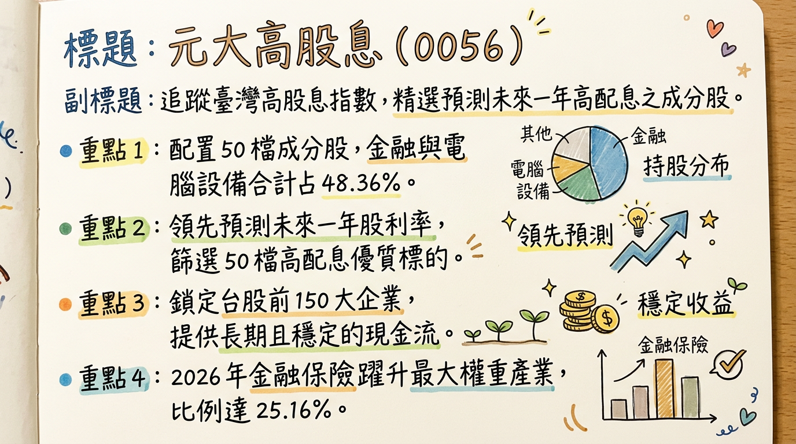
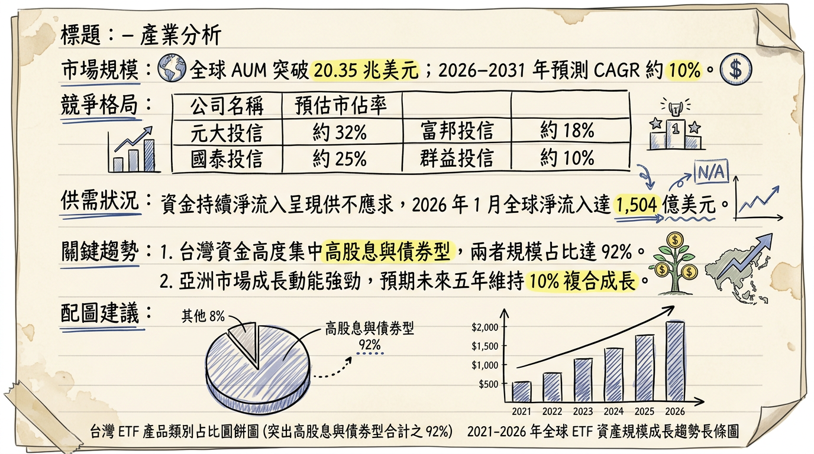
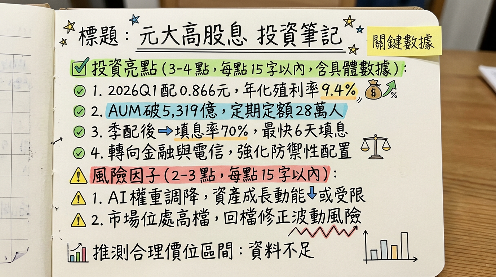

# 0056 元大高股息 深度研究報告

## 一句話摘要
**「台股高股息 ETF 領航者，規模突破 5,000 億大關，2026 年邁向『防禦與成長』兼具的資產配置核心。」**

---

## 公司概覽（ETF 性質與資產結構）
元大高股息（0056）由元大投信發行，追蹤「臺灣高股息指數」，核心選股邏輯為從臺灣 50 與中型 100 指數中，篩選「預測未來一年」現金股息殖利率最高的 50 檔成分股。

### 投資組合結構（截至 2026/03）
| 產業類別 | 佔比 (%) | 核心代表股（權重） |
| :--- | :--- | :--- |
| 上市金融保險業 | 25.16% | 中信金 (4.55%)、玉山金 |
| 電腦及週邊設備業 | 23.20% | 廣達 (4.18%)、緯創 |
| 半導體業 | 19.08% | 聯發科 (5.40%)、聯電 (4.92%) |
| 航運業 | 10.60% | 長榮、長榮航太 |
| 電子零組件/其他電子 | 15.43% | 日月光投控 |
| 其他（電機、通訊等） | 6.53% | 台灣大 |

---

## 核心競爭優勢
1.  **獨特的選股邏輯**：採用「預測未來一年」殖利率，而非「過去已配發」數據，能更早納入 AI 伺服器等具備成長動能的轉型股。
2.  **規模經濟與高流動性**：AUM 超過 5,200 億元，為全台高股息 ETF 之首，經理費率低至 0.30%。
3.  **穩定的填息紀錄**：自改為季配息後，10 次配息中成功填息 7 次，歷史填息能力強。
4.  **強大的平準金儲備**：截至 2025 年底，資本平準金約 6.97 元，可分配收益 4.73 元，具備支撐 2026 年穩定配息的底氣。

---

## 財務分析（資產規模與配息趨勢）

### 基金績效與規模趨勢表（2025-2026）
| 月份 | 資產規模 (AUM, 億) | 單月報酬率 (MoM) | 年增率 (YoY) | 備註 |
| :--- | :--- | :--- | :--- | :--- |
| 2025/11 | 4,910 | +1.25% | +10.2% | 市場回溫 |
| 2025/12 | 5,027 | +2.38% | +11.5% | 成分股調整生效 |
| 2026/01 | 5,148 | +4.69% | +11.9% | 2026 Q1 除息月 |
| 2026/02 | 5,541 | +7.63% | +15.8% | 規模創歷史新高 |

### 季度配息紀錄
*   **2026 Q1**：每單位配發 **NT$ 0.866** (年化殖利率約 9.4%)。
*   **2025 全年**：累計配息 **NT$ 3.872** (單次殖利率高達 11.01%)。
*   **2024 全年**：累計配息 **NT$ 3.63**。

---

## 法說會重點（管理層/元大投信 Guidance）
1.  **2026 經濟展望**：預測台灣實質 GDP 成長為 **4.11%**，基本面支撐台股獲利成長。
2.  **配息策略**：利用「收益平準金」制度穩定配息，目標 2026 年每季維持在 0.8 元以上高標。
3.  **防禦性配置**：2026 年初顯著拉高金融股權重至 25%，因應電子股高位震盪風險，強化下檔支撐。

---

## 券商觀點（目標價與評等）
由於 ETF 為淨值連動，券商主要針對「合理淨值」與「殖利率目標」進行分析：

| 券商名稱 | 目標/建議區間 (NT$) | 評等 | 日期 | 核心論點 |
| :--- | :--- | :--- | :--- | :--- |
| 統一證券 | 38.0 - 41.5 | 增加配置 | 2026/02/26 | 預估全年配息率維持 9.1%~9.4% |
| 凱基證券 | 42.0 | 強力買進 | 2026/01/15 | 聯發科等權值股 AI 紅利發酵 |
| 富邦投顧 | 36.5 - 39.0 | 中立/區間 | 2025/12/11 | P/E 14.47 倍，建議年線附近佈局 |

---

## 財報深度分析

### 費用率與利潤結構
*   **年度總費用率 (Expense Ratio)**：2025 年為 **0.57%**（經理費 0.30% + 保管費 0.035% + 交易稅費）。
*   **成分股獲利能力**：加權平均 ROE 為 **15.20%**，投資組合 P/E 約 **14.47 倍**，顯示持股品質與估值尚屬合理。

### 存貨（成分股）調整分析
*   **2025/12 定審**：
    *   **納入**：玉山金 (2884)、長榮航太 (2645)、台灣大 (3045)。
    *   **剔除**：中租-KY (5871)、東元 (1504)、臻鼎-KY (4958)。
*   **戰略分析**：此舉由「攻擊型」轉向「平衡型」，納入穩定現金流的電信與金融。

---

## 股權異動（受益人數與籌碼）
*   **受益人數**：截至 2026 年初突破 **153.1 萬人**。
*   **法人籌碼**：
    *   **自營商**：2026/02/11 單日大買 **82,607 張**。
    *   **外資**：2026/03/04 單日賣超 **24,620 張**（短期避險性賣壓）。
    *   **淨申購**：2025 全年獲 **1,441 億元** 資金淨流入。

---

## 產業分析（競爭格局）

### 台灣高股息 ETF 龍頭對比 (2026/03)
| 比較項目 | 元大高股息 (0056) | 國泰永續高股息 (00878) | 群益台灣精選高息 (00919) |
| :--- | :--- | :--- | :--- |
| **規模 (AUM)** | **5,541 億 (第一)** | 約 4,700 億 | 約 3,700 億 |
| **選股邏輯** | **預測未來殖利率** | 追蹤過去三年穩定度 | 鎖定當下已宣告配息者 |
| **2026 策略** | **AI 成長 + 金融防禦** | 高防禦金融債券感 | 極致殖利率追逐 |

---

## 近期催化劑（利多/利空事件）
*   **利多 (+)**：
    *   **2026/04 除息預期**：市場預期配息將維持 0.866 元。
    *   **聯發科 AI ASIC 獲利**：2026 Q2 預計貢獻超過 10 億美元營收。
    *   **金融股股利宣告**：中信金預期 2026 配息挑戰 2.0 元以上。
*   **利空 (-)**：
    *   **地緣政治**：中東局勢升溫推升油價至 100 美元，可能壓抑科技股估值。
    *   **外資調節**：短期外資對台股避險賣壓導致淨值震盪。

---

## ⭐ 成長動能時間軸
*   **2026 Q1**：聯電與 Intel 合作 12 奈米案開始貢獻 NRE 收入。
*   **2026/01/22**：完成第一季配息，除息後 6 天填息（歷史數據參考）。
*   **2026 Q2**：聯發科 AI ASIC 切入 Google TPU 供應鏈並開始量產。
*   **2026/06**：台股傳統除權息旺季，預期 0056 權益收入大幅進帳。
*   **2026 Q4**：聯發科與 NVIDIA 合作之車用晶片 C-X1 正式出貨。

---

## 2026 展望（成長動能 vs 風險）
*   **成長動能**：AI 伺服器硬體紅利轉化為實際股息，加上金融股獲利回升，預期 2026 全年配息區間在 **NT$ 3.5 - 3.8** 元。
*   **下行風險**：前十大持股權重升至 **39.33%**，個股波動影響變大；高利率環境若維持過久，將壓抑高息資產估值。

---

## 投資結論
1.  **配息能見度高**：帳上平準金充沛，預估 2026 年化殖利率可穩守 **9%** 以上。
2.  **產業配置均衡**：25% 金融配比能有效抵禦 2026 年科技股可能的修正風險。
3.  **存股策略建議**：對於月領 1 萬被動收入者，建議持有約 35-38 張。
4.  **建議買進區間**：**NT$ 35 - 37** 為強勢支撐與高 CP 值買點；**NT$ 42** 以上則需注意殖利率下降之風險。

---
**本報告由 AI 自動產生，資料來源為公開網路資訊，僅供參考，不構成投資建議。**
**產生時間：2026-03-05 09:45**

---

## 📊 資訊卡

