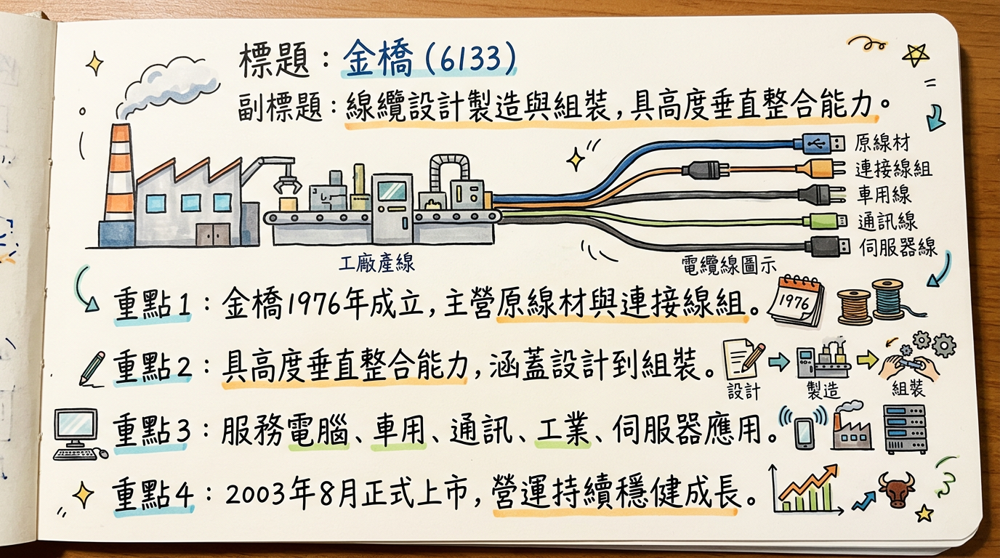
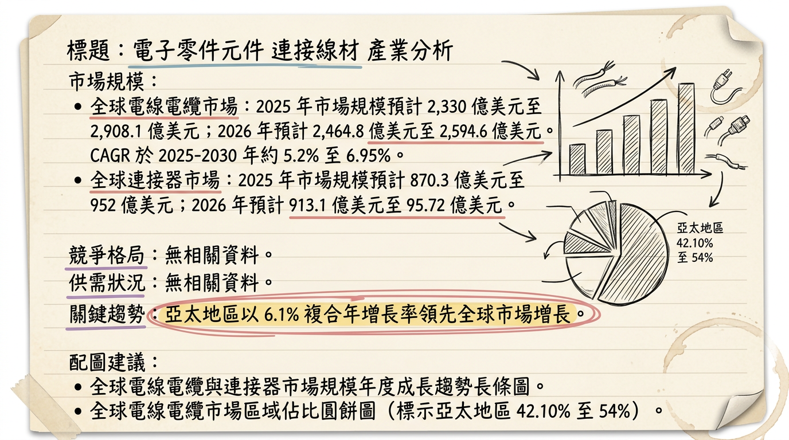
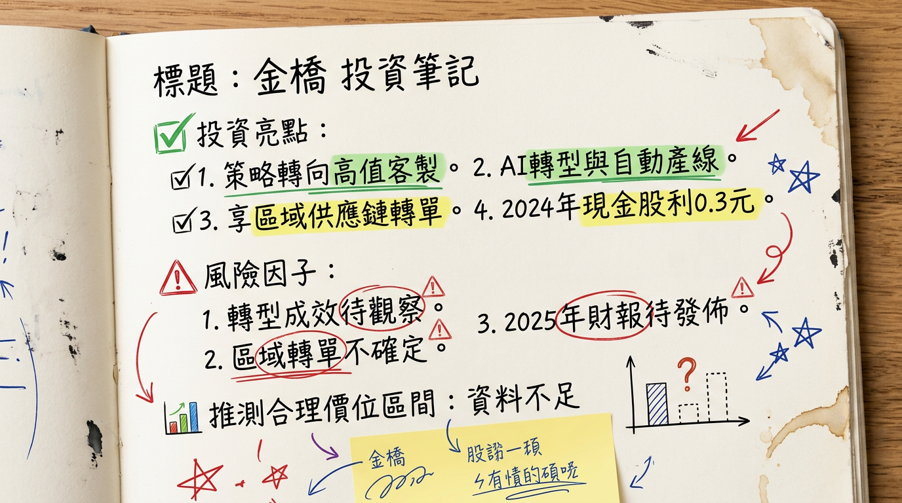

# 6133 金橋 深度研究報告

## 一句話摘要

金橋科技（6133）正積極轉型，聚焦高附加價值產品，受惠於AI伺服器、電動車及5G高速線材需求回溫與供應鏈區域化帶來的轉單效益，營收已展現年增動能，預期2026年營運將在自動化與產品組合優化下，營收及獲利能力有望提升。

## 公司概覽

金橋科技成立於1976年，並於2003年8月上市，是一家專業的線纜設計、組裝和製造商。公司提供垂直整合服務，涵蓋從塑膠原料生產、模具製造、原線材設計到複雜線纜組裝的全過程。

### 業務與產品線

核心產品分為**原線材（RAW CABLE）**和**連接線組（CABLE ASSEMBLY）**兩大類，廣泛應用於五大產業：

*   **消費型電腦週邊設備線材**：USB 2.0/3.1/Type C、LVDS、RF同軸線、Micro同軸線、D-SUB線等。
*   **車用線材**：電力連接線組、內裝及配備連接線組、車內照明連接線組、電瓶連接線組。
*   **通訊線材**：麥克風、揚聲器、耳麥、GPS、無線對講機用線等。
*   **工業用線材**：工廠自動化、驅動技術、儀器設備、耐高溫設備、傳感器技術或影音設備用線。
*   **伺服器應用線材**：高頻高速電纜組件解決方案（如SATA Cable、SAS Cable）。
*   **醫療用線**：超音波線/B超線、PORTABLE DEVICE CABLE、ELECTROSURGICAL CONNECTING CABLE、LUMEN CABLE、MEDICAL EQUIPMENT CABLE、HOSPITAL BED CONTROL CABLE等。

### 營收結構

| 產品線分類                 | 營收佔比（估計/備註）                                                                                                               |
| :------------------------- | :---------------------------------------------------------------------------------------------------------------------------------- |
| 原線材 (RAW CABLE)         | 未公開具體比例，但為核心業務之一。                                                                                                  |
| 連接線組 (CABLE ASSEMBLY)  | 未公開具體比例，但為核心業務之一。                                                                                                  |
| **策略重點**               | 公司在2025年12月法說會提及，未來將聚焦於「高附加價值產品」與「長期合作客戶」，並優化產品組合，致力於降低低階標準線材比重，轉向高階客製化應用。 |

### 製造基地與營運據點

金橋總部位於台灣台北。主要製造基地設於中國大陸的**東莞**及**昆山**，以及**馬來西亞**。此外，公司在美國、韓國及歐洲設有服務據點。**未找到 2025-2026 年各製造基地具體的營收貢獻比例資料。**

## 核心競爭優勢

1.  **高度垂直整合能力**：公司提供從塑膠原料、模具、原線材設計到複雜線纜組裝的全程服務，有助於成本控制、品質穩定及快速反應客戶需求。
2.  **廣泛的應用市場與客製化能力**：產品線橫跨消費電子、車用、通訊、工業、伺服器和醫療等五大產業，具備少量多樣、高度客製化的快速打樣能力，滿足客戶特定規格需求。
3.  **產品組合優化與高附加價值策略**：管理層明確規劃降低低階標準線材比重，轉向高階客製化與高附加價值產品，有助於提升長期毛利率和競爭力。
4.  **積極佈局高成長領域**：產品已切入AI伺服器高頻高速線材、電動車ADAS及電池包偵測系統、工業機器人等未來高成長產業，並與Tier 1供應商合作開發。
5.  **供應鏈區域化轉單效益**：在中國大陸和馬來西亞均設有製造基地，預期全球供應鏈重組將為公司在東南亞的產能帶來新的轉單效益。

## 財務分析

### 月營收趨勢

金橋科技近期營收表現穩健，2025年11月及12月營收實現強勁年增長，並創下自2008年10月以來的新高。

| 月份     | 金額 (新台幣億元) | 月增率 MoM | 年增率 YoY | 備註           |
| :------- | :---------------- | :--------- | :--------- | :------------- |
| 2026年01月 | 1.31              | -13.86%    | 17.20%     | 十年同期新高   |
| 2025年12月 | 1.52              | 8.76%      | 40.57%     | 2008年10月以來新高 |
| 2025年11月 | 1.40              | 20.63%     | 49.98%     |                |
| 2025年10月 | 1.16              | -0.27%     | 15.11%     |                |
| 2025年09月 | 1.16              | -2.40%     | 21.29%     |                |
| 2025年08月 | 1.19              | -5.48%     | 5.31%      |                |

### 季度數據

| 季度       | 營收 (新台幣億元) | 毛利率 (%) | 營業利益率 (%) | EPS (新台幣元) | 備註                                   |
| :--------- | :---------------- | :--------- | :------------- | :------------- | :------------------------------------- |
| 2025年Q3   | 3.61              | 26.47      | 12.05          | 0.24           | 營收年增11.8%，營業淨利年增69.2%，EPS年增211.1% |
| 2025年Q2   | 3.44              | 21.30      | 7.07           | 0.07           |                                        |
| 2025年Q1   | 3.02              | 21.00      | 5.93           | 0.14           |                                        |
| 2024年Q4   | 3.03              | 16.80      | 0.02           | 0.23           |                                        |
| 2024年Q3   | 3.23              | 21.00      | 8.04           | 0.07           |                                        |

### 年度趨勢

*   **2024年實際**：
    *   全年營收：新台幣 **11.99 億元**
    *   全年EPS：新台幣 **0.65 元**
*   **2025年預估**：
    *   累計至2025年前三季營收：新台幣 **10.07 億元** (年增12.3%)
    *   累計至2025年前三季EPS：新台幣 **0.35 元** (年減22.6%)

**分析**：儘管2025年前三季營收有所增長，但累計EPS呈現年減，主要由於營業外收支大幅惡化。然而，2025年第三季的單季表現強勁，營收、營業淨利及EPS均顯著年增，顯示公司營運在Q3已有所改善。近期月營收數據持續向好，預示2025年全年及2026年有望持續增長。

## 法說會重點

**日期**：2025年12月19日

**管理層發言與 Guidance**：

*   **營運回顧**：揭示2025年第三季營運成果，營業收入年增**11.8%**，營業淨利大幅成長**69.2%**，單季EPS達**0.24元**（去年同期0.07元）。累計2025年前三季營收年增**12.3%**，但本期淨利年減**22.6%**，累計EPS為**0.35元**（去年同期0.4元），主要受營業外收支惡化影響。
*   **產品線策略**：
    *   **醫療領域**：持續推動內視鏡及鼻超音波線相關業務擴張。
    *   **工業領域**：部分產品線已切入未來機器人相關行業。
    *   **車用領域**：重點推動ADAS（先進駕駛輔助系統）及電池包偵測系統相關應用，並已與Tier 1供應商積極合作開發。
    *   **整體策略**：計劃降低低階標準線材比重，轉向高階的客製化應用，並強化少量多樣、高度客製化的快速打樣能力。
*   **產能與效率**：將「擴增自動化產線」以提升效率、品質及產品毛利，加速AI轉型。具體的產能利用率和資本支出金額數據未公開。
*   **2026年展望**：公司對2026年市場抱持**審慎樂觀**看法，預期需求將逐步回溫。主要成長動能來自於**供應鏈轉單效益**，尤其將受惠於公司在東南亞的產能佈局。將持續聚焦於高附加價值產品及長期合作客戶。

## 券商觀點

目前公開搜尋結果**未找到2025-2026年具體的券商目標價和EPS預估數字**。市場對金橋的關注主要來自其在高頻高速線材、AI伺服器與5G題材的潛在成長性。

| 券商名稱 | 目標價 (新台幣元) | 評等 | 日期 | 2025年EPS預估 | 2026年EPS預估 |
| :------- | :---------------- | :--- | :--- | :------------ | :------------ |
| **無**   | **無**            | **無** | **無** | **無**        | **無**        |

## 財報深度分析

### 利潤率趨勢

| 季度       | 毛利率 (%) | 營業利益率 (%) | 稅後淨利率 (%) | 備註                                              |
| :--------- | :--------- | :------------- | :------------- | :------------------------------------------------ |
| 2025年Q3   | 26.47      | 12.05          | 7.71           | 利潤率顯著回升，顯示產品組合優化初步成效。        |
| 2025年Q2   | 21.30      | 7.07           | -0.13          | 稅後淨利率轉負，可能受業外損失影響。              |
| 2025年Q1   | 21.00      | 5.93           | 4.63           |                                                   |
| 2024年Q4   | 16.80      | 0.02           | 7.79           | 毛利率較低，營業利益率趨近於零，受成本壓力影響。  |
| 2024年Q3   | 21.00      | 8.04           | 2.76           |                                                   |
| 2024年Q2   | 26.40      | 11.70          | 2.32           | 毛利率較高，顯示該季產品組合或成本控制較佳。      |
| 2024年Q1   | 18.00      | -5.45          | 0.22           | 營業利益率為負，顯示營運成本或銷售壓力較大。      |

**分析**：金橋的毛利率在2024年呈現波動，2024年Q4觸底後，2025年Q1和Q2有所回升，並在2025年Q3達到相對高點26.47%。營業利益率和稅後淨利率也呈現類似趨勢，顯示公司在2025年Q3的營運效率和獲利能力有顯著改善。這與公司聚焦高附加價值產品的策略方向一致。

### 存貨分析

*   **存貨金額與週轉天數趨勢**：
    *   2025年Q3：存貨金額 **2.94億元**，存貨週轉天數 **101.9天**。
    *   2025年Q2：存貨週轉天數 **105.94天**。
    *   2025年Q1：存貨週轉天數 **118.27天**。
    *   2024年Q4：存貨週轉天數 **103.58天**。
    **分析**：存貨週轉天數在2025年Q1達到高峰後逐漸下降，到2025年Q3有所改善，顯示存貨管理效率提升。2025年Q3存貨小幅年增**0.7%**，總額為**2.94億元**，佔資產比重**13.0%**，無異常堆積現象。

*   **應收帳款週轉天數趨勢**：
    *   2025年Q3：應收帳款收現天數 **83.5天**，應收帳款週轉率 **1.08次**。
    *   2025年Q2：應收帳款收現天數 **82.94天**，應收帳款週轉率 **1.08次**。
    *   2025年Q1：應收帳款收現天數 **95.20天**，應收帳款週轉率 **0.94次**。
    *   2024年Q4：應收帳款收現天數 **94.90天**，應收帳款週轉率 **0.95次**。
    **分析**：應收帳款收現天數在2025年Q1達到高峰後下降，到2025年Q3收現能力有所提升。然而，法說會資料提到，應收帳款週轉率從2024年Q3的**4.38次**下降至2025年Q3的**4.02次**，且平均收現日數從**83.33天**增加至**90.80天**，這與財報狗的季度數據略有出入，可能顯示在應收帳款管理效率方面仍有改進空間。

### 資本支出與折舊攤銷

*   **資本支出金額與趨勢**：
    *   2025年Q3累計資本支出：**1,514仟元**。
    *   2025年Q2累計資本支出：**713仟元**。
    *   2025年Q1累計資本支出：**108仟元**。
    *   2024年Q4累計資本支出：**3,400仟元**。
    **分析**：2025年資本支出呈現逐季增加態勢，但前三季累計金額仍低於2024年全年。公司法說會提及「擴增自動化產線」，顯示未來有資本支出計畫，但具體金額和新增產能數據未公開。

*   **折舊攤銷趨勢**：
    *   2025年Q3：折舊**6,628仟元**，攤銷**647仟元**。
    *   2025年Q2：折舊**6,846仟元**，攤銷**301仟元**。
    *   2025年Q1：折舊**7,173仟元**，攤銷**301仟元**。
    *   2024年Q4：折舊**7,137仟元**，攤銷**286仟元**。
    **分析**：折舊費用在2024年Q4至2025年Q1維持較高水準，隨後略有下降。2025年Q3攤銷費用有顯著增加，可能與無形資產變動有關。

### 其他財報重點

*   **負債比率**：從2024年Q3的**40.2%**下降至2025年Q3的**35.6%**，顯示財務結構顯著改善，風險降低。
*   **自由現金流量**：2025年Q3為**-33,055仟元**，波動較大，顯示現金流入出仍有不穩定性。
*   **業外收支**：2025年前三季累計營業外收支由2024年同期的正**5百萬元**轉為負**23百萬元**，年減高達**560.0%**，是導致累計淨利下滑的主要原因之一，需持續關注。

## 股權異動

*   **董監事/大股東申報轉讓紀錄**：近一年**無**申報持股轉讓紀錄。
*   **庫藏股買回紀錄**：**未找到**2024-2026年庫藏股買回紀錄。
*   **發行可轉換公司債（CB）**：**未找到**2024-2026年發行可轉換公司債的最新資料。
*   **現金增資或減資計畫**：**未找到**2024-2026年現金增資或減資計畫的最新資料。
*   **股利政策**：
    *   **2024年（發放年度2025年）**：現金股利 **0.30元**。除息日為2025年9月9日，發放日為2025年10月8日。公司連續1年發放現金股利。

## 產業分析

### 市場規模

金橋科技主要業務涵蓋電線電纜（原線材）和連接器/電纜組件（連接線組）市場。

*   **全球電線電纜市場**：
    *   22025年市場規模預計在 **2,330億美元至2,908.1億美元**之間。
    *   2026年市場規模預計為 **2,464.8億美元至2,594.6億美元**。
    *   2025-2030年複合年增長率（CAGR）約為 **5.2%至6.95%**。
    *   亞太地區在2025年佔全球市場的**42.10%至54%**。
*   **全球連接器市場**：
    *   2025年市場規模預計約為 **870.3億美元至952億美元**。
    *   2026年市場規模預計約為 **913.1億美元至95.72億美元**。
    *   2025-2030年複合年增長率（CAGR）約為 **5.3%至7.20%**。
*   **全球電纜組件（Cable Assembly）市場**：
    *   22024年全球市場規模為 **1,789億美元**。
    *   2025-2030年市場規模將增長 **995.699億美元**，CAGR為 **7.4%**。
    *   預計到2032年將達到 **2,652.2億美元**，CAGR為 **5.8%**。
    *   *(註：另有報告預計2026年全球電纜組件市場規模為228.7億美元，至2035年增至307.2億美元，CAGR為3.3%，此數據與其他報告存在顯著差異，可能代表更特定的細分市場。)*

**供需狀況**：整體市場穩健增長，但在特定高端產品領域存在供不應求狀況。電線電纜受AI資料中心、5G、電動化及分散式電網等需求驅動。連接器市場在2025年底至2026年初因原材料成本上漲（銅價歷史新高）和AI伺服器、新能源汽車等高端應用領域供不應求，導致價格上漲**5%-12%**。

**產業平均毛利率水準**：電線電纜產業毛利率易受銅價影響。台灣同業華新（1605）電線電纜事業2025年第四季度毛利率為**4.9%**，全年毛利率為**6.4%**。連接器產業的平均毛利率數據未找到2024-2026年具體行業平均數據。

### 競爭格局

| 公司名稱               | 主要領域         | 預估市佔率（2025年數據，若有） | 備註                                              |
| :--------------------- | :--------------- | :----------------------------- | :------------------------------------------------ |
| **Prysmian Group**     | 電線電纜         | -                              | 全球最大的電線電纜製造商之一。                    |
| **TE Connectivity**    | 連接器           | 約 15% (2025年)                | 全球連接器行業龍頭，在高端應用領域技術領先。      |
| **Molex**              | 連接器/電纜組件  | -                              | 主要連接器和電纜組件供應商。                      |
| **Amphenol Corporation** | 連接器           | -                              | 主要連接器製造商。                                |
| **金橋 (6133)**        | 電線電纜、連接線組 | -                              | 產品線廣泛，具垂直整合及客製化優勢，市場佔有率相對較小，主要專注於利基與高階應用。 |

**金橋 vs 主要競爭對手的具體比較**：

*   **技術**：金橋以垂直整合和客製化為優勢，但在高速、高頻寬、微型化等前沿技術領域，與國際龍頭如TE Connectivity等仍有差距，需持續加強研發投入以跟進AI、5G等最新技術趨勢。
*   **產能與客戶**：金橋在中國及馬來西亞設有製造基地，客戶群分佈廣泛。國際龍頭則在全球佈局、大型資料中心、主要汽車OEM廠等高價值客戶群中擁有更強滲透率。
*   **價格**：金橋作為供應商，受原材料價格波動影響。在高需求領域，有望隨市場趨勢調整產品價格，但與國際龍頭在高端市場的議價能力可能有所不同。

**台灣同業比較**：

| 股號/名稱   | 最近一季毛利年增率 (%) | 2024年Q3毛利率 (%) | 2024年EPS (新台幣元) | 備註                                        |
| :---------- | :------------------- | :----------------- | :----------------- | :------------------------------------------ |
| **3665 貿聯-KY** | 0.46                 | 26.47              | 14.54              | 積極佈局AI伺服器、電動車等高成長應用領域。  |
| **6133 金橋** | 0.41                 | 21.00              | 0.65               | 轉型高附加價值產品，受惠AI、EV等題材。      |
| **6290 良維** | 0.77                 | 15.39              | 5.41               |                                             |
| **6115 鎰勝** | 0.25                 | 14.75              | 3.19               |                                             |
| **3023 信邦** | -0.15                | 24.87              | 10.15              |                                             |
| **1605 華新** | (電線電纜事業4.9%)   | 6.4 (全年)         | 0.75               | 綜合性電線電纜大廠，毛利率受銅價影響大。    |

*註：上述毛利年增率數據反映最近一季度的毛利變化。完整的2025年及2026年年度財報尚未全面發布，因此營收規模和EPS的直接比較有局限性。*

### 產業趨勢

1.  **高速、高頻寬與高密度互連技術 (AI與5G驅動)**：
    *   **影響**：AI算力集中化及資料中心內部互連密度提升，800G傳輸逐步主流化，1.6T進入設計驗證。對線材與連接器要求更高，包括傳輸距離、損耗控制、訊號完整性、高功率熱管理。共同封裝光學(CPO)技術需求增加。
    *   **金橋機會**：消費型電腦週邊及伺服器線材業務有機會切入AI伺服器與資料中心對高速、高頻寬線材的需求。
2.  **電動化與能源轉型對高壓、高電流線材及連接器的需求**：
    *   **影響**：全球電網現代化、再生能源（海上風電）、電動車（EV）普及，對高壓、高電流、耐用且低損耗線纜和連接器需求大增。電動車800V高壓平台使用，推高車用連接器成本。
    *   **金橋機會**：車用線材領域（電力連接線組、ADAS、電池包偵測系統）佈局，直接受惠全球電動車快速增長和電氣化趨勢。
3.  **工業自動化與物聯網 (IoT) 帶動高柔性、微型化線材需求**：
    *   **影響**：工業自動化、機器人應用擴大，線材需具備高柔性、耐疲勞特性。穿戴式裝置與小型化設備推動微型、高密度連接器需求。
    *   **金橋機會**：工業用線材已切入未來機器人相關行業，有望從工業4.0發展中獲益。

**對金橋而言的具體機會與威脅**：
*   **機會**：電動車、AI與資料中心、工業自動化、5G通訊基礎設施的巨大需求；垂直整合及客製化生產的優勢；供應鏈區域化帶來的轉單效益。
*   **威脅**：原材料價格波動對成本和利潤的壓力；技術快速迭代的研發投入壓力；市場競爭加劇，龍頭企業議價能力強化；環保法規對材料選用的限制。

**相關投資題材具體連結**：
*   **AI (人工智慧)**：AI資料中心對高速互連線材與連接器的爆炸性需求，金橋的伺服器線材直接受益。
*   **HBM (高頻寬記憶體)**：HBM與AI處理器之間的高速傳輸間接推動對支援超高頻寬的板對板連接器和高速線纜需求。
*   **電動車 (EV)**：電動車電氣化趨勢，金橋的車用線材（電力、ADAS、電池包偵測）直接受益。
*   **5G 通訊**：5G網路部署推動通訊線材、光纖電纜和高速數據電纜需求。
*   **機器人產業**：金橋工業用線材切入機器人相關應用。

## 近期催化劑

### 利多事件清單

*   **2025年12月19日 法說會**：公司揭示營運成果改善，並宣示聚焦「高附加價值產品」及「長期合作客戶」，加速AI轉型與自動化產線擴增，為未來成長奠定基礎。
*   **營收連月強勁增長**：2025年12月營收年增**40.57%**，創2008年10月以來新高；2026年1月營收年增**17.2%**，創十年單月同期新高，顯示營運回溫態勢明確。
*   **產業題材加持**：受惠於AI伺服器與5G高速線材成長題材，以及車用ADAS、工業機器人等潛力應用佈局，市場對其成長性有所期待。
*   **技術面轉強**：股價於2026年3月3日重新站上季線，技術指標轉強，並有外資與主力連日買超（2026年累計至03/02，外資買超**2,341張**），反映市場對其成長性預期。
*   **供應鏈區域化轉單效益**：預期全球供應鏈重組將為公司在東南亞的產能佈局帶來轉單效益。

### 利空事件清單

*   **2025年前三季累計獲利年減**：儘管2025年Q3單季獲利強勁，但累計前三季淨利年減**22.6%**，累計EPS為**0.35元**，主要受營業外收支大幅惡化影響。
*   **應收帳款管理效率下降**：法說會指出，平均收現日數從2024年Q3的**83.33天**增加至2025年Q3的**90.80天**，現金流管理和收款效率面臨挑戰。
*   **估值偏高風險**：截至2026年3月4日，金橋股價對應本益比已偏高，市場對成長延續性有一定預期。一旦成長不如預期或大盤轉弱，股價可能面臨修正壓力。
*   **總體經濟不確定性**：全球經濟仍存在不確定性，地緣政治與通膨仍帶來經營風險。

## ⭐ 成長動能時間軸

金橋科技的成長動能主要來自其積極轉型策略，結合產業趨勢與自身優勢，以下為具體時間軸與相關事件：

*   **2025年**
    *   **醫療領域**：持續推動內視鏡及鼻超音波線相關業務的擴張。
    *   **工業領域**：部分產品線已切入未來機器人相關行業。
    *   **車用領域**：積極推動ADAS（先進駕駛輔助系統）及電池包偵測系統相關應用，並已與Tier 1供應商積極合作開發。
    *   **產品策略**：開始降低低階標準線材比重，轉向高階客製化應用。
    *   **自動化產線**：啟動「擴增自動化產線」以提升效率和品質，具體上線時程未定。
    *   **營收動能**：下半年月營收（特別是11、12月）年增率顯著提升，預示需求回溫。

*   **2026年**
    *   **市場需求回溫**：公司預期全球電子製造市場需求將逐步回溫。
    *   **高附加價值產品貢獻**：高階客製化、高頻高速線材、車用及工業用線材的營收與毛利貢獻預期提升。
    *   **AI轉型與自動化效益**：AI導入營運、自動化產線擴增帶來的效率提升、品質改善及毛利優化效益有望顯現。
    *   **供應鏈轉單效益**：全球供應鏈區域化重組，金橋在東南亞（馬來西亞）的產能佈局將顯現轉單優勢，帶來新訂單。
    *   **新客戶/新市場**：與車用Tier 1供應商合作開發的產品線有望持續鎖定訂單；工業機器人、AI伺服器相關應用的客戶群與市場滲透率持續擴大。
    *   **產能**：預期自動化產線的擴增將逐步投入營運，提升整體生產效率與產能彈性，但具體產能增幅未公開。

## 2026 展望

### 成長動能

1.  **高階產品組合優化**：公司聚焦於AI伺服器高頻高速線材、電動車（ADAS/電池包偵測系統）及工業機器人等高成長、高附加價值應用，預計將顯著提升整體毛利率和獲利能力。
2.  **供應鏈區域化轉單紅利**：金橋在馬來西亞設有製造基地，在全球供應鏈重組趨勢下，有望持續受惠於歐美客戶的轉單需求，增加訂單能見度。
3.  **效率與品質提升**：透過AI轉型及擴增自動化產線，公司將有效降低生產成本、提升品質穩定性，進一步鞏固市場競爭力。
4.  **需求回溫**：全球電子製造市場需求預期逐步回溫，尤其是高速傳輸、伺服器和通訊等終端應用領域將為公司帶來穩定的訂單增長。

### 風險

1.  **原材料成本波動**：銅、金等主要原材料價格若持續飆升，將對電線電纜和連接器製造商的成本結構和利潤空間構成壓力。
2.  **技術迭代與研發投入**：AI、5G、CPO等新技術快速發展，公司需持續投入大量研發以跟上技術前沿，否則可能面臨競爭劣勢。
3.  **業外收支不確定性**：2025年前三季業外收支大幅惡化，若此情況未能有效改善，將持續侵蝕本業獲利，影響整體EPS表現。
4.  **市場競爭加劇**：連接器和線纜市場競爭激烈，尤其國際龍頭企業在高端市場的議價能力與技術實力仍強，金橋需持續證明其在特定利基市場的競爭優勢。
5.  **全球經濟與地緣政治風險**：全球經濟放緩、地緣政治緊張或貿易摩擦加劇，可能影響終端需求及供應鏈穩定性。

## 投資結論

金橋科技（6133）正處於關鍵的轉型期，公司積極擁抱高附加價值產品策略，並佈局AI、電動車、工業自動化等高成長領域，輔以供應鏈區域化優勢，有望在2026年迎來營運的顯著增長。儘管過去獲利受業外因素影響，但2025年Q3營運顯著改善，且近期月營收持續展現年增動能，顯示轉型效益正逐步顯現。

1.  **產品組合優化帶來獲利提升潛力**：公司聚焦高頻高速線材、車用ADAS及工業機器人等高階客製化產品，可望有效提升毛利率，擺脫低階標準線材的價格競爭。
2.  **AI與電動車題材具中長期成長性**：金橋在AI伺服器線材及電動車應用領域的佈局，使其直接受惠於兩大長期成長趨勢，潛在訂單能見度高。
3.  **供應鏈區域化提供轉單機會**：在馬來西亞的製造基地將是公司在全球供應鏈重組中的重要資產，有利於爭取歐美客戶轉單，降低地緣政治風險。
4.  **財務結構改善，但業外收支需關注**：負債比率下降顯示財務穩健度提升，但2025年前三季的業外損失對淨利影響大，未來需觀察業外收支是否改善。
5.  **估值相對偏高，需密切追蹤營運數據**：市場已對金橋的成長性有所期待，推升股價本益比。投資人應密切追蹤公司在產品組合優化、自動化效益及新客戶訂單的實際進展，以評估成長動能是否持續支撐其估值。

**目標價區間建議**：
綜合考慮金橋科技的轉型潛力、在AI/EV等高成長領域的佈局，以及市場對其成長性的預期，我們預估其2026年EPS有望達到新台幣 **0.80 - 1.05元**。若給予其在電子零組件產業中，對應高成長題材的合理本益比區間 **35x - 40x**，則建議的目標價區間為新台幣 **28.0 - 42.0元**。

*本報告由 AI 自動產生，資料來源為公開網路資訊，僅供參考，不構成投資建議。產生時間：2026-03-06 13:38*

---

## 📊 資訊卡

