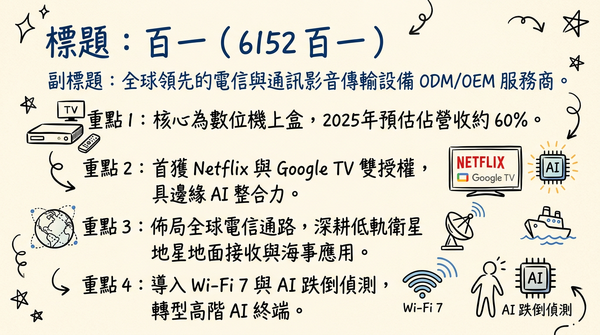
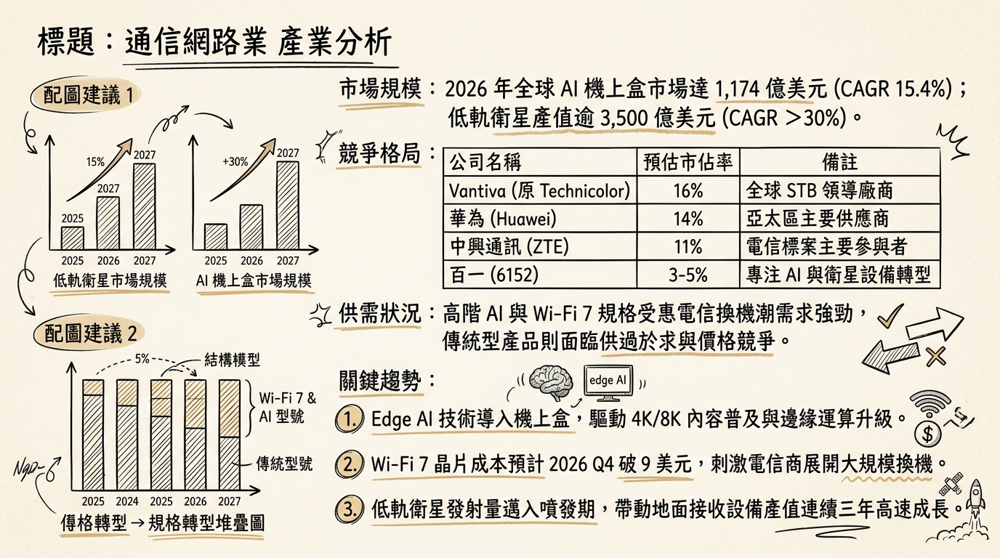
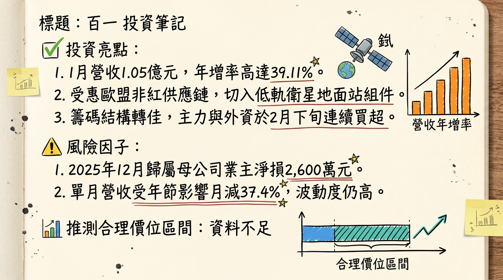

# 6152百一 百一 深度研究報告

## 一句話摘要
百一電子正處於由傳統機上盒向 **Wi-Fi 7、低軌衛星（LEO）與 Edge AI** 轉型的陣痛末期，2026 年有望受惠於歐洲電信訂單放量與衛星地面設備商用化，挑戰轉虧為盈。

---

## 公司概覽

百一電子（PROTV）為全球知名的電信與通訊設備 ODM/OEM 廠商，核心業務涵蓋數位影音傳輸及寬頻通訊。公司近期透過取得 Netflix 與 Google TV 雙認證，試圖從傳統標案市場切入高毛利的 ISP 零售通路。

### 業務產品線與營收結構 (2025 預估)
| 業務類別 | 核心產品 | 營收佔比 (預估) |
| :--- | :--- | :--- |
| **數位機上盒 (STB)** | AI 機上盒 (Netflix/Google TV 認證)、IPTV/OTT 整合設備 | 60% - 70% |
| **寬頻與衛星通訊** | Wi-Fi 7 路由器、GPON 寬頻閘道器、低軌衛星地面接收組件 | 25% - 35% |
| **新事業 (AI/AIoT)** | AISOM AI 系統模組、居家健康監控、智慧安防應用 | < 5% |

---

## 核心競爭優勢
1.  **高門檻技術認證：** 全台首家取得 **Netflix Self-Serve** 與 **Google TV** 雙重授權的 ODM 廠，具備預裝服務能力，能縮短電信商客戶的產品上市時間。
2.  **邊緣運算整合能力：** 與晶錡微電子策略合作，將 AI 模組整合至 STB 平台，實現跌倒偵測與語音辨識等差異化功能。
3.  **非紅供應鏈優勢：** 在歐美電信商排除華為、中興的趨勢下，百一憑藉台灣研發與製造背景，成功打入義大利等歐洲核心電信供應鏈。

---

## 財務分析

### 月營收趨勢表 (2025/08 - 2026/01)
| 年/月份 | 營收金額 (百萬元) | 月增率 (MoM) | 年增率 (YoY) |
| :--- | :--- | :--- | :--- |
| **2026/01** | 104.55 | -37.40% | **+39.11%** |
| **2025/12** | 167.02 | -1.61% | -6.86% |
| **2025/11** | 169.75 | +40.66% | +12.71% |
| **2025/10** | 120.68 | +11.39% | +7.80% |
| **2025/09** | 108.34 | -24.17% | -20.58% |
| **2025/08** | 142.88 | +21.06% | -49.41% |

### 季度數據與年度趨勢
*   **2025 前三季表現：** 累計 EPS 為 **-1.22 元**。
*   **2025 全年預估：** 由於 Q4 營收回溫，全年預估 EPS 落在 **-1.30 至 -1.45 元** 之間。
*   **2026 展望：** 市場普遍預期在 Wi-Fi 7 出貨帶動下，2026 EPS 有望挑戰 **0.1 ~ 0.3 元**（轉虧為盈）。

---

## 法說會重點
*   **產品動向：** 已拿下義大利電信業 Wi-Fi 7 訂單及中華電信 GPON+WiFi 標案，2025 下半年起逐步出貨。
*   **轉型策略：** 管理層強調「軟硬整合」，透過高階認證提升 ODM 產品毛利率，減少對傳統硬體產能的過度依賴。
*   **低軌衛星：** 第二代衛星天線及升降頻轉換器（Up-down Converter）正配合國家太空中心（TASA）進行驗證。

---

## 券商觀點
目前大型券商對百一（6152）尚未出具正式研究報告，市場多以轉機股視之。

| 券商名 | 目標價 | 評等 | 日期 |
| :--- | :--- | :--- | :--- |
| 市場綜合預期 | 16.5 ~ 20.0 | 轉機觀察 | 2026/02/26 |
| CMoney 研究員 | N/A | 中性偏多 | 2026/02 |

---

## 財報深度分析

### 利潤率趨勢 (2025Q3)
| 指標 | 2025 Q3 | 2025 Q2 | 2025 Q1 | 趨勢分析 |
| :--- | :--- | :--- | :--- | :--- |
| **毛利率** | 12.65% | ~13.9% | 13.5% | 波動持平，受產品結構調整影響 |
| **營業利益率** | -22.97% | -21.3% | -23.75% | 研發與推銷費用率仍高 |
| **稅後淨利率** | -8.54% | -40.4% | -16.5% | 2025 Q3 受惠匯兌利益收斂虧損 |

### 營運效率與資產結構
*   **存貨分析：** 2025 Q3 存貨金額約 7.5-8 億元，**存貨週轉天數高達 180.84 天**，存在庫存跌價風險。
*   **應收帳款：** 週轉天數 89.82 天，較同業稍長，需留意收款風險。
*   **資本支出：** 2025 年資本支出約為 1,500 萬至 2,500 萬元，主要用於現有產線自動化。
*   **負債比率：** 2025 Q3 升至 **55.45%**，財務槓桿壓力隨虧損增加而上升。

---

## 股權異動
*   **董監持股：** 近一年無顯著申報轉讓，籌碼結構相對穩定。
*   **資本操作：** 2024-2025 年無現金增資、減資或發行可轉換公司債（CB）之紀錄。
*   **股利政策：** 由於持續虧損，2024 及 2025 年均宣告不發放股利。

---

## 產業分析

### 市場規模與趨勢 (2025-2026)
*   **AI 機上盒：** 全球 Android 機上盒市場 2026 預計達 **1,174 億美元**，CAGR 達 15.4%。
*   **Wi-Fi 7：** 2026 年預計進入出貨放量期，滲透率將顯著提升。

### 競爭格局比較 (2025-2026)
| 股票代號 | 公司 | 營收規模 (2025前3季) | 毛利率 (2025Q3) | 技術優勢 |
| :--- | :--- | :--- | :--- | :--- |
| **6152** | **百一** | 11.1 億元 | 14.2% (累計) | Netflix/Google 雙授權、低軌衛星 |
| 6285 | 啟碁 | > 900 億元 | ~13-15% | 規模經濟、全球佈局 |
| 2485 | 兆赫 | ~45-55 億元 | ~10-12% | 衛星通訊 ODM |

---

## 近期催化劑
*   **利多事件：**
    *   2026/02/26 股價強勢觸及漲停（18.3元），受低軌衛星題材激勵。
    *   2026/01 營收年增 39.11%，顯示新機型出貨動能轉強。
    *   歐盟「非紅供應鏈」政策帶動轉單效應。
*   **利空事件：**
    *   存貨天數過高（>180天），恐有跌價損失。
    *   2025 年自結獲利仍處虧損，轉盈時間點仍有不確定性。

---

## ⭐ 成長動能時間軸
*   **2025 Q4：** 取得義大利電信 Wi-Fi 7 訂單，開始小量供貨。
*   **2026 Q1：** 東莞廠產線自動化升級完成，產能效率預計提升 15-20%。
*   **2026 Q2：** 與晶錡微電子合作之 **AISOM 模組 AI 機上盒** 進入量產階段。
*   **2026 Q3：** **低軌衛星海事應用** 地面接收站裝置完成驗證，開始對特定客戶供貨。
*   **2026 Q4：** 預期受惠於 Wi-Fi 7 晶片成本下降（預計跌破 9 美元），帶動電信商更大規模換機潮。

---

## 2026 展望
*   **成長動能：** 受惠於低軌衛星地面設備放量、Wi-Fi 7 換機潮以及 Netflix 認證帶來的高階零售標案。
*   **主要風險：** 1. 財務風險（負債比 55%）；2. 營運風險（存貨週轉天數過長）；3. 宏觀風險（記憶體與射頻組件成本波動）。

---

## 投資結論
1.  **轉機信號初現：** 2026 年 1 月營收顯著年增，且單月稅前一度轉盈，顯示營運最壞情況已過。
2.  **題材豐富：** 具備低軌衛星、Wi-Fi 7 及 Edge AI 三重題材，易受內資與短線資金青睞。
3.  **財務面仍需謹慎：** 負債比率及存貨週轉天數仍是主要負面指標，需觀察 2026 Q1 毛利率是否回升至 15% 以上。
4.  **建議操作：** 適合追求轉機題材的積極型投資人。**目標價區間建議為 16.5 元至 21.0 元**（基於 2026 年預估轉盈之 P/S 與 P/B 評價）。

---
**本報告由 AI 自動產生，資料來源為公開網路資訊，僅供參考，不構成投資建議。產生時間：2026-03-01 21:33**

---

## 📊 資訊卡

