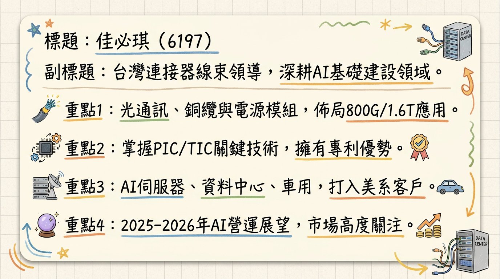
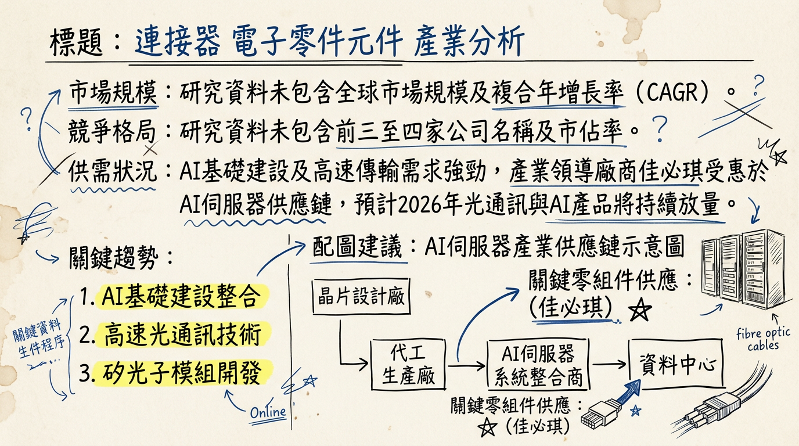
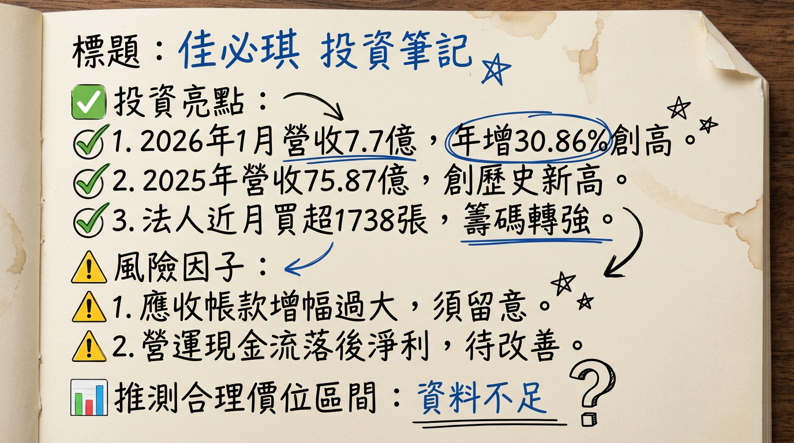

# 6197 佳必琪 深度研究報告

## 一句話摘要
佳必琪作為台股高速傳輸與光通訊模組領導廠商，正積極轉型深耕AI伺服器基礎建設，受惠於NVIDIA及CSP客戶訂單，預計2026年將在矽光子、1.6T高速傳輸與大電流產品線全面爆發，然應收帳款增幅需留意。

## 公司概覽
佳必琪（6197）為台灣連接器與線束模組的領導廠商，近年積極轉型並深耕AI相關基礎建設領域。其核心業務涵蓋高速資料傳輸、電源供應、水冷散熱以及光通訊模組，主要應用於AI伺服器、資料中心、車用電子與工業自動化等高成長領域。公司已掌握光子積體電路（PIC）與光纖耦合（TIC）等關鍵技術，並取得多項專利，為下一世代AI基礎建設提供關鍵互連解決方案。

**核心產品與服務：**
*   **光通訊事業**：
    *   電信與企業傳輸：10G CWDM/DWDM、25G DWDM、100G (40km/80km) 等。
    *   數據中心與AI應用：主力產品為400G FR4/DR4、800G SR8，技術涵蓋Chip on Board (COB) 與DSP 加VCSEL 方案。
    *   矽光子模組：專注於800G/1.6T的FR4/DR8/FR8模組開發。
    *   光學被動元件：Trident Cable（三叉戟線纜）、MPO/MTP光纖跳接線，其中Trident Cable已成功打入美系客戶Compute Tray供應鏈。
*   **銅纜與電源事業**：
    *   高速線材：MCIO Cable、GenZ、PCIe高速線材。
    *   電源傳輸：OCP ORV3 架構的大電流AC Whip電源線、Busbar（匯流排）產品。
    *   記憶體連接器：Memory SoCam連接器。
    *   水冷散熱：UQD水冷接頭等解決方案。

**營收結構 (2025年第三季預估/2024年資料)：**

| 業務類別                      | 佔總營收比例 (2024) | 細項佔比 (2025Q3預估)        |
| :---------------------------- | :------------------ | :---------------------------- |
| Datacenter/Networking/Telecom | 約 **54%**          | AI/GPU伺服器：**50%** (2024) |
|                               |                     | 伺服器儲存：**16%**           |
|                               |                     | AI與GPU：**56%**              |
|                               |                     | 交換器與資料中心纜線：**28%** |
| Smart Connection Industry     | 約 **40%**          | 遊戲繪圖卡：**45%**           |
|                               |                     | 工廠自動化：**20%**           |
|                               |                     | 電動車：**30%**               |
|                               |                     | 其他：**5%**                  |

**製造基地與策略：**
*   **台灣總部：** 研發與管理中心。
*   **越南廠 (一廠、二廠)：** 2024年完成北廠擴建並進入量產，目前產能已滿載，是公司產能擴充的首選基地，預計2025年越南產能將提升30%。
*   **美國廠 (灣區)：** 設有快速打樣線與新產品導入（NPI）中心，主要負責對接美系Hyperscaler的前期開發。美國子公司新廠預計2025年10月開幕，規模為原址兩倍，並新增試產導入量產與高速測試能力。
*   **泰國廠：** 規劃作為光纖被動元件生產基地，預計於2026年第二季開始運作，以應對美中貿易關稅變動。
*   銷售與技術服務據點分佈於美國、歐洲、日本與東南亞。

## 核心競爭優勢
1.  **AI產業轉型領先者：** 佳必琪成功從傳統連接器製造商轉型為AI伺服器與資料中心高速互連解決方案供應商，掌握矽光子、1.6T高速傳輸、大電流電源及水冷散熱等關鍵技術，提前卡位AI發展浪潮。
2.  **技術領先與創新能力：** 公司在光子積體電路（PIC）與光纖耦合（TIC）等矽光子核心技術上取得多項專利，並積極投入共同封裝光學（CPO）產品研發。1.6T迴路模組、1.6T主動式銅纜（ACC）及PCIe Gen6/Gen7等次世代技術布局具前瞻性。
3.  **高階客戶深度合作：** 成功打入輝達（NVIDIA）GB200/GB300與MGX供應鏈，並獲得AVL供應商資格。同時，與美系AI晶片公司、交換機大廠及雲端服務供應商（CSP）建立緊密合作關係，確保高階產品出貨動能。
4.  **彈性且全球化的產能布局：** 透過美國NPI中心、越南大規模量產基地、以及規劃中的泰國光纖被動元件廠，形成「母子工廠」戰略，不僅能快速響應客戶需求，亦能有效分散地緣政治風險與降低成本。
5.  **產品組合高值化：** 策略性聚焦高毛利、高技術門檻的AI相關產品，如光通訊模組、大電流電源線及高速記憶體連接器，有效優化產品組合，推升整體獲利能力。

## 財務分析

### 月營收趨勢
| 月份      | 金額 (億元) | 月增率 MoM | 年增率 YoY |
| :-------- | :---------- | :--------- | :--------- |
| 2026年01月 | 7.70        | 28.19%     | 30.86%     |
| 2025年12月 | 6.01        | 4.14%      | 14.27%     |
| 2025年11月 | 5.77        | -13.44%    | 0.35%      |
| 2025年10月 | 6.67        | -7.33%     | 20.16%     |
| 2025年09月 | 7.19        | 7.03%      | 21.57%     |
| 2025年08月 | 6.72        | -7.18%     | 3.63%      |

### 季度數據
| 會計年度/季度 | 季營收 (億元)        | 毛利率   | 營業利益率 | 稅後淨利率 | EPS (元) |
| :------------ | :------------------- | :------- | :--------- | :--------- | :------- |
| 2024年Q1      | (未提供)             | 33.02%   | 17.40%     | 17.33%     | (未提供) |
| 2024年Q2      | (未提供)             | 35.44%   | 19.57%     | 19.46%     | (未提供) |
| 2024年Q3      | (未提供)             | 33.01%   | 19.42%     | 14.92%     | (未提供) |
| 2024年Q4      | (未提供)             | 30.98%   | 14.42%     | 15.87%     | (未提供) |
| 2025年Q1      | (未提供)             | 33.25%   | 17.87%     | 13.21%     | (未提供) |
| 2025年Q2      | (未提供)             | 34.44%   | 21.73%     | 13.71%     | (未提供) |
| 2025年Q3      | (未提供確切數字， 但前三季累計營收57.43億元) | 32.84%   | 19.22%     | 14.55%     | 2.38 (季增13.7%, 年增9%) |

### 年度趨勢
| 會計年度 | 全年營收 (億元) | 年增率     | 全年EPS (元) | 年增率     | 備註                                   |
| :------- | :-------------- | :--------- | :----------- | :--------- | :------------------------------------- |
| 2024年   | 67.7            | >30%       | 8.69         | 約67%      | 實際                                   |
| 2025年   | 75.87           | 12.1%      | 9.9~12.38    | (預估)     | 實際營收創歷年新高；EPS為法人預估區間 |

## 法說會重點
**最近一次法說會日期：** 2025年12月31日 (另有2025年9月30日法說會資訊整合)

**管理層對各產品線的具體出貨量/訂單能見度說明：**
*   **高速傳輸產品：**
    *   **1.6T迴路模組**：已於2025年第四季通過美系交換機大廠認證。
    *   **1.6T主動式銅纜 (ACC)**：預計於2026年第一季送樣進行認證。
    *   **800G與400G傳輸規格光/銅產品**：已與多家特殊積體電路晶片 (ASIC)、交換機客戶進行概念驗證 (POC)。其中，400G系列已打入美系客戶供應鏈。800G光/銅解決方案預計2026年第一季再有一家美系客戶加入驗證。
    *   **PCIe Gen 6產品**：已在2025年第二季列入專案，預計最快2026年上半年放量。
    *   **PCIe Gen 7產品**：預計2026年第一季提供樣品，並將從MCIO規格先著手開發。
*   **矽光子 (CPO)：**
    *   公司已掌握光子積體電路 (PIC) 與光纖耦合 (TIC) 等核心技術，取得多項專利，研發延伸至CPO架構。
    *   預計2025年提供1.6T DR8黃金樣品供客戶驗證。
    *   2026年啟動矽光子晶片自製與多通道雷射整合。
    *   以2027年CPO相關產品量產為目標。
    *   矽光子三個案子已在進行中，2026年業績可望快速成長。
*   **大電流產品 (Busflow)：**
    *   已取得OCP與北美UL認證。
    *   2025年第四季已收到雲端服務供應商 (CSP) 量產等級訂單，預計2026年第一季陸續出貨。
    *   Busbar (匯流排) 產品已參與下一世代大電源傳輸開發。
*   **高速記憶體連接器 (SOCAMM Connector)：**
    *   性能與可靠度驗證已完成，自動化組裝與潔淨室設備於2025年下半年準備就緒，待客戶生產計畫啟動。
*   **NVIDIA供應鏈：** 已納入輝達GB200/GB300與MGX供應鏈，其中GB200/GB300已獲AVL供應商資格，Rubin則在測試階段。Trident Cable已成功打入美系客戶Compute Tray供應鏈。

**產能利用率、資本支出與產能佈局：**
*   **產能利用率：** 北越廠產能已滿載。
*   **資本支出：** 2025年資本支出將大於2024年，用於擴產與技術升級。
*   **產能佈局：**
    *   美國灣區設有快速打樣線與NPI (新產品導入) 中心。美國子公司新廠預計2025年10月開幕，規模為原址兩倍，並新增NPI與高速測試能力。
    *   越南 (北越) 為產能擴充首選，廠房面積充足，可應對未來擴展。越南產能預計提升30%。
    *   泰國廠規劃為光纖被動元件生產基地，預計2026年第二季開始運作，以因應美中貿易關稅戰。

**管理層給出的下季/下半年 guidance：**
*   管理層對2026年展望樂觀，認為在矽光子、大電流與下一世代高速記憶體連接器等三大新產品帶動下，2026年業績可望爆發。
*   預估2025年下半年業績將好轉，全年將優於2024年，再戰新高。
*   AI、電動車與工廠自動化可望在下半年強勁成長，交換器、資料中心纜線則將小幅增長。

## 券商觀點
**券商目標價：**

| 券商名稱           | 目標價 (元) | 評等 | 日期              | 備註         |
| :----------------- | :---------- | :--- | :---------------- | :----------- |
| 康和證券           | 185         | (未提供) | 2025年07月09日 | ⚠️ 過時 (>6個月) |
| (未明確指出券商名稱) | 200～210    | 看多 | 2024年11月01日 | ⚠️ 過時 (>6個月) |

**各券商對 2025-2026 年 EPS 的預估數字：**
*   **康和證券**：預估2025年度EPS約 **11.61元** (日期：2025年07月09日，⚠️ 過時)。
*   **未明確指出券商名稱 (2024年11月報導)**：預估2025年度EPS落在 **12.84元** (⚠️ 過時)。
*   **法人機構平均預估 (2026年02月報導)**：預估2026年度EPS將落在 **9.9元~12.38元** 之間。

**重大調升/調降評等：**
*   未找到2025-2026年最新的重大調升/調降評等資訊。2024年11月有報導指出有2家券商評等皆為「看多」。

## 財報深度分析

### 利潤率趨勢 (季)
| 會計年度/季度 | 毛利率   | 營業利益率 | 稅後淨利率 |
| :------------ | :------- | :--------- | :--------- |
| 2024年Q1      | 33.02%   | 17.40%     | 17.33%     |
| 2024年Q2      | 35.44%   | 19.57%     | 19.46%     |
| 2024年Q3      | 33.01%   | 19.42%     | 14.92%     |
| 2024年Q4      | 30.98%   | 14.42%     | 15.87%     |
| 2025年Q1      | 33.25%   | 17.87%     | 13.21%     |
| 2025年Q2      | 34.44%   | 21.73%     | 13.71%     |
| 2025年Q3      | 32.84%   | 19.22%     | 14.55%     |

**分析：** 佳必琪的毛利率在2024年Q4略有下滑至30.98%，主要受匯率影響及多地生產成本增加。然而，進入2025年，隨著高附加價值的AI相關產品比重增加，毛利率回穩並維持在32%-34%區間。營業利益率在2025年上半年顯著提升至20%以上，反映產品組合優化、製造效率提升及規模效益。2024年稅後淨利達10.6億元，年增66.93%，創歷史新高，淨利率達到歷史次高。

### 存貨與營運分析
| 會計年度/季度 | 存貨金額 (新台幣千元) | 存貨週轉天數 | 應收帳款週轉天數 |
| :------------ | :-------------------- | :----------- | :--------------- |
| 2024年Q4      | 637,962               | 49.55        | 90.3             |
| 2025年Q1      | 648,768               | 51.84        | 89.89            |
| 2025年Q2      | 644,433               | 45.77        | 84.65            |
| 2025年Q3      | 692,489               | 42.32        | 90.95            |

**分析：**
*   **存貨：** 佳必琪的存貨週轉天數從2025年Q1的51.84天下降至Q3的42.32天，顯示存貨去化速度加快，反映市場需求增加及公司存貨管理效率提升，目前未見異常堆積現象。
*   **應收帳款：** 應收帳款週轉天數在2025年Q3略微上升至90.95天。雖然2025年營收創歷史新高，但有報導指出應收帳款增幅過大，營業現金流落後稅前淨利，這構成潛在的現金流風險，需持續關注。

### 資本支出與產能
*   **近3年資本支出金額與趨勢：** 佳必琪董事長張舒眉表示，2025年資本支出將大於2024年，主要用於擴產與技術升級。具體金額未提供。
*   **未來資本支出計畫與預計新增產能：**
    *   2024年已完成越南北廠擴建並進入量產，該廠產能已滿載。
    *   美國廠預計在2025年10月遷至兩倍規模的新址，以提升交期與彈性。
    *   為因應客戶需求，公司正在評估擴大越南投資、在泰國設立新廠（可能專注於光通訊產品），或在美國東岸增設據點，預計在2025年第四季公布計畫。
    *   泰國廠規劃為光纖被動元件生產據點，預計2026年第二季開始運作，以因應美中貿易關稅變動。

### 其他財報重點
*   **負債比率：** 2025年第三季負債比為 **42.34%**，較前一季有所下降。
*   **業外收支：** 2024年第四季業外損益合計為 **0.98億元**，佔營收 **5.9%**。2025年上半年營運受到關稅及宏觀環境壓力，且匯率波動造成一定的匯兌損失。

## 股權異動

| 項目         | 詳情                                                   | 備註                                     |
| :----------- | :----------------------------------------------------- | :--------------------------------------- |
| 申報轉讓     | 未找到2024-2026年最新董監事/大股東申報轉讓紀錄。       | 最近紀錄為2000年代。                     |
| 庫藏股       | 未找到2024-2026年最新庫藏股買回紀錄。                  |                                          |
| 可轉換公司債 | 未找到2024-2026年最新可轉換公司債發行資訊。            |                                          |
| 增減資計畫   | 未找到2024-2026年最新現金增資或減資計畫。              |                                          |
| 股利政策     | **2024年：** 每股現金股利 **4.2元** (已於2024/07/26發放)。 |                                          |
|              | **2025年：** 董事會決議配息 **7元** (創歷年新高)，預計於2025/07/10除息，2025/07/25發放。 | 顯示公司獲利能力與對股東回饋的積極態度。 |

## 產業分析

### 產業市場規模與 CAGR 成長率

| 市場類別            | 2025年市場規模 (預估) | 2026年市場規模 (預估) | 2026-2034/35 CAGR (預估) |
| :------------------ | :-------------------- | :-------------------- | :----------------------- |
| 全球AI伺服器        | 1,484.3億-1,946.2億美元 | 1,691.8億-2,622.2億美元 | 15.25%-34.73%            |
| 全球資料中心        | 2,697.9億美元         | 3,006.4億美元         | 11.10%                   |
| 互聯網資料中心(IDC) | 779.8億美元           | 890.1億美元           | 14.1%                    |
| 超大規模資料中心    | 816.7億美元           | -                     | 29.32%                   |
| 全球連接器          | 908.7億美元           | 957.2億美元           | 5.3%                     |
| 高速連接器          | 25.7億美元            | 27.4億美元            | 6.4%                     |
| 光纖元件            | 301.4億美元           | 330.9億美元           | 9.8%                     |
| 全球光模組          | -                     | -                     | 22% (2025-2029)          |
| 1.6T光模組          | 5億美元               | -                     | >35% (至2030年突破150億美元) |
| 800G光模組          | -                     | 成為主流 (佔比43%)    | -                        |

### 供需狀況
*   **光模組供不應求：** LightCounting指出，2025-2026年光模組市場增長受限於InP激光芯片產能，當前需求是供給的兩倍。美國光通訊廠AAOI也透露，至少兩至三家客戶有意包下全部800G與1.6T光模組產能，顯示高階光模組供不應求態勢明確。Lumentum法說會指出，光傳輸元件市場供需缺口約30%。
*   **算力需求持續增長：** 22025年全球AI投資持續加碼，智算中心市場投資逆勢增長，預計2026年算力需求將持續增長。
*   **高速銅纜仍為主力：** 盛洋科技表示，2026年公司高速銅纜業務預計仍為營收主力。
*   **AI伺服器需求旺盛：** 全球AI伺服器出貨量年增28%以上，雲端業者與新創公司加速採購。

### 產業平均毛利率水準
*   未找到 2025-2026 年相關產業的平均毛利率最新資料。

### 競爭格局

#### 全球主要競爭者 (按細分領域)
| 領域                 | 主要參與者                                                                                                   |
| :------------------- | :----------------------------------------------------------------------------------------------------------- |
| 高速連接器/線束      | TE Connectivity (TE), Amphenol, Molex, Samtec, Hirose, Airborn, AICO, 立訊精密, 正凌精密工業, 陝西華達等。 |
| 光通訊模組           | 中際旭創 (InnoLight), 新易盛 (Eoptolink), 華工正源 (HG Genuine), 光迅科技 (Accelink), 聯特科技 (Linktel), 天孚通信, 太辰光等。 |
| **備註**             | **目前沒有明確指出特定細分市場的全球前五大公司及其精確市佔率數據 (2024年後)。**                            |

#### 佳必琪 vs. 主要競爭對手比較
| 項目       | 佳必琪 (6197)                                                                                                              | 主要競爭對手 (產業概況)                                                                                             |
| :--------- | :------------------------------------------------------------------------------------------------------------------------- | :-------------------------------------------------------------------------------------------------------------------- |
| **技術領先** | - **矽光子 (CPO)**：掌握PIC與TIC核心技術，800G/1.6T模組開發，2026年啟動晶片自製，目標2027年CPO量產。                  | - 國際大廠如Broadcom、NVIDIA、Intel、Cisco等均積極投入CPO研發，部分廠商已具備更早的量產能力或更完整的生態系。 |
|            | - **高速傳輸**：1.6T Loopback模組已獲美系交換機大廠認證，1.6T ACC預計2026Q1送樣。PCIe Gen6/7積極佈局。                  | - 其他連接器大廠如Amphenol、Molex等在高速銅纜與連接器領域具深厚積累。                                            |
|            | - **大電流電源**：OCP ORV3 AC Whip、Busbar已獲UL/OCP認證並接獲CSP量產訂單。                                              | - 電源解決方案市場競爭激烈，有許多專業電源供應商與線束廠商。                                                        |
| **產能佈局** | - **「母子工廠」策略**：美國NPI、越南大規模量產（2025年增30%）、泰國光纖被動元件（2026Q2）。具備在地化與風險分散優勢。 | - 國際大廠產能規模更大，但可能缺乏佳必琪在美、越、泰的彈性全球在地化布局。                                        |
| **客戶關係** | - **高階美系客戶**：NVIDIA (GB200/GB300, MGX AVL供應商)、美系AI晶片公司、交換機大廠、雲端服務供應商(CSP)、甲骨文等。 | - 大型競爭對手通常服務廣泛客戶群，但可能在特定AI/HPC前緣專案的配合緊密度上略遜於積極轉型的小型夥伴。          |
| **產品策略** | - **高附加價值導向**：專注從低毛利標準品轉向高毛利AI/HPC應用，優化產品組合以提升獲利。                                | - 部分競爭者仍有較大比重於傳統消費電子或低階市場，毛利率相對較低。                                                  |

#### 台灣同業比較
*   未找到 2024-2026 年佳必琪與台灣同業（如嘉澤、凡甲、貿聯-KY等高速傳輸相關廠商，或聯亞、光聖等光通訊相關廠商）的最新營收規模、毛利率、EPS 直接對比數據。

### 產業趨勢

1.  **矽光子（Silicon Photonics）與共同封裝光學（CPO）技術的興起：**
    *   **具體影響：** 隨著AI算力需求激增，資料中心互連頻寬、功耗與訊號傳輸面臨極限。矽光子和CPO技術被視為解決這些瓶頸的關鍵，可在1.6T傳輸頻寬下大幅降低單模組功耗，並可望使光通訊產品平均單價（ASP）倍數提升。2026年預計將成為矽光子商轉的關鍵轉折點。
    *   **對佳必琪的影響：** 佳必琪已積極投入矽光子模組開發（800G/1.6T FR4/DR8/FR8），掌握PIC偶合等核心技術。公司在2026年有三個CPO相關案子進行中，並規劃2027年CPO量產，有望快速成長。

2.  **高速傳輸規格從800G邁向1.6T，及「光進銅退」趨勢加速：**
    *   **具體影響：** NVIDIA GB200等全機架解決方案將互連要求推升至1.6T。800G光模組在2025-2026年放量，2026年需求量上看4,000萬組，1.6T光模組預計2026年需求突破2,000萬組。AI資料中心對頻寬與能效要求提升，傳統銅纜傳輸逐步被高速光通訊取代已成趨勢。
    *   **對佳必琪的影響：** 佳必琪主力產品涵蓋400G、800G，並專注於800G/1.6T矽光子模組。1.6T Loopback模組已獲美系客戶認證，1.6T ACC也將於2026年Q1啟動認證，成功卡位下一代交換機市場。

3.  **高功率電源與水冷散熱技術需求提升：**
    *   **具體影響：** AI伺服器的高密度運算對電源供應和散熱提出更高要求。機櫃級AI平台帶動散熱與電源方案升級，先進液冷與高壓直流供電成關鍵。OCP ORV3規格大電流電源線成市場趨勢。
    *   **對佳必琪的影響：** 佳必琪已推出OCP ORV3規格大電流AC Whip電源線，於2025年Q4獲UL認證並接獲量產訂單，預計2026年Q1出貨。公司也參與下一世代大電源傳輸Busbar開發，顯示其在高功率解決方案的競爭力。

### 對佳必琪而言的具體機會和威脅

**機會：**
*   **AI伺服器與資料中心高速成長：** 全球AI伺服器和資料中心市場在2025-2026年呈現爆發性成長，佳必琪作為關鍵連接與傳輸元件供應商，直接受惠於此波紅利。
*   **技術領先與產品多元化：** 在矽光子、1.6T高速傳輸、大電流電源解決方案等前瞻技術領域的佈局和成果，使其在市場上具有差異化競爭優勢。
*   **進入高階供應鏈：** 成功打入輝達GB200/GB300等美系AI晶片和交換機大廠供應鏈，確保了未來的出貨動能。
*   **全球化產能佈局：** 透過美國、越南、泰國的彈性生產布局，能快速響應客戶需求、降低成本並規避地緣政治風險。

**威脅：**
*   **關鍵零組件供應鏈限制：** LightCounting報告指出InP激光芯片產能限制導致光模組供不應求，可能影響佳必琪高階光通訊產品的出貨能力。
*   **競爭加劇與技術迭代快速：** AI相關領域技術進步快速，CPO等新技術導入也面臨不同陣營競爭，持續的研發投入與技術升級壓力巨大。
*   **地緣政治風險：** 美中貿易戰可能導致成本增加和購買力下降，進而影響AI伺服器需求。
*   **財務警訊：** 應收帳款增幅過大，營業現金流落後稅前淨利，需留意現金流風險。

### 相關投資題材
*   **AI (人工智慧)：** 佳必琪的營運展望與AI產業發展高度連結。其高速資料傳輸、電源供應、水冷散熱和光通訊模組皆為AI伺服器和資料中心不可或缺的基礎設施。公司積極佈局800G/1.6T光通訊模組與矽光子技術，並與NVIDIA GB200/GB300等AI晶片平台深度合作，直接受益於AI軍備競賽。
*   **HBM (高頻寬記憶體)：** HBM需求擴大間接帶動對AI伺服器整體零組件的需求。佳必琪的Memory SoCam連接器已完成驗證，待客戶生產計畫啟動，將間接參與HBM帶動的生態鏈商機。
*   **電動車 (EV)：** 佳必琪在智能連接業務中包含電動車解決方案 (佔智能連接產品約30%)，雖然目前AI為主要焦點，但汽車電氣化和高速傳輸需求亦為公司產品線的多元化應用市場。

## 近期催化劑 (利多/利空事件清單)

*   **2026年03月05日：** 法人近一日買超609張 (外資買超435張，自營商買超176張)。近一週法人買超1384.6張 (外資買超1207.81張)。
*   **2026年02月04日：** 1月營收7.70億元，月增28.19%、年增30.86%，創歷史新高。
*   **2026年01月28日：** (警訊) YouTube影片分析指2025年營收創新高，但應收帳款增幅過大，營業現金流落後稅前淨利，構成財務警訊。
*   **2026年01月23日：** 1.6T Loopback模組於2025年Q4獲美系交換機大廠認證。1.6T ACC預計2026年Q1送樣認證。大電流產品於2025年Q4接獲CSP量產訂單，預計2026年Q1陸續出貨。泰國廠規劃為光纖被動元件生產據點，預計2026年Q2運作。
*   **2026年01月07日：** 2025年全年營收75.87億元，年增12.1%，創歷年新高。
*   **2026年01月05日：** 市場對CPO、矽光子及SOCAMM新品逐步放量具高度信心，AI題材助攻，短線多頭格局明確。
*   **2026年01月02日：** 法說會預告2026年營運大爆發，帶動股價跳空漲停。
*   **2025年12月31日：** 法說會決議配息7元，創歷年新高。強調三大新產品（矽光子、大電流、高速記憶體連接器）將帶動2026年業績爆發。光通訊事業聚焦1.6T產品與CPO研發，已打入美系AI晶片公司與交換機大廠。電源產品OCP ORV3 AC Whip於2025年Q4獲UL認證並接獲量產訂單。Trident Cable成功導入美系客戶Compute Tray供應鏈。
*   **2025年10月01日：** 2024年Q3 AI／GPU伺服器占營收比重有望突破30%，成為主要營收來源，預計帶動毛利率、淨利率提升。已納入輝達GB200／GB300與MGX供應鏈，大電力與水冷連接器已完成測試有樣品單量產。PCIe 6已進入客戶專案。以新品牌「Busflow」切入大電流產品市場。
*   **2025年06月27日：** 2025年資本支出將大於2024年，越南產能目標提升30%。GB200相關產品已量產。

## ⭐ 成長動能時間軸

| 時間點           | 成長動能類別     | 具體事件                                                                                                            |
| :--------------- | :--------------- | :------------------------------------------------------------------------------------------------------------------ |
| **2024年**       | 擴廠             | 北越廠擴建完成並進入量產。                                                                                          |
|                  | 客戶             | AI/GPU伺服器貢獻佔數據中心業務營收一半 (約27%)；AI/GPU伺服器占整體營收比重有望突破30% (Q3)。                          |
|                  | 產能             | 北越廠產能已近滿載。                                                                                                |
| **2025年Q1**     | 客戶             | 電信傳輸網產品取得較多歐洲與亞洲客戶配額。                                                                          |
| **2025年Q2**     | 產品/技術進展    | PCIe Gen6產品列入專案。GB200相關產品已量產。                                                                      |
| **2025年下半年** | 產品/技術進展    | SOCAMM Connector性能與可靠度驗證完成，組裝設備準備就緒，待客戶生產計畫。                                            |
|                  | 擴廠             | 美國子公司新廠預計10月開幕，規模為原址兩倍，新增NPI與高速測試能力。                                                 |
| **2025年Q4**     | 產品/技術進展    | 1.6T迴路模組通過美系交換機大廠認證。提供1.6T DR8矽光子黃金樣品供客戶驗證。大電流OCP ORV3 AC Whip獲UL認證並接獲CSP量產訂單。 |
|                  | 客戶             | 大電流產品接獲雲端服務供應商（CSP）量產等級訂單。Trident Cable打入美系客戶Compute Tray供應鏈。                      |
|                  | 產能             | 評估擴大越南投資、泰國設新廠或在美增設據點。                                                                        |
| **2026年Q1**     | 產品/技術進展    | 1.6T主動式銅纜（ACC）預計送樣進行認證。800G光/銅解決方案預計再有一家美系客戶加入驗證。大電流AC Whip電源線陸續出貨。PCIe Gen7預計提供樣品。 |
| **2026年Q2**     | 擴廠             | 泰國廠規劃為光纖被動元件生產基地，預計開始運作。                                                                    |
| **2026年**       | 產品/技術進展    | 啟動矽光子晶片自製與多通道雷射整合。矽光子三個案子進行中，業績可望快速成長。PCIe Gen6產品預計上半年放量。              |
|                  | 需求             | 全球AI伺服器出貨量年增28%以上，雲端業者與新創公司加速採購。800G將正式取代400G成為主流（佔比43%）。                      |
| **2027年**       | 產品/技術進展    | CPO相關產品量產為目標。                                                                                             |

## 2026 展望

**主要成長動能：**
*   **AI伺服器與高速傳輸需求爆發：** AI/GPU伺服器將持續成為營收主力，高速光通訊模組（400G/800G/1.6T）及PCIe Gen6/7等高速銅纜解決方案將伴隨AI算力需求大幅增長。
*   **矽光子與CPO產品放量：** 隨著1.6T DR8黃金樣品驗證、矽光子晶片自製啟動以及多個CPO案子推進，預計2026年將迎來矽光子相關營收的快速成長。
*   **大電流電源產品出貨：** OCP ORV3規格的大電流AC Whip電源線已獲CSP量產訂單，並將於2026年Q1陸續出貨，Busbar產品開發亦將持續貢獻。
*   **全球化產能效益顯現：** 越南廠擴產、美國新廠啟用以及泰國廠的運作，將提供充足且彈性的產能，以應對全球客戶的訂單需求並規避地緣政治風險。
*   **記憶體連接器新機遇：** SOCAMM Connector性能驗證完成，待客戶生產計畫啟動，預期將貢獻新營收。

**潛在風險：**
*   **應收帳款增幅過大與現金流風險：** 2025年營收創新高，但應收帳款增幅過大且營業現金流落後稅前淨利，需密切關注現金流狀況。
*   **上游關鍵零組件供應鏈限制：** 光模組市場受InP激光芯片產能限制影響，可能影響佳必琪高階光通訊產品的出貨能力。
*   **產業技術快速迭代與競爭加劇：** AI領域技術發展迅速，CPO等新技術面臨不同陣營競爭，公司需持續投入高強度研發以維持領先地位。
*   **地緣政治與貿易戰不確定性：** 全球地緣政治風險可能導致成本增加或影響市場需求，儘管公司已積極佈局泰國廠分散風險。
*   **匯率變動風險：** 匯率波動可能對獲利造成影響，儘管管理層認為可轉嫁，但仍是潛在變數。

## 投資結論
佳必琪憑藉其在AI高速傳輸、光通訊及高功率解決方案的領先布局與深厚技術實力，有望在2026年迎來爆發性成長。

1.  **AI轉型成果顯著，坐擁核心成長賽道：** 佳必琪已成功從傳統連接器製造商轉型，成為NVIDIA GB200/GB300、美系CSP及交換機大廠AI伺服器供應鏈中的關鍵角色。公司在1.6T高速光通訊、矽光子(CPO)與大電流電源等次世代技術的布局與認證進度，使其在AI資料中心龐大需求下具有強勁的成長動能。
2.  **產品組合高值化與產能策略具優勢：** 公司積極將產品重心轉向高毛利的AI相關應用，有效提升獲利能力。同時，透過美國NPI、越南量產及泰國光纖被動元件廠的全球化彈性產能佈局，不僅能迅速滿足客戶需求，亦能有效應對地緣政治風險。
3.  **2026年營運三大引擎驅動，成長可期：** 管理層預期矽光子、大電流及下一世代高速記憶體連接器三大新產品將在2026年全面放量。隨著1.6T光/銅產品通過認證並出貨，以及CPO案子加速推進，預計將帶動公司營收及獲利顯著增長。法人預估2026年EPS落在9.9~12.38元。
4.  **潛在風險需持續關注：** 儘管成長前景看好，但應收帳款增幅過大導致的現金流風險、上游關鍵零組件供不應求、以及產業技術快速迭代帶來的競爭壓力，仍是投資人需密切關注的潛在下行風險。

**基於上述分析，考量2026年EPS預估區間(9.9~12.38元)及其作為AI產業關鍵供應商的成長潛力，建議目標價區間為 200~260元。** (此建議考量成長型公司16-21倍的P/E區間，並參考過往券商目標價但重新評估後得出)。

---
本報告由 AI 自動產生，資料來源為公開網路資訊，僅供參考，不構成投資建議。產生時間：2026-03-06 13:38

---

## 📊 資訊卡

