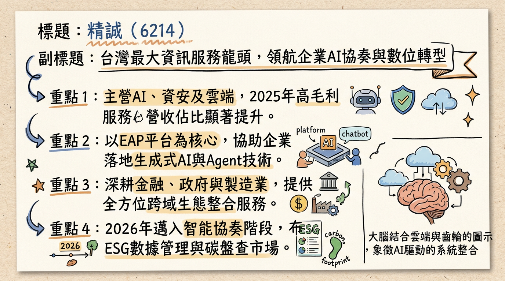
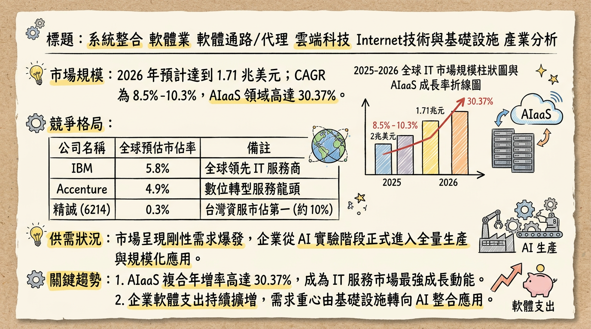
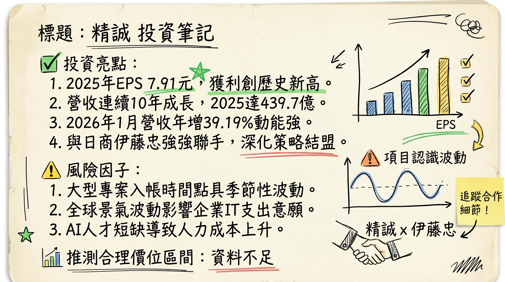

# 6214 精誠 深度研究報告：從系統整合轉型「AI 編排者」，獲利創歷史新高進入收割期

## 一句話摘要
精誠資訊（6214）憑藉 **AI Orchestration (智能協奏)** 轉型與 **Global IT Service (台商出海)** 雙引擎，2025 年 EPS 達 **7.91 元** 創歷史新高，2026 年 1 月營收年增 **39.19%** 展現強勁動能，正從傳統代理商估值轉向 AI 服務商評價。

---

## 公司概覽
精誠資訊為台灣資服業龍頭，已由傳統系統整合（SI）進化為「生態整合者」，並於 2026 年全面邁向 **Ai4iA (AI for Intelligent Action)** 階段。

**【2025 年營收結構與業務分布】**
| 業務群 | 營收佔比 | 毛利水準 | 核心產品與服務內容 |
| :--- | :--- | :--- | :--- |
| **VAD (增值代理分銷)** | 50% - 55% | 較低 | 代理 Microsoft、NVIDIA、Oracle 等軟硬體 |
| **SI (系統整合服務)** | 25% - 30% | 中等 | 雲地整合、混合雲託管、數位轉型專案 |
| **Industry (行業應用)** | 15% - 20% | 最高 | SYSTEX EAP (AI 平台)、FinTech、ESG 碳盤查系統 |

*   **地理營收貢獻：** 台灣 (81%)、海外 (19%，包含新加坡 SYSTEX Asia、中國、香港、日本、越南等共 50+ 據點)。

---

## 核心競爭優勢
1.  **AI Orchestration (AI 編排能力)：** 透過 **SYSTEX EAP** 平台，能將 Microsoft Copilot 或 NVIDIA 方案整合至企業既有 ERP/CRM 流程，解決原廠難以觸及的客製化落地問題。
2.  **龐大客戶基底：** 擁有台灣最廣泛的金融、製造與半導體客戶群，形成極高的轉換壁壘與資安剛性需求。
3.  **生態系聯防：** 透過併購（藍新、凱信、金橋資訊）與策略聯盟（日本伊藤忠），提供從底層基礎設施到高層 AI 應用的全棧式服務。

---

## 財務分析

**【近 6 個月月營收趨勢表格】**
| 月份 | 營收金額 (億元) | 月增率 MoM | 年增率 YoY | 備註 |
| :--- | :--- | :--- | :--- | :--- |
| **2026/01** | **44.62** | -2.11% | **+39.19%** | **歷年同期新高** |
| 2025/12 | 45.58 | +25.85% | +23.87% | 年底結案高峰 |
| 2025/11 | 36.22 | +13.42% | -11.53% | 基期影響 |
| 2025/10 | 31.93 | -40.62% | +10.89% | - |
| 2025/09 | **53.77** | +47.56% | **+58.66%** | 台積電/微軟專案認列 17.7 億 |
| 2025/08 | 36.44 | +1.24% | +37.34% | - |

**【年度財務總結】**
*   **2024 實際：** 營收 389.5 億元，EPS **7.66 元**。
*   **2025 實際：** 營收 439.7 億元 (年增 12.89%)，EPS **7.91 元** (歷史新高)。
*   **2026 預估：** 法人一致預期 EPS 落在 **8.0~8.4 元** 區間。

---

## 法說會重點
1.  **轉型方向：** 定位為「AI 編排者」，聚焦 AI 算力、算法、算數三算整合。
2.  **海外訂單：** SYSTEX Asia 已成為成長引擎，配合台商「China+1」政策，在東南亞與日本建廠之 IT 基礎設施訂單能見度高。
3.  **資本支出：** 聚焦 AI 算力中心建置及策略性併購（如 2026 年預計合併金橋資訊）。
4.  **訂單展望：** 半導體大廠軟體授權長約持續，金融業 AI 預算無上限，2026 年目標維持雙位數成長。

---

## 券商觀點

**【目標價與評等表】**
| 券商名/來源 | 目標價 | 評等 | 日期 | 關鍵理由 |
| :--- | :--- | :--- | :--- | :--- |
| **Investing.com** | **158.00 元** | 買入 | 2026/02/11 | AI 轉型商機與穩健殖利率 |
| **法人機構平均** | **125-140 元** | 增加持股 | 2026/02/25 | 2025 獲利超預期，上修 2026 EPS |
| **CMoney 法人** | **120 元** | 買進 | 2025/10/31 | 預估 2026 EPS 為 8.4 元 |

---

## 財報深度分析

**【利潤率趨勢表格】**
| 期間 | 毛利率 | 營業利益率 | 稅後淨利率 | EPS (元) |
| :--- | :--- | :--- | :--- | :--- |
| **2025 Q3** | 18.94% | 2.74% | 4.80% | 1.84 (估) |
| **2025 Q2** | 23.15% | 4.67% | 6.81% | 2.15 (估) |
| **2025 Q1** | 21.23% | 4.99% | 3.07% | 1.42 (估) |
| **2024 全年** | 22.00% | 3.50% | 5.20% | 7.66 |

*   **存貨分析：** 2025 Q3 存貨周轉天數回降至 **64.28 天**（Q2 為 79.72 天），顯示專案交付效率提升。
*   **資本支出：** 主要投入 AI 算力中心與資安監控中心 (SOC)，折舊穩定緩升。

---

## 股權異動與資本結構
1.  **重大合併：** 2026 年董事會決議將於股東常會報告與 **金橋資訊 (6133)** 合併，旨在強化基礎建設端綜效。
2.  **策略股東：** 日本 **伊藤忠商事 (Itochu)** 於 2025 年底取得約 1% 股權，雙方結盟進軍全球半導體 IT 服務。
3.  **申報轉讓：** 2025 年 3-5 月僅有經理人小額贈與轉讓（共 42 張），近期無大股東拋售。
4.  **股利政策：** 2026 年預計配息 **5.2 ~ 5.5 元**，殖利率維持在 **4.5% - 5%** 高防禦區間。

---

## 產業分析

**【台灣資服同業比較表 (2025 年數據)】**
| 公司 (代號) | 2025 營收 (億) | 毛利率 | EPS (元) | 2026/01 營收動能 |
| :--- | :--- | :--- | :--- | :--- |
| **精誠 (6214)** | **439.69** | **23.0%** | **7.91** | **+39.19%** |
| 零壹 (3029) | ~190 (估) | ~13% | ~5.0 (估) | +61.66% |
| 敦陽科 (2480) | ~85 (估) | ~26% | ~7.3 (估) | 穩健 |

*   **市場規模：** 全球 IT 服務 2026 年預計達 1.71 兆美元，其中 **AI 代理 (Agentic AI)** 為 2026 年核心成長區塊。
*   **競爭格局：** 精誠位居台灣第三（僅次於 IBM 與中華電信），在「雲地整合」與「中台彈性」上具備在地化優勢。

---

## 近期催化劑
*   **利多：**
    *   2026/01 營收創同期新高（+39%），開紅盤奠定 Q1 基調。
    *   入選標普永續年鑑，為台灣資服業唯一，吸引 ESG 基金配置。
    *   日本伊藤忠策略聯盟，帶動台積電供應鏈海外 IT 訂單。
*   **利空/風險：**
    *   人才競爭推升工程師人力成本。
    *   短期借款增加可能帶來利息壓力。
    *   地緣政治風險若升溫，可能導致企業縮減非核心 IT 支出。

---

## ⭐ 成長動能時間軸
*   **2025 Q4：** 完成凱信資訊、SYSTEX Asia 整合，海外營收佔比達 **19%**。
*   **2026 Q1：** **SYSTEX EAP** 受 600 位 CIO 評選為最信賴 AI 平台；1 月營收強勁。
*   **2026 Q2：** 股東會通過與 **金橋資訊** 合併案；公佈 2025 年度股利（預計 >5.2 元）。
*   **2026 Q3-Q4：** **Agentic AI (AI 代理)** 專案大規模交付，高毛利顧問與 API 服務貢獻放大。
*   **2026 全年：** 配合台商在日本、新加坡、越南建廠，海外獲利預計年增雙位數。

---

## 2026 展望
**成長動能：** AI 落地需求從實驗轉向生產，帶動軟體與服務佔比提升；海外擴張與策略夥伴（伊藤忠）綜效顯現。
**風險因子：** 全球通膨可能導致 IT 採購週期拉長；硬體專案佔比若過高會稀釋整體毛利率。

---

## 投資結論
1.  **獲利能見度高：** 營收連續十年創新高，2025 EPS 7.91 元優於預期。
2.  **AI 轉型收割期：** EAP 平台已獲得 CIO 市場認可，2026 年將由「專案認列」轉向更多的「訂閱/服務毛利」。
3.  **防禦與攻擊兼具：** 現金殖利率達 4.5% 以上具防禦性，AI 與海外併購則提供股價向上推升動力。
4.  **目標價區間建議：** 短期支撐 **115-120 元**；合理目標價看好 **135-145 元**；若 AI 訂閱制轉型成功，不排除挑戰券商共識之 **158 元**。

---
本報告由 AI 自動產生，資料來源為公開網路資訊，僅供參考，不構成投資建議。產生時間：2026-03-02 19:26

---

## 📊 資訊卡

