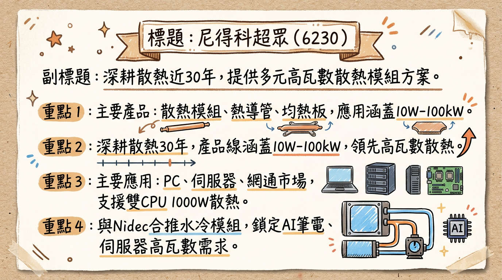
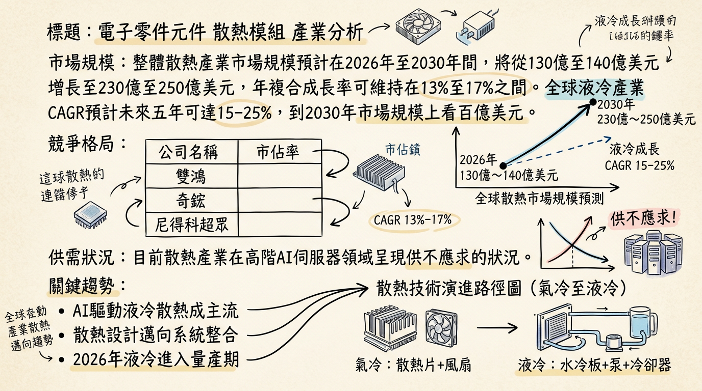
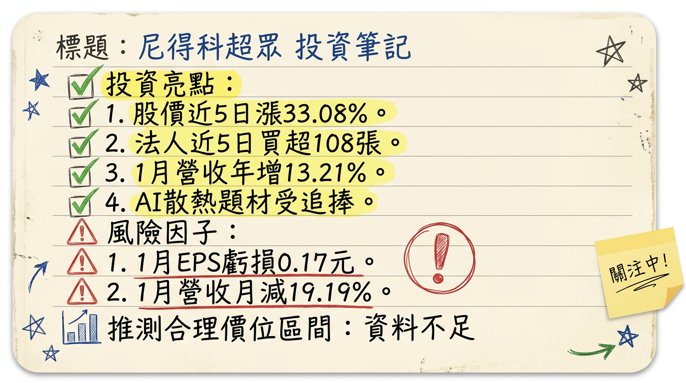

# 6230 尼得科超眾 深度研究報告

## 一句話摘要
尼得科超眾正積極轉型，將營運重心從傳統PC與遊戲機散熱轉向高成長潛力的AI伺服器與高階網通液冷散熱。儘管2025年面臨獲利挑戰並轉為虧損，公司預期在水冷產品的顯著成長（目標2026年營收佔比達10%）及越南擴產計畫下，營運與獲利能力有望在2026年逐步回升，重塑成長動能。

## 公司概覽
尼得科超眾科技股份有限公司（6230）成立於1973年12月14日，深耕散熱產業近30年，主要業務為散熱模組、散熱片、熱導管及微均熱板的製造與銷售。

**核心產品線與應用：**
*   **PC領域**：提供筆記型電腦/平板的薄型熱管/均熱板與風扇方案，以及遊戲筆電的薄型均熱板（90-280W）。未來將聚焦大直徑熱管（6mm提升至10mm/8mm提升至12mm）和薄型VC（1.4mm縮小至1.2mm），以滿足AI筆電和遊戲筆電 (25-280W) 的高瓦數需求。
*   **AIO/桌上型電腦**：提供大直徑熱管 (35-95W)。
*   **伺服器領域**：提供長熱管、大直徑熱管及3D VC（500-1000W/1400W）等氣冷散熱模組，以支援雙CPU 1000W散熱需求。
*   **網通領域**：提供VC模組（10-850W），可提升交換器散熱能力自400W至850W，基地台則從100W躍升至255W。
*   **水冷產品**：與母公司日本電產 (Nidec) 聯合開發水冷模組 (LCM)，並負責液冷散熱的水冷板 (Cold plate) 及分歧管 (Manifold)。Nidec主要負責資料中心的大型、高瓦數水冷產品如CDU (冷卻分配裝置)。水冷產品涵蓋CPU/GPU/ASIC/PCIE水冷模組。

**營收結構（依產品應用別，2025年Q2趨勢）：**

| 產品線     | 2025年Q2營收佔比 | 2021年伺服器佔比 | 2022年遊戲機高峰 | 2025年H1水冷佔比 |
| :--------- | :--------------- | :--------------- | :--------------- | :--------------- |
| PC         | 約47%            | -                | -                | -                |
| 伺服器     | 約24%            | 16%              | -                | -                |
| 網通       | 約17%            | -                | -                | -                |
| 遊戲機     | 約9%             | -                | 26%              | -                |
| 水冷產品   | -                | -                | -                | 2-5%             |
| 散熱模組\* | 75% (2024資訊)   | -                | -                | -                |
| 散熱片\*   | 19% (2024資訊)   | -                | -                | -                |
\*2024年產品比重數據。

**製造基地：**
生產基地遍及台灣、中國（崑山、重慶）及越南。
*   **中國崑山廠**：主要負責水冷模組（LCM）的生產。
*   **泰國廠**：負責水冷相關關鍵零組件，如快接頭、冷卻分配裝置（CDU）的製造。
*   **越南廠**：持續擴充產能，預計2026年越南產能將提升至現有規模的1.5倍。

**所屬細分產業與相關題材：**
*   **細分產業**：電子零件元件 - 散熱模組（電腦及週邊設備業）。
*   **相關題材**：
    *   **AI伺服器與高階網通散熱**：營運策略已轉向高成長領域，積極切入AI伺服器水冷散熱。
    *   **水冷散熱**：與母公司Nidec合作發展水冷板、分歧管及LCM，預期營收佔比顯著提升（預計2026年達10%）。
    *   **高瓦數氣冷方案**：深化氣冷技術，提供大直徑熱管、薄型均熱板（Slim VC）和3D VC等高瓦數方案。

## 核心競爭優勢
1.  **母公司 Nidec 的強大後盾與技術整合：** 尼得科超眾為日本電產（Nidec）集團成員，Nidec在電機、馬達及數據中心解決方案領域具領導地位。雙方聯合開發水冷模組（LCM），Nidec負責CDU，超眾負責水冷板與分歧管，結合集團資源搶攻高階散熱市場，特別是在AI伺服器液冷領域具備系統級解決方案的潛力。
2.  **多元且深厚的散熱技術積累：** 公司深耕散熱產業近30年，在傳統氣冷散熱領域擁有從熱管、均熱板到3D VC的完整技術，能提供從PC（25-280W）到伺服器（500-1400W）的高瓦數氣冷方案。這種技術基礎為向液冷轉型提供了堅實的基礎。
3.  **戰略性轉型聚焦高成長市場：** 面對PC與遊戲機市場的疲軟，公司果斷調整營運策略，將資源重心轉向AI伺服器與高階網通設備。伺服器營收佔比已從2021年的16%提升至2025年Q2的24%，顯示轉型成效逐步顯現，瞄準了產業未來最主要的成長驅動力。
4.  **全球化生產佈局與供應鏈彈性：** 擁有台灣、中國（崑山、重慶）及越南等多地生產基地，並計劃在2026年將越南廠產能擴充1.5倍。這種佈局不僅能分散地緣政治風險，也提升了供應鏈彈性，更好地服務全球客戶。

## 財務分析

### 月營收趨勢
| 月份     | 金額 (億元新台幣) | 月增率 (MoM) | 年增率 (YoY) |
| :------- | :---------------- | :----------- | :----------- |
| 2026 年 1 月 | 7.49              | -19.19%      | +13.21%      |
| 2025 年 12 月 | 9.27              | +20.44%      | +22.76%      |
| 2025 年 11 月 | 7.69              | -2.42%       | +6.93%       |
| 2025 年 10 月 | 7.88              | +3.81%       | +11.07%      |
| 2025 年 9 月 | 7.59              | -0.79%       | +0.94%       |
| 2025 年 8 月 | 7.65              | -3.20%       | +6.58%       |

### 季度數據
*   **2025 年第四季 (Q4)：**
    *   季營收：新台幣 24.86 億元。
    *   稅前淨利：虧損新台幣 1.3 億元。
    *   本期淨利：虧損新台幣 0.99 億元。
    *   每股盈餘 (EPS)：虧損新台幣 1.14 元。
*   **2025 年第三季 (Q3)：**
    *   毛利率：9.69%。
    *   營業利益率：-6.77%。
    *   每股盈餘 (EPS)：虧損新台幣 2.1 元。
*   **2025 年第二季 (Q2)：**
    *   營收淨額：新台幣 42.91 億元 (上半年累計)。
    *   毛利率：16.98%。
    *   純益率：2% (上半年累計)。
    *   每股盈餘 (EPS)：新台幣 1.57 元。

### 年度趨勢
*   **2024 年實際：**
    *   全年營收：新台幣 81.24 億元。
    *   全年 EPS：新台幣 1.48 元。
*   **2025 年實際：**
    *   全年營收：新台幣 90.94 億元。
    *   全年 EPS：虧損新台幣 2.44 元。

## 法說會重點 (2025年8月29日)
*   **營運概況：** 2025年上半年受遊戲機與PC市場需求疲軟影響，營運面臨挑戰，上半年EPS為新台幣0.8元（註：與後續提供之上半年累計EPS 1.57元有出入，以累計數據為準）。公司正調整策略，轉向高成長潛力的伺服器與網通設備市場。
*   **產品線展望：**
    *   **PC產品：** 仍為營收主要來源（2025年Q2約佔47%），但公司將資源重點轉向高成長市場。
    *   **伺服器/網通產品：** 伺服器佔比從2021年16%提升至2025年Q2的24%，網通同步增長至17%。管理層預期下半年在遊戲機、中國伺服器客戶及美國網通訂單帶動下，營運將有所改善。
    *   **遊戲機產品：** 佔比由2022年高峰26%下滑至2025年Q2的9%。
    *   **水冷模組 (LCM)：** 已進入小量量產並完成整線布局，小量出貨中，正與客戶進行驗證。預計2025年營收佔比約2-5%，**2026年有機會成長至10%**。
    *   **分歧管 (Manifold)：** 仍處樣品驗證階段，已提供樣品給客戶測試，預計2026年有機會小量出貨，未來將轉移至中國及越南進行大規模生產。
    *   **高瓦數氣冷方案：** 已規劃至2028年的產品藍圖，從均熱板模組(600-850W)進化至3D VC (1000-1400W)及3D VC Fin方案。
    *   **水冷產品：** 已具備Intel及AMD平台的CPU水冷模組(LCM)量產能力，並持續開發歧管(Manifold)、ASIC及PCIE水冷模組。
*   **產能利用率與資本支出：**
    *   目前中國廠區稼動率約80%。
    *   積極擴充越南廠產能，預計**2026年越南產能將提升至現有的1.5倍**。
    *   中國崑山廠主要供應水冷板，泰國廠則支應快接頭、CDU等零組件。
    *   公司持續投資工廠自動化，以應對客戶供應鏈多元化需求。
*   **管理層 Guidance：**
    *   展望2025年下半年，預期營運將有所改善，目標是將獲利能力恢復至2023年前的水準。
    *   毛利率有望在2026年出現大躍進，有望回到2020年22%的水位。
    *   長期來看，網通與伺服器市場所帶來的高瓦數散熱需求，將是持續推升公司營運的核心動能。

## 券商觀點
目前僅找到一份由群益證券發布的目標價報告，日期推測為2025年底至2026年初，主要依據為對2024年的預估。

| 券商名稱 | 目標價 (新台幣) | 評等 | 日期 (報告發布時間) |
| :------- | :-------------- | :--- | :---------------- |
| 群益證券 | 200             | 中立 | 2025年底至2026年初 (根據內容推測) |

**註記**：群益證券報告中，2024年營收預估約新台幣84.51億元、EPS約3.06元。然而，尼得科超眾2024年實際全年營收為新台幣81.24億元，EPS為新台幣1.48元，與群益預估有落差。且2025年實際全年為虧損新台幣2.44元，使得此目標價的參考性需重新評估。

## 財報深度分析

### 利潤率趨勢
尼得科超眾的利潤率在2025年因市場需求疲軟與產品組合調整面臨壓力，第三季已轉為負數。

| 年度/季度   | 毛利率 (%) | 營業利益率 (%) | 稅後淨利率 (%) |
| :---------- | :--------- | :------------- | :------------- |
| 2024年上半年 | 18         | -              | 2              |
| 2025年上半年 | 17         | -              | 2              |
| 2025年第三季 | 9.69       | -6.77          | -7.81          |

**利潤率變化的原因分析：**
2025年上半年營運主要受遊戲機與PC市場需求疲軟影響。第三季毛利率與淨利率顯著下滑，反映市場競爭加劇以及高瓦數散熱產品在初期量產階段的成本壓力。公司正調整營運策略，將資源重點轉向高成長潛力的伺服器與網通設備市場，並看好水冷散熱為未來關鍵成長動能，有望帶動2026年毛利率回升至2020年22%的水準。

### 存貨分析與資本支出
*   **存貨與營運：** 目前搜尋結果未明確指出尼得科超眾有異常存貨堆積或備料現象，也未找到最新且具體的存貨金額、存貨週轉天數及應收帳款週轉天數趨勢。
*   **資本支出與產能：**
    *   未找到2023-2025年具體的資本支出金額，但公司持續投資工廠自動化。
    *   **未來計畫：** 預計2026年越南廠產能將提升至現有的1.5倍。水冷產品的生產佈局為崑山廠負責水冷板，泰國廠生產快接頭、CDU等零件。
*   **折舊攤銷：** 未找到2024-2026年的最新折舊攤銷趨勢。

### 其他財報重點
*   **負債比率：** 2024年上半年為41%。未找到2025-2026年最新數據。
*   **自由現金流量：** 未找到2024-2026年的自由現金流量趨勢。
*   **業外收支：** 目前未提及2024-2026年有重大的業外收支項目。

## 股權異動
*   **董監事/大股東申報轉讓：** 截至2026年1月，未有2025-2026年最新紀錄。
*   **庫藏股買回：** 未找到2024-2026年最新紀錄。
*   **可轉換公司債（CB）：** 未找到2025-2026年相關資訊。
*   **現金增資或減資：** 未找到2025-2026年計畫。
*   **股利政策：**
    *   **2025年股利（歸屬2024年度盈餘）：** 現金股利0.22元，股票股利0元。
    *   **2024年股利（歸屬2023年度盈餘）：** 現金股利1.05元，股票股利0元。
    *   **2023年股利（歸屬2022年度盈餘）：** 現金股利1.07元。
*   **股權結構（截至2026年2月6日）：**
    *   外資持股佔87.06%。
    *   大戶（持股超過1,000張以上）佔87.74%。
    *   董監持股佔86.3%。
    *   最大股東為日本電產株式會社，持股48%（截至2023年年報）。
    *   全體董監質押股票張數總計0張，質押比例約0%。

## 產業分析

### 市場規模與成長率
散熱產業因AI算力需求急速拉升，從傳統氣冷轉向液冷散熱，迎來新一波高成長動能。
*   **全球液冷產業年複合成長率（CAGR）**：預計未來五年可達15–25%，到2030年市場規模上看百億美元。
*   **整體散熱產業市場規模**：預計在2026年至2030年間，將從130億至140億美元增長至230億至250億美元，年複合成長率可維持在13%至17%之間。

### 供需狀況
高階AI伺服器散熱領域呈現**供不應求**。隨著AI晶片功耗提升（NVIDIA B200/B300突破1,000W），液冷散熱已成為新一代AI伺服器的必要配置。這使得散熱設計從單顆晶片水冷升級為整櫃液冷，推升液冷產品需求。預計2026年將是液冷散熱從驗證走向實際量產的轉折點。

### 產業的平均毛利率水準
鑑於AI伺服器液冷方案的技術要求高，高階散熱產品的毛利率有望提升。例如，雙鴻因液冷產品帶動，2025年第四季毛利率已衝上29.76%。尼得科超眾2025年上半年毛利率為17%，公司預期毛利率有望在2026年回歸2020年22%的水準。

### 競爭格局
台灣散熱模組廠在全球AI伺服器散熱供應鏈中扮演關鍵角色，主要廠商包括奇鋐（3017）、雙鴻（3324）、健策（3653）以及尼得科超眾（6230）。

#### 尼得科超眾 vs 主要競爭對手的具體比較

| 項目       | 尼得科超眾 (6230)                                | 奇鋐 (3017)                                      | 雙鴻 (3324)                                        | 健策 (3653)                                     |
| :--------- | :----------------------------------------------- | :----------------------------------------------- | :------------------------------------------------- | :---------------------------------------------- |
| **技術**   | 氣冷 (熱管, 均熱板, 3D VC)；液冷 (LCM, 水冷板, 分歧管, 與Nidec合作)；聚焦大直徑熱管、薄型VC、3D VC | 水冷板、冷卻模組、整合式散熱解決方案；輝達主力供應商 | 液冷 (Cold Plate, CDM, CDU)；深耕資料中心與HPC；MLCP技術佈局 | 均熱片龍頭、熱擴散蓋、冷板、新一代微通道蓋板 (MCL) |
| **產能**   | 越南廠2026年擴產1.5倍；崑山廠(LCM), 泰國廠(快接頭, CDU) | 考慮越南擴廠 (2026年中起陸續投產)                | 泰國廠二期最快2025Q1量產，評估三期；Cold Plate月產能擴增 | 未明確提及最新擴產                               |
| **客戶**   | AI伺服器/高階網通，既有品牌/ODM客戶，美超微(Supermicro)供應鏈成員之一 | NVIDIA (GB200/300, Rubin), 美系雲端服務商 (ASIC) | NVIDIA機櫃水冷散熱、AWS Trainium、CSP端        | AI GPU、ASIC (受惠熱功耗提升)                  |
| **產品價格** | 無具體數據，液冷產品價值量高於氣冷                 | 無具體數據，液冷產品價值量高於氣冷                 | 無具體數據，液冷產品價值量高於氣冷                 | 無具體數據，高階均熱片價值量高                   |

#### 台灣同業財務比較 (2025年，若無最新則為2024年資料)

| 公司名稱     | 股號 | 2025年營收 (億元新台幣) | 2025年毛利率 (%) | 2025年EPS (元新台幣) |
| :----------- | :--- | :---------------------- | :--------------- | :------------------- |
| 奇鋐         | 3017 | ~574.6 (前三季累計估計) | ~29.7 (前三季估計) | 32.25 (前三季累計)   |
| 雙鴻         | 3324 | 232.76 (全年)           | 27.38 (全年)     | 28.26 (全年)         |
| 健策         | 3653 | 202.75 (全年)           | 43 (H1散熱產品)  | 未提供               |
| **尼得科超眾** | 6230 | 90.94 (全年)            | 9.69 (Q3)        | -2.44 (全年)         |

### 產業趨勢
1.  **液冷散熱的普及與進化：**
    *   **趨勢：** AI晶片功耗持續飆升（NVIDIA B200/B300突破1,000W），傳統氣冷散熱已達極限，液冷散熱正從高階選配轉變為AI伺服器的必要配置。預計2026年AI晶片液冷滲透率將達47%。
    *   **影響：** 推升水冷板、冷卻液分配裝置（CDU）、分歧管等液冷零組件需求，並促使散熱設計從單晶片水冷升級為整櫃液冷系統工程。
2.  **微通道水冷板（MLCP/MCCP）技術的發展：**
    *   **趨勢：** 為應對GPU功耗持續提升，MLCP/MCCP等更高效散熱技術成為新一代標準。輝達Rubin Ultra晶片（2027年）單顆TDP可能突破3,000W，將導入晶片級散熱Micro channel Lid(MCL)技術。
    *   **影響：** 對流道結構、導熱效率、材料精密度都提出更高要求，台灣廠商已送樣並進入測試階段，最快2025年有望量產。
3.  **高壓直流電（HVDC）與光傳輸（矽光子）的導入：**
    *   **趨勢：** AI對速度和功耗要求驅動HVDC提升電源效率、矽光子解決電傳輸瓶頸。
    *   **影響：** HVDC減少電流、降低熱量；光傳輸解決電傳輸速度問題。這些趨勢將推動電力與散熱的整體解決方案發展。

### 對尼得科超眾的具體機會和威脅
*   **機會：**
    *   **高瓦數散熱需求：** 網通與伺服器高瓦數散熱需求為公司營運核心動能。
    *   **水冷產品業務：** 水冷模組已小量量產，預計2026年營收佔比達10%，與Nidec合作結合集團資源搶攻市場。
    *   **PC和遊戲機市場回溫：** 2025年下半年遊戲機需求回溫，陸系伺服器訂單增長，營運動能有望放大。
    *   **產能擴充：** 2026年越南廠產能將提升1.5倍，因應客戶需求與供應鏈移轉。
*   **威脅：**
    *   **PC及遊戲機市場疲軟：** 2025年上半年營運受PC與遊戲機需求疲軟影響，遊戲機佔比顯著下滑。
    *   **總經與地緣政治風險：** 關稅與匯率變動帶來不確定性，以及「去中化」需求下的供應鏈調整成本。
    *   **競爭加劇：** 液冷市場放大吸引更多競爭者，毛利率可能受擠壓。公司需在系統級解決方案、與平台方共設計、全球交付能力等方面提升。
    *   **高階液冷技術進程：** 微通道水冷板等新一代技術競爭激烈，公司需持續投入研發並加速產品化。

### 相關投資題材
*   **AI：** AI伺服器為散熱產業最大驅動力。尼得科超眾積極轉向伺服器與網通領域，發展水冷產品支援高瓦數AI運算，直接受益於AI題材。
*   **HBM（高頻寬記憶體）：** AI晶片高度整合HBM帶來更高熱量，促使散熱方案必須有效處理集中熱源。尼得科超眾在伺服器領域的散熱解決方案將間接受益於HBM發展。
*   **電動車：** 電動車電池、馬達等散熱需求高。尼得科超眾的母公司Nidec在馬達領域領先，未來有可能整合集團資源，擴展電動車散熱佈局。

## 近期催化劑
**利多事件：**
*   **AI散熱需求噴發：** AI伺服器水冷散熱需求強勁，市場預期2026年為液冷散熱從驗證走向量產的轉折點，尼得科超眾為其供應鏈成員之一。
*   **水冷業務成長可期：** 2025年8月法說會明確指出水冷模組已小量量產，預計2026年營收佔比有望提升至10%。分歧管預計2026年小量出貨。
*   **美超微供應鏈：** 尼得科超眾在AI伺服器水冷市場中是美超微(Supermicro)供應鏈成員之一，有望受惠於其訂單成長。
*   **產能擴充：** 越南廠持續擴充產能，預計2026年將提升至現有1.5倍，以因應客戶需求。
*   **營運策略轉型：** 公司將重心轉向高成長的伺服器與網通領域，並預期2025年下半年營運將改善，目標獲利能力恢復至2023年前水準，毛利率有望在2026年回歸22%。
*   **股價表現：** 2026年2月底至3月初因AI散熱題材帶動，股價短期內飆漲逾5成，顯示市場對其未來成長動能高度期待。

**利空事件：**
*   **2025年全年及2026年1月虧損：** 2025年全年稅後虧損2.44元，2026年1月自結每股虧損0.17元，年減160%，顯示轉型初期仍面臨獲利壓力。
*   **PC與遊戲機市場疲軟：** 2025年上半年營運受此影響，遊戲機佔比由高峰26%顯著下滑至9%。
*   **關稅與匯率不確定性：** 總體經濟風險可能持續影響營運。
*   **股價波動與注意股：** 短線股價飆漲逾5成，遭證交所列為注意股，評價面壓力及市場過度反應風險需納入考量。
*   **董監事/大股東異動：** 2025年12月31日公告獨立董事辭職。

## ⭐ 成長動能時間軸

| 時間點     | 成長動能類別     | 具體事件與量化目標                                           |
| :--------- | :--------------- | :----------------------------------------------------------- |
| 2025年8月29日 | **水冷產品**     | 水冷模組(LCM)已進入小量量產並完成整線布局，小量出貨中，正與客戶驗證。 |
| 2025年8月29日 | **高瓦數氣冷**   | 高瓦數氣冷方案已規劃至2028年的產品藍圖，從均熱板模組(600-850W)進化至3D VC (1000-1400W)及3D VC Fin方案。 |
| 2025年8月29日 | **產能擴充**     | 中國崑山廠主要供應水冷板；泰國廠支應快接頭、CDU等零組件，已完成產線佈局。 |
| 2025年8月29日 | **需求面**       | AI、HPC等高熱通量應用驅動散熱技術朝3D VC及水冷方案發展；網通與伺服器市場所帶來的高瓦數散熱需求，為公司營運核心動能。 |
| 2025年下半年 | **市場需求**     | 預期在遊戲機、中國伺服器客戶及美國網通訂單帶動下，營運有所改善。 |
| 2026年       | **水冷產品**     | 水冷產品預計營收佔比達10%。分歧管(Manifold)有機會小量出貨。 |
| 2026年       | **產能擴充**     | 越南廠產能將提升至現有規模的1.5倍；分歧管未來將轉移至中國及越南進行大規模生產。 |
| 2026年       | **新客戶/市場**  | AI伺服器水冷市場中是美超微(Supermicro)供應鏈成員之一，並積極拓展其他客戶，成果可望今年顯現。 |
| 2026年       | **財務目標**     | 毛利率有望回到2020年22%的水位。                              |
| 2027年       | **產業趨勢**     | 輝達Rubin Ultra晶片（預計）單顆TDP可能突破3,000W，將導入晶片級散熱Micro channel Lid(MCL)技術，為散熱廠帶來新技術挑戰與機會。 |

## 2026 展望
**成長動能：**
尼得科超眾2026年的主要成長動能將來自：
1.  **AI伺服器與高階網通領域的深耕：** 公司已明確將策略重心轉移至此，AI應用訂單能見度樂觀（客戶正式訂單約三個月，預測需求可達半年）。
2.  **水冷散熱產品的顯著放量：** 水冷模組(LCM)及分歧管(Manifold)已進入量產/驗證階段，預計2026年水冷營收佔比將從2025年上半年的2-5%大幅提升至**10%**，成為營運成長的關鍵驅動力。
3.  **越南廠區產能擴充：** 預計2026年越南產能將提升至現有規模的**1.5倍**，不僅能滿足日益增長的客戶需求，也能提升成本競爭力與全球供應彈性。
4.  **獲利能力恢復：** 公司目標是將獲利能力恢復至2023年以前的水準，並預期毛利率有望在2026年回到2020年**22%**的水位。

**風險：**
儘管成長潛力可期，尼得科超眾仍面臨以下風險：
1.  **傳統產品線拖累：** PC及遊戲機市場需求若持續疲軟，可能拖累整體營收及獲利表現。
2.  **產業競爭激烈：** 液冷散熱市場吸引眾多競爭者，產品標準化和集中採購可能對毛利率構成壓力。尼得科超眾需在技術領先、成本控制及系統整合能力上持續強化。
3.  **液冷產品良率與成本控制：** 水冷模組初期量產的良率與成本控制將是關鍵，若進展不如預期，可能影響獲利貢獻。
4.  **總體經濟不確定性：** 全球經濟景氣、地緣政治、關稅與匯率變動等總體經濟因素仍可能對公司營運造成干擾。
5.  **估值壓力：** 股價近期因AI題材短期內飆漲，但公司2025年全年虧損及2026年1月仍虧損，市場對未來成長的預期已提前反映，若成長動能不如預期，股價可能面臨回檔壓力。

## 投資結論
尼得科超眾正處於關鍵的戰略轉型期，從傳統氣冷散熱市場轉向高成長的AI伺服器液冷散熱領域，其未來成長性值得關注。

1.  **轉型陣痛與黎明曙光：** 2025年全年虧損新台幣2.44元及2026年1月每股虧損0.17元，顯示轉型初期伴隨獲利壓力。然而，公司將營運重心轉向AI伺服器與高階網通散熱的策略方向正確，且液冷產品（水冷模組、分歧管）已進入量產/驗證階段，預計2026年水冷營收佔比達10%，是未來成長的明確信號。
2.  **液冷市場的潛力與集團協同效應：** 液冷散熱是AI伺服器高功耗的必然選擇，市場前景廣闊。尼得科超眾與母公司Nidec在水冷產品上的聯合開發與分工（超眾負責水冷板/分歧管，Nidec負責CDU）形成集團綜效，有助於其在競爭激烈的市場中取得一席之地，並在系統級解決方案上提升競爭力。
3.  **產能擴充與成本優化：** 預計2026年越南廠產能擴充1.5倍，有助於降低生產成本，提升全球供應彈性，以應對客戶在供應鏈多元化上的需求，進一步鞏固其市場地位。
4.  **獲利能力復甦的關鍵驗證：** 公司管理層預期2025年下半年營運改善，並在2026年將毛利率恢復至22%的水準。這將是市場評估其轉型成功與否的關鍵指標。投資者需密切追蹤後續季度財報，尤其關注毛利率與液冷產品營收貢獻的實際進展。
5.  **評價面考量：** 雖然公司2025年全年虧損，但股價近期因AI散熱題材已大幅上漲。市場正給予其高度的未來成長溢價。考量到成長潛力，但同時也存在轉型期間的執行風險和市場競爭壓力，建議投資者應以中長期眼光看待。

**投資建議：** 建議投資者維持中立偏多評等，並密切關注公司在水冷產品的訂單能見度、實際出貨量、毛利率恢復情況及越南廠產能利用率。若公司能成功達成2026年水冷營收佔比10%、並將毛利率恢復至22%的目標，則其估值有望重回高點，建議**觀察區間 NT$180 - NT$220**。然而，考量2025年全年虧損及2026年Q1仍虧損，短期股價仍需留意財報表現與市場情緒的波動。

本報告由 AI 自動產生，資料來源為公開網路資訊，僅供參考，不構成投資建議。產生時間：2026-03-06 00:27

---

## 📊 資訊卡

