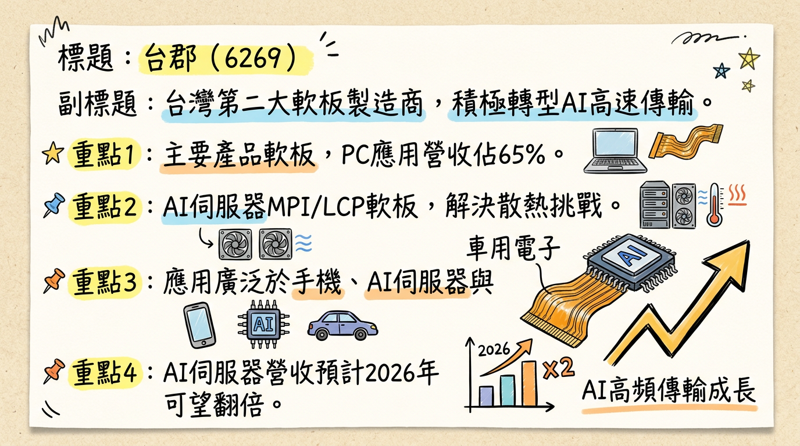
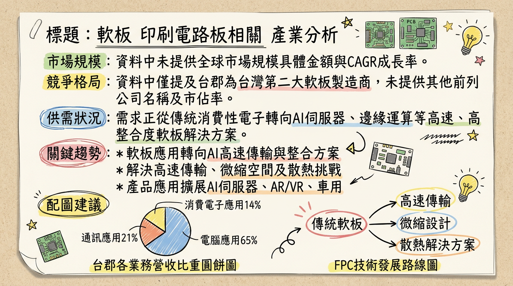
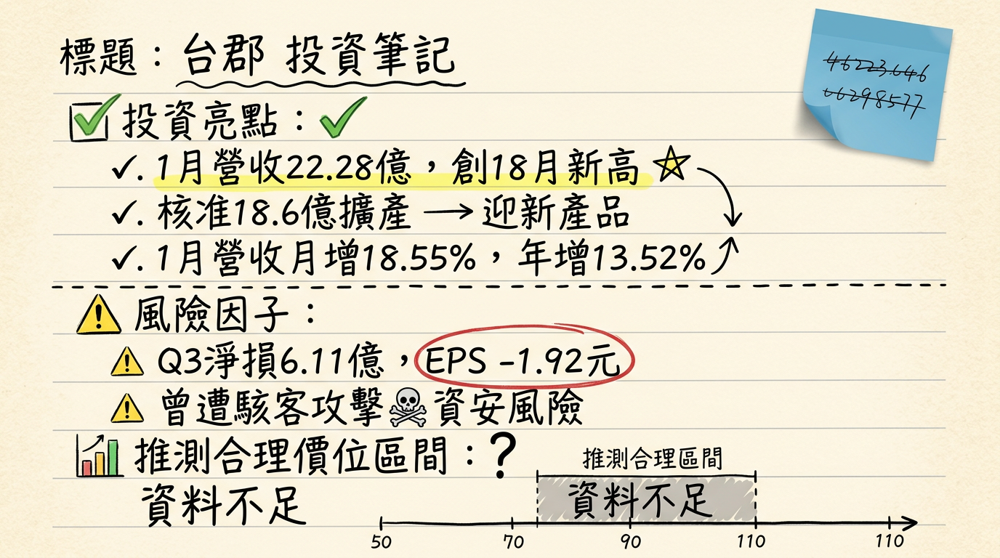

# 6269 台郡 深度研究報告

## 一句話摘要
台郡（6269）正積極從傳統消費性電子軟板製造商轉型為AI高速傳輸解決方案領航者，儘管2025年面臨轉型陣痛與獲利低谷，但憑藉MetaLink技術、AI伺服器高階軟板的成功佈局及客戶新產品產能建置，預期2026年營運將迎來強勁復甦，AI業務可望翻倍成長，有望重返2021-2022年獲利水準。

## 公司概覽
台郡是台灣第二大軟板（FPC）製造商，主要生產軟性單層板、雙層板、多層板及軟硬結合板，並提供軟板模組（FPCA）與電子訊號傳輸解決方案。公司願景定位為「電子訊號傳輸解決方案」的領航者，積極佈局AI高速傳輸領域，核心解決方案包括為AI伺服器開發的MPI (Micro Pitch Interconnect) 與LCP (Liquid Crystal Polymer) 軟板整合方案，以應對空間微縮與散熱挑戰。此外，公司將導入自主創新的MetaLink技術，聚焦於AI伺服器高速傳輸、AI邊緣運算裝置及智慧行動裝置等產品開發。產品應用涵蓋手機、筆電、平板、穿戴式裝置、消費性電子、AI伺服器、AR/VR、智慧眼鏡、光通訊及車用電子等。製造基地分佈於台灣高雄（和發廠負責電鍍、設計、鑽孔）和中國昆山（負責組裝、檢測）。

### 營收結構概覽 (2025年第一季)

| 應用領域 | 佔營收比例 |
| :------- | :-------- |
| PC應用   | 65%       |
| 通訊應用 | 21%       |
| 消費電子 | 14%       |
| **合計** | **100%**  |

*備註：AI伺服器相關應用預期2025年營收佔比為高個位數百分比，並預計在2026年至少可望翻倍成長。*

## 核心競爭優勢
1.  **AI高速傳輸技術領先：** 台郡積極投入AI伺服器高階軟板領域，成功開發MPI與LCP軟板整合方案，並將導入自主創新的MetaLink技術。這些技術旨在解決AI伺服器在高頻高速傳輸、空間壓縮和散熱方面的嚴苛挑戰，使其在AI訊號傳輸領域具備獨特優勢。
2.  **高階軟板製程能力：** 公司已具備10～20層高階軟板製程能力，並推動以高速軟板取代20～100公分傳統短距纜線，應用於機櫃內GPU／CPU模組的高速傳輸，提升產品附加價值和技術門檻。
3.  **成功切入指標客戶供應鏈：** 已切入輝達（NVIDIA）AI伺服器液冷系統的感測器供應鏈，並獲得AI客戶採用出貨，顯示其高階產品的市場認可度與技術實力。
4.  **產品組合轉型與分散風險：** 透過佈局AI伺服器、AI邊緣運算、AR/VR、智慧眼鏡、光通訊及車用電子等新興高成長領域，逐步降低對傳統消費性電子市場的依賴，優化產品組合並分散營運風險。

## 財務分析

### 月營收趨勢

| 月份    | 金額 (新台幣億元) | 月增率 MoM | 年增率 YoY |
| :------ | :---------------- | :--------- | :--------- |
| 2026年1月 | 22.28             | +18.55%    | +13.52%    |
| 2025年12月 | 18.79             | +1.03%     | -3.34%     |
| 2025年11月 | 18.60             | +0.75%     | -1.89%     |
| 2025年10月 | 18.46             | -14.41%    | +0.71%     |
| 2025年9月 | 21.57             | +9.46%     | +9.20%     |
| 2025年8月 | 19.71             | +0.19%     | -6.57%     |

### 季度數據
**2025年第三季財報**：
*   季營收：新台幣60.95億元
*   營業毛利率：1.3%
*   營業淨損率：-13.8%
*   單季每股稅後虧損 (EPS)：新台幣-1.92元

### 年度趨勢

| 年度       | 全年度營收 (新台幣億元) | 每股稅後盈餘 (EPS) |
| :--------- | :-------------------- | :----------------- |
| 2024年 (實際) | 264.43782             | -2.56 元           |
| 2025年 (預估) | 242.4484 (中位數)     | -3.04 元 (中位數)  |

*備註：2025年EPS預估另有券商給出-5.87元。FactSet於2025年8月19日將2025年EPS預估從-2.66元下修至-3.04元。*

## 法說會重點 (2025年11月6日及相關資訊)
*   **最新法說會日期：** 台郡受邀參加凱基證券舉辦的法人說明會，說明2025年第四季營運成果，日期為**2026年3月10日下午4點**。
*   **2025年第三季營運回顧：** 單季每股虧損新台幣1.92元，累計前三季每股淨損為新台幣5.09元。
*   **管理層對各產品線說明：**
    *   **2025年第四季：** 產能出貨預估與第三季約略相當，其中AI伺服器可望有雙位數成長。
    *   **手機業務：** 2025年下半年手機業務量較2024年同期顯著提升，若以規格片數來看約估計從2-4片，至2026年再翻倍拉升2-3片（此處指片數增加，非倍數）。手機軟板從4層板升級至6層板，帶動單價與技術門檻提升。
    *   **AI伺服器：** 台郡的解決方案已獲得AI客戶採用出貨，預期AI伺服器營收占比2025年為高個位數百分比，2026年至少可翻倍成長。
    *   **技術能力：** 已具備10～20層高階軟板製程能力，並正推動以高速軟板取代20～100公分傳統短距纜線，應用於機櫃內GPU／CPU模組的高速傳輸。
    *   **MetaLink技術：** 已導入極低損耗（Extreme Low Loss）材料，並搭配獨有技術的MetaLink製程以對應高速信號傳輸。相關模組已與連接器廠合作，將透過自有SMT產線出貨。MetaLink製程亦將是未來數年資本支出主軸，目標銜接2026年新平台導入節奏。
*   **資本支出金額：** 董事會於2026年2月9日核准新增資本支出預算案，投資金額達新台幣**18.6億元**，主要為配合客戶新產品的產能建置需求。
*   **管理層對下季/下半年 guidance：**
    *   預期2025年營運仍處轉型低谷，但2026年營運將蓄勢待發，轉型成為訊號傳輸解決方案提供商，導入自主創新的MetaLink技術，聚焦AI伺服器高速傳輸、AI邊緣運算裝置與智慧行動裝置等解決方案的產品開發。
    *   公司表示2025年力求轉虧為盈，並預期2026年營運將完全恢復2021-2022年表現。
    *   非手機產品方面，2025年AI伺服器高速運算、AR/VR、智慧眼鏡等新產品均可望較2024年倍數成長，且2026年亦可望倍數年成長。

## 券商觀點

### 券商目標價

| 券商名稱     | 目標價 (新台幣) | 評等 | 日期       |
| :----------- | :-------------- | :--- | :--------- |
| 元富證券投顧 | 80              | 買進 | 2025/11/11 |
| 國票證券投顧 | 80              | 買進 | 2025/11/07 |
| FactSet調查  | 67              | 中立 | 2025/08/31 |

*備註：FactSet於2025年8月31日將台郡目標價中位數由63.5元上修至67元，調升幅度5.51%。*

### 2025-2026年EPS預估
*   **FactSet調查 (2025年8月19日)：**
    *   2025年EPS預估：中位數-3.04元 (最高0.02元，最低-7.36元)。
    *   2026年EPS預估：中位數2.23元 (最高6.8元，最低-1.43元)。
*   **元富證券投顧 (2025年11月11日)：**
    *   2025年EPS預估：-5.87元。
*   **綜合評級方面：** FactSet於2025年8月31日顯示，6位分析師中，2位給予積極樂觀、5位保持中立、0位保守悲觀。

## 財報深度分析

### 利潤率趨勢 (2024Q1-2025Q3)

| 季度   | 營收 (新台幣億元) | 毛利率   | 營業利益率 | 稅後淨利率 | EPS (新台幣) |
| :----- | :---------------- | :------- | :--------- | :--------- | :----------- |
| 225Q3  | 60.95             | 1.3%     | -13.8%     | -10.0%     | -1.92        |
| 225Q1  | N/A               | 0.5%     | N/A        | N/A        | -1.76        |
| 2024Q4 | 87.16             | 19.3%    | 6.9%       | 8.3%       | 2.15         |
| 2024Q3 | N/A               | 22.8%    | 10.3%      | 11.2%      | 2.76         |
| 2024Q2 | N/A               | 16.5%    | 3.0%       | 3.4%       | 0.81         |
| 2024Q1 | N/A               | 15.6%    | 2.1%       | 2.5%       | 0.61         |

*註：2025Q1-Q3僅提供季毛利率與EPS，詳細營收與淨利率等資訊未提供。*

**利潤率變化的原因分析：**
2024年台郡的利潤率呈現逐季增長的趨勢，從第一季的低點逐漸回升，第四季達到年度高峰，顯示營運狀況有所改善，主要受惠於高階應用產品出貨比重提升，帶動產品組合優化。然而，進入2025年，由於公司處於轉型陣痛期，毛利率大幅下滑至1.3% (2025Q3)，導致連續虧損。公司積極導入AI應用相關新技術與高頻高速材料，並持續與客戶開發新產品，預期這些高附加價值的產品將在2026年帶來毛利率的顯著回升（預估2026年毛利率可望回升至18%）。

### 存貨分析
目前未找到2024-2026年台郡近4季存貨金額、存貨週轉天數及應收帳款週轉天數的具體最新資料，也無異常堆積或備料現象的資訊。

### 資本支出
*   **2023年：** 約新台幣30億元。
*   **2024年：** 預計新台幣45億元。
*   **2025年：** 和發新廠預計下半年投產，將擴大高階產品佈局，聚焦AI相關應用，導入高速高頻傳輸技術與材料，搶佔未來軟板市場商機。
*   **2026年：** 董事會核准新增資本支出預算案，投資金額達新台幣**18.6億元**，主要為配合客戶新產品的產能建置需求。
*   **折舊攤銷趨勢：** 未找到2024-2026年關於台郡折舊攤銷的具體最新資料。新增的資本支出在短期內可能增加折舊費用，對獲利產生影響。

## 股權異動
*   **董監事/大股東申報轉讓：** 未找到2025-2026年台郡董監事/大股東申報轉讓的最新紀錄。
*   **庫藏股買回紀錄：** 未找到2024-2026年台郡庫藏股買回紀錄的最新資料。
*   **可轉換公司債（CB）：** 國內第一次有擔保轉換公司債 (62691) 已於2024年11月30日到期下櫃；國內第二次有擔保轉換公司債 (62692) 已於2024年4月29日到期下櫃。目前未找到2024年以後新發行可轉換公司債的資訊。
*   **增減資計畫：** 未找到2024-2026年台郡近期現金增資或減資計畫的最新資料。
*   **股利政策：**
    *   **2025年度：** 由於2024年營運陷入虧損，台郡預計2025年將不配發任何股利。
    *   **2024年度：** 董事會已於2025年3月6日決議通過每股配發現金股利新台幣4.5元 (尚待股東會通過)。
    *   **2023年度：** 配發現金股利新台幣4.5元 (除息日2024年7月26日)。
    *   **2022年度：** 配發現金股利新台幣5元 (除息日2023年7月20日)。

## 產業分析

### 市場規模與供需
*   **全球FPC市場規模：** 預計2025年約落在**195億美元至283.6億美元**之間，並預計在2026年進一步增長至**216.1億美元至310.7億美元**，年複合成長率（CAGR）約在**5.8%至10.8%**之間。
*   **供需狀況：** FPC產業呈現「強弱分明」。
    *   **傳統軟板與手機市場：** 仍處於相對弱勢，手機市場疲弱導致傳統FPC可能面臨供過於求。
    *   **高階AI相關PCB/FPC：** 針對AI伺服器與高速運算需求，高階PCB產業鏈預計2026年將迎來「缺料大年」，高階產能持續吃緊，處於**供不應求**狀態，將導致產業供應鏈進行結構性洗牌。
*   **產業平均毛利率水準：** FPC產業平均毛利率數據難以直接取得2025-2026年整體值。然從相關資料可觀察：銅箔行業因擴產過剩毛利率偏低；BT載板預計2025年下半年毛利率提升至10%-20%以上。台郡自身2025年第一季毛利率為0.5%，第三季為1.4%，而2024年全年毛利率為5.75%。展望2026年，預估台郡毛利率可望回升至18%。

### 競爭格局

#### 台郡 vs 主要競爭對手比較

| 比較項目 | 台郡（6269）                                      | 主要競爭對手（概括性）                                                               |
| :------- | :------------------------------------------------ | :----------------------------------------------------------------------------------- |
| **技術** | 積極投入AI高速傳輸，發展MPI與LCP軟板整合方案，自主MetaLink技術。專注6層以上高層數、高頻高速產品。 | 傳統FPC廠商著重輕薄短小、HDI。高階PCB/FPC市場則強調高頻高速、多層化、異質整合、散熱。 |
| **產能** | 2026年2月核准新增資本支出18.6億元，配合客戶新產品建置，擴大AI相關高階產能。 | 許多PCB廠商加速海外擴產，因應地緣政治及客戶需求。                                   |
| **客戶** | 美系大客戶（暗示Apple），已獲AI客戶採用出貨，切入NVIDIA AI伺服器液冷系統感測器供應鏈。 | 客戶群廣泛，涵蓋消費性電子、通訊、汽車、工業等，許多大廠亦積極爭取AI相關訂單。     |
| **價格** | 隨著AI應用營收占比提升，其相關產品的平均銷售價格（ASP）與用量可望提升。轉型期間，傳統產品毛利率承壓。 | 高階、高頻高速材料和產品因供不應求，價格有上漲趨勢，而中低階產品面臨價格競爭壓力。 |

#### 台灣同業比較 (以PCB同業欣興參考)

| 公司   | 營收規模 (2025Q1-Q3累計) | 毛利率 (2025Q3) | EPS (2025Q3) | 2026年預估EPS |
| :----- | :----------------------- | :-------------- | :----------- | :------------ |
| 台郡   | 167.64億元               | 1.4%            | -1.92元      | 2.23元 (FactSet中位數) / 5.55元 (參考) |
| 欣興   | N/A                      | N/A             | N/A          | 4.38元 (2025年全年) |

*註：台郡2026年EPS 5.55元為根據其管理層預期「營運恢復2021-2022年表現」及部分法人評估之參考值，FactSet中位數為2.23元。欣興為PCB同業，數據僅供參考。*

### 產業趨勢
1.  **AI高速運算與資料傳輸：**
    *   **具體影響：** AI伺服器與HPC需求快速增長，對FPC傳輸速度、高頻特性、訊號完整性要求大幅提高。這驅動了對高層數、高密度、低損耗材料（如LCP、MPI）及先進設計（如MetaLink）的需求。單機價值量可放大數倍。
2.  **小型化、高密度、輕量化與軟硬結合：**
    *   **具體影響：** 消費性電子（手機、穿戴、AR/VR、智慧眼鏡）對空間利用要求高，推動FPC朝更薄、更小、更高密度走線，並結合軟硬板技術。折疊裝置亦對彎折可靠性提出更高要求。
3.  **車用電子與電動車：**
    *   **具體影響：** 電動車和ADAS普及增加車內電子元件使用，FPC因輕量化、耐熱性、高可靠性，在電池管理系統、資訊娛樂系統、安全電子設備應用擴大，預計在電控系統滲透率將突破60%。

### 對 台郡 而言的具體機會和威脅
*   **機會：**
    *   **AI伺服器與高速傳輸：** 透過MPI/LCP軟板整合方案及MetaLink技術，成功切入AI伺服器高速傳輸市場，已進入NVIDIA AI伺服器液冷系統感測器供應鏈，預期2026年AI伺服器相關業績將翻倍成長，為主要成長動能。
    *   **新興應用：** 積極布局AI邊緣運算、智慧行動裝置、折疊手機、AR/VR、智慧眼鏡及光通訊等高成長領域，並有車用新開發案啟動，有助於分散風險。
    *   **轉型效益顯現：** 儘管2025年處於轉型低谷，公司預期2026年營運有望恢復2021-2022年表現，毛利率和EPS將顯著改善，甚至轉虧為盈。
*   **威脅：**
    *   **傳統消費性電子市場疲軟：** 儘管積極轉型，傳統手機市場的疲弱仍是營運挑戰。
    *   **轉型陣痛期與獲利壓力：** 公司在2025年仍連續虧損，毛利率偏低，顯示短期營運壓力。
    *   **高階軟板製程良率：** 高階軟板製程的良率爬坡速度，將是影響未來獲利的關鍵變數。
    *   **總經風險：** 全球經濟不確定性、地緣政治、美國關稅政策與匯率波動等，可能影響終端需求和客戶拉貨動能。

### 相關投資題材的具體連結
*   **AI (人工智慧)：** 台郡定位為「電子訊號傳輸解決方案」領航者，直接受惠於AI伺服器高速傳輸、AI邊緣運算。其MPI、LCP軟板整合方案和MetaLink技術正是為了解決AI伺服器在高頻高速傳輸、空間微縮和散熱方面的挑戰。
*   **HBM (高頻寬記憶體)：** HBM是AI伺服器核心關鍵，儘管台郡不直接生產，但HBM需求帶動的AI產業鏈成長，將間接受益於台郡在AI伺服器高速傳輸FPC領域的進展。
*   **電動車 (EV)：** 台郡積極布局車用電子領域，FPC因其輕量化、空間優化和可靠性，在電動車的電池管理系統、電控系統及ADAS等應用中扮演關鍵角色，為另一個重要成長市場。

## 近期催化劑
*   **2026年03月10日：** 召開法人說明會，說明2025年第四季營運成果，預期將釋出更多2026年營運展望與AI業務進展。
*   **2026年02月10日：** 董事會核准新增資本支出**18.6億元**，用於配合客戶新產品的產能建置需求，顯示公司對未來成長動能的信心。
*   **2026年02月09日：** 公布2026年1月合併營收達新台幣**22.28億元**，月增18.55%，年增13.52%，創近18個月以來新高，營收表現亮眼。
*   **2025年12月11日：** 公司資訊系統遭受駭客網路攻擊，初步評估對公司營運無重大影響，風險事件獲得控制。
*   **2025年11月07日：** 法說會揭示2025年為轉型低谷，但強調2026年營運可望蓄勢待發，轉型訊號傳輸解決方案提供商。
*   **2025年05月21日：** 市場傳聞台郡已切入輝達（NVIDIA）AI伺服器液冷系統的感測器供應鏈，並於台北國際電腦展間接證實，確立AI業務的關鍵進展。
*   **外資/投信近期買賣超：**
    *   2026年03月05日：三大法人合計賣超99張 (外資賣超60張)。
    *   2026年03月04日：三大法人合計賣超1,812張 (外資賣超1,611張)。
    *   2026年02月25日：三大法人合計買超159張 (外資買超196張)。
    *   2026年02月10日：三大法人合計買超2,030張 (外資買超1,983張)。
    *   2026年累計 (截至2026年02月11日)：外資累計買超2,383張。

## ⭐ 成長動能時間軸

*   **2025年下半年：**
    *   **AI伺服器高階軟板：** 開始小量出貨AI伺服器用高階軟板，並成功切入輝達（NVIDIA）AI伺服器液冷系統的感測器供應鏈，相關產品已獲美系大客戶採用。
    *   **和發新廠投產：** 高雄和發新廠預計下半年投產，導入高速高頻傳輸技術與材料，應用於高頻高速傳輸、AI應用與低軌衛星等領域，為高階產能做準備。
    *   **手機業務量顯著提升：** 配合主力客戶新品推出，手機業務量較2024年同期顯著提升，手機軟板由4層板升級至6層板，帶來單價與技術門檻提升。
*   **2026年：**
    *   **AI伺服器應用營收翻倍成長：** AI伺服器相關應用業績可望翻倍成長，營收占比預計將從2025年的高個位數百分比大幅提升。
    *   **MetaLink技術導入：** 導入自主創新的MetaLink技術，聚焦於AI伺服器高速傳輸、AI邊緣運算裝置與智慧行動裝置等解決方案的產品開發。MetaLink製程亦將是未來數年資本支出主軸。
    *   **手機產品線再升級：** 手機規格片數估計將從2025年的2-4片，再翻倍增加至6-7片，進一步推升手機業務ASP及獲利。
    *   **新產能建置與貢獻：** 2026年2月核准新增的**18.6億元**資本支出將投入客戶新產品的產能建置，確保高階軟板產能充足，鞏固市佔率並優化產品組合。
    *   **非手機產品倍數成長：** AI伺服器高速運算、AR/VR、智慧眼鏡等新產品繼2025年倍數成長後，2026年亦可望倍數年成長。
    *   **營運目標恢復至2021-2022年水準：** 管理層預期2026年營運將完全恢復2021-2022年表現，毛利率及獲利結構持續優化，全年營收有機會年增雙位數。
*   **持續成長動能：**
    *   **PC應用：** 受惠於高階NB、伺服器相關需求成長，PC應用營收占比已由2015年的9%大幅提升至2024年的46%，成為帶動營運成長的新主力。
    *   **新客戶/新市場：** 持續積極切入光通訊、車用電子、智慧穿戴等高成長領域，分散對單一客戶的依賴。

## 2026 展望
2026年將是台郡營運的重要轉捩點。儘管2025年因轉型處於低谷，面臨連續虧損，但公司對2026年展現高度信心，預期營運將迎來大翻身。

**成長動能：**
1.  **AI伺服器高速傳輸業務放量：** AI伺服器營收佔比預計從2025年的高個位數百分比，在2026年至少翻倍成長，成為核心成長引擎。成功切入NVIDIA供應鏈是其重要里程碑。
2.  **MetaLink技術貢獻：** 導入MetaLink技術將有效解決高頻高速傳輸挑戰，提升產品附加價值和競爭力，預計將在2026年新平台導入後逐步貢獻營收。
3.  **高階手機軟板升級：** 主力客戶手機軟板從4層板升級至6層板，以及2026年規格片數的倍數增加，將顯著提升手機業務的ASP與毛利。
4.  **新產能與產品佈局：** 和發新廠2025年下半年投產，加上2026年2月核准的18.6億元資本支出，將確保AI相關高階軟板產能充足，為客戶新產品出貨做好準備。
5.  **非手機產品多元成長：** AI邊緣運算、AR/VR、智慧眼鏡、光通訊及車用電子等新興應用市場預計將持續倍數成長，為營運提供多元支撐。

**風險：**
1.  **AI需求不如預期：** 若AI伺服器市場增速放緩或台郡在供應鏈中的份額不及預期，將影響其核心成長動能。
2.  **高階製程良率挑戰：** 高階軟板製程技術門檻高，良率爬坡速度將直接影響生產成本與獲利能力。
3.  **客戶集中度風險：** 儘管積極轉型，若對美系大客戶的依賴度仍高，其拉貨動能將對台郡營運產生較大影響。
4.  **折舊費用壓力：** 大量資本支出雖然是長期利多，但短期內折舊費用的增加可能持續對獲利構成壓力。
5.  **全球總體經濟不確定性：** 利率、通膨、地緣政治、匯率波動（如台幣升值）等因素可能影響終端需求和公司獲利表現。

## 投資結論
1.  **AI轉型顯著，2026年營運有望迎來爆發式成長：** 台郡已成功從傳統FPC廠轉型至AI高速傳輸解決方案提供商，2025年雖處低谷，但AI伺服器業務預期2026年可望翻倍成長，MetaLink技術將是關鍵推力。管理層預期2026年營運有望恢復至2021-2022年水準，顯示其對轉型成功的信心。
2.  **產品組合優化，毛利率及獲利能力將大幅改善：** 高階手機軟板升級（4層至6層，片數翻倍）、AI伺服器高附加價值產品放量，將顯著提升產品平均售價（ASP）和毛利率，預期2026年毛利率有望回升至18%，帶動獲利能力由虧轉盈。
3.  **資本支出支撐未來成長：** 2026年2月核准的18.6億元資本支出用於客戶新產品產能建置，結合和發新廠投產，確保高階產品的量產能力，為未來數年的成長奠定基礎。
4.  **NVIDIA供應鏈認證，市場地位確立：** 成功切入輝達AI伺服器液冷系統感測器供應鏈，是對台郡技術實力的高度肯定，有助於鞏固其在AI產業鏈中的關鍵地位。
5.  **綜合考量成長動能與轉型風險，建議目標價區間為新台幣95-120元：** 雖然2025年仍處虧損，但考量台郡在AI領域的強勁成長動能（AI業務翻倍、高階手機板升級、MetaLink導入），若2026年能成功執行管理層的營運恢復目標，EPS有望挑戰新台幣5-6元（FactSet最高預估6.8元），給予2026年預估EPS 18-20倍的本益比，目標價區間為新台幣90-120元。鑑於其轉型成功可能帶來溢價，給予略高於券商現行目標價的區間。

**具體目標價區間建議：新台幣95 - 120元。**

本報告由 AI 自動產生，資料來源為公開網路資訊，僅供參考，不構成投資建議。產生時間：2026-03-06 00:27

---

## 📊 資訊卡

