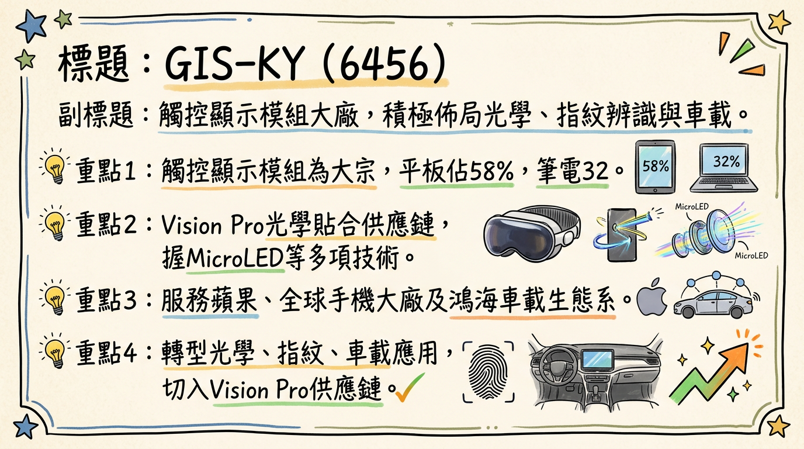
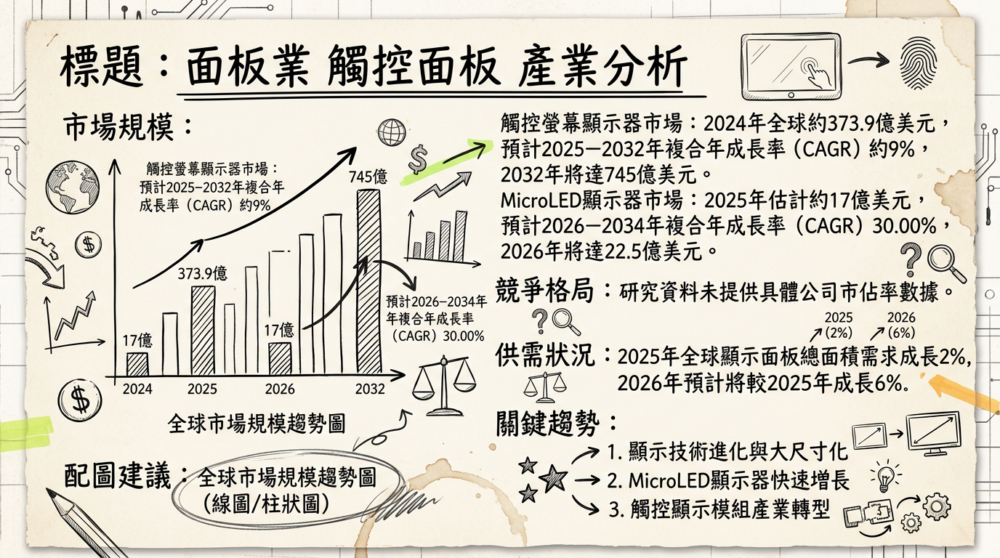
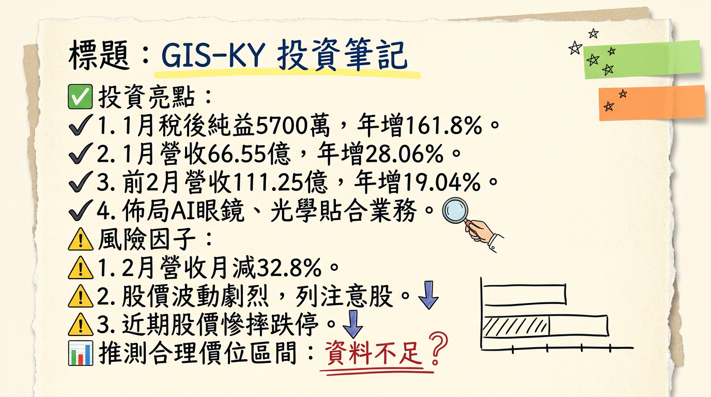

# 6456 GIS-KY 深度研究報告

## 一句話摘要
GIS-KY（業成）正積極從傳統觸控面板模組轉型，聚焦於高成長潛力的光學（AR/VR、MicroLED、HUD）、指紋辨識（超聲波技術）和車載應用，儘管2026年營運預期持平，新產品線佔比逐漸提升，尤其在2027-2028年後有望迎來顯著成長動能，短期獲利能力受傳統業務波動影響，需關注新事業的量產進度與毛利率改善。

## 公司概覽
GIS-KY（業成，股票代碼：6456）為鴻海集團旗下的觸控面板模組大廠，近年來積極進行產業轉型，將核心業務從傳統觸控顯示模組擴展至光學、指紋辨識與車載應用三大新興產品線，以提升產品附加價值和長期成長潛力。

**核心產品/服務：**
*   **光學產品**：專注於AR/VR眼鏡、車載抬頭顯示器（HUD）應用，並投入MicroLED、Meta Lens、光波導及Pancake鏡組等關鍵技術研發。為蘋果Vision Pro光學貼合供應鏈之一。
*   **指紋辨識模組**：掌握超聲波和電容式兩種技術，超聲波指紋辨識已導入全球主要手機大廠的高階OLED手機，電容式則應用於平板側邊辨識。
*   **車載應用**：提供大尺寸曲面觸控顯示模組、先進光波導HUD等解決方案，並參與鴻海集團的車載佈局。

**製造基地：**
*   **台灣台中廠**：光學與半導體相關研發集中地，已建置車載光學鍍膜產線。
*   **中國成都廠**：因應新產品產能需求有新增資本支出預算。
*   **越南新廠**：總投資逾28億元，預計2025年第三季動土，2026年第二季投產，初期以觸控產品為主，未來規劃生產新產品。
*   **泰國**：評估設廠可能性以強化車載業務佈局。

**營收結構（依產品線）：**
| 年度/季度       | 平板    | 筆電及其他 | 手機    | 指紋辨識 | 其他（含車載及光學） |
| :-------------- | :------ | :--------- | :------ | :------- | :------------------- |
| **2024年第一季** | 65%     | 22%        | 13%     | -        | -                    |
| **2024年第四季** | 56%     | 37%        | 7%      | -        | -                    |
| **2024年全年**   | 58%     | 32%        | 10%     | -        | -                    |
| **2025年第二季** | 66%     | 17%        | -       | 13%      | 4%                   |
| **2025年上半年** | 58%     | 23%        | -       | 14%      | 5%                   |
| **2025年第三季** | 63%     | 16%        | -       | 16%      | 5%                   |
| **2026年展望**   | 約50%\* | 約20%\*    | -       | 20%      | 10%                  |

*\*註：2026年展望資料將「傳統觸控與顯示產品」合併預估約70%，此處為拆解後的概估值，非公司精確預估。*

## 核心競爭優勢
1.  **高階光學整合能力**：作為蘋果Vision Pro光學貼合供應鏈，顯示其在精密光學模組整合與製造上的領先技術實力，尤其在MicroLED、光波導及Pancake鏡組等前瞻技術研發具備優勢，有助於搶佔AR/VR及HUD等高價值利基市場。
2.  **超聲波指紋辨識技術領先**：掌握超聲波指紋辨識技術並已導入全球主要手機大廠高階OLED手機，受惠於高階手機對生物辨識安全與便捷性的需求提升。
3.  **鴻海集團資源整合**：參與鴻海集團的電動車與車載佈局，有機會在智能座艙與車用顯示模組市場中獲得更多合作機會與訂單份額。
4.  **積極轉型與高資本投入**：公司將大量資本支出投入光學產品和海外設廠，展現轉型決心，有助於擺脫傳統觸控業務的競爭壓力，建立新的成長曲線。

## 財務分析

### 月營收趨勢
| 月份      | 金額 (億元) | 月增率 MoM | 年增率 YoY |
| :-------- | :---------- | :--------- | :--------- |
| **2026年2月** | 44.69       | -32.84%    | +7.75%     |
| **2026年1月** | 66.55       | +10.11%    | +28.06%    |
| **2025年12月** | 60.44       | +11.99%    | -15.02%    |
| **2025年11月** | 53.97       | +8.48%     | -19.83%    |
| **2025年10月** | 約49.75\*   | -          | -          |
| **2025年9月** | 約47.11\*   | -          | -          |

*\*註：2025年10月與9月營收為根據季營收及已知月份營收估算值。2025年Q4官方公告營收為202.55億元，但部分資料推算10月營收時使用164.16億元作為Q4總額。此處採用提供資料中的近似值。*

### 季度數據
| 季度      | 營收 (億元) | 毛利率 (%) | 營業利益率 (%) | EPS (元) |
| :-------- | :---------- | :--------- | :------------- | :------- |
| **2025Q3** | 161.43      | 6.48%      | -0.92%         | -0.29    |
| **2025Q2** | 190.38      | 6.9%       | 1.1%           | 0.12     |
| **2025Q1** | 151.87      | 7.0%       | -1.49%         | -0.21    |
| **2024Q4** | 202.55      | 8.08%      | 未明確提供     | 0.68     |
| **2024Q1** | 151.07      | 未明確提供 | 0.39%          | 0.15     |

### 年度趨勢
*   **2024年實際**：
    *   全年度營收：新台幣699.86億元
    *   EPS：新台幣0.46元 (全年由虧轉盈)
*   **2025年實際**：
    *   全年度營收：新台幣667.84億元
    *   EPS：未直接找到2025年全年實際EPS，但券商預估區間為-0.4元至2.05元。

## 法說會重點 (2025年11月10日)
*   **2026年營運展望**：公司總經理徐同炤預期，2026年整體營運將與2025年持平。短期內將以提高出貨穩定性與改善毛利率為首要任務。
*   **產品組合預估**：2026年傳統觸控與顯示產品比重約佔70%，指紋辨識模組和車載產品比重將拉升至20%，光學與其他產品比重約10%。
*   **AR/VR產品**：預計2027、2028年開始對營收有明顯貢獻，公司計畫在2026至2027年協助客戶量產相關產品。
*   **AI眼鏡**：目前出貨量不多，預料2027年之後才比較有機會看見出貨量大幅提升。公司正積極與多家客戶共同開發AI眼鏡產品。
*   **指紋辨識業務**：2025年已導入新客戶，營收預估可成長2至3成，佔總營收逾1成，預計2026年全年營收占比有望突破20%。
*   **資本支出**：2025年約50億元，其中約10億元用於購置越南土地建廠，85%以上投入光學產品與相關設備。另有資料指出2025年資本支出上修至50至60億元，主要因應AR/VR眼鏡相關投入增加及海外設廠進程加快。
*   **產能佈局**：光學與半導體基地將鎖定台灣台中后里，中國與越南也規劃產能，其中越南廠將以生產新產品為主。

## 券商觀點

### 目標價與評等
| 券商名       | 目標價 (元) | 評等   | 日期       | 備註                   |
| :----------- | :---------- | :----- | :--------- | :--------------------- |
| **群益證券** | 50          | 中立   | 2025年11月11日 |                        |
| **本土法人** | 78          | 買進   | 2025年9月15日  | 報告已超過6個月，可能過時 |
| **元富證券投顧** | 50          | 中立   | 2025年4月18日  | 報告已超過6個月，可能過時 |

### EPS 預估
*   **2025年EPS預估：**
    *   群益證券：2.05元 (2025年11月11日)
    *   元富證券投顧：0.57元 (2025年4月18日) (⚠️ 過時)
    *   匿名分析師 (平均)：1.45元 (區間1.40至1.50元，來自2位分析師，截至2025年12月31日)
    *   Readmo.ai (預估)：約-0.4元 (2025年)
*   **2026年EPS預估：**
    *   群益證券：7.94元 (2025年11月11日)
    *   匿名分析師 (平均)：2.30元 (區間1.27至3.39元，來自3位分析師，截至2026年12月31日)

**近期評等變動：**
本土法人於2025年9月15日將GIS-KY評等調升至買進，但此報告已過時。目前未找到2025年9月15日之後明確指出近期有重大調升/調降評等的最新資料。

## 財報深度分析

### 利潤率趨勢
| 季度      | 營收 (億元) | 毛利率 (%) | 營業利益率 (%) | 稅後淨利率 (%) | EPS (元) |
| :-------- | :---------- | :--------- | :------------- | :------------- | :------- |
| **2025Q3** | 161.43      | 6.48%      | -0.92%         | -0.59%         | -0.29    |
| **2025Q2** | 190.38      | 6.9%       | 1.1%           | 0.22%          | 0.12     |
| **2025Q1** | 151.87      | 7.0%       | -1.49%         | -0.47%         | -0.21    |
| **2024Q4** | 202.55      | 8.08%      | 未明確提供     | 1.13%          | 0.68     |
| **2024Q3** | 未明確提供  | 約7.3%\*   | 未明確提供     | 未明確提供     | 未明確提供 |
| **2024Q2** | 未明確提供  | 約7.3%\*   | 未明確提供     | 未明確提供     | 未明確提供 |
| **2024Q1** | 151.07      | 未明確提供 | 0.39%          | 0.34%          | 0.15     |

*\*註：2024年Q2、Q3毛利率為根據全年資料概估值。稅後淨利率為稅後淨利除以營收計算所得。*

**利潤率變化分析：**
*   **224年轉盈**：2024年全年稅後淨利1.56億元，EPS 0.46元，實現由虧轉盈，主要得益於2024年第四季營收彈升至202.55億元，毛利率達8.08%，以及業外收益（投資收益、政府補助）挹注。高毛利產品出貨比重提升及營收規模增長亦有助益。
*   **2025年波動**：2025年第一季因觸控市場保守及新動能未放量而虧損，但第二季受惠於美系大客戶關稅豁免期提前拉貨，營收達190.38億元並成功轉盈，毛利率維持在6.9%，營業費用從Q1的12.85億元下降至Q2的11.08億元。然而，第三季因市場競爭與產品組合變化，再次出現稅後淨損0.96億元，營業利益率轉負至-0.92%。業外收入對2025年Q3的稅前淨利有顯著影響（佔910.78%），顯示其獲利穩定性仍仰賴非本業項目。

### 存貨與營運
| 季度      | 存貨週轉天數 (天) | 應收帳款週轉天數 (天) |
| :-------- | :---------------- | :-------------------- |
| **2025Q3** | 29.65             | 85.93                 |
| **2025Q2** | 27.97             | 74.88                 |
| **2025Q1** | 39.46             | 105.72                |
| **2024Q4** | 30.66             | 86.80                 |
| **2024Q3** | 30.89             | 77.18                 |
| **2024Q2** | 33.29             | 76.09                 |
| **2024Q1** | 36.44             | 82.77                 |

**存貨與應收帳款分析：**
*   **存貨週轉天數**：2025年Q1-Q3呈現下降趨勢，從39.46天降至29.65天，顯示公司存貨管理效率有所提升或出貨速度加快。目前未有異常存貨堆積現象。
*   **應收帳款週轉天數**：2025年Q1高達105.72天，但在Q2顯著下降至74.88天，Q3略升至85.93天。整體而言，應收帳款回收速度有波動，但相較於Q1的高點已有所改善。

### 資本支出
*   **近3年資本支出金額與趨勢：**
    *   **2024年**：董事會通過越南新廠追加投資17.1億元，使總投資規模逾28億元。
    *   **2025年**：預計資本支出上修至50至60億元之間，其中光學投資約20億元，越南廠約17億元。至2025年第二季，已實現資本支出15.32億元。公司表示85%以上資本支出投入光學產品。
*   **未來資本支出計畫與預計新增產能：**
    *   越南廠預計於2025年第三季動土，2026年第二季投產，將以生產新產品為主。
    *   光學與半導體基地將鎖定台灣台中后里廠。
    *   2026年將有部分專案（如MicroLED）進入量產並少量出貨，但對整體營收貢獻預估仍有限（約1%-2%）。AR/VR產品預計2027-2028年開始貢獻營收。
*   **折舊攤銷趨勢**：未找到2024-2026年具體折舊攤銷數字與趨勢分析。

## 股權異動
*   **董監事/大股東申報轉讓紀錄**：未找到2024-2026年近期紀錄。
*   **庫藏股買回紀錄**：未找到2024-2026年紀錄。
*   **發行可轉換公司債 (CB)**：未找到2024-2026年發行紀錄。
*   **現金增資或減資計畫**：未找到2024-2026年計畫紀錄。
*   **股利政策**：2024年董事會決議不分派股利（現金股利0元，股票股利0元）。2025年股利政策尚未公布。

## 產業分析

### 產業市場規模與 CAGR
*   **觸控螢幕顯示器市場**：2024年全球市場約373.9億美元，預計2025-2032年CAGR約9%，至2032年達745億美元。
*   **MicroLED顯示器市場**：2025年估計17億美元，預計2026-2034年CAGR達30.00%，或2025-2034年CAGR達71.5%至2034年163.1億美元（不同報告有顯著差異）。
*   **AR/VR智能眼鏡市場**：2025年銷售額達30.01億美元，預計2026-2032年CAGR約9.8%，至2032年達56.42億美元。
*   **指紋辨識模組市場**：2025年79.5億美元，預計2025-2026年CAGR達17.0%至93億美元，至2030年達172.6億美元（CAGR 16.7%）。
    *   **超音波指紋晶片模組市場**：2025年15.7億美元，預計2025-2026年CAGR達22.3%至19.2億美元，至2030年達42億美元（CAGR 21.6%）。
*   **車載顯示系統市場**：2025年271.9億美元，預計2025-2026年CAGR達14.9%至312.4億美元，至2030年達532.5億美元（CAGR 14.3%）。
    *   **車載抬頭顯示器 (HUD) 市場**：2025年18.8億美元，預計2025-2026年CAGR達22.4%至23億美元，至2030年達50.3億美元（CAGR 21.6%）。

### 競爭格局
**全球前五大公司及其市佔率**：目前公開資料未提供GIS-KY所處觸控面板模組或其細分領域（如AR/VR光學、指紋辨識、車載顯示模組）全球前五大公司及其市佔率的最新綜合數據。

**GIS-KY 於關鍵領域的競爭態勢：**
| 技術/應用領域          | GIS-KY優勢                                                 | 市場趨勢/競爭狀況                                                                                                                                                                          |
| :------------------- | :--------------------------------------------------------- | :----------------------------------------------------------------------------------------------------------------------------------------------------------------------------------------- |
| **光學產品 (AR/VR/HUD)** | 蘋果Vision Pro光學貼合供應鏈之一；研發MicroLED、光波導、Pancake鏡組。 | MicroLED市場預計高CAGR成長，但技術發展和商業化進程仍有不確定性。AR/VR市場成長，但需克服續航、重量、價格等挑戰。車載HUD朝AR化與3D顯示發展，光波導技術具潛力。主要參與者有Samsung、LG、Sony等。 |
| **指紋辨識模組**       | 掌握超聲波和電容式技術；超聲波已導入全球主要手機大廠高階OLED手機。      | 超聲波技術在高階OLED手機滲透率提升，成長最快（CAGR 10.2%）。物聯網、非接觸支付需求增加。                                                                                                       |
| **車載應用**         | 提供大尺寸曲面觸控顯示模組、先進光波導HUD；參與鴻海集團車載佈局。         | 市場從尺寸與分辨率提升轉向HUD、電子後視鏡等新型應用。Mini LED/OLED滲透率高，Micro LED加速。智能座艙與電動車發展驅動需求。                                                                 |

**台灣同業比較**：未找到2024-2026年台灣觸控面板同業最新的營收規模、毛利率、EPS直接對比資料。但光學模組製造毛利率可達25%-50%；工業級觸控顯示器毛利率約30%-40%；AR/VR智能眼鏡行業毛利率約20%-35%。

### 產業趨勢
1.  **MicroLED顯示技術的崛起與應用擴展**：
    *   **影響**：MicroLED因其卓越性能被視為下一代顯示技術，將實現超小型、靈活顯示，完美整合於AR/VR、智能手錶、車載HUD等高端應用。生成式AI將加速其需求。
    *   **GIS-KY機會**：GIS-KY積極研發MicroLED相關技術，並計畫2026年少量出貨，有機會在新興高端顯示市場取得先機。
2.  **先進車載顯示與智能座艙的發展**：
    *   **影響**：電動車智能化趨勢推動車載顯示系統需求從傳統大屏擴展至AR HUD、電子後視鏡等。高解析OLED、Mini LED、Micro LED等技術加速滲透，注重沉浸式體驗和安全輔助。
    *   **GIS-KY機會**：GIS-KY提供大尺寸曲面觸控顯示模組和光波導HUD解決方案，結合鴻海集團佈局，有望在智能電動車市場佔據一席之地。
3.  **屏下指紋辨識技術的演進與應用深化**：
    *   **影響**：超聲波指紋辨識因高安全性、高防偽能力在高階OLED手機中快速擴張，並擴展至物聯網、智慧家庭、汽車安全存取等應用。
    *   **GIS-KY機會**：GIS-KY掌握超聲波技術，並已導入主要手機客戶，有望在高階手機及更多應用場景中受益。

**威脅：**
*   **市場競爭加劇與價格壓力**：儘管聚焦高端，但整體顯示面板產業仍面臨激烈價格競爭。
*   **技術快速迭代與資本投入**：AR/VR、MicroLED等新興技術需持續研發和高資本支出。
*   **消費電子市場需求波動**：手機面板市場預計2026年下滑，影響傳統業務表現。

**相關投資題材連結：**
*   **AI (人工智慧)**：AI技術推動智能座艙、AR/VR、智能手機的顯示與感測需求，GIS-KY在光學、指紋辨識、車載顯示的佈局能受益。
*   **電動車 (EV)**：電動車智能化對大尺寸顯示器、AR-HUD需求增加，GIS-KY的車載顯示解決方案使其成為電動車智能座艙供應鏈關鍵。
*   **AR/VR (擴增實境/虛擬實境)**：GIS-KY作為蘋果Vision Pro供應鏈，積極研發AR/VR關鍵技術，直接受益於AR/VR智能眼鏡市場成長。

## 近期催化劑
*   **利多事件：**
    *   **2026年3月4日/5日**：公佈2026年1月自結稅後純益達5,700萬元（年增161.8%），EPS 0.17元，1月營收66.55億元（年增28.06%），創近13個月新高，顯示淡季不淡。
    *   **2026年3月**：AI眼鏡與光學題材持續發酵，GIS-KY積極與多家客戶合作開發AI眼鏡產品，帶動市場資金關注。
    *   **2026年2月**：營運成本與損益結構改善，產品組合調整至高附加價值感測模組與生物辨識應用，短期目標提高出貨穩定性與改善毛利率。
    *   **2026年1月**：CES 2026展出晶圓級光學元件、光波導近眼顯示模組及車載HUD，強調在先進光學製程與材料整合佈局，並宣布2026年部分專案及MicroLED將少量出貨。
    *   **2025年9月15日**：本土法人調升評等至「買進」，目標價78元，預期指紋辨識與低價版MR將帶來成長動能（但報告已過時）。
    *   **2025年5月22日**：公司轉型策略明確，聚焦光學、車載、指紋辨識三大新產品線，目標2025年佔營收逾2成，2028-2029年達5成。

*   **利空事件：**
    *   **2026年3月5日**：公佈2月營收44.69億元，月減32.8%，成長動能不穩定。
    *   **2026年2月26日**：MSCI季度調整將GIS-KY從「全球小型指數」成分股中剔除，可能導致被動型基金賣壓。
    *   **2025年11月10日法說會**：管理層預期2026年營運與2025年持平，AR/VR產品需到2027-2028年才會有明顯貢獻，短期新動能效益有限。
    *   **總經風險**：美系客戶佔營收約8成，訂單波動風險高；新動能（光學產品目前營收佔比僅1%-2%）尚未實質放量；觸控市況保守，且AI眼鏡等新應用大量貢獻營收仍為幾年後題材，本益比評價壓力不小。

## ⭐ 成長動能時間軸

| 時間點            | 成長動能                                                                         | 具體內容                                                                                                                                                                                                                                                               |
| :---------------- | :------------------------------------------------------------------------------- | :--------------------------------------------------------------------------------------------------------------------------------------------------------------------------------------------------------------------------------------------------------------------- |
| **2025年**        | 資本支出投入、轉型佈局、指紋辨識新客戶                                           | **擴廠/產能**：資本支出50-60億元，其中85%以上投入光學產品；越南廠預計2025年第三季動土，購置土地約10億元。**新客戶/新市場**：指紋辨識業務導入新客戶，營收成長2-3成，佔總營收逾1成。車載產品營收佔比約5%，已掌握新客戶。**需求**：智慧手機感測與指紋辨識需求提升。 |
| **2026年第二季**  | 越南新廠投產                                                                     | **產能**：越南新廠將加入生產，主要以生產新產品為主。                                                                                                                                                                                                               |
| **2026年**        | 新產品量產、指紋辨識營收佔比提升、AR/VR產品協助客戶量產                        | **新客戶/新市場**：指紋辨識營收佔比有望突破20%，電容式與超聲波指紋辨識在高階手機與平板滲透率提升。**新產品/產能**：部分光學專案進入量產，MicroLED開始少量出貨。**需求**：協助客戶量產AR/VR產品，但市場仍需時間成熟。                                     |
| **2027年**        | 新產品發酵、AR/VR產品開始貢獻營收、低價版MR機會                                  | **新產品/產能**：預期新產品（包括AR/VR）將開始發酵並貢獻營收。**需求**：AR/VR產品將開始貢獻營收。低價版MR可望提供另一波成長動能。AI眼鏡出貨量開始有機會大幅提升。                                                                                             |
| **2028年**        | AR/VR/AI眼鏡市場逐步放量、公司目標轉型比重提升                                   | **需求**：AR/VR與AI眼鏡市場在續航力、重量、價格等因素符合市場需求後，整體市場將逐步放量。**新客戶/新市場**：公司目標2028-2029年新產品佔營收比重達到5成。                                                                                               |
| **2028-2029年**   | 轉型成果顯現，新產品佔營收比重達5成                                              | **新客戶/新市場**：光學、車載與指紋辨識三大新產品線佔營收比重目標達5成。                                                                                                                                                                                            |

## 2026 展望
**成長動能：**
*   **指紋辨識業務**：預期2026年將是GIS-KY營運的較佳支撐來源，營收佔比有望突破20%。受惠於電容式指紋辨識在客戶端產品市佔率提升，以及超聲波指紋辨識隨高階手機（如三星Galaxy S24系列及中國手機大廠）滲透率增加而擴大應用。
*   **新產能與產品量產**：越南新廠預計2026年第二季投產，將以生產新產品為主。部分光學專案及MicroLED預計2026年開始少量出貨，顯示轉型動能開始萌芽。
*   **光學及車載領域佈局**：公司持續投資光學產品（佔2025年資本支出85%以上），並評估泰國設廠以強化車載業務，儘管短期貢獻有限，但為長期成長奠定基礎。

**風險：**
*   **營運持平與獲利穩定性**：管理層預期2026年整體營運與2025年持平，顯示短期內成長空間有限。獲利能力仍受傳統業務波動及新產品初期貢獻不足影響，毛利率改善仍是挑戰。
*   **新動能貢獻有限**：法人評估目前光學相關產品營收佔比僅約1%至2%，對整體營收貢獻仍有限，AR/VR與AI眼鏡等主要成長動能預期要到2027-2028年才實質放量。
*   **客戶集中度與訂單波動**：美系大客戶佔GIS-KY營收約8成，其訂單波動仍是短期內最大的不確定性。
*   **產業競爭與技術替代**：觸控顯示市場競爭激烈，新技術（如OLED對傳統觸控模組的影響）也帶來潛在威脅。

## 投資結論
GIS-KY處於重要的轉型階段，正積極從傳統觸控模組供應商轉型為高階光學、指紋辨識與車載解決方案提供者。

1.  **長期成長潛力來自轉型**：公司在AR/VR光學模組（蘋果Vision Pro供應鏈）、超聲波指紋辨識及車載應用等領域具有核心技術與客戶優勢，這些是高成長潛力的利基市場。長期來看（2027-2028年後），隨MicroLED、AR/VR眼鏡及智能電動車市場成熟，GIS-KY的轉型成果將顯現。
2.  **短期營運承壓但結構改善**：儘管管理層預期2026年營運持平，且新產品營收貢獻有限，但公司積極調整產品組合、改善費用結構及深化資本支出於高階光學領域，顯示其正為未來爆發性成長打基礎。2026年指紋辨識業務有望成為主要支撐，營收佔比突破20%。
3.  **注意短期獲利波動與估值**：2025年財報顯示獲利能力仍有波動，受市場競爭及新動能未放量影響。在主要成長動能實際放量前，股價可能面臨傳統業務波動及估值壓力。
4.  **建議目標價區間**：考量目前轉型期帶來的獲利不確定性與未來成長空間，綜合券商觀點（群益中立50元，本土法人過時買進78元，元富中立50元）及2026年EPS預估（平均2.30元，群益7.94元），**建議投資者將目標價區間設定在 55元至 70元之間**。其中，55元反映傳統業務穩定性及新動能初期貢獻，70元則納入新興業務於2027年前開始發酵的預期，但仍需密切追蹤其新產品量產進度及實際獲利表現。
5.  **風險控制**：投資者應密切關注公司月營收變化、各產品線營收佔比、新產能利用率及主要客戶訂單動態，並對長期投資做好心理準備，因為其主要成長動能發酵時間較長。

本報告由 AI 自動產生，資料來源為公開網路資訊，僅供參考，不構成投資建議。產生時間：2026-03-06 12:58

---

## 📊 資訊卡

