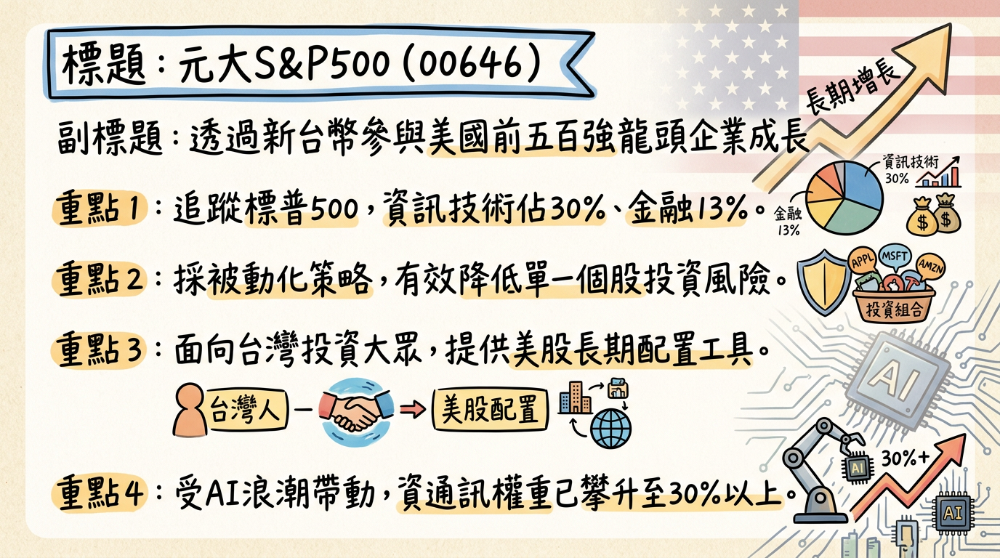
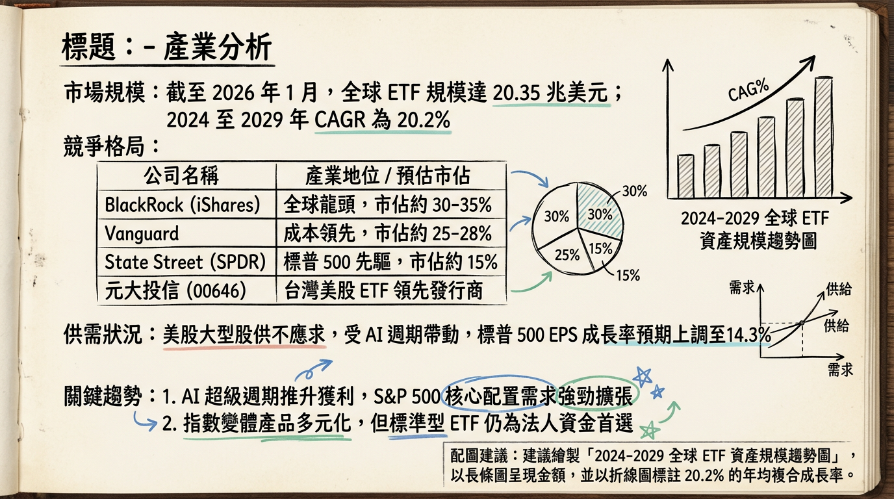
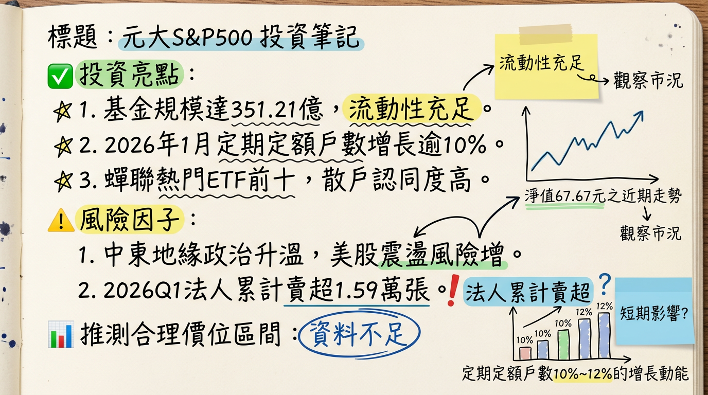

# 646 元大S&P500 深度研究報告

**日期：** 2026-03-05
**研究員：** 頂尖台股研究小組

---

## ## 一句話摘要
**「透過新台幣參與美股 AI 與龍頭企業成長的核心工具，2026 年受惠於企業盈餘（EPS）14.7% 的強勁增長，為長期配置首選。」**

---

## ## 公司概覽（ETF 屬性與資產結構）
元大 S&P500（00646）為元大投信發行之被動型 ETF，旨在完全複製「標普 500 指數 (S&P 500 Index)」表現。該基金讓投資人無需開立複委託或換匯，即可參與美股前 500 大龍頭企業的長期資本利得。

### **資產配置比例（截至 2026/01）**
| 產業類別 | 佔比 (%) | 核心成分股示例 |
| :--- | :--- | :--- |
| **資訊技術 (IT)** | 30% - 32% | NVIDIA (7.37%)、Apple (6.56%)、Microsoft (5.06%) |
| **金融 (Financials)** | 13% - 14% | J.P. Morgan, Berkshire Hathaway |
| **醫療保健 (Health Care)** | 11% - 12% | UnitedHealth, Eli Lilly |
| **非必需消費** | 10% - 11% | Amazon (3.42%), Tesla |
| **通訊服務** | 9% - 10% | Alphabet (2.97%), Meta |
| **其他（工業、能源等）** | 約 25% | Exxon Mobil, Chevron |

*   **投資市場：** 100% 美國。
*   **資產組成 (2026/03/03)：** 股票現貨 97.83%、期貨 2.15%、現金 0.02%。

---

## ## 核心競爭優勢
1.  **低廉持有成本：** 規模達 50 億以上經理費降至 **0.30%**，保管費 **0.06%**，總費用率於台股同類產品具競爭力。
2.  **AI 超級週期參與度：** 前五大權值股（NVDA, AAPL, MSFT, AMZN, GOOGL）合計佔比逾 25%，直接受惠於 AI 基礎設施與軟體應用浪潮。
3.  **高度流動性與便利性：** 規模超過 **350 億台幣**，為台灣規模最大、受益人數（約 9 萬人）最多的美股原型 ETF，免去複委託手續費與換匯困擾。

---

## ## 財務分析（規模與指標趨勢）
由於 00646 為投資組合，以「基金規模 (AUM)」與「淨值 (NAV)」作為核心財務觀察指標。

### **月營收（基金規模）變動趨勢表**
| 月份 | 資產規模 (新台幣億元) | 月增率 (MoM) | 年增率 (YoY) | 備註 |
| :--- | :--- | :--- | :--- | :--- |
| **2026/03** | **351.21** | -1.10% | +6.42% | 受 2 月美股小幅回檔影響 |
| **2026/01** | **355.11** | +24.98% | -- | 定期定額戶數月增 10%-12% |
| **2025/11** | **284.12** | -- | -- | 2025 年底資金顯著流入 |

### **指數盈餘 (EPS) 與估值數據**
| 年度 | S&P 500 指數 EPS | 成長率 (YoY) | 席勒本益比 (Shiller P/E) |
| :--- | :--- | :--- | :--- |
| **2025 (實績/預估)** | $246.47 | -- | 40.46 (高點) |
| **2026 (預估)** | **$313.62** | **+14.7%** | 22.00 (預估平均) |

---

## ## 法說會重點（元大投顧管理層觀點）
*   **2026 展望：** 預期美股呈現「前低後高」。上半年因通膨與勞動市場（失業率 4.6%）波動呈隱形修正，下半年受盈餘驅動有機會創新高。
*   **AI 投資轉型：** AI 投資已從單純「晶片採購」轉向「基礎設施與應用」，預計 2026 年資訊技術板塊獲利增長達 **32.3%**。
*   **政策風險：** 需關注川普政府關稅政策（預計調升至 15%）對出口企業的壓制。

---

## ## 券商觀點（S&P 500 指數目標價）
各家機構對 2026 年底標普 500 指數之目標價即為 00646 的績效指引。

| 券商名稱 | 報告日期 | 2026 年底目標價 (指數) | 評等 | 核心觀點 |
| :--- | :--- | :--- | :--- | :--- |
| **Deutsche Bank** | 2026/03/02 | **8,000** | 買進 (Buy) | 32% 持續增長潛力 |
| **Morgan Stanley** | 2026/03/02 | **7,800** | 加碼 (OW) | 盈餘成長 13-15% |
| **Goldman Sachs** | 2025/12/31 | **7,600** | 持有 (Hold) | AI 驅動生產力提升 |
| **J.P. Morgan** | 2026/03/02 | **7,500** | 中立 (Neutral) | 獲利將使評價合理化 |

---

## ## 財報深度分析（利潤率與運作指標）
### **ETF 運作成本趨勢表**
| 項目 | 2025 年實績 | 2026 年預估 | 趨勢分析 |
| :--- | :--- | :--- | :--- |
| **經理費率** | 0.30% | 0.30% | 規模 > 50 億，維持低檔 |
| **保管費率** | 0.06% | 0.06% | 規模 > 200 億，維持低檔 |
| **總費用率 (TER)** | 0.45% | **0.36%-0.40%** | 隨規模擴張進一步優化 |
| **追蹤誤差** | -0.48% | -0.45% | 控制良好，主因管理費支出 |

*   **存貨分析：** 採完全複製法，每季（3, 6, 9, 12 月）調整，2026/02 調整為 1 刪 0 增（503 檔）。
*   **資本支出：** 無傳統 CapEx，主要為 AI 權值股之資本支出預期。2026 年雲端服務提供商 (CSP) 總投入預計上升至 **6,500 億美元**。

---

## ## 股權異動與受益權益
*   **受益人數：** 截至 2026/03 約 **9.03 萬人**，維持增長。
*   **股利政策：** **累積型（不配息）**。成分股股息（殖利率約 1.3%）自動滾入淨值再投資，享複利效應。
*   **法人動向：** 2026 Q1 外資與自營商呈現調節賣壓（累計買賣超 -1.59 萬張），主因高檔避險與部位調整。

---

## ## 產業分析（競爭格局）
### **台灣同業比較表 (2026/03 數據)**
| 代號 | 名稱 | 規模 (台幣) | 費用率 (預估) | 策略特色 |
| :--- | :--- | :--- | :--- | :--- |
| **00646** | **元大S&P500** | **351 億** | **~0.36%** | **全市場基準、流動性最高** |
| 00757 | 統一FANG+ | 500 億 | ~0.95% | 科技股高度集中、波動大 |
| 00924 | 復華S&P500成長 | 增長中 | ~0.51% | 專注成長股因子 |

### **美股市場競爭格局**
*   **全球規模：** 截至 2026/01，全球 ETF 規模達 **20.35 兆美元**，CAGR 20.2%。
*   **核心競爭：** 00646 需與美國掛牌之 VOO (費用 0.03%) 競爭，其優勢在於**免複委託手續費、免換匯成本、可直接台股定期定額**。

---

## ## 近期催化劑
*   **【利多】AI 獲利驗證 (2026/02)：** S&P 500 資訊技術板塊 EPS 成長預期上修至 14.3%。
*   **【利多】財政激勵 (2026 Q2)：** 預期川普政府釋放約 **1,500 億美元**退稅與紅利以應對選情。
*   **【利空】地緣政治 (2026/03)：** 中東局勢升溫推升能源通膨，可能導致 Fed 延後降息。
*   **【利空】估值過高：** 2025 年底席勒本益比達 40.46，存在本益比修正風險。

---

## ## ⭐ 成長動能時間軸
*   **2026/01：** 美股定期定額戶數創高，穩定支撐 00646 買盤。
*   **2026/03/19：** 聯準會點陣圖公布，利率維持 **3.5%-3.75%** 為市場關鍵。
*   **2026 Q3：** **AI Agent (自動化代理)** 應用大規模導入，帶動軟體板塊 EPS 年增率突破 **30%**。
*   **2026/03：** 美國 2027 財年國防預算上調至 **1.5 兆美元**，提振指數中軍工權值股。
*   **2026 全年：** AI 相關總投資金額預估達 **6,500 億美元**，由 CSP 服務商領頭。

---

## ## 2026 展望（成長動能 vs 風險）
*   **成長動能：**
    1.  **EPS 驅動：** S&P 500 預計 EPS 達 **$313.62**，YoY +14.7%。
    2.  **能源轉型：** AI 數據中心帶動電力需求，能源板塊年初漲幅達 23%。
*   **下行風險：**
    1.  **高基期修正：** 美股連續四年收紅後，技術面修正壓力大。
    2.  **匯率風險：** 若台幣大幅強升，00646 淨值將受損。

---

## ## 投資結論
1.  **核心配置建議：** 00646 為參與美股大盤漲幅的首選工具，建議作為核心部位佔比 30%-50%。
2.  **目標價區間：** 基於 2026 年底標普指數目標 7,800 點，較目前 6,878 點具備 **13.4% 漲幅空間**。對應 00646 淨值，目標價區間為 **75.00 - 78.00 元**。
3.  **操作策略：** 鑒於 2026 年初市場震盪且估值偏高，**不建議一次性追高**，應採取「定期定額」或「逢回（淨值回測 65 元附近）加碼」。
4.  **匯率避險：** 本基金不具匯率避險，台幣貶值時將有額外匯差收益，適合看好美金長期走勢之投資人。

---
*本報告由 AI 自動產生，資料來源為公開網路資訊，僅供參考，不構成投資建議。產生時間：2026-03-05 09:53*

---

## 📊 資訊卡

