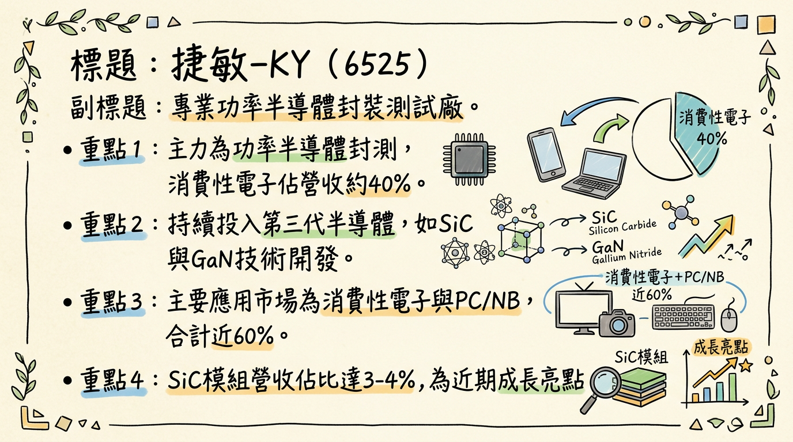
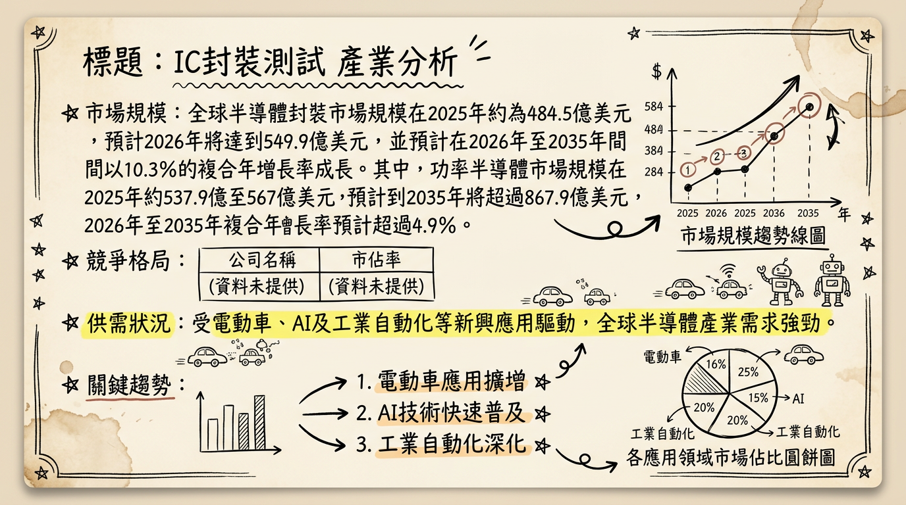
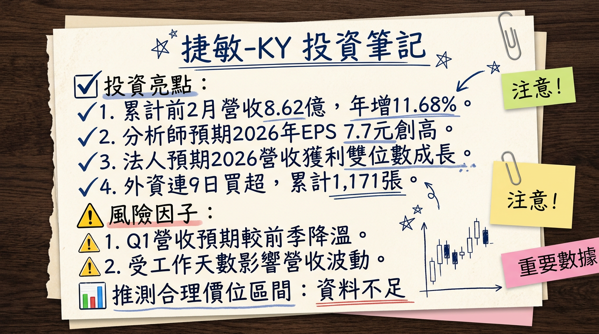

# 6525 捷敏-KY 深度研究報告

## 一句話摘要
捷敏-KY (6525) 作為專業功率半導體封測廠，受惠於2026年車用、工控及AI相關功率元件需求強勁復甦，加上第三代半導體（SiC/GaN）技術佈局及IDM廠委外釋單趨勢，預期全年營收有望雙位數成長，法人估計2026年EPS上看7.7元，營運可望創歷史新高。

## 公司概覽
捷敏-KY 是一家專業的功率半導體（Power Semiconductor）封裝測試廠商，專注於提供高、低電壓功率金氧半場效電晶體（Power MOSFET）、絕緣柵雙極型電晶體（IGBT）和二極體等專業封裝測試服務。公司也提供功率模組（Power Module）封測服務，並持續投入第三代半導體技術開發，如碳化矽（SiC）模組和氮化鎵（GaN）技術。

**製造基地與產能：**
捷敏-KY 的製造基地主要位於中國上海嘉定與安徽合肥，年總產能約為70億顆。
*   上海廠區：約佔總產能的70-71%
*   合肥廠區：約佔總產能的29-30%

**2025年前五個月產品應用營收比重：**

| 產品應用     | 營收比重 |
| :----------- | :------- |
| 消費性電子   | 約40%    |
| PC/NB        | 約19%    |
| 工業用       | 約18%    |
| 車用電子     | 約13%    |
| 通訊         | 約10%    |
| 碳化矽（SiC）模組 | 約3-4%   |

## 核心競爭優勢
1.  **專精功率半導體封測**：深耕功率半導體領域，具備高良率封測技術，客戶涵蓋全球一線IDM廠，能承接IDM委外釋單趨勢。
2.  **第三代半導體技術佈局**：持續投入SiC模組與GaN技術開發，搶佔電動車、5G通訊及工業應用等高成長市場先機。
3.  **多元應用市場分散**：營收應用廣泛涵蓋消費性電子、PC/NB、工業、車用及通訊，能分散單一產業波動風險。
4.  **穩健的定價策略**：在市場復甦下維持穩健定價，並有能力適度反映成本，有助於維持獲利能力。

## 財務分析

### 月營收趨勢
| 月份       | 金額 (新台幣億元) | 月增率 MoM | 年增率 YoY |
| :--------- | :---------------- | :--------- | :--------- |
| 2026年2月  | 4.01              | -13.26%    | 3.53%      |
| 2026年1月  | 4.62              | 0.69%      | 19.85%     |
| 2025年12月 | 4.59              | 4.25%      | 7.99%      |
| 2025年11月 | 4.40              | 0.91%      | 9.22%      |
| 2025年10月 | 4.36              | -4.80%     | 8.51%      |
| 2025年9月  | 4.58              | -1.88%     | 15.81%     |

**2026年前2月營收表現**：
捷敏-KY 累計2026年前2月營收達新台幣8.62億元，年增11.68%，創同期新高。2月營收月減主因工作天數減少，但仍維持年增。

### 季度數據
| 季度         | 季營收 (新台幣億元) | 毛利率 | 營業利益率 | EPS (元) |
| :----------- | :------------------ | :----- | :--------- | :------- |
| 2025年Q3     | 13.90               | 28.33% | 20.70%     | 1.85     |
| 2025年Q2     | 13.87               | 28.89% | 22.08%     | 1.80     |
| 2025年Q1     | 13.87               | 24.64% | 17.31%     | 1.25     |
| 2024年Q4     | 12.01 (推估)        | 22.70% | 13.98%     | 1.81     |

**註：** 2025年Q1 EPS為1.25元，Q2為1.80元，Q3為1.85元。Q4 EPS數據來自法人估算，因2024全年EPS 5.15元，扣除前三季約3.38元，Q4約為1.81元。

### 年度趨勢
| 年度       | 全年營收 (新台幣億元) | 年增率 YoY | EPS (元)   | 備註     |
| :--------- | :-------------------- | :--------- | :--------- | :------- |
| 2024年     | 46.71                 | -          | 5.15       | 實際     |
| 2025年     | 53.26                 | 14.03%     | 5.6 - 6.0  | 自結/法人估 |
| 2026年(預估) | 挑戰雙位數成長        | ~10%       | 7.7        | 今周刊預估 |

## 法說會重點
**最近一次已公告的法說會日期**：2026年3月10日 (將於證交所場地自行舉辦)。

**上次法說會 (2025年6月12日，⚠️已過時)**：
*   **稼動率**：2025年第一季稼動率已從2024年第一季的55-60%提升至近70%。公司定義滿載稼動率約90%。
*   **庫存與訂單**：客戶端庫存已消耗至健康水位，部分客戶因關稅因素提前拉貨。對2025年第三季營運保持樂觀，儘管客戶對預測保守，但公司認為存在隱藏性急單。2025年第四季能見度需持續觀察。
*   **未來展望**：市場普遍預期2026年車用、工控、消費性電子需求皆有望復甦，捷敏-KY有望從中受惠，全年營運可持續走在成長軌道上。

**管理層對下季/下半年 guidance (2026年)**：
*   **2026年第一季營收**：預料將較前一季降溫，但降幅將優於季節性水準，並維持年成長。
*   **2026年全年營收**：有望挑戰雙位數成長，獲利也將繳出優於去年的表現。公司將維持穩健的定價策略，但不排除適度反映成本。

**資本支出與產能利用率**：
*   **產能利用率**：2025年10月稼動率達約7成 (⚠️過時)。
*   **資本支出**：目前未找到2025-2026年的最新具體資本支出金額。公司持續擴增中國合肥廠產能，並在評估至東南亞設廠（菲律賓、馬來西亞、泰國），期望2024年底前有決定性方向。

## 券商觀點
目前未有明確券商目標價報告，主要為法人及媒體對其獲利的預估。

| 資訊來源   | 日期       | 2025年EPS預估 (元) | 2026年EPS預估 (元) | 評等/評語             |
| :--------- | :--------- | :----------------- | :----------------- | :-------------------- |
| MoneyDJ新聞 | 2026/01/07 | 5.0 - 6.0          | -                  | 坐穩5元、上看6元      |
| 元大證券   | 2026/01/30 | 5.6 - 6.0          | -                  | 約5.6~6元             |
| 今周刊     | 2026/02/13 | -                  | 7.7                | 期望值7.7元，創歷史新高 |

## 財報深度分析

### 利潤率趨勢
| 季度         | 毛利率   | 營業利益率 | 稅後淨利率 |
| :----------- | :------- | :--------- | :--------- |
| 2025年Q3     | 28.33%   | 20.70%     | 17.20%     |
| 2025年Q2     | 28.89%   | 22.08%     | 10.27%     |
| 2025年Q1     | 24.64%   | 17.31%     | 15.14%     |
| 2024年Q4     | 22.70%   | 13.98%     | 16.18%     |

**利潤率變化的原因分析**：
2025年以來毛利率呈現回升趨勢，主要受惠於稼動率從2024年第一季的55-60%提升至2025年第一季的近70%。隨著客戶庫存調整告一段落及回補潮湧現，營運穩步向上。公司持續投入高附加價值產品及第三代半導體技術開發，並拓展SiC模組業務，這些都有助於毛利率的提升。

### 存貨分析
| 季度         | 存貨週轉天數 | 應收帳款收現天數 |
| :----------- | :----------- | :--------------- |
| 2025年Q3     | 14.17天      | 64.80天          |
| 2025年Q2     | 12.85天      | 59.35天          |
| 2025年Q1     | 14.15天      | 65.56天          |
| 2024年Q4     | 16.31天      | 61.75天          |
近四季存貨週轉天數呈現下降趨勢，顯示存貨管理效率有所提升，未有異常堆積或備料現象。應收帳款週轉天數大致維持在60-65天左右，顯示帳款回收狀況穩定。

### 資本支出
目前未找到2024-2026年具體的資本支出金額數據。公司持續擴增中國合肥廠產能，專注高電壓產品開發與生產，並計劃性擴充產品業務發展。此外，公司正在評估至東南亞設廠，期望在2024年底前有個決定性方向。截至2025年第三季累計，折舊費用為4.36億元，攤銷費用為0.011億元。

### 其他財務重點
*   **負債比率**：2025年Q3為32.82%，較前一季下降，顯示財務結構穩健。
*   **自由現金流量**：2025年前9個月累計，每股自由現金流達5.16元，顯示公司營運能產生足夠現金。
*   **業外收支**：受匯率波動影響，未實現外幣兌換損益在2025年呈現正向貢獻，但仍需關注新台幣匯率每變動1%將對損益產生約900萬元新台幣的影響。

## 股權異動
**董監事/大股東申報轉讓紀錄**：
*   2024年11月5日：董事配偶黃文興之配偶申報轉讓100張捷敏-KY股票，轉讓方式為贈與，受讓人為黃自強。
*   2024年8月19日：董事黃文興本人申報轉讓100張捷敏-KY股票，轉讓方式為贈與，受讓人為黃自強。同日，黃文興之配偶申報轉讓50張捷敏-KY股票，轉讓方式為贈與，受讓人為黃自強。
（未找到2024-2026年庫藏股買回、可轉換公司債發行、增減資計畫的最新資料。）

**股利政策**：
捷敏-KY秉持穩健的配息政策，過往填息率高，法人預期2026年配息將維持穩定水準。
*   2025年發放年度 (股利所屬期間為2024年)：每股配發**4.2元**現金股利，配息率**81.55%**。
*   2024年發放年度 (股利所屬期間為2023年)：每股配發**3.5元**現金股利。

## 產業分析
捷敏-KY所屬的功率半導體封裝測試產業，受惠於電動車、AI及工業自動化等新興應用，正經歷顯著的成長與轉型。

### 產業數據
1.  **全球功率半導體市場規模與 CAGR 成長率**：
    *   2025年：約**537.9億至568.7億美元**。
    *   2026年：預計達**561.6億至599.8億美元**。
    *   2033年：預計增長至**724.9億美元**。
    *   2035年：預計超過**867.9億美元**。
    *   2026年至2035年複合年增長率（CAGR）：預計超過**4.9%** (另有預測2026-2031年CAGR達**5.46%**)。

2.  **全球半導體封裝市場規模**：
    *   2025年：約**484.5億美元**。
    *   2026年：預計達**549.9億美元**。
    *   2026年至2035年：預計以**10.3%**的複合年增長率成長。

3.  **委外半導體封裝測試 (OSAT) 市場規模**：
    *   2025年：**470.9億美元**。
    *   2026年：預計達**511.2億美元**。
    *   2026年至2031年：以**8.56%**的複合年增長率成長至**771.2億美元**。

4.  **供需狀況**：
    *   2026年半導體市場將進入高需求與有限供應的競爭階段，尤其成熟製程元件供應限制將持續。
    *   功率半導體產業正處週期性復甦，AI資料中心相關電源晶片仍供不應求。

5.  **產業平均毛利率水準**：
    *   2026年功率半導體行業平均毛利率預計為**25.94%**，研發佔比平均提升至**8.43%**。
    *   中國新參與企業的價格競爭正擠壓整個供應鏈的利潤空間。

### 競爭格局
1.  **全球主要OSATs市場份額 (2024年整體OSAT市場)**：
    | 排名 | 公司名稱                     | 國別/地區 | 2024年OSAT市場份額 |
    | :--- | :--------------------------- | :-------- | :----------------- |
    | 1    | ASE Technology Holding (日月光投控) | 台灣      | 44.6%              |
    | 2    | Amkor Technology Inc.        | 美國      | 15.2%              |
    | 3    | JCET Group (長電科技)        | 中國      | 12%                |
    | 4    | Tongfu Microelectronics (通富微電) | 中國      | 8%                 |
    | 5    | Powertech Technology Inc. (力成科技) | 台灣      | 5.5%               |

2.  **捷敏-KY vs 主要競爭對手**：
    捷敏-KY 專精於功率半導體封裝測試，涵蓋Power MOSFET、IGBT、二極體及功率模組，並積極開發SiC/GaN第三代半導體技術。相較於日月光、Amkor等大型OSATs，捷敏-KY雖規模較小，但在特定功率半導體領域（高電壓、大電流、高散熱要求）具備專業技術深度與高良率優勢，並受益於IDM委外釋單趨勢。大型OSATs則在先進封裝（如CoWoS、InFO）和廣泛晶片類型上具備更大規模和多元客戶基礎。

3.  **台灣同業比較 (2025年預估)**：
    | 公司名稱   | 股號 | 2025年營收 (億元新台幣) | 2025年毛利率 (預估) | 2025年EPS (預估) | 2026年EPS (預估) |
    | :--------- | :--- | :---------------------- | :------------------ | :--------------- | :--------------- |
    | 捷敏-KY    | 6525 | 53.26 (自結)            | 24.64-28.89%        | 5.6-6.0          | 7.7              |
    | 日月光投控 | 3711 | 估計遠高於捷敏-KY       | 20%                 | 未詳列           | 未詳列           |
    | 京元電子   | 2449 | 未詳列                  | 36%                 | 未詳列           | 未詳列           |
    | 力成       | 6239 | 未詳列                  | 16%                 | 未詳列           | 未詳列           |
    | 欣銓       | 3264 | 未詳列                  | 36%                 | 未詳列           | 未詳列           |
    | 超豐       | 2441 | 未詳列                  | 18%                 | 未詳列           | 未詳列           |

    **註**：捷敏-KY的毛利率區間為2025年Q1-Q3實際表現。捷敏-KY在專精領域的毛利率表現不遜於部分大型同業，顯示其專業化策略的效益。

### 產業趨勢
1.  **關鍵技術趨勢與影響**：
    *   **第三代半導體（SiC/GaN）普及**：電動車滲透率攀升，SiC預計到2030年佔車用功率半導體市場**60%**。SiC模組在電動車動力系統、快充應用廣泛，GaN則受益於5G基地台高頻通訊需求。寬能隙（WBG）材料在高壓、高頻條件下表現優異。
    *   **先進封裝與異質整合**：為滿足AI/HPC晶片對性能、功耗需求，2.5D/3D封裝、Chiplet架構、HBM整合成為關鍵。CoWoS產能供不應求，大型OSATs加速擴產。
    *   **工業4.0與汽車電子化**：工業自動化推動節能、智慧型功率半導體需求。電動車與ADAS系統對高可靠性、高效率功率半導體（如SiC模組）需求顯著增長。

2.  **捷敏-KY 的機會與威脅**：
    *   **機會**：
        *   **第三代半導體市場成長**：SiC和GaN技術開發將直接受益於電動車、5G、再生能源對高效率寬能隙功率半導體的強勁需求。
        *   **IDM委外釋單**：IDM廠為優化成本、應對市場增長，擴大功率半導體委外封測，為捷敏-KY提供擴大營收的機會。
        *   **產業回溫與AI需求**：2025-2026年消費性電子和車用電子復甦，疊加AI應用對電源管理晶片需求，帶來更多訂單。
    *   **威脅**：
        *   **成本與價格競爭**：功率半導體行業面臨持續的成本控制壓力及中國同業的價格競爭，可能擠壓利潤空間。
        *   **地緣政治風險**：全球供應鏈受地緣政治緊張局勢影響，可能導致中斷或成本上升。
        *   **資本支出門檻**：先進封裝需要龐大資本投入，對專業封測廠而言，可能難以與大型OSATs全面競爭所有先進技術。

3.  **相關投資題材連結**：
    *   **AI (人工智慧)**：AI資料中心擴張推升電源供應元件、電壓調節器等功率半導體需求。
    *   **電動車**：市場擴張是功率半導體（尤其SiC和GaN）主要驅動力，應用於逆變器、充電樁、ADAS系統。
    *   **HPC (高效能運算)**：與AI需求緊密相關，推動對先進封裝和相關功率半導體元件的需求。
    *   **5G通訊**：5G基礎設施部署對GaN等高頻高效率功率半導體元件有強勁需求。

## 近期催化劑
*   **2026年03月06日營收公告**：2月營收4.01億元，月減13.26%，年增3.53%，寫同期次高。累計前2月營收8.62億元，年增11.68%，創同期新高。法人預期第一季降幅優於季節性，全年逐季向上、雙位數成長可期。
*   **2026年03月03日外資連續買超**：外資連續9日買超，累計2026年買超1,171張，顯示對後市看好。
*   **2026年02月13日今周刊預期**：2026年營收成長**10%**，EPS期望值設定為**7.7元**，有望創歷史新高。
*   **2026年02月08日1月營收**：4.62億元，月增0.69%，年增19.85%，創近5個月及同期新高。
*   **2026年02月06日法人展望**：受益AI及車用市場功率半導體需求增溫，捷敏-KY 2026年營收逐季向上、全年雙位數成長可期。預期英飛凌等大廠漲價將帶動台灣功率元件廠跟進，捷敏-KY有望反映價格。
*   **2026年01月30日法人預估2025年EPS與股利**：2025年全年營收53.26億元，年增14.03%，創歷史新高。法人預估2025年EPS約**5.6-6元**。預期2026年配息維持穩定，隱含殖利率逾**5%**。
*   **2026年01月07日功率半導體回補潮**：庫存調整告一段落，回補潮湧現，帶動2025年營運回升，2026年有望延續動能，車用、工控、消費性電子需求復甦。

## ⭐ 成長動能時間軸
*   **2025年**：
    *   **第三代半導體佈局**：持續投入高附加價值產品及第三代半導體技術開發，SiC模組應用聚焦5G、工業用與車用市場。與母公司聯鈞(3450)合作GaN EPI封測。相關業務佔營收比重約個位數。
    *   **客戶地區拓展**：客戶地區分布為台灣約40%、中國25%、日韓25%、歐美10%。
    *   **PC/伺服器需求**：PC、伺服器散熱相關功率元件訂單需求穩健，急單集中於散熱型產品，特別是伺服器風扇應用。
    *   **產能利用率**：第一季稼動率已達近70%，較2024年同期55-60%顯著改善，預期下半年稼動率持續提升。
*   **2026年**：
    *   **需求全面復甦**：功率半導體庫存調整告一段落，回補潮湧現，車用、工控、消費性電子需求全面復甦，相關供應鏈將迎來成長契機。
    *   **AI應用持續增溫**：AI帶動功率及相關IC供給吃緊，為捷敏-KY帶來穩健訂單需求。
    *   **產能擴充規劃**：合肥廠持續擴增，專注高電壓產品。公司評估至東南亞設廠 (菲律賓、馬來西亞、泰國)，有望帶來長期產能彈性。
    *   **價格上漲機會**：受功率半導體大廠漲價預期影響，捷敏-KY有望適度反映成本，提升毛利。

## 2026 展望
**成長動能**：
1.  **庫存回補與終端需求復甦**：受惠於2025年底功率半導體庫存調整完成，2026年車用、工控、消費性電子市場將全面復甦，尤其電動車和AI相關應用對功率元件需求強勁。
2.  **第三代半導體技術領先**：在SiC模組和GaN技術上的投入，使其能把握電動車、5G通訊等高成長市場的結構性機會。
3.  **IDM委外釋單趨勢**：全球IDM大廠為降低成本、提升效率，將持續擴大委外封測，為捷敏-KY帶來穩定且成長的訂單。
4.  **稼動率提升與價格反應**：隨著訂單量增加，稼動率有望進一步提升，配合穩健的定價策略及市場漲價趨勢，有助於毛利率與獲利表現。

**風險**：
1.  **中國同業競爭**：來自中國新興半導體廠商的價格競爭，可能對毛利率構成壓力。
2.  **全球經濟波動**：若全球經濟復甦不如預期，或地緣政治風險升級，可能影響終端需求及供應鏈穩定性。
3.  **匯率風險**：成本以人民幣計價，營收以新台幣認列，匯率波動對業外損益有影響。
4.  **資本支出挑戰**：東南亞設廠計畫若未能順利推動或投入成本過高，可能影響未來擴產彈性與財務結構。

## 投資結論
綜合以上分析，捷敏-KY 於2026年有望受惠於功率半導體產業的強勁復甦循環。

1.  **基本面強勁成長**：2026年預期營收將實現雙位數成長，法人預估EPS上看**7.7元**，創歷史新高。這得益於車用、工控和AI應用帶動的功率半導體需求回溫，以及公司在第三代半導體技術的佈局。
2.  **利潤率改善空間**：稼動率持續提升和新產品線的導入，結合市場對功率半導體產品的價格支撐，有助於公司毛利率維持在健康水平並可能進一步改善。
3.  **長線佈局具潛力**：公司在SiC/GaN等第三代半導體的投入，以及評估東南亞設廠，顯示其對未來成長動能的積極規劃，有望受益於電動車和綠能等長期趨勢。
4.  **股利政策穩健**：過往高達8成的盈餘分配率和高填息率，提供穩健的股息收益，對於長期投資者具有吸引力。
5.  **目標價區間建議**：考量捷敏-KY 2026年EPS有望達**7.7元**，且產業處於復甦與成長趨勢，給予其略高於產業平均的本益比評價。若以**15-20倍**本益比計算，其合理目標價區間為 **新台幣 115.5 元至 154 元**。建議投資人可在此區間內分批佈局。

本報告由 AI 自動產生，資料來源為公開網路資訊，僅供參考，不構成投資建議。產生時間：2026-03-06 13:37

---

## 📊 資訊卡

