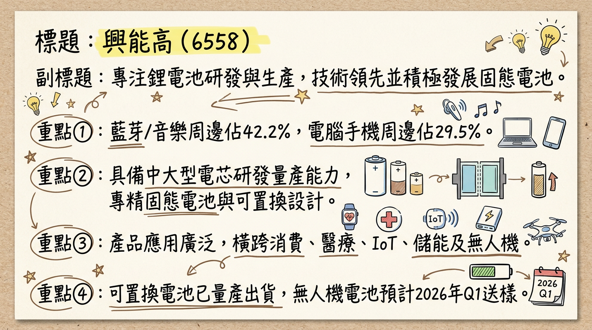
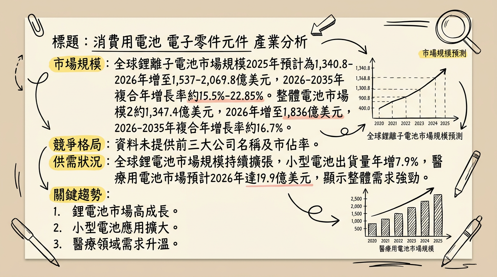
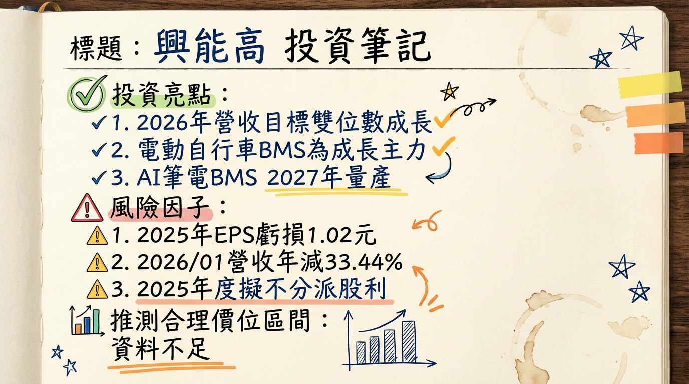

# 6558 興能高 深度研究報告

## 一句話摘要
興能高積極轉型高毛利的非消費性產品，預計2026年醫療、儲能及無人機應用將貢獻顯著成長動能，儘管2025年由盈轉虧，管理層看好2026年營收表現將優於2025年，並透過資本支出與研發投入持續強化競爭力。

## 公司概覽

興能高科技（6558）主要從事鋰電池的生產與研發，其技術涵蓋LCO/NMC材料、寬溫與高安全性設計，並積極發展固態電池與新型態負極材料。公司具備中大型電芯的研發與量產能力，採用疊片工藝及可置換式設計，以符合歐美法規及產品設計需求。

**核心產品應用範圍：**
*   **消費型產品：** 藍芽及音樂周邊（藍牙耳機、電競耳罩耳機、TWS充電盒）、電腦手機周邊（無線滑鼠）、穿戴裝置、AR/VR等。
*   **非消費型產品：** 醫療器件（助聽器、胰島素注射產品）、物聯網、儲能系統（BMS、5KWh的BBU備援電池模組、PCS功率調節系統整合ESS儲能系統）、以及無人機/無人載具電池。

**製造基地與全球佈局：**
公司在電池組裝方面，已在東南亞及台灣尋找合作廠商，目前處於產品開發與驗證階段，預計2026年能上線。電芯部分也已與相關業者尋求合作機會，以降低關稅對客戶的影響。

**營收結構（截至2025年第三季）：**

| 產品應用           | 營收比重   | 備註                                   |
| :----------------- | :--------- | :------------------------------------- |
| 藍芽及音樂周邊     | 42.2%      | 消費性產品，需求下滑                    |
| 電腦手機周邊       | 29.5%      | 消費性產品                             |
| 醫療器件           | 15.0%      | 非消費性產品，預計2026持續成長        |
| 穿戴裝置           | 4.2%       | 消費性產品                             |
| 物聯網             | 3.6%       | 非消費性產品，客戶庫存去化接近尾聲    |
| 其他               | 5.5%       |                                        |
| **合計（應用）**   | **100.0%** | **消費性應用75.9%，非消費性應用24.1%** |

| 產品型態       | 營收比重   |
| :------------- | :--------- |
| 小方型電池     | 77.1%      |
| 圓柱型電池     | 16.1%      |
| 方形中大電池   | 4.7%       |
| 其他           | 2.1%       |
| **合計（型態）** | **100.0%** |

公司設定目標是將非消費性產品比重提升到40%以上。

## 核心競爭優勢

1.  **利基型市場深耕與轉型：** 興能高憑藉其客製化、小型化鋰電池的研發與生產能力，在藍芽周邊、穿戴裝置、醫療器件、物聯網、儲能及無人機等高附加價值利基市場佔有一席之地。公司正積極將重心轉向高毛利的非消費性產品，以優化產品組合並提升獲利能力。
2.  **先進電池技術能力：** 具備LCO/NMC材料、寬溫與高安全性電池設計的技術積累，同時積極投入固態電池與新型態負極材料的研發，掌握未來電池技術趨勢。中大型電芯的研發與量產能力，搭配疊片工藝及可置換式設計，能快速響應市場與法規需求（如歐盟可置換電池法案）。
3.  **多應用領域佈局：** 從消費電子跨足醫療、物聯網、儲能及無人機等多元應用領域，有效分散單一市場風險，並抓住各產業的成長機會。特別是在醫療器件、5KWh BBU備援電池模組及無人機電池方面已取得實質進展。
4.  **營運體質優化與全球化佈局：** 透過提升自動化能力、優化生產流程和原料採購，逐步改善成本結構。同時積極尋求東南亞及台灣的組裝合作夥伴，並與電芯業者尋求合作，以降低關稅影響，提升全球供應鏈韌性。

## 財務分析

**月營收趨勢：**

| 月份     | 金額 (萬元) | 月增率 (MoM) | 年增率 (YoY) |
| :------- | :---------- | :----------- | :----------- |
| 2026年1月 | 6,948.30    | -20.45%      | -33.44%      |
| 2025年12月 | 8,734.70    | 1.70%        | -16.91%      |
| 2025年11月 | 8,588.50    | 20.50%       | -3.43%       |
| 2025年10月 | 7,127.60    | -13.70%      | -23.10%      |
| 2025年9月 | 8,263.30    | -4.50%       | -25.10%      |
| 2025年8月 | 8,649.60    | -18.60%      | -23.70%      |

**季度數據（2025年第四季）：**
*   **季營收：** 新台幣 2.4451億元，季減11.22%，年衰退14.72%。
*   **毛利率：** 13.17%。
*   **營業損失：** 3,356萬元 (營業利益率約 -13.72%)。
*   **稅後淨損：** 5,390萬元。
*   **EPS：** -0.57元。

**年度趨勢：**

| 年度     | 全年營收 (億元) | 全年EPS (元) |
| :------- | :-------------- | :----------- |
| 2024年   | (未提供具體數字，年減3%) | 0.10         |
| 2025年   | 10.7275         | -1.02        |

**分析：**
興能高2025年營運面臨挑戰，全年營收年減7.46%至10.73億元，並由2024年的獲利（EPS 0.1元）轉為虧損（EPS -1.02元）。虧損主因新台幣升值造成的匯損、中國大陸稅務調整（出口退稅率由13%調降至9%，影響毛利率約2.3個百分點）、藍牙及音樂周邊產品需求下滑，以及物聯網客戶庫存去化緩慢等多重因素衝擊。2026年1月營收續呈年減與月減，顯示營運底部可能尚未完全確立，但管理層預期2026年將優於2025年。

## 法說會重點 (2025年12月17日)

興能高總經理謝祥豪於2025年12月17日法說會中提出以下重點：

*   **產品組合轉型：** 公司持續提升高毛利的非消費性產品比重，目標將其提升至40%以上。截至2025年第三季，非消費性產品比重已上升至24.1%。
*   **新應用市場佈局：** 積極投入儲能（BMS、5KWh BBU、PCS整合ESS）及無人機等新興應用市場。
*   **醫療業務成長：** 高毛利醫療器件產品佔比已提升至15%，預計2026年將持續成長，並從電芯產品擴展至電池組。
*   **可置換電池：** 考量歐盟法規，可置換電池已於2025年量產出貨，預計2026年將有更多產品開始出貨。
*   **無人機/無人載具：** 視為發展重點，預計2026年第一季將向目標客戶送樣。
*   **物聯網產品：** 客戶庫存去化已接近尾聲，預期2026年需求將恢復過往水準。
*   **資本支出與研發投入：** 預估2026年整體資本支出與研發支出均將較2025年持續成長**1.5倍** (2025年資本支出已較2024年倍增至5,000萬元，研發投入逾億元)，以因應新品研發及持續提升自動化能力。
*   **海外佈局：** 在電池組裝方面，已在東南亞及台灣尋找合作廠商，規劃2026年能上線。電芯部分也正與相關業者尋求合作機會，以降低關稅對客戶的影響性。
*   **2026年展望：** 管理層表示，2026年營收會比2025年好，並將持續管控成本，希望毛利率與獲利能持續往上。

## 券商觀點

目前未找到2025-2026年來自至少三家券商的興能高具體目標價、評等及2025-2026年EPS預估數據。也未有重大調升/調降評等的公開資訊。

| 券商名稱 | 目標價 (新台幣) | 評等 | 日期       |
| :------- | :-------------- | :--- | :--------- |
| N/A      | 無資料          | 無資料 | 無資料     |
| N/A      | 無資料          | 無資料 | 無資料     |
| N/A      | 無資料          | 無資料 | 無資料     |

## 財報深度分析

**利潤率趨勢：**

| 季度         | 毛利率     | 營業利益率 | 稅後淨利率 |
| :----------- | :--------- | :--------- | :--------- |
| 2024年第四季 | 18.72%     | -2.97%     | 1.08%      |
| 2025年第一季 | 18.55%     | -5.76%     | -2.45%     |
| 2025年第二季 | 20.05%     | -2.26%     | -16.10%    |
| 2025年第三季 | 22.43%     | -2.55%     | 3.91%      |
| 2025年第四季 | 13.17%     | -13.72%    | -22.04%    |

**利潤率變化原因分析：**
興能高2024年毛利率年增至18.8%，顯示成本結構改善與產品組合優化，主要受惠於生產流程自動化提升、原料採購與製程優化及新品較佳毛利。然而，2025年公司營運遭遇逆風，毛利率波動劇烈，尤其在第四季大幅下滑至13.17%，營業利益率與稅後淨利率也大幅轉負。這主要歸因於新台幣升值造成的匯損、中國大陸出口退稅率調降（影響毛利率約2.3個百分點）、藍牙及音樂周邊產品需求下滑、以及物聯網客戶庫存去化較慢等多重因素的衝擊。消費型產品的競爭加劇也可能壓抑售價與毛利率。

**存貨與營運：**

| 季度         | 存貨週轉次數 (次) | 存貨週轉天數 (天) | 應收帳款週轉次數 (次) | 應收帳款收現天數 (天) |
| :----------- | :---------------- | :---------------- | :-------------------- | :-------------------- |
| 2024年第四季 | 1.11              | 80.99             | 0.81                  | 111.30                |
| 2025年第一季 | 1.07              | 84.22             | 0.81                  | 111.65                |
| 2025年第二季 | 1.17              | 77.12             | 0.92                  | 98.02                 |
| 2025年第三季 | 1.12              | 80.29             | 0.88                  | 102.79                |

**存貨分析：**
興能高近四季的存貨週轉天數大致維持在77至84天之間，應收帳款週轉天數則在98至112天之間。儘管2025年面臨物聯網客戶庫存去化較慢的問題，但從數據來看，並未顯示存貨出現明顯的異常堆積，整體營運週轉狀況仍在合理範圍內。

**資本支出與未來計畫：**
*   **近3年資本支出趨勢：** 22025年資本支出相較2024年已倍增至5,000萬元。2025年投入研發逾億元。
*   **未來計畫：** 預估2026年整體資本支出與研發支出將較2025年大幅成長**1.5倍**，以支撐新品研發、自動化能力提升以及全球化生產佈局（東南亞及台灣電池組裝合作廠預計2026年上線）。
*   **折舊攤銷趨勢：** 未找到2024-2026年具體的折舊攤銷趨勢資料。

## 股權異動

*   **董監事/大股東申報轉讓：** 未找到2024-2026年的最新紀錄。
*   **庫藏股買回紀錄：** 未找到2024-2026年的最新紀錄。
*   **可轉換公司債(CB)：** 未找到2024-2026年興能高發行可轉換公司債的最新資料。
*   **現金增資或減資計畫：** 未找到2024-2026年興能高現金增資或減資的最新計畫。
*   **股利政策：** 2024年股利：每股現金股利0.3元。公告日為2025年2月24日，除息日為2025年6月24日，現金股利發放日為2025年7月21日。
*   **負債比率：** 2023年負債總額為6.87億元，至2024年降至3.5億元，顯示財務結構大幅改善。2025年第三季負債比率為21.88%，第四季為20.56%，財務體質健康。
*   **自由現金流量趨勢：** 未找到2024-2026年自由現金流量的最新趨勢資料。
*   **業外收支重大項目：** 2024年稅後EPS轉正0.1元，主要受惠於第四季業外收益貢獻。然而，2025年全年稅後淨損9,545萬元，主因新台幣升值造成的匯兌損失以及中國大陸稅務調整（2025年前三季認列近2,000萬元），這些業外因素對獲利影響顯著。

## 產業分析

**全球鋰電池產業市場規模與成長率：**
*   **整體市場：** 2025年全球鋰離子電池市場規模約1,340.8億至1,348.8億美元。預計2026年將增至1,537億至2,069.8億美元。預測期間（2026-2035年）CAGR約15.5%至22.85%。
*   **小型鋰電池：** 2025年出貨量133.9GWh，年增7.9%。
*   **醫療用電池：** 2025年市場規模18.7億美元，預計2026年增至19.9億美元，CAGR為6.8%。
*   **物聯網電池：** 2025年市場規模逾122.8億美元，預計2026年達133.5億美元，預測期間CAGR逾9.7%至11.22%。
*   **儲能系統電池：** 2025年出貨量達651.5GWh，年增76.2%。預計2026年出貨年增率將上看40%～50%，突破1,000GWh。定置型儲能市場2025年為1,206.9億美元，預計2026年增至1,370.7億美元，CAGR為10.18%。
*   **無人機/無人載具電池：** 2025年市場規模約13億至36億美元。預計2026年達10.12億美元，2026-2033年CAGR約8.6%至16.3%。

**供需狀況：**
2025年全球鋰電池產業已從供過於求走向供需平衡。展望2026年，預計鋰電池行業將持續供需緊張，尤其儲能領域需求爆發，使得全球鋰市場有望在2026年出現供不應求局面，並持續至2027年。小型電池（如100Ah電池）目前面臨嚴重短缺，訂單已排至2026年初，價格上漲逾20%。

**產業的平均毛利率水準：**
未找到2024-2026年鋰電池產業的具體平均毛利率數據。但預計2026年鋰電上游材料（如鋰資源、碳酸鋰、電解液、鈷原料）供應全年偏緊，價格上行趨勢明顯，漲幅15%-30%，這些因素可能對毛利率產生正面影響。

### 競爭格局

興能高主要專注於利基型、客製化的小型鋰電池應用，與全球動力電池巨頭的直接競爭較少，更多是在特定細分市場與其他專業廠商競爭。

**全球動力電池CR5市佔率預估 (2026年)：**
| 公司名稱 | 預估市佔率 |
| :------- | :--------- |
| 寧德時代 | 35%        |
| 比亞迪   | 15%        |
| LG新能源 | 12%        |
| 松下     | 8%         |
| SK On    | 7%         |
| **CR5合計** | **77%**    |

**興能高 vs 主要競爭對手比較：**
由於興能高在小型、利基型電池領域，其主要競爭對手多為各垂直細分市場的專業電池製造商，而非上述動力電池巨頭。以下為興能高在主要競爭要素上的特點：

| 競爭要素 | 興能高 (6558)                                                                                                                                                                                                                                                                                       |
| :------- | :------------------------------------------------------------------------------------------------------------------------------------------------------------------------------------------------------------------------------------------------------------------------------------------ |
| 專注領域 | 利基型、客製化小型鋰電池：藍牙耳機、穿戴裝置、AR/VR、醫療器件、物聯網、儲能系統（BBU）、無人機/無人載具。                                                                                                                                                                                                    |
| 技術特色 | 涵蓋LCO/NMC材料，寬溫與高安全性設計。積極發展固態電池與新型態負極材料。具備中大型電芯研發與量產能力，採用疊片工藝及可置換式設計。                                                                                                                                                                  |
| 產能     | 未提供具體產能數據。但2026年資本支出與研發支出將大幅成長1.5倍，將支撐全球化生產佈局（東南亞及台灣組裝合作廠2026年上線），並投入新品研發。小型電池市場面臨短缺，顯示專業廠商仍有市場空間。                                                                                                                                   |
| 客戶     | 消費型產品與非消費型產品客戶群多元。非消費性產品應用包括醫療器件（助聽器、胰島素注射產品）、物聯網、儲能系統（BBU）、無人機/無人載具，預計2026年將有更多可置換電池及無人機產品出貨，客戶基礎穩固且具成長潛力。                                                                                                       |
| 價格策略 | 專注高附加價值、客製化產品，具備較強的價格議價能力。儘管鋰電上游材料價格上行，但其利基市場定位有助於轉嫁成本。                                                                                                                                                                                                    |
| 主要競爭對手 | **醫療設備用鋰離子電池主要製造商 (2021-2026)**: EnerSys, Saft, Renata SA, Ultralife Corporation, EaglePicher Technologies, Panasonic Corporation, LG, Resonetics, Samsung 等。針對台灣同業如新普、順達等，則需個別財報對比。由於興能高在利基型市場，其競爭多在於技術壁壘、客製化能力和穩定供貨。 |

### 產業趨勢

1.  **固態電池技術的發展與產業化加速：**
    *   **趨勢：** 固態電池因高安全性、高能量密度與長循環壽命成為趨勢。半固態電池技術在新能源汽車、儲能、低空經濟和消費電子等領域加速進入商業化量產階段。
    *   **具體影響：** 預計2026年，半固態電池將在eVTOL及消費電子等低成本敏感領域規模化量產。興能高積極發展固態電池技術，有助於抓住未來電池技術升級的機會。

2.  **高能量密度與新型態負極材料：**
    *   **趨勢：** 為滿足電動車、儲能對續航與性能需求，硅基負極等新型負極材料和高壓實磷酸鐵鋰正極發展迅速。
    *   **具體影響：** 高壓實磷酸鐵鋰正極有助於儲能電芯大型化。興能高在新型態負極材料的研發有助於提升其產品性能和市場競爭力。

3.  **可置換電池設計與循環經濟：**
    *   **趨勢：** 歐盟法規推動可置換電池發展，並日益重視電池回收和循環經濟。
    *   **具體影響：** 可置換電池設計提高產品使用彈性，符合環保趨勢。興能高已量產可置換電池，預計2026年將有更多產品出貨，為其帶來新的商業模式與市場機會。

**對 興能高 而言的具體機會和威脅：**

*   **機會：**
    *   **利基市場優勢：** 在醫療器件、物聯網、儲能及無人機等小型化、客製化高附加價值應用領域深耕，這些市場需求快速成長。
    *   **技術領先：** 積極發展固態電池與新型態負極材料，特別是半固態電池在消費電子和低空經濟的應用。
    *   **政策與市場需求：** 台灣政府對國防自主（無人機/無人載具）和表後儲能的政策支持，以及全球AI數據中心對備援電池模組（BBU）需求的增長，均為興能高帶來具體市場機會。
    *   **供需緊張：** 小型電池市場的供應緊張狀況，對具備穩定供貨能力的興能高可能有利，有助於爭取訂單和維持價格。

*   **威脅：**
    *   **原材料成本波動：** 鋰、鈷等原材料價格波動將直接影響製造成本，若無法有效轉嫁將侵蝕利潤。
    *   **市場競爭：** 儘管專注利基市場，仍面臨來自其他專業電池廠商或大型企業拓展細分市場的競爭。
    *   **技術快速迭代：** 電池技術發展迅速，若研發投入不足或未能跟上趨勢，可能面臨被淘汰風險。
    *   **地緣政治與供應鏈風險：** 鋰電池產業供應鏈全球化，地緣政治緊張、貿易壁壘、出口退稅政策調整等均可能影響營運（如2025年中國出口退稅率調降）。

**相關投資題材的具體連結：**

*   **AI (人工智慧) 與 HBM (高頻寬記憶體)：** AI數據中心對備援電池模組（BBU）需求大增，2023年全球BBU市場規模約3.7億美元，預計2031年達14.9億美元。興能高在非消費型產品中包含5KWh的BBU備援電池模組，直接受益於AI伺服器對備援電源的需求。
*   **電動車 (EV)：** 興能高的固態電池技術發展與未來電動車電池輕量化、高能量密度需求相關，無人載具電池應用也與電動車電池技術有共通之處。
*   **儲能系統 (ESS)：** 再生能源與AI數據中心建設帶動儲能需求。興能高已發展BMS、5KWh BBU，並配合政府計畫開發PCS功率調節系統整合ESS儲能系統，直接受益於儲能市場的爆發性成長。
*   **AR/VR (擴增實境/虛擬實境) 與穿戴裝置：** 興能高核心產品應用於穿戴裝置、AR/VR等，這些領域對小型化、高能量密度、高安全性的電池需求持續提升。
*   **低空經濟 (如無人機)：** 國防軍工產業自主（無人機與無人載具）及民用無人機應用擴大，帶動輕量、高效電池方案需求。興能高預計2026年第一季將向目標客戶送樣無人機/無人載具電池，明確連結低空經濟題材。
*   **醫療科技：** 興能高生產醫療器件電池（助聽器、胰島素注射產品），受惠於老齡化、慢性病增加及居家照護普及，醫療用電池市場將穩定成長。

## 近期催化劑

以下為興能高近期主要利多/利空事件：

*   **2026年03月05日：** 外資買超151張。
*   **2026年03月04日：** 盤中下跌7.14%至29.9元，外資賣超44張。
*   **2026年03月03日：** 外資賣超208張。
*   **2026年02月26日：** 外資買超96張。
*   **2026年02月25日：** 外資買超19張。
*   **2026年02月24日：** 公布2025年第四季稅後淨損5,390萬元，EPS -0.57元；全年每股淨損1.02元。董事會決議2025年度不分派股利。
    *   **利空：** 財報由盈轉虧，且不分派股利，短期對股價形成壓力。
*   **2026年02月13日：** 公布2026年1月營收6,948.30萬元，月減20.45%，年減33.44%。
    *   **利空：** 營收年增率與月增率雙雙下滑，顯示營運尚未回溫。
*   **2026年01月10日：** 公布2025年12月營收8,734.70萬元，月增1.7%，年減16.91%。
*   **2025年12月17日：** 召開法說會，管理層預估2026年營收將優於2025年，並宣布2026年資本支出與研發支出將大幅成長1.5倍。無人機應用預計2026年第一季送樣，可置換電池將放量出貨。
    *   **利多：** 管理層釋出2026年樂觀展望，轉型策略明確，並有具體時程的新產品進展。
*   **2025年12月14日：** 公布2025年11月營收8,588.50萬元，月增20.5%，年減3.43%。

## ⭐ 成長動能時間軸

| 動能類別     | 具體描述                                                                                                                                                                                                                                                                                                                                                      | 預計時間點/狀態           | 預估影響                                                                                                                                                                                                                |
| :----------- | :------------------------------------------------------------------------------------------------------------------------------------------------------------------------------------------------------------------------------------------------------------------------------------------------------------------------------------------------------ | :------------------------ | :---------------------------------------------------------------------------------------------------------------------------------------------------------------------------------------------------------------------- |
| **新應用佈局** | **非消費性產品轉型：** 營運重心轉向高毛利的醫療器件、儲能、無人機市場，目標將非消費性產品比重提升至40%以上。積極佈局BMS、5KWh BBU、PCS功率調節系統及固態電池技術。                                                                                                                                                                                                      | 持續進行中                | 改善產品組合，提升整體毛利率及獲利能力，分散消費性產品市場風險。受益於AI伺服器對BBU備援電源的需求爆發。                                                                                                                |
| **新客戶/市場** | **醫療業務成長：** 高毛利醫療器件（助聽器、胰島素注射產品等）出貨成長，從電芯擴展至電池組。 **無人機/無人載具：** 發展重點，產品預計向目標客戶送樣。 **可置換電池：** 已量產出貨，可置換電池已供貨助聽器、電腦周邊客戶。                                                                                                                                                                                  | 醫療業務：2026年持續成長  無人機送樣：2026年第一季  可置換電池：2026年更多產品放量出貨 | 抓住醫療科技、低空經濟及可置換電池市場的成長機會，擴大營收規模並提升市佔率。                                                                                                                                        |
| **產能/擴廠計畫** | **電池組裝產線：** 在東南亞及台灣尋找合作廠商，進行產品開發與驗證。 **電芯合作：** 與相關業者尋求合作機會。                                                                                                                                                                                                                                                                | 2026年上線              | 降低關稅對客戶的影響，提升供應鏈彈性與韌性，為未來業務成長做好產能準備。                                                                                                                                |
| **資本支出增加** | **整體資本支出與研發支出：** 預估較2025年大幅成長1.5倍（2025年資本支出已倍增至5,000萬元，研發逾億元），以因應新品研發及持續提升自動化能力。                                                                                                                                                                                                                                      | 2026年                  | 支撐全球化生產佈局與儲能轉型，強化技術領先地位，為長期成長奠定基礎。                                                                                                                                        |
| **需求面**     | **物聯網客戶庫存去化：** 已接近尾聲。 **AI數據中心：** 對BBU需求持續增長。 **儲能：** 全球儲能需求爆發，尤其表後儲能及台電電網韌性需求。 **小型電池市場：** 目前面臨短缺，尤其是100Ah電池，訂單已排至2026年初，價格上漲逾20%。                                                                                                                                                         | 物聯網：預期2026年恢復  AI/儲能：持續成長中  小型電池：持續短缺 | 帶動營收恢復動能，確保訂單能見度，並可望在供應緊張的市場中獲取較佳的產品定價與利潤。                                                                                                                            |

## 2026 展望

**成長動能：**
2026年興能高最大的成長動能來自於**高毛利非消費性產品的加速轉型**。醫療業務預計將持續穩健成長，無人機與無人載具應用產品將於第一季送樣，預期下半年將逐步貢獻營收。符合歐盟法案的可置換電池也將在2026年放量出貨。公司在儲能領域的BMS、BBU模組及PCS整合ESS系統的佈局，將直接受惠於AI數據中心及再生能源儲能的爆發性需求。同時，物聯網客戶庫存去化接近尾聲，預期2026年需求恢復，加上小型電池市場的供應緊張，有助於公司在利基市場爭取訂單。管理層宣布2026年資本支出與研發投入將大幅成長1.5倍，顯示公司對未來成長的信心與決心。

**風險：**
儘管成長潛力可期，興能高仍面臨多重風險。首先，**總經風險**如新台幣匯率波動可能持續造成匯兌損失，以及鋰、鈷等**原物料價格**可能因地緣政治（如剛果內戰）而上漲，侵蝕毛利率。其次，**消費型產品的競爭加劇**可能持續壓抑售價與毛利率，影響整體獲利。此外，**中國大陸稅務調整**（出口退稅率調降）仍會對出口利潤產生影響。公司必須有效管控這些外部因素，並加速新產品的量產與客戶驗證進度，才能確保2026年營收與獲利表現如管理層預期般改善。

## 投資結論

綜合以上分析，興能高（6558）正處於關鍵的轉型期，儘管2025年營運面臨挑戰並轉虧，但2026年展望趨於樂觀，其成長動能已逐漸明確。

1.  **轉型效益顯現，產品組合優化：** 公司積極將重心轉向高毛利的非消費性產品（醫療、儲能、無人機），此策略有望顯著改善整體毛利率與獲利結構。2026年非消費性營收比重預計將持續攀升。
2.  **新興應用成長動能強勁：** 醫療業務預計持續成長，無人機應用將於2026年第一季送樣，可置換電池將放量出貨。BBU備援電池模組更將直接受惠於AI數據中心的高速成長，這些高成長市場將是2026年營收成長的主要驅動力。
3.  **大舉投入研發與資本支出：** 2026年資本支出與研發支出預計大幅成長1.5倍，顯示公司對其技術領先優勢（固態電池、新型負極材料）與市場佈局的堅定信心。這將為未來數年的持續成長奠定基礎。
4.  **營運風險需持續關注：** 消費型產品需求疲軟、原材料價格波動、匯率風險以及中國大陸稅務政策變動仍是潛在的下行風險。公司需透過效率提升與成本轉嫁策略來加以應對。

考量興能高在非消費性產品的積極轉型、新興應用市場的潛力，以及管理層對2026年營收轉好的指導，預期公司有望在2026年重回獲利軌道。若非消費性產品滲透率如期提升，且新產品出貨順利，其獲利能力將有顯著提升空間。

**投資建議：** 鑑於2025年的虧損已反應在股價，且2026年多項成長動能明確，預期公司有望在2026年下半年恢復成長動能。建議投資人可以關注其非消費性產品比重提升及新應用出貨進度。考量2026年營收轉正與毛利率提升潛力，以及新興應用佈局的長期價值，建議目標價區間為 **新台幣 35-48 元**。

本報告由 AI 自動產生，資料來源為公開網路資訊，僅供參考，不構成投資建議。產生時間：2026-03-06 00:25

---

## 📊 資訊卡

