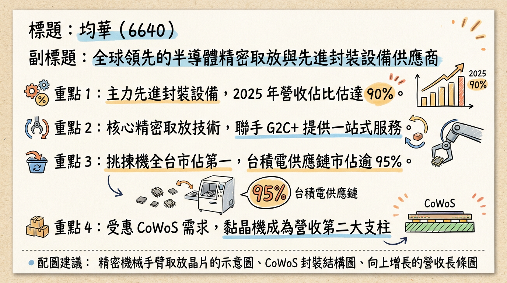
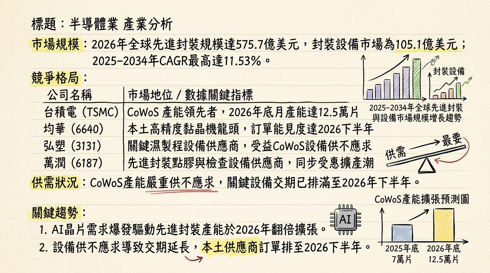
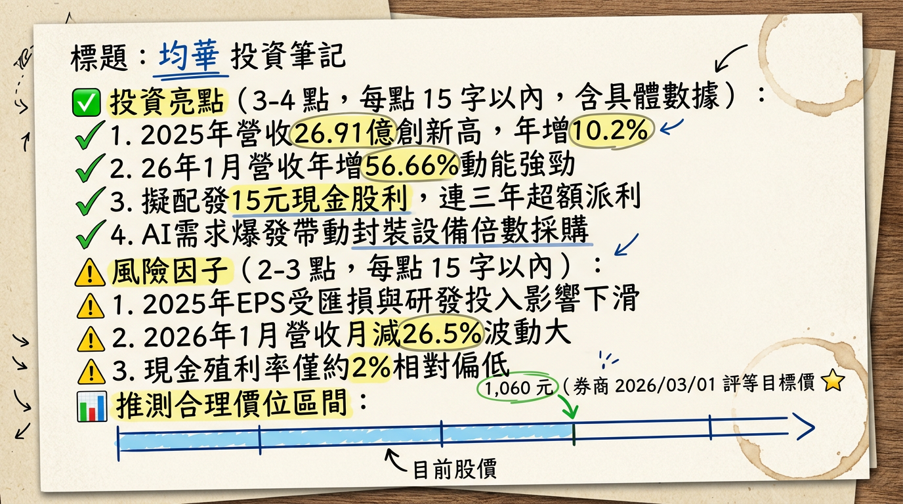

# 6640 均華 深度研究報告

## 一句話摘要
**「先進封裝設備領航者，受惠 CoWoS 倍數增產需求，2026 年 EPS 有望挑戰翻倍成長至 26.5 元。」**

---

## 公司概覽
均華精密（6640）為台灣半導體後段封裝設備領導廠商，隸屬於「G2C+ 聯盟」（均豪、志聖、均華）。其核心技術在於高精度取放（Pick and Place），並成功轉型為先進封裝設備供應商。

**業務產品線與營收結構：**
| 業務/產品線 | 2024 營收佔比 | 2025 營收佔比 | 2026 預估佔比 | 核心客戶 |
| :--- | :---: | :---: | :---: | :--- |
| **先進封裝設備 (Total)** | **75%** | **85% ~ 90%** | **>90%** | 台積電、日月光 |
| - Chip Sorter (晶粒挑揀機) | -- | -- | 70% | 台積電 (市佔 >95%) |
| - Die Bonder (高精度黏晶機) | -- | -- | 20% | 台積電、封測龍頭 |
| - 維修與其他 | 25% | 10% ~ 15% | 10% | -- |

---

## 核心競爭優勢
1.  **市場統治力：** 在台灣 **Chip Sorter（晶粒挑揀機）** 市場擁有絕對領先地位，於台積電先進封裝供應鏈市佔率超過 **95%**。
2.  **G2C+ 聯盟綜效：** 透過與母公司均豪、志聖協作，解決產能瓶頸。2024-2025 年訂單激增時，成功運用均豪台中廠產能進行彈性組裝。
3.  **技術護城河：** 具備研發 Hybrid Bonding（混合鍵合）與面板級封裝（FOPLP/CoPoS）能力，技術路徑與台積電 SoIC 及未來 3D 封裝趨勢高度契合。
4.  **結構性需求增長：** AI 晶片尺寸變大（如 Blackwell 系列），導致單機產能 (UPH) 下降，客戶必須採購「倍數」機台以維持產出，帶動營收非線性成長。

---

## 財務分析

### 月營收趨勢表
| 月份 | 營收金額 (千元) | 月增率 MoM | 年增率 YoY | 備註 |
| :--- | :---: | :---: | :---: | :--- |
| **2026/01** | 230,696 | -26.5% | **+56.7%** | 歷年同期次高 |
| **2025/12** | 314,084 | +49.4% | +35.7% | -- |
| **2025/11** | 210,244 | +40.0% | -30.5% | 裝機進度調整 |
| **2025/10** | 150,192 | -43.6% | -52.4% | 基期較高 |
| **2025/09** | 266,377 | -32.4% | **+94.9%** | -- |
| **2025/08** | 394,121 | +109.4% | **+133.1%** | 營收歷史高點區域 |

### 年度趨勢預估
*   **2024 (實際)：** 營收 24.42 億元，**EPS 14.62 元**。
*   **2025 (實際)：** 營收 26.91 億元（年增 10.2%），**EPS 12.75 元**（因研發投入及業外收益基期較高導致獲利下滑）。
*   **2026 (預估)：** 法人預期營收挑戰雙位數新高，**EPS 預估達 26.5 元**（受惠於 AI 設備訂單爆發）。

---

## 法說會重點
*   **產能展望：** 目前在手訂單已排至 **2026 年 Q3**，先進封裝營收佔比已正式站穩 85% 以上。
*   **新技術時程：** 應用於 Apple 的 **WMCM（晶圓級多晶片模組）** 設備已於 2026 Q1 開始放量；新一代 Die Bonder 已通過認證，將貢獻 2026 下半年動能。
*   **管理層發言：** 針對 AI 晶片大型化趨勢，管理層指出「客戶必須倍數採購設備以維持產出」，此結構性變革為 2026 年主要成長引擎。

---

## 券商觀點
| 券商/來源 | 報告日期 | 評等 | 目標價 | 2026 EPS 預估 |
| :--- | :--- | :--- | :--- | :--- |
| **工商時報/法人** | 2026/03/01 | 買進 | **1,060 元** | 26.5 元 |
| **MoneyDJ 法人** | 2026/03/04 | 正向 | **867 元** | 25.0 ~ 28.0 元 |
| **國泰投顧** | 2025/12/18 | 看多 | 694 元 | -- |

---

## 財報深度分析

### 利潤率趨勢表
| 季度 | 毛利率 (Gross Margin) | 營業利益率 (OPM) | 稅後淨利率 (NPM) | 單季 EPS |
| :--- | :---: | :---: | :---: | :---: |
| **2025 Q4** | 38.34% | 14.00% | 13.89% | 3.35 元 |
| **2025 Q3** | 40.06% | 14.87% | 11.13% | -- |
| **2025 Q2** | 38.59% | 17.71% | 11.72% | -- |
| **2025 Q1** | 39.15% | 12.32% | 9.81% | -- |

*   **存貨分析：** 2025 Q3 存貨週轉天數約 **105.48 天**，屬正常備料範圍，反映訂單能見度長。
*   **資本支出：** 2025 Q3 單季支出約 1,056 萬元，主要用於 AOI 檢測與新一代封裝技術研發。

---

## 股權異動與資本結構
1.  **股利政策：** 2026/02/24 董事會決議 2025 年配發 **15 元現金股利**（超額配息），殖利率約 2%。
2.  **庫藏股：** 於 2024/11 至 2025/01 執行 300 張庫藏股，用於轉讓員工以穩定留才。
3.  **留才計劃：** 2026/02/24 決議發行「限制員工權利新股」，綁定核心研發人才。

---

## 產業分析

### 全球封裝設備競爭格局 (2025-2026 預估)
| 公司名稱 | 技術優勢 | 2025 毛利率 | 2026 展望 |
| :--- | :--- | :---: | :--- |
| **均華 (6640)** | **Sorters (市佔 95%)** | **39.08%** | 受惠 CoWoS 擴產，EPS 翻倍 |
| **弘塑 (3131)** | 濕製程設備、底填膠 | 43.00% | 訂單已排至 2026 年底 |
| **萬潤 (6187)** | 點膠機、AOI 檢測 | 42.00% | 深度綁定台積電先進封裝 |
| **Besi (NL)** | Hybrid Bonding | ~60.00% | 先進封裝設備全球龍頭 |

---

## 近期催化劑
*   **利多：**
    *   台積電 AP7（嘉義）與 AP8（南科）新廠裝機需求。
    *   Apple WMCM 封裝訂單於 2026 Q1 正式放量。
    *   2026 年 3 月券商集體調升目標價至千元以上。
*   **利空：**
    *   地緣政治動盪影響台幣匯率與外資持股信心。
    *   研發支出持續攀升，短期可能壓抑淨利率。

---

## ⭐ 成長動能時間軸
*   **2026/Q1 底：** Apple **WMCM** 設備開始大規模出貨，貢獻首波營收高峰。
*   **2026/Q2：** 台積電 CoWoS 產能由 7 萬片/月向 10 萬片邁進，均華挑揀機需求同步跳升。
*   **2026/Q3：** 完成 **5 萬片** 先進封裝新增產能建構需求；**新一代 Die Bonder** 通過驗證放量。
*   **2026/Q4：** **矽光子 (CPO)** 與 **面板級封裝 (CoPoS)** 樣機認證進入收割期。

---

## 2026 展望
*   **成長動能：** AI 晶片面積變大與 3D 堆疊複雜化，帶動設備採購量由 1：1 轉向 **1：2 或 1：3**。加上 WMCM 新產品線加入，2026 年獲利增速預期將遠超營收增速。
*   **風險：** 台積電與日月光兩大客戶佔比過高（>80%），需警惕單一客戶資本支出下修風險。

---

## 投資結論
1.  **基本面極強：** 均華在 Sorter 市場具壟斷地位，且 Die Bonder 獲認證後開闢第二成長曲線。
2.  **獲利翻倍預期：** 2026 年預估 EPS 達 26.5 元，目前評價面雖處歷史高檔，但獲利成長具高度確定性。
3.  **配息大方：** 15 元的高額配息顯示公司現金流穩健且對 2026 年展望極具信心。
4.  **建議：** 具體目標價建議參考區間為 **850 ~ 1,060 元**，可於股價回檔至月線附近尋求布局機會。

---
本報告由 AI 自動產生，資料來源為公開網路資訊，僅供參考，不構成投資建議。產生時間：2026-03-05 12:06

---

## 📊 資訊卡

