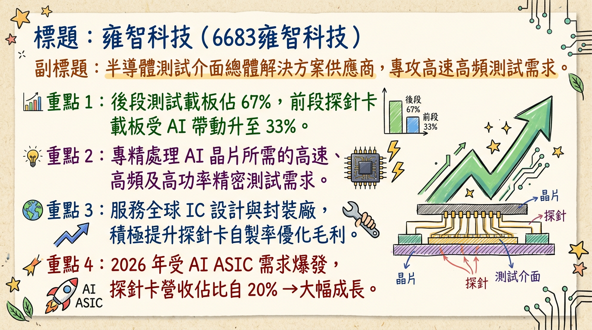
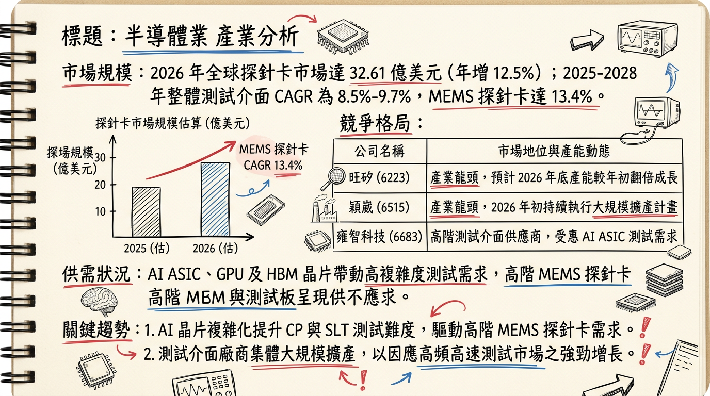
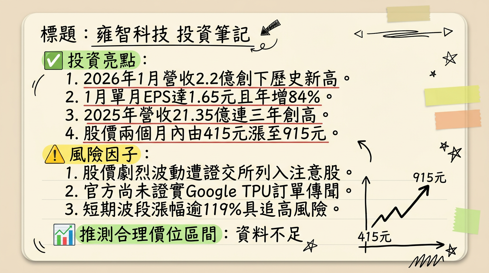

# 6683 雍智科技 深度研究報告

## 一句話摘要
雍智科技受惠於 AI ASIC 與 Wi-Fi 7 升級浪潮，2026 年進入探針卡（Probe Card）規模化獲利爆發期，營收與 EPS 均有望挑戰歷史新高。

---

## 公司概覽
雍智科技為台灣半導體測試介面龍體供應商，主要負責測試載板的設計、製造與組裝。其核心競爭力在於處理**高速、高頻及高功率**的晶片測試需求，並成功切入先進封裝（CoWoS/Chiplet）供應鏈。

### 業務產品線與營收結構 (2025 Q4 基準)
| 產品線 | 應用說明 | 營收占比 |
| :--- | :--- | :--- |
| **前段測試 (CP)** | 晶圓探針卡載板 (Probe Card Carrier Board) | **33%** |
| **後段測試 (FT/SLT)** | IC 測試板 (Load Board)、系統級測試板 | **約 50%** |
| **老化測試 (Burn-in)** | 老化測試板 (Burn-in Board) | **約 12%** |
| **其他服務** | 測試插座 (Socket) 及維修服務 | **約 5%** |

---

## 核心競爭優勢
1.  **高階設計能力：** 具備 80 層以上多層板（Load Board）佈線設計技術，優於多數純探針卡同業。
2.  **大客戶綁定：** 深耕聯發科（MTK）、瑞昱（Realtek）與世芯-KY。在台系 IC 設計端滲透率高，能第一時間參與新案研發。
3.  **在地化佈局：** 上海廠於 2025 Q4 量產，提供中國客戶一條龍服務；美國聖荷西據點則就近服務北美 CSP 客戶。

---

## 財務分析

### 近 6 個月營收趨勢表格
| 月份 | 營收 (億元) | 月增率 MoM | 年增率 YoY | 備註 |
| :--- | :--- | :--- | :--- | :--- |
| **2026/01** | **2.20** | **+16.23%** | **+46.68%** | **歷史單月新高** |
| **2025/12** | 1.89 | -2.79% | +2.70% | |
| **2025/11** | 1.95 | -0.41% | +17.93% | |
| **2025/10** | 1.96 | +5.78% | +20.63% | |
| **2025/09** | 1.85 | -0.30% | +19.19% | |
| **2025/08** | 1.86 | +0.26% | +23.67% | |

### 年度 EPS 趨勢
*   **2024 (實際)：** 17.69 元
*   **2025 (預估)：** 15.0 - 15.2 元 (受匯損及探針外購成本影響)
*   **2026 (法人預估)：** **25.56 元** (預期年增率逾 70%)

---

## 法說會重點
*   **管理層 Guidance (2025/10/23)：** 總經理劉安炫指出 2026 年營收維持「雙位數增長」，且因 MEMS 探針卡規模化，**毛利率必將優於 2025 年**。
*   **訂單能見度：** 目前能見度已達 2026 年下半年，主要動能來自天璣 9400 系列及網通 Wi-Fi 7 晶片測試需求。
*   **產能動態：** 已完成竹北昌益園區搬遷，研發與生產空間大幅擴展，足以應對 2026 年 AI 專案爆發。

---

## 券商觀點

### 目標價整理表格
| 券商名 | 目標價 | 評等 | 日期 | 備註 |
| :--- | :--- | :--- | :--- | :--- |
| **理財週刊/法人共識** | 552 元 | 看多 | 2026/02/12 | 達標，進入高溢價區 |
| **CMoney 研究員** | 615 元 | 買進 | 2026/02/04 | 達標 |
| **康和證券** | 510 元 | 看多 | 2025/12/24 | 已反映 |
| **市場共識最新區間** | **900 - 1000 元** | 維持積極 | 2026/02/26 | 反映 2026 EPS 25.56 元 |

---

## 財報深度分析

### 近 5 季利潤率趨勢
| 季度 | 毛利率 (%) | 營業利益率 (%) | 稅後淨利率 (%) | EPS (元) |
| :--- | :--- | :--- | :--- | :--- |
| **2025 Q3** | 45.31 | 24.92 | 25.00 | 5.11 |
| **2025 Q2** | 43.28 | 26.50 | 6.02 | 1.21 |
| **2025 Q1** | 46.30 | 23.02 | 22.48 | 3.76 |
| **2024 Q4** | 58.35 | 28.63 | 28.40 | 5.01 |
| **2024 Q3** | 54.86 | 31.84 | 23.94 | 3.99 |

*   **存貨分析：** 2025 Q3 存貨天數由 195 天下降至 **168.12 天**，顯示去化速度加快。
*   **資本支出：** 2025 Q3 加大至 **2.76 億元**，主要用於高階測試設備與上海廠擴充。

---

## 股權異動
*   **2026/02/25：** 董事劉安炫及經理人吳興仁申報轉讓（共 20 張）至信託專戶，屬於**限制員工權利新股之股權信託**，並非大股東出脫，屬人才留用之利多。
*   **資本結構：** 目前無發行可轉債（CB），負債比率極低，財務穩健。

---

## 產業分析

### 全球探針卡市佔率 (2025)
| 排名 | 公司 | 總部 | 市佔率 |
| :--- | :--- | :--- | :--- |
| 1 | FormFactor | 美國 | 24% |
| 2 | Technoprobe | 義大利 | 21% |
| 3 | MJC | 日本 | 12% |
| 4 | **旺矽 (MPI)** | 台灣 | 6.5% |
| **中堅** | **雍智科技** | **台灣** | **約 1.5% - 2%** |

### 台灣同業競爭比較
| 公司 | 核心強項 | 2026 預估毛利率 | 2026 預估 EPS |
| :--- | :--- | :--- | :--- |
| **雍智科技** | 測試板設計/AI ASIC | 45% - 48% | **25.56 元** |
| **旺矽** | MEMS 探針卡/量產 | 52% - 55% | 45 - 50 元 |
| **穎崴** | 測試座 (Socket) | 43% - 46% | 40 - 45 元 |
| **精測** | 垂直整合/探針頭 | 50% - 53% | 18 - 22 元 |

---

## 近期催化劑
*   **【利多】2026/02/25：** 自結 1 月 EPS 1.65 元（年增 84%），獲利動能優於市場預期。
*   **【利多】2026/02/24：** 市場傳出透過聯發科切入 Google 下一代 TPU 測試供應鏈。
*   **【利多】AI PC/手機：** 天璣 9400 出貨強勁，帶動測試時程（Test Time）增加。
*   **【風險】估值修正：** 2 月股價觸及 915 元，短期本益比（PE）已反應 2026 成長預期。

---

## ⭐ 成長動能時間軸
*   **2025 Q4：** 上海廠正式運作，開始承接中國在地化封測客戶訂單。
*   **2026 Q1：** AI 手機晶片（聯發科天璣系列）SLT 測試板大量拉貨，1 月營收創歷史新高。
*   **2026 Q2：** 北美 CSP 客戶（Google/Amazon 相關）ASIC 測試案量發酵，美國市場營收目標翻倍。
*   **2026 H2：** MEMS 探針頭自製率提升，學習曲線進入平穩期，毛利率預計挑戰 48% 以上。

---

## 2026 展望
*   **成長動能：**
    1.  **AI ASIC 純度高：** 受惠世芯、創意等設計服務公司新案。
    2.  **Wi-Fi 7：** 網通晶片升級帶動測試板層數與單價（ASP）提升。
*   **主要風險：** 終端消費性電子（手機）復甦若不如預期；地緣政治影響美系元件取得成本。

---

## 投資結論
1.  **獲利轉折點：** 2025 年的毛利陣痛與匯損已過，2026 年是營收與獲利「雙重爆發」的一年。
2.  **產能就緒：** 竹北新廠與上海廠將於 2026 年進入營運高峰，規模經濟顯現。
3.  **目標價建議：** 基於 2026 年 EPS 25.56 元，給予 35-40 倍 PE。
    *   **合理區間：895 - 1,020 元。**
    *   **操作建議：** 近期漲幅已大，若回測 800-830 元區間支撐不破，可視為長期佈局點。

---
**本報告由 AI 自動產生，資料來源為公開網路資訊，僅供參考，不構成投資建議。產生時間：2026-03-01 21:31**

---

## 📊 資訊卡

