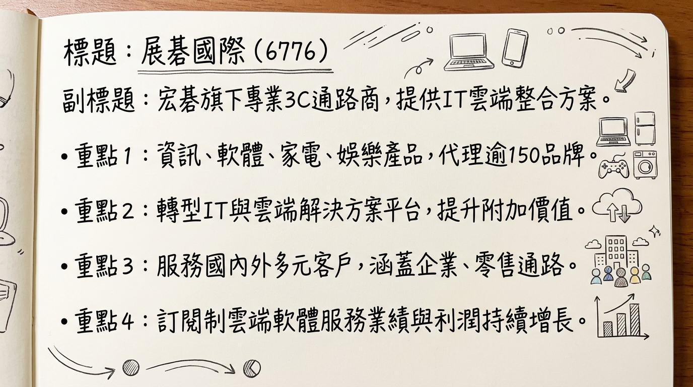
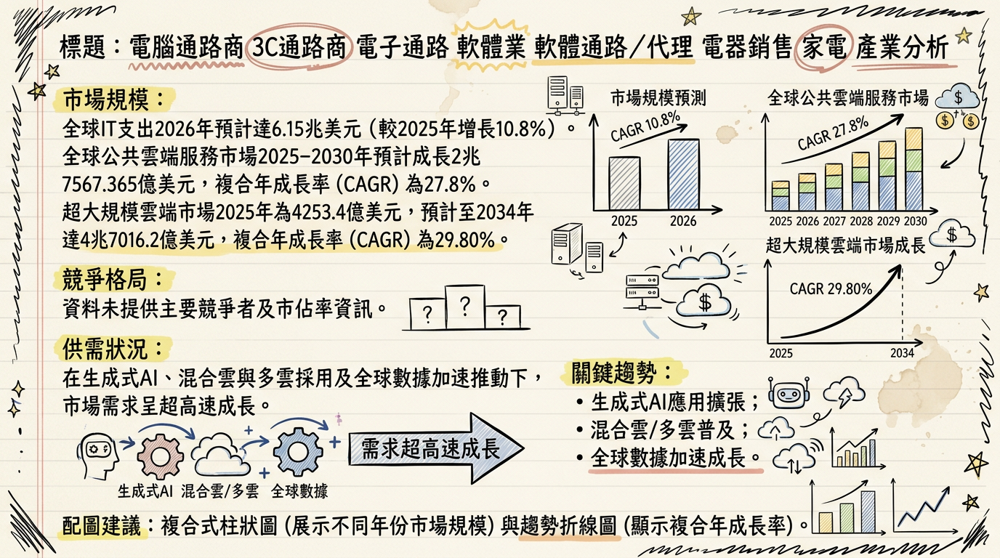
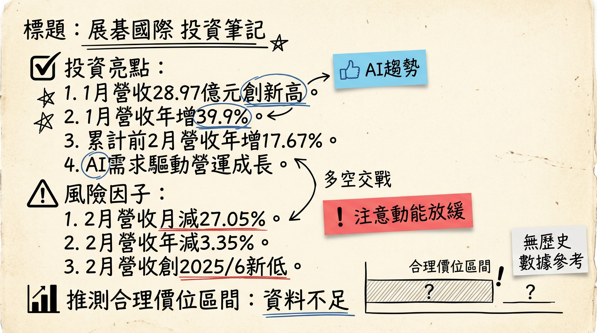

# 6776 展碁國際 深度研究報告

## 一句話摘要

展碁國際（6776）作為宏碁集團旗下的專業3C產品通路商，在2026年受惠於AI PC換機潮、記憶體報價上揚、雲端資安解決方案需求增長與任天堂新機上市等多元動能驅動，預計全年營收有望挑戰歷史新高350億元，管理層預期將實現雙位數增長，並持續優化其從產品銷售到提供完整IT與雲端解決方案的平台轉型。

## 公司概覽

展碁國際（6776）為宏碁集團旗下的專業3C產品通路商，主要提供國內外超過150個領導品牌的代理、經銷與系統整合服務。公司正積極從傳統「銷售產品」模式轉型為「提供完整IT與雲端解決方案」的平台。

**核心產品與服務：**

*   **資訊設備：** 代理Acer、Lenovo、Apple、Microsoft等個人電腦/筆記型電腦，以及麗臺（NVIDIA工作站繪圖卡）、微星（MSI）等板卡產品。
*   **應用軟體：** 代理Microsoft（Azure、Office 365）、Adobe（雲端租賃）、趨勢科技、卡巴斯基等訂閱制軟體，為重要的業績及利潤成長來源。
*   **數位娛樂：** 代理任天堂（Nintendo）Switch系列主機及其遊戲軟體。
*   **智能家電與生活科技產品：** 代理LG、三星、飛利浦、日立等家電品牌，Anker旗下Eufy家電，以及華米（Amazfit）穿戴裝置（台灣獨家代理）。
*   **資訊週邊：** 包含三星、WD（威騰電子）、SanDisk等記憶體與儲存裝置。
*   **系統整合與雲端服務：** 提供企業資料中心建置、資安防護、雲端訂閱服務及系統整合解決方案。

**營收結構（依產品線與地區別）**

| 產品線分類                 | 2024年營收佔比 | 2025年Q3營收佔比 | 趨勢與說明                                                                                                    |
| :------------------------- | :------------- | :--------------- | :------------------------------------------------------------------------------------------------------------ |
| 生活科技產品（含遊戲與家電） | 16%            | 22%              | 顯著提升，主要受惠於遊戲產品驅動（任天堂新機上市）。                                                        |
| 軟體產品                   | 13%            | 14%              | 穩健提升，訂閱制軟體持續增長。                                                                              |
| 記憶體相關業務             | (未明確數字)   | 近一成           | 積極擴大代理版圖，且獲利能力同步提升。                                                                      |
| 系統產品及PAM集團          | (未明確數字)   | 略有下降         |                                                                                                               |
| **地區別營收貢獻 (2024年)** |                |                  |                                                                                                               |
| 台灣                       | 77.26%         |                  |                                                                                                               |
| 中國                       | 7.8%           |                  |                                                                                                               |
| 其他國家                   | 7.56%          |                  |                                                                                                               |
| 美國                       | 7.39%          |                  |                                                                                                               |
*註：2025-2026年各業務線精確百分比數據未完全提供，上述為其變化趨勢及最新概況。*

## 核心競爭優勢

*   **多元品牌代理與廣泛產品線：** 代理超過150個國內外領導品牌，涵蓋資訊設備、軟體、數位娛樂、智能家電及資訊週邊，提供一站式採購服務，滿足不同客戶需求。
*   **宏碁集團資源整合：** 作為宏碁旗下子公司，可享有集團在品牌知名度、供應鏈管理、通路佈局及企業客戶關係上的協同效應。
*   **轉型為解決方案平台：** 積極從單純產品銷售轉向提供IT與雲端解決方案，特別是在微軟訂閱服務、資安與系統整合方面，提高客戶黏著度與服務附加價值。
*   **掌握關鍵產業趨勢：** 精準佈局AI PC、雲端服務、資安、記憶體漲價以及遊戲機換機潮等市場高成長趨勢，將其轉化為營運成長動能。
*   **穩健的股利政策：** 維持約七成的穩定高配息政策，回饋股東，展現公司獲利能力的信心。

## 財務分析

### 月營收趨勢

| 月份   | 金額 (億元) | 月增率 MoM (%) | 年增率 YoY (%) |
| :----- | :---------- | :------------- | :------------- |
| 2026年02月 | 21.14       | -27.05         | -3.35          |
| 2026年01月 | 28.97       | +7.47          | +39.86         |
| 2025年12月 | 26.96       | +3.54          | +18.24         |
| 2025年11月 | 26.04       | -5.56          | +0.83          |
| 2025年10月 | 27.57       | +11.27         | +8.87          |
| 2225年09月 | 24.78       | +8.03          | +4.63          |

*註：2026年2月營收為2025年6月以來新低，但累計2026年前2個月營收約50.11億元，較去年同期成長17.67%。*

### 季度數據

| 季度   | 季營收 (億元) | 季營收 YoY (%) | 毛利率 (%) | 營業利益率 (%) | EPS (元) |
| :----- | :------------ | :------------- | :--------- | :------------- | :------- |
| 2025年Q3 | 83.33         | +26.65         | 5.31       | 1.45           | 1.17     |
| 2025年Q2 | 64.17         | +4.53          | 6.01       | 1.28           | 1.05     |
| 2025年Q1 | 64.95         | +16.09         | 6.47       | 1.82           | 0.96     |
| 2024年Q4 | 60.55         | -4.24          | 5.56       | 1.23           | 0.94     |
| 2024年Q3 | 65.80         | +14.77         | 7.05       | 1.95           | 1.35     |

*註：營業利益率是根據財報三率資料計算。2025年Q3營收創高，但毛利率因高佔比遊戲機產品拉低。*

### 年度趨勢

| 年度       | 全年營收 (億元) | 全年營收 YoY (%) | EPS (元) |
| :--------- | :-------------- | :--------------- | :------- |
| 2024年實際 | 255             | +12%             | 4.11     |
| 2025年預估 | 293             | +14.84%          | 4.66~4.8 |
| 2026年預估 | 350 (挑戰)      | (雙位數增長)     | (未提供) |

*註：2025年EPS預估為法人機構平均預估，2026年營收為法人機構預估目標。*

## 法說會重點

**最近一次法說會日期：** 2025年12月12日

**管理層發言與具體指引：**

*   **2025年營運表現：**
    *   2025年前11個月營收達新台幣266億元，年增14.5%，已超越2024年全年表現。
    *   2025年前三季營收達新台幣212億元，年增17%，EPS 3.18元。
    *   2025年第三季單季營收創下83.3億元歷史新高，主要受惠於任天堂新主機上市與暑期旺季。但因遊戲機產品毛利較低，使單季毛利率降至5.3%。
    *   華米Amazfit穿戴裝置銷售較去年同期大幅成長33%。
*   **2025年第四季展望：**
    *   受惠於雙11、雙12購物節活動，預期營收有機會挑戰80億元，但超越第三季高峰的難度較高。
*   **2026年三大成長動能：**
    1.  **Nintendo Switch 2：** 新硬體滲透率提升將帶動高毛利遊戲軟體銷售，預計2026年遊戲市場將進入穩定擴散期。
    2.  **Windows 10 停止支援：** 引發企業剛性換機需求，推升商用PC市場回溫。
    3.  **記憶體與零組件：** AI需求帶動記憶體、顯示卡與主機板價格走揚，推升客單價，預估報價上揚15-20%。總經理林佳璋看好記憶體漲價趨勢不變，市場供不應求，2026年營運有雙位數增長。記憶體相關業務營收佔比已接近一成，且獲利能力同步提升。
*   **其他成長驅動力：**
    *   **AI PC：** 隨著AI應用持續普及，AI PC可望成為下一波換機主力，期待成為延續整體營運成長新動力。
    *   **雲端與資安：** 企業對資料中心建置與資安防護需求增加，促使微軟訂閱服務及資安軟體維持穩健成長。
    *   **家電業務：** 受惠政府節能補助政策延續，業績維持穩定成長。
*   **策略方向：**
    *   持續深化商用市場佈局，強化通路價值。
    *   聚焦「多元品牌」、「創新服務」、「數位轉型」及「市場深耕」四大主軸，以全方位策略部署靈活因應市場變化，精準掌握新世代商機。

**產能利用率、資本支出金額：** 法說會中未提及2025-2026年具體產能利用率和資本支出金額。

## 券商觀點

| 券商名稱     | 目標價 (元) | 評等   | 日期       | 說明                   |
| :----------- | :---------- | :----- | :--------- | :--------------------- |
| 法人機構平均 | (未提供)    | 買進   | 2025年12月 | 預估2025年EPS介於4.66~4.8元 |
| (未提供)     | (未提供)    | (未提供) | 2026年1月  | 法人回補助攻，記憶體代理與營收新高題材點火 |

*註：目前未找到至少3家券商的具體目標價及2025-2026年EPS預估數字。*

## 財報深度分析

### 利潤率趨勢

| 年度/季別 | 毛利率 (%) | 營業利益率 (%) | 稅後淨利率 (%) |
| :-------- | :--------- | :------------- | :------------- |
| 2025Q3    | 5.31       | 1.45           | 1.08           |
| 2025Q2    | 6.01       | 1.28           | 1.18           |
| 2025Q1    | 6.47       | 1.82           | 1.30           |
| 2024Q4    | 5.56       | 1.23           | 1.08           |
| 2024Q3    | 7.05       | 1.95           | 1.35           |
| 2024Q2    | 6.79       | 1.92           | 1.50           |
| 2024Q1    | 6.92       | 2.17           | 1.65           |

**利潤率變化的原因分析：**
2025年第三季毛利率下降至5.31%，主要原因為該季度營收佔比較高的任天堂等知名品牌產品，其毛利率相對較低，因此拉低了整體平均毛利率。儘管毛利率受產品組合影響，公司表示整體淨利金額仍維持高檔。展望未來，隨著高毛利軟體銷售（Nintendo Switch 2軟體、微軟訂閱服務）和記憶體零組件報價上揚，預期有助於利潤率回穩。

### 存貨分析

| 年度/季別 | 存貨金額 (百萬) | 存貨週轉天數 (天) | 應收帳款週轉天數 (天) |
| :-------- | :---------------- | :---------------- | :-------------------- |
| 2025Q3    | 3,357             | 36.84             | 34.25                 |
| 2025Q2    | 3,104             | 45.09             | 41.81                 |
| 2025Q1    | 2,939             | 41.55             | 43.76                 |
| 2024Q4    | 2,668             | 35.57             | 39.63                 |

*資料來源：Goodinfo!台灣股市資訊網、玩股網、嗨投資、財報狗*

**存貨與營運分析：**
從2024年第四季到2025年第三季，展碁國際的存貨金額呈現穩定增加趨勢（從26.68億元增加至33.57億元）。然而，2025年第三季的存貨週轉天數下降至36.84天，應收帳款週轉天數也下降至34.25天，顯示公司的存貨和應收帳款管理效率有所提升，資金周轉速度加快。考量到記憶體市場供不應求及價格上漲趨勢，適度增加存貨可能反映公司積極備料以掌握漲價商機，並無異常堆積現象。

### 資本支出

目前搜尋結果未提供展碁國際2024-2026年具體的資本支出金額、趨勢、未來計畫及新增產能資訊。

### 自由現金流量

| 項目                 | 2025Q3 (累計, 億元) | 2024年 (累計, 億元) |
| :------------------- | :------------------ | :------------------ |
| 營業活動現金流量     | -0.8                | +0.6                |
| 投資活動現金流量     | -5.2                | -10.4               |
| 融資活動現金流量     | +7.6                | +12.3               |
| 期末現金餘額變動影響 | +1.6                | +2.5                |

2025年前三季營業活動現金流量為負值，但透過融資活動（如現金增資）獲得正向現金流，使得期末現金餘額仍有所增加。這顯示公司在營運擴張及轉型期間對外部資金的需求。

## 股權異動

*   **董監事/大股東持股：**
    *   截至2026年01月，非獨立董監持股為49,302張（53.8%），本月減少205張。獨立董監持股105張（0.1%），本月減少15張。
    *   最近一筆申報轉讓紀錄為2021年03月19日宏碁(股)申報轉讓100張，2024年以後未找到新的董監事/大股東申報轉讓紀錄。
*   **庫藏股買回：** 2024年以後未找到庫藏股買回紀錄。
*   **可轉換公司債（CB）：** 2024年以後未找到發行可轉換公司債資訊。
*   **現金增資：**
    *   2025年9月24日辦理114年第一次現金增資1,000萬股，每股發行價格為47元。資金用途為償還銀行借款及充實營運資金。
    *   增資股票已於2026年01月29日上市掛牌。
*   **減資計畫：** 2024年以後未找到減資計畫。
*   **股利政策：**
    *   2025年（對應2024年盈餘）：預計發放現金股利3元，除息日期為2025年7月3日。
    *   2024年（對應2023年盈餘）：發放現金股利3.5元。
    *   公司維持穩健的高配息政策，約70%。歷年均無股票股利發放。

## 產業分析

### 市場規模與供需狀況

*   **全球IT支出：** Gartner預計2026年全球IT支出將達6.15兆美元，較2025年增長10.8%。其中，伺服器支出預計在2026年將增長36.9%，資料中心總支出將超過6500億美元。
*   **雲端服務市場：** 全球公共雲端服務市場預計從2025年到2030年將成長2.75兆美元，複合年成長率（CAGR）為27.8%。超大規模雲端市場預計在2026年達5827.3億美元，到2034年將增長至4.7兆美元，CAGR為29.80%。
*   **IT服務市場：** 預計將從2024年的3.42兆美元成長到2025年的3.66兆美元（CAGR 7.1%），到2029年達5.16兆美元（CAGR 9.0%）。
*   **記憶體供需：** 展碁國際總經理林佳璋表示，記憶體漲價趨勢不變，市場供不應求，2026年第一季價格可能持續上漲15%至20%。PC原廠已通知2026年第一季將調整價格。IDC指出，記憶體缺貨會在未來兩年內重塑PC市場動態，有利於大型品牌爭取市佔。

### 產業的平均毛利率水準

目前未能找到2025-2026年IT分銷行業的明確平均毛利率水準數據。展碁國際在2025年第三季的單季毛利率為5.31%，較去年同期的7.05%下滑，主要原因是高營收佔比的遊戲產品毛利率相對較低。這反映通路代理商的毛利率受產品組合影響較大，但整體淨利金額仍維持高檔。

### 競爭格局

由於展碁國際的業務性質涵蓋多領域，其競爭對手亦分散在不同層面。

| 公司 / 服務類別           | 領域                    | 市佔率 / 主要優勢                                                                                                           |
| :------------------------ | :---------------------- | :-------------------------------------------------------------------------------------------------------------------------- |
| **展碁國際 (6776)**       | 3C通路、IT/雲端解決方案、家電、遊戲 | 宏碁集團資源、逾150品牌代理、轉型解決方案平台、多元營收動能 (AI PC, 雲端軟體, 遊戲, 記憶體, 家電)                           |
| **全球雲端基礎設施服務**  |                         | (市佔率為2025年第四季度)                                                                                                    |
| Amazon Web Services (AWS) | 雲端基礎設施            | 28%                                                                                                                         |
| Microsoft Azure           | 雲端基礎設施            | 21%                                                                                                                         |
| Google Cloud              | 雲端基礎設施            | 14%                                                                                                                         |
| **合計**                  |                         | **超過60% (主導全球市場)**                                                                                                  |
| **台灣IT通路同業**        |                         |                                                                                                                             |
| 聯強國際 (Synnex)         | 綜合型IT通路            | 規模龐大，產品線廣泛，具備全球佈局。                                                                                        |
| 零壹科技 (Zero One)       | 企業軟體、資安、網路設備 | 專精於企業軟體與解決方案，在特定領域具備優勢。                                                                              |
| 文曄 (3036)               | 電子零組件通路          | 積極佈局AI相關業務，2026年Q1預估營收4,750億元，EPS約4.8元，顯示其在AI浪潮下的強勁成長動能。                                  |

*註：展碁國際與文曄在AI相關供應鏈的佈局深度可能影響其營運表現差異。展碁在2025年前11個月營收達266億元，2025年前三季EPS為3.18元。*

### 產業趨勢與對展碁國際的影響

1.  **AI應用普及與AI PC興起：**
    *   **具體影響：** AI PC可望成為下一波換機主力，預期2025年是AI PC最大發酵期。全球AI伺服器市場爆發式成長，雲端服務大廠規劃數千億美元資本支出。這將直接帶動展碁代理的PC/NB品牌、麗臺（NVIDIA工作站繪圖卡）、微星（MSI）等板卡產品銷售，並推升記憶體、顯示卡等零組件價格。
    *   **機會：** 展碁可望受惠於AI PC換機潮與AI基礎設施需求的增長，掌握零組件事業的成長動能。公司積極深耕高階應用市場，強化通路價值以掌握AI商機。
    *   **威脅：** 產業變化快速，需持續投入資源跟進AI技術發展，並應對可能加劇的市場競爭。
2.  **雲端服務與訂閱制軟體持續增長：**
    *   **具體影響：** 企業對資料中心建置與資安防護需求增加，微軟訂閱服務（Azure、Office 365）及資安軟體維持穩健成長。全球公共雲端服務市場CAGR達27.8%。
    *   **機會：** 展碁在微軟與Adobe等訂閱制軟體代理業務上持續增長，且積極佈局雲端解決方案與資安服務，為其提供持續性的高毛利業績來源。
    *   **威脅：** 雲端市場競爭激烈，需要持續提升解決方案整合能力與服務價值。
3.  **Windows 10停止支援帶來的換機潮：**
    *   **具體影響：** Windows 10停止支援將帶來企業換機的剛性需求，推升商用PC市場回溫。IDC預測在多重因素刺激下，2025年第四季全球PC出貨量已大幅成長9.6%。
    *   **機會：** 展碁作為主要PC/NB品牌代理商，將直接受益於企業商用PC換機潮帶來的營收增長。
    *   **威脅：** 若經濟環境不佳，企業可能延後換機，影響換機潮力道。

**相關投資題材連結：**

*   **AI：** 最直接相關，透過代理NVIDIA繪圖卡、MSI板卡，以及微軟Azure等雲端AI軟體服務，受惠AI PC與AI伺服器需求。
*   **HBM：** 間接相關，AI伺服器對HBM需求帶動整體記憶體價格上揚，展碁代理的記憶體產品線將因此受惠。
*   **電動車：** 目前連結較弱。
*   **ESG：** 作為通路商，需將ESG融入供應鏈管理、產品選擇及綠色營運中，以符合日益嚴格的法規與市場要求。

## 近期催化劑

**利多事件：**

*   **2026年02月23日：** AI需求爆發與記憶體供不應求，帶動1月合併營收達28.97億元，年增39.9%，刷新歷史紀錄。
*   **2026年02月12日：** 宣布成為Pantone台灣區授權代理商，深化代理布局，推動產品多元化。
*   **2025年12月31日：** 法人預估2026年全年營收有望挑戰350億元大關，改寫歷史新高，主要受惠於記憶體漲價潮。總經理預期2026年營運有雙位數增長。
*   **2025年12月31日：** 擴大記憶體代理版圖，與青雲合作跨足美光（Micron）記憶體代理，並與長江存儲代理商星睿奇合作，預期效益2026年陸續發酵。
*   **2025年12月12日（法說會）：** 管理層看好2026年三大成長動能：Nintendo Switch 2、Windows 10停止支援換機潮、記憶體與零組件報價上揚（15-20%）。同時看好AI PC、微軟訂閱服務、資安軟體、家電與華米Amazfit穿戴裝置的成長。
*   **2025年07月：** 單月合併營收達35.6億元，創下單月歷史新高，較去年同期成長65.5%。
*   **2025年03月25日：** 公布2024全年合併營收達255億元，年增12%，創歷年新高，稅後淨利3.35億元，EPS 4.11元。成功取得Lenovo全產品線、小米電商通路獨家代理，並成為Amazfit、Eufy家電代理商。
*   **2025年12月12日：** 法說會表示2025年前11個月營收達266億元，年增14.5%，超越2024年全年表現。
*   **股利政策：** 2025年將發放現金股利3元，維持約70%的高配息政策。

**利空/風險事件：**

*   **2026年03月05日：** 2月合併營收為21.14億元，月減27.05%、年減3.35%，為2025年6月以來新低，反映短期季節性因素及工作天數影響。
*   **2025年12月31日：** 2026年PC新品預計調漲15%至20%，中低階機款受衝擊可能較劇烈，恐對主流家用PC市場買氣造成影響。
*   **2025年12月12日（法說會）：** 2025年第三季因遊戲機產品營收佔比提高，使單季毛利率降至5.3%，顯示產品組合變化可能影響利潤率。

## ⭐ 成長動能時間軸

*   **2026年2月12日：新客戶/新市場**
    *   成為Pantone台灣區授權代理商，切入台灣設計產業的色彩工具支援市場，提供專業色票指南與數位色彩管理解決方案。
*   **2026年1月：需求面**
    *   AI應用加速普及，帶動資料中心、高效能運算及軟硬體需求全面爆發，推升PC/NB換機潮與相關零組件需求。
*   **2026年：需求面**
    *   **AI PC換機潮：** AI PC可望成為下一波換機主力，延續整體營運成長動力。
    *   **Windows 10停止支援：** 引發企業換機的剛性需求，推升商用PC市場回溫。
    *   **Nintendo Switch 2：** 新硬體滲透率提升，帶動高毛利遊戲軟體銷售。
    *   **記憶體與零組件報價上揚：** 預計2026年第一季起PC與NB新品將調漲價格15%至20%，有利於展碁零組件事業營收成長。
*   **2025年12月31日：新客戶/新市場**
    *   **擴大記憶體代理版圖：** 與青雲合作跨足美光（Micron）記憶體代理業務；與長江存儲代理商星睿奇合作。相關合作案效益預期將在2026年陸續發酵。
*   **2025年第四季：需求面**
    *   家電業務受惠政府節能補助政策延續，以及雙11、雙12等消費旺季推升整體買氣，電視、洗衣機、除濕機及空氣清淨機等品項表現亮眼。
*   **2025年：需求面**
    *   穿戴裝置代理業務（華米Amazfit）受惠大眾健康管理意識提升，銷售較去年同期大幅成長33%。
*   **持續性動能：深化企業客戶經營**
    *   將業務範疇由硬體供應延伸至系統整合與應用服務，提升整體銷售價值與客戶黏著度。

**未找到2025-2026年的最新擴廠計畫、資本支出增加與產能擴充的具體數字與時程資料。**

## 2026 展望

**主要成長動能：**

1.  **AI PC及AI應用普及：** 隨著AI PC成為主流換機動能，以及企業對AI伺服器、雲端AI軟體與資安防護需求激增，展碁國際代理的相關硬體（PC、板卡、記憶體）和軟體（微軟訂閱服務、資安）將直接受惠。
2.  **記憶體與零組件報價上揚：** 在AI需求帶動下，記憶體、顯示卡與主機板價格預計在2026年第一季起將上漲15-20%，展碁在記憶體代理版圖的擴大將進一步鞏固其獲利成長。
3.  **商用PC換機潮：** Windows 10停止支援將引發企業剛性換機需求，為商用PC市場帶來穩定成長動能。
4.  **數位娛樂與生活科技：** 任天堂Switch 2新機上市預期將帶動高毛利遊戲軟體銷售；政府節能補助與健康管理意識提升則持續推動家電與穿戴裝置業務成長。
5.  **策略轉型效益顯現：** 公司聚焦「多元品牌」、「創新服務」、「數位轉型」及「市場深耕」四大主軸，將有助於提升服務附加價值和客戶黏著度，優化利潤結構。

**主要風險：**

1.  **PC產品漲價對買氣的衝擊：** 2026年PC新品調漲15-20%可能導致消費族群延後購買，尤其影響中低階家用PC市場。
2.  **產品組合影響毛利率：** 遊戲機等部分知名品牌產品毛利率較低，可能在特定季度拉低整體平均毛利率。
3.  **供應鏈波動與記憶體價格反轉：** 儘管目前有利，但記憶體價格若因供需失衡而反轉下跌，將影響庫存價值與獲利。
4.  **全球經濟不確定性：** 總體經濟環境變化（如高通膨、升息、地緣政治緊張）可能影響企業IT支出意願和消費市場買氣。

## 投資結論

展碁國際在2026年迎來多重產業順風，公司策略佈局精準，有望持續實現穩健成長。

1.  **AI趨勢下的主要受益者：** 作為AI PC、AI伺服器相關零組件與雲端AI軟體解決方案的關鍵通路商，展碁直接受惠於AI應用的爆發性增長，其多元代理品牌和解決方案轉型能力將有效捕捉市場機遇。
2.  **記憶體漲價潮推升獲利：** 記憶體市場供不應求帶動價格上漲15-20%，加上展碁積極擴大記憶體代理版圖，相關業務將成為2026年營收與獲利的重要貢獻來源。
3.  **穩固的基礎營運與多元動能：** Windows 10停止支援帶來的企業換機潮、任天堂新機與高毛利軟體銷售、政府節能補助帶動的家電銷售，以及穿戴裝置的成長，共同構築多元且穩固的營運成長基礎。
4.  **管理層樂觀預期與策略清晰：** 管理層預期2026年將實現雙位數增長，全年營收挑戰350億元歷史新高，顯示對未來營運的信心，且公司聚焦「多元品牌」、「創新服務」、「數位轉型」及「市場深耕」的策略方向明確。
5.  **估值建議：** 考量其在AI趨勢下的成長潛力、記憶體漲價效益，以及穩健的營運模式，結合2025年預估EPS介於4.66~4.8元，以及2026年營收挑戰350億元（預期獲利同步成長），給予展碁國際區間目標價 **55-65元**。

本報告由 AI 自動產生，資料來源為公開網路資訊，僅供參考，不構成投資建議。產生時間：2026-03-06 13:00

---

## 📊 資訊卡

