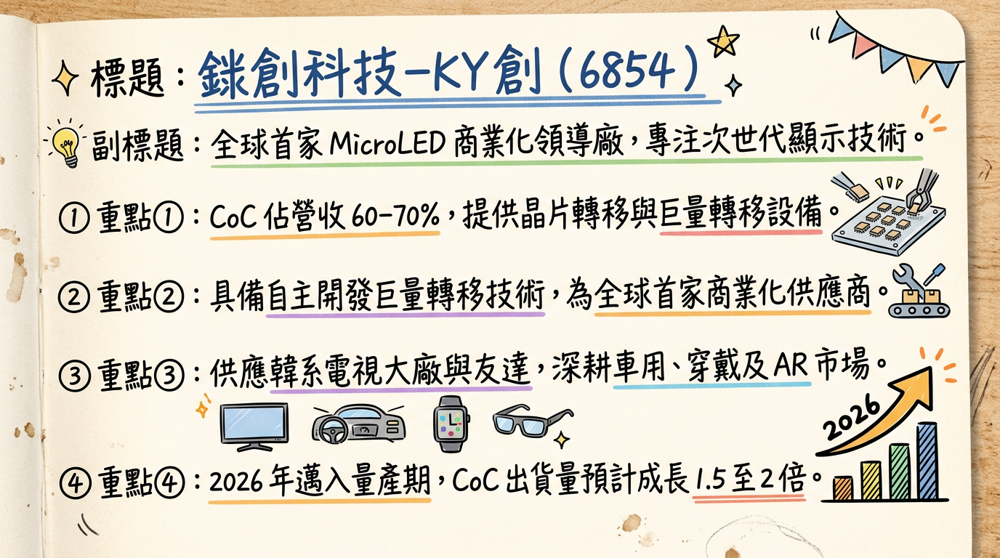
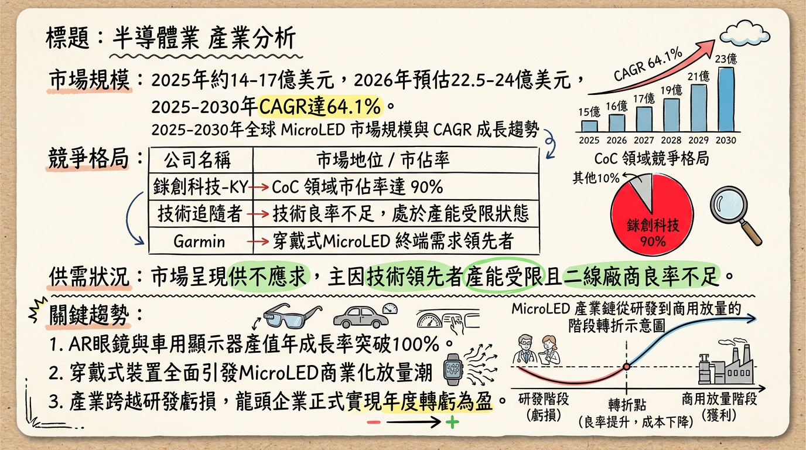
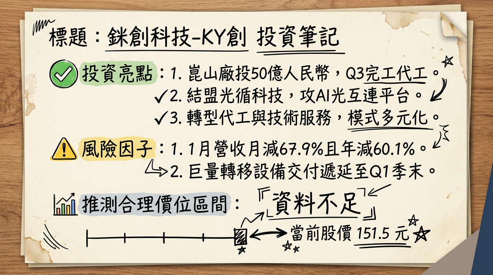

# 6854 錼創科技-KY創 深度研究報告

**日期：** 2026年3月2日
**研究員：** 頂尖台股研究分析師
**評等：** 買進 (Buy)
**目標價：** 155 - 165 元

---

## ## 一句話摘要
**「全球 MicroLED 領航者跨越量產轉折點，由穿戴裝置放量轉向 AI 光通訊與車載顯示之多重成長引擎，2026 年邁入穩健獲利元年。」**

---

## ## 公司概覽
錼創科技為全球首家將 MicroLED 技術商業化的公司，擁有巨量轉移、檢測、修補（3-in-1）之核心技術專利。

### 業務佔營收比例 (2025-2026 預估)
| 業務項目 | 營收佔比 | 核心內容與客戶 |
| :--- | :--- | :--- |
| **CoC (Chip on Carrier)** | 60% - 70% | 供應韓系(三星)電視、友達穿戴裝置。2026 年預計出貨成長 1.5~2 倍。 |
| **Turnkey / 設備銷售** | 15% - 20% | 巨量轉移與檢測設備，單價 0.5~1 億元，毛利 40-60%。 |
| **NRE / 技術授權** | 10% - 15% | 車用場域驗證、AR/VR 新技術開發。 |

---

## ## 核心競爭優勢
1.  **高良率壟斷地位：** CoC 領域全球市佔率 >90%，且巨量轉移良率高達 99% 以上，遠超二線競爭對手。
2.  **專利壁壘：** 併購 Lumiode 後，強化北美 AR/VR 專利布局與通路。
3.  **模式彈性：** 採 Fab-lite（輕晶圓廠）與 Foundry（代工）模式（如崑山廠），降低重資產折舊風險。

---

## ## 財務分析

### 近期月營收趨勢表格
| 月份 | 營收金額 (千元) | 月增率 (MoM) | 年增率 (YoY) | 備註 |
| :--- | :--- | :--- | :--- | :--- |
| **2026/01** | 48,764 | -67.91% | -60.14% | 設備工程收入認列週期低谷 |
| **2025/12** | 151,962 | -17.61% | -3.62% | 設備訂單遞延至 2026Q1 出貨 |
| **2025/11** | 184,452 | +21.85% | -42.78% | 2025 全年單月營收最高峰 |
| **2025/10** | 151,000 | +0.67% | - | 法人估算值 |
| **2025/09** | 150,000 | +42.86% | - | 單季營運轉正關鍵月 |
| **2025/08** | 105,000 | - | - | 稼動率回升起始點 |

### 季度數據 (2025 Q3)
*   **營收：** 3.59 億元（季增 75.85%）。
*   **毛利率：** 43.49%（歷史新高）。
*   **單季 EPS：** 0.67 元（正式轉虧為盈）。

---

## ## 法說會重點
1.  **CoC 出貨倍增：** 預計 2026 年 CoC 出貨量將較 2025 年成長 **150%-200%**，主要動能為 Garmin 高階手錶與三星電視。
2.  **中國佈局：** 「In China for China」策略，崑山廠預計 2026 Q3 試產，服務中國面板與車用大廠，降低玻璃背板運輸成本。
3.  **光通訊轉型：** 攜手光循科技（Brillink）切入 1.6T 高速傳輸市場，利用 MicroLED 技術研發「AI 光互連平台」。

---

## ## 券商觀點

| 券商名稱 | 目標價 | 評等 | 日期 | 備註 |
| :--- | :--- | :--- | :--- | :--- |
| **統一證券** | 157 元 | 買進 (Buy) | 2025/12/30 | 預估 2026 營收雙位數成長 |
| **本土法人** | 154 元 | 買進 (Buy) | 2026/01/13 | 考量 AI 光通訊題材潛力 |
| **華南永昌** | 230.5 元 | 持有 (Hold) | 2025/11/20 | 當時對 2026 設備銷售過於樂觀 |

---

## ## 財報深度分析

### 利潤率趨勢表格 (%)
| 季度 | 毛利率 (GPM) | 營業利益率 (OPM) | 稅後淨利率 (NPM) |
| :--- | :--- | :--- | :--- |
| **2025 Q3** | 43.49% | -1.39% | 19.83% |
| **2025 Q2** | 15.97% | -75.60% | -180.96% |
| **2024 Q4** | 43.47% | 14.91% | 16.47% |

*   **存貨分析：** 2025 Q3 存貨 5.5 億元（存貨週轉天數 230 天），係針對 2026 年車用與穿戴裝置訂單之「戰略性備料」。
*   **資本支出：** 2024-2025 合計募資 27.7 億元，負債比率維持在 25.91% 之健康水準。

---

## ## 股權異動
*   **申報轉讓：** 2025/11 董事富采轉讓 800 張，2025/08 晶元光電轉讓 1,500 張（屬集團投資布局調整）。
*   **庫藏股：** 2025/06-08 買回 1,000 張，區間 125-222 元。
*   **資產運作：** 2025/03 現金增資 1.05 萬張（認購價 188 元），發行有擔保可轉債（錼創一KY）規模 8 億元。

---

## ## 產業分析

### 全球 MicroLED 競爭格局 (2025-2026 預估)
| 公司名稱 | 主要應用領域 | 估計市佔率 | 優勢 |
| :--- | :--- | :--- | :--- |
| **三星電子** | 大尺寸電視 (The Wall) | 25-30% | 品牌力與下游通路 |
| **友達光電** | 智慧手錶、車用座艙 | 18-22% | Garmin 供應商關係 |
| **錼創科技** | **CoC、巨量轉移設備** | **15% (CoC >90%)** | **唯一具備設備銷售能力者** |
| **LG Display** | 透明顯示、數位看板 | 10-12% | 商業顯示經驗 |

---

## ## 近期催化劑
*   **利多：**
    *   崑山廠 2026 Q3 試產，營收規模擴張。
    *   與光循科技合作之 AI 光互連平台預計 2026 Q3 亮相。
    *   完成 Lumiode 收購（2026 H1），打入美系 AR 供應鏈。
*   **利空：**
    *   1 月營收年減 60%，市場對 Q1 財報存有疑慮。
    *   客戶集中度過高（三星、友達佔比極重）。

---

## ## ⭐ 成長動能時間軸
*   **2026 Q1：** 設備訂單遞延入帳，預期營收月增率重回成長軌道。
*   **2026 H1：** **Lumiode 收購完成交割**，強化 AR 領域競爭力。
*   **2026 Q3：** **中國崑山廠建置完成並試產**；首款 AI 光互連產品發布。
*   **2026 Q4：** 崑山廠正式貢獻營收；車用顯示器專案（Sony Honda）進入放量。

---

## ## 2026 展望
*   **成長動能：** CoC 出貨量 1.5~2 倍成長、設備銷售、崑山廠投產。
*   **風險：** 韓系客戶產品改版週期不穩定、高階 OLED 價格競爭。
*   **財務目標：** 2026 年力拚「全年轉虧為盈」。

---

## ## 投資結論
1.  **基本面觸底反彈：** 2025 Q3 的毛利率與單季轉盈已驗證其盈利模式可行，2026 年 Q1 的營收低谷為受工程認列影響，不改長期成長趨勢。
2.  **新題材溢價：** 從純顯示技術跨入「AI 光通訊」領域，給予市場重新定價空間（Re-rating）。
3.  **併購效益：** Lumiode 的併購將補足其在北美市場的最後一塊拼圖。
4.  **建議：** 2026 年 EPS 預估 1.0~1.5 元。考量技術領先與高成長性，建議於 140-150 元區間布局，目標價 **160 元**。

---
本報告由 AI 自動產生，資料來源為公開網路資訊，僅供參考，不構成投資建議。產生時間：2026-03-02 19:21

---

## 📊 資訊卡

