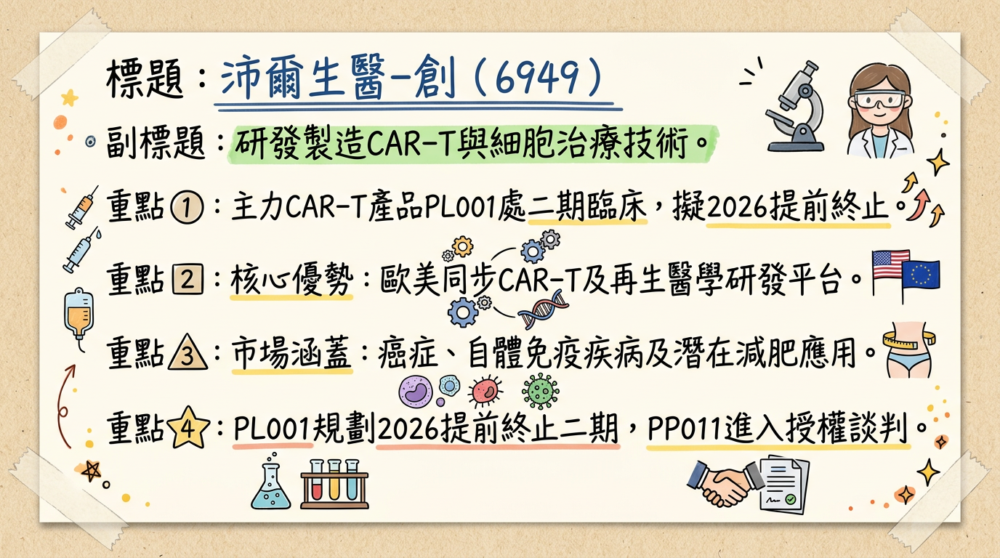
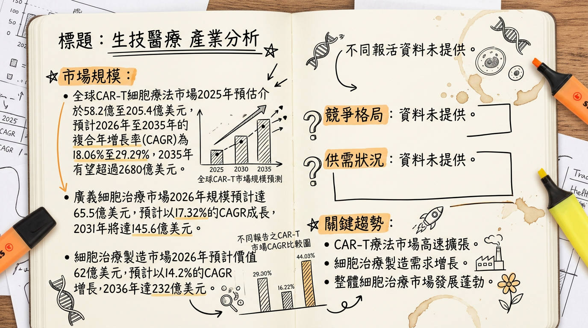
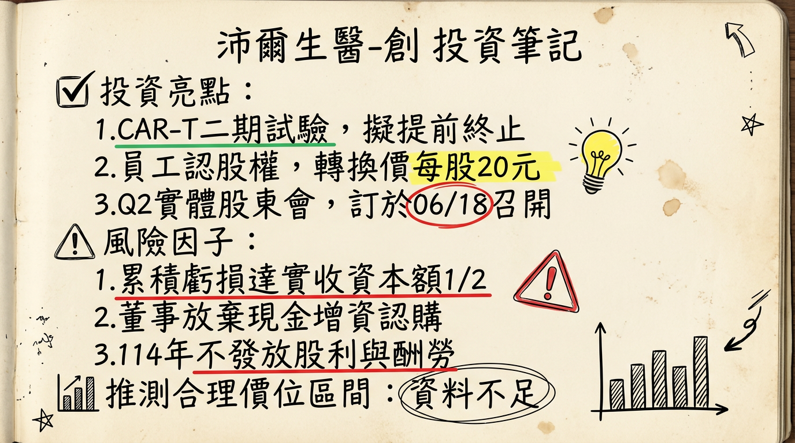

# 6949 沛爾生醫-創 深度研究報告

## 一句話摘要

沛爾生醫-創正值關鍵轉型期，儘管2025年仍處於虧損狀態（EPS -7.23元，累積虧損達實收資本額二分之一），但公司多項CAR-T及新型胜肽產品線具備領先技術與臨床進度。隨著竹北PIC/S GMP廠預計於2026年第一季啟動商業化生產，新型胜肽PP011預計於2026年第三季進入一期臨床，以及PL001 CAR-T提前終止二期試驗的加速上市潛力，公司營運有望逐步從純研發轉向商業化，為未來營收帶來顯著成長動能。然而，其仍面臨高昂的研發成本、激烈的市場競爭與不確定的授權談判進度等挑戰。

## 公司概覽

沛爾生醫-創（6949）主要從事「嵌合抗原受體T細胞（CAR-T）」相關服務及產品的研發、開發與製造，以及特管辦法細胞產品。公司致力於開發與推動與歐美同步的免疫細胞治療及幹細胞再生醫學治療技術。

### 核心產品線

*   **PL001 (CD19 CAR-T)**：用於治療B細胞淋巴癌。目前正進行第二期臨床試驗，已取得衛福部同意臨床試驗計畫書變更，增列期中報告並計畫依分析結果**申請提前終止臨床二期試驗**。
*   **新型胜肽產品PP011**：規劃用於類風濕性關節炎的治療。臨床前試驗顯示對比輝瑞藥物有相當的消炎作用，且擁有更好的骨密度修復。該產品也被發現對**減肥市場具高度潛力**，並已引發藥廠興趣，正進行授權談判中。預計2026年上半年申請人體臨床試驗，下半年啟動，並計畫於2026年第三季啟動第一期臨床試驗。
*   **間皮素多鏈CAR-T (PL002)**：用於治療卵巢癌。目標是2027年申請進入人體臨床試驗，2028年啟動一/二期試驗。
*   **BCMA CAR-T (PL003)**：針對多發性骨髓瘤。已啟動動物試驗，並已在國內用於三位恩慈療法病患，腫瘤控制率與消除率有不錯成效。目標是2026年下半年申請人體臨床試驗，2027年正式啟動第一期臨床試驗。
*   **慢病毒製造技術**：公司擁有專利的新型慢病毒（LV）製造技術，可有效將DNA導入細胞，大幅降低製造成本，並有助於突破全球細胞基因療法面臨的關鍵原料供應瓶頸。竹北廠預計最快於2026年開始產出GMP等級的慢病毒。

### 營收結構

根據2026年1月27日的報導，細胞製品佔營收比重高達98%。

| 業務類別         | 佔營收比重 (約) | 備註                                       |
| :--------------- | :-------------- | :----------------------------------------- |
| 細胞製品 (CAR-T, 特管辦法) | 98%             | 主要營收來源                               |
| 其他             | 2%              | 包含因子公司對新客戶委任規劃廠房設計收入等 |

## 核心競爭優勢

1.  **領先的CAR-T技術平台：**
    *   **PL001臨床療效優異：** 法說會指出，PL001的臨床數據令人振奮，超過**60%**的病患腫瘤完全消失，其中最長追蹤達四年，其療效優於諾華現有產品Kymriah (約50%)。
    *   **新型慢病毒製造技術：** 擁有專利的新型慢病毒製造技術，有效降低製造成本並解決全球關鍵原料供應瓶頸。
    *   **7日高Tscm（幹細胞樣記憶T細胞）製程與多鏈CAR技術：** 提升CAR-T細胞的製造效率與潛在療效。
2.  **多元化產品線與市場拓展潛力：**
    *   除了CAR-T治療血液癌，PL002佈局實體瘤（卵巢癌），符合產業擴展趨勢。
    *   新型胜肽PP011不僅針對類風濕性關節炎，更發現**減肥市場潛力**，有望大幅擴展市場應用範圍。
    *   未來開發重心轉向**異體產品**，具備「現成」產品的成本與生產優勢。
3.  **自主GMP製造能力：**
    *   竹北生醫園區的PIC/S GMP廠面積達**1,000坪**，CAR-T產能規劃為每年**300例**，預計2026年第一季開始商業化生產，並預留**200坪**空間專門投入慢病毒製造，預計2026年產出GMP等級慢病毒，確保關鍵原料自主供應。

## 財務分析

### 月營收趨勢

| 月份   | 金額 (新台幣千元) | 月增率 (MoM) | 年增率 (YoY) |
| :----- | :-------------- | :----------- | :----------- |
| 2026年1月 | 1,979           | -14.55%      | -78.35%      |
| 2025年12月 | 2,320           | 36.88%       | 26.35%       |
| 2025年11月 | 1,690           | -21.45%      | 7.98%        |
| 2025年10月 | 2,154           | 14.09%       | 53.53%       |
| 2025年9月  | 1,890           | -23.06%      | 8.38%        |
| 2025年8月  | 2,450           | -24.63%      | 63.38%       |

*   **月營收分析：** 2026年1月營收表現較弱，月增與年增率雙雙衰退。但2025年12月營收創近4個月新高，月增36.88%，年增26.35%。整體而言，月營收波動較大，仍處於早期發展階段。

### 季度數據

| 會計區間   | 季營收 (新台幣千元) | 毛利率 (%) | 營業利益率 (%) | EPS (新台幣元) | 備註                                   |
| :--------- | :------------------ | :--------- | :------------- | :------------- | :------------------------------------- |
| 2025年第四季 | 6,164               | 未提供     | 未提供         | N/A            | 季營收為10-12月營收加總，其他數據未提供 |
| 2025年第三季 | 未提供              | -88.26%    | -1662.02%      | -4.65          |                                        |
| 2025年第二季 | 5,870               | 未提供     | 未提供         | -1.33          |                                        |

### 年度趨勢

| 年度 | 總營收 (新台幣千元) | EPS (新台幣元) | 備註                                     |
| :--- | :---------------- | :------------- | :--------------------------------------- |
| 22024年 | 20,000            | -6.83          |                                          |
| 2025年 | 31,424            | -7.23          | 虧損較2024年擴大，累積虧損達實收資本額二分之一 |

## 法說會重點 (2025年12月4日)

*   **CAR-T產品 (PL001)：**
    *   CD19 CAR-T (B細胞淋巴癌) 第二期臨床試驗收案順利，預計於2025年第四季完成最後一名病患收案，觀察期一年。
    *   規劃於**2027年**依再生醫療雙法申請藥證並直接販售。
    *   臨床數據令人振奮，超過**60%**的病患腫瘤完全消失，優於諾華現有產品 (約50%)。
*   **新型胜肽產品 (PP011)：**
    *   預計於**2026年第三季**進入第一期臨床試驗。
    *   已發現其**減肥功效**，授權談判正在與藥廠進行中。
*   **異體CAR-T產品：**
    *   PL002 (間皮素異體 CAR-T) 與 PL003 (BCMA 異體 CAR-T) 皆預計於**2027年**啟動第一期臨床試驗。
    *   公司未來的開發重心將轉向異體產品，不再推動新的自體產品。
*   **授權計畫：**
    *   授權談判仍在進行中，但受到美國對中國及全球貿易政策不確定性的影響，部分藥廠投資步調趨於保守，目前進度有所放緩。
*   **產能與資本支出：**
    *   **竹北PIC/S GMP廠 (1,000坪)：** CAR-T產能規劃為每年**300例**。
    *   廠房已於2025年第三季完成驗證確效，2025年第四季完成CAR-T區域的GMP藥廠認證查核，並預計於**2026年第一季**開始生產商業化CAR-T產品。
    *   已預留約**200坪空間**專門投入慢病毒製造，預計最快於**2026年**開始產出GMP等級的慢病毒。
    *   公司正在考慮將技術轉移至第三地設廠，以應對潛在的台灣出口高關稅問題。
    *   **管理層未提及具體資本支出金額與下季/下半年營收/EPS guidance。**

## 券商觀點

**未找到近期券商報告的具體目標價及評等資料。**

## 財報深度分析

### 利潤率趨勢

沛爾生醫-創2025年全年財務報告顯示，公司仍處於研發與初期投資階段，毛利率及營益率為負值，虧損持續。

| 年度/季度        | 營業收入 (千元) | 營業毛損 (千元) | 營業毛利率 (%) | 營業利益 (千元) | 營業利益率 (%) | 稅前淨利 (千元) | 歸屬母公司淨利 (千元) | 基本每股盈餘 (元) |
| :--------------- | :-------------- | :-------------- | :------------- | :-------------- | :------------- | :-------------- | :-------------------- | :---------------- |
| 22024年全年      | 20,000          | 未提供          | 未提供         | 未提供          | 未提供         | 未提供          | 未提供                | -6.83             |
| 2025年全年       | 31,424          | (4,391)         | -13.97%        | (467,350)       | -1487.16%      | (452,672)       | (423,938)             | -7.23             |
| 2025年第四季     | 6,164           | 未提供          | 未提供         | 未提供          | 未提供         | 未提供          | 未提供                | N/A               |
| 2025年第三季     | 未提供          | 未提供          | -88.26%        | 未提供          | -1662.02%      | 未提供          | 未提供                | -4.65             |
| 2025年第二季     | 5,870           | 未提供          | 未提供         | 未提供          | 未提供         | -83,404         | -77,803               | -1.33             |

*   **利潤率變化分析：** 2025年全年虧損較2024年擴大，主因公司仍處於研發階段，營收規模尚小，但研發投入與營運費用高昂，導致毛損與大幅營業虧損。

### 存貨分析與資本支出

*   **存貨與營運：** 未找到2024-2026年的最新存貨金額、存貨週轉天數趨勢、應收帳款週轉天數趨勢，以及存貨是否有異常堆積或備料現象的相關資訊。
*   **資本支出：** 未找到2024-2026年的最新具體資本支出金額與趨勢。然而，公司在竹北PIC/S GMP廠的建置（CAR-T產能與慢病毒製造空間）是重要的資本支出投入，預計將在2026年帶來產能效益。

## 股權異動

*   **董監事/大股東申報轉讓紀錄：** 未找到2024-2026年的最新董監事/大股東申報轉讓紀錄。
*   **庫藏股買回紀錄：** 未找到2024-2026年的最新庫藏股買回紀錄。
*   **可轉換公司債（CB）：** 未找到2024-2026年發行可轉換公司債（CB）及轉換價格的最新資料。
*   **現金增資與減資：**
    *   2025年曾辦理現金增資案，全體董事放棄認購達得認購股數二分之一以上，並洽特定人認購。該催繳期間於2026年1月26日屆滿並完成股票發放。
    *   2026年3月4日，董事會訂定115年3月4日為員工認股權憑證轉換普通股之增資基準日，發行價格每股新台幣20元，發行股數115,000股。
*   **股利政策：** 沛爾生醫-創在2024年與2025年均**未發放**現金股利及股票股利。

### 其他財報重點

*   **負債比率：** 截至2025年底，負債比率約為**19.8%** (總負債418,269千元 / 總資產2,112,225千元)，財務結構尚屬穩健。
*   **自由現金流量與業外收支：** 未找到2024-2026年的最新自由現金流量趨勢與業外收支重大項目資料。

## 產業分析

### 該產業全球市場規模與 CAGR 成長率

CAR-T細胞療法市場預計將在未來幾年呈現顯著增長，儘管不同報告預估值有所差異，但皆指向高速成長：

| 市場類別            | 2025年市場規模 (估計) | 2026年市場規模 (估計) | 2026-2033/2035 CAGR | 2033/2035年市場規模 (估計) |
| :------------------ | :-------------------- | :-------------------- | :------------------ | :------------------------- |
| CAR-T細胞療法 (報告一) | 58.2億美元            | 69.9億美元            | 18.06% (至2033年)   | 223.6億美元                |
| CAR-T細胞療法 (報告二) | 205.4億美元           | 未提供                | 29.29% (至2035年)   | 2680億美元                 |
| CAR-T細胞療法 (報告三) | 89.5億美元            | 109.2億美元           | 7.34% (至2034年)    | 192.5億美元                |
| 細胞治療製造市場    | 未提供                | 62億美元              | 14.2% (至2036年)    | 232億美元 (2036年)         |
| 廣義細胞治療市場    | 65.5億美元            | 未提供                | 17.32% (至2031年)   | 145.6億美元 (2031年)       |

*   **供需狀況：** 市場需求持續增長，主要受癌症患病率上升、個人化細胞療法普及、基因編輯技術進步及監管支持推動。供應端雖有CDMOs參與、技術改進與自動化進程，但仍面臨生產瓶頸和地區性服務不足，**降低銷貨成本（COGS）成為主要競爭指標**。異體CAR-T的發展有望縮短製造時程並大幅提升可及性。

*   **產業平均毛利率水準：** 目前未找到CAR-T細胞療法或廣義細胞治療產業的明確平均毛利率數據。但CAR-T療法生產成本高昂（單劑量可能超過35萬美元），業界目標將異體CAR-T成本降至每劑1萬至2萬美元以下，顯示成本控制對維持利潤至關重要。

### 競爭格局

#### 全球前 5 大 CAR-T 細胞療法公司 (基於2022年市佔率)

| 公司名稱               | 成立年份 | 總部         | 公司規模（員工） | 主要產品或服務                                      |
| :--------------------- | :------- | :----------- | :--------------- | :-------------------------------------------------- |
| Gilead Sciences (Kite Pharma) | 1987     | 美國加州     | 10,001+          | Yescarta®, Tecartus® (CAR-T療法)                  |
| Bristol Myers Squibb   | 1887     | 美國新澤西州 | 10,001+          | Breyanzi® (CAR-T療法)                             |
| Novartis AG            | 1996     | 瑞士巴塞爾   | 10,001+          | Kymriah® (CAR-T療法)                              |
| Janssen (Johnson & Johnson) | 1968     | 加拿大安大略省 | 5,001-10,000     | Carvykti® (CAR-T療法，與Legend Biotech合作)       |
| JW Therapeutics        | 2016     | 中國上海     | 51-200           | (專注於CAR-T療法開發)                             |

#### 沛爾生醫-創 vs 主要競爭對手的具體比較

| 比較項目 | 沛爾生醫-創 (6949)                                  | 主要競爭對手 (已商業化大廠)                       |
| :------- | :-------------------------------------------------- | :------------------------------------------------ |
| **技術**   | **PL001 (CD19 CAR-T)：** 二期臨床，療效>60%，優於諾華Kymriah (約50%)。**PL002 (間皮素多鏈CAR-T)：** 實體瘤 (卵巢癌)佈局。**PP011 (新型胜肽)：** 類風濕性關節炎/減肥潛力。**慢病毒製造：** 自有專利技術，降低成本。**異體CAR-T：** 未來開發重心。 | **Kymriah, Yescarta, Tecartus, Breyanzi, Carvykti：** 主要針對CD19/BCMA血液惡性腫瘤。業界趨勢往實體瘤、異體CAR-T、基因編輯、裝甲型CAR-T發展。 |
| **產能**   | **竹北PIC/S GMP廠：** CAR-T產能每年300例，2026年Q1商業化生產。慢病毒製造2026年產出。 | 大型藥廠擁有大規模製造設施，或大量委外CDMO。Kite Pharma計畫2026年前產能增四倍。Allogene目標年產3萬-6萬劑以上。 |
| **客戶**   | **目標客群多元化：** B細胞淋巴癌、卵巢癌、類風濕性關節炎、潛在減肥市場。 | 主要服務血液惡性腫瘤患者，積極擴展至實體瘤及自體免疫疾病。 |
| **價格**   | 產品處於臨床試驗階段，無公開定價。                  | 已上市CAR-T產品價格高昂，單劑量超過35萬美元。降低生產成本是重要目標。 |

#### 台灣同業比較

很抱歉，在可用的資料中，未能找到沛爾生醫-創（6949）及其台灣同業（細胞治療領域）在2024-2026年間的最新營收規模、毛利率及EPS的具體比較數據。台灣細胞治療公司多數仍處於研發或早期商業化階段，財務數據透明度及可比性有限。

### 產業趨勢

1.  **實體瘤CAR-T療法的進展 (Solid Tumor CAR-T Advancement)**
    *   **趨勢：** CAR-T療法在血液癌表現出色，但在實體瘤中受限於免疫抑制性腫瘤微環境(TME)。研究正積極開發「裝甲型」CAR-T細胞以克服TME障礙。
    *   **具體影響：** 將CAR-T療法應用擴展至卵巢癌等難治實體瘤，顯著擴大市場潛力。
    *   **對沛爾生醫-創：** PL002針對卵巢癌的間皮素多鏈CAR-T開發，與此全球趨勢高度契合，若成功將佔據重要地位。
2.  **異體（現成）CAR-T療法的發展 (Allogeneic CAR-T Development)**
    *   **趨勢：** 自體CAR-T療法存在製造時間長、成本高、難規模化等限制。異體CAR-T利用健康捐贈者細胞，可提供更快速、成本效益更高、可擴展的「現成」治療。預計到2031年異體產品複合年增長率將達15.22%。
    *   **具體影響：** 大幅提高患者可及性，縮短治療等待時間，降低成本。
    *   **對沛爾生醫-創：** 公司未來開發重心轉向異體產品，符合此一產業長期發展方向，有助於提升競爭力與市場份額。
3.  **AI在藥物發現與開發中的應用 (AI in Drug Discovery and Development)**
    *   **趨勢：** AI正加速藥物發現、開發、臨床試驗數據分析及監管審查，可壓縮30-40%的發現時程，並縮短臨床前開發時間至13-18個月。
    *   **具體影響：** 顯著提高研發效率，縮短上市時間，降低成本，並優化臨床試驗設計。
    *   **對沛爾生醫-創：** 可藉助AI工具加速新型CAR-T靶點識別、CAR結構優化、臨床結果預測及製造流程優化，加速產品開發進程。

## 近期催化劑

### 利多事件清單

*   **CAR-T產品加速上市：** 2026年1月28日，PL001取得衛福部同意變更臨床試驗計畫書，增列期中報告並計畫申請**提前終止臨床二期試驗**，有望加速藥證申請。
*   **GMP廠商業化生產：** 竹北PIC/S GMP廠CAR-T產能規劃達每年**300例**，預計**2026年第一季**開始生產商業化CAR-T產品。
*   **新型胜肽產品潛力：** PP011被發現具有**減肥功效**，已引發藥廠興趣並進行授權談判，有望為公司帶來非腫瘤領域的市場與收入。
*   **慢病毒自主製造：** 竹北廠預計最快於**2026年**開始產出GMP等級的慢病毒，降低對外部供應鏈依賴並節省成本。
*   **外資買超：** 2026年3月2日外資買超75張，2026年累計買超1,113張，顯示外資對公司潛力的看好。
*   **股價表現：** 2026年1月下旬股價曾攻上**505元**新高，反映市場對細胞療法題材及公司進度的樂觀預期。

### 利空事件清單

*   **財務狀況惡化：** 2026年3月4日董事會公告，2025年全年合併虧損**新台幣4.24億元** (EPS -7.23元)，且**累積虧損達實收資本額二分之一**，並決議不分配114年度員工酬勞及董事酬勞。
*   **月營收表現不佳：** 2026年1月合併營收為**197.9萬元**，較上月減少**14.55%**，較去年同期減少**78.35%**，營收表現雙雙衰退。
*   **授權談判進度放緩：** 授權談判受美國對中國及全球貿易政策不確定性影響，部分藥廠投資步調趨於保守，導致談判進度放緩。
*   **現金增資董事放棄認購：** 2025年12月24日公告114年度現金增資全體董事放棄認購股數達得認購股數二分之一以上，可能影響市場信心。
*   **無股利政策：** 2024年及2025年均不發放股利。

## ⭐ 成長動能時間軸

| 時間點          | 成長動能類型 | 具體事件                                                                         | 相關產品/技術 |
| :-------------- | :----------- | :------------------------------------------------------------------------------- | :------------ |
| 2025年第四季    | 產品進度     | PL001二期臨床試驗完成最後一名病患收案。竹北IC/S GMP CAR-T區域完成GMP藥廠認證查核。 | PL001         |
| **2026年第一季** | **產能/商業化** | **竹北IC/S GMP廠開始生產商業化CAR-T產品。**                                      | PL001         |
| 2026年上半年    | 產品進度     | 新型胜肽產品PP011預計申請進入人體臨床試驗。                                      | PP011         |
| 2026年第三季    | 產品進度     | 新型胜肽產品PP011預計啟動第一期臨床試驗。沛爾轉投資TCMC細胞工廠預計完成驗證。   | PP011         |
| 2026年下半年    | 產品進度     | BCMA CAR-T (PL003) 預計申請人體臨床試驗。                                        | PL003         |
| **2026年**      | **產能/技術** | **竹北廠預計開始產出GMP等級的慢病毒。**                                          | 慢病毒技術    |
| 2027年          | 產品進度     | PL001依再生醫療雙法申請藥證並直接販售。間皮素多鏈CAR-T (PL002) 預計申請進入人體臨床試驗。BCMA CAR-T (PL003) 預計正式啟動第一期臨床試驗。 | PL001, PL002, PL003 |
| 2028年          | 產品進度     | 間皮素多鏈CAR-T (PL002) 預計啟動一/二期試驗。                                    | PL002         |

## 2026 展望

**成長動能：**

1.  **CAR-T商業化元年：** 竹北GMP廠於2026年第一季啟動商業化CAR-T產品生產，預計將為公司帶來首次的產品銷售收入，為營收結構帶來根本性轉變。PL001提前終止二期試驗的決策，可能大幅縮短其藥證申請時程。
2.  **新型胜肽產品線突破：** PP011在減肥市場的潛力巨大，若授權談判於2026年取得實質進展，將為公司帶來可觀的權利金收入。同時，其進入類風濕性關節炎一期臨床，亦為公司開闢新戰場。
3.  **關鍵原料自主供應：** 慢病毒製造廠預計2026年上線，將解決關鍵原料供應瓶頸，降低生產成本，提升整體毛利率潛力。
4.  **異體產品線佈局：** 公司重心轉向異體CAR-T產品開發，符合產業趨勢，有望在長期市場競爭中取得優勢。

**風險：**

1.  **持續虧損與財務壓力：** 公司2025年仍大幅虧損，且累積虧損已達實收資本額二分之一，現金流管理與後續募資能力將是關鍵挑戰。
2.  **研發時程與成果不確定性：** 儘管PL001有望加速，但新藥開發仍具高度不確定性，PP011及其他CAR-T產品的臨床試驗結果將直接影響公司價值。
3.  **市場競爭激烈：** CAR-T市場已有大型藥廠主導，沛爾生醫-創需展現更強的差異化優勢才能突圍。
4.  **授權談判與地緣政治風險：** 授權談判進度放緩，以及台灣出口可能面臨的30%以上高額關稅，將直接影響公司的國際化佈局與盈利能力。

## 投資結論

沛爾生醫-創（6949）正處於由研發導向轉型為商業化營運的關鍵時期，2026年將有多項重要里程碑有望兌現，為公司未來成長注入強勁動能，但同時也需面對新藥開發的固有風險與財務挑戰。

1.  **商業化曙光乍現：** 2026年第一季竹北GMP廠的CAR-T商業化生產，以及PL001提前終止二期試驗的潛在加速上市，是公司營收從研發服務轉向產品銷售的重大轉折點。這是判斷公司未來盈利能力的核心催化劑。
2.  **多元產品線與市場擴張：** PL001在血液癌領域展現優異療效，PL002佈局實體瘤，加上PP011在類風濕性關節炎及減肥市場的雙重潛力，顯示公司在技術佈局與市場拓展上的野心，有助於分散單一產品風險。
3.  **核心技術與自主產能護城河：** 自有新型慢病毒製造技術與2026年上線的GMP級慢病毒產能，有望大幅降低成本並確保供應穩定，形成重要的競爭優勢。
4.  **高風險高報酬，需密切關注執行力：** 儘管公司前景看好，但目前的持續虧損、高研發投入、授權談判不確定性及激烈的市場競爭，都使其投資風險偏高。投資人需密切追蹤各產品臨床進度、授權談判結果及竹北廠的實際產能利用率與營收貢獻。
5.  **投資建議：** 考量沛爾生醫-創正值關鍵轉型期，2026年多項成長動能有望逐步兌現，然新藥研發與商業化仍具高度不確定性與風險。若PL001能順利於2027年獲證並商業化，且PP011授權談判取得進展，則公司價值將顯著提升。綜合評估其在細胞治療領域的技術潛力與市場佈局，建議**長期投資者可於股價回檔至NT$380 - NT$450區間擇機佈局**，並以**NT$550 - NT$650**為成功兌現里程碑後的目標價區間，但需注意其為高波動生技股，需有承受較高風險的準備。

---
本報告由 AI 自動產生，資料來源為公開網路資訊，僅供參考，不構成投資建議。產生時間：2026-03-06 13:00

---

## 📊 資訊卡

