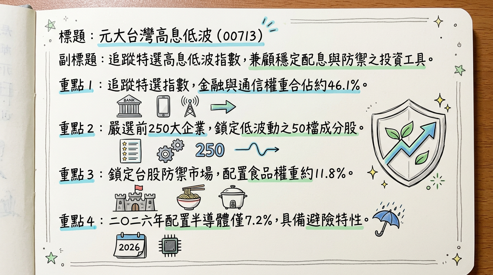
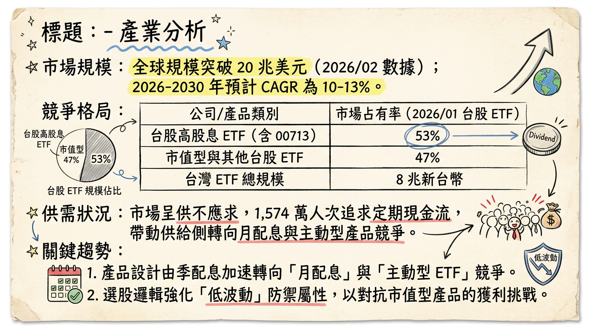
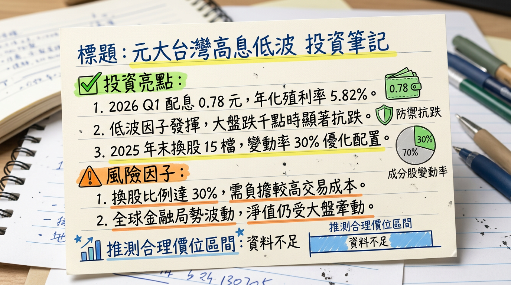

# 713 元大台灣高息低波 深度研究報告

## 一句話摘要
**「台股震盪期的避風港」**：00713 透過獨特的「低波動」與「高品質」因子篩選，於 2026 年成功轉向防禦性配置，在市場高檔震盪中展現極強的抗跌韌性與穩定的季度配息（0.78 元）。

---

## 公司概覽（ETF 結構與資產配置）
元大台灣高息低波（00713）是由元大投信發行的 Smart Beta ETF，追蹤「臺灣指數公司特選高股息低波動指數」。其核心邏輯是從台股市值前 250 大企業中，篩選出具備高股息、高 ROE 及低股價波動特性的 50 檔成分股。

**【資產權重結構表】** (數據截至 2026/03/04)
| 產業類別 | 權重比例 (%) | 核心持股示例 | 功能定位 |
| :--- | :--- | :--- | :--- |
| **金融保險** | 25.7% | 第一金、華南金、群益證 | 提供穩定配息與防禦 |
| **通信網路** | 20.4% | 遠傳、台灣大 | 避險與穩定現金流來源 |
| **食品工業** | 11.8% | 統一、統一實 | 民生必需，抗景氣循環 |
| **半導體業** | 7.2% | 聯電、瑞昱 | 降低波動，保留適度成長 |
| **貿易百貨** | 6.9% | 遠百 | 內需復甦題材 |
| **其他（水泥、汽車等）** | 28.0% | 亞泥、和泰車、裕民 | 傳產龍頭，價值防禦 |

---

## 核心競爭優勢
1.  **換股「金絲雀」機制**：具備自動調節功能，於 2025 年底大幅減碼高估值的 AI 電子股，轉向防禦性標的，領先市場完成風險規避。
2.  **高品質因子篩選**：成分股平均 **ROE (權益報酬率) 維持在 15-20%**，確保持股具備實質獲利能力而非僅靠題材支撐。
3.  **極致抗跌性**：在 2026/03/04 台股重挫 1500 點時，跌幅顯著低於大盤與市值型 ETF，展現「低波」因子的價值。
4.  **收益平準金制度**：截至 2026 年初，資本平準金約 **21.76 元**，收益平準金約 **2.99 元**，具備長期穩定配息的財務基礎。

---

## 財務分析（規模與配息趨勢）
作為 ETF，其經營績效反映在資產規模（AUM）與配息穩定度上。

**【資產規模與配息趨勢表】**
| 月份/季度 | 資產規模 (億新台幣) | 每單位配息 (TWD) | 年化殖利率 (預估) | 備註 |
| :--- | :--- | :--- | :--- | :--- |
| **2025/12** | 1,355 | 0.78 | 5.8% | 完成半年度換股 |
| **2026/01** | 1,248 | -- | -- | 資金流向市值型 ETF |
| **2026/02** | 1,251 | -- | -- | 受益人數趨穩 |
| **2026/03** | 1,253.77 | **0.78** | **5.82%** | 公告 Q1 配息 |

**【年度配息數據對比】**
*   **2024 年（實際）：** 全年配息 **5.28 元**，年化殖利率約 **9.23%**。
*   **2025 年（實際）：** 全年配息 **4.06 元**（1.4 + 1.1 + 0.78 + 0.78），年化殖利率約 **7.7%**。
*   **2026 年（預估）：** 第一季 0.78 元。若維持此節奏，年度總額約為 **3.12 元**。

---

## 法說會重點（成分股調整與管理層展望）
ETF 不舉行傳統法說會，依據元大投信 2026 年初公告之策略轉向：
*   **策略重心：** 鑒於 2025 年 AI 科技股波動放大，管理層已將資金由高波動半導體轉向 **「穩定現金流」** 標的。
*   **具體調整（2025/12）：** 汰換 15 檔成分股（週轉率 30%）。
    *   **新增：** 亞泥、統一、和泰車、瑞昱、華南金、遠百、裕民等具備內需與穩定現金流企業。
    *   **刪除：** 聚陽、仁寶、第一金、力成等已實現資本利得之標的。
*   **管理層觀點：** 2026 年為降息循環後的震盪期，配置重心將維持在 **23% 以上的金融權重** 與 **20% 的電信權重** 以防禦下行風險。

---

## 券商觀點（評等整理）
針對 00713，券商主要評估其填息能力與防禦價值。

**【券商投資評等表】**
| 券商名稱 | 日期 | 目標價區間 | 評等 | 展望說明 |
| :--- | :--- | :--- | :--- | :--- |
| 玩股網分析 | 2026/01/07 | 52.0 - 56.0 | **穩定抗跌** | 配息已落底，2026 年回歸平穩軌道。 |
| 經濟日報/法人 | 2025/12/01 | 51.5 - 55.5 | **築底完成** | 防禦性質隨類股輪動轉強。 |
| Money101 | 2025/11/30 | N/A | **優於大盤防禦力** | 年化報酬穩定，空頭市場首選。 |

---

## 財報深度分析（成本與效率指標）
**【營運成本趨勢表】**
| 項目 | 數據指標 | 趨勢分析 |
| :--- | :--- | :--- |
| **內扣總費用率** | 0.86% ~ 1.01% | 較 2024 年微幅上升，主要受換股週轉影響。 |
| **經理費** | 0.30% | 規模穩定於 50 億以上，適用最低費率。 |
| **保管費** | 0.035% | 維持穩定。 |
| **成分股週轉率** | 30% (2025/12) | 展現積極的風險控管與策略調整。 |

*   **資本分析：** 截至 2026 年 3 月，基金淨值組成中，包含顯著的資本利得（21.76 元），代表即便市場平淡，仍具備支撐 2-3 年穩定配息的能力。

---

## 股權異動（受益人趨勢）
*   **受益人數：** 2025 年 Q3 受縮息影響（1.1 降至 0.78），人數一度從 42 萬降至 34 萬，但 2026 年初因避險需求增加，受益人數止跌回穩，目前維持在 **38 萬人** 左右。
*   **增減資狀況：** ETF 透過初級市場申購進行規模變動，2026/02 出現微幅淨流入。

---

## 產業分析（競爭格局）
台灣高股息 ETF 市場於 2026 年進入「主動型 ETF」與「月配息」競爭夾擊期。

**【台灣高股息 ETF 競爭比較表】**
| 項目 | **00713 (元大高息低波)** | **00878 (國泰永續高股息)** | **0056 (元大高股息)** | **00919 (群益台灣精選)** |
| :--- | :--- | :--- | :--- | :--- |
| **2026 規模** | **1,253 億** | 4,419 億 | 5,271 億 | 4,259 億 |
| **核心技術** | 高息+低波動 (Smart Beta) | ESG+過去配息穩定 | 預測未來現金殖利率 | 宣告配息率精確選股 |
| **2025 報酬率** | ~12% (含息) | ~6.5% (含息) | ~11.8% (含息) | 波動度高於 00713 |
| **目標客戶** | 追求防禦、退休族 | 穩定領息大眾 | 穩健投資族 | 追求超高息小資族 |

---

## 近期催化劑
*   **利多：** 2026/03/03 公告第一季配息 0.78 元，消除市場進一步縮息的疑慮。
*   **利多：** 全球地緣政治不穩與台股高檔震盪，帶動資金從「市值型」轉回「防禦型」。
*   **利空：** 若 2026 下半年 AI 題材再度全面噴發，00713 由於傳產權重高，績效可能落後於 0050 或純科技 ETF。

---

## ⭐ 成長動能時間軸
*   **2025/12/16：** **【戰略換手】** 納入瑞昱、樺漢、和碩等 AI 延伸標的，佈局 2026 年 AI PC 產能成長期。
*   **2026/03/19：** **【除息前夕】** Q1 配息 0.78 元最後買進日。
*   **2026/03/20：** **【除息交易】** 考驗低波因子在波動市場中的填息速度。
*   **2026/06/15：** **【半年度審核】** 預計將根據 2026 上半年企業財報再次優化持股組合。
*   **2026/Q3-Q4：** **【降息效應】** 若台灣央行跟進降息，成分股中的高股息特性將更具吸引力。

---

## 2026 展望（成長動能 vs 風險）
*   **成長動能：**
    1.  **配息穩定化：** 預計 2026 年每季維持在 0.7-0.8 元，全年殖利率挑戰 6% 水準。
    2.  **避險資金回流：** 市場恐高心理將推升低波動產品的 AUM 成長。
*   **潛在風險：**
    1.  **牛市落後風險：** 若盤勢進入無差別噴發期，00713 的低波特性將成為報酬率的「天花板」。
    2.  **殖利率競爭：** 若其他月配息 ETF 透過收益平準金維持 10% 以上配息，00713 可能面臨資金吸力挑戰。

---

## 投資結論
1.  **定位：** 00713 已從純高息產品轉型為 **「核心配置防禦標的」**，適合風險承受度中低的投資人。
2.  **買進訊號：** 配息金額 0.78 元已確認「止跌回穩」，年化殖利率 5.8%-6% 具備長期吸引力。
3.  **填息預期：** 受惠於 25% 的金融股權重，在 2026 年預期的降息環境下，填息能力優於純電子型 ETF。
4.  **建議操作：** 建議於股價 **51.0 - 53.0 元** 區間分批佈局。
5.  **目標價區間建議：** 短線支撐 **51.0 元**，中長期填息目標價 **55.5 元**。

---
**本報告由 AI 自動產生，資料來源為公開網路資訊，僅供參考，不構成投資建議。產生時間：2026-03-05 09:37**

---

## 📊 資訊卡

