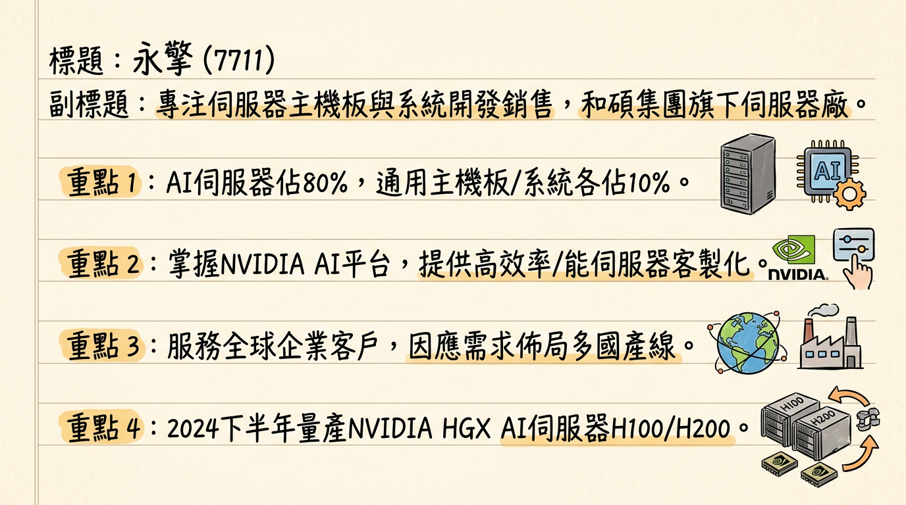
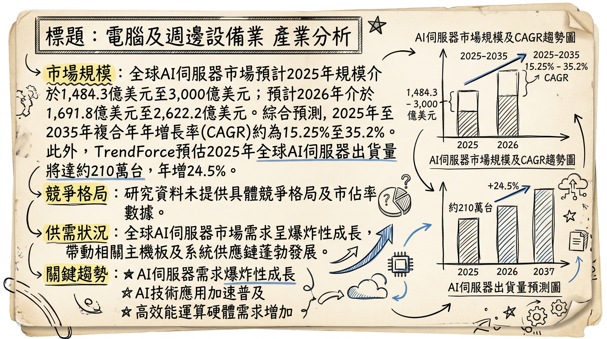
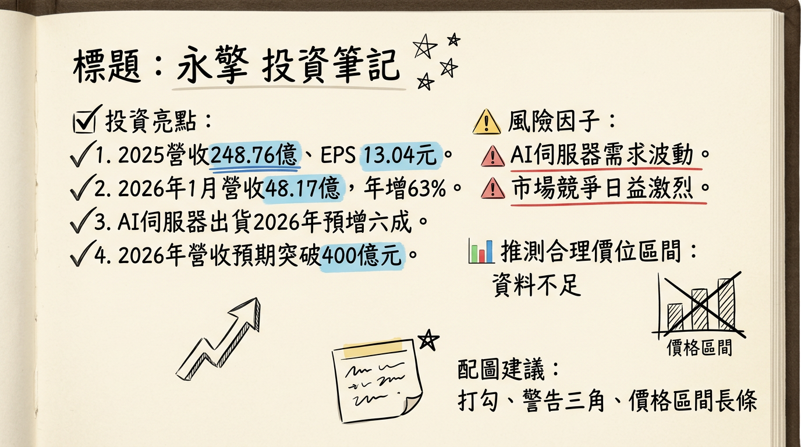

# 7711 永擎 深度研究報告

## 一句話摘要
永擎 (7711) 為和碩集團旗下純度極高的 AI 伺服器整合供應商，受惠於 NVIDIA HGX 平台出貨大增，產品線涵蓋 H100、H200、B200、B300、GB300 等，2025 年 AI 相關營收佔比高達 80%，在 B300 伺服器於 2026 年第一季放量及 RTX Pro 6000 推論型伺服器於 2026 年第二季開始貢獻下，預計 2026 年營收將突破新台幣 400 億元，獲利有望再創新高。

## 公司概覽
永擎電子 (7711) 成立於 2007 年，為和碩集團旗下伺服器廠，專注於伺服器主機板及系統的研發、生產與銷售。公司主打高效率、高性能的伺服器主機板及整機系統，並提供客製化服務，其產品應用廣泛，包括人工智慧 (AI)、高效能運算 (HPC)、雲端運算 (Cloud Computing)、大數據 (Big Data)、視覺運算 (Visual Computing)、邊緣運算 (Edge Computing) 及 5G 基礎架構等。

### 業務與產品線
永擎的核心產品線涵蓋通用伺服器、儲存伺服器、邊緣伺服器及 AI/HPC 伺服器。自 2024 年下半年起，公司開始量產並出貨以 NVIDIA HGX 平台為核心的 AI 伺服器，涵蓋 H100、H200，以及後續的 B200、B300、GB300 等系列產品。此外，永擎正積極導入 NVIDIA RTX Pro 6000 核心的推論型伺服器。

### 營收結構
根據 2025 年上半年的產品組合，AI 相關產品（AI 伺服器）佔營收的約 **80%**，而通用型主機板與通用型伺服器系統則各約佔 **10%**。

### 製造基地
永擎採取輕資產路線，不設置自有工廠，全面透過合作代工廠進行伺服器主機板及整機組裝的生產。主要的組裝與出貨地為台灣，並布局中國與越南產線。為因應關稅與在地化需求，永擎已預先完成美國組裝備案，並在美國建置大型倉儲。

## 核心競爭優勢
1.  **AI 伺服器純度高與技術領先：** 永擎在 2025 年上半年 AI 相關產品營收佔比達 80%，顯示其在 AI 伺服器領域的專注與領先。公司能迅速導入 NVIDIA HGX 平台（H100, H200, B200, B300, GB300）及 RTX Pro 6000 推論型伺服器，展現其卓越的研發整合能力。
2.  **輕資產營運模式：** 透過委外生產，永擎具備高度彈性，能快速調整產能以應對市場需求變化，並降低固定資產投資的風險。
3.  **和碩集團資源挹注：** 作為和碩集團旗下公司，可望共享集團資源，提升在客戶談判、供應鏈管理及新市場開拓上的競爭力。
4.  **全球化佈局與客戶基礎：** 客戶涵蓋全球 AI 新創、Tier-2/Tier-3 雲端業者、美系 OEM，並積極拓展中東等新興市場，分散風險並拓展成長空間。
5.  **專注高功耗散熱解決方案：** 針對 AI 伺服器的高功耗特性，公司由氣冷逐步過渡至液冷與浸沒式散熱，提升產品技術含量與市場競爭力。

## 財務分析

### 月營收趨勢
| 月份   | 金額 (億元) | 月增率 (MoM) | 年增率 (YoY) |
| :----- | :---------- | :----------- | :----------- |
| 2026年01月 | 48.17       | 144.8%       | 63.45%       |
| 2025年12月 | 19.68       | -43.9%       | 82.2%        |
| 2025年11月 | 35.09       | 85.8%        | 136.3%       |
| 2025年10月 | 18.88       | -40.7%       | 29.7%        |
| 2025年09月 | 31.84       | 50.2%        | 406.9%       |
| 2025年08月 | 21.19       | 59.1%        | 136.7%       |
*2026年1月營收創歷史新高，展現強勁成長動能。*

### 季度數據
| 季度   | 季營收 (億元) | 毛利率     | 營業利益 (億元) | EPS (元) |
| :----- | :------------ | :--------- | :-------------- | :------- |
| 2025年第四季 | 73.65         | 10.07%     | 3.70            | 3.92 (註1) |
| 2025年第三季 | 66.35         | 7.43%      | 不適用          | 2.67     |
*註1：2025年第四季 EPS 參考財訊快報數據，CMoney 為 3.74 元，財報狗為 3.37 元。*

### 年度趨勢
| 年度   | 營收 (億元) | 年增率     | EPS (元)   | 年增率     |
| :----- | :---------- | :--------- | :--------- | :--------- |
| 2024年 | 88.00       | -          | 8.36       | -          |
| 2025年 | 248.76      | 182.58%    | 13.04 (註2) | 55.98%     |
| 2026年 | 402.00 (預估) | 61.53%     | 22.21 (預估) | 70.32%     |
*註2：2025年實際 EPS 參考 CMoney, 財訊快報數據，群益投顧為 12.61 元。2026年預估數據來自元大證券 2025年12月8日報告。*
永擎 2025 年營收與 EPS 均創歷史新高，顯示 AI 伺服器業務爆發性成長。

## 法說會重點
**日期：2025年10月20日 (業績發表會) & 2025年9月30日 (元大證券法說會)**

### 管理層對各產品線具體說明
*   **AI 伺服器：**
    *   已成為公司主要成長引擎，產品線從主機板擴大到整機系統及機櫃式解決方案。
    *   B200 伺服器下半年進入量產，B300 伺服器預計在 **2026 年第一季量產**，並將取代 B200 成為主要成長來源。
    *   RTX Pro 6000 推論型伺服器已接獲小量訂單與概念驗證專案，預期最快在 **2026 年第二季開始貢獻營收**。
    *   AI 伺服器能見度約 **3 個月**。客戶結構以全球 AI 新創為主，約佔整體 **80%**。
    *   供應端仍以 GPU 料況最為關鍵，B200 與 B300 交期較原先預期延後約 **2 至 4 週**，部分高速網路卡亦偏緊，管理階層預期第四季能逐步改善。
*   **通用型伺服器：**
    *   需求已在 2025 年第三季開始回溫，動能可望延續至第四季與 **2026 年第一季**。
    *   主機板與通用伺服器的能見度約 **6 個月**。
    *   通用型伺服器營收規模相對較小，但毛利率較高，可提供穩定挹注。

### 產能利用率與資本支出
*   **產能利用率：** 公司不設置自有工廠，全面採取委外生產。台灣為主要組裝與出貨地，另布局中國與越南產線，並預先完成美國組裝備案。先前整機組裝一度吃緊，已透過補充人力改善。
*   **資本支出金額：2025 年與 2026 年資本支出合計約 1 至 2 億元**，經費集中於研發與測試設備、量測能力與水冷實驗室。

### 下季/下半年 guidance
*   管理層正向看待 **2025 年第四季至 2026 年 AI 伺服器營收成長性**。
*   積極拓展 AI 客戶，預期 RTX Pro 6000 伺服器可滿足大幅上升的推論需求。
*   管理層正向看待 **2026 年通用伺服器需求**。
*   對於 **2026 年業務發展，管理層看好「中性偏上」**。

## 券商觀點
### 目標價與評等
| 券商名   | 報告日期   | 目標價 (元) | 評等 |
| :------- | :--------- | :---------- | :--- |
| 元大證券 | 2025年12月8日 | 355.0       | 買進 |

### 2025-2026 年 EPS 預估
| 券商名             | 報告日期   | 2025年 EPS 預估 (元) | 2026年 EPS 預估 (元) |
| :----------------- | :--------- | :------------------- | :------------------- |
| 元大證券           | 2025年12月8日 | 12.60                | 22.21                |
| 國內法人綜合報告 (註) | 2025年10月21日 | 34-35 倍本益比區間     | 20-21 倍本益比區間     |
*註：國內法人綜合報告提供本益比區間而非具體 EPS 數字。*

## 財報深度分析

### 利潤率趨勢
| 季度       | 毛利率   | 營業利益率 | 稅後淨利率 | 備註                                   |
| :--------- | :------- | :--------- | :--------- | :------------------------------------- |
| 2025年第四季 | 10.07%   | 5.03%      | 3.28%      | 獲利谷底回升                               |
| 2025年第三季 | 7.43%    | 3.66%      | 2.43%      | AI 伺服器比重提升及定價策略導致毛利率收斂 |
| 2025年上半年 | 約 8.2%  | 不適用     | 不適用     |                                        |
| 2024年全年   | 8.54%    | 不適用     | 不適用     | 較 2023 年 17.09% 大幅下滑             |
利潤率變化主要原因為產品組合轉變，AI 伺服器佔比大幅提升對毛利率產生稀釋效果。為鞏固市佔率採取的定價策略亦有影響。管理層預期隨著產品組合優化和規模經濟效應，毛利率有望回升。

### 存貨與營運
*   **存貨週轉天數：** 2025年第三季為 **49.35 天**；2025年第四季平均售貨日數為 **66.91 天**，較 2024年第四季的 54.04 天略有增加。存貨金額上升與 AI 伺服器銷售暢旺及晶片單價高有關，顯示為備料而非異常堆積。
*   **應收帳款週轉天數：** 2025年第三季為 **17.65 天**；2025年第四季應收款項收現日數為 **13.28 天**，與 2024年第四季的 13.24 天持平。應收帳款週轉效率良好，顯示公司收款能力穩定。

### 資本支出
*   永擎 2025 年與 2026 年資本支出合計約 **1 至 2 億元**，主要用於研發與測試設備、量測能力與水冷實驗室。公司採輕資產模式，本身不設置工廠，因此資本支出相對較低。

## 股權異動

### 董監事/大股東申報轉讓
*   **2024年12月：** 多位經理人及董事申報轉讓，總計轉讓 **188 張**，轉讓方式為信託。
    *   經理人 洪培雅 申報轉讓 **20 張**。
    *   經理人 林盈潔 申報轉讓 **48 張**。
    *   董事 陳式仁 申報轉讓 **40 張**。
    *   經理人 陳松儉 申報轉讓 **40 張**。
    *   董事 沙韋旭 申報轉讓 **40 張**。
*   **2024年8月：** 經理人許隆倫曾申報洽特定人轉讓。

### 庫藏股、可轉債、增減資
*   **庫藏股：** 未發現 2024-2026 年最新庫藏股買回紀錄。
*   **可轉債：** 未發現 2024-2026 年最新可轉換公司債發行資訊。
*   **增減資：** 永擎於 2025年11月19日上市買賣，公開發行普通股股票，並有現金增資股款繳納憑證 **9,360,000 股**。

### 股利政策
*   **2025 年度 (預計 2026 年發放)：** 董事會通過擬配發每股現金股利 **9 元**，配息率達 **69%**。
*   **2024 年度 (2025 年發放)：** 配發每股現金股利 **4.001 元**。

## 產業分析

### 市場規模與 CAGR
*   **全球 AI 伺服器市場：**
    *   2025 年預計將達到 **3,000 億美元**，年增 **46.1%** (其他報告預估 1,484.3 億美元至 1,946.2 億美元)。
    *   2026 年預計成長至 **2,236.1 億美元** (Research Nester)，預計 2026 年至 2035 年 CAGR 約為 **35.2%**。
    *   TrendForce 預估 2025 年全球 AI 伺服器出貨量將達到約 **210 萬台**，年增約 **24.5%**；2026 年年增逾 **28%**。
*   **整體伺服器市場：**
    *   DIGITIMES 預估 2025 年全球伺服器出貨總量將年增 **5%**，達到 **1,563.6 萬台**，2025 年至 2030 年間的 CAGR 將達 **5.1%**。
    *   Research Nester 報告預計 2026 年將達到 **1,178.7 億美元**，2026 年至 2035 年 CAGR 超過 **8.7%**。

### 供需狀況
*   **AI 伺服器市場目前呈現供不應求。** 關鍵零組件方面：
    *   **GPU 和 HBM：** 需求極高，NVIDIA 在基於 GPU 的 AI 伺服器領域預計 2025 年市佔率將超過 **90%**。NVIDIA GB200/GB300 等超級晶片預計在 2025 年第二季後放量出貨。
    *   **NAND Flash：** AI 伺服器需求帶動企業級 SSD 爆發，供需嚴重失衡。TrendForce 預估 2026 年第一季 NAND Flash 價格季增 **85% 至 90%**。

### 產業平均毛利率水準
*   **AI 伺服器相關產品：** 由於高技術門檻，毛利率遠高於傳統伺服器。例如，伺服器導軌製造商川湖 2025 年毛利率已突破 **76.05%**。
*   **ODM/傳統伺服器：** 傳統伺服器毛利率相對較低 (有「毛三到四」之稱)。

### 競爭格局

#### 全球 AI 伺服器主要玩家
AI 伺服器市場主要由大型 ODM 廠和品牌廠主導，並受雲端服務供應商 (CSP) 自研 ASIC 趨勢影響。主要玩家包括：
*   **ODM 廠：** 廣達 (Quanta)、緯創 (Wistron)、英業達 (Inventec)、鴻海 (Foxconn) 等台灣代工廠。
*   **品牌廠：** Dell、HPE、Lenovo 等。
*   **AI 晶片供應商：** NVIDIA (預計 2025 年市佔率超過 90%)、AMD (預計佔 7%～8%)。
*   **CSP 自研 ASIC：** Google (TPU)、Meta 等，預計 2026 年 ASIC AI 伺服器出貨佔比將提升至 **27.8%**。

#### 永擎 vs 台灣主要競爭對手比較 (2025-2026 年資料)
| 公司   | 股票代號 | 主要業務               | 2025 年營收 (億元) | 2025 年毛利率 | 2025 年 EPS (元) | 備註                                                       |
| :----- | :------- | :--------------------- | :----------------- | :------------ | :--------------- | :--------------------------------------------------------- |
| **永擎** | **7711** | 伺服器主機板及系統     | **248.76**         | **8.54%**     | **13.04**        | AI 伺服器佔營收約 80% (2025 H1)                      |
| 川湖   | 2059     | 伺服器導軌             | -                  | 76.05%        | 103.23           | 輝達 GB 系列、GB300、ASIC 等均為主流客戶               |
| 勤誠   | 8210     | 伺服器機殼及機櫃       | -                  | 29.6% (2026 Q1 估) | -                | 2025 年 AI 營收佔比逾一半，2026 年估達 60-70% |
| 順達   | 3211     | BBU 電池備援電力模組   | 162 (2026 估)      | 20.14% (2025 Q4) | 13 (2026 估)     | AI 伺服器 BBU 營收佔比 2026 年估衝破 50%     |
| 建準   | 2421     | 伺服器散熱風扇         | 186.78             | 31.06%        | 7.94             | AI 伺服器相關營收逾兩成                                  |
| 穩得   | 6761     | 測試檢測服務、自有元件 | 19.74              | 36.44%        | 7.34             | 2026 年實驗室營收估倍增，毛利率有望逼近 40% |
| 台達電 | 2308     | 電源、散熱、基礎設施   | 5,548.85           | 34.3%         | 23.14            | AI 相關營收佔比 2025 年已達 20% 以上          |

*永擎在營收規模上與大型 ODM 廠有差距，但其 AI 營收比重極高，且在 AI 伺服器系統整合能力上具備優勢。相較於其他零組件供應商，永擎直接提供高整合度系統，受惠於 AI 伺服器整體價值鏈的提升。*

### 產業趨勢
1.  **AI 算力需求激增與異質整合：** 生成式 AI 普及推動對 GPU、ASIC 等加速器與 CPU 異質整合架構的需求。CSP 積極自研 ASIC，預計 2026 年 ASIC AI 伺服器出貨佔比提升至 **27.8%**。
2.  **散熱技術升級 (液冷散熱) 與高壓直流電 (HVDC)：** AI 伺服器高功耗驅動液冷散熱成為主流，HVDC 也將提高供電效率。液冷技術如水冷板、CDU 等需求顯著。
3.  **邊緣 AI (Edge AI) 的發展：** 邊緣 AI 晶片效能突破與中小型 AI 模型成熟，部分 AI 推論任務轉向邊緣端執行。預估 2026 年邊緣 AI 硬體滲透率將接近 **兩成**。

### 對永擎的具體機會與威脅
*   **機會：**
    *   直接受惠於 AI 伺服器市場高速成長，NVIDIA GB200/GB300 等新平台將帶來新的成長動能。
    *   積極佈局 RTX Pro 6000 推論型伺服器，搶佔 AI 推論應用市場先機。
    *   輕資產策略具彈性，可快速響應市場需求。
*   **威脅：**
    *   上游 GPU、HBM 等關鍵零組件供應不確定性，影響出貨能力和成本。
    *   大型 CSP 自研 ASIC 趨勢可能壓縮 ODM/OAM 廠商的市佔率和獲利空間。
    *   市場競爭加劇，可能對市場份額和利潤造成壓力。

### 相關投資題材
永擎是純度極高的「AI 伺服器概念股」，深度參與 AI 運算基礎設施建構。其產品線支援 HBM、液冷散熱、高壓直流電等先進技術，並積極切入邊緣 AI 應用市場，完整連結當前最熱門的 AI 相關投資題材。

## 近期催化劑

### 利多事件清單
*   **2026年02月26日：** 公布 2025 年全年營收 **248.76 億元** (年增 **182.58%**)，稅後純益 **8.03 億元** (年增 **59%**)，EPS **13.04 元**，營收與獲利均創歷史新高。擬配發 **9 元** 現金股利，配息率達 **69%**。2025年第四季毛利率回升至 **10%以上**，EPS **3.92 元**，創歷史新高。
*   **2026年02月10日：** 公告 2026 年 1 月合併營收 **48.17 億元**，月增 **144.8%**、年增 **63.45%**，創單月歷史新高。
*   **2025年12月13日：** 法人預計 2026 年 AI 伺服器出貨量將成長 **六成**，全年營收有望突破 **400 億元** 大關。B300 伺服器預計 2026 年第一季放量，RTX Pro 6000 伺服器將於 2026 年第二季開始貢獻營收。
*   **2025年12月09日：** 受惠 NVIDIA HGX 伺服器出貨大增，2025 年前 10 月累計營收年增達 **211%**。NVIDIA 長尾需求有利於公司長期發展。
*   **2025年11月19日：** 永擎上市掛牌，公司預期 2025 年通用型伺服器需求回升、AI 伺服器需求持穩下，可望推升全年營收雙位數成長。
*   **2025年10月21日：** 法說會管理層對營運展望正向，受惠 AI 訓練與推論需求激增，通用伺服器展望樂觀，後市正向，2026 年獲利成長可期。
*   **2025年09月30日：** 管理層看好 2026 年業務發展「中性偏上」。

### 利空事件清單
*   **毛利率收斂：** 由於 AI 伺服器業務比重顯著拉升且為鞏固市占，毛利率從 2024 年的 **17.1%** 下降至 2025 年上半年的約 **8.2%**，2025 年全年為 **8.54%**。
*   **上游供應鏈瓶頸：** GPU 料況仍為最關鍵因素，B200 與 B300 交期較原先預期延後約 **2 至 4 週**，部分高速網路卡亦偏緊。
*   **客戶集中度：** 客戶結構以全球 AI 新創為主，約佔整體 **80%**，若客戶拉貨不如預期或轉單，可能影響營收。
*   **地緣政治與關稅：** 雖然已完成美國組裝備案，但地緣政治風險仍可能帶來不確定性。
*   **電力供應瓶頸：** 管理層指出，除 AI 晶片供應吃緊，電力供應可能是未來整體算力發展的一大瓶頸。

### 近期外資/投信買賣超張數 (截至 2026/03/05)
*   **2026年03月05日：** 外資買超 **13 張**，投信、自營商買賣超均為 **0 張**。
*   **2026年03月04日：** 外資賣超 **34 張**，自營商賣超 **2 張**，投信買賣超均為 **0 張**。
*   **2026年03月03日：** 外資賣超 **22 張**，自營商買超 **1 張**，投信買賣超均為 **0 張**。
*   近一個月外資呈現小幅賣超，投信和自營商買賣超張數不大。

## ⭐ 成長動能時間軸

| 時間        | 成長動能         | 詳細描述                                                                                                                                                                                                                                                                                                                                                                                                                                                             |
| :---------- | :--------------- | :------------------------------------------------------------------------------------------------------------------------------------------------------------------------------------------------------------------------------------------------------------------------------------------------------------------------------------------------------------------------------------------------------------------------------------------------------------------- |
| **2024年下半年** | 新產品出貨       | 開始量產並出貨以 NVIDIA HGX 平台為核心的 AI 伺服器，涵蓋 H100、H200，成為 2024 至 2025 年營收快速成長的主要動能。                                                                                                                                                                                                                                                                                                                                                      |
| **2025年第四季** | 新產品量產       | B300 伺服器開始小量生產與出貨。通用型伺服器需求回溫動能良好。                                                                                                                                                                                                                                                                                                                                                                                                           |
| **2025年10月** | 產能與倉儲擴充   | 在美國建置大型倉儲，面積較原先擴增近 **4 倍**，以完全滿足客戶需求。舊廠作為備用，若有美國當地組裝需求可迅速上線。                                                                                                                                                                                                                                                                                                                                                        |
| **2026年第一季** | 新產品放量       | B300 伺服器將放量出貨，並有望取代 B200 伺服器成為主要的營運增長動能。通用伺服器需求動能延續。                                                                                                                                                                                                                                                                                                                                                                       |
| **2026年第二季** | 新產品貢獻營收   | NVIDIA RTX Pro 6000 核心的推論型伺服器預計開始貢獻營收。                                                                                                                                                                                                                                                                                                                                                                                                               |
| **2026年下半年** | 新晶片平台與專案 | 預期 NVIDIA 的 Rubin、AMD 的 MI400 以及各家 CSP 的 ASIC 專案將陸續推出，為永擎 2026 年營運帶來潛在商機。NVIDIA 下一代 Vera Rubin 平台最快預計自 2026 年第三季後、V200 系列就將逐步量產。                                                                                                                                                                                                                                                                                   |
| **2025-2026年** | 資本支出強化研發 | 資本支出合計約 **1 至 2 億元**，經費集中於研發與測試設備、量測能力與水冷實驗室。此次上市增資募集 **8,000 萬～1 億美元** 現金，可作為未來營運周轉需求。                                                                                                                                                                                                                                                                                                                      |
| **長期成長**     | 新客戶/新市場    | 積極拓展全球 AI 新創、Tier-2/Tier-3 雲端業者與部分美系 OEM。與和碩合作搶攻中東主權 AI 算力市場。東擎科技 (華擎子公司) 2026 年在石化能源行業可望接獲系統大單，營收有倍增空間，推算將突破 **30 億元** (顯示集團在工業應用領域的拓展)。                                                                                                                                                                                                                                   |
| **長期趨勢**     | 散熱技術升級     | 營運團隊專注於高功耗散熱解決方案，由氣冷逐步過渡至液冷與浸沒式，以因應 AI 伺服器日益增長的散熱需求。                                                                                                                                                                                                                                                                                                                                                                       |
| **長期需求**     | AI 推論需求爆發  | 隨著大型語言模型 (LLM)、生成式 AI 與多模態應用的快速崛起，雲端業者的發展重心將逐步由訓練轉向推論，AI 推論應用將自 2026 年開始顯著成長，為永擎 RTX Pro 6000 伺服器提供廣闊市場。邊緣 AI 硬體滲透率預計 2026 年接近兩成，也將是長期增長機會。 |

## 2026 展望

### 成長動能
*   **AI 伺服器持續強勁：** B300 伺服器預計 2026 年第一季放量出貨，新品單價提升，將成為主要營收增長動能。NVIDIA Rubin、AMD MI400 及 CSP ASIC 專案將於 2026 年下半年陸續推出，預期將帶來更多商機。
*   **推論應用市場爆發：** RTX Pro 6000 核心推論型伺服器預計 2026 年第二季開始貢獻營收，搶佔快速成長的 AI 推論應用市場。
*   **通用型伺服器回溫：** 2026 年通用伺服器需求預期有兩位數成長，為營收提供穩定挹注。
*   **市場擴張：** 積極佈局中東等新市場，並深化與全球 AI 新創及 Tier-2/Tier-3 雲端客戶的合作。

### 風險
*   **上游關鍵零組件供應瓶頸：** GPU、HBM 等高階晶片仍可能因供應短缺影響出貨時程和量能。
*   **毛利率波動：** 雖然 AI 伺服器營收佔比高，但初期為搶佔市佔率可能導致毛利率承壓，需待產品組合優化和規模效益顯現。
*   **客戶集中度風險：** 營收高度集中於 AI 新創客戶，若其需求或策略轉變，可能對永擎營運產生較大影響。
*   **電力供應限制：** AI 算力需求激增可能使全球電力供應成為未來發展的重要瓶頸。

綜合來看，永擎 2026 年營收有望突破 **400 億元** 大關，年增率達 **61.53%**，EPS 有望達到 **22.21 元**，年增 **70.32%**，成長動能強勁。

## 投資結論
永擎 (7711) 作為純 AI 伺服器解決方案提供者，在 AI 浪潮中具備顯著的成長潛力。
1.  **AI 伺服器領導地位：** 公司 AI 相關營收佔比高達 **80%** (2025 H1)，且能快速導入 NVIDIA 最新的 HGX 平台，確保在 AI 伺服器市場的領先地位。
2.  **多重成長引擎：** 除了訓練型 AI 伺服器持續放量 (B300 於 2026 Q1)，公司更積極切入推論型 AI 伺服器 (RTX Pro 6000 於 2026 Q2 貢獻)，並佈局 NVIDIA Rubin、AMD MI400 等新一代平台，形成多元成長動能。
3.  **財務表現亮眼：** 2025 年營收 **248.76 億元** (年增 **182.58%**)，EPS **13.04 元**，均創歷史新高。2026 年預估營收突破 **400 億元**，EPS 達 **22.21 元**，成長前景明確。
4.  **輕資產高彈性：** 委外生產模式使其能快速調整產能，降低資本支出壓力，將資源集中於核心研發與客戶服務。
5.  **估值提升空間：** 儘管毛利率受產品組合影響而有波動，但隨著 AI 伺服器技術門檻與整合能力提升，公司有望逐步優化產品組合並提升獲利能力。

基於永擎在 AI 伺服器市場的強勁成長動能、產品線擴張以及法人對 2026 年獲利預期，參考元大證券目標價及市場共識本益比區間，我們給予永擎未來 12 個月目標價區間建議為 **350 元至 470 元**。

本報告由 AI 自動產生，資料來源為公開網路資訊，僅供參考，不構成投資建議。產生時間：2026-03-06 14:35

---

## 📊 資訊卡

