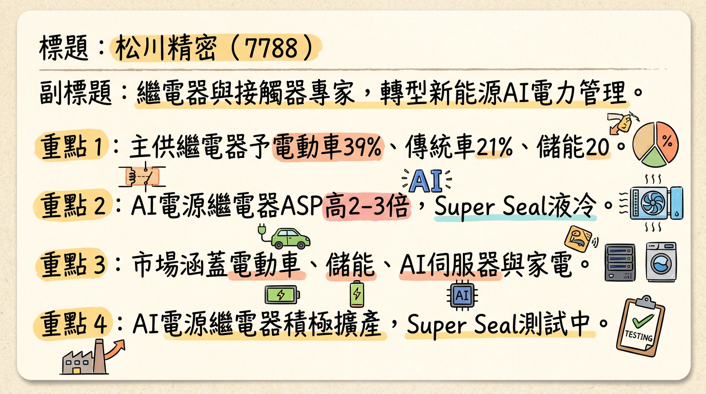
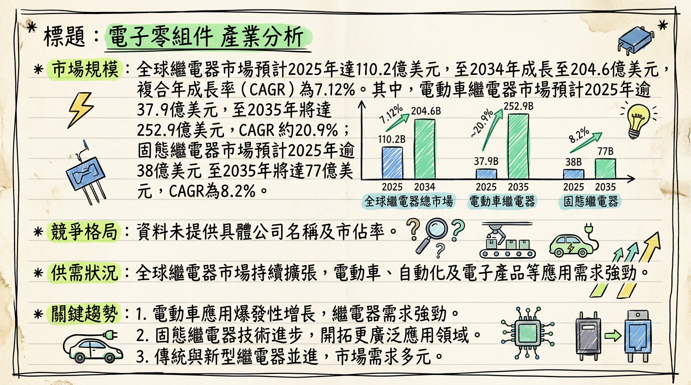
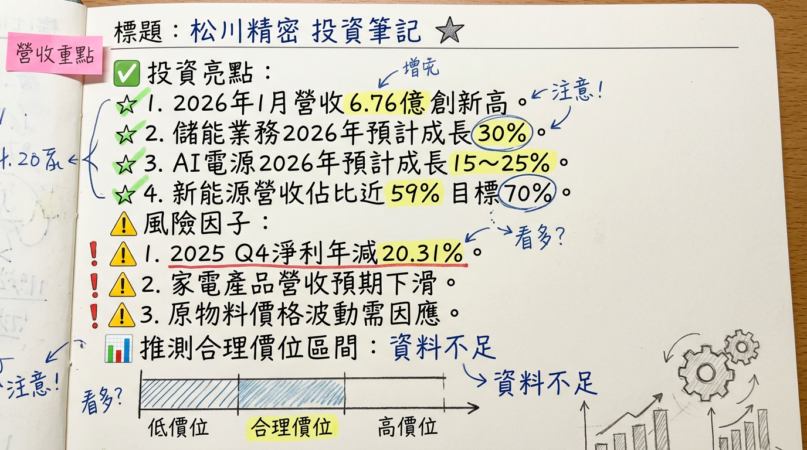

# 7788 松川精密 深度研究報告

## 一句話摘要
松川精密（7788）正成功轉型為高附加價值AI與新能源電力管理解決方案供應商，憑藉其獨特的HVDC及Super Seal技術，切入電動車、儲能及AI伺服器三大高成長應用，預期2026年營收將實現雙位數成長，毛利率顯著回升。

## 公司概覽
松川精密專注於繼電器（Relay）與接觸器（Contactor）的研發、製造與銷售。近年來積極轉型，專注於新能源與AI電力管理解決方案。公司具備高度垂直整合能力，能自主設計製造模具、零件與自動化設備。

**關鍵產品與技術：**
*   **AI電源繼電器：** 因應高功率需求，產品平均銷售價格（ASP）較傳統伺服器產品高2至3倍，產線積極擴充。
*   **Super Seal技術：** 開發超級密閉技術，應用於次世代AI伺服器液冷系統，產品已進入客戶系統性測試，要求在冷卻液中浸沒5-15年仍保持高可靠度。
*   **高壓直流繼電器（HVDC）：** 嘉義廠已建置可測試高達2500V DC的高壓實驗設備，強化自主研發能力，以應對未來電力架構走向HVDC的趨勢。

**營收結構（2025年1月至11月數據）：**

| 產品應用           | 營收佔比 |
| :----------------- | :------- |
| 電動車             | 39%      |
| 傳統汽車           | 21%      |
| 儲能               | 20%      |
| AI電源與伺服器     | 12%      |
| 家電               | 8%       |
| **新能源相關應用** | **59%**  |

公司目標未來將新能源相關應用營收佔比提升至70%以上。

**製造基地：** 台灣（樹林、嘉義）、墨西哥、廈門、印度、越南（透過合作夥伴）。嘉義廠與墨西哥廠同步增產，越南生產基地已在2026年第一季完成擴產。

## 核心競爭優勢
1.  **獨特的技術壁壘：** 掌握Super Seal超級密閉技術，滿足AI伺服器液冷系統在冷卻液中浸沒5-15年的高可靠度要求，具備領先優勢。同時，在高壓直流（HVDC）繼電器領域投入多年，嘉義廠具備2500V DC高壓實驗設備，卡位NVIDIA次世代800V HVDC架構趨勢。
2.  **高度垂直整合能力：** 具備模具、零件與自動化設備自主設計製造能力，能快速反應市場變化，確保產品品質及成本競爭力。
3.  **車規等級品質：** 所有產品均以車規標準生產，深受電動車及儲能系統等關鍵客戶信賴，產品可靠度高。
4.  **全球化產能佈局：** 在台灣、墨西哥、廈門、印度及越南設有生產基地，能有效因應地緣政治風險，提供客戶供應鏈韌性。
5.  **高附加價值產品組合轉型：** 積極將營收重心轉向毛利較高的電動車、儲能系統及AI伺服器應用，逐步淡出競爭激烈的低毛利家電市場。

## 財務分析

### 月營收趨勢
**松川精密（7788）近一年月營收數據**

| 月份   | 金額 (新台幣億元) | 月增率 MoM | 年增率 YoY |
| :----- | :---------------- | :--------- | :--------- |
| 2026/01 | 6.76              | +12.06%    | +16.67%    |
| 2025/12 | 6.03              | +16.06%    | +6.24%     |
| 2025/11 | 5.1973            | -6.0%      | N/A        |
| 2025/10 | 5.5283            | N/A        | +8.34%     |
| 2025/09 | N/A               | N/A        | N/A        |
| 2025/08 | N/A               | N/A        | N/A        |

*註：2025年9月及8月具體月營收數據未提供。*

### 季度數據
**松川精密（7788）近四季營收、獲利概況**

| 季度       | 營收 (新台幣億元) | 季增率 QoQ | 年增率 YoY | 毛利率 (%) | 稅後淨利 (新台幣億元) | EPS (元) |
| :--------- | :---------------- | :--------- | :--------- | :--------- | :-------------------- | :------- |
| 2025年Q4   | 16.6974           | +9.17%     | +6.32%     | 26.04      | 1.1091                | 1.45     |
| 2025年Q3   | 15.30             | N/A        | N/A        | 26.45      | 1.11                  | 1.53     |
| 2025年Q2   | N/A               | N/A        | N/A        | 27.19      | -0.4721 (虧損)        | 0.65 (上半年) |
| 2025年Q1   | N/A               | N/A        | N/A        | 28.48      | N/A                   | 0.65 (上半年) |

*註：部分季度營收與稅後淨利數據為合併上半年/前三季資料，單季數據需進一步細分。2025年Q2的EPS為上半年合計值，因業外匯損導致單季虧損。*

### 年度趨勢
**松川精密（7788）近三年及2026年預估概況**

| 年度       | 營收 (新台幣億元) | 年增率 YoY | 毛利率 (%) | 營業利益率 (%) | 稅後淨利 (新台幣億元) | EPS (元) |
| :--------- | :---------------- | :--------- | :--------- | :------------- | :-------------------- | :------- |
| 2024年實際 | 59.63714          | N/A        | 27.7       | 9.0            | 4.96328               | 6.95     |
| 2025年實際 | 64.328            | +7.87%     | 27.04      | N/A            | 2.64                  | 3.63     |
| 2026年預估 | 雙位數成長        | >10%       | 明顯回升   | N/A            | 爆發性成長            | N/A      |

*註：2026年EPS未找到具體數字，但管理層預期毛利率將顯著回升，法人預期獲利將迎來爆發性成長。*

## 法說會重點
最近一次法說會日期：**2026年01月16日**（由元大證券舉辦），以及**2026年03月05日**的公司法說會更新。

**管理層具體 Guidance：**
*   **2026年營收展望：** 預期重返雙位數成長。
*   **新能源佔比目標：** 2025年1-11月新能源相關應用佔營收59%，目標未來提升至70%以上。
*   **各應用別2026年成長預估：**
    *   儲能：+20% 至30%
    *   AI電源伺服器：+15% 至25%
    *   傳統汽車：+10% 至15%
    *   電動車：+5% 至10%
    *   家電：營收佔比將從8%降至5-6%。
*   **AI伺服器高壓、大電流繼電器出貨時程：** 對台灣電源龍頭企業出貨將在2026年下半年；相關應用的其他客戶將於2026年第一季起開始出貨。
*   **電動車新案：** 美系電動車原訂2026年交貨的新案，已於2025年第四季開始交貨，預計2026年逐步放量。歐系德國大廠電動車應用產品亦開始交貨並持續放量。
*   **2026年毛利率預期：** 顯著回升，主要受高毛利產品佔比提升、原物料成本轉嫁及2025年不利因素消除。
*   **2026年Q1營運預期：** 看好，法人估仍有很大機會再改寫單季新高。

**產能利用率與資本支出：**
*   **產能利用率：** 穩定維持於80% - 85%的健康水平，並具備隨客戶新案放量的增產彈性。
*   **資本支出金額：** 未提供具體金額。公司表示將進行全球產能擴充，嘉義廠與墨西哥廠同步增產，越南新產能於2026年第一季開出，生產線正往高階產品移動中。

## 券商觀點

### 目標價表格
**近期券商對松川精密（7788）的評等與目標價**

| 券商名稱   | 目標價 (新台幣元) | 評等 | 日期       |
| :--------- | :---------------- | :--- | :--------- |
| 統一證券   | 200               | 買進 | 2026/03/05 |
| 康和證券   | 176               | 買進 | 2026/01/22 |
| 宏遠證券   | 170               | 買進 | 2026/03/05 |

### EPS 預估
*   **統一證券：** 預估2025年度EPS約3.59元。
*   **康和證券：** 預估2025年度EPS約3.53元。
*   **宏遠證券：** 預估2025年EPS約3.68元。
*   **2026年EPS預估：** 統一投顧預計2026年獲利將迎來爆發性成長，但未提供具體EPS數字。

### 評等異動
近期搜尋結果主要顯示券商給予「看好」或「買進」的績效評等，未發現有重大調升或調降評等的明確報導。

## 財報深度分析

### 利潤率趨勢表格
**松川精密（7788）近八季利潤率趨勢**

| 季度       | 毛利率 (%) | 營業利益率 (%) | 稅後淨利率 (%) |
| :--------- | :--------- | :------------- | :------------- |
| 2025年Q4   | 26.04      | N/A            | 6.64           |
| 2025年Q3   | 26.45      | 6.68           | 7.24           |
| 2025年Q2   | 27.19      | 8.84           | -6.05          |
| 2025年Q1   | 28.48      | 9.82           | 8.99           |
| 2024年Q4   | 25.90      | 7.82           | 8.55           |
| 2024年Q3   | 28.47      | 10.86          | 6.59           |
| 2024年Q2   | 26.71      | 6.55           | 5.40           |
| 2024年Q1   | 30.04      | 10.94          | 13.05          |

*註：2025年Q4的稅後淨利率是根據稅後淨利1.1091億元和營收16.6974億元計算而得。*

**利潤率變化原因分析：**
*   **2025年上半年：** 2025年Q2因業外匯損約新台幣2.6億元，導致單季稅後淨利率轉負，嚴重衝擊獲利。
*   **2025年全年：** 整體毛利率27.04%較2024年的27.7%略為下滑0.67個百分點，主要受2025年面臨的匯率波動、關稅影響、稀土磁鐵進口管制以及原物料（銅、銀）價格大幅上漲等不利因素影響。
*   **2025年Q4：** 營收創歷史新高，但毛利率26.04%仍受銅價走高墊高成本的影響。
*   **2026年展望：** 公司預期毛利率將顯著回升，主要驅動力包括高毛利產品（儲能、AI伺服器、電動車）佔比提升，原物料成本轉嫁能力增強，以及2025年不利因素的消除。高毛利產品如儲能應用毛利率最高，AI伺服器與電動車次之且單價與利潤水準更高，有助於優化整體獲利結構。

### 存貨分析
**松川精密（7788）近四季存貨與應收帳款週轉天數**

| 季度     | 存貨週轉天數 (天) | 應收帳款收現天數 (天) |
| :------- | :---------------- | :-------------------- |
| 2025年Q3 | 152.07            | 94.44                 |
| 2025年Q2 | 71.56             | 35.78                 |
| 2025年Q1 | 60.67             | 77.14                 |
| 2024年Q4 | N/A               | N/A                   |

*註：2024年Q4數據未找到。*

目前沒有明確資料指出松川精密存貨有異常堆積或備料現象。2025年Q3存貨週轉天數顯著增加，可能需關注其原因，但考慮到公司多個新產品線（如美系電動車新案、AI電源繼電器）於2025年Q4及2026年Q1開始出貨，高存貨可能反映為迎接訂單爆發期的戰略性備料。

### 資本支出
*   **近3年資本支出金額：** 未找到2024-2026年具體的資本支出金額數據。
*   **未來資本支出計畫：** 為因應貿易戰及客戶需求，松川將持續在越南及墨西哥擴產。嘉義廠與越南廠也已增加產能，越南新產能於2026年第一季開出，生產線並往高階產品移動。
*   **折舊攤銷趨勢：** 2025年Q3折舊金額為新台幣85,965千元，攤銷金額為新台幣3,548千元。其他季度數據未找到。

## 股權異動

### 近期董監事/大股東申報轉讓紀錄
未找到2024年以後有董監事/大股東申報轉讓的具體紀錄。Goodinfo!資料顯示2025年10月全體董監事持股曾減少100張，但其持股比例未變動。

### 庫藏股買回紀錄
未找到2024年以後的庫藏股買回紀錄。

### 可轉換公司債（CB）
未找到2024年以後發行可轉換公司債的紀錄。

### 增減資計畫
*   **2025年現金增資：** 松川精密於2025年10月3日公告，配合初次上市前公開承銷辦理現金增資新台幣7,130萬元，發行普通股713萬股，每股承銷價格為新台幣95元。
*   **子公司增資：** 松川精密於2025年8月1日公告，子公司松川(廈門)精密電子有限公司董事會決議通過辦理現金增資美金700萬元，充實營運資金。
*   **間接投資台興（3426）：** 松川精密於2026年2月9日決議通過參與頤盛辦理之現金增資案，總認購金額共計近新台幣5億元。本次增資完成後，松川精密持有頤盛股權將占其已發行股份總數之48%。透過頤盛投資與台興的股權轉換，將間接取得台興(3426)48%股權。此舉有助於擴大營運規模與技術版圖，特別是在高壓直流繼電器領域。
*   **減資計畫：** 未找到2024年以後的減資計畫。

### 股利政策
**松川精密（7788）近兩年股利發放紀錄**

| 股利發放期間 | 股利所屬期間 | 現金股利 (元/股) | 股票股利 (元/股) | 股利合計 (元/股) |
| :----------- | :----------- | :--------------- | :--------------- | :--------------- |
| 2025         | 2024         | 2.5              | 0                | 2.5              |
| 2024         | 2023         | 1                | 0                | 1                |

## 產業分析

### 市場規模與成長率
全球繼電器市場預計從2025年的110.2億美元成長至2034年的204.6億美元，複合年成長率（CAGR）為7.12%。其中：
*   **電動車繼電器市場：** 預計2025年超過37.9億美元，到2035年達到252.9億美元，CAGR約20.9%。2026年預計達到45億美元。
*   **全球固態繼電器市場：** 預計2025年超過38億美元，到2035年底將達到77億美元，CAGR為8.2%。
*   **全球交流接觸器市場：** 2025年底已突破85億美元，預計2026-2030年將以年均複合成長率超過6%的速度持續擴張。

### 供需狀況與產業平均毛利率
*   **供需狀況：** 繼電器市場趨勢正轉向智能、緊湊和多功能解決方案，約36%的新需求由智能監控和數位保護應用驅動。儲能市場對高壓直流繼電器需求增加，AI數據中心對高規格繼電器需求激增，電動車普及與電池儲能系統擴展亦推動大容量繼電器開發。松川精密目前產能利用率穩定維持在80%-85%，並具備增產彈性，顯示其訂單需求強勁。
*   **產業平均毛利率：** 未找到2025-2026年繼電器或接觸器產業的平均毛利率水準的具體數據。松川精密在2025年前三季的毛利率為27.4%。

### 競爭格局
全球繼電器市場由少數幾家跨國電氣巨頭主導，合計佔據約50%的高端市場份額。主要參與者包括ABB、西門子、施耐德電氣、伊頓公司、歐姆龍、博世、電裝公司、TE Connectivity、松下、宏發科技等。

**松川精密（7788） vs. 主要競爭對手比較**

| 項目         | 松川精密 (7788)                                         | 台灣同業（如百容2483、台興3426） | 國際巨頭（如Omron、TE Connectivity）         |
| :----------- | :------------------------------------------------------ | :------------------------------- | :------------------------------------------- |
| **技術優勢** | - AI電源繼電器ASP較傳統高2-3倍 - **Super Seal技術** (液冷系統) - HVDC (2500V DC實驗設備) - 高度垂直整合 - 車規等級品質 | - 各有專精，但通常聚焦特定利基市場 | - 技術全面，研發資源雄厚，具品牌優勢 - 可能具備固態繼電器領先技術 |
| **產品線**   | - 電動車、儲能、AI電源、傳統車、家電繼電器與接觸器    | - 百容：繼電器、開關、端子台 - 台興：繼電器、電磁閥 | - 廣泛的繼電器/連接器產品線，應用多元         |
| **客戶群**   | - 美系電動車大廠、歐系車廠（賓士新平台）、日韓系車廠 - 美系表前儲能領導廠商、中國主要儲能供應商 - 台灣電源龍頭企業（台達電、光寶科）、NVIDIA GB200/GB300供應鏈 | - 可能有重疊，但各自耕耘不同客戶群 | - 全球大型客戶，供應鏈廣泛                     |
| **產能佈局** | - 台灣、墨西哥、廈門、印度、越南全球6大據點 - 嘉義、墨西哥、越南擴產 | - 台灣、中國大陸等地佈局         | - 全球廣泛佈局，供應鏈穩定                     |
| **價格/ASP** | - AI電源繼電器ASP較傳統伺服器產品高2-3倍               | - 較國際巨頭有成本優勢           | - 高端產品定價較高                             |
| **毛利率**   | - 2025年前三季27.4% (目標提升至70%新能源佔比以優化) | - 百容2025Q3約24.8% - 台興未提供2025數據 | - 普遍較高，尤其高端產品及差異化解決方案       |
| **營收規模** | - 2025年64.328億元，創歷史新高                       | - 百容2026/01月營收1.8億元       | - 營收規模顯著大於松川精密                     |

*註：台興電子即將被松川精密間接取得48%股權，未來有望形成合作綜效。*

### 產業趨勢
1.  **高功率密度與高壓直流 (HVDC) 架構：**
    *   **趨勢：** AI數據中心伺服器電源功率大幅提升至8-12kW，並將導入800V HVDC架構（如NVIDIA次世代Vera Rubin系列預計2027年）。電動車單車繼電器產值亦從20-40美元提升至125-150美元以上。
    *   **影響：** 帶動對能承受更高電壓、電流，且具高可靠度、低發熱的大電流繼電器需求。高規格繼電器單價可翻數十倍，為松川精密帶來巨大成長機會。

2.  **液冷系統 (Liquid Cooling) 應用：**
    *   **趨勢：** 為因應AI伺服器高功率運算產生的巨大熱量，液冷系統成為次世代AI伺服器的重要散熱解決方案。
    *   **影響：** 繼電器需要具備極高的環境抗性，能在冷卻液中浸沒5-15年仍保持高可靠度。這促使廠商開發如松川精密「Super Seal」等超級密閉技術，形成技術壁壘。

3.  **固態繼電器 (SSR) 的興起與智能化：**
    *   **趨勢：** 繼電器市場轉向智能、緊湊和多功能解決方案。固態繼電器開關速度快、壽命長、運行安靜。
    *   **影響：** 固態繼電器在對控制精度和響應速度要求較高的儲能應用場景中表現出色，但其成本高、導通功耗和發熱量較大、對過載敏感等局限性，使得傳統機電繼電器在需要物理隔離和大電流的應用中仍有其不可取代性。

### 對松川精密而言的具體機會和威脅
*   **機會：**
    *   **新能源與AI市場爆發：** 儲能、AI電源、電動車等應用需求強勁，松川深化佈局高附加價值產品，目標將新能源營收佔比提升至70%以上。
    *   **技術領先優勢：** Super Seal液冷技術和HVDC繼電器開發能力，使其在AI伺服器高功率趨勢中具備獨特競爭力。
    *   **客戶策略成功：** 成功切入美系電動車大廠、歐系車廠、美系表前儲能領導廠商及台灣電源龍頭企業，確保高階訂單來源。
    *   **全球化產能韌性：** 多地擴產應對地緣政治與客戶需求，降低供應風險。
*   **威脅：**
    *   **原物料價格波動：** 銅、銀等價格上漲曾影響毛利率，儘管公司已透過轉嫁因應，但仍是潛在風險。
    *   **匯率風險：** 2025年Q2曾因匯損導致虧損，匯率波動仍需關注。
    *   **市場競爭：** 傳統繼電器市場競爭激烈，松川正逐步淡出低毛利領域。
    *   **技術替代風險：** 儘管短期內機電繼電器不可取代，但固態繼電器長期發展仍是潛在威脅。

## 近期催化劑
以下為2025年12月至2026年3月的重要事件：

*   **2026年03月05日 法說會更新與營運展望：** 公司預期受惠AI資料中心與儲能需求升溫，2026年營運樂觀，儲能業務年增有望近30%，AI伺服器電源可望成長15%至25%。新能源產品營收佔比已近59%，目標提升至70%。
*   **2026年03月05日 2025年第四季財報公告：** Q4營收16.6974億元創歷史新高，EPS 1.45元。2025年全年營收64.328億元創歷史新高，年增7.87%；全年EPS 3.63元。
*   **2026年03月04日 法說會整理與新能源佈局：** 強調新能源佔比提升目標，透過客製化技術與專利優勢提供高毛利繼電器方案，並強化全球供應鏈韌性。
*   **2026年02月23日 營運持續看旺，股價漲停：** 2025年Q3業績穩健，2025年12月及2026年1月營收連續創新高，2026年Q1營收有望再創新高，股價因此漲停。
*   **2026年02月22日 訂單潮湧，首季營運明確看增：** 受惠於訂單潮湧，公司預期2026年Q1營運明確看增。
*   **2026年02月09日 間接取得台興（3426）48%股權：** 決議參與頤盛現金增資案，透過頤盛間接取得台興48%股權，預計2026年6月完成。
*   **2026年01月31日 股價創收盤新高：** 股價滾量上漲，以196.5元創收盤新高。
*   **2026年01月29日 擴產質與量提升，股價創新天價：** 全球生產區位佈局調整及擴產完成，預估2026年業績雙位數成長。
*   **2026年01月23日 法說會重點備忘錄：** 2025年前三季EPS 2.18元創高，展望2026年營收預期雙位數成長，毛利率顯著回升。
*   **2026年01月21日 嘉義廠及越南廠擴產進度：** 嘉義廠及越南廠已增加產能，越南新產能於2026年Q1開出，生產線正往高階產品移動。
*   **2026年01月16日 電動車及AI HVDC需求帶動新產品開發：** 美系電動車新案於2025年Q4開始交貨，歐系德國大廠電動車應用產品也於2025年Q4起交貨並將在2026年放量。
*   **2026年01月09日 2025年營收與2026年展望：** 公布2025年12月營收6.03億元及全年營收64.34億元均創歷史新高。NVIDIA次世代HVDC架構將於2027年導入，松川相關產品預計2026年下半年對台灣電源龍頭出貨，其他客戶2026年Q1起出貨。
*   **2025年11月13日 總經理人事異動：** 吳頌仁升任總經理，2026年1月1日生效。
*   **2025年11月11日 10月營收創6個月新高，生產佈局調整完成：** 10月營收回升至5.53億元。因應稀土原料出口管制，已更改部分產品設計並搬進中國大陸在地生產線。

**外資/投信/自營商近期買賣超（近3個月累計至2026/03/05）：**
*   **外資：** 買超91張，佔發行量0.11%。
*   **投信：** 近期無買賣超紀錄（通常為0張）。
*   **自營商：** 買超90張，佔發行量0.11%。

## ⭐ 成長動能時間軸

| 時間點          | 成長動能                                                 | 具體內容                                                     |
| :-------------- | :------------------------------------------------------- | :----------------------------------------------------------- |
| **2025年Q4**    | **電動車新案開始交貨**                                     | 美系電動車原訂2026年交貨的新案，因設計可沿用於現有車款，已於Q4開始交貨。 |
|                 | **歐系電動車新平台出貨**                                   | 歐系德國大廠電動車應用產品（如賓士新平台）於Q4起開始交貨。 |
| **2026年Q1**    | **越南廠新產能開出**                                       | 越南生產基地完成擴產，生產線往高階產品移動中。             |
|                 | **AI高壓/大電流繼電器對其他客戶出貨**                    | 除台灣電源龍頭外，其他AI相關客戶將於Q1起開始出貨。           |
|                 | **2026年Q1營收預期創新高**                                 | 法人預估營收將改寫2025年Q4的16.71億元單季歷史新高紀錄。    |
| **2026年上半年** | **整體營收預期雙位數成長**                                 | 管理層與法人普遍預期2026年營收將重返雙位數成長。           |
|                 | **高毛利產品比重提升，毛利率回升**                         | 儲能、AI電源、電動車等高毛利產品佔比提升，加上原物料不利因素消除。 |
| **2026年下半年** | **AI高壓/大電流繼電器對台灣電源龍頭出貨**                | 對台灣電源龍頭企業（如台達電、光寶科）出貨。                 |
|                 | **美系/歐系電動車新案逐步放量**                            | 2025年Q4開始交貨的電動車新案，預計2026年持續放量。           |
| **2026年底-2027年** | **HVDC繼電器商機發酵**                                     | 輝達(NVIDIA)次世代Vera Rubin系列預計2027年導入800V HVDC架構，松川 HVDC 繼電器將迎來爆發。 |
| **持續性**      | **儲能系統需求強勁**                                       | 預估2026年成長20-30%。切入美系表前儲能領導廠商及中國主要供應商。 |
|                 | **AI伺服器電源需求爆發**                                   | 預估2026年成長15-25%。切入台灣主要電源供應器大廠，佈局8-12kW甚至更高功率產品。 |
|                 | **新能源營收佔比提升**                                     | 目標將新能源營收佔比提升至70%以上。                        |
|                 | **全球產能擴充**                                           | 嘉義廠、墨西哥廠同步增產，因應地緣政治與客戶需求。         |
|                 | **Super Seal技術持續推廣**                               | 應用於AI伺服器液冷系統，已進入客戶系統性測試階段。         |
|                 | **間接併購台興（3426）**                                   | 透過頤盛間接取得台興48%股權，強化市場地位與技術整合。      |

## 2026 展望

### 成長動能
松川精密在2026年將迎來多重成長動能的匯聚，預期營收將重返雙位數成長，獲利表現將迎來爆發性成長：
1.  **新能源應用持續深耕：** 電動車、儲能系統、AI電源與伺服器等新能源相關應用營收佔比已接近60%，公司目標將此比例提升至70%以上，優化產品組合並提升整體毛利率。
2.  **AI伺服器需求爆發：** 隨著AI算力需求提升，AI伺服器電源功率大幅增加，帶動高規格、高單價的AI電源繼電器需求。公司已成功打入NVIDIA GB200供應鏈，並有望通過GB300認證，且對台灣電源龍頭企業出貨將在2026年下半年放量。
3.  **HVDC 技術領先佈局：** 因應NVIDIA次世代Vera Rubin系列將導入800V HVDC架構，以及電動車高壓系統需求，松川精密在高壓直流繼電器的多年開發與2500V DC測試能力，將使其在2026年底至2027年HVDC商機爆發時佔據有利位置。
4.  **儲能市場高速成長：** 儲能系統（ESS）在再生能源發展中扮演關鍵角色，IEA預測到2030年市場規模將成長6倍。松川已切入美系表前儲能領導廠商及中國主要供應商，預估2026年儲能業務將有20-30%的顯著成長。
5.  **全球產能擴充與優化：** 嘉義廠、墨西哥廠的同步增產，以及越南廠在2026年Q1完成擴產並轉向高階產品生產，確保公司能滿足日益增長的客戶訂單需求，並降低地緣政治風險。

### 風險
1.  **原物料價格波動：** 雖然公司已表示將透過成本轉嫁等措施應對，但銅、銀等關鍵原物料價格若再度劇烈波動，仍可能對毛利率構成壓力。
2.  **全球經濟放緩：** 若全球經濟成長放緩，可能影響電動車、儲能等終端市場的需求成長速度。
3.  **地緣政治不確定性：** 儘管公司已多地佈局產能以應對，但國際貿易政策、關稅變化等仍是潛在風險。
4.  **競爭加劇：** 高附加價值繼電器市場吸引更多競爭者，若技術追趕過快或價格戰，可能影響公司利潤。
5.  **客戶集中度：** 公司與美系電動車大廠、台灣電源龍頭等大客戶的合作雖是優勢，但也可能存在一定的客戶集中度風險。

## 投資結論
松川精密（7788）正處於一個關鍵的轉型與成長階段，其在新能源與AI領域的戰略佈局和技術創新已展現成效，具備強勁的長期成長潛力。

1.  **轉型效益顯現，產品組合優化：** 公司積極將營收重心轉向高毛利的電動車、儲能及AI伺服器應用，目標將新能源營收佔比提升至70%以上。AI電源繼電器ASP較傳統伺服器高2-3倍，儲能毛利率最高，將顯著優化公司整體獲利結構。
2.  **獨家技術卡位高階市場：** 獨特的Super Seal液冷技術及HVDC繼電器開發能力，使其在NVIDIA次世代AI伺服器800V HVDC架構及電動車高壓應用中建立技術壁壘，有望掌握未來關鍵商機。
3.  **營收獲利雙位數成長可期：** 2025年營收已創歷史新高達64.328億元，2026年1月營收6.76億元再創新高。管理層及法人預期2026年營收將重返雙位數成長，毛利率顯著回升，預期獲利將迎來爆發性成長。
4.  **全球化產能佈局提升韌性：** 在台灣、墨西哥、越南等地擴充產能，不僅能滿足強勁的客戶需求，也有效應對地緣政治變化，確保供應鏈的穩定性。間接取得台興股權更具備產業整合的潛力。
5.  **估值建議：** 考量公司在AI及新能源高成長趨勢中的領先地位、獨特技術壁壘以及未來強勁的營收與獲利增長潛力，並參考券商目標價區間，建議給予買進評等。

**目標價區間建議：新台幣 185 - 210 元**

本報告由 AI 自動產生，資料來源為公開網路資訊，僅供參考，不構成投資建議。產生時間：2026-03-06 14:49

---

## 📊 資訊卡

