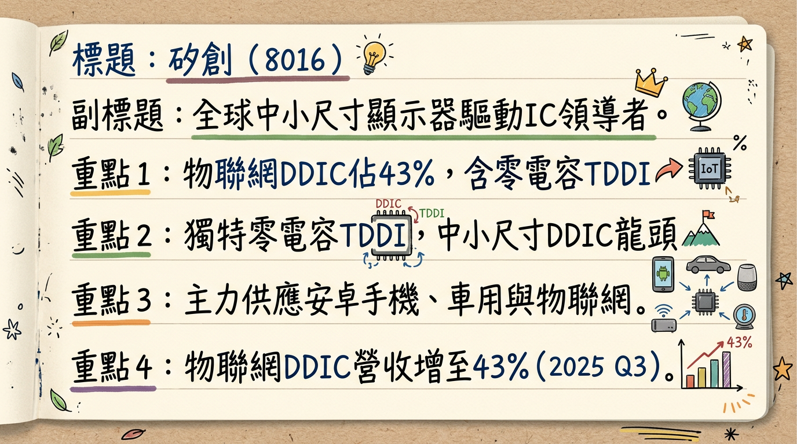
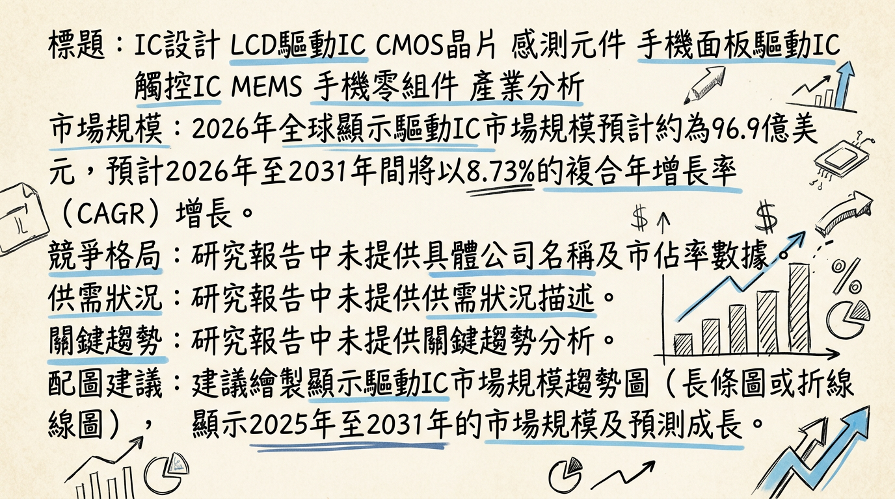
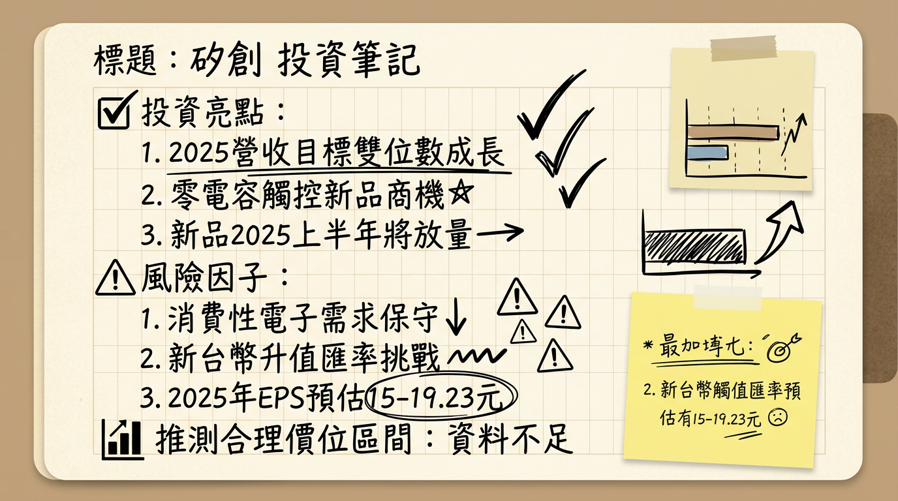

# 8016 矽創 深度研究報告

**今天日期：2026年03月06日**

## 一句話摘要

矽創 (8016) 受惠於車用電子與高階感測器領域的強勁成長動能，以及獨特的零電容 TDDI 技術在 AIoT 應用中持續放量，預期在2025年成功擺脫庫存調整陰霾，2026年營收及獲利將恢復成長，儘管 TDDI 面臨價格競爭，但高毛利產品組合優化有望穩定整體獲利表現。

## 公司概覽

矽創電子（8016）是一家專業積體電路設計公司，提供多樣化的晶片解決方案，其營運模式為 Fabless，將晶圓製造委託給專業代工廠。

**核心產品與服務：**
*   **顯示器驅動IC (DDIC)**：應用於物聯網（IoT）、工控設備、車用顯示器等中小尺寸面板。
*   **觸控暨顯示驅動整合晶片 (TDDI)**：獨特的零電容（zerocap®）技術，應用於智慧型手機、物聯網裝置及車用領域。
*   **感測器IC**：透過子公司昇佳電子（6732）提供光學感測、微機電（MEMS）及電容感測晶片，為安卓一線品牌手機感測器的主要供應商，亦應用於穿戴裝置。
*   **車用DDIC**：透過子公司力領科技（FORCELEAD）主導，專注於車用儀表板、抬頭顯示器（HUD）及中控觸控顯示器。
*   **晶圓測試探針卡**：透過子公司新特系統（7815）研發與製造。
*   **電源管理IC**：透過子公司極創涉足。

**營收結構（2025年第三季）：**

| 產品線分類     | 佔營收比例 | 備註                                       |
| :------------- | :--------- | :----------------------------------------- |
| 物聯網（AIoT）DDIC | 43%        | 其中零電容TDDI產品佔此部門營收的39%          |
| 手機感測器（昇佳） | 22%        |                                            |
| 車用DDIC（力領）   | 14%        |                                            |
| 工控設備DDIC     | 11%        |                                            |
| 其他             | 10%        | 包含探針卡、電源管理IC及未分類之DDIC應用等 |

## 核心競爭優勢

1.  **獨特的零電容TDDI技術：** 矽創的零電容（zerocap®）TDDI技術能有效降低面板模組成本、厚度，並縮小邊框，符合市場對輕薄化、成本優化的趨勢，使其在物聯網與智慧型手機市場具備差異化優勢。
2.  **多元且高成長的產品組合：** 透過子公司昇佳電子深耕安卓一線品牌手機感測器市場，並在2026年導入高階耳機光感測；力領科技則專注於高進入門檻的車用DDIC市場，受惠於智慧座艙趨勢，確保公司在不同高成長領域的佈局。
3.  **供應鏈風險管理：** 透過分散台灣與中國的晶圓投片據點，以及集團內部子公司間的支援機制，有效分散晶圓代工與封測端的成本結構調整和產能供應風險。

## 財務分析

### 月營收趨勢

| 月份   | 金額 (新台幣億元) | 月增率 (MoM) | 年增率 (YoY) |
| :----- | :---------------- | :----------- | :----------- |
| 2026年1月 | 17.80             | -5.6%        | 26.9%        |
| 2025年12月 | 18.86             | 4.73%        | 20.36%       |
| 2025年11月 | 18.01             | 11.18%       | 18.33%       |
| 2025年10月 | 16.20             | -2.27%       | 6.05%        |
| 2025年9月  | 16.58             | 7.46%        | 4.29%        |
| 2025年8月  | 15.43             | 1.91%        | -3.39%       |

**說明：** 2025年下半年起，月營收呈現明顯回溫趨勢，尤其2025年12月營收達到近48個月新高18.86億元，並在2026年1月維持高年成長率26.9%，顯示公司營運已走出谷底。

### 季度與年度財務數據

| 年度/季度 | 季營收 (新台幣億元) | 毛利率 (%) | 營業利益率 (%) | EPS (新台幣元) |
| :-------- | :------------------ | :--------- | :------------- | :------------- |
| 22025Q4   | 53.07               | 未公布     | 未公布         | 4.36           |
| 2025Q3    | 47.1                | 29%        | 10%            | 3.28           |
| 2025Q2    | 43.83               | 30.65%     | 11.03%         | 3.57           |
| 2025Q1    | 43.0                | 32.65%     | 11.59%         | 3.45           |
| **年度**  |                     |            |                |                |
| 2025年    | 190.02              | 未公布     | 未公布         | 14.66          |
| 2024年    | 178.265             | 未公布     | 未公布         | 15.42          |

**說明：** 2025年全年營收達190.02億元，年增6.6%。儘管全年EPS 14.66元較2024年15.42元有所下滑 (-5.5%)，但2025年第四季獲利季增32.8%，年增23.2%，顯示獲利動能於年底顯著回升。

## 法說會重點 (2025年11月/12月)

**管理層對產品線出貨量/訂單能見度：**
*   **物聯網 (AIoT) DDIC：** 零電容TDDI為主要成長動能，2025年第三季已佔公司總營收的16%。TDDI新規格產品已於2025年下半年推出，預期2026年將持續放量。
*   **手機感測器 (昇佳電子)：** 電磁波吸收率 (SAR) 感測器與高度計感測器已成功導入安卓一線品牌手機。針對韓系客戶高階耳機應用，已開發新款光感測產品，預計2026年初開始交付，可望帶來較佳的毛利貢獻。
*   **車用 DDIC (力領科技)：** 純車用業務出貨自2025年8月起已回溫，新規格產品與新應用的導入預計在2026年展現更明顯的貢獻。車用TDDI新規格預期將量產。
*   **工控設備 DDIC：** 此業務具季節性，通常上半年為採購旺季，下半年較淡。

**產能利用率、資本支出金額：**
*   未找到 2025-2026 年的最新資料。公司表示已提前因應晶圓代工與封測成本結構調整，透過分散投片據點來分散風險。

**管理層給出的2026年 Guidance：**
*   **營收展望：** 公司對2026年營收展望持正面看法，預期增長會比2025年更為顯著。
*   **成長動能：** 主要由物聯網 (AIoT) 的TDDI產品持續放量、車用DDIC的新規格產品導入量產，以及感測器 (Sensor) 的新一代高階產品出貨所驅動。
*   **毛利率指引：** 公司目標在2026年維持與2025年平均水準相當的穩定毛利率。其中，車用與感測器業務的毛利率有望年對年提升，而AIoT (TDDI) 則可能因市場競爭面臨些許壓力。

## 券商觀點

| 券商名稱           | 日期         | 目標價 (新台幣元) | 評等 | 備註                                   |
| :----------------- | :----------- | :---------------- | :--- | :------------------------------------- |
| 某券商 (CMoney彙整) | 2025年4月10日 | 185               | 中立 | 預估2025年EPS介於14.11-15.14元之間   |
| 某券商 (CMoney彙整) | 2025年12月17日 | 215               | 看多 | 預估2025年EPS約為14元，2026年EPS約為15元 |

**券商2025-2026年EPS預估：**
*   **2025年 EPS 預估：** 介於14.11至15.47元之間（法人平均）。**實際為14.66元。**
*   **2026年 EPS 預估：** 法人機構平均預估年度稅後純益可達18.06億元，推估EPS介於15至15.08元之間。

**評等調升：**
根據CMoney彙整報告，市場評等從2025年4月的「中立」調升至2025年12月的「看多」，顯示市場對矽創的展望有所改善。

## 財報深度分析

### 利潤率趨勢

| 年度/季度 | 毛利率 (%) | 營業利益率 (%) | 稅後淨利率 (%) |
| :-------- | :--------- | :------------- | :------------- |
| 2025Q3    | 28.91      | 9.58           | 10.49          |
| 2025Q2    | 30.65      | 11.03          | 11.13          |
| 2025Q1    | 32.65      | 11.59          | 12.44          |
| 2024Q4    | 32.85      | 11.83          | 11.98          |
| 2024Q3    | 33.08      | 13.82          | 12.8           |
| 2024Q2    | 35.13      | 15.26          | 15.38          |
| 2024Q1    | 35.54      | 15.15          | 15.11          |

**利潤率變化分析：**
矽創的利潤率在2024年初達到高峰後，於2024年下半年至2025年第三季呈現緩步下滑趨勢。主要原因為：
1.  **產品組合變化：** 零電容TDDI產品線雖然帶來營收增長動能，但新產品初期毛利率較低，且市場競爭激烈，對整體毛利率構成壓力。
2.  **市場競爭：** 驅動IC市場在非車用領域的競爭持續激烈。
3.  **匯率因素：** 2025年第二、三季台幣升值對以美元計價的營收產生負面影響，若排除匯率干擾，營收年增幅度會更顯著。
公司預期2026年透過車用與感測器等高毛利業務的增長，有望穩定整體毛利率在2025年平均水準。

### 存貨與營運

*   **存貨與應收帳款週轉：** 根據2025年第三季法說會資料，矽創的營運週轉天數保持在健康且穩定的水平，應收帳款週轉天數也維持在過去4年平均範圍，顯示良好的營運資金管理效率，未提及存貨有異常堆積或備料現象。
*   **資本支出與折舊攤銷：** 未找到2024-2026年的具體數字與趨勢資料。

### 其他財報重點

*   **業外收支：** 2025年第三季業外收入顯著增加，對淨利產生正面貢獻，但公司視為一次性或非經常性收入。

## 股權異動

*   **董監事/大股東申報轉讓紀錄：** 未找到2025-2026年的紀錄。
*   **庫藏股買回紀錄：** 未找到2025-2026年的紀錄。
*   **發行可轉換公司債（CB）：** 未找到2025-2026年的紀錄。
*   **現金增資或減資計畫：** 未找到2025-2026年的紀錄。
*   **股利政策：** 董事會決議配發2025年度盈餘現金股利每股11.5元。

## 產業分析

### 市場規模與成長率

| 產業類別           | 2025年市場規模 (預估) | 2026年市場規模 (預估) | 複合年增長率 (CAGR)    | 成長期間 |
| :----------------- | :-------------------- | :-------------------- | :--------------------- | :------- |
| 顯示驅動IC (DDIC)  | 43.8億美元 或 89.1億美元 | 47.0億美元 或 96.9億美元 | 7.68% 或 8.73%           | 2026-2032/2031 |
| 觸控暨顯示驅動整合晶片 (TDDI) | 99.9億美元            | 未明確                | 12.62%                 | 2025-2033 |
| 感測器IC (Sensor IC) | 2666.3億美元 或 2410.6億美元 | 2890.3億美元 或 2584.7億美元 | 8.29% 或 9.30%           | 2026-2035/2034 |
| 車用顯示驅動IC     | 未明確                | 未明確                | 15.25%                 | 未明確   |

**供需狀況：**
*   **DDIC：** Omdia報告預計2025年全球DDIC出貨量同比下降2%，2026年溫和增長2%。中小尺寸DDIC總需求在2025年預計下降5%。2025年下半年出現「旺季不旺」現象。
*   **成熟製程產能：** 40奈米以下成熟製程的晶圓代工產能持續緊張，限制了DDIC的供應，此類產能同時也被AI加速器等高性能運算產品排擠。
*   **OLED DDIC：** 2025年OLED DDIC晶圓(僅28/40HV)供應量約為10.8萬片/月，需求量預計為8.7萬片/月，整體供需狀況偏好。
*   **產業普遍樂觀：** 晶片製造商普遍對2026年市場前景持樂觀態度，認為需求顯著超前供應，特別是在AI運算領域。

**產業平均毛利率水準：**
TDDI手機產品競爭激烈，產品持續降價壓縮毛利空間。晶圓成本上升也可能擠壓毛利率。目前未找到2024年以後顯示驅動IC設計產業的具體平均毛利率數據。

### 競爭格局

| 項目         | 矽創 (8016)                                  | 敦泰 (3545)                                   | 其他主要競爭者 (全球市場)                      |
| :----------- | :------------------------------------------- | :-------------------------------------------- | :--------------------------------------------- |
| **主要技術** | 零電容 (zerocap®) TDDI、高階光學/MEMS感測器、車用DDIC | TDDI (手機應用競爭激烈)                       | **DDIC:** 聯詠 (Novatek), 奇景光電 (Himax)   **TDDI:** 三星LSI, 聯詠, 譜瑞科技, LX Semicon, 韋爾半導體, 集創北方, 新突思電子, 晶門科技   **感測器IC:** Bosch, STMicroelectronics, Texas Instruments (TI) |
| **產品市場** | AIoT、智慧型手機感測器 (安卓一線)、車用顯示器、工控 | 智慧型手機 TDDI                               | 各大消費性電子、車用、工業領域                 |
| **市佔率**   | 未明確，但感測器在安卓一線品牌具優勢         | TDDI市場主要參與者之一，但面臨價格壓力        | **感測器IC:** Bosch、STMicro、TI在2025年共佔約29.3%出貨量 |
| **競爭狀況** | 零電容TDDI具差異化，車用及感測器毛利較佳     | TDDI市場競爭激烈，產品降價、AI排擠效應，2025年認列12.37億元商譽減損 (EPS -5.8元) | 各產品線均面臨激烈競爭，部分領域供需平衡或供過於求 |
| **優勢**     | 產品組合多元化，高毛利產品線佈局              |                                               | 規模經濟、廣泛客戶群、技術領先                 |
| **劣勢**     | TDDI初期毛利率承壓，市場較晚切入              | TDDI高度依賴手機市場，易受景氣循環影響，毛利承壓 |                                               |

### 產業趨勢與矽創的機會/威脅

**1. 高階顯示技術普及 (OLED、Mini-LED、Micro-LED)：**
*   **影響：** 高階智慧型手機超過55%採用OLED，折疊式/柔性顯示器CAGR超過20%。這些技術對DDIC的性能、功耗、解析度、刷新率提出更高要求。
*   **矽創機會：** 矽創在中小尺寸DDIC領域的領導地位，使其能把握OLED、Mini-LED在物聯網、工控設備和特定消費電子中的應用機會。

**2. 汽車電子化與數碼座艙趨勢：**
*   **影響：** 汽車行業轉向複雜車載資訊娛樂系統和ADAS，對多個高解析度螢幕需求日益增加，推動車用驅動IC需求以15.25%的CAGR增長，且支持更高的ASP。
*   **矽創機會：** 矽創透過力領科技主導車用DDIC，直接受益於電動車普及和智慧座艙趨勢，高進入門檻帶來高利潤空間。

**3. 物聯網 (IoT) 和邊緣AI的整合：**
*   **影響：** IoT普及、自動化增強和智慧基礎設施項目持續推動感測器市場增長。AI將感測器轉變為智能系統，實現更快響應和更高精度。
*   **矽創機會：** 矽創的感測器IC (昇佳電子) 業務與AIoT緊密相關，尤其在智能駕駛、工業自動化和智能裝置領域帶來巨大增長機會。

**矽創面臨的威脅：**
*   **DDIC/TDDI市場競爭加劇與價格壓力：** 顯示驅動IC市場供需波動，TDDI市場產品持續降價壓縮毛利空間。
*   **晶圓產能供應風險：** 40奈米以下成熟製程的晶圓代工產能緊張，可能影響晶片供應和成本。
*   **面板廠垂直整合：** 部份面板製造商自行設計或生產驅動IC，可能縮小第三方驅動IC的市場空間。
*   **總體經濟與地緣政治不確定性：** 關稅政策和全球經濟環境可能影響消費電子市場需求。

**相關投資題材連結：**
*   **電動車 (EV) / 汽車電子：** 子公司力領科技專注車用DDIC，直接受惠。
*   **人工智慧 (AI) / AIoT：** 感測器IC業務與AIoT緊密相關，為智能駕駛、工業自動化等提供智能感測解決方案。
*   **物聯網 (IoT)：** 顯示驅動IC和感測器IC廣泛應用於各類IoT設備。

## 近期催化劑

### 利多事件：
*   **2025年第四季獲利強勁：** 2026年3月5日公布2025年第四季EPS 4.36元，季增32.8%，年增23.2%，顯示獲利動能顯著回升。
*   **2026年1月營收表現亮眼：** 2026年2月6日公布合併營收17.80億元，年成長高達26.9%。
*   **零電容TDDI技術放量：** 2024年12月法說會預期2025上半年放量，並於2025年第三季佔總營收16%，持續為2026年營收成長動能。
*   **車用市場回溫：** 2025年8月起車用產品已見回升，並與中國車廠緊密合作，約佔車用營收50%，具備快速design-in優勢。
*   **高階感測器產品出貨：** 子公司昇佳電子成功導入安卓一線品牌手機感測器，並預計2026年初供應高階耳機光感測產品，毛利率較佳。
*   **分散產能佈局：** 2026年1月28日公告，為因應晶圓代工與封測成本調整，已分散投片據點，有效分散供應鏈風險。
*   **市場評等調升：** 從2025年4月的「中立」調升至2025年12月的「看多」。

### 利空事件：
*   **TDDI市場價格競爭：** 儘管TDDI放量，但因矽創較晚切入市場，短期仍面臨價格競爭壓力，恐壓抑其TDDI毛利率。
*   **新台幣升值壓力：** 2025年5月新台幣兌美元快速升值，對出口為主的IC設計公司可能帶來匯損壓力。
*   **宏觀經濟不確定性：** 美國關稅政策和地緣政治不穩定可能影響終端需求。
*   **毛利率下滑趨勢：** 連續數季毛利率、營業利益率和稅後淨利率下滑（2024Q1至2025Q3），反映產品組合與市場競爭的壓力。

## ⭐ 成長動能時間軸

| 時間點           | 成長動能項目                             | 具體內容                                                                                                                                                                                                                                                                                            |
| :--------------- | :--------------------------------------- | :---------------------------------------------------------------------------------------------------------------------------------------------------------------------------------------------------------------------------------------------------------------------------------- |
| **2025年上半年** | **TDDI新品放量**                         | 零電容觸控顯示晶片 (TDDI) 正式推出，市場滲透速度優於預期，2025年Q1佔總營收6%至7%。                                                                                                                                                                                                                         |
| **2025年8月起**  | **車用產品回溫**                         | 純車用業務出貨已見回溫，為第三季毛利率改善貢獻。                                                                                                                                                                                                                                                          |
| **2025年下半年** | **TDDI新規格導入與持續放量**             | 推出多項TDDI新規格產品，客戶採用度提升，持續推動營收增長。2025年Q3 TDDI營收佔比已升至16%。                                                                                                                                                                                                                           |
| **2025年下半年** | **昇佳電子開拓手機感測器新客戶與應用**   | 成功將電磁波吸收率 (SAR) 及高度計感測器從穿戴裝置推向安卓手機品牌市場，打入Android手機供應鏈。                                                                                                                                                                                                                   |
| **2025年下半年** | **車用產品與中系車廠合作深化**           | 與中系車廠合作緊密，約佔車用營收50%，受惠於中系車廠新車推出速度快，有利於矽創的design-in流程。                                                                                                                                                                                                                    |
| **2026年初**     | **高階耳機光學感測產品交付**             | 針對韓系客戶高階耳機應用，已開發新款光感測產品，預計開始交付，可望帶來較佳的毛利貢獻。                                                                                                                                                                                                                            |
| **2026年上半年** | **昇佳電子新一代光感測產品出貨**         | 新一代光感測產品預計開始出貨，其毛利率較佳，將帶動整體感測器產品線毛利率明顯改善。                                                                                                                                                                                                                          |
| **2026年全年**   | **車用DDIC新規格導入量產**               | 隨新車款量產，新規格儀表板與抬頭顯示器 (HUD) 等車載中小尺寸顯示器出貨增溫，車用產品毛利率可望維持穩定向上。車用TDDI新規格預期將量產。                                                                                                                                                                                                    |
| **2026年全年**   | **非消費性電子領域滲透率持續提升**       | 高毛利的感測器、工控及車用驅動IC等非消費性電子領域的滲透率持續提升，將是支撐2026年獲利重返成長軌道的重要關鍵。                                                                                                                                                                                                           |
| **2026年全年**   | **物聯網、工控市場應用需求穩定**         | 智慧電網設備、電表等政府標案，以及工業量測儀器等長尾市場，提供穩定營收基礎。                                                                                                                                                                                                                                  |

## 2026 展望

**成長動能：**
矽創預期2026年營收將實現正向增長，主要由三大高成長產品線驅動：
1.  **AIoT TDDI持續放量：** 零電容TDDI技術在物聯網和智慧裝置中的滲透率持續提升，預計2026年將進一步貢獻營收。
2.  **車用DDIC新規格導入與增溫：** 隨著新車款的量產，特別是儀表板、抬頭顯示器 (HUD) 等多螢幕顯示需求增長，車用DDIC出貨量將顯著提升，且此業務毛利率有望穩定向上。
3.  **高階感測器產品出貨：** 子公司昇佳電子新一代高毛利光感測產品（包括高階耳機應用）預計在2026年上半年開始出貨，將顯著改善感測器產品線的整體毛利率。

**風險：**
*   **TDDI市場競爭與毛利壓力：** 儘管TDDI業務成長，但市場競爭激烈，短期內可能仍面臨價格壓力，影響其毛利率。
*   **全球經濟復甦速度：** 宏觀經濟、地緣政治及通膨情勢若不如預期，可能影響終端消費電子需求及客戶下單意願。
*   **晶圓代工產能與成本：** 成熟製程產能持續緊張以及晶圓代工成本波動，可能影響晶片供應及產品成本。
*   **匯率波動：** 新台幣兌美元匯率波動仍是潛在的業外風險。

法人機構預估矽創2026年稅後純益約18.06億元，推算EPS約在15元附近。公司目標是維持2026年全年毛利率與2025年平均水準相當。

## 投資結論

綜合以上分析，矽創 (8016) 在2025年成功度過庫存調整期後，其營運已見明顯復甦，並透過多元化佈局鎖定高成長市場，儘管TDDI業務仍面臨競爭挑戰，但高毛利產品組合的優化策略將是支撐未來獲利成長的關鍵。

1.  **營運轉折點已現：** 2025年第四季獲利及2026年1月營收表現亮眼，顯示公司營運已走出谷底，恢復成長動能。
2.  **高成長動能清晰：** 車用電子、高階感測器及AIoT的TDDI為三大核心成長引擎，尤其車用市場和高階感測器產品的高毛利特性，有望優化公司整體獲利結構。
3.  **零電容TDDI具差異化優勢：** 獨特的零電容技術使其在物聯網等中小尺寸顯示應用中具備競爭力，持續貢獻營收。
4.  **產品組合優化穩定毛利率：** 儘管TDDI面臨價格壓力，但來自車用與高階感測器的高毛利貢獻將有望抵銷衝擊，穩定公司整體毛利率表現。

基於2026年預估EPS約15元，並考量矽創在車用、感測器領域的成長潛力以及市場對其評價的提升，給予目標價區間建議為 **新台幣 210元 至 240元**。此建議區間反映了未來14倍至16倍的預期本益比，考量公司走出谷底的成長性與結構性優勢。

本報告由 AI 自動產生，資料來源為公開網路資訊，僅供參考，不構成投資建議。產生時間：2026-03-06 13:03

---

## 📊 資訊卡

