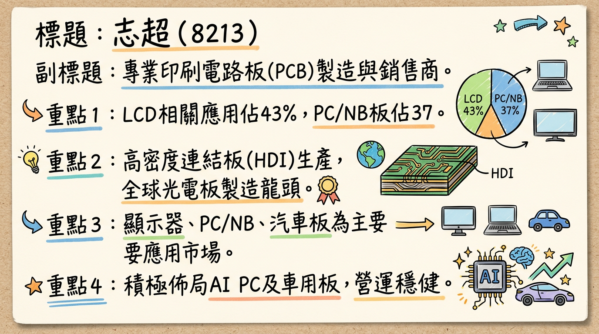
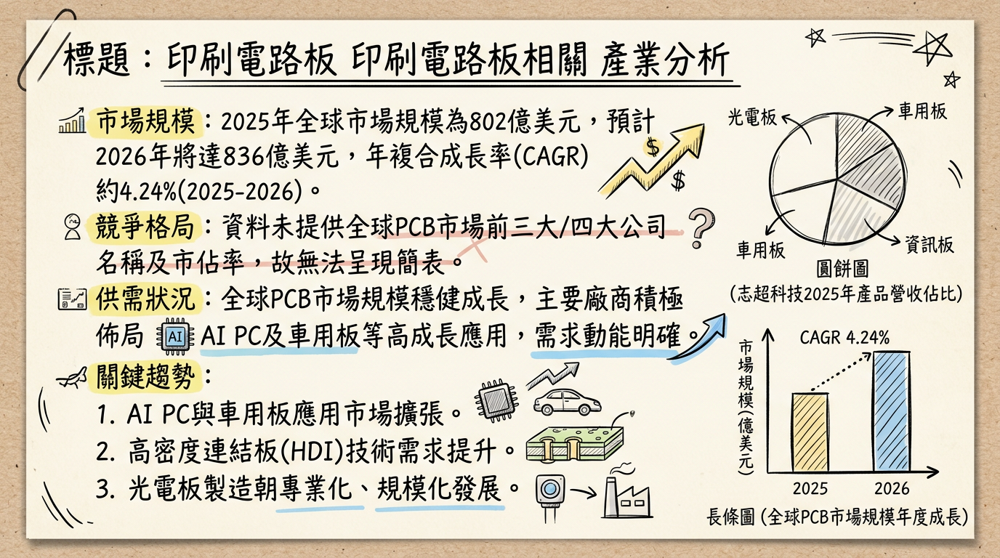
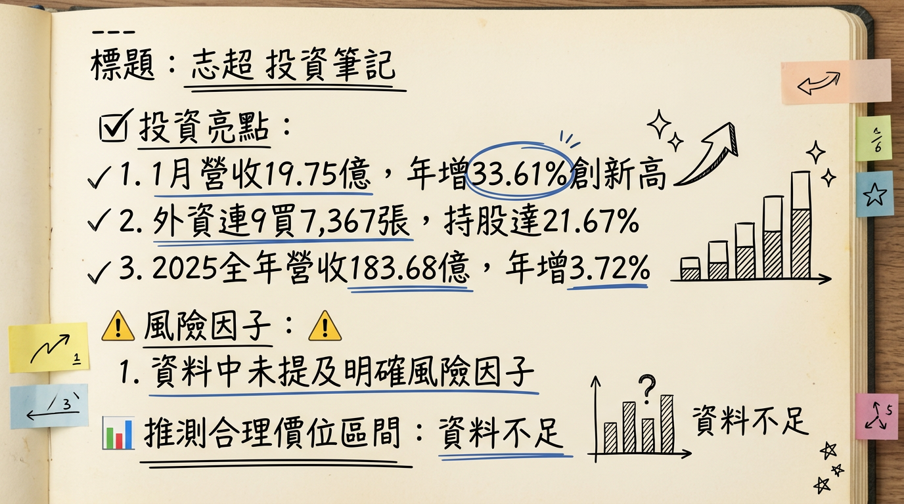

# 8213 志超 深度研究報告

## 一句話摘要
志超科技 (8213) 為全球光電板龍頭PCB製造商，受惠於AI PC與車用板強勁需求，2026年1月營收創44個月新高，顯示產業復甦訊號明確。公司透過高資本支出擴充HDI產能並佈局越南新廠，有望在AI PC、車用與網通板三大動能驅動下實現營運轉型與獲利成長，但仍需留意原物料成本與匯率波動風險。

## 公司概覽

志超科技成立於1998年，主要從事電子零組件及印刷電路板（PCB）的製造與銷售，是全球最大的光電板製造商之一。其產品涵蓋雙面板至十四層板，並具備高密度連結板（HDI）的生產能力，廣泛應用於顯示器、資訊產品（NB/PC、AIPC、AIO、記憶體模組、SSD、電池等）、汽車用板及工控、智能家電等領域。

### 營收結構（2025年產品組合佔比）

| 產品線           | 佔營收比例 |
| :--------------- | :--------- |
| LCD 相關應用     | 43%        |
| PC/NB            | 37%        |
| 汽車（Automotive）板 | 14%        |
| 觸控/記憶體      | 5%         |
| 工業及其他       | 1%         |

*註：若參考2024年第一季數據，營收比重則為：光電板佔49%、NB板佔27%、汽車板佔14%、其他資訊板佔10%。*

### 製造基地

志超科技擁有全球化的生產網絡：
*   **台灣**：桃園平鎮（總部及生產基地），主要生產HDI、LCD、SSD、網通、汽車板。高雄廠產能目前暫停。
*   **中國大陸**：無錫、遂寧、中山三大廠區，產品涵蓋NB、LCD、車載、HDI、SSD、觸控板、TV Main。無錫廠是AI PC相關產品打樣、認證的主要據點。
*   **越南**：北越廠於2023年第三季設立並已量產，投資金額約1000萬美元，主要生產車載、光電PCB，並支援部分網通板。旨在就近服務當地電子產業聚落客戶。
*   *備註：未找到各製造基地的具體營收貢獻比例。*

## 核心競爭優勢

1.  **光電板領域龍頭地位**：志超為全球最大的光電板製造商之一，在顯示器相關PCB領域擁有深厚根基與規模優勢。
2.  **HDI技術能力**：具備高密度連結板（HDI）生產能力，能滿足AI PC等高階應用對複雜度與訊號完整性的要求，搶佔高階市場先機。
3.  **積極佈局AI PC**：早期投入AI PC相關PCB的開發與打樣，配合高資本支出擴充HDI產能，預期將在2025年起顯著受惠於AI PC換機潮。
4.  **穩健的車用與工控市場**：策略性深耕需求與價格相對穩定的車用及工控產品，分散消費性電子市場的波動風險，汽車板已是公司第三大產品支柱。
5.  **海外產能彈性配置**：越南北越廠的設立，有效掌握全球供應鏈轉移趨勢，就近服務當地客戶，並分散地緣政治風險。

## 財務分析

### 月營收趨勢

| 月份   | 金額（億元） | 月增率 MoM | 年增率 YoY |
| :----- | :----------- | :--------- | :--------- |
| 2026年01月 | 19.75        | +27.6%     | +33.6%     |
| 2025年12月 | 15.48        | -0.28%     | +32.08%    |
| 2025年11月 | 15.52        | +3.5%      | +7.8%      |
| 2025年10月 | 15.00        | +3.0%      | -1.9%      |
| 2025年09月 | 14.57        | -6.3%      | +5.3%      |
| 2025年08月 | 15.55        | -1.7%      | -0.7%      |

*志超2026年1月合併營收達19.75億元，月增27.59%，年增33.61%，創下自2022年6月以來的44個月新高，顯示PCB產業復甦訊號強勁。*

### 季度數據（2025年第三季）

*   **季營收**：45.94 億元 (2025年7-9月月營收加總)
*   **毛利率**：10.97%
*   **營業利益率**：4.24%
*   **EPS**：0.54 元

### 年度趨勢

*   **2024年實際**：
    *   全年度營收：177.0799 億元，較前一年衰退 6.47%。
    *   EPS：2.75 元。
*   **2025年實際**：
    *   全年度營收：183.68 億元 (累計至12月)，較去年同期成長 3.72%。
    *   EPS：1.78 元 (累計至Q3為1.77元，總計為1.78元)。

## 法說會重點

*以下內容整理自2025年09月19日之法說會，雖為歷史資訊，仍可作為了解公司當時展望之參考。*

*   **會議日期**：2025年09月19日（*最新一次董事會將於2026年03月11日召開，討論2025年度財報*）
*   **2025年第二季營運**：營收新台幣46.68億元，稅後每股盈餘（EPS）為0.6元，累計前二季EPS為1.23元。
*   **產品線與市場展望**：
    *   營運以LCD相關應用（佔43%）、PC/NB（佔37%）及汽車板（佔14%）為三大支柱。
    *   PC/NB產品線於2025年表現較佳，車用產品穩定成長，成為第三大產品線。
    *   管理層對2025年整體消費性電子市場需求持平看待，預期與2024年相比無顯著增長。
    *   2026年1月營收動能回溫，反映PCB產品結構優化與AI網通需求回溫，訂單能見度優於去年同期。
*   **資本支出與產能**：
    *   2024年資本支出逾15億元，為連續3年處於此高投資水準，主要用於擴充設備和製程以因應AI PC所需的背鑽和HDI製程。
    *   越南北越廠於2023年第三季設立並已量產約兩年，主要就近服務當地電子產業聚落，生產車載、光電PCB並支援部分網通板。
*   **下季/下半年 Guidance**：預期成長動能來自PC/NB產品線的復甦與車用產品線的穩定增長。越南廠營運步入正軌，持續開發新客戶。
*   **挑戰**：新台幣升值及金價大幅上漲帶來成本壓力。

## 券商觀點

| 券商名稱 | 目標價（元） | 評等 | 日期       |
| :------- | :----------- | :--- | :--------- |
| 群益證券 | 43           | 看多 | 2024/05/24 |

*註：上述券商報告為歷史資料，目前缺乏2025-2026年最新券商報告及EPS預估。群益證券於2024年05月24日預估志超2024年度EPS約為3.06元，實際2024年EPS為2.75元。*

## 財報深度分析

### 利潤率趨勢

| 季度       | 毛利率   | 營業利益率 | 稅後淨利率 |
| :--------- | :------- | :--------- | :--------- |
| 2025年Q3   | 10.97%   | 4.24%      | 3.18%      |
| 2025年Q2   | 12.04%   | 5.40%      | 3.54%      |
| 2025年Q1   | 10.88%   | 4.19%      | 3.72%      |
| 2024年Q4   | 12.35%   | 4.90%      | 4.08%      |
| 2024年Q3   | 12.32%   | 4.84%      | 3.71%      |
| 2024年Q2   | 11.80%   | 4.37%      | 3.38%      |
| 2024年Q1   | 9.62%    | 2.48%      | 2.40%      |

*   **利潤率變化原因分析**：志超的利潤率在2024-2025年間呈現波動，2025年第一季因成本壓力導致毛利率較低，但第二季有所回升，第三季略微下降。整體而言，2025年上半年營收回升且營運效率改善，但單季獲利仍受非營業因素（如所得稅費用增加）及新台幣升值、金價上漲等成本壓力影響。公司持續優化產品組合，深耕車用與工控產品，以應對市場挑戰。

### 存貨與營運分析

| 季度       | 存貨週轉天數 | 應收帳款收現天數 |
| :--------- | :----------- | :--------------- |
| 2025年Q3   | 46.33天      | 131.83天         |
| 2025年Q2   | 45.73天      | 128.83天         |
| 2025年Q1   | 45.75天      | 134.09天         |
| 2024年Q4   | 51.49天      | 145.21天         |

*   **存貨分析**：2025年存貨週轉天數呈現下降趨勢，從2024年第四季的51.49天降至2025年第三季的46.33天，顯示存貨管理能力增強或市場需求回溫，目前沒有明顯的異常堆積或備料現象。
*   **應收帳款分析**：應收帳款收現天數在2025年亦呈現下降趨勢，從2024年第四季的145.21天降至2025年第三季的131.83天，表示收款能力或業績有所改善。

### 資本支出

*   **近3年資本支出**：志超在2024年的資本支出預計超過**新台幣15億元**，且已連續三年維持在高投資水準。
*   **未來資本支出計畫**：主要用於投入HDI板擴產，以因應AI PC產品板的背鑽、HDI製程需求，並將在中國大陸無錫廠進行量產。此外，越南北越廠已建立每月**30萬呎**的新產能，主要應用於車載、光電PCB，並支援部分網通板生產。

## 股權異動

*   **董監事異動**：2026年2月21日，志超公告董事長暨執行長徐正民辭世。隨後於2026年2月26日，公司公告子公司統盟電子及Brilliant Star Holdings Limited重新指派新任董事，新任統盟電子董事為志超科技股份有限公司代表人李明熹。此為經營層面的重大變動，而非股票申報轉讓。
*   **庫藏股、可轉債、增減資**：目前未找到2024-2026年志超庫藏股買回、發行可轉換公司債或增減資計畫的最新資料。
*   **股利政策**：
    *   **2025年股利（2024年度盈餘分配）**：擬發放現金股利**1.38元**。除息交易日為2025年7月31日，現金股利發放日為2025年8月21日，現金殖利率約為**4.1%**（以相關時點股價推算）。
    *   **2024年股利（2023年度盈餘分配）**：擬發放現金股利**1.00元**。除息交易日為2024年7月4日，現金股利發放日為2024年7月29日，現金殖利率為**2.36%**（以2024/04/22收盤價計算）。
    歷年股利分派均為現金股利，未發放股票股利。

## 產業分析

### 市場規模與供需狀況

*   **全球PCB市場規模**：
    *   2025年達到**802億美元**，預計2026年成長至**836億美元**。
    *   2026年至2035年間，年複合成長率（CAGR）為**5.7%**，2035年預計達**1378億美元**。
    *   另有報告預測，2025年全球PCB產值預估突破**新台幣9000億元**（年增12%），2026年更有機會上看**新台幣1.3兆元**。
    *   全球柔性印刷電路板（FPC）市場預計從2025年的**233億美元**增長到2030年的**417億美元**，CAGR為**12.3%**。
*   **供需狀況**：
    *   2026年，AI與半導體帶動的需求正在重塑PCB產業。AI算力基礎設施帶動PCB材料規格躍進，上游重要材料如HVLP4銅箔、玻纖布、鑽針、CCL正面臨供需緊張。特別是高階玻纖布與超低粗度銅箔（HVLP）供不應求，預計2026年HVLP4將成為市場主流，未來2至3年需求強勁且供不應求。
    *   然而，載板市場儘管2024年需求開始回溫，但整體仍處於供過於求的狀態，價格難以回升，導致產值表現疲弱。
*   **產業平均毛利率水準**：高階與低階市場的獲利能力差距將進一步拉大，加速產業M型化發展。IC載板（ABF）、高密度互連板（HDI）、汽車PCB、高頻高速PCB等高進入障礙領域，能維持較高的毛利率。傳統單/雙面板等低階領域則競爭激烈、利潤微薄。志超2024年第四季至2025年第三季毛利率介於**10.88%至12.35%**。

### 競爭格局

| 全球前五大HDI板廠 (2024) |
| :----------------------- |
| 華通                     |
| AT&T                     |
| 健鼎                     |
| 欣興                     |
| 臻鼎                     |

| 全球主要載板廠商市佔率 (2025, 部分) |
| :----------------------- | :----- |
| 欣興                     | 17.6%  |
| SEMCO                    | 12.0%  |
| Ibiden                   | 10.5%  |
| 南電                     | 6.9%   |
| Shinko                   | 6.9%   |

### 志超 vs. 主要競爭對手比較

*   **技術**：志超積極投入AI PC相關PCB（如HDI板）的打樣與擴產，顯示在高階PC板領域的技術升級，以因應AI PC對低耗損材料和更高布線密度的需求。這使其在高階消費性電子PCB領域具有競爭力，但與專精於ABF載板的三雄（欣興、南電、景碩）在高階載板技術上仍有區隔。
*   **產能**：2024年資本支出上看**20億元**主要用於HDI板擴產。越南北越廠每月**30萬呎**新產能已進入量產，強化了在車載、光電及網通板的產能。相較於同業在特定領域（如載板）的大規模擴產，志超的產能佈局更偏向多元化與區域化服務。
*   **客戶**：志超作為全球最大光電板廠之一，在NB板領域佔營收比重達**27%**（2024年Q1），擁有穩定的PC/NB客戶群。越南新廠則旨在就近服務仁寶、鴻海、和碩等EMS廠。
*   **價格**：AI PC相關PCB因屬新料號、新產品，具較高附加價值，有望提升產品平均售價（ASP）。志超深耕價格相對穩定的車用及工控產品，有助於平抑傳統消費性電子市場的價格競爭壓力。
*   **台灣同業比較**：志超2025年上半年毛利率約**12%**，EPS為**1.23元**。相較於ABF載板三雄（如景碩2025年Q2毛利率達21.08%），志超毛利率相對較低，這與其產品組合中光電板及PC/NB佔比較高有關。與精成科、瀚宇博等同業相比，志超的EPS在2024年較低，但2025年上半年有所成長。尖點（鑽針及鑽孔服務）則因AI/HPC需求帶動，毛利率與EPS成長顯著。

### 產業趨勢與對志超的影響

1.  **AI伺服器與高速運算（HPC）需求爆發**：
    *   **具體影響**：AI伺服器主板層數提升至34-50層，對M8、M9等級CCL、44層以上高層數HLC板材、低損耗材料（如Q-glass石英布、HVLP4銅箔）需求暴增。PCB製程朝半導體等級演進。
    *   **對志超機會**：志超在高階HDI板的投入與材料升級，若能切入AI伺服器相關高階板材供應鏈，將大幅受惠並提升ASP。
2.  **AI PC的興起**：
    *   **具體影響**：預估2025年AI PC出貨量將達**1.1億台**，年增165%。AI PC將帶動高速材料和HDI板需求，提升PCB產品ASP。GPU整合到板上將引導PCB朝HDI發展。
    *   **對志超機會**：志超積極佈局AI PC，投入HDI板擴產，預計效益從2025年起顯現。AI PC帶來新料號、新產品與更高附加價值，為志超提供顯著成長機會。
3.  **電動車（EV）與先進駕駛輔助系統（ADAS）的發展**：
    *   **具體影響**：電動車電子化推動高可靠性PCB材料需求，帶動高階汽車板市場成長。
    *   **對志超機會**：志超將汽車板視為三大支柱之一，持續深耕。越南新廠產能也應用於車載PCB，提供穩定成長動能。

## 近期催化劑

### 利多事件清單

*   **2026年02月14日：營收利多**：2026年1月營收新台幣**19.75億元**，月增**27.59%**，年增**33.61%**，創自2022年6月以來**44個月新高**，被視為PCB產業復甦關鍵訊號，反映高階伺服器板與網通板訂單回溫。
*   **2026年01月08日：營收利多**：2025年12月合併營收新台幣**15.48億元**，年增**32.08%**。累計2025年1月至12月營收約新台幣**183.68億元**，年增**3.72%**。
*   **外資買超**：截至2026年03月04日，外資累計買超志超達**7,367張**，持股比重為**21.67%**，且連續9個交易日買超，顯示法人對其後市看好。
*   **股利政策**：2025年擬發放現金股利**1.38元**，現金殖利率約**4.1%**，優於2024年的1.00元，顯示公司營運逐漸好轉並回饋股東。
*   **AI PC與車用佈局**：AI PC高附加價值產品已進入打樣階段，2025年起效益顯現，加上車用及工控產品的穩定成長，產品組合持續優化。
*   **海外擴廠效益**：越南北越廠已量產，有助於服務當地客戶並掌握供應鏈轉移趨勢。

### 利空事件清單

*   **原物料成本壓力**：2025年產業面臨原材料價格上漲（如國際金價、電價攀升）的成本壓力。
*   **新台幣升值壓力**：新台幣升值將對出口導向的PCB廠商帶來匯兌損失與營運壓力。
*   **傳統消費性電子市場不確定性**：2025年整體消費性電子市場需求與2024年相比無顯著增長，維持持平看待。
*   **經營層異動**：董事長暨執行長徐正民辭世，雖然公司已進行新任董事指派，但經營層的變動可能在短期內對市場信心造成一定影響。

## ⭐ 成長動能時間軸

| 時間點     | 成長動能                                     | 具體內容                                                                                                                                                                                                                                                                                                                         |
| :--------- | :------------------------------------------- | :--------------------------------------------------------------------------------------------------------------------------------------------------------------------------------------------------------------------------------------------------------------------------------------------------------------------------------- |
| 2023年Q3   | **越南北越廠設立與量產**                     | 位於河南省，投資**1000萬美元**，月產能約**30萬平方呎**。主要應用於車載、光電PCB，並支援部分網通板生產。旨在就近服務仁寶、鴻海、和碩等EMS廠及當地台商網通設備廠。                                                                                                                                                                              |
| 22024年    | **高資本支出投入**                           | 資本支出維持逾**新台幣15億元**高檔，為連續三年處於此高投資水準。主要用於投入HDI板擴產，以因應AI PC產品板的背鑽、HDI製程需求。                                                                                                                                                                                           |
| 2025年起   | **AI PC效益顯現**                            | AI PC相關印刷電路板已進入打樣階段，預計未來將在中國大陸無錫廠量產。公司預期AI PC將帶來新料號、新產品與更高的附加價值，其效益預計從2025年起逐步顯現，並以2025年起的效益最為明顯。                                                                                                                                                                 |
| 2025年起   | **車用及工控產品穩定成長**                   | 持續深耕價格與需求較穩定的車用及工控產品市場，優化產品組合。汽車板已是公司第三大產品線。                                                                                                                                                                                                                           |
| 2025年起   | **PC/NB市場換機潮與市佔擴張**                | 2025年PC/NB產品線表現較佳，市場預期NB產業可能在今年（指2025或2026年）有換機潮。公司將持續努力擴張在NB板市場的現有市佔率。                                                                                                                                                                                                               |
| 2026年1月  | **營收強勁動能**                             | 合併營收達**19.75億元**，月增**27.59%**，年增**33.61%**，創**44個月新高**。反映PCB產品結構優化與AI網通需求回溫，訂單能見度優於去年同期。                                                                                                                                                                                                  |
| 長期趨勢   | **高階材料升級與網通板支援**                 | AI伺服器對高階PCB材料規格要求提升，如low loss材料、HDI板等需求增加，志超在高階製程的投入有望提升產品ASP。越南新廠產能亦支援部分網通板生產。                                                                                                                                                                                                 |

## 2026 展望

### 成長動能

1.  **AI PC市場爆發**：隨著AI PC在2025年起進入快速成長期，志超在HDI技術和產能上的投資將使其成為主要受惠者之一。AI PC對PCB板的更高技術要求和新料號需求，有望大幅提升公司產品的平均售價和毛利率。
2.  **車用板穩定增長**：汽車電子化趨勢不變，電動車與ADAS系統對高可靠性PCB需求持續增加。志超深耕車用市場，加上越南新廠的產能支援，將為公司帶來穩定的營收與利潤貢獻。
3.  **PC/NB市場復甦與結構優化**：預期NB市場可能迎來換機潮，且AI PC帶動的產品升級將優化整體PC/NB產品組合。志超作為PC/NB板主要供應商，將直接受益。
4.  **海外產能彈性與新客戶拓展**：越南北越廠已量產，不僅分散地緣政治風險，更提供就近服務當地電子產業聚落客戶的機會，有助於擴大客戶群及市佔率。
5.  **2026年1月營收的強勁表現**：創44個月新高，為全年營運奠定良好基礎，顯示公司在產品組合優化和訂單能見度上的優勢。

### 風險因子

1.  **原物料價格波動**：國際金價、電價等上漲壓力，可能侵蝕毛利率。
2.  **新台幣匯率波動**：新台幣若持續升值，對以美元計價出口為主的志超將產生不利的匯兌影響。
3.  **全球經濟復甦不如預期**：若全球經濟成長放緩，可能影響消費性電子產品的整體需求，儘管AI PC為新動能，但傳統市場需求不振仍是隱憂。
4.  **競爭加劇與產業M型化**：低階PCB市場競爭激烈，若高階產品轉型未能達到預期，可能面臨獲利壓力。
5.  **經營層過渡期**：董事長辭世後的經營層過渡與接班人選，雖已進行董事指派，但仍需觀察其對公司長期策略與執行力的影響。

## 投資結論

綜合以上分析，志超科技在2026年展現出明確的營運轉型與成長潛力，主要基於以下三至五點：

1.  **AI PC與車用雙引擎驅動**：志超積極佈局高附加價值的AI PC相關PCB，並擁有穩健成長的車用板業務，這兩大應用市場的結構性成長將成為公司未來營收與獲利的核心動能。2026年1月營收創高是此趨勢的初步驗證。
2.  **產能佈局提升競爭優勢**：透過逾新台幣15億元的高資本支出擴充HDI產能，以及越南北越廠的設立與量產（月產能30萬平方呎），志超不僅提升了技術門檻，更分散了生產風險，並能有效服務當地電子產業客戶，強化其在全球供應鏈中的地位。
3.  **財務體質改善訊號浮現**：儘管2025年EPS受到非營業因素影響，但2026年1月營收的強勁表現，以及2025年存貨週轉天數與應收帳款收現天數的下降趨勢，顯示公司營運效率與資金周轉狀況正在改善。
4.  **產品組合優化帶動獲利能力**：隨著AI PC、高階車用板與網通板等高附加價值產品比重提升，預期志超的產品組合將持續優化，有助於提升整體毛利率與獲利水準，應對產業M型化趨勢。
5.  **謹慎樂觀看待估值提升空間**：儘管面臨原物料成本與匯率波動壓力，但考量其在高成長性產業的佈局，以及已顯現的復甦訊號，市場有望給予其更高的估值。

基於對其2026年營運恢復與AI PC效益顯現的預期，並考量產業M型化下的成長機會與公司產品組合優化的潛力，建議投資人可關注在**新台幣 40 元至 50 元**的目標價區間。此區間反映了公司在AI時代轉型的潛力，但此評估需搭配後續季度財報與市場消息動態調整。

本報告由 AI 自動產生，資料來源為公開網路資訊，僅供參考，不構成投資建議。產生時間：2026-03-06 14:00

---

## 📊 資訊卡

