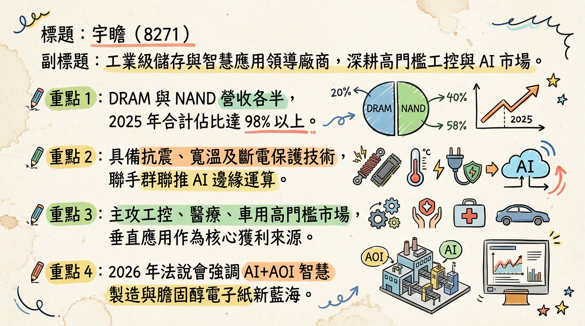
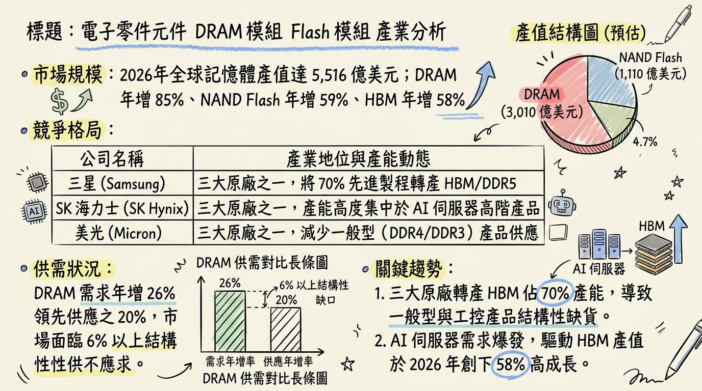
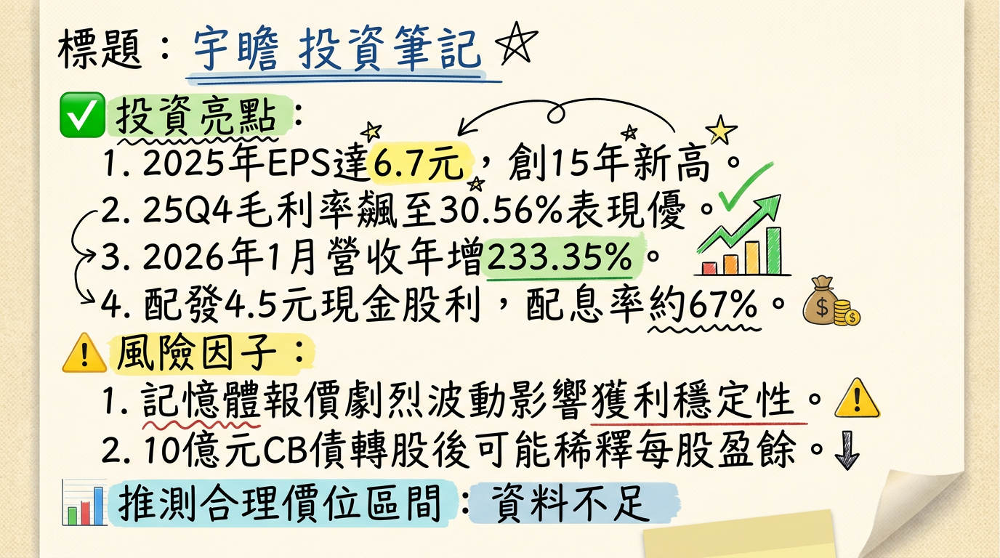

# 8271 宇瞻 (Apacer) 深度研究報告

## 一句話摘要
**受惠記憶體結構性缺貨超級循環，宇瞻透過「高庫存策略」與「工控/AI轉型」雙引擎，2026年獲利有望再創歷史新高。**

---

## 二、公司概覽
宇瞻（8271）為宏碁集團成員，已成功由消費性記憶體品牌轉型為**工業控制（Industrial）與智慧應用**解決方案領導商。

### 1. 業務與產品線
*   **記憶體模組 (DRAM)：** 包含工業級與消費級 DDR4、DDR5，主攻高門檻醫療、車用市場。
*   **快閃記憶體 (NAND Flash)：** 工業級 SSD、強固型儲存方案。
*   **智慧應用：** 與群聯合作之 **aiDAPTIV+** 邊緣運算方案、AI+AOI 智慧檢測、電子紙應用。

### 2. 營收結構表格（2025 年數據）
| 類別 | 營收佔比 | 毛利貢獻度 | 核心應用重點 |
| :--- | :--- | :--- | :--- |
| **記憶體模組 (DRAM)** | 50.48% | 中/高 | DDR4 缺貨漲價紅利、DDR5 滲透率提升 |
| **快閃記憶體 (NAND)** | 48.14% | 中/高 | 工業級 SSD、高階強固型儲存 |
| **其他（智慧應用）** | 1.38% | 極高 | AI+AOI 檢測設備、電子紙、Edge AI |

*   **市場應用佔比 (2025 Q4)：** 垂直應用（工控、醫療、車用）佔 **70%**；消費應用佔 **29%**。

---

## 三、核心競爭優勢
1.  **策略性庫存管理：** 2025年底存貨拉升至 **48.14 億元**（較去年同期13.27億元增長262%），精準卡位2026年漲價潮。
2.  **集團協同效應：** 身為宏碁集團成員，並與研華（Advantech）、群聯（Phison）深度技術結盟，確保料況穩定與下游通路。
3.  **利基市場龍頭：** 在工業級 SSD 市場具備領先地位，提供抗震、寬溫、斷電保護等高附加價值功能，客戶轉向成本極高。

---

## 四、財務分析

### 1. 近期月營收趨勢表格
| 月份 | 營收金額 (億元) | 月增率 (MoM) | 年增率 (YoY) | 備註 |
| :--- | :--- | :--- | :--- | :--- |
| **2026/01** | **20.92** | **+146.13%** | **+233.35%** | **歷史單月新高** |
| 2025/12 | 8.50 | -18.66% | +33.84% | 惜售策略控制出貨 |
| 2025/11 | 10.45 | -15.86% | +35.76% | - |
| 2025/10 | 12.42 | +6.65% | +76.52% | - |
| 2025/09 | 11.65 | +15.70% | +88.62% | - |
| 2025/08 | 10.07 | -4.43% | +50.52% | - |

### 2. 季度數據與年度趨勢
*   **2025 全年：** 營收 **111.24 億元** (YoY +42%)，**EPS 6.70 元** (YoY +207%)。
*   **2026 展望：** 法人共識 EPS 預估上修至 **7.5 - 8.5 元**。

---

## 五、法說會重點 (2026/02/26)
*   **供需 Guidance：** 執行長張家騉明確指出，原廠產能傾斜 HBM 導致 **DRAM/NAND 供給短缺將持續整個 2026 年**，最快 2027 下半年才緩解。
*   **惜售策略 (Withholding Strategy)：** 2025 Q4 主動控制出貨量，致使單季毛利率跳升至 **30.56%**，成功轉嫁報價漲幅。
*   **AI 布局：** 定調「儲存成就 AI 未來」，聚焦 Edge AI 與解決運算記憶體不足之 aiDAPTIV+ 技術。

---

## 六、券商觀點
由於 2026 年初營收暴發，多數 2025 年舊目標價（60-65元）已失效，以下為最新評價整理：

| 券商名稱 | 目標價 | 評等 | 日期 | 備註 |
| :--- | :--- | :--- | :--- | :--- |
| **綜合法人/InvestingPro** | **127 - 150** | **強烈買進** | 2026/02/27 | 基於 2026 獲利上修 |
| 兆豐證券 | 60 | 中立 (過時) | 2025/09/10 | 參考價值低 |
| 宏遠證券 | 65 | 看多 (過時) | 2025/02/24 | 參考價值低 |

---

## 七、財報深度分析

### 1. 利潤率趨勢表格
| 期間 | 毛利率 | 營業利益率 | 稅後淨利率 | EPS (元) |
| :--- | :--- | :--- | :--- | :--- |
| **2025 Q4** | **30.56%** | 16.95% | 13.54% | **3.26** |
| 2025 Q3 | 18.40% | 8.30% | 6.93% | 0.88 |
| 2025 全年 | 20.74% | 9.21% | 7.73% | 6.70 |
| 2024 全年 | 16.60% | 5.30% | 4.20% | 2.18 |

### 2. 存貨與資產負債分析
*   **存貨金額：** 截至 2025 年底為 **48.14 億元**，存貨週轉天數由 79 天拉長至 **148.32 天**，顯示極為積極的看漲備貨策略。
*   **負債比率：** 由 26% 上升至 **45%**，主因為大規模備貨所需的短期借款與 CB 發行準備。

---

## 八、股權異動與資本結構
*   **可轉換公司債 (CB)：** 2026/02 董事會決議發行 **10 億元** 無擔保 CB，用於購料備貨，為後續營收噴發提供銀彈。
*   **庫藏股：** 2025 年曾執行買回 600 張，均價 47.99 元，顯見公司對股價之支撐信心。
*   **主要股東：** 宏碁 (10.72%)、群聯 (10.23%)，股權極度穩定。
*   **股利政策：** 配發現金股利 **4.5 元**，配息率達 67%。

---

## 九、產業分析（2026 記憶體循環）

### 競爭格局比較表（2025 數據）
| 公司名稱 | 2025 營收 (億) | 全年毛利率 | 2025 EPS | 競爭定位 |
| :--- | :--- | :--- | :--- | :--- |
| **宇瞻 (8271)** | **111.24** | **20.74%** | **6.70** | **工控 SSD 領先者** |
| 威剛 (3260) | 530.43 | ~22.8% | ~28.0 | 全球模組市佔二哥 |
| 十銓 (4967) | 204.28 | 14.26% | 13.06 | 電競與伺服器 B2B |
| 創見 (2451) | 171.25 | ~45.0% | ~7.44 | 高毛利、老牌工控 |
| 宜鼎 (5289) | 100~120 (估) | ~30%+ | ~18-22 | 工業級 AIoT 龍頭 |

---

## 十、近期催化劑 (Catalysts)
*   **利多：**
    1. 2026/01 營收創歷史新高（20.92 億元）。
    2. DDR4 現貨報價受惠美光 2026Q1 停產計畫，出現溢價。
    3. 10 億元 CB 資金到位，強化缺貨期之供貨能力。
*   **利空：**
    1. 2026 Q2 終端市場對墊高成本的接受度尚待觀察。
    2. 美國關稅政策變動風險。

---

## ⭐ 成長動能時間軸
*   **2026 Q1 (1-3月)：** 認列 2025 年底低價庫存紅利，1 月營收已展現爆發力。CB 競價拍賣充實營運資金。
*   **2026 Q2 (4-6月)：** 推出 **Glacer X 散熱方案** 與 **AGI 落地平台**。觀察 2025Q4 垂直應用（70%）之續航力。
*   **2026 Q3 (7-9月)：** **AI+AOI 檢測設備** 進入半導體封裝客戶放量期。智慧交通之膽固醇電子紙專案入帳。
*   **2026 Q4 (10-12月)：** DDR5 滲透率預計突破 50%，帶動消費型產品線毛利回升。

---

## 十二、2026 展望
*   **成長動能：** AI PC 帶動的記憶體規格升級、DDR4 結構性缺貨產生的庫存利差、以及智慧檢測（AI+AOI）作為第二成長曲線的營收貢獻。
*   **主要風險：** 2026 下半年補貨成本上升導致毛利率受壓、全球消費電子需求若因通膨回溫受抑。

---

## 十三、投資結論
1.  **獲利跳升：** 預估 2026 EPS 落在 **7.8 - 8.5 元**，目前本益比（P/E）約在 15-16 倍，相較同業與歷史高點仍有調升空間。
2.  **高息護體：** 4.5 元現金股利，提供下檔支撐。
3.  **庫存紅利：** 48 億元高額存貨是 2026 年上半年毛利率維持 30% 附近的關鍵「金雞母」。
4.  **建議目標價區間：** 參考法人最新評估與超級循環估值，建議目標價區間為 **135 - 155 元**（基於 2026 預估 EPS 與 18x P/E）。

---
本報告由 AI 自動產生，資料來源為公開網路資訊，僅供參考，不構成投資建議。產生時間：2026-03-01 04:03

---

## 📊 資訊卡

