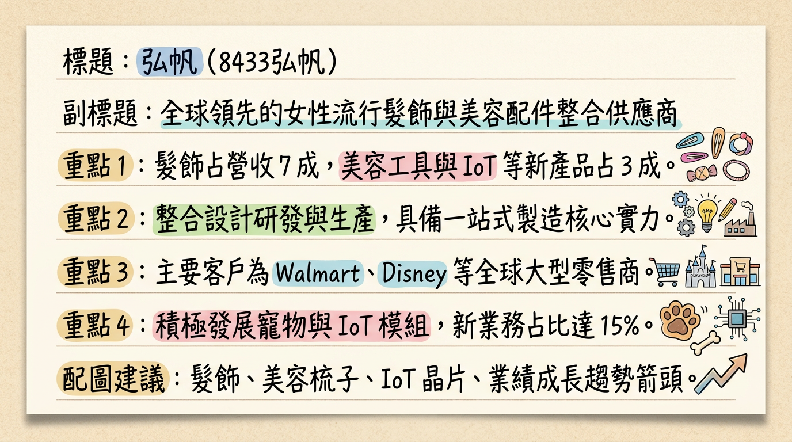
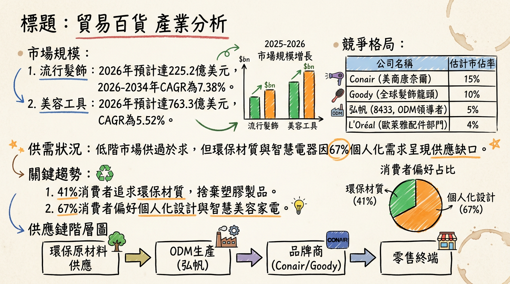
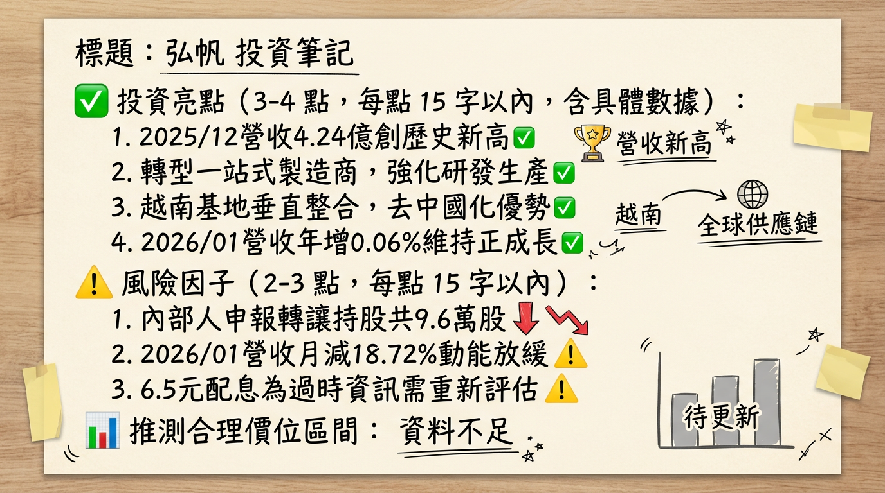

# 8433弘帆 深度研究報告

## 一句話摘要
弘帆正由「傳統貿易商」轉型為「一站式製造商」，雖面臨越南建廠與產品轉型的獲利陣痛期，但隨 2026 年 IoT 新產品放量與產能優化，營運有望走出 2025 年的低谷。

---

## 公司概覽
弘帆（8433）早期為傳統髮飾貿易商，目前已轉型為涵蓋設計、研發、生產、銷售的全方位供應商。主要客戶包含 Walmart、Target、Disney、Claire's 及 Primark 等全球零售龍頭。

**2025 年產品營收結構表：**
| 產品線 | 營收佔比 | 應用說明 |
| :--- | :--- | :--- |
| **流行髮飾與配件** | 60% - 70% | 髮圈、髮夾、髮箍（核心傳統業務） |
| **梳鏡美容工具** | 15% - 20% | 梳子、鏡子、化妝包 |
| **智慧化/多元新品** | 10% - 15% | IoT 模組、智慧美容電器、寵物用品 |

---

## 核心競爭優勢
1.  **「去中國化」先驅：** 2024 年 Q3 越南普世廠投產，建立從模具、射出到組裝的一站式生產鏈，有效規避中美貿易戰關稅風險。
2.  **智慧化研發能力：** 領先同業投入 IoT 模組開發，將傳統美容工具升級為具備傳感、溫控功能的智慧家電，大幅提升產品單價（ASP）。
3.  **強大零售通路滲透力：** 長期深耕北美一元店與快時尚通路，具備處理海量訂單與快速打樣的供應鏈韌性。

---

## 財務分析

**最近 6 個月月營收趨勢表：**
| 月份 | 營收金額 (億元) | 月增率 (MoM) | 年增率 (YoY) |
| :--- | :--- | :--- | :--- |
| **2026/01** | 3.45 | -18.72% | +0.06% |
| **2025/12** | 4.24 | +30.90% | +26.00% |
| **2025/11** | 3.24 | +5.77% | -4.63% |
| **2025/10** | 3.06 | +10.02% | +5.39% |
| **2025/09** | 2.78 | -7.87% | -7.84% |
| **2025/08** | 3.02 | +0.18% | -0.17% |

**年度趨勢速覽：**
*   **2024 全年：** 營收 36.1 億元，EPS 達 **9.84 元**。
*   **2025 全年：** 營收 34.86 億元（YoY -3.4%），預估 EPS **1.2 - 1.5 元**（2025 前三季累計僅 0.71 元，主因轉型成本與 Q2 業外損失）。

---

## 法說會重點（2025/12/24）
1.  **管理層 Guidance：** 預期 2026 上半年營收持平，下半年隨新產品放量帶動全年營收挑戰「雙位數成長」。
2.  **越南產能：** 2026 年重心在提升越南廠生產效率（目標提升 20%），藉此優化毛利率。
3.  **新業務：** 正式跨足 IoT 模組與美容家電 OBM 業務，目標將產品單價從「美分」級別提升至「美元」級別。

---

## 券商觀點
| 券商名 | 目標價 | 評等 | 日期 | 備註 |
| :--- | :--- | :--- | :--- | :--- |
| **FactSet 共識** | **62 元** | 中立/持有 | 2026/02 | 市場預期 2026 EPS 回升至 4.2-4.8 元 |
| **群益投顧** | **--** | 中立 (Neutral) | 2025/11 | 因核心獲利下滑調降評等 |
| **宏遠證券** | 110 元 | 買進 (過時) | 2024/07 | 數據已無參考價值，反映轉型前預期 |

---

## 財報深度分析

**利潤率趨勢表：**
| 季度 | 毛利率 (%) | 營業利益率 (%) | EPS (元) | 備註 |
| :--- | :--- | :--- | :--- | :--- |
| **2025 Q3** | 20.48 | 8.94 | 2.02 | 靠業外收益轉盈 |
| **2025 Q2** | 25.23 | 12.34 | -2.98 | 重大業外損失 |
| **2025 Q1** | 25.79 | 8.09 | 1.68 | -- |
| **2024 Q4** | 26.70 | 13.05 | 3.16 | -- |

*   **存貨分析：** 存貨週轉天數由 2024 年的 **2-6 天** 飆升至 2025 Q3 的 **18.19 天**，反映由「純貿易」轉為「原材料製造」的庫存積壓壓力。
*   **資本支出：** 2025 年主要投入越南廠自動化設備，導致折舊費用上升，短期拖累營業利益。

---

## 股權異動與資本結構
1.  **可轉債 (CB)：** **弘帆一 (84331)** 於 2026/03/07 到期，公司將按面額一次還本，現金壓力尚在可控範圍（負債比約 55%）。
2.  **內部人轉讓：** 2026/02 董事長及經理人小規模申報轉讓（共 96 張），2025 年下半年多為家族內部贈與轉讓。
3.  **股利預期：** 2025 年曾發 6.5 元高股息，但隨 2025 獲利衰退，預計 2026 年發放之股利將大幅下修。

---

## 產業分析

**全球市場與競爭格局比較：**
| 公司 | 產業地位 | 2025Q1-Q3 毛利率 | 核心競爭力 |
| :--- | :--- | :--- | :--- |
| **弘帆 (8433)** | **ODM 製造領先者** | **23.68%** | **越南一站式、IoT 模組開發** |
| Goody (美) | 全球髮飾龍頭 | -- | 強大零售通路、品牌力 |
| 高林 (2906) | 貿易代理 | 約 12% | 規模化服飾貿易 |
| 特力 (2908) | 零售/貿易 | 約 25% | 通路佈局廣、多元營運 |

*   **趨勢：** 全球髮飾市場 2026 年預計達 225 億美元。消費者轉向環保材質與智慧美容家電，對弘帆轉型 IoT 利基產品有利。

---

## 近期催化劑
*   **利多事件：**
    *   2025/12 營收創歷史新高（4.24 億元），顯示淡季不淡。
    *   越南廠 2026 年進入產能爬坡期，關稅紅利顯現。
*   **利空事件：**
    *   2026/01 營收月減 18.7%，需求回升力道待觀察。
    *   獲利結構受業外損益（匯率、CB 評價）影響大，本業不穩定。

---

## ⭐ 成長動能時間軸
*   **2024 Q3：** 越南普世廠正式營運，開啟「去中國化」產能佈局。
*   **2025 全年：** 資本支出高峰，進行自動化生產線建置與產品轉型。
*   **2026 Q1：** 正式跨足 **IoT 物聯網模組** 市場，應用於智慧居家與美妝周邊。
*   **2026 Q2-Q3：** 越南廠效率提升 20% 目標落實，毛利率力拼回升至 25% 以上水準。
*   **2026 Q4：** 高階美容電器 OBM 業務貢獻顯現，挑戰營收雙位數成長。

---

## 2026 展望
*   **成長動能：** 核心在於**「越南產能利用率」**與**「IoT 新品貢獻」**。隨大客戶（Walmart/Target）庫存去化完成，訂單將趨於穩定，且自有製造比重提升將有助於毛利率長期修復。
*   **風險：** 轉型初期的折舊與管理費用仍高；若全球消費疲軟，零售商砍單將直接衝擊本業；匯率波動對業外損益影響劇烈。

---

## 投資結論
1.  **營運落底回升：** 2025 年為營運最低谷，股價已部分反應 EPS 衰退利空，2026 年獲利預期將由 1.2-1.5 元回升至 4.2-4.8 元區間。
2.  **估值修復潛力：** 若 IoT 產品能順利切入歐美主流通路，市場將對其重新估值（由貿易商評價轉向智慧製造商評價）。
3.  **目標價區間建議：** 根據 FactSet 共識與 2026 獲利預估，給予 **50 - 65 元** 區間操作建議。需嚴格觀察毛利率是否能站穩 23% 並止跌回升。

---
*本報告由 AI 自動產生，資料來源為公開網路資訊，僅供參考，不構成投資建議。產生時間：2026-03-01 21:32*

---

## 📊 資訊卡

