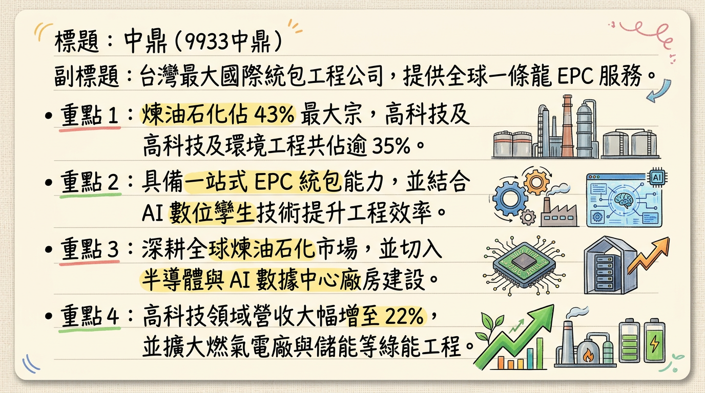
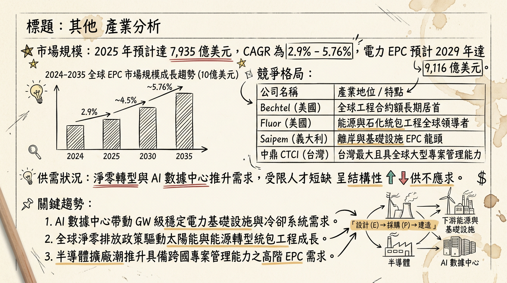
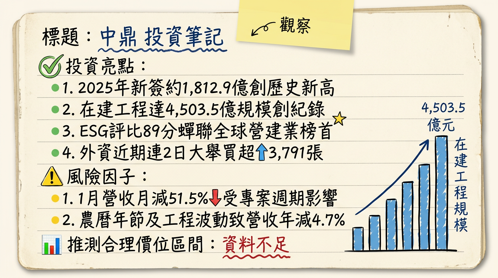

# 9933中鼎 中鼎 深度研究報告

## 一句話摘要
**「走出美案陰霾，在手訂單 4,500 億創歷史新高，2026 年進入獲利全面復甦與能源轉型收割期。」**

---

## 公司概覽
中鼎工程（CTCI）為台灣規模最大的國際統包工程公司（EPC），提供可行性研究、設計、採購、建造及維運的一條龍服務。

### 營收結構（依應用領域，2025年數據）
| 業務類別 | 營收佔比 | 核心內容 |
| :--- | :--- | :--- |
| **煉油石化** | 43% | 全球石化廠統包、煉油設施 |
| **高科技設施** | 22% | 半導體廠房、AI 數據中心、潔淨室 |
| **環境工程與基建** | 15~20% | 焚化爐（廢轉能）、海淡廠、再生水廠 |
| **電力工程** | 14% | 燃氣電廠、離岸風電、儲能設施 |

*註：2025 年新簽約額中，電力工程佔比一度高達 70%，預示未來兩年營收結構將向能源轉型傾斜。*

---

## 核心競爭優勢
1.  **全球工程管理能力：** 連續四年蟬聯標普永續年鑑「全球營建工程業」Top 1%，具備國際大型專案執行力。
2.  **數位轉型領先：** 導入 `CTCI Digital Twin` 與 AI 智慧平台，使工程錯誤率降低 20% 以上，縮短工期並優化報價。
3.  **綠色工程護城河：** 擁有全台最大公共工程「新竹海淡廠」及多座再生水廠實績，搶佔淨零排放商機。

---

## 財務分析

### 月營收趨勢表（近 6 個月）
| 月份 | 金額 (億元) | 月增率 MoM | 年增率 YoY | 備註 |
| :--- | :--- | :--- | :--- | :--- |
| **2026/01** | 56.07 | -51.5% | -4.74% | 季節性回檔與年節影響 |
| **2025/12** | 115.60 | +71.36% | -15.29% | 年底結案入帳高峰 |
| **2025/11** | 67.46 | +15.03% | -29.28% | |
| **2025/10** | 58.64 | -26.84% | -29.45% | |
| **2025/09** | 80.16 | +20.59% | -11.7% | |
| **2025/08** | 66.47 | +1.51% | -33.0% | |

### 年度趨勢預估
*   **2024 (實)：** 營收 1,196.9 億，EPS 2.43 元。
*   **2025 (估)：** 營收 897.92 億，EPS 約 0.5-1.0 元（受 Q1 美國 GCEH 案 31 億元一次性減損影響）。
*   **2026 (預)：** 營收有望回升至 1,000 億大關，法人預估 EPS 落在 2.5 - 3.2 元。

---

## 法說會重點
*   **在手訂單（Backlog）：** 截至 2025 年底達 **4,503.5 億元**，創下歷史新高。
*   **新簽約額：** 2025 全年達 **1,812.9 億元**，同步創高。
*   **未來商機：** 預計未來 12 個月潛在投標金額達 **9,820 億元**（含台灣 5,480 億、海外 4,340 億）。
*   **美國 GCEH 案：** 重整計畫已於 2025/08 生效，150 億元應收帳款確認請求權，未來將視產出進度逐步回沖。

---

## 券商觀點

| 券商名稱 | 目標價 | 評等 | 日期 | 備註 |
| :--- | :--- | :--- | :--- | :--- |
| **Fintel 綜合預測** | 52.49 元 | 買進/持有 | 2026/02/04 | 市場共識價 |
| **國泰投顧** | 38.0 元 | 中立轉看好 | 2025/11/10 | 考量美案風險淡化 |
| **元富證券** | 51.0 元 | 看多 | 2025/03/05 | **⚠️ 過時** (未計入 2025 減損) |
| **Factset 調查** | 55.0 元 | -- | 2024/07/22 | **⚠️ 過時** |

---

## 財報深度分析

### 利潤率趨勢表格
| 指標 | 2025 Q3 | 2025 Q2 | 2025 Q1 | 2024 Q4 |
| :--- | :--- | :--- | :--- | :--- |
| **毛利率** | 9.28% | 7.66% | ~10% (排除減損) | 7.82% |
| **營業利益率** | 7.16% | 5.89% | 負值 | 穩定 |
| **單季 EPS** | 0.85 元 | 0.32 元 | -1.52 元 | -- |

*   **存貨分析：** 存貨週轉率高達 148 次，存貨主要為待安裝材料，無堆積風險。
*   **應收帳款：** 週轉天數約 106 天。受 GCEH 案影響，部分帳款已重分類至「非流動資產」。
*   **資本支出：** 2023-2025 累計融資約 127 億，主要用於旗下「崑鼎」的綠能與水處理投資。

---

## 股權異動
*   **申報轉讓：** 2026/02/25 經理人彭俊賓、周書平分別申報轉讓 40 張與 20 張進行信託。
*   **贈與規劃：** 2026/01 經理人余俊彥贈與 79 張。顯示經營層近期多以稅務與股權信託規劃為主。
*   **可轉債（CB）：** 「中鼎二」(99332) 轉換價 **51.8 元**，目前股價（約 31.3 元）大幅折價，近期無轉換壓力。

---

## 產業分析

### 市場規模與競爭格局表
| 競爭對手 | 國家/地位 | 2025 表現 | 核心優勢 |
| :--- | :--- | :--- | :--- |
| **中鼎 (9933)** | **台灣最大 EPC** | **營收 ~918 億** | **綠色技術、電力 EPC** |
| Bechtel | 美國/全球領先 | 營收規模極大 | 大型複雜專案管理 |
| Fluor (福陸) | 美國 | 具 AI 估價技術 | 石化、電力 EPC |
| 聖暉 (6126) | 台灣同業 | 毛利 ~20% | 專攻高科技無塵室 |
| 漢唐 (2404) | 台灣同業 | 毛利 ~12% | 半導體廠房統包 |

---

## 近期催化劑
*   **利多：**
    1.  2026 Q1 獲利若展現 GCEH 重整後的轉盈能力。
    2.  台電通霄、大林發電機組大型專案入帳高峰。
    3.  與鴻海合作之 AI 數據中心機電工程進度推進。
*   **利空：**
    1.  美國 GEH 廠產能若未達標，150 億帳款回收延遲。
    2.  中東地緣政治波動影響當地石化標案進度。
    3.  高負債比（80.5%）帶來的利息支出壓力。

---

## ⭐ 成長動能時間軸
*   **2025 Q4 - 2026 Q1：** 電力工程進入施工高峰期，營收佔比顯著提升。
*   **2026 Q2：** 預計公告 2025 年配息，雖獲利回穩但配息可能因去年虧損而保守。
*   **2026 Q3：** 氫能儲存與輸送管線示範計畫啟動；AI 數據中心機電專案開始貢獻營收。
*   **2026 - 2030：** 台灣「以氣代煤」政策帶動 3,000 億電廠更新商機；國內 10 座焚化爐汰舊換新。

---

## 2026 展望
*   **成長動能：** 在手訂單達 4,503 億元，能見度達 3-5 年。電力、高科技、環保工程等「非石化」業務佔比提升，有助於分散單一產業風險並提升毛利。
*   **風險：** 雖 GCEH 案已重整，但實質現金回收仍需視該廠營運產出；全球缺工與物料通膨可能侵蝕固定總價合約之毛利。

---

## 投資結論
1.  **評價面優勢：** 目前股價位階（約 31.3 元）處於歷史淨值比低檔，已充分反映 2025 年美案呆帳利空。
2.  **營運轉折：** 2026 年為獲利回歸常軌之首年，預期 EPS 回升至 2.5 元以上。
3.  **訂單紅利：** 歷史新高的在手訂單為未來營收提供高度保證，「擇優接單」策略將拉高毛利率。
4.  **建議目標價區間：** 
    *   **短線觀察：** 35.0 - 38.0 元（反彈至法說會前水平）。
    *   **中長線目標：** 43.5 - 51.0 元（參考 Fintel 共識價與 2026 獲利預估）。

---
本報告由 AI 自動產生，資料來源為公開網路資訊，僅供參考，不構成投資建議。產生時間：2026-03-01 21:31

---

## 📊 資訊卡

